         Acrobat Distiller 6.0 (Windows)

         2004-01-21T10:47:28+05:30

         2004-01-21T10:49:59+05:30

         2004-01-21T10:49:59+05:30

         PScript5.dll Version 5.2

         uuid:5dac05bd-294b-498e-a6a1-778555d588be

         uuid:abe07c6c-5c3c-4a4c-88f8-9e7a5c6c8fc4

         xml

               djenter

               Microsoft PowerPoint - LN21(ValComp).ppt

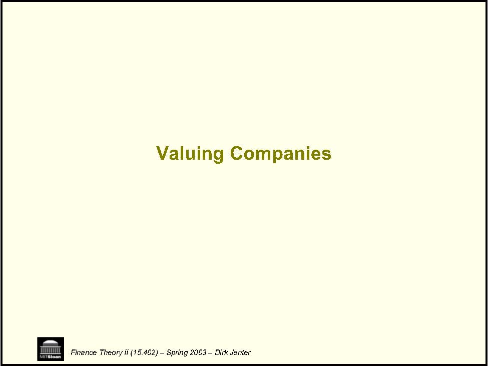

Valuing Companies Finance Theory II (15.402) – Spring 2003 – Dirk Jenter 

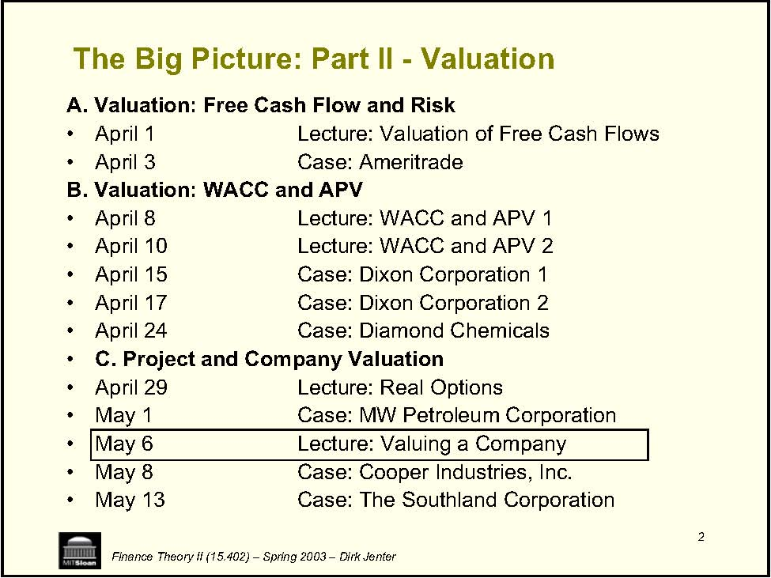

2 • • • • • • • • • • • • • Finance Theory II (15.402) – Spring 2003 – Dirk Jenter The Big Picture: Part II -Valuation A. Valuation: Free Cash Flow and Risk April 1 Lecture: Valuation of Free Cash Flows April 3 Case: Ameritrade B. Valuation: WACC and APV April 8 Lecture: WACC and APV 1 April 10 Lecture: WACC and APV 2 April 15 Case: Dixon Corporation 1 April 17 Case: Dixon Corporation 2 April 24 Case: Diamond Chemicals C. Project and Company Valuation April 29 Lecture: Real Options May 1 Case: MW Petroleum Corporation May 6 Lecture: Valuing a Company May 8 Case: Cooper Industries, Inc. May 13 Case: The Southland Corporation 

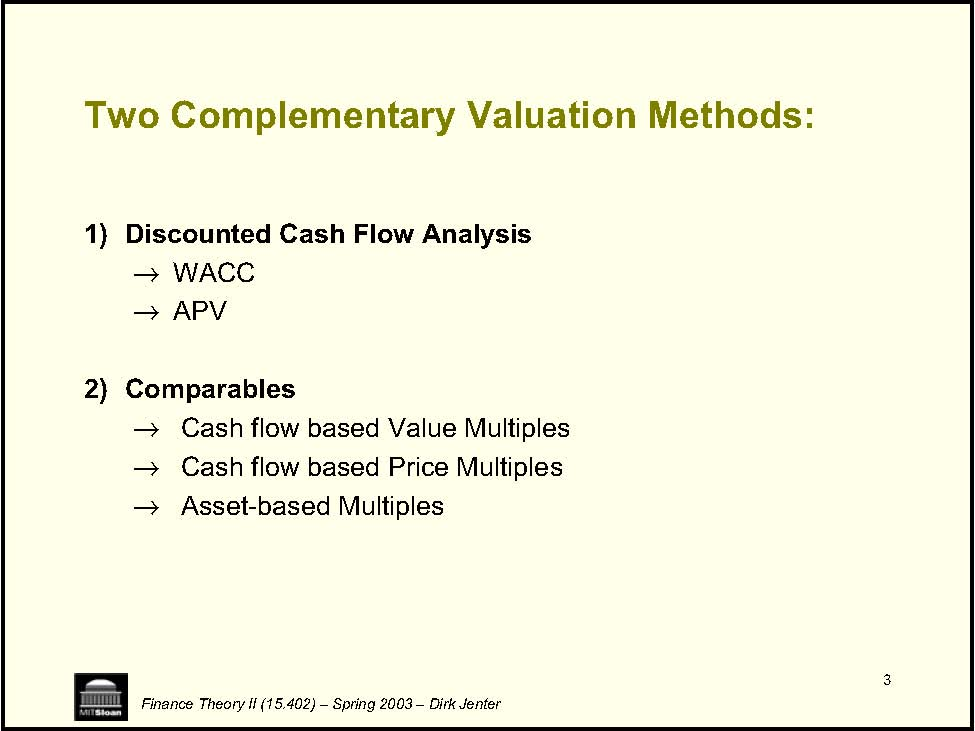

3 1) →WACC →APV →Cash flow based Value Multiples →→Asset-based Multiples Finance Theory II (15.402) – Spring 2003 – Dirk Jenter Two Complementary Valuation Methods: Discounted Cash Flow Analysis 2) Comparables Cash flow based Price Multiples 

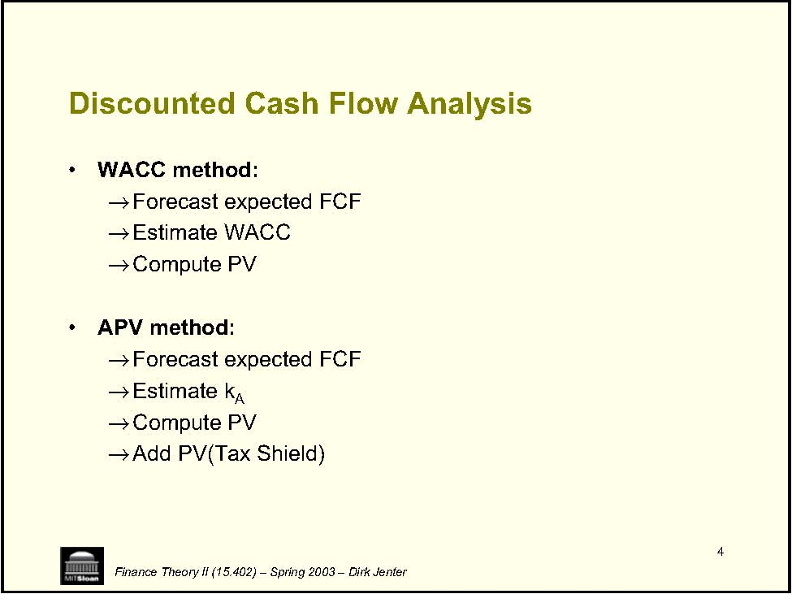

4 • →→→Compute PV • APV method: →→Estimate kA →Compute PV →Add PV(Tax Shield) Finance Theory II (15.402) – Spring 2003 – Dirk Jenter Discounted Cash Flow Analysis WACC method: Forecast expected FCF Estimate WACC Forecast expected FCF 

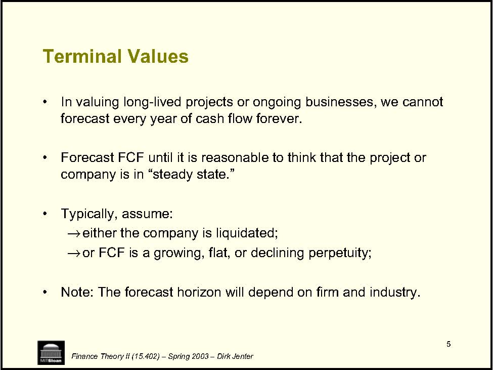

5 Terminal Values • • • →→• Finance Theory II (15.402) – Spring 2003 – Dirk Jenter In valuing long-lived projects or ongoing businesses, we cannot forecast every year of cash flow forever. Forecast FCF until it is reasonable to think that the project or company is in “steady state.” Typically, assume: either the company is liquidated; or FCF is a growing, flat, or declining perpetuity; Note: The forecast horizon will depend on firm and industry. 

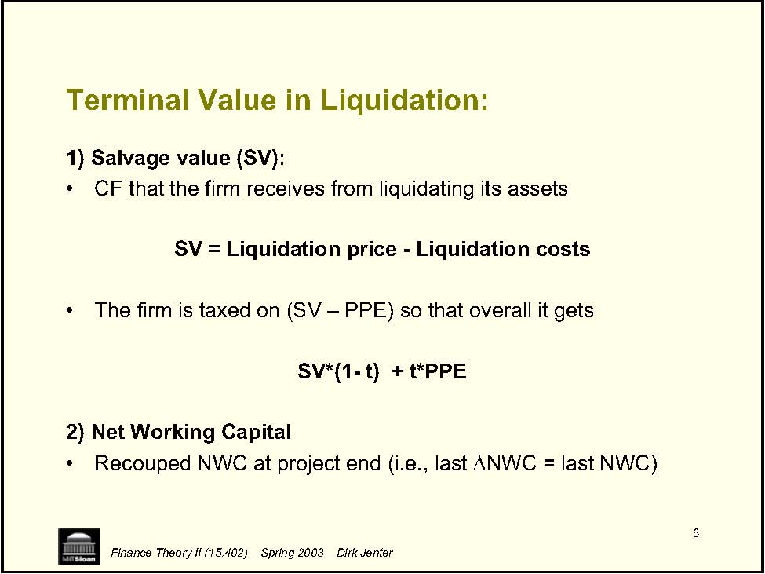

6 • • • ∆Finance Theory II (15.402) – Spring 2003 – Dirk Jenter Terminal Value in Liquidation: 1) Salvage value (SV): CF that the firm receives from liquidating its assets SV = Liquidation price -Liquidation costs The firm is taxed on (SV – PPE) so that overall it gets SV*(1-t)  + t*PPE 2) Net Working Capital Recouped NWC at project end (i.e., last NWC = last NWC) 

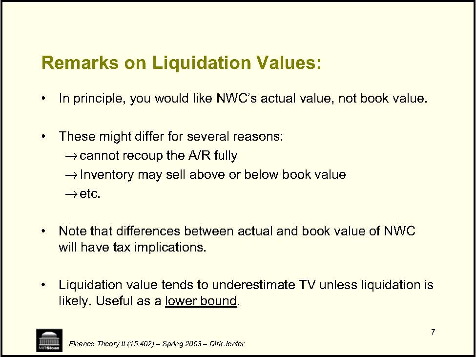

7 • • →→→etc. • • . Finance Theory II (15.402) – Spring 2003 – Dirk Jenter Remarks on Liquidation Values: In principle, you would like NWC’s actual value, not book value. These might differ for several reasons: cannot recoup the A/R fully Inventory may sell above or below book value Note that differences between actual and book value of NWC will have tax implications. Liquidation value tends to underestimate TV unless liquidation is likely. Useful as a lower bound

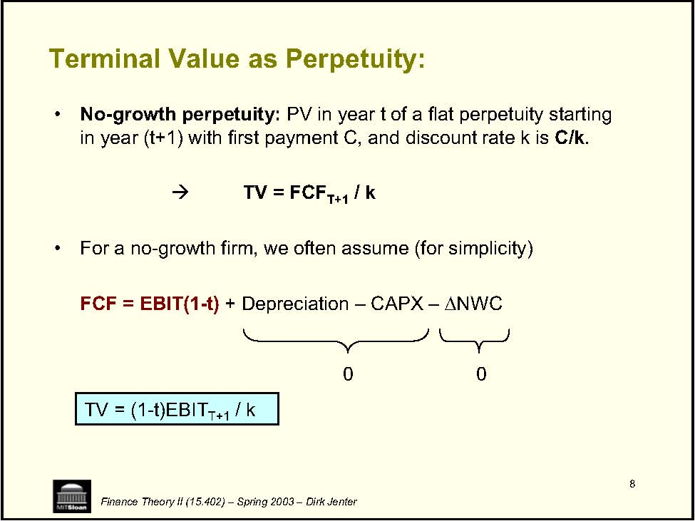

8 • C/k. Æ TV = FCF/ k • FCF = EBIT(1-t) ∆0 0 / k Finance Theory II (15.402) – Spring 2003 – Dirk Jenter Terminal Value as Perpetuity: No-growth perpetuity: PV in year t of a flat perpetuity starting in year (t+1) with first payment C, and discount rate k is T+1 For a no-growth firm, we often assume (for simplicity) + Depreciation – CAPX – NWC TV = (1-t)EBITT+1 

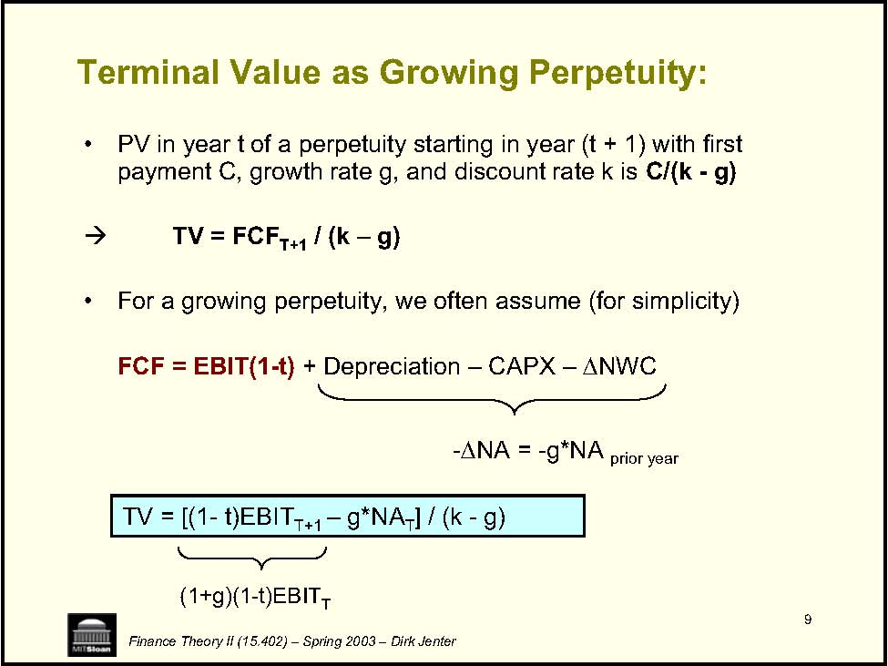

9 • Æ TV = FCFT+1 • FCF = EBIT(1-t) ∆-∆T(1+g)(1-t)EBITT Finance Theory II (15.402) – Spring 2003 – Dirk Jenter Terminal Value as Growing Perpetuity: PV in year t of a perpetuity starting in year (t + 1) with first payment C, growth rate g, and discount rate k is C/(k -g) / (k – g) For a growing perpetuity, we often assume (for simplicity) + Depreciation – CAPX – NWC NA = -g*NA prior year TV = [(1-t)EBITT+1 – g*NA] / (k -g) 

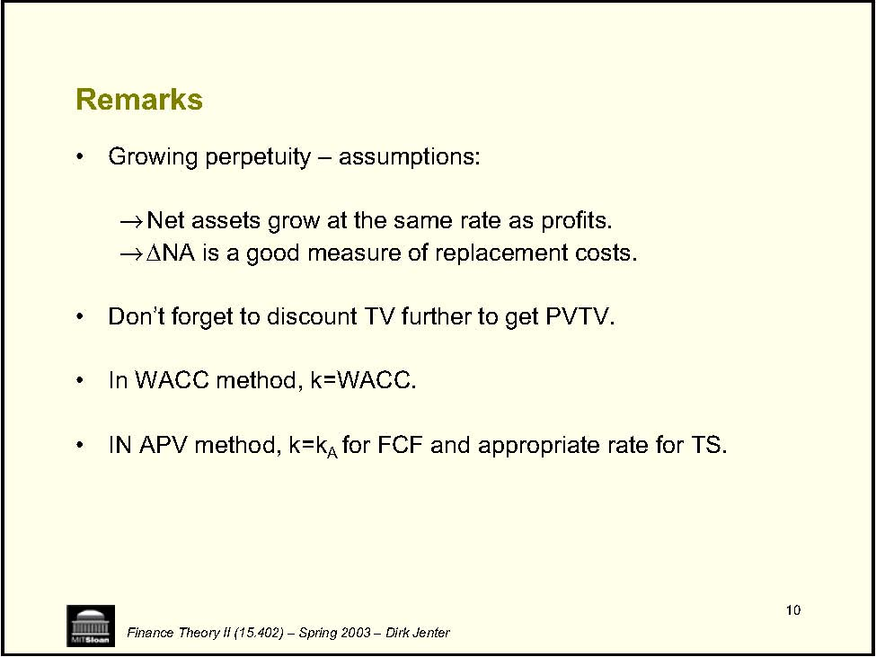

10 Remarks • →→∆• • • A Finance Theory II (15.402) – Spring 2003 – Dirk Jenter Growing perpetuity – assumptions: Net assets grow at the same rate as profits. NA is a good measure of replacement costs. Don’t forget to discount TV further to get PVTV. In WACC method, k=WACC. IN APV method, k=kfor FCF and appropriate rate for TS. 

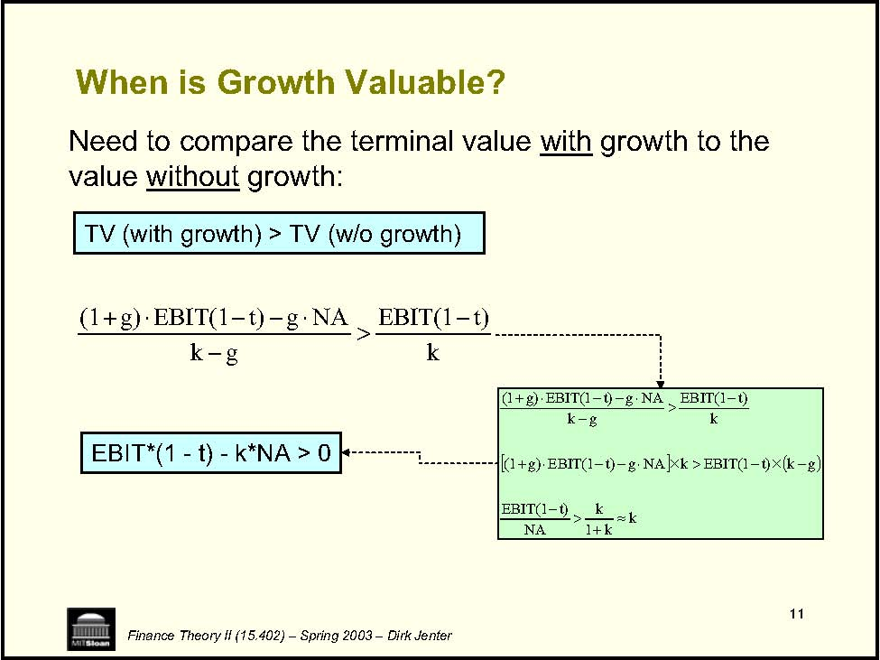

11 When is Growth Valuable? k t)EBIT(1 gk NAgt)(1 −&gt;−⋅−−⋅+k k1 k NA t)EBIT(1 gkt)EBIT(1kNAgt)(1 k t)EBIT(1 gk NAgt)(1 ≈+&gt;−−×−&gt;×⋅−−⋅+−&gt;−⋅−−⋅+Need to compare the terminal value with growth to the value without growth: Finance Theory II (15.402) – Spring 2003 – Dirk Jenter EBIT(1 g) EBIT(1 g) EBIT(1 g) TV (with growth) &gt; TV (w/o growth) EBIT*(1 -t) -k*NA &gt; 0 

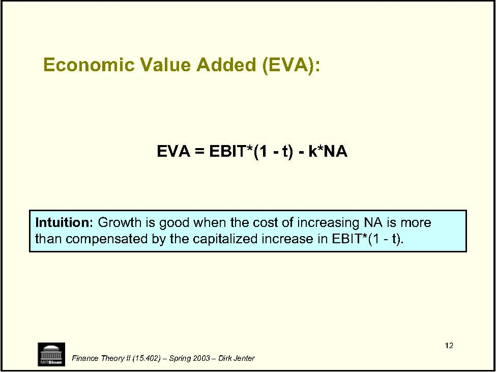

12 Finance Theory II (15.402) – Spring 2003 – Dirk Jenter Economic Value Added (EVA): EVA = EBIT*(1 -t) -k*NA Intuition: Growth is good when the cost of increasing NA is more than compensated by the capitalized increase in EBIT*(1 -t). 

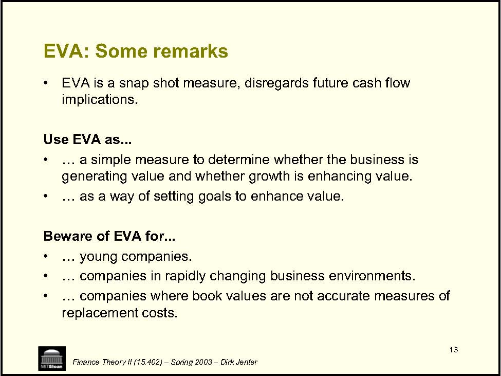

13 EVA: Some remarks • implications. • • • • • Finance Theory II (15.402) – Spring 2003 – Dirk Jenter EVA is a snap shot measure, disregards future cash flow Use EVA as... … a simple measure to determine whether the business is generating value and whether growth is enhancing value. … as a way of setting goals to enhance value. Beware of EVA for... … young companies. … companies in rapidly changing business environments. … companies where book values are not accurate measures of replacement costs. 

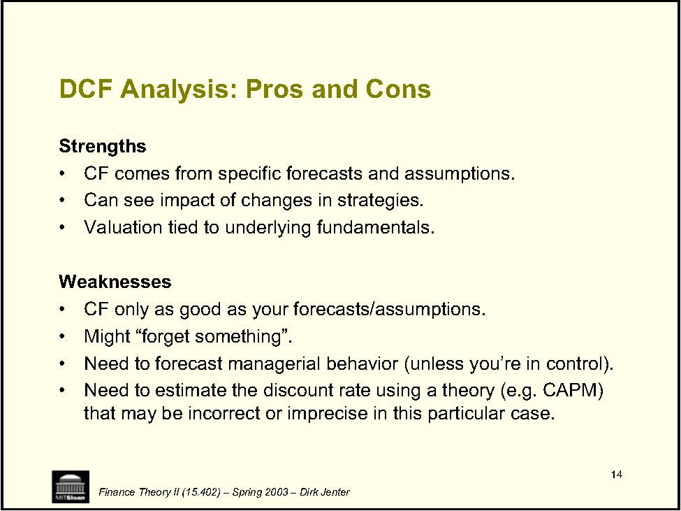

14 Strengths • • • • • • • Finance Theory II (15.402) – Spring 2003 – Dirk Jenter DCF Analysis: Pros and Cons CF comes from specific forecasts and assumptions. Can see impact of changes in strategies. Valuation tied to underlying fundamentals. Weaknesses CF only as good as your forecasts/assumptions. Might “forget something”. Need to forecast managerial behavior (unless you’re in control). Need to estimate the discount rate using a theory (e.g. CAPM) that may be incorrect or imprecise in this particular case. 

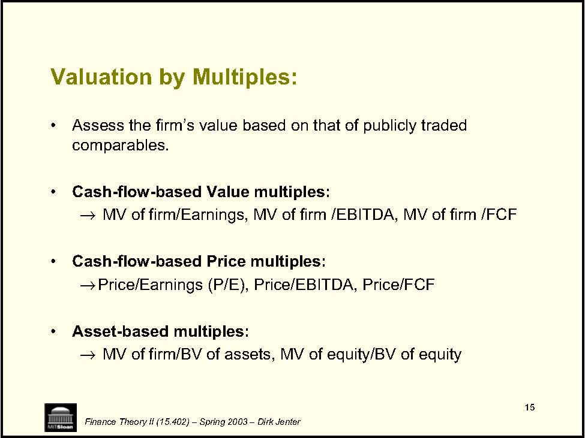

15 • • →• →• →Finance Theory II (15.402) – Spring 2003 – Dirk Jenter Valuation by Multiples: Assess the firm’s value based on that of publicly traded comparables. Cash-flow-based Value multiples: MV of firm/Earnings, MV of firm /EBITDA, MV of firm /FCF Cash-flow-based Price multiples: Price/Earnings (P/E), Price/EBITDA, Price/FCF Asset-based multiples: MV of firm/BV of assets, MV of equity/BV of equity 

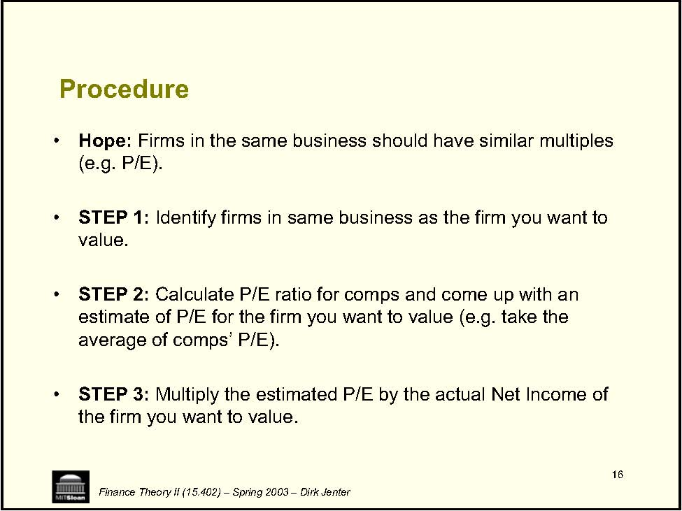

16 • Hope: • STEP 1: value. • STEP 2: average of comps’ P/E). • STEP 3: Finance Theory II (15.402) – Spring 2003 – Dirk Jenter Procedure Firms in the same business should have similar multiples (e.g. P/E). Identify firms in same business as the firm you want to Calculate P/E ratio for comps and come up with an estimate of P/E for the firm you want to value (e.g. take the Multiply the estimated P/E by the actual Net Income of the firm you want to value. 

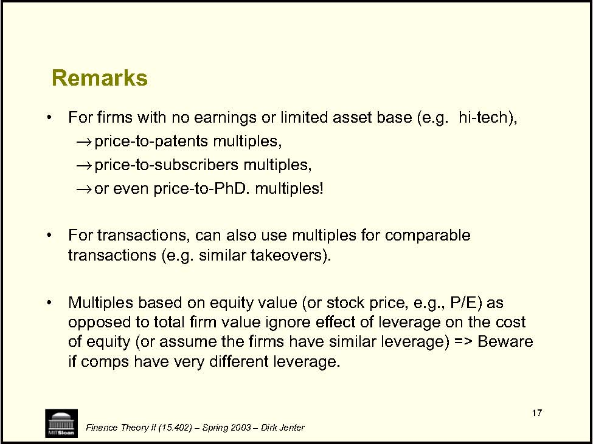

17 Remarks • →→price-to-subscribers multiples, →• • Finance Theory II (15.402) – Spring 2003 – Dirk Jenter For firms with no earnings or limited asset base (e.g.  hi-tech), price-to-patents multiples, or even price-to-PhD. multiples! For transactions, can also use multiples for comparable transactions (e.g. similar takeovers). Multiples based on equity value (or stock price, e.g., P/E) as opposed to total firm value ignore effect of leverage on the cost of equity (or assume the firms have similar leverage) =&gt; Beware if comps have very different leverage. 

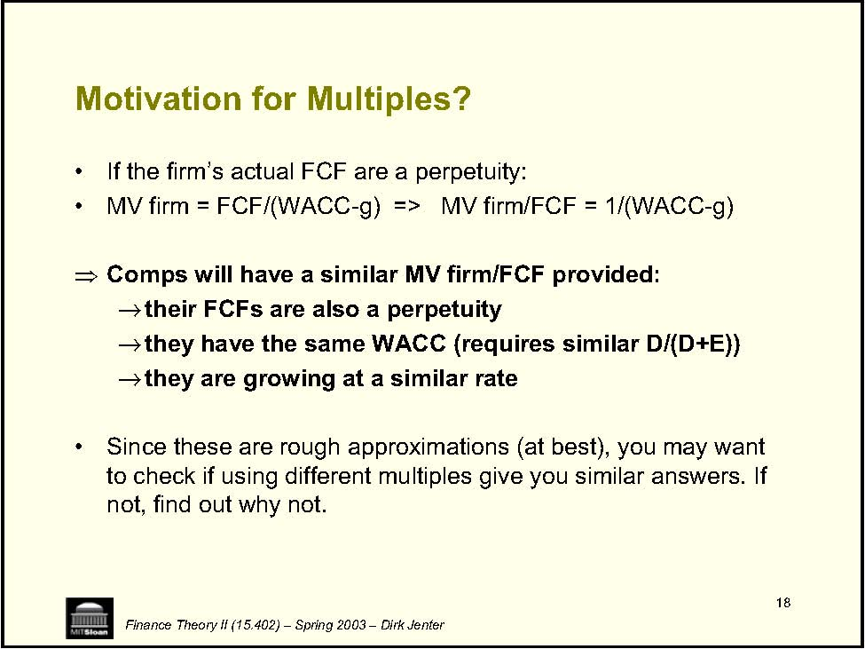

18 Motivation for Multiples? • • =&gt; Ÿ →→→• Finance Theory II (15.402) – Spring 2003 – Dirk Jenter If the firm’s actual FCF are a perpetuity: MV firm = FCF/(WACC-g)  MV firm/FCF = 1/(WACC-g) Comps will have a similar MV firm/FCF provided: their FCFs are also a perpetuity they have the same WACC (requires similar D/(D+E)) they are growing at a similar rate Since these are rough approximations (at best), you may want to check if using different multiples give you similar answers. If not, find out why not. 

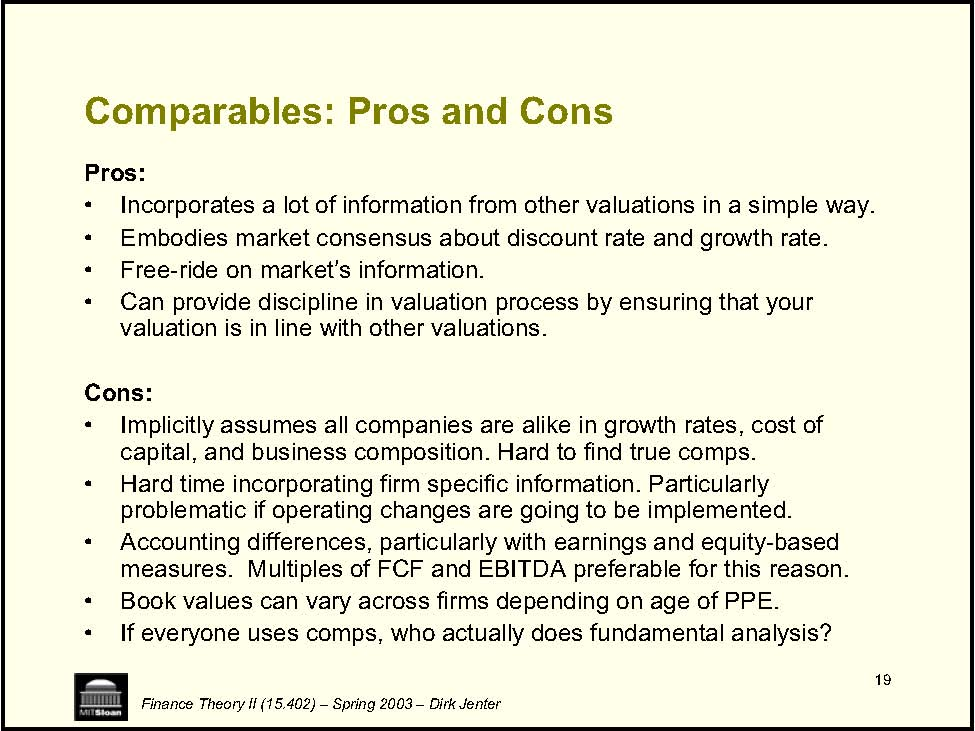

19 Comparables: Pros and Cons Pros: • • • • Cons: • • • measures. • • Finance Theory II (15.402) – Spring 2003 – Dirk Jenter Incorporates a lot of information from other valuations in a simple way. Embodies market consensus about discount rate and growth rate. Free-ride on market’s information. Can provide discipline in valuation process by ensuring that your valuation is in line with other valuations. Implicitly assumes all companies are alike in growth rates, cost of capital, and business composition. Hard to find true comps. Hard time incorporating firm specific information. Particularly problematic if operating changes are going to be implemented. Accounting differences, particularly with earnings and equity-based Multiples of FCF and EBITDA preferable for this reason. Book values can vary across firms depending on age of PPE. If everyone uses comps, who actually does fundamental analysis? 

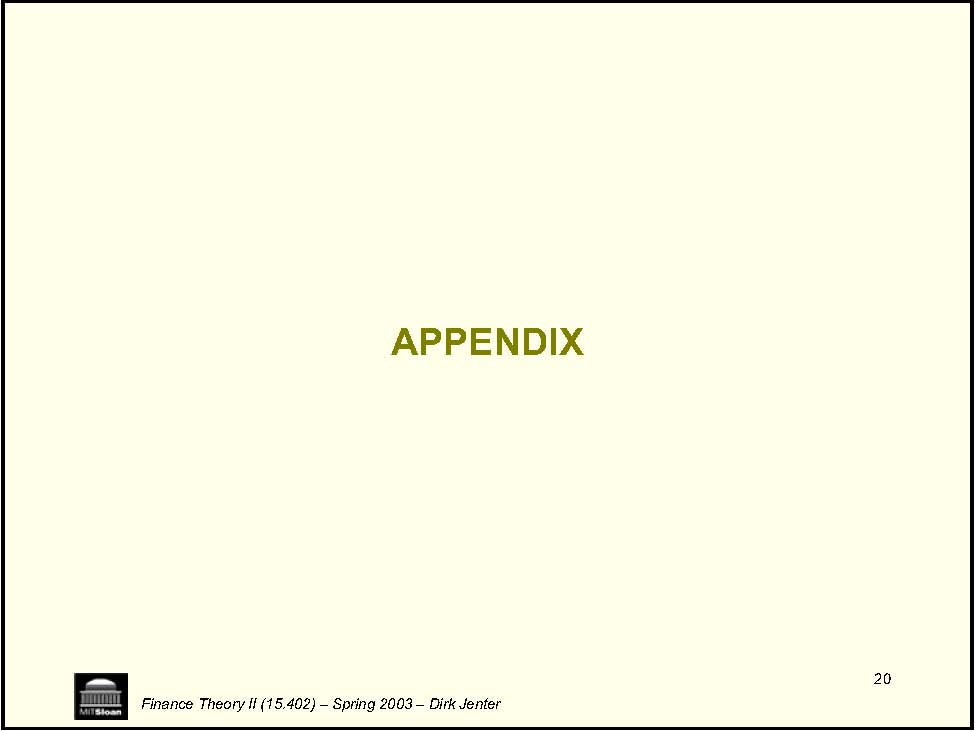

20 APPENDIX Finance Theory II (15.402) – Spring 2003 – Dirk Jenter 

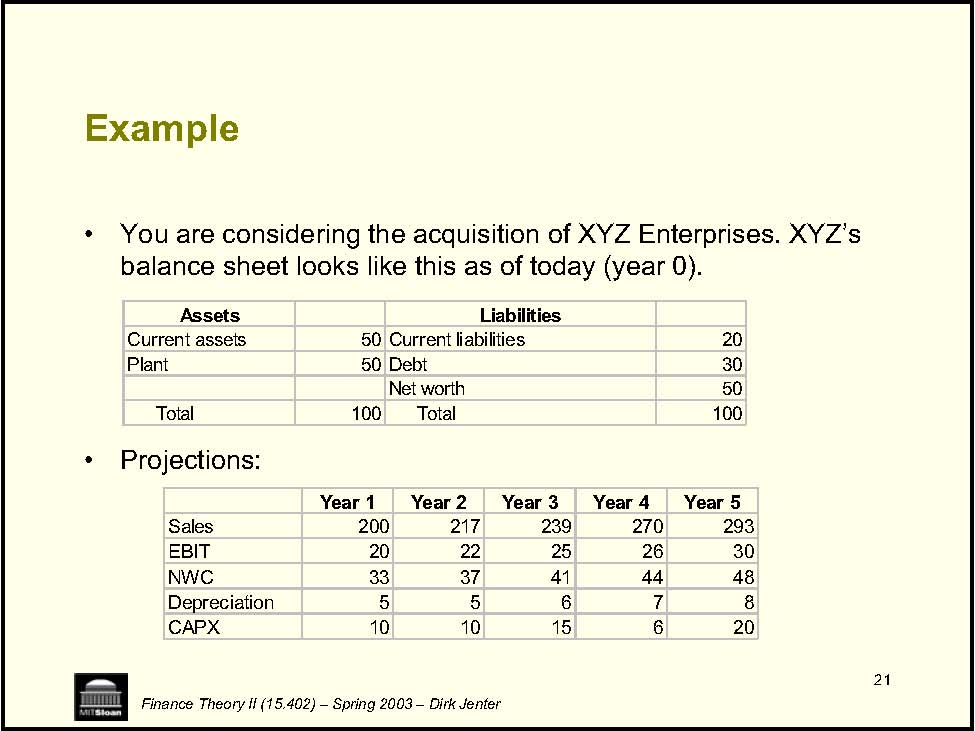

21 Example • • 20 50 30 22 25 26 30 5 5 6 7 8 10 15 6 Finance Theory II (15.402) – Spring 2003 – Dirk Jenter You are considering the acquisition of XYZ Enterprises. XYZ’s balance sheet looks like this as of today (year 0). Projections: Assets Liabilities Current assets 50 Current liabilities Plant Debt Net worth 50 Total 100 Total 100 Year 1 Year 2 Year 3 Year 4 Year 5 Sales 200 217 239 270 293 EBIT 20 NWC 33 37 41 44 48 Depreciation CAPX 10 20 

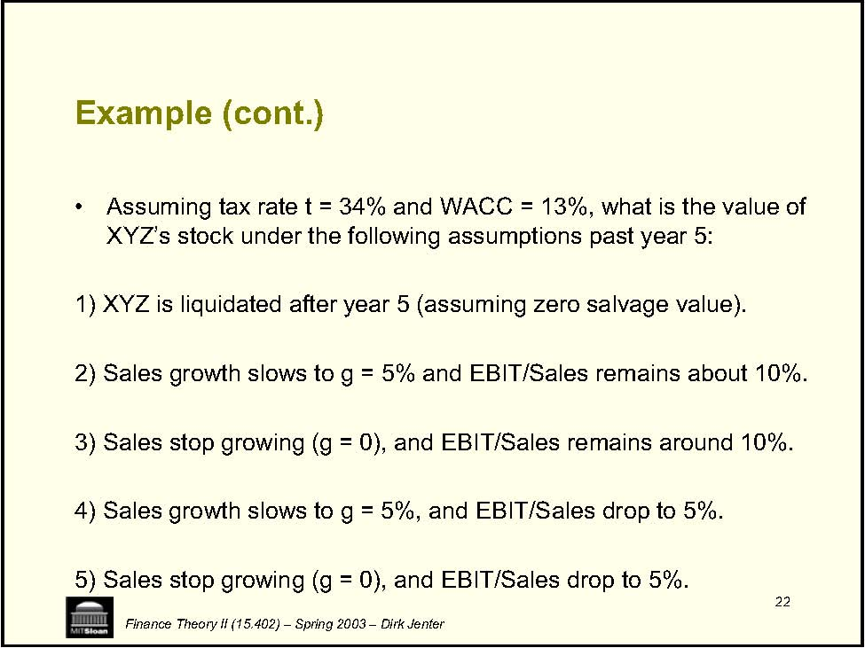

22 Example (cont.) • Finance Theory II (15.402) – Spring 2003 – Dirk Jenter Assuming tax rate t = 34% and WACC = 13%, what is the value of XYZ’s stock under the following assumptions past year 5: 1) XYZ is liquidated after year 5 (assuming zero salvage value). 2) Sales growth slows to g = 5% and EBIT/Sales remains about 10%. 3) Sales stop growing (g = 0), and EBIT/Sales remains around 10%. 4) Sales growth slows to g = 5%, and EBIT/Sales drop to 5%. 5) Sales stop growing (g = 0), and EBIT/Sales drop to 5%. 

Example (cont.) 

# Start by estimating FCF over 5 years: 

•	NWC(year 0) = Current assets -current liabs = 50-20=30 FCF = EBIT(1 -t) + Dep -CAPX -∆NWC 

<Table>
<TR>

<TH>Year 0 </TH>
<TH>Year 1 </TH>
<TH>Year 2 </TH>
<TH>Year 3 </TH>
<TH>Year 4 </TH>
<TH>Year 5 </TH>
</TR>
<TR>
<TH>EBIT </TH>

<TD>20 </TD>
<TD>22 </TD>
<TD>25 </TD>
<TD>26 </TD>
<TD>30 </TD>
</TR>
<TR>
<TH>EBIT(1-t) </TH>

<TD>13.2 </TD>
<TD>14.52 </TD>
<TD>16.5 </TD>
<TD>17.16 </TD>
<TD>19.8 </TD>
</TR>
<TR>
<TH>NWC </TH>
<TD>30 </TD>
<TD>33 </TD>
<TD>37 </TD>
<TD>41 </TD>
<TD>44 </TD>
<TD>48 </TD>
</TR>
<TR>
<TH>∆NWC </TH>

<TD>3 </TD>
<TD>4 </TD>
<TD>4 </TD>
<TD>3 </TD>
<TD>4 </TD>
</TR>
<TR>
<TH>Depreciation </TH>

<TD>5 </TD>
<TD>5 </TD>
<TD>6 </TD>
<TD>7 </TD>
<TD>8 </TD>
</TR>
<TR>
<TH>CAPX </TH>

<TD>10 </TD>
<TD>10 </TD>
<TD>15 </TD>
<TD>6 </TD>
<TD>20</TD>
</TR>
<TR>
<TH>  FCF </TH>

<TD>5.2 </TD>
<TD>5.52 </TD>
<TD>3.5 </TD>
<TD>15.16 </TD>
<TD>3.8 </TD>
</TR>
<TR>
<TH>PV @ 13% </TH>
<TD>22.7 </TD>

</TR>
</Table>

Finance Theory II (15.402) – Spring 2003 – Dirk Jenter 

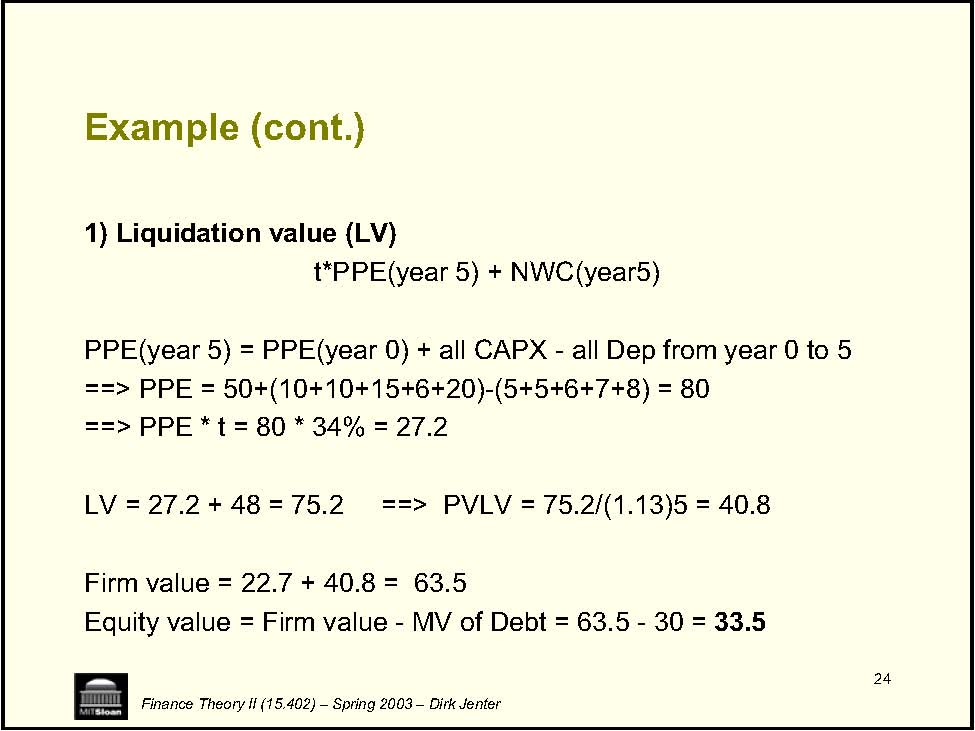

24 Example (cont.) ==&gt; 33.5 Finance Theory II (15.402) – Spring 2003 – Dirk Jenter 1) Liquidation value (LV) t*PPE(year 5) + NWC(year5) PPE(year 5) = PPE(year 0) + all CAPX -all Dep from year 0 to 5 ==&gt; PPE = 50+(10+10+15+6+20)-(5+5+6+7+8) = 80 ==&gt; PPE * t = 80 * 34% = 27.2 LV = 27.2 + 48 = 75.2     PVLV = 75.2/(1.13)5 = 40.8 Firm value = 22.7 + 40.8 = 63.5 Equity value = Firm value -MV of Debt = 63.5 -30 = 

25 Example (cont.) α= αα∆= 128 TV=[α5 Finance Theory II (15.402) – Spring 2003 – Dirk Jenter For 2) to 5), we need EBIT (year 6) and NA (year 5) to apply [EBIT(year 6)(1 -t) -g*NA(year 5)]/[k -g] EBIT(year 6) = fraction of Sales(year 6) *(1 + g)*Sales(year 5)= *(1 + g) *293 NA(year 5)= NA(year 0) +all CAPX -all Dep +all NWC from 0 to 5 = (100-20) + (10+10+15+6+20) -(5+5+6+7+8) +(3+4+4+3+4) *(1 +g)*293*(1-34%) -g*128] /(13%-g) and PVTV= TV/(1.13)

Example (cont.)

<Table>
<TR>

<TH>α</TH>
<TH>g </TH>
<TH>TV </TH>
<TH>PVTV </TH>
<TH>Firm </TH>
<TH>Equity </TH>
</TR>
<TR>
<TD>2) </TD>
<TD>10% </TD>
<TD>5% </TD>
<TD>173.8 </TD>
<TD>94.3 </TD>
<TD>117.0 </TD>
<TD>87.0 </TD>
</TR>
<TR>
<TD>3) </TD>
<TD>10% </TD>
<TD>0% </TD>
<TD>148.8 </TD>
<TD>80.7 </TD>
<TD>103.4 </TD>
<TD>73.4 </TD>
</TR>
<TR>
<TD>4) </TD>
<TD>5% </TD>
<TD>5% </TD>
<TD>46.9 </TD>
<TD>25.5 </TD>
<TD>48.2 </TD>
<TD>18.2 </TD>
</TR>
<TR>
<TD>5) </TD>
<TD>5% </TD>
<TD>0% </TD>
<TD>74.4 </TD>
<TD>40.4 </TD>
<TD>63.1 </TD>
<TD>33.1 </TD>
</TR>
</Table>

Finance Theory II (15.402) – Spring 2003 – Dirk Jenter 
