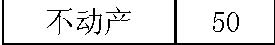
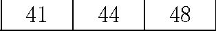
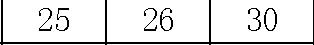
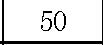

         Acrobat Distiller 6.0.1 (Windows)

         西安交通大学经济与金融学院

         D:20050430051044

         2005-04-30T13:11:37+08:00

         Acrobat PDFMaker 6.0 for Word

         2005-04-30T13:12:29+08:00

         2005-04-30T13:12:29+08:00

         uuid:b5228c05-83fa-492a-b431-bd63c9bbbd9f

         uuid:acb81b37-0e56-4908-a3b4-b3fa1b040b54

               3

         xml

               Part2第20部分

               wangweihua

公司评估 

概览：第二部分—价值评估 

A. 价值评估：自由现金流和风险 

·4.1     讲座：自由现金流价值评估 

·4.3     案例：Ameritrade 

B. 价值评估：加权平均资本成本（WACC）和现值调整（APV） 

·4.8     讲座：加权平均资本成本（WACC）和现值调整（APV）1 

·4.10    讲座：加权平均资本成本（WACC）和现值调整（APV）2 

·4.10    案例：Dixon公司1 

·4.17    案例：Dixon公司2 

·4.24    案例：Diamond化学公司 

C. 项目和公司价值评估 

·4.29   讲座：实物期权 

·5.1    案例：MW石油公司 

·5.6    讲座：公司价值评估 

·5.8    案例：Cooper工业有限公司 

·5.13   案例：Southland公司 

补充两个价值评估方法 

1）现金流贴现分析 

   →加权平均资本成本法（WACC） 

   →现值调整法（APV） 

2）可比较的 

   →以现金流为基础的价值乘数 

   →以现金流为基础的价格乘数 

   →资产乘数 

贴现现金流的分析 

· 加权平均资本成本法 

→预测未来的自由现金流 

    →估算加权平均资本成本 

    →计算现值 

· 现值调整法 

    →预测未来的自由现金流 

    →估算kA

    →计算现值 

    →增加的现值（税盾） 

终值 

· 评估周期较长的项目或正在营运的公司时，我们不可能永久的准确预测每年的现金流。 

· 只要合理地（或者最好猜想）认为公司已进入了“稳定”发展期，我们就可预测自由现金流。 

· 通常，假设： 

→公司被清算 

→或者自由现金流是不断增加的，稳定不变的，或是下降的，永续的； 

· 预测的水平将取决于公司或产业 

清算企业的终值 

1）残余价值（SV）： 

·资产清算后公司得到的现金流 

残值（SV）=清算价格－清算成本 

· 公司要对（清算价值－固定资产）纳税，因此合计得到 

           残值 ×（1－税率）＋ 税率×固定资产 

2）净营运资本 

· 项目完成时收回净营运资本（也就是，过去的净营运资本增加额 = 最终营运资本） 

注意事项： 

· 从理论上讲，你会偏好于净营运资本的实际价值，而非账面价值。 

· 这可能因具体情况而不同： 

   →不能收回全部应收账款 

   →存货售价高于或低于账面价值 

   →等等 

· 注意净运营资本（NWC）实际价值和账面价值的差异将会隐含税收的不同 

· 只要清算发生，价值清算往往低估终值。小幅度反弹当然更好 

永续年金终值 

· 零增长的永续年金：一均等支付永续年金在t＋1年首次支付C，贴现率是k，其现值PV就是C/k。 

→   终值（TV）=（t+1）期自由现金流╱贴现率（k） 

· 对于一个增长率为零的公司，我们经常假定（简单） 

自由现金流 = 息税前利润×（1－税率）＋折旧－资本性支出－净营运资本的增加值 

                                          0               0 

终值（TV）=（t＋1）期息税前利润×（1－税率）╱贴现率（k） 

增长型永续年金的终值 

· 一永续年金在t＋1年首次支付C，以后每年增长幅度为g，贴现率为k，其现值PV就是C/（k－g）。 

→  终值（TV）=（t+1）期自由现金流╱（贴现率－增长率） 

· 对于增长型的公司，我们经常假定（简单） 

自由现金流 = 息税前利润×（1－税率）＋折旧－资本性支出－净营运资本的增加值（△NWC）   

                   净资产的增加值（△NA）= －增长率（g）×t年以前的净资产（NA） 

       （1＋增长率）（1－税率）×t期息税前利润 

注意事项 

·增长型永续年金—假设： 

   →净资产增长率同利润增长率相同。 

   →净资产的增加值能较好的测度代替成本。 

· 不要忘记通过贴现终值进而得到终值的现值。 

· 加权平均资本成本法中，贴现率(k)=加权平均资本成本。 

· 在现值调整法中，贴现率=kA是作为自由现金流的贴现率，也是作为税盾的合 

适贴现率。 

终值（TV）=[（t+1）期息税前利润×（1－税率）－增长率（g）×t年的净资产（NA）] ╱（贴现率－增长率） 

何时的增长是有价值的？ 

需要比较增长性公司和非增长型公司的终值： 

                                     (1)g+⋅−

                                              −

经济增加值（EVA）： 

经济增加值（EVA）= 息税前利润（ EBIT）×(1－利率t)－贴现率k×净资产（NA） 

终值（增长型公司）﹥终值（非增长型公司）

直觉判断：当增加净资产的成本能很好的被增加收入的价值 [ EBIT×（1－t）]所补偿时，增长是有利的。 

 EBIT×(1－t)－k×NA

经济增加值（EVA）：一些注意事项 

· 经济增加值（EVA）是一种快速有效的方法，无论未来的现金流如何。 

使用经济增加值作为 

· …一个简单的方法确定经营是否产生了价值和增长是否提高了价值。 

· …作为制定价值增值目标的一种方法。 

应特别小心，经济增加值（EVA）应用于… 

· …新公司 

· …处于快速变化的商业环境中的公司 

· …帐面价值不能准确反映替代成本的公司 

现金流贴现分析：利与弊 

优点 

· 现金流以特定的预测和假设为基础 

· 能使我们看到战略变化带来的影响 

· 价值评估同公司基本面紧密联系 

缺点 

· 如果你的预测（假设）相当好，现金流就同样好 

· 可能忘记某些事情 

· 需要预测管理者的行为（除非你有控制权） 

· 需要运用理论（如，资本资产定价模型CAPM）测算贴现率，这种测算在某些特定情况下可能不正确或不精确 

运用乘数评估价值： 

· 公司价值评估以可比较的公众公司价值为基础 

· 以现金流为基础的价值乘数： 

→公司的市场价值（MV）/收益（E），公司的市场价值（MV）/折旧及摊销前的盈余（EBITDA），公司的市场价值（MV）/自由现金流（FCF） 

· 以现金流为基础的价格乘数： 

→价格（P）/收益（E），价格（P）/折旧及摊销前的盈余（EBITDA），价格（P）/自由现金流（FCF） 

· 资产乘数 

→公司的市场价值（MV）/资产的帐面价值（BV），股票的市场价值（MV）/股票面值（BV） 

步骤 

· 预期：做同一业务的公司应当有相似的乘数（如，市盈率P/E）。 

· 第一步：找出有相同业务的公司作为你的评估对象。 

· 第二步：计算参照公司的市盈率，并为你所评估的公司提出一个市盈率预期（如，取参照公司市盈率P/E的平均值）。 

· 第三步：用你所评估公司的实际净收入乘以预期的市盈率P/E。 

注意事项 

· 对于无收益或实物资产有限的公司（如，高科技公司）， 

⊕价格—专利乘数， 

⊕价格—捐赠乘数， 

⊕甚至价格—博士乘数！ 

· 对于业务，也可以在可比较的业务中应用乘数（如，相似的周转率）。 

· 乘数以权益资本价值（或股票价格，如市盈率P/E）为基础，而不是公司整体价值，忽略了杠杆效应对权益资本成本的影响（或假设所有公司有相似的杠杆效应）→如果公司有不同的杠杆水平，应特别小心。 

引进乘数出自于什么考虑？ 

· 如果公司的实际自由现金流是永续的： 

· 公司的市场价值（MV）=自由现金流（FCF）/（加权平均资本成本WACC－增长率g） 

公司的市场价值（MV）/自由现金流（FCF）= 1/（加权平均资本成本WACC－增长率g） 

假如满足以下条件，参照公司间有相似的：公司市场价值（MV）/自由现金流（FCF）： 

   →它们的自由现金流也是永续的 

 →它们有相同的加权平均资本成本（要求有相似的负债率D/（D＋E）） 

→它们有相似的增长率g 

· 因为它们大体上相近（充其量），你可以去核实是否用不同的乘数会得出相似的结果，如果不能，发现为什么。 

相互比较法：利与弊 

利： 

· 用简单的方法融入许多其他价值评估方法的信息 

· 使市场对贴现率、增长率的一致评价具体化。 

· 充分利用市场信息 

· 能提供评估原则，确保你的评估与其他人的评估相一致 

弊： 

· 简单的假设所有公司在成长性、资本成本、商业地位、杠杆效应方面具有相似性 

· 难以融入公司特有的信息。特别是公司经营改变时出现的问题。 

· 会计上的不同。特别是收益和权益资本政策，由于这一原因，存在自由现金流（FCF）乘数和折旧及摊销前的盈余（EBITDA）偏好。 

· 各个公司的帐面价值会因固定资产使用年限的不同而变化。 

· 如果每个人都运用可参照公司作比较，那谁来做实际上的基础性分析呢？ 

附录 

案例 

· 你考虑兼并XYZ公司。 XYZ 公司当前的资产负债表如下（0年） 

<Table>

<TR>
<TD>

资产 

</TD>
<TD>

负债 

</TD>
</TR>
<TR>
<TD>

流动资产 

</TD>
<TD>

50 

</TD>
<TD>

流动负债 

</TD>
<TD>

20 

</TD>
</TR>
<TR>
<TD>

不动产 

</TD>
<TD>

50 

</TD>
<TD>

长期负债 

</TD>
<TD>

30 

</TD>
</TR>
<TR>
<TD>

</TD>
<TD>

</TD>
<TD>

净财富 

</TD>
<TD>

50 

</TD>
</TR>
<TR>
<TD>

合计 

</TD>
<TD>

100 

</TD>
<TD>

合计 

</TD>
<TD>

100 

</TD>
</TR>

</Table>

· 项目营运状况 

<Table>

<TR>
<TD>

</TD>
<TD>

第1年

</TD>
<TD>

第2年

</TD>
<TD>

第3年

</TD>
<TD>

第4年

</TD>
<TD>

第5年 

</TD>
</TR>
<TR>
<TD>

销售收入 

</TD>
<TD>

200 

</TD>
<TD>

217 

</TD>
<TD>

239 

</TD>
<TD>

270 

</TD>
<TD>

293 

</TD>
</TR>
<TR>
<TD>

息税前利润 

</TD>
<TD>

20 

</TD>
<TD>

22 

</TD>
<TD>

25 

</TD>
<TD>

26 

</TD>
<TD>

30 

</TD>
</TR>
<TR>
<TD>

净营运资本 

</TD>
<TD>

33 

</TD>
<TD>

37 

</TD>
<TD>

41 

</TD>
<TD>

44 

</TD>
<TD>

48 

</TD>
</TR>
<TR>
<TD>

折旧 

</TD>
<TD>

5 

</TD>
<TD>

5 

</TD>
<TD>

6 

</TD>
<TD>

7 

</TD>
<TD>

8 

</TD>
</TR>
<TR>
<TD>

资本性支出 

</TD>
<TD>

10 

</TD>
<TD>

10 

</TD>
<TD>

15 

</TD>
<TD>

6 

</TD>
<TD>

20 

</TD>
</TR>

</Table>

案例（续） 

-  在下列的假设条件下，XYZ公司股票的价值： 

1）5年后清算XYZ公司（假设残值为零） 

2）销售增长率降到g = 5%，息税前利润/销售收入仍为10%。 

3）销售停止增长（g = 0），息税前利润/销售收入仍为10%。 

4）销售增长率降到g = 5%，息税前利润/销售收入降为5%。 

5）销售停止增长（g = 0），息税前利润/销售收入降为5%。 

案例（续） 

从估计5年的自由现金流开始 

-  净营运资本（0年）=流动资产-流动负债=50-20=30 

  自由现金流=息税前利润*（1-税率）+折旧-资本性支出-净营运资本增加额 

<Table>

<TR>
<TD>

</TD>
<TD>

第0年

</TD>
<TD>

第1年

</TD>
<TD>

第2年

</TD>
<TD>

第3年

</TD>
<TD>

第4年 

</TD>
<TD>

第5年 

</TD>
</TR>
<TR>
<TD>

息税前利润 

</TD>
<TD>

</TD>
<TD>

20 

</TD>
<TD>

22 

</TD>
<TD>

25 

</TD>
<TD>

26 

</TD>
<TD>

30 

</TD>
</TR>
<TR>
<TD>

息税前利润（1-税率）

</TD>
<TD>

</TD>
<TD>

13.2

</TD>
<TD>

14.52

</TD>
<TD>

16.5

</TD>
<TD>

17.16 

</TD>
<TD>

19.8 

</TD>
</TR>
<TR>
<TD>

净营运资本 

</TD>
<TD>

30 

</TD>
<TD>

33 

</TD>
<TD>

37 

</TD>
<TD>

41 

</TD>
<TD>

44 

</TD>
<TD>

48 

</TD>
</TR>
<TR>
<TD>

净营运资本增加额 

</TD>
<TD>

</TD>
<TD>

3 

</TD>
<TD>

4 

</TD>
<TD>

4 

</TD>
<TD>

3 

</TD>
<TD>

4 

</TD>
</TR>
<TR>
<TD>

折旧 

</TD>
<TD>

</TD>
<TD>

5 

</TD>
<TD>

5 

</TD>
<TD>

6 

</TD>
<TD>

7 

</TD>
<TD>

8 

</TD>
</TR>
<TR>
<TD>

资本性支出 

</TD>
<TD>

</TD>
<TD>

10 

</TD>
<TD>

10 

</TD>
<TD>

15 

</TD>
<TD>

6 

</TD>
<TD>

20 

</TD>
</TR>
<TR>
<TD>

自由现金流 

</TD>
<TD>

</TD>
<TD>

5.2

</TD>
<TD>

5.52

</TD>
<TD>

3.5

</TD>
<TD>

15.16 

</TD>
<TD>

3.8 

</TD>
</TR>
<TR>
<TD>

现值贴现率(13%) 

</TD>
<TD>

22.7

</TD>
<TD>

</TD>
<TD>

</TD>
<TD>

</TD>
<TD>

</TD>
<TD>

</TD>
</TR>

</Table>

案例（续） 

1）清算价值（lv） 

税率×固定资产（5年）＋净营运资本（5年） 

固定资产（5年）= 固定资产（第0年）+所有资本性支出—折旧（第0年到第5年） 

固定资产=50+（10+10+15+6+20）-（5+5+6+7+8）=80 

固定资产×税率=80×34%=27.2 

5=40.8 

公司价值=22.7+40.8=63.5 

权益资本价值=公司价值-负债的市场价值=63.5-30=33.5 

案例(续) 

   从表格的第二到第五项,我们需要息税前利润（6年)和净资产（5年)的数据去应用： 

［息税前利润（６年）×（１－税率）－增长率(g)×净资产（５年）］／（贴现率－增长率） 

息税前利润（６年）＝销售收入（６年）的α部分  

         ＝a×（１＋增长率）× 销售收入（５年） 

       ＝a×（１＋增长率）×２９３ 

净资产（５年）＝净资产（０年）＋所有的资本性支出－所有的减值＋０到５年的净营运资本增加值 

＝(100-20)＋(10+10+15+6+20)－(5＋5＋6＋7＋8) 

＋（3＋4＋4＋3＋4）＝１２８ 

终值（TV）= [α×（1＋g）×293×(1－34%)－g×128]/(13%－g) 

终值的现值（PVTV）＝ 终值／(１.13)5 

案例(续) 

<Table>

<TR>
<TD>

</TD>
<TD>

α 

</TD>
<TD>

增长率 

</TD>
<TD>

终值 

</TD>
<TD>

终值的现值

</TD>
<TD>

公司价值

</TD>
<TD>

权益资本价值

</TD>
</TR>
<TR>
<TD>

2) 

</TD>
<TD>

10% 

</TD>
<TD>

5% 

</TD>
<TD>

173.8 

</TD>
<TD>

94.3 

</TD>
<TD>

117 

</TD>
<TD>

87 

</TD>
</TR>
<TR>
<TD>

3) 

</TD>
<TD>

10% 

</TD>
<TD>

0% 

</TD>
<TD>

148.8 

</TD>
<TD>

80.7 

</TD>
<TD>

103.4 

</TD>
<TD>

73.4 

</TD>
</TR>
<TR>
<TD>

4) 

</TD>
<TD>

5% 

</TD>
<TD>

5% 

</TD>
<TD>

46.9 

</TD>
<TD>

25.5 

</TD>
<TD>

48.3 

</TD>
<TD>

18.2 

</TD>
</TR>
<TR>
<TD>

5) 

</TD>
<TD>

5% 

</TD>
<TD>

0% 

</TD>
<TD>

74.4 

</TD>
<TD>

40.4 

</TD>
<TD>

63.1 

</TD>
<TD>

33.1 

</TD>
</TR>

</Table>
