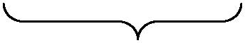
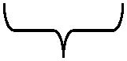
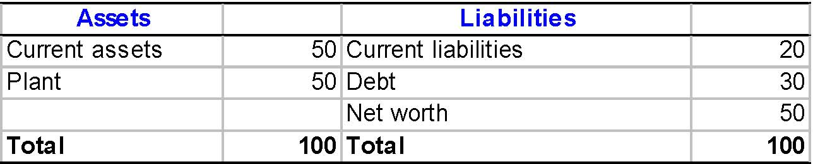
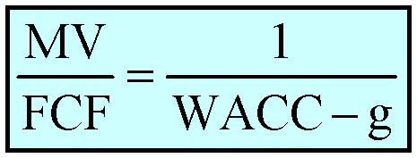
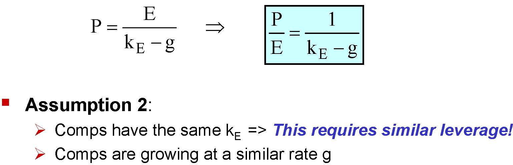
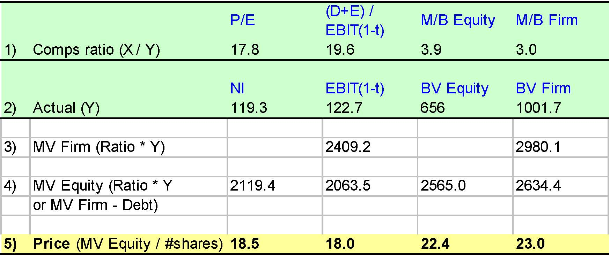
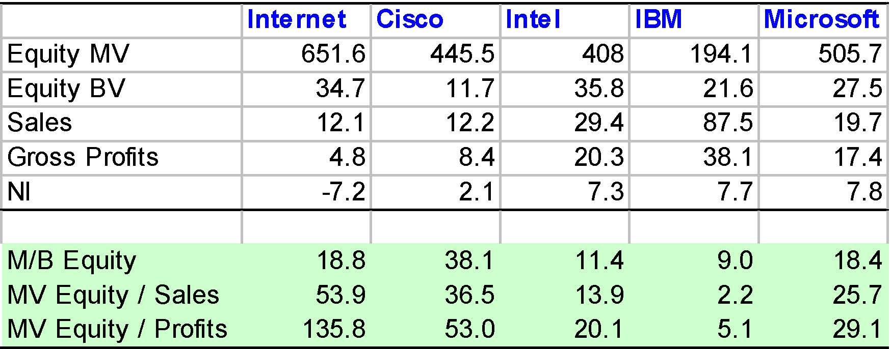
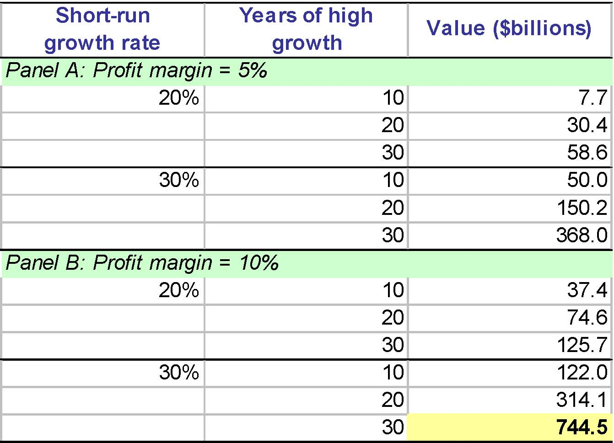

         Acrobat Distiller 6.0 (Windows)

         Compaq

         Compaq

         Acrobat PDFMaker 6.0 for PowerPoint

         2004-01-22T11:35:21+05:30

         2004-01-22T11:34:10+05:30

         2004-01-22T11:35:21+05:30

         uuid:73657b46-7898-421a-a1b7-24e67c27a9d8

         uuid:8068ba45-1083-4aa2-ac6b-db50b5df1530

         xml

               No Slide Title

               Leslie A. Larocca

Valuing Companies

Katharina Lewellen

Finance Theory II

May 5, 2003

Valuing companies

- Familiar valuation methods

- Discounted Cash Flow Analysis

- Comparables

- Real Options

- Some new issues

- Do we value assets or equity?

- Terminal values (liquidation, going concern)

- Minority interests, controlling interests

DCF Analysis

- WACC method:

- Forecast expected FCF

- Estimate WACC

- Compute PV

- APV method:

- Forecast expected FCF

- Estimate kA

- Compute PV

- Add PV(Tax Shield)

Value Assets or Equity?

- DCF methods give you the value of the whole firm (D + E) or Enterprise Value.

- E.g., you are founding a new firm: you will receive D from creditors and E from shareholders.

- Often, you need to value the Equity Valuein an existing firm 

- E.g., M&amp;A, IPOs

- You need to subtract the value of its existing debt D

- Also, need to add the value of control when valuing a controlling equity position (more on this later).

Terminal Values

- In valuing long-lived projects or ongoing businesses, we don’t typically forecast every year of cash flow forever.

- Forecast FCF until it is reasonable (or best guess) to think that the project or company is in “steady state.”

- Typically, assume:

- either the company is liquidated;

- or FCF is a growing, flat, or declining, perpetuity;

- Note: The forecast horizon will depend on firm and industry.

Terminal Value in Liquidation

1) Salvage value (SV):

- CF that the firm receives from liquidating its assets

SV = Liquidation price -Liquidation costs

- The firm is taxed on (SV –PPE) so that overall it gets

SV*(1-t)  + t*PPE

2) Net Working Capital

- Recouped NWC at project end (i.e., last∆NWC = last WC)

Remarks

- In principle, you would like NWC’sactual value, not book value.

- These might differ for instance:

- cannot recoup full A/R,

- Inventory sells over or below book value

- etc.

- Liquidation value tends to underestimate TV unless liquidation is likely. Useful as a lower bound.

Terminal Value as Perpetuity

- No-growth perpetuity

TV = FCFT+1/ k

- For a no-growth firm, we can assume (for simplicity)

FCF = EBIT(1-t)+ Depreciation –CAPX –∆NWC

00

TV = EBIT(1-t)T+1/ k

Terminal Value as Growing Perpetuity

- PV in year t of a perpetuity growing at a rate g

TV = FCFT+1/ (k –g)

- For a growing perpetuity, we can assume (for simplicity)

FCF = EBIT(1-t)+ Depreciation –CAPX –∆NWC

-∆NA = -g*NA prior year

(1+g)EBIT(1-t)T

TV = [EBIT(1-t)T+1 –g*NAT] / (k -g)

Terminal Value as Perpetuity (Summary)

TV

FCF

TT+1    … 

EBIT(t-1)No growth

EBIT(t-1) -∆NAGrowth @ g

FCFT+1/ k

FCFT+1/ (k –g)

g*NAT

Remarks

- Growing perpetuity -assumptions

- Net assets grow at the same rate as profits

- ∆NA is a good measure of replacement costs

- Don’t forget to discount TV further to get PVTV

- In WACC method, k=WACC

- IN APV method, k=kA for FCF and appropriate rate for TS

Example

- You are considering the acquisition of XYZ Enterprises. XYZ’sbalance sheet looks like this as of today (year 0).

- Projections:

AssetsLiabilitiesCurrent assets50Current liabilities20Plant50Debt30Net worth50Total100Total100

Year 1Year 2Year 3Year 4Year 5Sales200217239270293EBIT2022252630NWC3337414448Depreciation55678CAPX101015620

Example (cont.)

What is the value of XYZ’sstock under the following assumptions:

1) XYZ is liquidated after year 5 (assuming zero salvage value).

2) Sales growth and EBIT/Sales ratios are (past year 5):

Sales growthEBIT/Sales5%10%0%10%5%5%0%5%

Tax rate = 34%, and WACC = 13%.

Example (cont.)

Start by estimating FCF over 5 years:

- NWC(year 0) = Current assets -current liabs= 50-20=30

FCF = EBIT(1 -t) + Dep-CAPX -∆NWC

Year 0Year 1Year 2Year 3Year 4Year 5EBIT2022252630EBIT(1-t)13.214.5216.517.1619.8NWC303337414448∆NWC34434Depreciation55678CAPX101015620     FCF5.25.523.515.163.8PV @ 13%22.7

Example –Liquidation Value (LV)

1) Liquidation value (LV)

t*PPE(year 5) + NWC(year5)

PPE(year 5) = PPE(year 0) + all CAPX -all Depfrom year 0 to 5

PPE = 80

PPE * t = 80 * 34% = 27.2

LV = 27.2 + 48 = 75.2     ==&gt;  PVLV = 75.2/(1.13)5= 40.8

Firm value = 22.7 + 40.8 =  63.5

Equity value = Firm value -MV of Debt = 63.5 -30 = 33.5

Example (cont.)

For 2) to 5), we need EBIT (year 6) and NA (year 5) to apply

TV = [EBIT(year 6)(1 -t) -g*NA(year 5)]/[k -g]

EBIT(year 6)= fraction αof Sales(year 6)

= α*(1 + g)*Sales(year 5)= α*(1 + g) *293

NA(year 5)= NA(year 0) +all CAPX -all Dep+all ∆NWC from 0 to 5

=  128

PVTV= TV/(1.13)5

Example (cont.)

αgTVPVTVFirmEquity2)10%5%173.8     94.3       117.0     87.0       3)10%0%148.8     80.7       103.4     73.4       4)5%5%46.9       25.5       48.2       18.2       5)5%0%74.4       40.4       63.1       33.1       

When is Growth Valuable?

kt)EBIT(1gkNAgt)EBIT(1g)(1−&gt;−⋅−−⋅+kk1kNAt)EBIT(1gkt)EBIT(1kNAgt)EBIT(1g)(1kt)EBIT(1gkNAgt)EBIT(1g)(1≈+&gt;−−×−&gt;×⋅−−⋅+−&gt;−⋅−−⋅+EBIT*(1 -t) -k*NA &gt; 0

 TV (w/o growth)">

TV (with growth) &gt; TV (w/o growth)

Economic Value Added (EVA)

EVA = EBIT*(1 -t) -k*NA

Intuition:Growth is good when the cost of increasing NA is more than compensated by the capitalized increase in EBIT*(1 -t).

Remarks

- EVA is a particular incarnation of NPV (+ some assumptions)

- Appeal of EVA coherent measure for Capital budgeting, Performance evaluation and Managerial compensation.

- Assumes linear relationship between NA and EBIT*(1 -t)

- EVA has nothing to do with sustainable growth:

- Sustainable growth rate answers “How fast can I grow without increasing my leverage ratio or issuing equity?”

- It has nothing to say about whether growing is good or not.

EVA: Bottom Line

Use EVA as...

- a simple measure to determine whether the business is generating value and whether growth is enhancing value

- as a way of setting goals to enhance value

Beware of EVA for...

- young companies

- companies in rapidly changing business environments

- companies where book values are not accurate measures of replacement costs

DCF Analysis: Pros and Cons

Strengths

- CF comes from specific forecasts and assumptions

- Can see impact of changes in strategies

- Valuation tied to underlying fundamentals

Weaknesses

- CF only as good as your forecasts/assumptions

- Might “forget something”

- Need to forecast managerial behavior (unless you’re in control)

- Need to estimate the discount rate using a theory (e.g., CAPM) that may be incorrect or imprecise in this particular case

Multiples

- Assess the firm’s value based on that of publicly traded comps.

- Cash-flow-based Value multiples:

- MV of firm/Earnings, MV of firm /EBITDA, MV of firm /FCF

- Cash-flow-based Price multiples:

- Price/Earnings (P/E), Price/EBITDA, Price/FCF

- Asset-based multiples:

- MV of firm/BV of assets, MV of equity/BV of equity

Procedure

- Hope:Firms in the same business should have similar multiples (e.g., P/E).

- STEP 1:Identify firms in same business as the firm you want to value.

- STEP 2:Calculate P/E ratio for comps and come up with an estimate of P/E for the firm you want to value (e.g. take the average of comps’ P/E).

- STEP 3:Multiply the estimated P/E by the actual Net Income of the firm you want to value.

Motivation for Multiples?

- Assumption 1:  Comps’ actual FCF are a perpetuity

                 gWACCFCFMV⇒−=FCFMV

Assumption 2:Comps have the same WACC (requires similar D/(D+E))Comps are growing at a similar rate g

gWACC1−=

Motivation for Multiples?

- Assumption 1:

- E = CF to shareholders

- E is a perpetuity

                 gkEPE⇒−=Assumption 2:Comps have the same kE  =&gt; This requires similar leverage!Comps are growing at a similar rate ggk1EPE−=

Remarks

- For firms with no earnings or limited asset base (e.g.  hi-tech),

- price-to-patents multiples,

- price-to-subscribers multiples,

- or even price-to-Ph.D. multiples!

- Since these are rough approximations (at best) 

- One may want to check different multiples

- See if some multiples are quite constant across firms

Example: Valuing ADI

EBITtax rateNet incomeBV equityBV liabs# sharesADI (Dec. 1995)163.625%119.3656.0345.7114.5ADIBurr-BrownLinearTechno.MaximIntegratedProductsSiliconixMotorolaMeanw/o ADIROE18.2%16.3%25.5%23.4%26.8%16.1%21.6%Liabs/Assets34.5%29.0%16.9%22.1%56.6%51.5%35.2%5-year growth in sales14.3%9.9%32.2%43.1%14.0%20.3%23.9%P/E14.225.830.315.218.920.9(D+E)/EBIT(1-t)16.326.630.318.324.223.1Market-to-Book equity2.36.67.14.13.04.6Market-to-Book firm1.95.65.72.32.03.5

Example (cont.)

- There is no exact science to come up with appropriate multiples.The following is only an example. Need experience and guts.

- ADI’s5-year sales growth is less than average

- Shade down estimate of P/E and (D+E)/EBIT*(1 -t) w.r.t. mean

- P/E = 20.9*(1 -15%) = 17.8   

- (D+E)/EBIT*(1 -t) = 23.1*(1 -15%) = 19.6

- ADI’sROE is less than average

- Shade down estimate of M/B equity and M/B firm w.r.t. mean

- M/B equity = 4.6*(1 -15%) = 3.9

- M/B firm = 3.5*(1 -15%) = 3.0

Example (cont.)

P/E(D+E) /          EBIT(1-t)M/B EquityM/B Firm1)Comps ratio (X / Y)17.819.63.93.0NIEBIT(1-t)BV EquityBV Firm2)Actual (Y)119.3122.76561001.73)MV Firm (Ratio * Y)2409.22980.14)MV Equity (Ratio * Y2119.42063.52565.02634.4or MV Firm - Debt)5)Price (MV Equity / #shares)18.518.022.423.0

Comparables: Pros and Cons

Pros:

- Simple + lots of information

- Market consensus about discount rate and growth rate.

- Free-ride on market’s information.

Cons:

- Assumes that companies are alike in growth, costs of capital, business composition, leverage

- Hard to find true comps

- Hard to incorporate firm specific information

- Accounting differences

- If everyone uses comps, who actually does fundamental analysis?

Comps &amp; the Conglomerate Discount

- Is the value of a conglomerate equal to the sum of its parts?

- Calculate Firm Value / Assets for the conglomerate

- For each of its business segments (in annual report), calculate median Firm Value / Assets for single segment firms in that industry

- Add up these comps, weighting by the share of the conglomerate’sassets in that industry

- Result: On average, conglomerates are worth 12% less than the sum of their parts.

Possible Interpretations

- Conglomerates are an inefficient form of organization

- The stock market doesn’t get it

- The comparables method doesn’t work

Distribution of Price / Sales ratios for Internet stocks (March 2000)

Internet Stocks0%5%10%15%20%25%30%35%525456585105125145165185205225245265Price / Sales% of firms

Distribution of Price / Sales ratios for all stocks 

(March 2000)

All Stocks0%10%20%30%40%50%13579111315171921232527Price / Sales% of firms

Internet stocks and selected high-tech stocks 

(March 2000, in $billions)

InternetCiscoIntelIBMMicrosoftEquity MV651.6445.5408194.1505.7Equity BV34.711.735.821.627.5Sales12.112.229.487.519.7Gross Profits4.88.420.338.117.4NI-7.22.17.37.77.8M/B Equity18.838.111.49.018.4MV Equity / Sales53.936.513.92.225.7MV Equity / Profits135.853.020.15.129.1

What growth and margin assumptions would have justified Internetvaluation in March 2000?

Assumptions: Discount rate = 10%, long-term growth = 6%

Short-run         growth rateYears of high growthValue ($billions)20%107.72030.43058.630%1050.020150.230368.020%1037.42074.630125.730%10122.020314.130744.5Panel A: Profit margin = 5%Panel B: Profit margin = 10%
