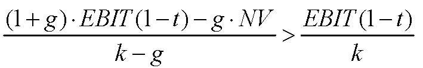

         Acrobat Distiller 6.0.1 (Windows)

         西安交通大学经济与金融学院

         D:20050429212438

         2005-04-30T05:25:38+08:00

         Acrobat PDFMaker 6.0 for Word

         2005-04-30T05:26:36+08:00

         2005-04-30T05:26:36+08:00

         uuid:5a29a652-b245-4375-9c18-1934214d2eee

         uuid:58673f15-5745-48a2-8e55-57667f8515b0

               2

         xml

               公 司 评 估 

               wangweihua

公 司 价 值 评 估 

财务理论（二） 

凯兹瑞纳·理崴伦 

2003. 5.  5 

公司价值评估 

- ◆ 熟悉的价值评估方法 

☆ 现金流贴现分析 

☆ 比较法 

☆ 实物期权 

- ◆ 一些新问题 

☆ 我们评估资产价值还是评估股票价值？ 

☆ 终值（清算，继续经营） 

☆ 少数人利益，控制权利益  

现金流贴现分析 

- ◆ 加权平均资本成本法 

☆ 预测未来的自由现金流 

☆ 估算加权平均资本成本 

☆ 计算现值 

- ◆ 现值调整法 

☆ 预测未来的自由现金流 

☆ 估算kA  

☆ 计算现值 

☆ 增加的现值（税盾） 

评估资产价值还是权益资本价值？ 

- ◆ 现金流贴现法能使你评估整个公司或者企业的价值（负债+股本） 

☆ 例如: 建立一个新公司：你将从债权人那里得到债务资本，从股东那里得到权益资本 

- ◆ 通常，你需要评估一家现存公司权益资本的价值 

☆ 例如，并购，首次公开发行 

☆ 你要减去公司债务的价值D 

- ◆ 当评价控制性股东的地位时（后来更多的考虑这点），需增加控制权     

的价值 

终值 

- ◆ 评估周期较长的项目或正在营运的公司时，我们不可能永久的准确预   

测每年的现金流 

- ◆ 只要合理地（或者最好猜想）认为公司已进入了“稳定”发展期，我  

们就可预测自由现金流。 

- ◆ 通常，假设： 

☆ 公司被清算； 

☆ 或者自由现金流是不断增加的，稳定不变的，或是下降的，永续的； 

- ◆ 注释：预测的水平将取决于公司或产业 

清算企业的终值 

1）残余价值（SV）： 

- ◆ 资产清算后公司得到的现金流 

- ◆  

残值（SV）=清算价格－清算成本 

- ◆ 公司要对（清算价值－固定资产）纳税，因此合计得到 

       残值 ×（1－税率）＋ 税率×固定资产 

2）净营运资本 

- ◆ 项目完工时收回净营运资本（也就是，过去的净营运资本增加额 = 最   

终营运资本） 

注意事项： 

- ◆ 从理论上讲，你更偏好于净营运资本的实际价值，而非账面价值 

- ◆ 这可能因具体情况而不同： 

☆ 不能收回全部应收账款 

☆ 存货售价高于或低于账面价值 

☆ 等等 

◆只要清算发生，价值清算往往低估终值。小幅度反弹当然更好 

永续年金的终值 

- ◆ 零增长的永续年金 

终值（TV）=（t+1）期自由现金流╱贴现率（k） 

- ◆ 对于一个零增长的公司，我们经常假定（简单） 

自由现金流 = 息税前利润×（1－税率）＋折旧－资本性支出－净营运资本的增加值 

                0              0 

终值（TV）=（t＋1）期息税前利润×（1－税率）╱贴现率（k）

增长型永续年金的终值 

- ◆ 增长率为g的永续年金在t年的现值 

终值（TV）=（t+1）期自由现金流╱（贴现率－增长率） 

- ◆ 对于增长型的公司，我们经常假定（简单） 

   自由现金流 = 息税前利润×（1－税率）＋折旧－资本性支出－净营运资本的增加值（△NWC） 

-净资产的增加值（△NA）= －增长率（g）×t年以前的净资产（NA） 

（1＋增长率）（1－税率）×t期息税前利润 

终值（TV）=[（t+1）期息税前利润×（1－税率）－增长率（g）×t年的净资产（NA）] ╱（贴现率－增长率） 

永续年金的终值（归纳） 

           t 期                            t+1期   

         终值(TV)                       自由现金流量（FCF） 

↓                                ↓                 

自由现金流量（t+1）/利率               息税前利润（税率－1）                  增长率为0 

自由现金流量（t+1）/（贴现率－增长率） 息税前利润（税率－1）－净资产增加值    增长率为g 

                                                       增长率(g)×t期净资产增加值 

注意事项  

- ◆ 增长型永续年金-假设 

☆ 净资产增长率同利润增长率相同 

☆ 净资产的增加值能较好的测度代替成本 

◆ 不要忘记通过贴现终值进而得到终值的现值。 

◆ 加权平均资本成本法中，贴现率(k)=加权平均资本成本。 

◆ 在现值调整法中，贴现率=kA是作为自由现金流的贴现率，也是作为税盾的合适贴现率。 

案例 

◆ 你考虑兼并XYZ公司。 XYZ 公司当前的资产负债表如下（0年） 

<Table>

<TR>
<TD>

资产 

</TD>
<TD>

负债 

</TD>
</TR>
<TR>
<TD>

流动资产 

</TD>
<TD>

50 

</TD>
<TD>

流动负债 

</TD>
<TD>

20 

</TD>
</TR>
<TR>
<TD>

不动产 

</TD>
<TD>

50 

</TD>
<TD>

长期负债 

</TD>
<TD>

30 

</TD>
</TR>
<TR>
<TD>

</TD>
<TD>

</TD>
<TD>

净财富 

</TD>
<TD>

50 

</TD>
</TR>
<TR>
<TD>

合计 

</TD>
<TD>

100 

</TD>
<TD>

合计 

</TD>
<TD>

100 

</TD>
</TR>

</Table>

- ◆ 项目营运状况 

<Table>

<TR>
<TD>

</TD>
<TD>

第1年

</TD>
<TD>

第2年

</TD>
<TD>

第3年

</TD>
<TD>

第4年

</TD>
<TD>

第5年

</TD>
</TR>
<TR>
<TD>

销售收入 

</TD>
<TD>

200 

</TD>
<TD>

217 

</TD>
<TD>

239 

</TD>
<TD>

270 

</TD>
<TD>

293 

</TD>
</TR>
<TR>
<TD>

息税前利润 

</TD>
<TD>

20 

</TD>
<TD>

22 

</TD>
<TD>

25 

</TD>
<TD>

26 

</TD>
<TD>

30 

</TD>
</TR>
<TR>
<TD>

净营运资本 

</TD>
<TD>

33 

</TD>
<TD>

37 

</TD>
<TD>

41 

</TD>
<TD>

44 

</TD>
<TD>

48 

</TD>
</TR>
<TR>
<TD>

折旧 

</TD>
<TD>

5 

</TD>
<TD>

5 

</TD>
<TD>

6 

</TD>
<TD>

7 

</TD>
<TD>

8 

</TD>
</TR>
<TR>
<TD>

资本性支出 

</TD>
<TD>

10 

</TD>
<TD>

10 

</TD>
<TD>

15 

</TD>
<TD>

6 

</TD>
<TD>

20 

</TD>
</TR>

</Table>

案例（续） 

在下列的假设条件下，XYZ公司股票的价值： 

1）五年后清算XYZ公司（假设残值为零） 

2）销售增长率和息税前利润与销售收入的比率（过去五年） 

<Table>

<TR>
<TD>

销售增长率 

</TD>
<TD>

息税前利润/销售收入 

</TD>
</TR>
<TR>
<TD>

5% 

</TD>
<TD>

10% 

</TD>
</TR>
<TR>
<TD>

0% 

</TD>
<TD>

10% 

</TD>
</TR>
<TR>
<TD>

5% 

</TD>
<TD>

5% 

</TD>
</TR>
<TR>
<TD>

0% 

</TD>
<TD>

5% 

</TD>
</TR>

</Table>

税率=34%，加权平均资本成本=13% 

案例（续） 

从估计5年的自由现金流开始 

- ◆   净营运资金（0年）=流动资产-流动负债=50-20=30 

自由现金流=息税前利润*（1-税率）+折旧-资本性支出-净营运资本增加额 

<Table>

<TR>
<TD>

</TD>
<TD>

第0年

</TD>
<TD>

第1年

</TD>
<TD>

第2年

</TD>
<TD>

 第3年

</TD>
<TD>

第4年

</TD>
<TD>

第5年

</TD>
</TR>
<TR>
<TD>

息税前利润 

</TD>
<TD>

</TD>
<TD>

20 

</TD>
<TD>

22 

</TD>
<TD>

25 

</TD>
<TD>

26 

</TD>
<TD>

30 

</TD>
</TR>
<TR>
<TD>

息税前利润（1-税率）

</TD>
<TD>

</TD>
<TD>

13.2

</TD>
<TD>

14.52 

</TD>
<TD>

16.5

</TD>
<TD>

17.16

</TD>
<TD>

19.8

</TD>
</TR>
<TR>
<TD>

净营运资本 

</TD>
<TD>

30 

</TD>
<TD>

33 

</TD>
<TD>

37 

</TD>
<TD>

41 

</TD>
<TD>

44 

</TD>
<TD>

48 

</TD>
</TR>
<TR>
<TD>

净营运资本增加额 

</TD>
<TD>

</TD>
<TD>

3 

</TD>
<TD>

4 

</TD>
<TD>

4 

</TD>
<TD>

3 

</TD>
<TD>

4 

</TD>
</TR>
<TR>
<TD>

折旧

</TD>
<TD>

</TD>
<TD>

5

</TD>
<TD>

5

</TD>
<TD>

6

</TD>
<TD>

7

</TD>
<TD>

8

</TD>
</TR>
<TR>
<TD>

资本性支出 

</TD>
<TD>

</TD>
<TD>

10 

</TD>
<TD>

10 

</TD>
<TD>

15 

</TD>
<TD>

6 

</TD>
<TD>

20 

</TD>
</TR>
<TR>
<TD>

自由现金流 

</TD>
<TD>

</TD>
<TD>

5.2

</TD>
<TD>

5.52 

</TD>
<TD>

3.5

</TD>
<TD>

15.16

</TD>
<TD>

3.8

</TD>
</TR>
<TR>
<TD>

现值贴现率(13%) 

</TD>
<TD>

22.7

</TD>
<TD>

</TD>
<TD>

</TD>
<TD>

</TD>
<TD>

</TD>
<TD>

</TD>
</TR>

</Table>

例子—清算价值（lv） 

1）清算价值（lv） 

税率*固定资产（5年）+净营运资本（5年） 

固定资产（5年）= 固定资产（第0年）+所有资本性支出—折旧（第0年到第5年） 

固定资产=80 

税率*固定资产=80*34%=27.2 

清算价值（lv）=27.2+48=75.2→清算价值的现值（pvlv）=75.2/(1.13)5=40.8 

公司价值=22.7+40.8=63.5 

权益资本价值=公司价值-负债的市场价值=63.5-30=33.5 

案例(续) 

从表格的第二到第五项,我们需要息税前利润（6年)和净资产（5年)的数据。 

终值（ＴＶ）＝［息税前利润（６年）×（１－税率）－增长率(g)×净资产（５年）］／（贴现率－增长率） 

息税前利润（６年）＝销售收入（６年）的α部分  

          ＝a×（１＋增长率）× 销售收入（５年） 

        ＝a×（１＋增长率）×２９３ 

净资产（５年）    ＝净资产（０年）＋所有的资本性支出－所有的减值＋０到５年的净营运资本增加值＝１２８ 

终值的现值（PVTV） = 终值／(１.13)5 

案例(续) 

<Table>

<TR>
<TD>

</TD>
<TD>

α 

</TD>
<TD>

增长率 

</TD>
<TD>

终值 

</TD>
<TD>

终值的现值 

</TD>
<TD>

公司价值 

</TD>
<TD>

权益资本价值

</TD>
</TR>
<TR>
<TD>

2) 

</TD>
<TD>

10% 

</TD>
<TD>

5% 

</TD>
<TD>

173.8 

</TD>
<TD>

94.3 

</TD>
<TD>

117 

</TD>
<TD>

87 

</TD>
</TR>
<TR>
<TD>

3) 

</TD>
<TD>

10% 

</TD>
<TD>

0% 

</TD>
<TD>

148.8 

</TD>
<TD>

80.7 

</TD>
<TD>

103.4 

</TD>
<TD>

73.4 

</TD>
</TR>
<TR>
<TD>

4) 

</TD>
<TD>

5% 

</TD>
<TD>

5% 

</TD>
<TD>

46.9 

</TD>
<TD>

25.5 

</TD>
<TD>

48.3 

</TD>
<TD>

18.2 

</TD>
</TR>
<TR>
<TD>

5) 

</TD>
<TD>

5% 

</TD>
<TD>

0% 

</TD>
<TD>

74.4 

</TD>
<TD>

40.4 

</TD>
<TD>

63.1 

</TD>
<TD>

33.1 

</TD>
</TR>

</Table>

何时的增长是有价值的？ 

(1)(1)(1)gEBITtgNVEBITtkgk+⋅−−⋅−&gt;−

EBIT﹡(1－t)－k﹡NV ﹥0 

(1)(1)(1)gEBITtgNVEBITtkgk+⋅−−⋅−&gt;−

()1(1)(1)()gEBITtgNVkEBITtkg+⋅−−⋅×&gt;−×−⎡⎤⎣⎦

(1)1EBITtkkNVk−&gt;≈+

(增长)TV ﹥TV（W/O增长）

经济增加值（EVA） 

经济增加值（EVA） =息税前利润（ EBIT）×(1－利率t)－贴现率k×净资产（NA） 

直觉判断：当增加净资产的成本能很好的被增加收入的价值 [ EBIT×（1－t）]所补偿时，增长是有利的。 

注意事项： 

- ◆ 经济增加值（EVA）是净现值（NPV）的典型体现（加上一些假设）。 

- ◆ 在资本预算、绩效评估、管理报酬确定中，经济增加值（EVA）可作        

为统一的测度标准。 

- ◆ 假设净资产（NA）和EBIT×（1－t）之间有线性关系 

◆  经济增加值与可持续增长无关： 

☆ 可持续增长率回答了这样一个问题：“不增加杠杆比率，不增加权益资本，我们能增长多快？” 

☆ 可持续增长没有回答增长是好是坏的问题 

经济增加值（EVA）：最起码应知道 

使用经济增加值作为… 

- ◆ 一个简单的方法确定经营是否产生了价值和增长是否提高了价值 

- ◆ 作为制定价值增值目标的一种方法 

应特别小心，经济增加值（EVA）应用于… 

- ◆ 新公司 

- ◆ 处于快速变化商业环境中的公司 

- ◆ 帐面价值不能准确反映替代成本的公司 

现金流贴现分析：利与弊 

优点 

- ◆ 现金流以特定的预测和假设为基础 

- ◆ 能使我们看到战略变化带来的影响 

- ◆ 价值评估同基本面紧密联系 

缺点 

- ◆ 如果你的预测（假设）相当好，现金流就同样好 

- ◆ 可能忘记某些事情 

- ◆ 需要预测管理者的行为（除非你有控制权） 

- ◆ 需要运用理论（如，资本资产定价模型CAPM）测算贴现率，这种测算    

在某些特殊情况下可能不正确或不精确 

乘数 

-   公司价值评估以可比较的公众公司价值为基础 

-   以现金流为基础的价值乘数： 

☆ 公司的市场价值（MV）/收益（E），公司的市场价值（MV）/折旧及摊销前的盈余（EBITDA），公司的市场价值（MV）/自由现金流（FCF） 

-   以现金流为基础的价格乘数： 

☆ 价格（P）/收益（E），价格（P）/折旧及摊销前的盈余（EBITDA），  价格（P）/自由现金流（FCF） 

- ◆ 资产乘数 

☆ 公司的市场价值（MV）/资产的帐面价值（BV），  股票的市场价值（MV）/股票面值（BV） 

步骤 

- ◆ 预期：做同一业务的公司应当有相似的乘数（如，市盈率P/E）。 

- ◆ 第一步：找出有相同业务的公司作为你的评估对象。 

- ◆ 第二步：计算参照公司的市盈率，并为你所评估的公司提出一个市盈   

率预期（如，取参照公司市盈率P/E的平均值）。 

- ◆ 第三步：用你所评估公司的实际净收入乘以预期的市盈率P/E。 

引进乘数出自于什么考虑？ 

- ◆ 假设1：可比较参照公司的实际自由现金流是永续的 

FCFMVWACCg=−

- ◆ 假设2： 

☆ 可比较参照公司具有相同的加权平均资本成本（要求有相似的负债率D/（D＋E）） 

☆ 可比较参照公司具有相似的增长率g 

引进乘数出自于什么考虑？ 

- ◆ 假设1： 

☆ 每股收益E = 股东得到的现金流CF 

☆ 每股收益E是永续的 

EEPkg=−                

- ◆ 假设2： 

☆ 可比较参照公司有相同的贴现率kE     这要求有相似的杠杆效益！ 

☆ 可比较参照公司具有相似的增长率g 

1EPEkg=−

注意事项 

- ◆ 对于无收益或实物资产有限的公司（如，高科技公司）， 

☆ 价格—专利乘数， 

☆ 价格—捐赠乘数， 

☆ 甚至价格—博士乘数！ 

- ◆ 因为它们大体上相近（充其量） 

☆ 人们想核实不同的乘数 

☆ 看是否一些乘数在所有公司中相当稳定 

例子：评估ADI价值 

<Table>

<TR>
<TD>

ADI（1995.11）      息税前利润      税率      净收入     股票面值     帐面债权     # 股份  

</TD>
</TR>
<TR>
<TD>

                    163.6         25%       119.3        656.0          345.7       114.5 

</TD>
</TR>
<TR>
<TD>

</TD>
<TD>

ADI 

</TD>
<TD>

Burr-Brown

</TD>
<TD>

Liner Techno 

</TD>
<TD>

Maxim integrated products 

</TD>
<TD>

Siliconix

</TD>
<TD>

Motorola

</TD>
<TD>

均值（不包括ADI） 

</TD>
</TR>
<TR>
<TD>

股权回报率 

</TD>
<TD>

18.20% 

</TD>
<TD>

16.30% 

</TD>
<TD>

25.50% 

</TD>
<TD>

23.40% 

</TD>
<TD>

26.80% 

</TD>
<TD>

16.10% 

</TD>
<TD>

21.60% 

</TD>
</TR>
<TR>
<TD>

债务/资产 

</TD>
<TD>

34.55 

</TD>
<TD>

29.00% 

</TD>
<TD>

16.90% 

</TD>
<TD>

22.10% 

</TD>
<TD>

56.60% 

</TD>
<TD>

51.50% 

</TD>
<TD>

35.20% 

</TD>
</TR>
<TR>
<TD>

5年平均销售增长 

</TD>
<TD>

14.30% 

</TD>
<TD>

9.90% 

</TD>
<TD>

32.20% 

</TD>
<TD>

43.10% 

</TD>
<TD>

14.00% 

</TD>
<TD>

20.30% 

</TD>
<TD>

23.90% 

</TD>
</TR>
<TR>
<TD>

</TD>
<TD>

</TD>
<TD>

</TD>
<TD>

</TD>
<TD>

</TD>
<TD>

</TD>
<TD>

</TD>
<TD>

</TD>
</TR>
<TR>
<TD>

P/E 

</TD>
<TD>

</TD>
<TD>

14.2 

</TD>
<TD>

25.8 

</TD>
<TD>

30.3 

</TD>
<TD>

15.2 

</TD>
<TD>

18.9 

</TD>
<TD>

20.9 

</TD>
</TR>
<TR>
<TD>

（D+E）/EBIT(1-t)

</TD>
<TD>

</TD>
<TD>

16.3 

</TD>
<TD>

26.6 

</TD>
<TD>

30.3 

</TD>
<TD>

18.3 

</TD>
<TD>

24.2 

</TD>
<TD>

23.1 

</TD>
</TR>
<TR>
<TD>

股票市值/面值 

</TD>
<TD>

</TD>
<TD>

2.3 

</TD>
<TD>

6.6 

</TD>
<TD>

7.1 

</TD>
<TD>

4.1 

</TD>
<TD>

3 

</TD>
<TD>

4.6 

</TD>
</TR>
<TR>
<TD>

公司市值/帐面价值

</TD>
<TD>

</TD>
<TD>

1.9 

</TD>
<TD>

5.6 

</TD>
<TD>

5.7 

</TD>
<TD>

2.3 

</TD>
<TD>

2 

</TD>
<TD>

3.5 

</TD>
</TR>

</Table>

例子（续） 

- ◆ 没有提出合适乘数的专门理论，以下仅仅是个例子，提出它需要经验  

和魄力。 

- ◆ ADI的5年平均销售增长率低于平均水平 

☆ 保守的估计市盈率（P/E）和（D+E）/EBIT(1-t)，意味着 

  · P/E = 20.9×(1－15%) = 17.8 

  ·(D＋E)/ EBIT(1－t) = 23.1×(1－155) = 19.6 

- ◆ ADI的股权回报率低于平均水平 

☆ 保守的估计股票的市值—面值比率和公司的市值—帐面值比率，意味着 

  · 股票M/B = 4.6×(1－15%) = 3.9 

  · 公司M/B = 3.5 ×(1－15%) = 3.0 

例子（续） 

<Table>

<TR>
<TD>

                                   P/E        (D＋E)/ EBIT(1－t)     股票M/B         公司M/B 

</TD>
</TR>
<TR>
<TD>

1)估算的公司比率（X/Y）            17.8              19.6             3.9               3.0 

</TD>
</TR>
<TR>
<TD>

                                   NI             EBIT(1－t)         股票面值       公司帐面价值 

</TD>
</TR>
<TR>
<TD>

2)实际值                          119.3          122.7                656              1001.7 

</TD>
</TR>
<TR>
<TD>

</TD>
<TD>

</TD>
<TD>

</TD>
<TD>

</TD>
<TD>

</TD>
</TR>
<TR>
<TD>

3)公司市值（比率×Y） 

</TD>
<TD>

</TD>
<TD>

2409.2 

</TD>
<TD>

</TD>
<TD>

2980.1 

</TD>
</TR>
<TR>
<TD>

</TD>
<TD>

</TD>
<TD>

</TD>
<TD>

</TD>
<TD>

</TD>
</TR>
<TR>
<TD>

4)股票市值（比率×Y,或公司市值－负债） 

</TD>
<TD>

2119.4 

</TD>
<TD>

2063.5 

</TD>
<TD>

2565 

</TD>
<TD>

2634.4 

</TD>
</TR>
<TR>
<TD>

5)价格（股票市值/# 股份） 

</TD>
<TD>

18.5 

</TD>
<TD>

18 

</TD>
<TD>

22.4 

</TD>
<TD>

23 

</TD>
</TR>

</Table>

相互比较法：利与弊 

利： 

- ◆ 简单＋充分信息 

- ◆ 市场对贴现率、增长率的评价是一致的 

- ◆ 充分利用市场信息 

弊： 

- ◆ 假设公司在成长性、资本成本、商业地位、杠杆效益方面具有相似性 

- ◆ 难以发现真实的公司价值 

- ◆ 难以融入公司特有的信息 

- ◆ 会计上的不同 

- ◆ 如果每个人都运用可参照公司作比较，那谁来做实际上的基础性分析    

呢？  

公司、企业集团的折现 

- ◆ 一个企业集团的价值等于它的组成部分之和吗？ 

   → 计算企业集团的公司价值/资产 

→ 对集团（年度报告中的）每一个行业，计算集团在该行业的所有公司的公司价值/资产中值。 

→ 以集团公司在各行业的资产占每一行业总资产的份额为权数，对上面的价值/资产中值加权求和。 

- ◆ 结果：一般，集团的财富大约比它各个组成部分的总和少12%。 

可能的解释 

- ◆ 企业集团是一种低效的组织形式 

- ◆ 股票市场不能促进企业集团形成 

- ◆ 比较法不是有效的 

互联网股票价格—销售收入比率的分布（2000年3月） 

公司的百分比 

所有股票价格—销售收入比率的分布（2000年3月） 

公司的百分比 

互联网股票和选择的高科技股票 

- （2000.3， 单位：十亿元） 

<Table>

<TR>
<TD>

</TD>
<TD>

互联网

</TD>
<TD>

思科公司

</TD>
<TD>

英特尔公司

</TD>
<TD>

IBM 

</TD>
<TD>

微软公司

</TD>
</TR>
<TR>
<TD>

股权资本市场价值

</TD>
<TD>

651.6

</TD>
<TD>

445.5 

</TD>
<TD>

408 

</TD>
<TD>

194.1

</TD>
<TD>

505.7 

</TD>
</TR>
<TR>
<TD>

股权资本帐面价值

</TD>
<TD>

34.7 

</TD>
<TD>

11.7 

</TD>
<TD>

35.8 

</TD>
<TD>

21.6

</TD>
<TD>

27.5 

</TD>
</TR>
<TR>
<TD>

销售收入 

</TD>
<TD>

12.1 

</TD>
<TD>

12.2 

</TD>
<TD>

29.4 

</TD>
<TD>

87.5

</TD>
<TD>

19.7 

</TD>
</TR>
<TR>
<TD>

总利润 

</TD>
<TD>

4.8 

</TD>
<TD>

8.4 

</TD>
<TD>

20.3 

</TD>
<TD>

38.1

</TD>
<TD>

17.4 

</TD>
</TR>
<TR>
<TD>

净收入 

</TD>
<TD>

-7.2 

</TD>
<TD>

2.1 

</TD>
<TD>

7.3 

</TD>
<TD>

7.7 

</TD>
<TD>

7.8 

</TD>
</TR>
<TR>
<TD>

</TD>
<TD>

</TD>
<TD>

</TD>
<TD>

</TD>
<TD>

</TD>
<TD>

</TD>
</TR>
<TR>
<TD>

股票M/B 

</TD>
<TD>

18.8 

</TD>
<TD>

38.1 

</TD>
<TD>

11.4 

</TD>
<TD>

9 

</TD>
<TD>

18.4 

</TD>
</TR>
<TR>
<TD>

股票市值/销售额 

</TD>
<TD>

53.9 

</TD>
<TD>

36.5 

</TD>
<TD>

13.9 

</TD>
<TD>

2.2 

</TD>
<TD>

25.7 

</TD>
</TR>
<TR>
<TD>

股票市值/利润 

</TD>
<TD>

135.8

</TD>
<TD>

53 

</TD>
<TD>

20.1 

</TD>
<TD>

5.1 

</TD>
<TD>

29.1 

</TD>
</TR>

</Table>

什么样的增长和盈利假设将使我们认为2000年3月对互联网行业的价值评估是合理的？ 

<Table>

<TR>
<TD>

短期增长率 

</TD>
<TD>

高增长的年份 

</TD>
<TD>

价值（十亿元）

</TD>
</TR>
<TR>
<TD>

A组：边际利润 = 5% 

</TD>
</TR>
<TR>
<TD>

20% 

</TD>
<TD>

10 

</TD>
<TD>

7.7 

</TD>
</TR>
<TR>
<TD>

</TD>
<TD>

20 

</TD>
<TD>

30.4 

</TD>
</TR>
<TR>
<TD>

</TD>
<TD>

30 

</TD>
<TD>

58.6 

</TD>
</TR>
<TR>
<TD>

30% 

</TD>
<TD>

10 

</TD>
<TD>

50 

</TD>
</TR>
<TR>
<TD>

</TD>
<TD>

20 

</TD>
<TD>

150.2 

</TD>
</TR>
<TR>
<TD>

</TD>
<TD>

30 

</TD>
<TD>

368 

</TD>
</TR>
<TR>
<TD>

B组：边际利润 = 10% 

</TD>
</TR>
<TR>
<TD>

20% 

</TD>
<TD>

10 

</TD>
<TD>

37.4 

</TD>
</TR>
<TR>
<TD>

</TD>
<TD>

20 

</TD>
<TD>

74.6 

</TD>
</TR>
<TR>
<TD>

</TD>
<TD>

30 

</TD>
<TD>

125.7 

</TD>
</TR>
<TR>
<TD>

30% 

</TD>
<TD>

10 

</TD>
<TD>

122 

</TD>
</TR>
<TR>
<TD>

</TD>
<TD>

20 

</TD>
<TD>

314.1 

</TD>
</TR>
<TR>
<TD>

</TD>
<TD>

30 

</TD>
<TD>

744.5 

</TD>
</TR>

</Table>

   假设：贴现率 = 10%，长期增长率 = 6% 
