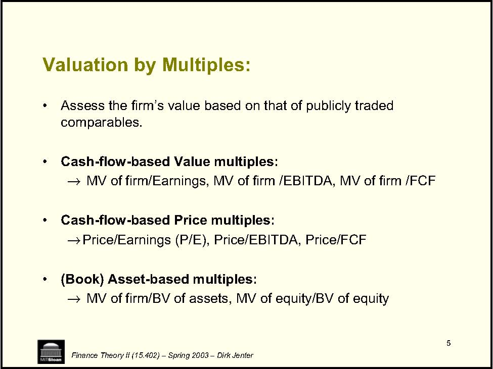
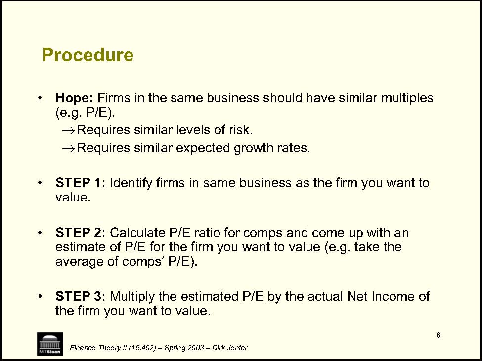
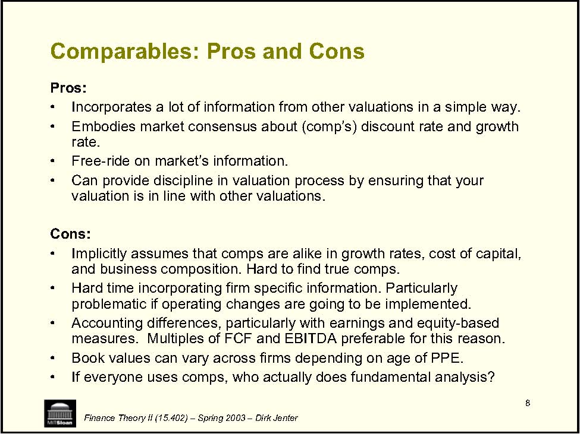
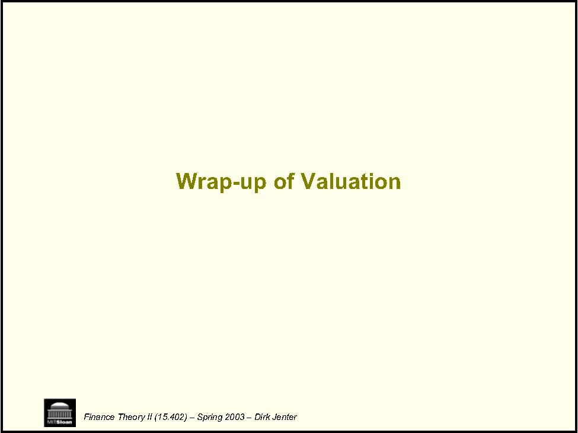
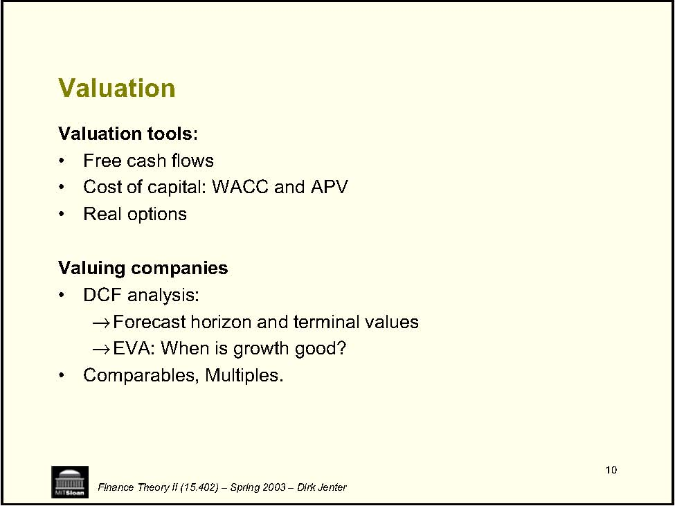
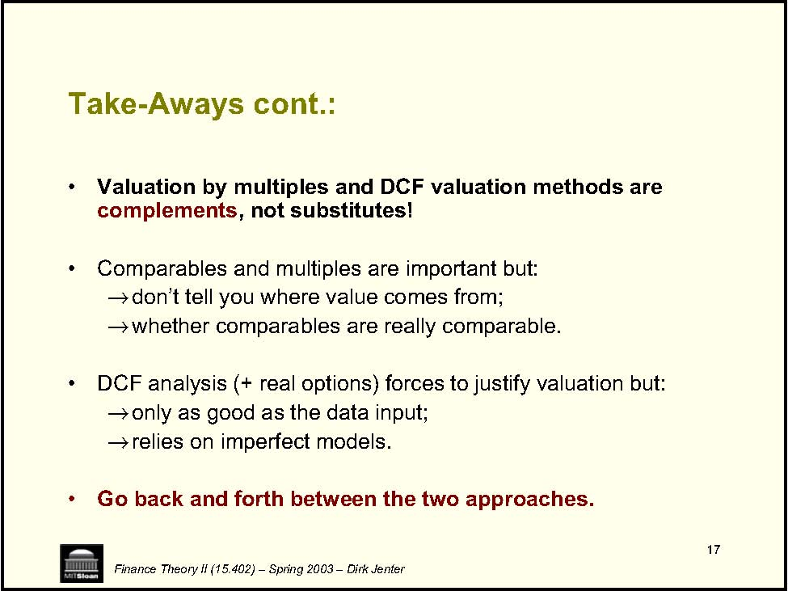
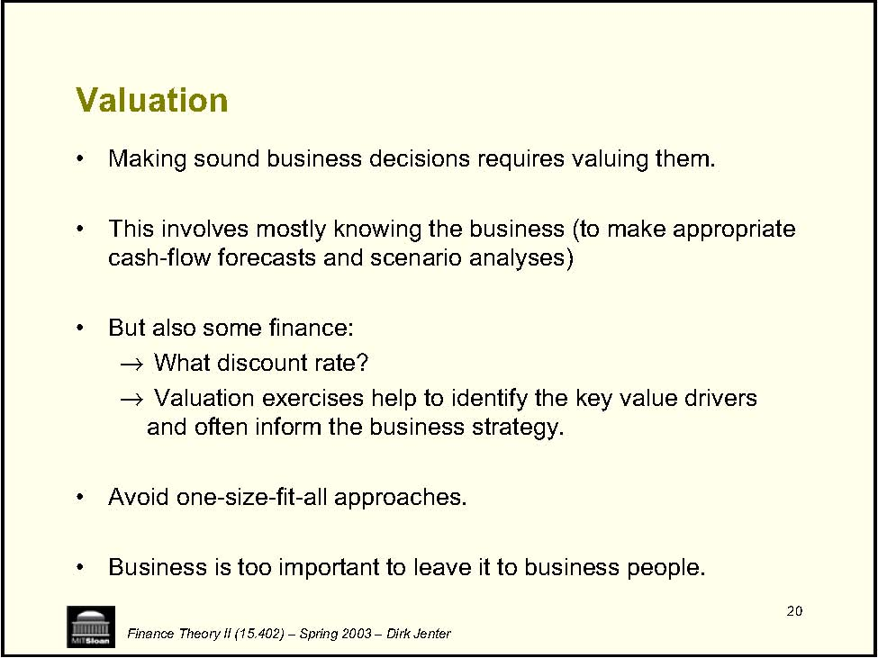

         Acrobat Distiller 6.0 (Windows)

         2004-01-21T10:52:49+05:30

         2004-01-21T10:53:40+05:30

         2004-01-21T10:53:40+05:30

         PScript5.dll Version 5.2

         uuid:ad431b89-6adc-4c65-a5c6-19a5cf54ff9b

         uuid:266fafb5-3a1e-42a3-a424-5f9ad672a3d9

         xml

               djenter

               Microsoft PowerPoint - LN24(WrapAll).ppt

Wrap-up of 15.402 Finance Theory II (15.402) – Spring 2003 – Dirk Jenter 

2 • • • • • • • • • • • • • Finance Theory II (15.402) – Spring 2003 – Dirk Jenter The Big Picture: Part II -Valuation A. Valuation: Free Cash Flow and Risk April 1 Lecture: Valuation of Free Cash Flows April 3 Case: Ameritrade B. Valuation: WACC and APV April 8 Lecture: WACC and APV 1 April 10 Lecture: WACC and APV 2 April 15 Case: Dixon Corporation 1 April 17 Case: Dixon Corporation 2 April 24 Case: Diamond Chemicals C. Project and Company Valuation April 29 Lecture: Real Options May 1 Case: MW Petroleum Corporation May 6 Lecture: Valuing a Company May 8 Case: Cooper Industries, Inc. May 13 Case: The Southland Corporation 

3 • →No laptops →→→Finance Theory II (15.402) – Spring 2003 – Dirk Jenter Final Exam Rules of the game: Closed books Two (2) letter-sized cheat sheets Bring a calculator 

4 Aside: Incentives • incentives. • 1. 2. Ÿ hazard. Ÿ Finance Theory II (15.402) – Spring 2003 – Dirk Jenter Whenever structuring a deal, be it on the RHS or the LHS of the balance sheet, make sure that all players have the right Example: You want to see a decent review of the course material. The professor is motivated by his teaching ratings (because he doesn’t want the Dean to beat him up). It is a bad idea to fill out the teaching rates before the professor has delivered the review! You are inviting moral Similar to the Southland case – don’t let crucial players cash out too early! 

5 • • →• →• →Finance Theory II (15.402) – Spring 2003 – Dirk Jenter Valuation by Multiples: Assess the firm’s value based on that of publicly traded comparables. Cash-flow-based Value multiples: MV of firm/Earnings, MV of firm /EBITDA, MV of firm /FCF Cash-flow-based Price multiples: Price/Earnings (P/E), Price/EBITDA, Price/FCF (Book) Asset-based multiples: MV of firm/BV of assets, MV of equity/BV of equity 

6 • Hope: →→• STEP 1: value. • STEP 2: average of comps’ P/E). • STEP 3: Finance Theory II (15.402) – Spring 2003 – Dirk Jenter Procedure Firms in the same business should have similar multiples (e.g. P/E). Requires similar levels of risk. Requires similar expected growth rates. Identify firms in same business as the firm you want to Calculate P/E ratio for comps and come up with an estimate of P/E for the firm you want to value (e.g. take the Multiply the estimated P/E by the actual Net Income of the firm you want to value. 

7 Remarks • →→price-to-subscribers multiples, →• • Finance Theory II (15.402) – Spring 2003 – Dirk Jenter For firms with no earnings or limited asset base (e.g.  hi-tech), price-to-patents multiples, or even price-to-PhD. multiples! For transactions, can also use multiples for comparable transactions (e.g. similar takeovers). Multiples based on equity value (or stock price, e.g. P/E) as opposed to total firm value ignore effect of leverage on the cost of equity (or assume the firms have similar leverage) =&gt; Beware if comps have very different leverage. 

8 Comparables: Pros and Cons Pros: • • rate. • • Cons: • • • measures. • • Finance Theory II (15.402) – Spring 2003 – Dirk Jenter Incorporates a lot of information from other valuations in a simple way. Embodies market consensus about (comp’s) discount rate and growth Free-ride on market’s information. Can provide discipline in valuation process by ensuring that your valuation is in line with other valuations. Implicitly assumes that comps are alike in growth rates, cost of capital, and business composition. Hard to find true comps. Hard time incorporating firm specific information. Particularly problematic if operating changes are going to be implemented. Accounting differences, particularly with earnings and equity-based Multiples of FCF and EBITDA preferable for this reason. Book values can vary across firms depending on age of PPE. If everyone uses comps, who actually does fundamental analysis? 

Wrap-up of Valuation Finance Theory II (15.402) – Spring 2003 – Dirk Jenter 

10 Valuation • • • Valuing companies • DCF analysis: →→EVA: When is growth good? • Finance Theory II (15.402) – Spring 2003 – Dirk Jenter Valuation tools: Free cash flows Cost of capital: WACC and APV Real options Forecast horizon and terminal values Comparables, Multiples. 

11 Estimating the FCF • ∆∆NWC ∆NA Recall: • • Finance Theory II (15.402) – Spring 2003 – Dirk Jenter Free cash flows (FCF) are the expected after-tax cash flows that the firm would generate if it were 100% equity financed. FCF = EBIT*(1-t) + Depreciation -CAPX -NWC FCF = EBITD*(1-t) + t * Depreciation -CAPX -FCF = EBIT*(1-t) -NWC = Current assets – Current liabilities NA = Assets – Current liabilities. 

12 Some Things to Keep In Mind: • →sales). all incremental cash flows: →illusions”… • →→• • Finance Theory II (15.402) – Spring 2003 – Dirk Jenter Formulas need to be adapted to particular situations: Need to understand the economics (e.g. Southland’s asset •Use Ignore sunk costs, count opportunity costs, avoid “accounting Don’t forget FCF at the end of the project’s life: If liquidated: SV*(1-t) + t * PPE, recoup NWC. If not liquidated: Terminal values. FCF ignores the tax shield provided by the firm’s debt. We deal with it separately in APV or WACC. Do not include the effects of financing at this stage: You would count them twice! 

13 • A • →→→• distress. rk AfA ⋅β+=Finance Theory II (15.402) – Spring 2003 – Dirk Jenter APV – Adjusted Present Value Step 1: Value if 100% equity, i.e. use kto discount the project’s FCF Step 2: Add PV(Tax Shield) Count only tax savings actually attributable to the project. Use the marginal (as opposed to the average) tax rate. Use expected (as opposed to maximal) interest payments. Caveat: For high D/V, should count expected costs of financial Premium Risk Market 

14 Weighted Average Cost of Capital (WACC) • • • →→→WACC can be used only if D/V is reasonably stable ED k ED E t)(1k ED D WACC ++−+=Finance Theory II (15.402) – Spring 2003 – Dirk Jenter Approach: Adjust the discount rate to account for the tax shield. Most widely used DCF analysis method. The aim is to avoid 1st order mistakes: Everything in WACC is project-specific (except for tax rate t). Firm-wide WACC is OK only if project comparable to the firm 

15 Embedded Real Options: • • • • →→Finance Theory II (15.402) – Spring 2003 – Dirk Jenter Real Options = Managerial flexibility to react to new information. Sometimes, much of a project’s value is in embedded options. Conditions for there to be an option: (1) New information will possibly arrive in the future. (2) When it arrives, the new information may affect decisions. Frequently encountered options: Options to grow, abandon, expand/contract, time, switch (inputs, outputs, processes, etc.) Valuation: Black-Scholes Scenario analysis and decision trees 

16 • from Î • • • • • Finance Theory II (15.402) – Spring 2003 – Dirk Jenter Take-Aways: Main merit of DCF analysis: Forces to argue where value comes Most important step is a reasonable forecast of FCF. Sales forecasts: Reasonable given the firm’s resources, the industry, and competition? What market share is needed? Margin forecasts: Reasonable given potential competition/entry barriers and bargaining position with suppliers and customers? CAPX and other investment forecasts: Consistent with the sales and margin forecasts? Terminal value: Does it make sense? Sensitivity analysis: What variables and assumptions are crucial to the value? Get more information about these levers. 

17 • complements• →→• →→• Finance Theory II (15.402) – Spring 2003 – Dirk Jenter Take-Aways cont.: Valuation by multiples and DCF valuation methods are , not substitutes! Comparables and multiples are important but: don’t tell you where value comes from; whether comparables are really comparable. DCF analysis (+ real options) forces to justify valuation but: only as good as the data input; relies on imperfect models. Go back and forth between the two approaches. 

Finance Theory II (15.402) – Spring 2003 – Dirk Jenter Conclusion 

19 • • • • • Finance Theory II (15.402) – Spring 2003 – Dirk Jenter Financing The bulk of the value is created on the LHS by making good investment decisions. You can destroy much value by mismanaging your RHS: Financial policy should be supporting your business strategy. You cannot make sound financial decisions without knowing the implications for the business. Avoid one-size-fit-all approaches. Finance is too important to leave it to finance people. 

20 Valuation • • • →→• • Finance Theory II (15.402) – Spring 2003 – Dirk Jenter Making sound business decisions requires valuing them. This involves mostly knowing the business (to make appropriate cash-flow forecasts and scenario analyses) But also some finance: What discount rate? Valuation exercises help to identify the key value drivers and often inform the business strategy. Avoid one-size-fit-all approaches. Business is too important to leave it to business people. 
