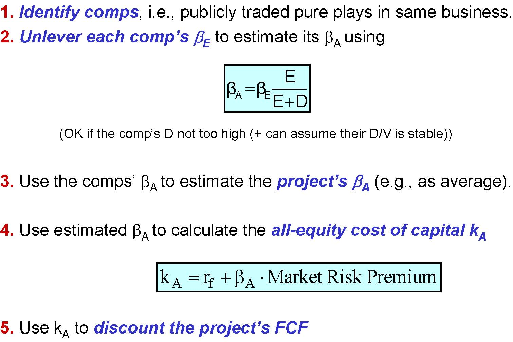
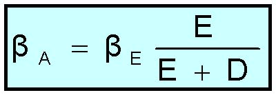
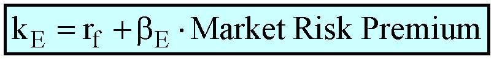
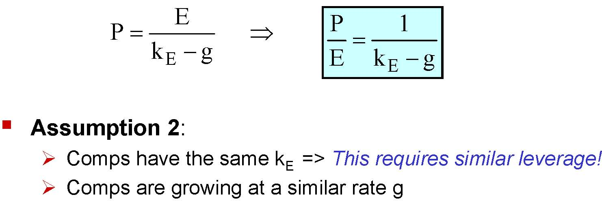

         Acrobat Distiller 6.0 (Windows)

         Compaq

         Compaq

         Acrobat PDFMaker 6.0 for PowerPoint

         2004-01-22T11:36:43+05:30

         2004-01-22T11:35:51+05:30

         2004-01-22T11:36:43+05:30

         uuid:5b3ece7b-05bd-498a-a09a-b161d8edb0a3

         uuid:44cc4552-8b4a-4b3b-81c1-bcffa8b1b86a

         xml

               No Slide Title

               Leslie A. Larocca

Wrap-up of Valuation

Katharina Lewellen

Finance Theory II

May 14, 2003

Final Exam

- Rules of the game:

- No laptops

- Closed books

- Cheat sheet

Valuation

Valuation tools:

- Free cash flows

- Cost of capital: WACC and APV

- Real options

Valuing companies

- DCF analysis:

- Forecast horizon and terminal values

- EVA: When is growth good?

- Comparables, Multiples

Estimating the FCF

- Free cash flows (FCF) are the expectedafter-tax cash flows that the firm would generate if it were 100% equity financed.

FCF = EBIT*(1-t) + Dep. -CAPX -∆NWC

FCF = EBITD*(1-t) + t * Dep. -CAPX -∆NWC

FCF = EBIT*(1-t) -∆NA

Recall:

- NWC = Current assets –Current liabilities

- NA = Assets –Current liabilities.

FCF = EBIT*(1-t) + Dep. -CAPX -∆WC

- This expression amends EBIT(1-t) which is an accounting measure of cash flow into an economic measure.

- CAPX not reported as cash outflow but is one -CAPX

- Depreciation

- is reported as cash outflow but is not one Add (1-t)*Dep

- however, depreciation does imply a cash inflow of t*Dep.

- Altogether + Dep

- Working capital has an opportunity cost -∆NWC

Other Things to Keep In Mind

- Formulas need to be adapted in particular situations

- Need to understand the economics (e.g., Southland’s asset sales)

- Use all incrementalcash flows: 

- Ignore sunk costs, Count opportunity costs, Avoid “accounting illusions”…

- Don’t forget FCF at the end of the project’s life:

- If liquidated: SV*(1-t) + t * PPE

- Even if not liquidated, recoup WC

- FCF ignores the tax shield provided by the firm’s debt.

- We deal with it separately in APV or WACC. Do not include the effects of financing at this stage: You would count them twice!

APV Step 1: Value if 100% equity

1.Identify comps, i.e., publicly traded pure plays in same business.2.Unlever each comp’s βEto estimate its βA using(OK if the comp’s D not too high (+ can assume their D/V is stable))3.Use the comps’ βA to estimate the project’s βA(e.g., as average).4.Use estimated βA to calculate the all-equity cost of capital kA5.Use kAto discount the project’s FCFDEEββEA+=PremiumRisk  MarketrkAfA⋅β+=

Why We Need to Unlever

- Comps may have different leverage

- Equity in a firm with debt is more risky than equity in a firm without debt because debt receives some of the safe cashflows.

Note: Business Risk and Financial Risk

- Financial risk has nothing to do with costs of financial distress!

- Similar firms have similar business risk (βA) but can have different financial risk (βE-βA) if they have different leverage.

- As leverage increases, equity becomes riskier (i.e. βE ).

APV Step 2: Add PV (Tax Shield)

- If the project’s D is constant over time, then 

PV(TS) = t*D*kD/ kD= t*D

- If the project’s D/V is constant, then

PV(TS) = t*D*kD / kA 

- If there is a known debt policy or repayment schedule

- you can simply forecast actual debt levels and discount by a rate between kD and kA

APV Step 2: Add PV (Tax Shield), Remarks

- Count only debt attributed to the project

- Recall: If a project is 100% debt finance, some of the debt is probably issued against firm’s other assets

- Make sure to discount expectednot maximum tax shields

- This is particularly important for high D/V

- For high D/V, should count costs of financial distress

- Recall: Use the marginal (as opposed to the average) tax rate

Weighted Average Cost of Capital (WACC)

- Approach: Adjust the discount rate to account for the tax shield.

- Most widely used DCF analysis method.

- The aim is to avoid 1st order mistakes:

- A priori, WACC is project-specific (except for tax rate t)

- Firm-wide WACC is OK only if project comparable to the firm

EDkEDEt)(1kEDDWACC++−+=

Leverage ratio: D/(D+E)

- What we want: The debt that is incremental to the project, i.e.,that could not be raised w/o the project.

- 1st-order mistakes we want to avoid:

- Use the deal’s leverage ratio;

- Use the “acquirer”’s leverage ratio.

- Imperfect approach to what we want:

- Target leverage ratio if project/firm were a stand-alone

- How we get there:

- Get D/V from comps, business plan, checklist, etc.

Cost of debt capital: kD

- What we want: Expected return for creditors if project were a stand-alone with leverage ratio D/(D+E) estimated above.

- Imperfect approach to what we want: kDclose the interest rate charged to project as stand-alone (unless debt is very risky).

- How we get there:

- Find comps with similar leverage + recent interest rate.

- Estimate the debt rating and examine corporate yield curve.

- 1st-order mistakes we want to avoid:

- Use the interest rate in the deal or of the “acquirer”;

Effective Marginal Tax Rate t

- Marginal tax rate of firm undertaking the project: t

Using CAPM to Estimate kE

1.Find compsfor the project under consideration.

2.Unlevereach comp’s βE(using itsD/(D+E)):

3.Use the comps’ βA to estimate the project’s βA(e.g. average).

4.Releverthe project’s estimated βA (using its own D/(D+E)):

5.Use the estimated βE to calculate the project’s cost of equity kE:

Note: These (un-) levering formulas are OK only if the (comp) firm’s debt is nottoo risky and its D/V is reasonably stable.

DEEββEA+=

AAEβED1βEDEβ⎥⎦⎤⎢⎣⎡+=+=

PremiumRisk  MarketrkEfE⋅β+=

Remarks

- WACC can be used only if D/V is reasonably stable

- Use APV when debt is very risky and/or when D/V is unstable (recall the Southland LBO case)

- WACC is an attribute of the project, not the firm (except tax rate)

- OK to use the firm’s WACC when project is very much like the firm (because the firm happens to be a comp for the project).

- Few companies have WACC that they can use for all projects (recall our discussion of GE).

Real options

Embedded options

- Follow-up investments

- Option to abandon the project

- Option to wait before investing

- Option to expand / change production methods

Key issues

- Identification

- Valuation

Identify significantoptions

- Look for clues in project’s description and cash flow pattern

- “Phases”, “Strategic investment”, “Scenarios”…

- Large expenditures are likely discretionary

- Is there an option? Verify two conditions:

(1) News will possibly arrive in the future;

(2) When it arrives, the news may affect decisions.

- Search for the uncertainty that managers face:

- What is the main thing that managers will learn over time?

- How will they exploit that information?

Practical Issue: Simplifications

- Search for significantoptions

- E.g., option to shut down the plant may not be very valuable (why?)

- Look for primary sources of uncertainty

- Cut the projects into simpleoptions

- You might want to ignore nested options (difficult to value)

- Use Europeanrather than American option

- Ignoring some adverse effects of waiting (e.g. possible entry)

A simplified model that is dominated by the project gives a lower boundfor the project’s value (and vice versa).

Value the options

Step 1:

- Start with the simple DCF analysis

- Pretend that there is no option embedded in the project

- This benchmark constitute a lower boundfor the project’s value

Step 2:

- Value the option

- Decision trees (dynamic DCF)

- Option pricing models (Black-Scholes)

Mapping: Project Call Option

<Table>
<TR>
<TD>

Project

</TD>

<TD>

Call Option

</TD>
</TR>
<TR>
<TD>

Expenditure required to acquire the assets

</TD>
<TD>

X

</TD>
<TD>

Exercise price

</TD>
</TR>
<TR>
<TD>

Value of the operating assets to be acquired

</TD>
<TD>

S

</TD>
<TD>

Stock price (price of the underlying asset)

</TD>
</TR>
<TR>
<TD>

Length of time the decision may be deferred

</TD>
<TD>

T

</TD>
<TD>

Time to expiration

</TD>
</TR>
<TR>
<TD>

Riskinessof the operating assets

</TD>
<TD>

σ2

</TD>
<TD>

Variance of stock return

</TD>
</TR>
<TR>
<TD>

Time value of money

</TD>
<TD>

r

</TD>
<TD>

Risk-free rate of return

</TD>
</TR>
</Table>

Practical Issue: What Volatility?

What do we want?

- Standard deviation of returns for the underlying asset

- In case of real options, the underlying is the PV of the project’s CFs

Imperfect ways to get it?

- Informed guess

- 20-30% per year is not remarkably high for a single project.

- Data

- Historical return volatilities on comparable traded assets

- Implied volatilities can be computed from quoted option prices

- Simulations

Valuing Companies

- Terminal values:

- Liquidation

- Flat, growing, or decreasing perpetuity

- EVA: When is growth good?

- Comparables, Multiples.

Terminal Values

- Liquidation:Should be adjusted (e.g. if cannot recoup all A/R, etc.)

SV * (1-t) + t*PPE + WC

- Growing perpetuity:Take EBIT and NA in last year of forecast

TV = [(1+g)*EBIT*(1-t) -g*NA] / (k-g)

- Flat perpetuity:

TV = EBIT*(1-t) / k

Terminal Values, Remarks

- Growing perpetuity formula assumes a linear relationship between EBIT and NA

- Don’t forget to take PVTV

- Forecast horizon: Company is reasonably stable afterwards

EVA

- Growth is valuable when (very roughly!):

EVA = EBIT*(1-t) -k*NA &gt; 0or    EBIT*(1-t) / NA &gt; k

- Growth is good if the cost of scaling up NA is offset by the value of increased revenues.

Remarks:

- Assumes linearity between EBIT and NA and that NA is a good measure of marginal “replacement cost”, now and in the future.

- EVA has nothing to do with sustainable growth.

EVA: Bottom Line

Use EVA as…

- … a simple measure of whether a business is generating value and whether growth is enhancing value

- … as a way of setting goals to enhance value

Beware of EVA for...

- … young companies

- … companies in rapidly changing business environment

- … companies in which book values are not accurate measures of marginal replacement cost.

Multiples

- Assess the value based on that of publicly traded comps

- Cash-flow based Value multiples

- MV(firm)/Earnings, MV(firm)/EBITDA, MV(firm)/FCF,...

- Cash-flow based Price multiples:

- Price/Earnings, Price/EBITDA, Price/FCF,...

- Asset-based multiples:

- MV(firm)/BV(assets), MV(equity)/BV(equity),...

Motivation for Multiples?

- Assumption 1:

- E = CF to shareholders

- E is a perpetuity

                 gkEPE⇒−=Assumption 2:Comps have the same kE  =&gt; This requires similar leverage!Comps are growing at a similar rate ggk1EPE−=

Multiples: Pros and Cons

Pros:

- Incorporates simply a lot of information from other valuations

- Embodies market consensus

- Can provide discipline for DCF valuation: Ask yourself “How do Iexplain the difference?”

- Sometimes, what you care about is what the market will pay, not the fundamental value (e.g., Venture firm will want out).

Cons:

- Hard to incorporate firm specific information.

- Relies on accounting measures being comparable too.

Other Things to Think About

Control:

- With a controlling stake, influence operations, implement synergies and capture (part of) their value

- Also, entrepreneur might care about “the vision”

Large individual shareholder (e.g., entrepreneur):

- Maybe very undiversified, at least for a while 

Liquidity:

- Especially for private companies

- Note: Need to account for IPO plans

Valuation: Conclusion

- Main merit of DCF analysis: Forces to argue where value comes from Most important step is a reasonableforecast of FCF.

- Sales forecasts: Reasonable given the firm’s resources, the industry, and competition? What market share is needed?

- Margin forecasts: Reasonable given potential competition/entry barriers and bargaining position with suppliers and customers?

- CAPX and other investment forecasts: Consistent with the sales and margin forecasts?

- Terminal value: Does it make sense?

- Sensitivity analysis: What variables and assumptions are crucialto the value? Get more information about these levers.

Valuation: Conclusion

- The different methods are not mutually exclusive.

- Comparables and multiples are important but:

- don’t tell you where value comes from;

- whether comparables are really comparable.

- DCF analysis (+ Real options) forces to justify valuation but:

- only as good as the data input;

- relies on imperfect models.

- Go back and forth between the two approaches.

Course: Conclusion

What We Have Been About

- Acquire a few general tools:

- Capital structure

- DCF analysis

- Comparalesand multiples

- Avoiding 1st order misconceptions (list your own below if any):

- etc.

- Developing a healthy skepticism.

Financing

- The bulk of the value is created on the LHS by making good investment decisions.

- You can destroy much value by mismanaging your RHS: Financial policy should be supporting your business strategy.

- You cannot make sound financial decisions without knowing the implications for the business.

- Avoid one-size-fit-all approaches.

- Finance is too serious to leave it to finance people.

Valuation

- Making sound business decisions requires valuing them.

- This involves mostly knowing the business (to make appropriate cash-flow forecasts and scenario analysis, etc.)

- But also some finance:

- What discount rate?

- Valuation exercises can indicate key value levers,...

- Avoid one-size-fit-all approaches.

- Business is too serious to leave it to business people.
