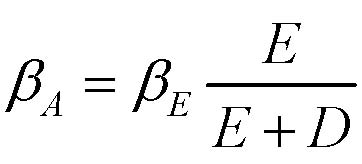
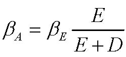
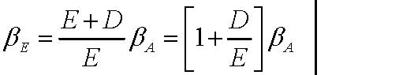
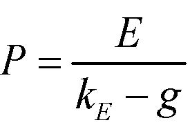
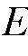

         Acrobat Distiller 6.0.1 (Windows)

         xjtu

         D:20050430073626

         2005-04-30T15:36:46+08:00

         Acrobat PDFMaker 6.0 for Word

         2005-04-30T15:37:25+08:00

         2005-04-30T15:37:25+08:00

         uuid:dac00290-21c7-4407-99d4-4dd2e00d0bd0

         uuid:f2687009-47e4-4f4a-8ac6-7eb734615131

               2

         xml

               评估理论的简述

               LiuYuanyuan

价值评估总结 

凯兹瑞纳·理崴伦 

财务理论（二） 

2003.3.14 

期末考试 

·考试规则 

→不能携带掌上电脑 

→闭卷考试 

→可以携带小抄纸  

价值评估工具 

评估方法: 

   ·自由现金流量 

   ·资本成本：加权平均资本成本法与现值调整法 

·实物期权理论 

 企业价值评估； 

·现金流贴现分析 

  →预测公司的投资价值与最终价值 

  →经济增加值：何时增长最好？ 

·比较法，乘数 

估算自由现金流量 

-  自由现金流（FCF）：如果一个公司是100%股权融资，那么这个公司产生的未来税后现金流就是自由现金流。 

自由现金流量（FCF）＝（１－税率t）×息税前利润(EBIT)＋折旧－资本性支出（CAPX）-净营运资本(NWC)的变化 

自由现金流量（FCF）＝（１－税率t）× 息前税前及折旧前的利润（EBITD）＋税率t×折旧－资本性支出（CAPX）－ 净营运资本(NWC)的变化 

自由现金流量（FCF）＝（１－税率t）× 息税前利润（EBITD）－净资产（NA）的变化 

回顾： 

-  净营运资本=现有资产-现有负债 

-  净资产=资产－现有债务 

自由现金流量（FCF）＝（１－税率t）×息税前利润(EBIT)＋折旧－资本性支出（CAPX）-营运资金的增价值(WC) 

· 这个表达式修正了息税前利润(EBIT) ×（１－税率t），它是用来衡量经济中的现金流的指标。 

·资本支出不引起现金流出，但它是→减去资本性支出 

·折旧 

→会引起现金流出，但它不是一→加上（1-税率）×折旧 

→另外，折旧意味着一定量（税率×折旧）的现金流入。 

→加总→加上折旧 

·营运资本有机会成本→减去净营运资金的变化量 

应当注意的其他事项：  

· 在遇到特殊情况下公式要进行适当地调整。： 

→充分考虑到经济状况（例如出售Southland公司资产的案例） 

· 使用所有新增现金流 

→忽略沉没成本，计算机会成本，避免“会计幻觉” 

· 不要忘记在项目结束时产生的现金流量 

 →如果清算：残值 ×（1－税率）＋ 税率×固定资产 

 →如果不清算：收回的营运资本增加值  

· 自由现金流忽视了公司债务的税收规避作用。 

· 我们用加权平均资本法与调整现值法分别计算自由现金流。在这个步骤没有考虑融资效应；否则，你将对它们计算两次！ 

现值调整的步骤一：估算100%权益资本公司 

- 1. 确认可比较的参照公司，即从事同一业务主业清晰的公众公司。   

2．用下式消除每一个可比较参照公司的权益资本贝塔值βA的杠杆效应，以估算其资产贝塔值βA     

AEEEDββ=+

(如果参照公司的债务不是很高（+ 就可以假定债务/公司价值是稳定的）) 

3. 用可比较参照公司的资产贝塔值估算项目的资产贝塔值（例如，用平均值） 

4. 使用评估的资产贝塔值βA来计算全部权益资本的成本KA

KA=rF+βA*市场风险溢价 

- 5. 用KA来贴现项目的自由现金流量 

为什么我们要消除杠杆效应 

·目标企业可能有不同的杠杆效益 

·负债的公司的资产比没有债务的公司的资产风险大，因为债务带来了部分安全的现金流。 

注意：商业风险与财务风险 

·财务风险与财务困境成本没有关系 

·如果有不同的财务杠杆，相似的公司可以有相同的商业风险，但是可能有不同的财务风险。 

·当杠杆效应变大时，资产的风险也在变大（例如βE 变大） 

现值调整的步骤二：增加现值（税盾） 

·如果项目的负债是稳定的，那么 

现值（税盾）=税率×债务×债务成本/债务成本= 税率×债务市值    

·如果项目的负债率是稳定的，那么 

现值（税盾）=税率×债务×债务成本/资本成本 

·如果我们知道债务政策或者还款计划 

→你就能方便的预测出真实的债务水平，用介于债务成本和资本成本之间的贴现率进行折现 

现值调整的步骤二：增加现值（税盾），注意事项 

·只计算与项目有关的债务 

→回顾：如果一个项目100%靠债务来融资,那么发行的一些债务可能是与公司的其他资产相对 

·确定使用的贴现率是预期的贴现率,而不是最大的避税率 

→这一点对于债务比例很高的项目非常重要 

·对于高债务比例的项目,需要计算财务困境的成本 

·回顾：用边际(不是平均)税率 

加权平均资本成本（WACC） 

· 方法；适当调整折现率以解决税盾问题。 

(1)DEDEWACCktkDEDE=−+++

· 我们广泛的使用现金流贴现分析法。 

· 目的是为了避免出现第一步的错误 

→最初，加权平均资本成本（除了税率以外）是针对某个特定项目而言的。 

→如果项目与企业的状况相似，我们可以用加权平均资本成本估算企业 

杠杆比率:债务/(债务+权益资本) 

· 我们需要什么：增加的债务是对特定项目而言的，即，没有项目，就不需要融资 

· 我们要避免出现第一步的错误 

→使用交易杠杆比率 

→使用兼并杠杆比率 

· 对我们的需要来说是不完善的方法 

→如果项目 / 企业是独立的，目标杠杆比率是什么？ 

· 如何计算： 

→从目标企业、商业计划和核实表上获得债务比例 

债务资本的成本：kD

-  我们想要的：如果一个项目是独立项目并且具有上边我们所估计的杠杆比率D/(D+E)，那债务资本成本就是债权人预期的收益率。 

-  对我们的需要来说是不完善的方法：因为项目是独立的（除非债务风险很大），债务资本成本近似于要求的利率 

-  如何计算： 

找那些具有相似财务杠杆的可比较参照公司＋最近的利率 

评估债务级别，核实公司的盈利曲线 

-  我们要避免出现第一步的错误： 

在交易或兼并中使用利息率 

有效边际税率： 

-  公司承担项目的边际税率：t 

用资本资产定价模型（CAPM）估算kE

1. 找出需评估项目的可比较参照公司。 

2. 消除每一个可比较参照公司的权益资本贝塔值βA的杠杆效应（使用其负债率D/(D＋E)： 

3．用可比较参照公司的资产贝塔值βA估算项目的资产贝塔值βA（例如，用平均值） 

4．考虑杠杆效应后估算项目贝塔值βA  （使用项目的D/(D+E)） 

5．使用评估的资产贝塔值βA来计算全部权益资本的成本KA

注释：只要可比较参照公司的债务风险不是很高，其债务率相当稳定，这些消除杠杆效应的公式是可行的。 

AEEEDββ=+

1EAAEDDEEβββ+⎡⎤==+⎢⎥⎣⎦

KA=rF+βA*市场风险溢价 

注意事项： 

-   当债务比率相当稳定时，加权平均资本成本法才适用 

-   当债务风险比较大或债务比例不稳定时，我们用现值调整法（回忆   

Southland杠杆收购案例） 

-   加权平均资本成本由某一具体项目，而不是公司整体决定（除了税率） 

-   当一个项目与公司是非常相似（因为该公司可能是该项目的比较目标）    

时我们可以用公司的加权平均资本成本 

-   几乎没有企业的加权平均资本成本适用于所有项目（回顾对GE的讨论） 

实物期权理论： 

隐含的期权：  

 · 后续投资 

  · 放弃某个项目的期权 

  · 在投资前“等待”的期权 

  · 扩张或者改变的生产的期权 

关键问题： 

   确认 

   评估 

确认重要的期权 

-   从对项目的描述或者现金流动的方式中寻找线索： 

→“所处阶段”、“战略投资”、“前景” 

  →大额支出很可能是随机的 

-   是否是期权？要看以下两点： 

 (1) 未来会有新信息出现 

 (2) 这些信息会影响决策 

-   研究管理层面临的不确定性； 

 →管理层随着时间推移最想了解的事情是什么？ 

 →他们将如何利用这些信息 

实践问题：简单化 

-   寻找重要的期权： 

  →例如：关闭一个工厂的期权不是很有价值（为什么？） 

  →找到不确定性的主要的来源 

-   把项目分成几个简单的期权 

  →你也想忽略嵌套期权（评估比较困难） 

-   用欧式期权而不是美式期权 

-   忽略“等待”的负面影响（例如，可能进入） 

由项目决定的简化模型为该项目的价值给出了上（或下）限（反之亦然） 

期权定价 

步骤1、 

-   先用简单的现金流贴现分析 

    →假设项目中不存在期权 

    →这个基准点构成项目价值的下限 

步骤2、 

-   期权定价 

     →决策树（动态现金流贴现分析） 

     →期权定价模型（布莱克-思科尔斯模型） 

图示：项目—&gt;看涨期权 

<Table>

<TR>
<TD>

     项目 

</TD>
<TD>

</TD>
<TD>

买入期权 

</TD>
</TR>
<TR>
<TD>

获取资产需要的开支 

</TD>
<TD>

X 

</TD>
<TD>

执行价格 

</TD>
</TR>
<TR>
<TD>

获取的营运资产的价值

</TD>
<TD>

S 

</TD>
<TD>

股票价格（标底资产价格）

</TD>
</TR>
<TR>
<TD>

可以延期决策的时间 

</TD>
<TD>

T 

</TD>
<TD>

到期时间 

</TD>
</TR>
<TR>
<TD>

营运资产的风险 

</TD>
<TD>

</TD>
<TD>

股票收益的方差 

</TD>
</TR>
<TR>
<TD>

货币的时间价值 

</TD>
<TD>

r 

</TD>
<TD>

无风险回报率 

</TD>
</TR>

</Table>

实践问题：波动性是什么？ 

我们需要什么？ 

-   标底资产收益的标准差 

-   在实物期权中，这个标底资产就是项目现金流的现值 

粗略的估算： 

-   有根据的猜测 

→每年20-30%对单个项目来说不是很很高 

-   数据 

    →可比较的交易资产历史收益的波动性 

    →从期权交易价格能计算出隐含的波动性 

-   模拟 

公司价值评估： 

-   终值： 

   →清算 

   →稳定不变，增长，或是永续下降 

-   经济增加值：何时的增长是有价值的？ 

-   比较法，乘数 

终值： 

-   清算：需要被调整（如，如果不能收回所有应收帐款，等） 

残值 ×（1－税率）＋ 税率×固定资产＋营运资本增加额 

-   永续增长：用去年的息税前利润和净资产预测 

终值（TV）=[（1＋增长率）×期息税前利润×（1－税率）－增长率 

（g）×t年的净资产（NA）] ╱（贴现率－增长率） 

-  永续不变： 

终值（TV）= 息税前利润×（1－税率）╱贴现率（k） 

终值，注意事项： 

-   永续增长公式假设息税前利润和净资产之间有线性关系。 

-   不要忘记取终值的现值 

-   预测范围：公司一直相当稳定 

经济增加值 

· 增长是有价值的，当… 

经济增加值（EVA） =息税前利润（ EBIT）×(1－利率t)－贴现率k×净资产（NA）﹥0   

或  息税前利润（ EBIT）×(1－利率t)/ 净资产（NA）﹥k 

· 当增加净资产的成本能很好的被增加收入的价值所补偿时，增长是有利的。 

注意事项： 

·假设息税前利润与加权资本成本率之间有线性关系，加权资本成本无论在现在还是将来都可以很好地测度边际替代成本。 

·经济增加值与可持续增长没有关系 

经济增加值（EVA）：最起码应知道 

用经济增加值作为… 

· 一个简单的方法确定经营是否产生了价值和增长是否提高了价值 

· 作为制定价值增值目标的一种方法 

应特别小心，经济增加值（EVA）应用于… 

· 新公司 

· 处于快速变化商业环境中的公司 

· 帐面价值不能准确反映替代成本的公司 

乘数 

· 公司价值评估以可比较的公众公司价值为基础 

· 以现金流为基础的价值乘数： 

☆ 公司的市场价值（MV）/收益（E），公司的市场价值（MV）/折旧及摊销前的盈余（EBITDA），公司的市场价值（MV）/自由现金流（FCF） 

· 以现金流为基础的价格乘数： 

☆ 价格（P）/收益（E），价格（P）/折旧及摊销前的盈余（EBITDA），  价格（P）/自由现金流（FCF） 

· 资产乘数 

☆ 公司的市场价值（MV）/资产的帐面价值（BV），股票的市场价值（MV）/股票面值（BV） 

引进乘数出自于什么考虑？ 

- ◆ 假设1： 

☆ 每股收益E = 股东得到的现金流CF 

☆ 每股收益E是永续的 

EEPk

g         

- ◆ 假设2： 

☆ 可比较参照公司有相同的贴现率kE    这要求有相似的杠杆效益！ 

☆ 可比较参照公司具有相似的增长率g 

乘数：利与弊 

利： 

· 用简单的方法融入其他价值评估方法的很多信息 

· 具体化了市场的一致评价 

· 提供了现金流贴现评估法的基本原则：问你自己“我如何解释它们之间的差别？” 

· 有时你关心的是市场回报什么，不是基础价值,(例如，风险投资公司会解散) 

弊： 

· 很难融入公司特有的信息 

· 也需要借助会计方法进行比较 

需要思考的其它问题 

控制权： 

· 具有控制性地位，可以影响营运，执行综效，获得它们的（部分）价值 

· 而且，实业家可能会关心“前景” 

单个大股东（如，实业家）： 

· 至少在一段时期可能很集中 

清算： 

· 尤其对私人公司而言 

· 注释：需要考虑IPO计划 

价值评估：结论 

· 现金流贴现分析主要的优点是要求我们讨论价值的来源→最重要的步骤是合理的预测自由现金流。 

· 销售预测：能合理的提供本企业的资源、产业以及竞争对手的信息吗?需要的市场份额是多少?。 

· 边际预测：能合理的给出潜在的竞争者 / 进入壁垒及与供应商和消费者的讨价能力吗? 

· 资本性支出以及其他投资预测：是否和销售预测﹑边际预测一致? 

· 终值：是否是合理的? 

· 敏感性分析：哪些变量或假设对评估有决定性意义? 要更多了解这些指标的信息。 

价值评估：结论 

· 不同的评估方法不是相互排斥的。 

· 比较法与乘数分析都是重要的，但是 

 →不能说明价值的来源， 

 →这些比较是否是客观的。 

· 现金流贴现法(+实物期权理论)可以证明评估是否正确，但是 

→只有当模型所用的各种数据也是正确的。 

→以不完善的模型为基础。 

· 在这两种方法之间进行衡量。 

课程：结论 

我们知道了什么 

· 学会一些基本的工具 

→财务结构 

→现金流贴现分析 

→比较分析与乘数分析 

· 避免以下的误解(列出你认为的) 

→ 

→ 

→等等 

· 养成正确的怀疑观 

理财 

· 资产栏（LHS）的大量价值是依靠正确投资决策创造的。 

· 如果没有管理好负债栏（RHS），你将会损失很多价值： 

 财务政策应当支持公司的商业战略。 

· 在不了解商业内涵的情况下，你是不能做出完善的财务决策的。 

· 避免“一刀切”的方法 

· 财务活动不能仅仅限于财务人员 

价值评估 

· 要想做出一个正确的商业决策需要进行价值评估。 

· 价值评估包含了一个企业绝大部分信息(做适当的现金流预测和前景分析，等) 

· 同时也需要财务支持 

 →贴现率是什么？ 

 →价值评估练习帮助你确定评估价值的主要方法，…… 

· 避免“一刀切”的方法 

· 商业活动不能仅仅限于商业人士 
