# 14.23 Government Regulation of Industry

Class 3

## MIT &amp; University of Cambridge

-  Definitions 

-  Nash Equilibrium 

-  Monopoly and Perfect Competition revisited 

-  Duopoly and social welfare 

-  Cournot, Stackelberg and Bertrand Oligopoly 

-  Collusion 

-  Is oligopoly a problem? 

-  Prisoners’ Dilemma and Game Theory 

##  A Nash Equilibrium

The strategies x and y form a Nash equilibrium for players 1 and 2 respectively if x is the best response for 1 if 2 has chosen y and y is the best response for 2 if 1 has chosen x. 

## Monopoly and Perfect Competition

Consider the following example:

Market Demand: P=25-Q
Marginal Cost = Average Cost = 5
Competitive Outcome: MC=MR=P=5, Q=20; CS=200, PS=0
Monopoly Outcome: MR=25-2Q=MC=5; Q=10, P=15; CS=50, PS=100, DWL=50

-  Consider two identical firms (1 and 2). 

- 	Both set quantity assuming the other firm’s quantity is independent of their own choice of output. 

- 	Thus the conjectural variation is zero (i.e. firm 1 assumes dq2/dq1=0). 

- 	Equilibrium occurs when each firm does not want to change its output having observed what output the other firm has set. 

Price, P=25-(q1+q2); Total costs, C1=5 q1; C2=5 q2;

Profit, Π1=(25-q1 -q2) q1 -5 q1 

Differentiate the profit function with respect to q1 and set equal to zero to solve for marginal revenue=marginal cost. 

This gives the reaction or best response function for Firm 1: this gives q1 =(20-q2)/2. 

Repeat the procedure for the identical Firm 2: 

this gives q2 =(20-q1)/2 

•q1 =(20-q2)/2 and q2 =(20-q1)/2•q1=q2=20/3•P=35/3

-  Π1 = Π2 = 400/9; PS=800/9 

-  CS=800/9 

-  CS+PS=1600/9=177.78 

q2, Output of firm 2

Π22 Figure 1 -A Cournot equilibrium R2 Π21 Π12 Π11 R1 Cournot Equilibrium 

0 q1, Output of firm 1

Π21 &lt; Π22; Π11 &lt; Π12 

-  Firm 1 is leader, Firm 2 is follower 

-  Firm 1 knows q2 =(20-q1)/2 and maximises 

-  Firm 2 is a Cournot player•q1=10, q2=5•p=10

-  Π1= 50, Π2= 25 ; PS=75 

-  CS=0.5(15*15)=112.5 

-  CS+PS=187.5 

q2, Output of firm 2

Figure 2 -A Stackelberg Equilibrium R2 R1 Cournot Equilibrium Stackelberg equilibrium with 1 as leader 

q21 

0 q11 q1, Output of firm 1

First mover firm can get higher profits than at the Cournot equilibrium.

-  Consider two identical firms (1 and 2). 

•Both set price assuming the other firm’s price is independent of their own choice of output. 

- 	Thus the conjectural variation in price is zero (i.e. for firm 1 dp2/dp1=0). 

- 	Equilibrium occurs when each firm does not want to change its price having observed what the price the other firm has set. 

-  Price equals marginal cost (=average cost). 

-  There are zero profits. 

- 	Firm 1 and Firm 2 produce similar but not identical products and compete on price. 

-  Demands: q1=20-p1+p2, q2=20-p2+ p1 •Assume mc=0 

- 	Price reaction functions: p1 =(20+ p2)/2 and p2 =(20+ p1)/2 

•p1 = p2 =20, Π1=Π2=400 

-  If Firm 1 is a leader, p1 =30, p2 =25 

-  Π1 =450, Π2 =625 

-  You don’t want to be the leader! 

Figure 3 – The Bertrand Equilibrium p2 p*2 

R1 R2 

p1 p*1 

•Q=q1+q2+…+qn 

- 	MR=MC for each firm i Π i=P(Q).qi-C(qi) 

-  F.O.C.: MCi=P(Q)+ qi dP/dqi •si=qi/Q, note in Cournot: dP/dQ=dP/dqi 

-  Rearranging we get: (P-MCi)/P=si/η 

-  Note the properties of this equilibrium result! 

-  Collusion involves a non-zero conjectural variation. 

-  This involves co-ordination such that dq2/dq1&gt;0 

- 	Co-ordination of output can come about as a result of an agreement (co-operative behaviour) or as a result of infinite or indefinite repetition or irrational commitments. 

- 	In our original example the collusive outcome is P=15 and q1=q2=5 and firm profits are 50. If cheating occurs could switch to Cournot oligopoly, profits would drop to 400/9=44. Can get profits of c.55 if set qi=20/3 when qj=5. 

- 	If firm 1 thinks about cheating calculates whether one period gain is greater than multi-period loss: 

15 

-  Max gain is 5; loss is 6/R, thus only cheat if R&gt;6/5 

- 	Collusion is very difficult to sustain for long periods in practice. 

- 	This is because collusive equilibria are unstable due to uncertainty, new entry, differences in costs, multiple equilibria. 

- 	Sustained collusion requires communication and probably explicit co-ordination and sophisticated side-payments. 

- 	Not clear that most types of tacit collusion are worth acting on due to Schumpeterian effects. 

-  Example of UK White Salt market in 1986. 16 

Figure 4 -Oligopoly as a normal form game

<Table>
<TR>
<TD>1 2 </TD>
<TD>S1=5 </TD>
<TD>S2=20/3 </TD>
<TD>S3=10 </TD>
</TR>
<TR>
<TD>S1=5 </TD>
<TD>(50,50) </TD>
<TD>(42,55) </TD>
<TD>(25,50) </TD>
</TR>
<TR>
<TD>S2=20/3 </TD>
<TD>(55,42) </TD>
<TD>(44,44) </TD>
<TD>(22,33) </TD>
</TR>
<TR>
<TD>S3=10 </TD>
<TD>(50,25) </TD>
<TD>(33,22) </TD>
<TD>(0,0) </TD>
</TR>
</Table>

Let us consider once again why (44, 44) is the Nash equilibrium and (50,50) is the collusive equilibrium.

Figure 5 -Oligopoly as an extensive form game 

(50,50) 

(42,55)(25,50)(55,42)

P1 

S1=5 S1=5 S2=20/3 S3=10 P2 P2 P2 S2=20/3 S3=10 S1=5 S2=20/3 S3=10 S1=5 S2=20/3 S3=10 

(44,44) 

(22,33) 

(50,25) 

(33,22) 

Player 1 moves first, followed by Player 2. 

(0,0) 

Let us use Cournot model to demonstrate why (50, 25) is the Nash eqm.

Figure 6 -The Prisoners’ Dilemma

Don’t Confess Confess Don’t Confess Confess 1 2 (10,10) (5,5)(12,2) (2,12) 

(x,y): x=return to Prisoner 1, y=return to Prisoner 2. Higher numbers are better for the Prisoners. 

- 	Simultaneous moves (5,5) is the likely solution. This is the rational strategy (Nash Equilibrium). 

- 	However (10,10) is superior to (5,5) for both players (Pareto superior). 

- 	Many environmental problems can be characterised as Prisoners’ Dilemmas. 

- 	These are solved by social convention, law and repetition. 

- 	Different market structures are associated with different levels of social welfare and deadweight loss. 

- 	Cournot and Bertrand oligopoly are better than monopoly and collusive oligopoly. 

- 	Firms within oligopolies can be thought of as playing games where they attempt to maximise profits by choosing levels of variables under there control in the light of assumed reactions of other firms. 

- 	Economic regulation is important where monopoly exists and conditions make sustained collusion likely. 

- 	Revision of Dominant Firms and Entry Deterrence. 

-  Read VVH Chapter 6. 

# 14.23 Government Regulation of Industry

Class 2

MIT &amp; University of Cambridge

Outline 

-  Definitions 

-  Perfect Competition and Economic Surplus 

-  Monopoly and Deadweight Losses 

-  Natural Monopolies 

-  X-inefficiency 

-  Estimates of welfare losses of monopoly 

-  Technological change and Competition 

-  Patents and Copyright 

Efficiency and Technical Progress

- 	Economic regulations should promote efficiency and technical progress. 

- 	Efficiency is concerned with optimizing the use of existing resources and technology. 

- 	Technical progress is conditional on the allocation of resources to develop new technologies. 

- 	Efficiency is static, technical progress is dynamic. Different types of market structures may impact efficiency and technical progress differently. 3 

Assumptions of Perfect Competition

-  Consumers perfectly informed. 

- 	Producers have similar non-increasing returns to scale technologies. 

- 	Consumers maximize preferences given budget constraints. 

- 	Producers maximize profits given their production functions. 

- 	All agents are small in relation to size of market and externalities do not exist. 

-  A competitive equilibrium is then determined. 

Properties of an equilibrium under perfect competition

- 	Pareto efficiency – exists when it is not possible to improve on the current equilibrium without making at least one consumer worse off. 

-  Price = Marginal Cost 

-  All firms price takers. 

-  There are no super-normal profits. 

- 	However in practice economic regulation is often concentrated on industries where the assumptions of perfect competition do not hold. 

-  The aim of economic regulation is often to simulate

5 

some of the properties of perfect competition.

Figure 1 -Market supply and demandConsumer surplus (CS) (Area CDB) =

P

6 Supply, S Demand, D CS PS the value of market production to consumers Producer surplus (PS) (Area ABD) = the value of market production to producers B F H 

C

D

A

Q’

Q

A

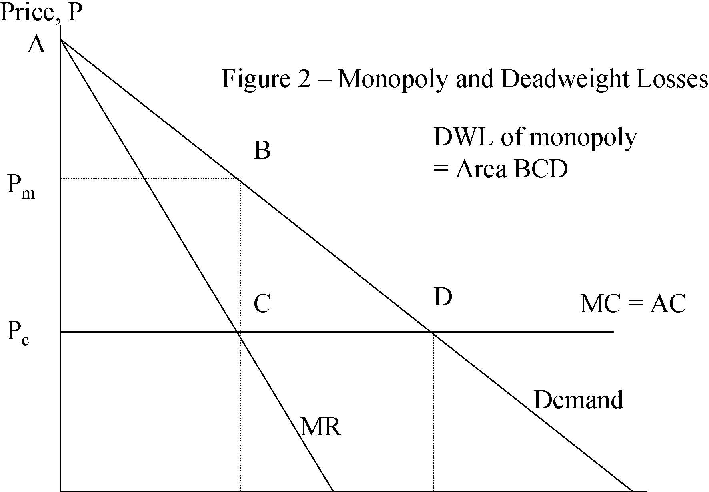

Demand MR Price, P Figure 2 – Monopoly and Deadweight Losses C B D DWL of monopoly = Area BCD

Pm 

MC = AC Pc 

0 Qm Qc Quantity, Q 

7 

Calculating Social Surplus under Monopoly and Competition

-  Demand, Q=100 – P 

-  Marginal and average cost, MC = AC = 20 •Pm=$60, Qm=40; at monopoly equilibrium •Pc=$20, Qc=80; at competitive equilibrium 

-  Monopoly: 

-  Total surplus: APcCB=$2400 –CS: APmB=$800; PS: PmPcCB=$1600 

-  Competition: 

-  Total surplus: APcD=$3200 –CS: APcD=$3200; PS: PmPcCB=$0 

8 

Social weightsand why they matter

- 	Society does not usually make decisions based on the maximisation of the sum of producer and consumer surplus. 

- 	It usually attaches different weights to different groups of consumers and producers (and the government). 

- 	Example of regulating casinos. De-regulation of casinos may effect those who cannot afford to gamble and the very rich impacting on consumer surplus. However it may also raise the producer surplus by increasing the profitability of casinos. 9 

Price, P Figure 3 -A natural monopoly DMC AC E F G 

Pc

Pm 

P* 

Qeff

Qc

Qm

Quantity, Q

How to improve social welfare in Natural Monopoly Industries

-  Government ownership e.g. USPS 

-  Regulation of prices e.g. Electric Utilities 

-  Franchising e.g. Cable TV 

-  Introduction of competition e.g. Telephony 

Other types of market structure with deadweight losses

- 	Monopsony – where a single buyer drives down the price it pays and the quantity it buys. 

- 	Oligopoly – the intermediate case between perfect competition and monopoly where a small number of firms operate in a market with some ability to raise prices and reduce industry output. 

- 	Oligopsony – where small groups of buyers drive down price paid and quantity bought. 

- 	Oligopoly and oligopsony and their detection and control are more the concern of anti-trust authorities rather than economic regulatory agencies. 12 

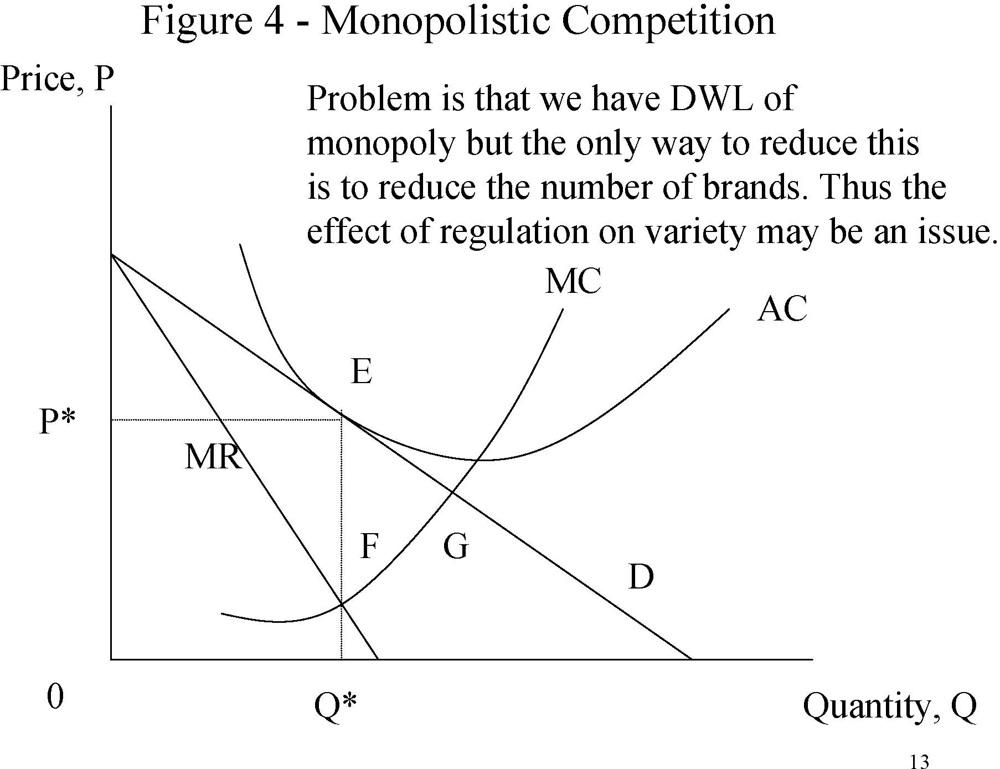

13 Price, P Quantity, Q0 MC AC D MR Q* P* Figure 4 -Monopolistic Competition E F Problem is that we have DWL of monopoly but the only way to reduce this is to reduce the number of brands. Thus the effect of regulation on variety may be an issue. G 

Figure 5 – Price controls and price supportsP, Price 

P1 Pc P2 

Q

1 

Q

c 

Q

2 

Q, Quantity

Figure 6 – Taxes and Subsidies P, Price 

Pt 

P* Ps 

Supply, S Demand, D Q, QuantityQ* S+Tax S-Subsidy A C E FB 

Qt Qs

Figure 7 – Import Tariffs and QuotasP, Price 

US Supply 

PT 

PT= US Price with Tariff 

PF= World Free Trade Price 

PF 

Q

1 

Q

2 

Q, Quantity

Deadweight Losses of Monopoly 

1( P * − Pc )( Qc − Q *) = 1 ηd 2 P * Q *22

where :P * = actual priceQ * = actual quantity

η= price elasticity of demandd = price cost margin

-  Harberger (1954) from industry revenue and profits. 

- 	Estimated d as difference between industry and average sample rate of return. 

•Assumed η=1. 

-  Got answer that DWL are only 0.1% of GNP. 17 

Deadweight Losses of Monopoly

*P = η⎜⎛ = 1 ⎞⎟

*P − MC ⎝ d ⎠ substituti ng this inthe Harberger formula we have 

*1 ⎛ P − MC ⎞ **1 * *1*DWL ≅ 2 ⎝⎜⎜ P * ⎠⎟⎟ PQ = 2( P − MC )Q = 2 Π

-  Cowling and Mueller (1978). 

-  Data on 734 US firms in 1963-66. 

-  They estimate DWL of 4% of GCP. 

- 	If you include rent seeking behavior the figure is much higher. 

18 

X-Inefficiency

- 	X-inefficiency (Leibenstein, 1966) occurs when firms do not minimise the costs of producing their output. 

- 	X-inefficiency occurs due to lack of competition or incentive to minimise costs within firms. 

- 	Monopolies may be particularly prone to such inefficiency. 

- 	Thus a reason why de-regulation might be favoured is because the static cost efficiency of monopoly is outweighed in the long run by rising X-inefficiency. 19 

Technical Progress 

- 	Schumpeter famously argued that monopoly was good for innovation because the competition for monopoly encouraged investment in innovation. 

- 	Research and Development expenditure can take a number of different forms and involves different stages: 

-  Basic and applied research 

-  Invention 

-  Development 

-  Diffusion 

Technical Change and Competition

Present Discounted 

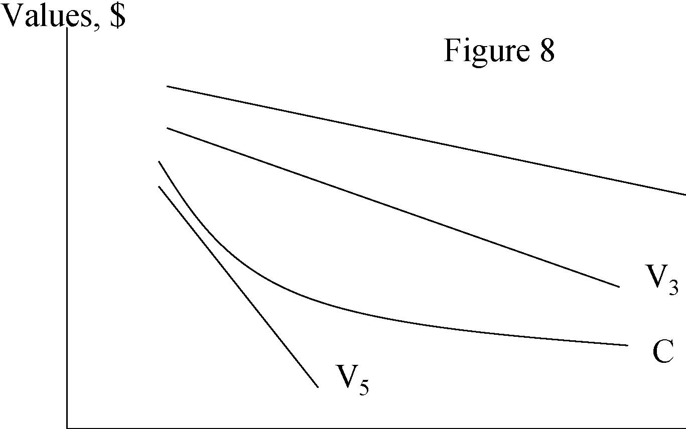

V5 V3 C Values, $ Figure 8 

0 

Time to innovate, T 

V1

Explaining the model

-  Earlier innovation costs more but is more beneficial. 

- 	Benefits of innovation to individual firm are negatively effected by number of competitors (V1to V5). This is because more competitors increases the speed and severity of copying by rivals. 

- 	This implies that there can be excessive competition which stifles innovation completely by eliminating incentives to invest (V5&lt;C). 

- 	Thus one aim of regulation may be to preserve incentives to innovate and to reward innovators. 

Regulatory approaches to innovation

•Patents 

-  These give companies a monopoly right to exploit an invention for a limited period. This increases producer surplus in the short run. 

-  Copyright 

-  This gives copyright holders the right to benefit from reproduction of intellectual property for a period. This similarly increases producer surplus in the short run. 

- 	The impact of these arrangements on consumer surplus in the short run is uncertain. There may be more innovations which quickly benefit consumers even though they are expensive. 23 

Conclusions

- 	Short run static efficiency likely to be negatively effected by monopoly via deadweight losses. 

- 	Technical progress may benefit from monopoly as monopoly may be associated with better incentives to invest in innovation. 

- 	Regulation needs to involve society deciding on the optimal trade-offs between consumer and producer surplus based on implicit or explicit social weights. 

Next 

-  Revision of Oligopoly and Collusion. 

-  Read VVH Chapter 5 (to page 122). 

         Acrobat Distiller 5.0.5 (Windows)

         2003-07-28T02:20:08Z

         2003-08-18T12:02:00+05:30

         2003-08-18T12:02:00+05:30

         PScript5.dll Version 5.2

         xml

               bersara

               Microsoft PowerPoint - 14.23 Class3.ppt

# 14.23 Government Regulation of Industry

Class 3

## MIT &amp; University of Cambridge

-  Definitions 

-  Nash Equilibrium 

-  Monopoly and Perfect Competition revisited 

-  Duopoly and social welfare 

-  Cournot, Stackelberg and Bertrand Oligopoly 

-  Collusion 

-  Is oligopoly a problem? 

-  Prisoners’ Dilemma and Game Theory 

## The strategies x and y form a Nash equilibrium for players 1 and 2 respectively if x is the best response for 1 if 2 has chosen y and y is the best response for 2 if 1 has chosen x. 

# Monopoly and Perfect Competition

Consider the following example:Market Demand: P=25-QMarginal Cost = Average Cost = 5Competitive Outcome:MC=MR=P=5, Q=20; CS=200, PS=0Monopoly Outcome:MR=25-2Q=MC=5; Q=10, P=15; CS=50, PS=100, DWL=50

-  Consider two identical firms (1 and 2). 

- 	Both set quantity assuming the other firm’s quantity is independent of their own choice of output. 

- 	Thus the conjectural variation is zero (i.e. firm 1 assumes dq2/dq1=0). 

- 	Equilibrium occurs when each firm does not want to change its output having observed what output the other firm has set. 

Price, P=25-(q1+q2); Total costs, C1=5 q1; C2=5 q2;

Profit, Π1=(25-q1 -q2) q1 -5 q1 

Differentiate the profit function with respect to q1 and set equal to zero to solve for marginal revenue=marginal cost. 

This gives the reaction or best response function for Firm 1: this gives q1 =(20-q2)/2. 

Repeat the procedure for the identical Firm 2: 

this gives q2 =(20-q1)/2 

•q1 =(20-q2)/2 and q2 =(20-q1)/2•q1=q2=20/3•P=35/3

-  Π1 = Π2 = 400/9; PS=800/9 

-  CS=800/9 

-  CS+PS=1600/9=177.78 

q2, Output of firm 2

Π22 Figure 1 -A Cournot equilibrium R2 Π21 Π12 Π11 R1 Cournot Equilibrium 

0 q1, Output of firm 1

Π21 &lt; Π22; Π11 &lt; Π12 

-  Firm 1 is leader, Firm 2 is follower 

-  Firm 1 knows q2 =(20-q1)/2 and maximises 

-  Firm 2 is a Cournot player•q1=10, q2=5•p=10

-  Π1= 50, Π2= 25 ; PS=75 

-  CS=0.5(15*15)=112.5 

-  CS+PS=187.5 

q2, Output of firm 2

Figure 2 -A Stackelberg Equilibrium R2 R1 Cournot Equilibrium Stackelberg equilibrium with 1 as leader 

q21 

0 q11 q1, Output of firm 1

First mover firm can get higher profits than at the Cournot equilibrium.

-  Consider two identical firms (1 and 2). 

•Both set price assuming the other firm’s price is independent of their own choice of output. 

- 	Thus the conjectural variation in price is zero (i.e. for firm 1 dp2/dp1=0). 

- 	Equilibrium occurs when each firm does not want to change its price having observed what the price the other firm has set. 

-  Price equals marginal cost (=average cost). 

-  There are zero profits. 

- 	Firm 1 and Firm 2 produce similar but not identical products and compete on price. 

-  Demands: q1=20-p1+p2, q2=20-p2+ p1 •Assume mc=0 

- 	Price reaction functions: p1 =(20+ p2)/2 and p2 =(20+ p1)/2 

•p1 = p2 =20, Π1=Π2=400 

-  If Firm 1 is a leader, p1 =30, p2 =25 

-  Π1 =450, Π2 =625 

-  You don’t want to be the leader! 

12 

Figure 3 – The Bertrand Equilibrium p2 p*2 

0 

R1 R2 

p1 p*1 

•Q=q1+q2+…+qn 

- 	MR=MC for each firm i Π i=P(Q).qi-C(qi) 

-  F.O.C.: MCi=P(Q)+ qi dP/dqi •si=qi/Q, note in Cournot: dP/dQ=dP/dqi 

-  Rearranging we get: (P-MCi)/P=si/η 

-  Note the properties of this equilibrium result! 

-  Collusion involves a non-zero conjectural variation. 

-  This involves co-ordination such that dq2/dq1&gt;0 

- 	Co-ordination of output can come about as a result of an agreement (co-operative behaviour) or as a result of infinite or indefinite repetition or irrational commitments. 

- 	In our original example the collusive outcome is P=15 and q1=q2=5 and firm profits are 50. If cheating occurs could switch to Cournot oligopoly, profits would drop to 400/9=44. Can get profits of c.55 if set qi=20/3 when qj=5. 

- 	If firm 1 thinks about cheating calculates whether one period gain is greater than multi-period loss: 

15 

-  Max gain is 5; loss is 6/R, thus only cheat if R&gt;6/5 

- 	Collusion is very difficult to sustain for long periods in practice. 

- 	This is because collusive equilibria are unstable due to uncertainty, new entry, differences in costs, multiple equilibria. 

- 	Sustained collusion requires communication and probably explicit co-ordination and sophisticated side-payments. 

- 	Not clear that most types of tacit collusion are worth acting on due to Schumpeterian effects. 

-  Example of UK White Salt market in 1986. 16 

Figure 4 -Oligopoly as a normal form game

<Table>
<TR>
<TD>1 2 </TD>
<TD>S1=5 </TD>
<TD>S2=20/3 </TD>
<TD>S3=10 </TD>
</TR>
<TR>
<TD>S1=5 </TD>
<TD>(50,50) </TD>
<TD>(42,55) </TD>
<TD>(25,50) </TD>
</TR>
<TR>
<TD>S2=20/3 </TD>
<TD>(55,42) </TD>
<TD>(44,44) </TD>
<TD>(22,33) </TD>
</TR>
<TR>
<TD>S3=10 </TD>
<TD>(50,25) </TD>
<TD>(33,22) </TD>
<TD>(0,0) </TD>
</TR>
</Table>

Let us consider once again why (44, 44) is the Nash equilibrium and (50,50) is the collusive equilibrium.

Figure 5 -Oligopoly as an extensive form game 

(50,50) 

(42,55)(25,50)(55,42)

P1 

S1=5 S1=5 S2=20/3 S3=10 P2 P2 P2 S2=20/3 S3=10 S1=5 S2=20/3 S3=10 S1=5 S2=20/3 S3=10 

(44,44) 

(22,33) 

(50,25) 

(33,22) 

Player 1 moves first, followed by Player 2. 

(0,0) 

Let us use Cournot model to demonstrate why (50, 25) is the Nash eqm.

Figure 6 -The Prisoners’ Dilemma

Don’t Confess Confess Don’t Confess Confess 1 2 (10,10) (5,5)(12,2) (2,12) 

(x,y): x=return to Prisoner 1, y=return to Prisoner 2. Higher numbers are better for the Prisoners. 

- 	Simultaneous moves (5,5) is the likely solution. This is the rational strategy (Nash Equilibrium). 

- 	However (10,10) is superior to (5,5) for both players (Pareto superior). 

- 	Many environmental problems can be characterised as Prisoners’ Dilemmas. 

- 	These are solved by social convention, law and repetition. 

- 	Different market structures are associated with different levels of social welfare and deadweight loss. 

- 	Cournot and Bertrand oligopoly are better than monopoly and collusive oligopoly. 

- 	Firms within oligopolies can be thought of as playing games where they attempt to maximise profits by choosing levels of variables under there control in the light of assumed reactions of other firms. 

- 	Economic regulation is important where monopoly exists and conditions make sustained collusion likely. 

- 	Revision of Dominant Firms and Entry Deterrence. 

-  Read VVH Chapter 6. 

         Acrobat Distiller 5.0.5 (Windows)

         2003-07-28T02:20:23Z

         2003-08-11T14:18:43+05:30

         2003-08-11T14:18:43+05:30

         PScript5.dll Version 5.2

         xml

               bersara

               Microsoft PowerPoint - 14.23 Class4.ppt

# 14.23 Government Regulation of Industry

Class 4

MIT &amp; University of Cambridge

Outline 

-  Definitions 

-  Markets and Concentration 

-  Barriers to Entry 

-  Contestable Markets 

-  Dominant Firm theory 

-  Strategic competition and limit pricing 

-  Entry Deterrence 

-  Brand Proliferation 

Definition of a Market 

-  This is not as easy as it seems. 

-  Identification of real markets can be done by: 

-  physical characteristics of firms’ products 

-  the technology/raw materials employed 

-  the cross price elasticity of demand between products 

-  statistical definition (SIC figures) • 

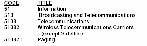

SIC system changed to NAICS in 1999. 

- 	The example of Alcoa (aluminium ingots) and DuPont (cellophane wrappings) 3 

Measurement of Concentration 

-  Concentration Ratio: CRx, or mkt share of largest x firms. 

-  Easy to measure 

-  Herfindahl index: H=Σsi2, where si=mkt share of ith firm. 

-  Ideal properties 

-  Numbers equivalent property 

- 	Herfindahl Hirschman Index: HHI=Σ(100si)2 –HHI=Σ(100si)2=10000 Σsi2 

-  Used by the Department of Justice Anti-Trust Division 

-  Note connection with N-firm Cournot Model –(P-MCi)/P=si/η; Σ si[(P-MCi)/P]=HHI / 10000*η 

-  HHI is very important in Anti-trust cases. 

Scale Economies

- and Entry Barriers• Why do markets become concentrated? 

-  Scale economies and Entry barriers 

- 	Scale Economies related to LRAC and plant and multiplant economies. 

-  Diseconomies, usually of management, set in eventually. 

- 	Under Free entry, N participants, π(ne) is the profitto each firm if there are N firms (excluding entry costs). K is the fixed cost of entry. 

-  This implies that entry occurs up to the point that: 

π ( ne ) − K &gt; 0 &gt;π ( ne + 1) − K 5

rr 

Barriers to Entry

- 	Difficult to define and can arise for a host of innocent, regulatory and strategic reasons. 

- 	Bain: defines barriers to entry (BTE) in terms of outcome – they exist if firms make super normal profits. 

- 	Stigler: BTE are costs of production incurred by new entrants which are not incurred by incumbents. 

- 	Von Weizsacker: BTE are ‘socially undesirable limitations to entry of resources which are due to the protection of resource owners already in the market.’6 

The theory of contestable markets (Baumol et al, 1982)

- 	A sunk cost is a fixed cost that a firm incurs which cannot be recovered if the firm leaves the market. 

-  Perfect contestability? 

-  It assumes multi-product firms, ultra-free entry and exit, zero sunk costs and quantities adjust faster than prices. 

- 	Why such a fuss about this theory – ‘an uprising in the theory of markets’? 

- 	This shifts the focus of concern about market competitiveness to sunk costs rather than number of firms. Example deregulated US airline industry. 

Figure 1 -Price and output in a natural monopoly which is perfectly contestable

P

Demand curve c+f/Q= AC

PC

MC

QC

Q

If incumbent prices above AC, she will be replaced by entrant.

Dominant Firm Theory 

-  We have a single dominant firm (e.g. AT+T). 

- 	We have a competitive fringe of higher cost suppliers. 

-  Dominant firm is a residual claimant. 

•Dd(P)=D(P)-S(P), where Dd(P)=dominant firm demand, S(P)=fringe demand, D(P)=market demand. 

-  Questions: 

-  To what extent does fringe discipline the behaviour of dominant firm? 

-  How is the dominance of the dominant firm likely to 

evolve over time? 

$

pm 

Figure 2 -Dominant Firm Theory

Solution method for dominant firm is to maximise profits where demand is residual demand. It can be shown that even if market 

p^

p*cd

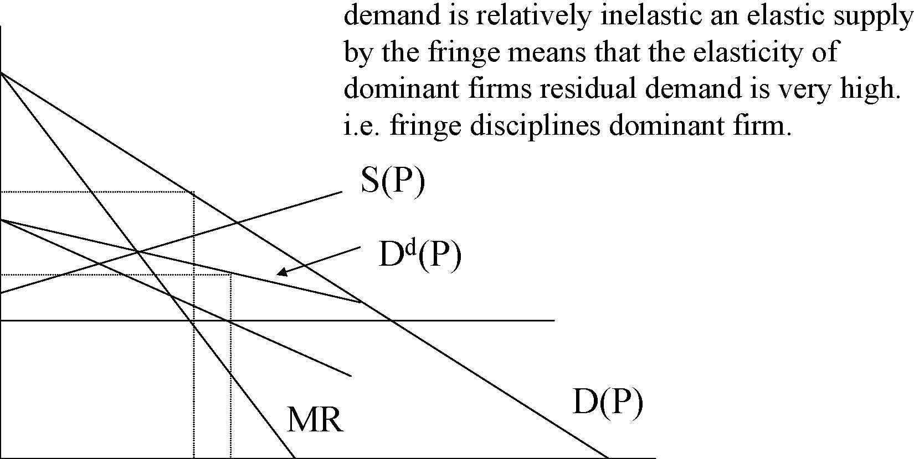

MR D(P) S(P) Dd(P) demand is relatively inelastic an elastic supply by the fringe means that the elasticity of dominant firms residual demand is very high. i.e. fringe disciplines dominant firm. 

0 qmq* q

Dominant Firm Theory

-  What happens over time to dominance? 

-  At any given time: 

-  S(P(t))=x(t) if P(t)&gt;cf; 0 otherwise. 

- 	Where x(t)=capacity of fringe, cf=unit variable cost and 1 unit of capacity required for each unit of output. Let u(t) be retention ratio. 

- 	To expand fringe invests retained profits in new capacity which costs $z per unit: 

∆ x ( t ) =[P ( t ) − cf ]x ( t ) u ( t )1;if P ( t ) ≥ cf 11z 

What should the strategy of the dominant firm be?

-  Myopic Pricing: 

-  Choose price that maximises current period profits. This will make large profits now but rapidly diminishing market share. E.g. Reynold’s International Pen Corporation. 

-  Limit Pricing: 

-  Set price at level which makes no investment by fringe profitable i.e. P=rZ+cf 

-  Optimal Pricing: 

-  This is somewhere between the two extremes. Under most discount rates myopic pricing is not profit maximising (does not maximise present value), but 12 

neither is limit pricing.

Limit, myopic and optimal pricing

P Size of Fringe Output

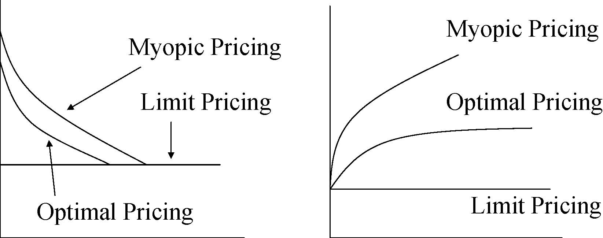

Myopic Pricing Optimal Pricing Limit Pricing Myopic Pricing Optimal Pricing Limit Pricing 

PL

0 t0t

Figure 3 Figure 4

Strategic Competition

- 	Strategic competition is any behaviour by a firm to try and improve its future position in the market. 

-  Examples: 

-  Predatory pricing 

-  Regulatory changes 

-  Advertising and R+D expenditures 

-  Patent thickets 

- 	The first way this was studied was looking at limit pricing by the incumbent to reduce post entry profitability of entrant. 

Price 

Figure 5 -The Theory of Limit Pricing 

PM

P1

P2

MC MR AC Market demand curve Residual demand curve Bain (1956), Sylos-Labini (1962) 

0 qE qM qE+qI Output

qI

PM=monopoly price, P1=entry deterring limit price P2=post-entry price 

Figure 6 -Is limit pricing credible? A game of entry deterrence 

E

I Do not enter fight Do not fight Enter 

(5, 0)

(-1,-1)

(1,1)

Entrant moves first, Incumbent responds.For payoffs (x,y), Incumbent gets x, Entrant gets y.Nash Equilibrium is Enter, Do not fight with payoff (1,1).

Credibly affecting entry

- 	Adjustment costs mean that post-entry lowering of output is costly for incumbent: C(Qt)=a+bQt+0.5(Qt-Qt-1)2 

- 	Learning curve: credible to produce a lot to begin with in order to reduce costs in the future. 

- 	Switching costs mean it makes sense to keep price low in order to hook customers. 

- 	Investment in extra capacity in order to lower marginal costs of production, and hence credibly commit to higher post-entry output. 

Dixit Model of Entry Deterrence

- 	This works by lowering the incumbent’s marginal cost and hence making higher output more profitable. (mc=c below initial capacity but, mc=c+r above initial capacity) 

-  An example: 

-  If P=10-(XI-XE); CI=6+rKI+cXI, CE=6+(r+c)XE; K must at least equal X, I=incumbent, E=entrant; then: 

–XI=(10-XE-c)/2 below initial capacity (reaction curve I) 

–XI=(10-XE-c-r)/2 above initial capacity (same as entrant) 

-  Let r=1 and c=1 for simplicity in what follows: 

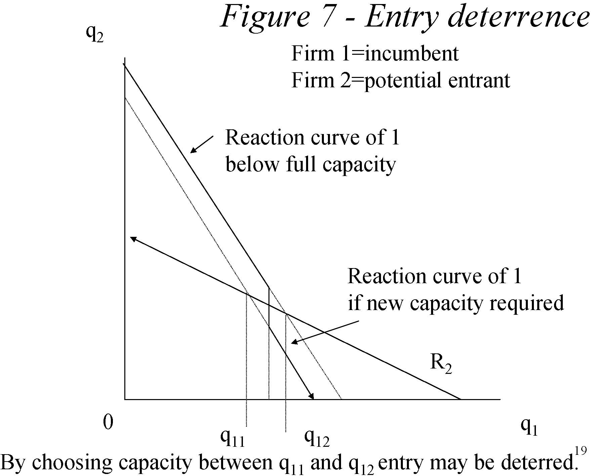

19 q2 0 R2 q1 Reaction curve of 1 below full capacity Reaction curve of 1 if new capacity required q11 q12 By choosing capacity between q11 and q12 entry may be deterred. Firm 1=incumbent Firm 2=potential entrant Figure 7 -Entry deterrence 

Figure 8 -Strategic Entry deterrence

(1,-0.02) 

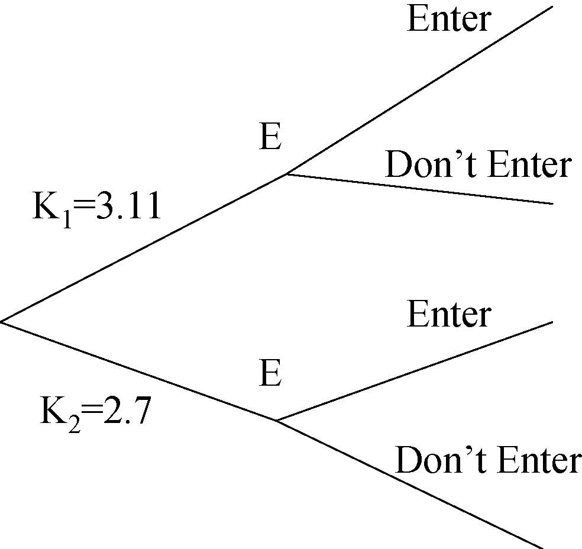

E E Enter Don’t Enter Enter Don’t Enter K1=3.11 K2=2.7 

I

(9, 0)(1,1)

(8,0)

Incumbent can choose a capacity level before entry. This implies the Nash equilibrium is K1, Don’t enter. (VVH has three stage game which we have simplified.) 

Raising Rivals Costs

- 	A feasible and credible way to deter entry may be to take actions which raise your rivals’ costs: 

-  Regulation 

-  Unionization 

-  Grand-fathering of rights (like tradeable emissions permits or airline take-off slots) 

- 	These strategies work because although they may mean higher costs for the incumbent, they mean disproportionately higher costs for the rivals. 

Pre-emption and brand proliferation

- 	If there are 2 possible substitute goods (X and Y) then it may pay a monopolist to produce only X and save on fixed costs. 

- 	However if demand for Y picks up such that entry is profitable to produce Y. 

- 	As an incumbent you may want to produce Y ahead of entry being profitable in order to prevent entry and keep price of X up. 

- 	This of course may not be socially efficient and we may get excess brands from a social point of view (of course competition may do this anyway). 

22 

-  E.g. breakfast cereals and fertilizers. 

Conclusions 

- 	Barriers to entry may prevent new firms entering markets especially in conditions of high sunk costs. 

- 	Dominant firms may be severely disciplined by a competitive fringe of higher cost firms, hence may not pose regulatory problems e.g. AT+T. 

- 	Incumbents must act credibly if they are to strategically deter entry. There are many strategies they might adopt to do this. 

- 	Such entry deterring strategies do not usually lead to socially efficient outcomes because fixed costs are incurred above the socially optimal level. 

- 	High barriers to entry, lack of competition, wasteful strategic behaviour all provide rationales for economic regulation. 

Next 

-  Introduction to Economic Regulation 

-  Read VVH Chapter 10. 

         Acrobat Distiller 5.0.5 (Windows)

         2003-07-28T02:20:45Z

         2003-08-11T14:22:11+05:30

         2003-08-11T14:22:11+05:30

         PScript5.dll Version 5.2

         xml

               bersara

               Microsoft PowerPoint - 14.23 Class5.ppt

# 14.23 Government Regulation of Industry

Class 5

MIT &amp; University of Cambridge

-  Instruments of Regulation 

-  History of Regulation in the US 

-  Overview of process of regulation 

-  Theories of Regulation 

-  Theory of Natural Monopoly 

-  Pricing under Monopoly 

-  Conclusions 

-  A definition: 

- 	‘A government imposed limitation on the behavior of individuals or organizations.’ 

- 	e.g. minimum wage restrictions, pollution targets and information requirements. 

-  Control of price 

-  This aims to prevent both predatory pricing and over charging. 

-  Control of quantity 

-  Universal service obligations, maximum production limits. 

-  Control of entry 

-  e.g. in long distance telecoms and NYC taxicabs 

-  Control of quality 

-  e.g. of emissions, customer service levels, safety etc. 

- 	Religious leaders have restricted the price of credit and discussed ‘Just Prices’ (e.g. Aquinas) 

- 	Modern economic regulation begins in 1870s with regulation of water and gas rates. 

- 	In US case law develops scope for regulatory action. 

-  Munn v. Illinois (1877) 

-  1871 Illinois sets a ceiling on rates for grain elevators 

-  Munn and Scott claim law deprives them of private property without due process (5th amendment). 

-  Ruling establishes public interest defense for regulation of private property. 

-  Interstate Commerce Act of 1887 

-  Railroads affected by high prices with periodic price wars. 

-  Act establishes Interstate Commerce Commission (ICC) to regulate railroad rates. 

-  Nebbia vs New York (1934) 

-  NY regulating price of milk 

-  Nebbia undercuts price of milk and is sued. 

-  Claimed that: 1. Market is competitive, 2. Market is not a utility, 3. Due process violated. 

-  Court ruled: 1.&amp; 2. Yes; 3. No. 

-  This establishes that any industry can be regulated. 

- 	MA was regulating utilities in 1885 and by 1930 most states had Public Service Commissions. 

-  3 spurts of regulation: 1909-1916, 1933-40, 1973-

- 80. 

-  1930s: 

-  ICC expanded into trucks, water barges, oil pipelines, passenger buses. 

-  1934 Federal Communications Commission (FCC) 

-  1935 Federal Power Commission (Electricity and Natural Gas) 

-  1934 Securities and Exchange Commission (SEC) 

- 	Steady growth, in 1977 17% of GNP was fully regulated. 

8 

- 	Parallel trends around the world except that in many cases public ownership was adopted in order to better regulate industries. 

-  In United Kingdom large scale nationalizations: 

-  Telecoms (1912) 

-  Bank of England (1946) 

-  Rail (1948) 

-  Electricity (1948) 

- 	This allowed the state to better regulate pricing and service than the private sector was doing at the time. 

- 	Worldwide wave of de-regulation begins towards the end of the 1970s. 

- 	In the US: Airlines, railroads, trucking, passenger buses, long distance telephone, wholesale power. 

- 	In Europe: Rail, Telecoms, Electricity, Gas, Postal Services, Air transport all subject to national and European Union wide legislative changes. 

- 	In the US: only 6.6% of GNP fully regulated by 1988 (17% in 1977). 

- 	In the UK: 10% of GNP transferred from state control to private (usually competitive) ownership between 

1979 and 1997. 

# Overview of Process of Regulation

-  Legislation (e.g. Federal Power Act, 1935): 

-  Specifies a regulatory agency 

-  Specifies powers of the agency 

-  Specifies policy objectives 

-  E.g. reasonable and just service to all consumers. 

-  Implementation: 

-  Federal regulatory commissions usually have 5 members, can be experts or political friends. 

-  Commissioner may be fired for cause but not at will (independent). They can use case by case hearings or an across the board ruling. 

-  Staff of Commission collect data and advocate against industry. 

11 

# Overview of Process of Regulation

-  3 types of Commission Employee: 

-  Careerist (wants agency to exist and grow) 

-  Politician (will leave agency for other office) 

-  Professional (will move on to other work) 

-  In pricing legislation for instance, professional wants complex regime with nice theoretical properties, careerist wants simple set up to avoid problems and politician wants to please interest groups. 

-  Other players include: 

-  Consumer groups – want lower prices 

-  Incumbent firms – want high stable profits 

-  Competitors – want more liberalised markets 

12 

- 	Normative Analysis as a Positive Theory or Public Interest Theory 

-  In some markets unconstrained competition does not work e.g. under natural monopoly or externalities. 

-  Under natural monopoly productive efficiency suggests we should have one firm and p=mc but this does not happen in an unconstrained market. 

-  Normative analysis suggests that in this circumstance we should have regulation. 

-  Positive analysis says that regulation does occur when we have these sorts of circumstances. 

-  This suggests a pro-social welfare motive for 

13 

regulation.

-  Capture Theory (Stigler) 

-  Regulation is supplied in response to the industry’s demand for regulation. 

-  Regulatory agencies are created by captured legislatures. 

-  Regulatory agencies come to be controlled by industry. 

-  This suggests a pro-producer theory (i.e. pro-producer surplus theory) of regulation. 

Most regulation would seem to be motivated by a combination of the above two theories. 

-  Economic Theory of Regulation 

-  Stigler-Peltzman Model predicts that: 

-  Regulatory legislation redistributes wealth. 

-  Behavior of legislators is driven by desire to remain in office. 

- 	Interest groups compete by offering political support in return for favorable legislation. 

- 	Example of electric power rates: residential, commercial and industrial power rates showed lower price-cost ratios for industrial and industrial customers relative to commerical ones, why? 

–Becker Model: 

- 	Focuses just on role of interest groups and assumes that they compete with one another to gain most influence. 

π

π(p) M1M2 

0 pc pm Price, p 

p*

Increase in costs of regulation increases the 

influence activity of firm, 2 and reduces it 

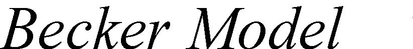

Becker Model 

for consumer, 1. This is because a given 

wealth transfer to 2 from 1 is more costly to 

firm 2 (increased incentive to pay to avoid it) 

and is more costly to acquire for consumer 1 

Pressure, p

I12(p2) I11(p2) I22(p1) I21(p1) 

2 (less incentive to pay to get it). 

p*2 

0 p*1 Pressure, p1 

# Conclusions ofEconomic Theory of Regulation

- 	Tendency for regulation to be designed to benefit relatively small groups with strong preferences relative to big groups with weak preferences. 

- 	Pro-producer tendencies are disciplined by consumer groups meaning that price is less than the monopoly level. 

- 	Regulation most likely in competitive or monopoly industries as there is strong incentive for one group to lobby for regulation. 

- 	In the presence of market failure regulation is likely because of the large losses this inflicts on some interest groups. 

# Can Economic Theory of Regulation explain de-regulation?

-  Partly: 

-  Consider: 

-  Role of New Technology 

-  Demand Growth 

-  Inefficiency and budget deficits 

-  How do these affect interest groups around legislation? 

- 	However there was a strong role for public interest theory as well e.g. was Mrs Thatcher economically rational? 

- 	One should be careful in moving towards non-falsifiable economic theories of human behavior 

as all insights may be lost. 

19 

## Solving the Natural Monopoly pricing problem

-  Is it really a natural monopoly? 

-  Linear pricing 

-  Two part tariffs 

-  Loeb-Magat proposal 

-  Franchise Bidding e.g. Cable TV 

-  Ramsey Pricing e.g. telephone service? 

-  Public Enterprise e.g. MBTA 

$ 

D3 D2 D1 AC 

P2

0Q

Q2

A natural monopoly has as a sub-additive cost function.

# Linear Pricing 

P=AC or P=MC?P=MC may be efficient buthow are losses to be funded?If we have a private firm how does

$

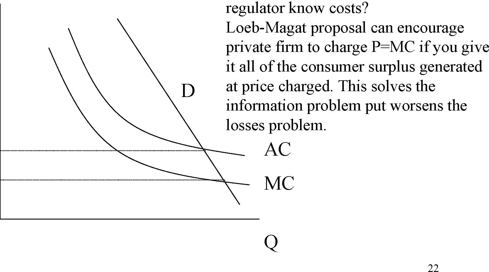

22 D regulator know costs? Loeb-Magat proposal can encourage private firm to charge P=MC if you give it all of the consumer surplus generated at price charged. This solves the information problem put worsens the losses problem. 

PACPMC

AC

MC

Q

# Two Part Pricing andRamsey Pricing

-  Two part pricing: fixed fee plus per unit charge. 

-  Unit charge could equal marginal cost. 

- 	Problem fixed charge may discourage some people from taking service at all. 

-  Solution vary fixed charge to cross-subsidise low users. 

- 	Ramsey pricing minimises the deadweight losses incurred in raising prices to cover costs for multi-product monopolists. This happens when (P-MC)/P = α/price elasticity of demand, where α=some constant.

23 

-  Public Enterprise 

-  Read VVH Chapter 14. 

         Acrobat Distiller 5.0.5 (Windows)

         2003-07-28T02:21:01Z

         2003-08-11T14:25:55+05:30

         2003-08-11T14:25:55+05:30

         PScript5.dll Version 5.2

         xml

               bersara

               Microsoft PowerPoint - 14.23 Class6.ppt

# 14.23 Government Regulation of Industry

Class 6

MIT &amp; University of Cambridge

Outline 

-  History of public enterprise 

-  Theory of private vs. public enterprise 

-  Managerialism: better or worse? 

-  Prices under different forms of ownership 

-  Productive efficiency under public ownership 

-  Privatization: theory and evidence 

-  Conclusions 

A history of Public Ownership

- 	Romans had public ownership of water industry and military arms production. 

-  Public ownership in the US is substantial in: 

-  Electricity (20%, 2000+ firms) and Gas 

-  Water (80%) 

-  Local transport: bus, subway, commuter rail. –Rail 

-  Roads 

-  Airports 

- 	In post-War Europe more public ownership of telecoms, electricity and other commercial firms. 3 

The case for public ownership 

-  To achieve re-distributive goals 

-  To ensure adequate investment 

-  To prevent monopolisation 

-  To facilitate coordination 

-  To ensure safety or security 

-  To reduce financial cost (inc. regulatory cost) 

-  To allow more macroeconomic stabilisation 

The case for private ownership

- 	Markets are good at allocating property rights (Property Rights Theory, Alchian and Demsetz, 1965). 

- 	Bureaucracies are bad at running businesses (Public Choice Theory, Niskanen, 1968). 

- 	Explicit regulation of privatised companies can be more effective than oversight of public corporations (Theory of Regulation, Baron and Myerson, 1982). 

- 	Private ownership reduces influence activities and power of interest groups (Influence theory, Milgrom and Roberts,90). 

- 	Private ownership increases cost of disruptive government intervention (Commitment Theory, Boycko et al., 1996).

5 

Organisational Alternatives (Parker and Hartley, 91)

-  Co-operatives 

-  Central government ownership (large scale) 

-  Municipal government ownership (small scale) 

-  Government Department 

-  Quasi-Government Agency 

-  Public Corporation 

-  Wholly-owned public limited company (plc) 

-  Public limited company (plc) 

Incentives in the public and private sector

- 	Is it possible to incentivise utility managers to deliver socially optimal service? 

- 	Yes, if contracts can be written which reward managers for this service delivery. 

- 	For a conventional private firm this works through profits being positively related to performance and managerial incentives -job tenure, promotion and pay-being related to profits of the firm. 

- 	For a monopoly public service company explicit contracts need to be written which reward/penalize the firm for delivering the socially optimal service and then with the manager to align her incentives with this. 7 

Incentives in the public and private sector

- 	For the private monopoly the problem is that writing the contract between the firm and society is difficult. 

- 	For the public monopoly the problem is that incentivising the manager may be difficult. 

- 	The case for public ownership is stronger when non-contractible quality is important (e.g.safety, national security) (Hart, Shleifer and Vishny, 97). 

- 	The case for private ownership is stronger where esprit du corps, reputation effects and political monitoring of managers are weak (e.g.for a national telecoms co.). 8 

Public ownership in the US(Glaeser, 2001)*

- 	Public ownership may be particularly advantageous in the presence of idiosyncratic local monopoly where contracting and monitoring are difficult. 

- 	This may be because private firms have incentives to underpay for inputs, get overpaid for outputs and pervert subsidies for externalities and to bribe politicians. 

- 	A good example of this may be local transportation. A private provider will lobby to get the rights of way for free, demand high prices and lobby for subsidies for unprofitable routes. 

-  It may be less corrupting to municipalize provision. 9 

*http://post.economics.harvard.edu/hier/2001papers/HIER1930.pdf 

Stronger case for government ownership in WW2 (Gleaser, 2001)

- 	Government controls salaries and prevents inflation in wages. 

-  This is important where the government is a large purchaser of the ultimate product (applies to healthcare and education). 

- 	Government cant separate ability to write contracts from ownership. 

-  This arises due to the lack of experience of the particular circumstances which arise in a war. 

- 	Unpredictable demands mean that the costs of renegotiation with the private sector are expensive. 

-  Normally this is a good thing because it reduces political interference. 10 

Public vs. Private Ownership

- 	Largely an empirical question for situations where quality is important and monitoring of public enterprises is strong. 

- 	Public ownership can be used to redistribute consumer and producer surplus: 

-  Low prices may be supported by tax dollars and cheap loans as part of a welfare policy (e.g.public transport). 

-  High prices may be enforced as a revenue collection activity (e.g.state liquor stores). 

- 	However the question remains do public utilities deliver lower prices and at what cost? 

11 

US Electricity Prices by ownership form, 2000

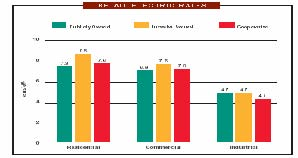

Source: APPA, 2002

Price Discrimination 

- 	Peltzman (1971) suggests that publicly owned firms have less of an incentive to price discriminate than privately owned firms. 

- 	While lower prices may be associated with lower deadweight losses of monopoly, lower levels of price discrimination are associated with greater deadweight losses. 

- 	The reason why public firms discriminate less would be because it is politically popular to have simple rate structures. 

Productive Efficiency 

- 	A large number of studies look at costs in publicly owned and privately owned utilities 

-  Electricity (mixed) 

-  Water (private more efficient) 

-  Health insurance and hospitals 

-  Refuse collection (mixed) 

-  Railroads 

-  Airlines (private more efficient) 

-  Banks (private more efficient) 

- 	Difficult to compare in advance because of differences regulation and lack of competition. 

- 	Deregulation changes ownership, regulation and competition simultaneously. 14 

Worldwide Privatisation Programme

-  Political Rationale: 

-  Reducing government involvement in industry 

-  Increasing efficiency 

-  Reducing public sector borrowing requirements 

-  Curbing Trade Union Power 

-  Creating wider share ownership 

-  Gaining political advantage 

Source: Megginson and Netter, Journal of Economic Literature, 2001 16

The Performance effects of International Privatisations

Obs 

(Weighted) 

218 

170 

154 

209 162 

188 

106 

Mean change % 

Statistically significant 

Yes 

Yes 

Yes? 

Yes 

No 

Yes 

Yes 

17 

due to privatisation 0.04 

0.19 

0.05 

0.83 

286 

-0.05 

0.023 

improving 67 

81 

60 

80 49 

67 

80 Net income / sales Real sales / employee Capex / sales Real sales 

Total employees Debt / Assets Dividends / sales 

Source: Megginson and Netter, 01

England and Wales (E&amp;W)Electricity Privatisation

-  Mixed ownership until 1948 nationalisation 

-  Then CEGB (generation and transmission), 12 Area Boards (distribution and retailing). 

-  Restructured in England and Wales 1990 

-  3 power generators 

-  1 national grid (transmission) company 

-  12 regional electricity supply companies (RECs) 

-  Power pool created 

-  Supply for &gt;1MW customers liberalised 

-  RECs privatised 1990 

-  Fossil fuel gencos privatised 1991 

18 

-  Newer nuclear power stations privatised 1996 

E&amp;W Electricity: Regulation

-  Pool exhibited signs of gaming by 2 major gencos 

- 	Now 6+ major gencos and IPPs in market following break up 2 incumbents. 

-  Distribution and transmission price cap regulated 

-  Market successively liberalised: 

-  1990 &gt;1MW 

-  1994 &gt;100kW 

-  1998-99 &lt;100kW 

- 	UK clearly leading the way in shaping and complying with 1997 EU Electricity Directive. 

E&amp;W Electricity:Performance since privatisation

-  ∆PS: Large initial increase in profits 

-  ∆Wages: Labour productivity up more than 100% 

-  ∆G: Government has gained tax revenue and asset sales 

-  ∆CS: Domestic prices have fallen 20% 

-  ∆W: Total factor productivity growth up 

-  Competitors have entered the market 

-  Companies have expanded overseas 

-  Emissions of SO2 and CO2 fell substantially 

Distribution of Benefits of Privatisation of RECs1st Control Period 2nd Control Period 3rd Control Period

Domah and Pollitt (2001) 21

Government ownership in developing countries

-  This may be a good idea: 

-  If there is a high option value to waiting to privatize (e.g. in Eastern Europe). 

-  If regulatory capacity is weak. 

-  If private capital markets are under-developed. 

-  If privatization increases scope for corruption. 

- 	However rapid privatization may be good for getting in new investment and technology from foreign and domestic private sector owners. 

‘In the end what matters is how the combination of ownership and regulation under private ownership compares with ownership and (implicit or explicit) regulation in the public sector.’ 

Vickers and Yarrow (1991) 

Next 

-  Natural Monopoly Regulation 

-  Read VVH Chapter 11-12. 

         Acrobat Distiller 5.0.5 (Windows)

         2003-07-28T02:21:29Z

         2003-08-11T14:27:59+05:30

         2003-08-11T14:27:59+05:30

         PScript5.dll Version 5.2

         xml

               bersara

               Microsoft PowerPoint - 14.23 Class7.ppt

# 14.23 Government Regulation€of Industry€

Class 7

MIT &amp; University of Cambridge€

-  Multi-product monopolists 

-  Regulation in practice – electric utilities 

-  Regulated Rate levels 

-  Rate structures 

-  Peak load pricing 

-  De-regulation in electricity markets 

- 	Economies of scale, C(λQ)&lt;λC(Q), in production andeconomies of scope interact. 

- 	It is possible that economies of scale combine with diseconomies of scope to make multi-product monopoly inefficient. 

- 	Similarly economies of scope, C(Q1,Q2)&lt;C(Q1)+C(Q2), with diseconomies of scale may make multi-product monopoly inefficient. 

- 	Thus integration of electricity transmission and generation (in tradition electric utility monopolies) may not be justified by proof of economies of scope. 3 

- 	Company must get changes in rates (or regulated component of rates) approved by regulator. 

- 	Company will initiate a rate hearing before the state Public Utilities Commission (PUC) if it wants to raise rates (on grounds of cost increases, e.g. due to inflation). 

- 	Consumers and the Commission may initiate rate hearing to reduce rates if rate of return too high (due to cost falls, efficiency gains etc). 

- 	FERC involved in regulation of interstate transmission and in national policy setting. 4 

- 	Allowed Revenue ( R )= Expenses (E)+ Fair rate of return. 

- 	Fair return = allowed cost of capital (s)* regulatory asset base (or rate base) (RB). 

-  Two problems: 

-  Rate level (i.e.the allowed revenue) 

-  Rate structure (i.e. permissible price discrimination which achieves rate level) 

-  R=E+s*RB 

- 	E: company submits detailed cost breakdown of regulated company business. 

- 	Occasionally excessive expenses can be disallowed e.g. CA nuclear plant, only 20% of cost allowed (company could have put in cheaper alternative technology) 

-  RB: usually original cost of capital. 

- 	s: established in rate hearings and precedent (c.10.5%). 

- 	Different ways of calculating the rate base are possible: 

- 	Original cost, problematic if there is inflation, as current costs do not reflect LRMC, this gives incentives to over-consume. 

-  Replacement cost: modern equivalent asset values. 

-  Fair value cost: weighted value of the above. 

- 	Market value: however this reflects past regulatory decisions and you are wanting to set rates going forward. 

- 	WACC = weighted average cost of capital (equity+bond costs averaged). 

-  We observe bond rates, but rate of return on equity=? 

- 	Price of a stock (P) reflects the NPV of the dividend stream associated with that stock and the interest rate ( r ) used to get this is the cost of equity capital. 

-  If dividends grow through time at a rate, g, then: 

P = D 1 + D 1 (1 + g ) + ... (1 + r ) (1 + r )2 

P = D 1 r − g 

r = DP 1 + g 8 

# Problems withRate of Return Regulation (RoR)

- 	Accounting for risk not clear, incentives to over-invest and to not pursue cost reductions. 

- 	In practice firms usually only bring rate cases if prices are to go up, thus there is regulatory lag. 

-  Inefficiency exists: 

-  Output inefficiency 

-  Input choice inefficiency 

-  X inefficiency in input quantities 

-  Over-time rate of productivity growth of utilities low. 

- 	However not clear what the incentives of the companies are to agree to better incentivised regulation. 

9 

- 	1962 A-J showed that RoR regulated firms have an incentive over-capitalise. 

-  Firm chooses, amount of capital, K, Q=f(K) 

-  R(q)=R(f(K) 

-  Costs are rk, Other expenditures = 0 

-  Profits = R(f(K))-rK 

-  Under rate of return regulation: Π=(s-r)K 

Π Where s&gt;r, firm increases K.

(s-r)K 

0 K* K** K

- 	Sliding scale plan, shares risk and rewards between shareholders and consumers.

-  r*, target rate of return•rt, return at original prices•ra, actual rate of return•ra=rt+h(r*-rt) where h is in interval [0,1]

-  h=1 is RoR, h=0 is fixed price regulation 

-  0&lt;h&lt;1 involves risk sharing. 

-  Yardstick regulation (Shleifer, 1985) 

-  Set price equal to average cost of comparable utilities. 

-  Problem hard to find comparable utilities e.g. local electricity distribution companies. 

-  Price Cap regulation 

-  CPI-X formula, rise prices by inflation minus some productivity adjustment formula. 

-  Usually formula fixed for a period (the regulatory lag) 

-  Setting X usually involves some form of benchmarking of costs to assess scope for future productivity gains. 

- 	Price caps seem to encourage faster rates of cost reduction than conventional RoR schemes. 

- 	European, South American and Australasian regulators have selected price cap regulation over RoR and seen sharp reductions in costs. 

- 	Many US regulators (including MA) accept the superiority of price cap regulation and encourage companies to adopt performance based rate making regimes or simple price caps at times of rate review. 

- 	However as inflation is low there have effectively been few rate cases over the last few years at which companies have requested rate changes. 

- 	How should prices vary across different classes of customer and product.

- 	This is essentially an issue about how the fixed costs of a monopoly should be recovered. 

-  Fully Distributed Cost (FDC) Pricing applied.

-  For example:•Cx=700+20X, Cy=600+20Y, Cxy=1050+20X+20Y

- 	Joint production is preferable. How should the fixed cost be allocated?

-  Ramsey pricing would be desirable.

15 

-  Allocate costs 75:25, x:y 

AC x = (1050 * 0.75) + 20; AC y = (1050 * 0.25) + 20 xy 

•Px=100-x, Py=60-0.5y, P=AC in each market. 

•Px=31.5, x=68.5, Py=23.6, y=72.8 

- 	However Ramsey prices are x=y=70, Px=30, Py=25 (solved by equating outputs and by breaking even). 

- 	Two part pricing would solve the problem with per unit price=20 and fixed charge to cover fixed cost. 

- 	Undue discrimination, are we subsiding one group from another. 

- 	Stand alone average cost (SAAC) test: calculate average cost of producing x or y alone, price should be below this for each, otherwise consumers of one good would go it alone (subsidy-free test). 

- 	Average incremental cost (AIC) test: joint cost of producing x and y -cost of producing y alone is the AIC of x. Price of x must be greater or equal to this (same as SAAC). 17 

# Peak Load Pricing

- 	Storage costly, demand changes by hour, day, season. Costs are independent between periods. 

- 	Efficient way to deal with this is through peak load pricing (pioneered by French utility, EdF in 1940s). 

-  However only 1978 did congress require PUCs to encourage this. 

$

α+β

α=marginal running costβ=marginal capacity cost

α

DL DH Q 

LRMC

Peak Demand for capacity LRMC

Off-Peak Pp 

Po 

RK S 

MC running costs assumed to be zero.The MC of capacity assumed to be LRMC. Thus if off-peak users charged zero, they will necessitate over-expansion of the system related to the combined capacity requirement. Efficient pricing means that off-peak pays some of the LRMC, increasing the demand of the peak consumers. 

19 

# Does regulation make a difference?

- 	Difficult to test this these days but evidence is that electricity rates substantially lower in US states with regulators than without in 1920s. 

- 	Evidence that regulated rates substantially below monopoly levels (by up 30%) in 1970s. 

- 	Demsetz (1968) argued that regulation unnecessary because could have an auction to run monopoly in advance (e.g. like defense contracting). This makes subsequent regulation of prices unnecessary. 20 

# Deregulation in Electricity Markets

- 	Paul Joskow (1997) points out that keenness to deregulate strongest in US states with the highest electricity prices (e.g. CA, MA). 

- 	However companies would only agree to deregulation if they could be guaranteed NPV of future profits. The transition to competitive generation revealed bad past investments and so called stranded costs which would not be recovered if prices fell in a competitive generation market. These costs are being recovered through Competitive Transition Charges (CTCs). 

- 	These charges are being recovered at the moment from residential customers, through a mechanism which ensures little incentive to switch to competitive suppliers. 

-  In MA these will expire in 2004. 

- 	The result of this is that in MA only 3% of residential customers have 21

switched supplier since 1998. In the UK the comparable figure is 30%. 

# Sample residential bill in deregulated MA electricity market

- 	Economic regulation continues for transmission and distribution of electricity (and residential billing and metering). 

- 	Generation markets have been deregulated in many US states but this has not resulted in cheaper electricity for many residential customers so far. 

- 	Price cap regulation is theoretically and empirically superior to traditional rate of return regulation. 

- 	Economically efficient recovery of fixed costs often involves unvolves ‘unfair’ distribution of payments between different customers. Efficient pricing structures are therefore difficult to implement for that reason. 23 

-  Franchise Bidding 

-  Read VVH Chapter Chap 13. 

         Acrobat Distiller 5.0.5 (Windows)

         2003-07-28T02:21:50Z

         2003-08-11T14:30:45+05:30

         2003-08-11T14:30:45+05:30

         PScript5.dll Version 5.2

         xml

               bersara

               Microsoft PowerPoint - 14.23 Class8.ppt

# 14.23 Government Regulation of Industry

Class 8: Franchise Bidding and CATV 

MIT &amp; University of Cambridge

-  Why regulate utilities? 

-  Franchising benefits 

-  Contractual problems 

-  CATV (community-antenna television) 

-  Regulation, de-regulation, re-regulation 

-  Other examples of franchising 

- 	Harold Demsetz asks this question in 1968 (borrowing on ideas from Edwin Chadwick in 1859). 

- 	Why can’t there be competition for the field even though only one firm actually produces the good or service? 

- 	Classic example is in defence industry where only one design of tank or plane is adopted. Does that mean Dept. of Defence pays monopoly prices? 

- 	The solution is to have a modified English Auction where the monopoly franchise is awarded to the lowest cost bidder. 

- 	Auctioneer announces price at which monopoly service will be offered. 

- 	Determine how many active bidders are around at that price. 

-  If number is &gt;1, announce a lower price. 

- 	Keep going until only 1 bidder is left and the last price is the price at which the service will be offered to the public. 

P There are three bidders with 

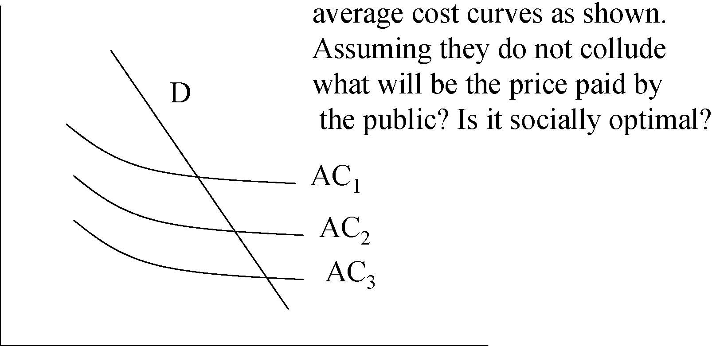

AC1 AC2 AC3 average cost curves as shown. Assuming they do not collude what will be the price paid by the public? Is it socially optimal? D 

0Q 

-  Positives: 

-  Least cost firm wins. 

-  No problem of over-capitalisation. 

-  No informational requirements on regulator. 

-  Franchise owner has incentive to cost efficient. 

-  Negatives: 

-  Price is above least cost, competition is lacking. 

-  As contract is written on price may skimp on quality. 

-  Two-part tariff is more efficient. 

6 

P 

Government knows demand curve,

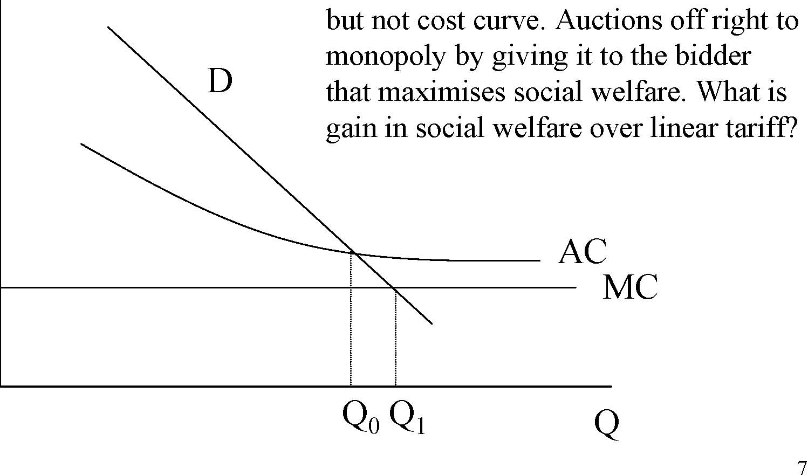

7 MC AC D but not cost curve. Auctions off right to monopoly by giving it to the bidder that maximises social welfare. What is gain in social welfare over linear tariff? 

0 Q0Q1 Q

-  Quality 

-  Not a problem if is this is homogeneous, however it rarely is. 

-  This is a problem if cost and quality are negatively related. 

-  Government will need to specify and enforce quality standards. 

-  Rent seeking behaviour 

-  Multi-dimensional bidding means that it is difficult for auctioneer to work out best bid (e.g. with spectrum actions). 

-  In this case bidders may choose combinations which most interest regulators and do not maximise social welfare -this 

is rent seeking. 

8 

-  Contractual Arrangements (Williamson, 1975, 76): 

- 	What happens when technology or demand changes radically over time? Or costs unexpectedly rise (e.g. due to security costs)?Bounded rationality restricts the ability to write complete contracts. 

- 	Recurrent contracts increasingly give advantage to incumbent who can bid P=AVC to exclude more efficient entrants. This problem can be reduced if capital has to be passed to whoever wins contract but this is difficult to price. Thus there is a hold-up problem where incumbent can over-price assets passed to rival (this represents an entry barrier). 

- 	Incomplete longer contracts (15-20 years) can be used but these are hard to monitor and impose costs of uncertainty on the franchisee. 

- 	Opportunism will always be there as contracting process is costly and embarrasing for government to reopen. 

-  A good example of franchise bidding. 

-  1940s: cable used to boost reception of local broadcast services. 

- 	1950s-1960s: introduction of microwave technology allows cable to expand its services by bringing in services from other areas. It thus competes with local broadcasts. 

-  Cable competes with close substitutes: e.g. satellite dishes, videos etc. 

- 	1934: FCC formed and has jurisdiction over wire and radio (including TV). 

- 	FCC refuses to regulate cable on grounds that it is a complement to local broadcast services (improves reception). 

- 	1950s TV industry wants cable to be regulated like them as they are now a competitor. 

-  1962: Importation of signals on cable from distant markets which were

available on local television banned. 

- 	1966: Full regulation of cable: required to carry all local TV stations but prohibits importation of additional signals in top 100 television markets. 

- 	1972: Importation freeze lifted but rules still make it hard to import signals. 

- 	1975: Cable takes off with introduction of Satcom 1 satellite which provides cheap long distance signals. HBO wins court case in late 1970s allowing cable systems to compete with local broadcast television. FCC loosens restrictions. 

-  Results: 

-  1971: &lt;33% have cable access; 6% of systems have more than 12 channels. 

-  1980: 50% of systems have more than 12 channels. 

-  1992: 96% have cable access; 90% of systems have more than 12 channels. 

-  Required technology: 

-  Headend: antenna which receives signals from microwave relay stations or satellite and processes them. 

-  Distribution plant: uses coaxial cables laid in street to distribute the signals to homes. 

-  Subscriber interface: set top box. 

-  If wires are laid marginal costs of connection are low. 

-  Economies of scale split into econs of density and distance: 

-  Economies of density are significant: penetration increasing from 40% to 80% average cost goes from $14 to $8. 

-  Economies of distance are low: 10% increase the number of homes passed at constant penetration reduces AC by only 0.2%. 12 

- 	Yes, within the local geographic area, not over a wide area. 

- 	Better to have local monopolies with no overlapping service. 

- 	However cost disadvantage of multiple non-overlapping systems not great. 

- 	There may be additional advantages to multiple systems: more potential bidders, more capital market competition and improved monitoring by example (benchmarking). 

# Franchise bidding process

-  Municipality announces it will award franchise. 

-  Proposals submitted. 

-  Municipality may negotiate (and impose significant costs). 

-  Municipality notifies select group to submit bids. 

-  Cable companies submit bids. 

-  Municipality selects company (for c.15 years) / calls for new bids. 

-  Process takes 2-10 years (up to 20 years!). •Issues: 

-  No of channels, prices, type of financing, free links to schools, local studios and government channels. 

-  Competitiveness of bidding. Average bidders 5 but declining. CR5 nationally reached 50% (1990) thus collusion likely. 

-  Franchise agreements often re-negotiated ex post. 14 

-  Very few franchisees loose franchise (7 / 3516): good or bad? 

-  1986 Cable Communication Policy Act. 

-  Regulation of rates prohibited. 

-  Franchising continues, no additional entry allowed and renewal easier. 

-  1986-91 prices rise sharply 

-  However, number of channels goes up 30%. 

-  DOJ estimates quality adjusted price goes up 18-23%. 

-  Is this the right way to do this analysis? 

- 	1992 regulation re-introduced via Cable Television Consumer Protection Act. 

-  FCC requires 10-17% reduction in rates. 

15 

Source:1996 Report on Cable Industry Prices (FCC 96-499) at 16http://www.fcc.gov/mb/csrptpg.html (FCC, 1997)

- 	1996 Telecommunications Act retains regulation of basic cable programming and equipment until cable operators face ‘effective competition’. 

-  Effective competition: 

-  if (1) &lt;30% of households take cable or (2) two cable companies serve 50% or more of households and 15% of those take service from the smaller company or (3) a municipal company offers service to at least 50% of households or (4) a telco offers a video-programming service. 

- 	Basic service regulation based on (Premium channels not regulated): 

-  Inflation, number of channels, programming cost and 17

copyright fees, franchise costs, non-license required upgrades. 

# Competition in Cable

Comparison between Competitive Strata and the Noncompetitive Group 

Wireline DBS Low Non-Date Overbuild Overbuild LEC Penetration Municipal Competitive 

<Table>
<TR>

<TD>Average Monthly Rate </TD>

</TR>
<TR>
<TD>July 1, 2001 </TD>
<TD>$34.03* </TD>
<TD>$37.13 $35.03* $34.30*</TD>
<TD> $24.35* </TD>
<TD>$37.13 </TD>
</TR>
<TR>
<TD>July 1, 2000 </TD>
<TD>$31.45* </TD>
<TD>$34.25 $32.55* $32.57</TD>
<TD> $23.40*</TD>
<TD> $34.54 </TD>
</TR>
<TR>

<TD>Number of Channels </TD>

</TR>
<TR>
<TD>July 1, 2001 </TD>
<TD>56.0 </TD>
<TD>53.3 65.3* 52.9</TD>
<TD> 51.4 </TD>
<TD>59.3 </TD>
</TR>
<TR>
<TD>July 1, 2000 </TD>
<TD>52.7 </TD>
<TD>46.5 62.4* 49.5</TD>
<TD> 50.8 </TD>
<TD>56.2 </TD>
</TR>
</Table>

Average Rate per Channel (Programming Only) July 1, 2001 $0.587 $0.727 $0.489* $0.663 $0.447* $0.603 July 1, 2000 $0.578 $0.761 $0.483* $0.674 $0.437* $0.594 *An asterisk denotes a statistically significant differential when compared with the noncompetitive group. 

Source: http://hraunfoss.fcc.gov/edocs_public/attachmatch/FCC-02-107A1.doc (FCC, 2002) 

6% of cable households in competitive sector.Wireline overbuild = overlapping cable networks.DBS = direct satellite network overlaps with cable network. 18

LEC = Telco competitor.

# Other examples of franchise bidding

- 	TV licensing (ten year regional ITV franchises for terrestrial television licenses in UK). 

-  Railway (inc London Underground?) and Spectrum franchises. 

- 	Private Finance Projects often involving a franchising process to award a contract to supply a good or service which is wholly paid for by the government: 

-  Refuse collection in local government. 

-  IT management of records (NIRS). 

-  Toll roads and bridges. 

-  Hospitals. –Prisons. 

# Case study: UK National Insurance Recording System NIRS-2

-  Largest government IT project in Europe. 

-  Contract replace computerised NI records by 1997. 

-  Contract: 7 year for provision of 15 transactions. 

-  Natural monopoly problem if given to private firm. 

-  Compensation payable for contract loss after 7 years. 

- 	Andersen Consulting win: bid $72m (rival $200m) (Public sector comparator=$526m) 

-  Contract delivered 2 years late 

-  Risk of delay not transferred but very cheap! 

20 

- 	Franchise bidding has been a qualified success in introducing some competition into the provision of monopoly services. 

- 	However difficult to argue that it reduces the regulatory burden. For CATV franchising led to normal rate regulation (with guaranteed renewal) and deregulation. 

- 	Technology (via competing networks) is reducing natural monopoly. 

-  Competition seems effective in keeping prices down. 

-  Dynamic Issues in Natural Monopoly Regulation 

-  Read VVH Chapter Chap 15. 

         Acrobat Distiller 5.0.5 (Windows)

         2003-07-28T02:22:05Z

         2003-08-11T14:33:20+05:30

         2003-08-11T14:33:20+05:30

         PScript5.dll Version 5.2

         xml

               bersara

               Microsoft PowerPoint - 14.23 Class9.ppt

# 14.23 Government Regulation of Industry

Class 9: Dynamic Issues inNatural Monopoly Regulation

## MIT &amp; University of Cambridge

- 	When is a natural monopoly no longer a natural monopoly? 

-  Telecom regulation in the US 

-  Technological change and regulation 

-  The break-up of AT&amp;T 

-  Regulated Competition 

-  The Separations issue 

-  An alternative development path? 

P

P**

D0 D1 AC 

0 QMES 3QMES Q 

4 AC1 C(Q)=FC+VC(Q) AC(Q)=FC/Q + AVC(Q) D 

MC

$

AC0

Q

P 

MC0 AC1 MC1 Delastic Dinelastic Effect depends on elasticity of demand. 

0Q 

AC0

# Policy Responses to effects of time on nature of market

- 	1. Continue with price and entry regulation of all market segments. 

-  2. Fully deregulate all markets. 

- 	3. Partially deregulate some markets restricting the behaviour of incumbent monopolists in competitive market. 

- 	Issue is complicated by vertical relations where part of the service is provided by a monopolist which is needed by firms in the competitive segments e.g. access to local phone network required by long distance providers. 6 

- 	This occurs when regulation treats incumbent and entrants differently in market. 

- 	Incumbent is multi-product firm with a universal service obligation. If you are recovering fixed costs disproportionately from one customer group. It may be possible for entrant to come in and sell more cheaply to this group (even though their costs are higher). For example Postal Service. 

- 	This is wasteful because, cheaper to have one incumbent. Also such cross subsidy is not Ramsey 

pricing. 

- 	3 basic services in the intercity telecommunications market (ITM): 

-  Message Toll Service (MTS) or long-distance phone calls. 

-  Wide-area telephone service (WATs) or interconnection services between networks. 

-  Private line service (PLS) is a circuit that connects two or more points to meet specific user needs. 

-  1876: Alexander Graham Bell patents telephone. 

- 	1894: Patents expire and competitors to American Bell Telephone (RoR=46%) enter. AT&amp;T is successor to this firm which included Bell operating companies, Western Electric (equipment manufacturing company) and Bell Labs (R+D organisation). 

- 	Bell retained dominance after patents due to price competition and purchase of rivals. 

- 	1910: American Bell market share below 50% (RoR= 8%). AT&amp;T embraces regulation and universal service. State control and regulation traded for financial protection. 

- 	Existing market structure stabilised. Price structure unregulated. Complicated to regulate due to related companies. 

- 	1910: Interstate long-distance service placed under jurisdiction of the Interstate Commerce Commission. 

-  1934: FCC takes over this regulation. 

-  No formal restriction on new entry but none occurred. 

- 	A lot of the industry appeared to be a natural monopoly but some parts e.g. equipment manufacturing clearly were not, however this was protected by ownership and contractual limitations. 

# Competition in theEquipment Market

- 	1940s: Hush-a-phone introduced. A device which could be put on phone to protect privacy of conversation. AT&amp;T prohibited attachments to their equipment. FCC supports AT&amp;T. Court of Appeals rules in favor of Hush-a-phone as long as device is not ‘publicly detrimental’ it should be ok. AT&amp;T resist implementation of this ruling. 

- 	1940s: Carterfone connects telephone network and mobile radio telephone. This violates AT&amp;T tariff but not Court ruling. 

- 	1949: DOJ file suit against AT&amp;T on grounds that Western Electric has unregulated prices. 

- 	1956: AT&amp;T agrees to only operate in regulated services. AT&amp;T barred from entering computer industry. 

- 	1947: NY and Boston first microwave relay station, this represents fall in fixed costs. 

- 	Computers and rising income shifts demand outwards for telephone use. 

- 	TV and microwave transmission technology threatened AT&amp;T’s monopoly of long distance. 

- 	Microwave had no patents associated with it because it was developed for national defence. Thus there were few entry barriers due to the new technology. 

- 	1948: FCC rules that permanent frequency assignments should be reserved for common carriers (AT&amp;T). 

- 	1949: FCC AT&amp;T not required to interconnect other common carriers, with permanent access to spectrum. Thus entry barred. 

- 	1956: FCC reviews earlier decision. It opens up spectrum to any private user (ABOVE 890). It allocated frequencies above 890 Mhz for microwave use. 

- 	Strong economies of scale up to 240 circuits, moderate to 1000, insignificant above this. Between NY-Philadelphia the required capacity was 79,000 circuits in late 1960s. 

-  Fixed costs large. 

- 	AT&amp;T offered no volume discounts to large customers. 

-  They had an incentive to enter. 

# AT&amp;T and MCI

- 	1963: Microwave Communications Inc. (MCI) filed for common carrier status to offer service between St Louis and Chicago. This was to be a PLS but wanted common carrier status. 

-  1969: MCI application approved. 

- 	1971: FCC flooded with requests and allows free entry into PLS (specialised common carrier competition). 

- 	1974: MCI sues AT&amp;T. MCI cannot get fair terms for local connection to AT&amp;T. 

-  1983: MCI wins against AT&amp;T. 

- 	1975: Entry extended to business MTS by MCI, FCC does not allow entry into consumer long distance market. 

- 	1978: DC Court of Appeals overrules FCC and MCI allowed in. Free entry throughout ITM. 

- 	From 1969, FCC regulates AT&amp;T long distance and local rates such that long distance subsidises local service. This prevents predatory pricing. 

- 	However this lays it open to cream-skimming. What does theory predict prices should do? 

-  AT&amp;T complains about cream skimming. 

- 	MCI complains about quality of connection and the need for more access numbers. 

-  US vs AT&amp;T: Anti-trust case concludes in 1982. 

- 	22 Telephone operating companies placed into 7 holding companies (Regional Bell operating companies, RBOCs). 

- 	These divided into 161 Local Exchange and Transport Areas (LATAs). 

- 	RBOC not allowed to provide long distance and equipment manufacturing and required to offer access to any long distance or data service. 

-  AT&amp;T keeps labs and manufacturing against 

better judgement of DOJ. 

- 	AT&amp;T still regulated after break-up. Required to serve all customers, file tariffs for new services and limited price discrimination. 

-  MCI, Sprint etc. can serve who they want. 

- 	AT&amp;T market share of long distance less than 40%. Prices have fallen. 

- 	Prices of local calls have increased over 1998-2001 (but quality may be rising?). 

- 	By late 1970s: AT&amp;T in local, long distance and manufacturing and faces different types of regulation in each (regulated monopoly, regulation competition and unregulated.) 

-  Should a regulated company be restricted in competitive segments? 

-  Benefits of separation: 

-  Prevents price discrimination to win market share. 

-  Prevents vertical foreclosure or quality degradation. 

-  Costs of separation: 

-  Reduces economies of scope if these exist. 

-  Eliminates a potential competitor from the competitive segment. 

# Prices of Telephone Services in the US

Source: Trends in Telephone Service, www.fcc.gov/wcb/stats, FCC (2002) 

-  Finland has among the cheapest fixed line calls in EU. 

- 	Finland has a population of 5m and 46 local telephone companies (1960=201 companies). 

- 	A national telephone company, providing long distance, existed along side regional companies. 

- 	Finland has long had a competitive equipment market. Finland is home to the world’s largest mobile phone company (Nokia) who entered the market as a supplier of network equipment. 

- 	Productivity improved rapidly state carrier responded to competitive threat of ROCs and mobiles in the run up to de-regulation. 

-  Competition is desirable where it is possible. 

-  Regulation does tend to limit competition. 

- 	AT&amp;T was obviously too large from the beginning: 

-  No national natural monopoly in local telecoms 

-  No natural monopoly in equipment manufacture. 

- 	Regulation extremely slow to adapt to change in technology and demand once put in place. 

-  Spectrum Auctions and Competition in Telecom 

-  Read: 

Council of Economic Advisors (2000), The economic impact ofthird-generation wireless technology. Appendix 2: ‘Case study ofFinnish wireless cluster’ http://www.wireless.co.il/whitePapers/3geconomic.pdf 

Klemperer, P. (2002), How (not) to run auctions: The European 3G telecom auctions, European Economic Review, Vol.46, No.4-5, pp.829-845. 

         Acrobat Distiller 5.0.5 (Windows)

         2003-07-28T02:13:22Z

         2003-08-20T15:58:36-03:00

         2003-08-20T15:58:36-03:00

         PScript5.dll Version 5.2

         xml

               bersara

               Microsoft PowerPoint - 14.23 Class10.ppt

# 14.23 Government Regulation of Industry

Class 10: Dynamic Issues inNatural Monopoly Regulation 2

MIT &amp; University of Cambridge

Outline

- 	Differences between US and European mobile phone markets. 

- 	The importance of standards in competitive markets. 

-  Spectrum Allocation and Auctions Theory. 

-  UK, Dutch, Swiss, Danish and Turkish auctions. 

-  Lessons on good auction design. 

History of Mobile Phones in US

- 	Cellular radio replaces wires with radio signals and has a series of radio relay stations (cell sites). Stations are linked via microwave transmission. Increasing capacity involves shrinking size of cells as same frequency can be used within a cell (theoretical idea in 1947). 

- 	1970s -Development of transmitters and receivers for co-ordination of cells and the development of switching equipment. 

- 	1981 -FCC allocation of 20MHz to LECs and 20MHz to McCaw Cellular (now AT&amp;T Wireless). 

- 	1994-95 FCC auctioned 120MHz of personal communications services (PCS) wideband spectrum raising $20bn or so. 

- 	Initially FCC prohibited one company from owning more than 45Mhz, of PCS, cellular radio and specialised radio spectrum. 

3 

-  Currently we are using 2G technology, 3G coming soon. 

Developments in Mobile Telephone Markets

Europe 

- 	In 1969 the Nordic telecommunications conference established the Nordic Mobile Group. 

- 	In 1975, the Nordic telecommunications conference recommended the NMT 450 MHz network to be built. 

- 	In 1981, the first analogue - NMT 450 system -commercial cellular services started in Sweden and Finland. 

- 	In the late 1980s, a common European digital standard – GSM (Global System for Mobile Communications) was approved. 

- 	In 1992 the first digital cellular Commercial services in the world Started in Finland. 

USA 

- 	In the 1960s, cellular technology was invented at Bell Labs. 

- 	In the early 1970s analogue cellular technology became available, developed by AT&amp;T and Motorola. 

- 	In 1968-1983 there were regulatory hurdles by FCC in making the decision regarding wireless licensees. 

-  In 1983, cellular services started. 

- 	Free competition of technologies based on different standards 

4 Source: Funk, J.L. (1998), ‘Competition between regional standards and the success and failure of firms in the world-wide mobile communication market.’, Telecommunications Policy, Vol.22 (4/5), pp.419-441. 

Problems with the US Mobile Telephone Market

-  1985 Nordic Cellular Market same size as that of US. 

- 	1968-83 FCC decides who to give licenses to and how many. 

-  Regulated free local calls in US slows entry of mobiles. 

-  Competition with older pager technology. 

- 	Price regulation and receiver pays system allowed higher prices. 

-  One digital standard in the 1990s (GSM) helped in EU. 

Multiple standards operate in US. 

6 

<Table>
<TR>

<TD></TD>
<TD></TD>
<TD></TD>
<TD></TD>
</TR>
<TR>
<TD></TD>
<TD></TD>
<TD></TD>
<TD></TD>
<TD></TD>
<TD></TD>
</TR>
<TR>

<TD></TD>
<TD></TD>

</TR>
<TR>

<TD></TD>
<TD></TD>

</TR>
</Table>

<Table>
<TR>
<TD></TD>
<TD></TD>
<TD></TD>
<TD></TD>
</TR>
<TR>
<TD></TD>
<TD></TD>
<TD></TD>
<TD></TD>
</TR>
<TR>
<TD></TD>
<TD></TD>
<TD></TD>
<TD></TD>
</TR>
<TR>
<TD></TD>
<TD></TD>
<TD></TD>
<TD></TD>
</TR>
<TR>
<TD></TD>
<TD></TD>
<TD></TD>
<TD></TD>
</TR>
<TR>
<TD></TD>
<TD></TD>
<TD></TD>
<TD></TD>
</TR>
<TR>
<TD></TD>
<TD></TD>
<TD></TD>
<TD></TD>
</TR>
<TR>
<TD></TD>
<TD></TD>
<TD></TD>
<TD></TD>
</TR>
<TR>
<TD></TD>
<TD></TD>
<TD></TD>
<TD></TD>
</TR>
<TR>
<TD></TD>
<TD></TD>
<TD></TD>
<TD></TD>
</TR>
</Table>

Source: CTIA’s Semi-Annual Wireless Industry Survey, 2001; 2002. 

Telecommunication indicators in the Eurostat area, 2000, ITU; Cellular subscribers ITU, 2002. Telecommunications Statististics 2000, Ministry of Transport and Communications in Finland, Edita, Helsinki 2000. 

Source: Funk, J.L. (1998), ‘Competition between regional standards and the success and failure of firms 8in the world-wide mobile communication market.’, Telecommunications Policy, Vol.22 (4/5), pp.419-441. 

Source: http://hraunfoss.fcc.gov/edocs_public/attachmatch/FCC-02-179A2.pdf, FCC (2002). 9

Source: http://hraunfoss.fcc.gov/edocs_public/attachmatch/FCC-02-179A2.pdf, FCC (2002). 10 

Market Shares in the UK mobile phone market

Source: http://www.oftel.gov.uk/publications/market_info/2003/mobile/q2mobile0203.pdf 

Source: Council of Economic Advisors (2000). 

Spectrum Auctions

- 	The radio spectrum is a scarce natural resource which is extremely valuable. It belongs to national governments within their geographic areas who have a right to allocate it commercially. 

- 	Owners of particular frequency ranges have a government granted natural monopoly over the portion of spectrum they own. 

- 	However owners of particular portions may offer compete with one another in offering identical services (e.g.wireless phone). 

- 	A franchise auction would seem to be a good way to allocate spectrum to the most efficient firms. 

- 	Although the spectrum is fixed in bandwidth, the government can choose to auction smaller packets in order to have more firms. 

-  Why do auctions lead to most desirable firms operating spectrum? 

-  What determines how close prices are to marginal cost? 

13 

14 Source: http://www.ntia.doc.gov/osmhome/allochrt.pdf 

Auction Theory

-  Auctioning of radiospectrum advocated by Coase (1959). 

- 	Auctions can be compared to ‘beauty contests’ (where bureaucrats decide between business plans). 

- 	Auctions force companies to put money where mouth is. It is difficult to specify and evaluate criteria for beauty contests. Auctions can raise large sums of money (UK=2.5% of GDP). 

- 	Two main types: ascending (English Auction); sealed bid (First price or Dutch Auction). 

- 	English Auction can encourage collusion because early bids can be used to signal to other players and can encourage weak bidders to drop out early (because of bid transaction costs and low probability of winning). 

- 	Dutch Auction does not allow strong bidders to know what weaker bidders valuation is. However if weaker bidders win then the outcome is not efficient. 

-  A good auction in either case encourages entry and discourages collusion. 

Objections to Auctions

-  Risks involved too great. 

-  Bid costs are passed on to consumers. 

-  Investment reduced if bid price goes up. 

-  Questions: 

-  Is an auction fee different from a development cost? 

-  If auction fee goes up how does this effect competition in the market for the service? 

-  How is speed of roll-out of service (and its associated investment) likely to be effected by increase in auction fee? 

Issues in Auction Design

- 	Stimulating new entrants in the light of the fact that 2G incumbents had advantage in 3G market. 

-  Royalties or Lump-sum payments? 

-  Why are lump sum payments more efficient? 

-  How many licences to issue? 

-  If we let the market decide what will happen? 

-  Appropriate legal framework 

-  Minimum reserve price, no allocation in the absence of bidders and make sure procedures in line with legislation. 

Revenues from European 3G mobile phone auctions

Date of Auction Euros per Capita 

<Table>
<TR>
<TD>UK </TD>
<TD>March-April 2000 </TD>
<TD>650 </TD>
</TR>
<TR>
<TD>Netherlands </TD>
<TD>July 2000 </TD>
<TD>170 </TD>
</TR>
<TR>
<TD>Italy </TD>
<TD>October 2000 </TD>
<TD>240 </TD>
</TR>
<TR>
<TD>Switzerland </TD>
<TD>November-December 2000 </TD>
<TD>20 </TD>
</TR>
<TR>
<TD>Germany </TD>
<TD>July-August 2000 </TD>
<TD>615 </TD>
</TR>
<TR>
<TD>Austria </TD>
<TD>November 2000 </TD>
<TD>100 </TD>
</TR>
<TR>
<TD>Belgium </TD>
<TD>March 2001 </TD>
<TD>45 </TD>
</TR>
<TR>
<TD>Greece </TD>
<TD>July 2001 </TD>
<TD>45 </TD>
</TR>
<TR>
<TD>Denmark </TD>
<TD>September 2001 </TD>
<TD>95 </TD>
</TR>
</Table>

Source: Klemperer (2002) Q: Why did revenues vary so much between auctions? 

UK Mobile Phone Auction 

- 	The first 3G license auction. 5 licenses auctioned of which 1 reserved for a new entrant. This encouraged new entrants to bid. License to last from 2021 and obligation to make network available to 80% of population by 2007. 

- 	Bidders had to be active and current top bidders could not bid in the next round of the multiple round ascending price auction. 

-  There were minimum bid increments. 

- 	Competition was assured for the reserved licence and this spilt over into the non-reserved licences. In the event 9 new entrants bid strongly and revenues were £22.4774bn. 

-  The auction concluded when only 5 bidders remained. 19 

Dutch and Swiss Auctions

- 	Netherlands followed British design but they had 5 licenses and 5 incumbents. Result strongest new entrants partnered incumbents and only one weak new entrant bid. Result auction revenue of E3bn rather than predicted E10bn. 

- 	Switzerland followed British design in auction of four licenses but allowed joint bidding agreements so the number of bidders dropped from 9 to four a week before the auction. The government postponed the auction but were legally challenged and had to sell at the reserve price. A sealed bid auction may have been better. 

Danish and Turkish Auctions

- 	Denmark had 4 incumbents and 4 licenses. They had however realised that in this position a sealed bid auction is better. The result (after the collapse of telecoms shares) was revenues twice that predicted beforehand. 

- 	Turkey auctioned 2 licenses sequentially in 2000 but set the reserve price of the second at the price of the first. What do you think happened? 

How did sequencing matter in European mobile phone auctions?

- 	Learning to play the game. The only successful auctions were the first of their type. 

- 	Learning opponents valuations. This influenced corporate strategy and decision to bid in future or seek alliances. 

- 	Market complementarities meant later market auctions were more valuable to previous winners. 

- 	Budget constraints did seem to arise for some firms as the high initial cost of licenses boosted debt levels. 

-  How can these problems be avoided for 4G? 

22 

Conclusions 

-  Standards important in stimulating innovation and competition. 

-  Number of firms crucial determinant of price. 

-  Spectrum is scarce and needs to allocated efficiently. 

- 	Designing effective auctions which facilitate entry and reduce collusion is difficult. 

-  Need to test rules for obvious problems. 

-  Need to set market structure in advance not in auction. 

-  Need to apply normal anti-trust standards to bidding. 

-  One design not appropriate for all markets. 

Next 

-  Deregulation of Surface Transportand Airlines 

-  Read: VVH Chaps 16 and 17

         Acrobat Distiller 5.0.5 (Windows)

         2003-07-28T02:13:48Z

         2003-08-18T12:00:28+05:30

         2003-08-18T12:00:28+05:30

         PScript5.dll Version 5.2

         xml

               bersara

               Microsoft PowerPoint - 14.23 Class11.ppt

# 14.23 Government Regulation of Industry

Class 11: Deregulation of Surface Freight and Airlines

MIT &amp; University of Cambridge

- 	The theory of why price and entry regulation are inefficient for naturally competitive industries. 

- 	Rail, trucking and airlines were all heavily regulated until the 1970s. 

- 	They have since between substantially de-regulated. 

- 	We examine each in turn and ask the question: how was regulation effecting them? 

2 

# Price and Entry Regulation

-  The heart of regulation is the control of entry and price. 

-  Price regulation can be above or below cost. 

-  Entry and exit regulation have similar effects. 

- 	Entry/Exit regulation and price regulation are necessary complements. What happens: 

- 	(1) when price regulation is above cost and there is no entry regulation? 

- 	(2) when price regulation is below cost and there is no entry regulation? 

-  (3) when there is limitation on entry and no price 

regulation? 

Competitive market can support 20 

firms. However if regulated price and

D AC(Q) Q1/20 Q1Q2 entry, price rises and demand falls so costs rise. However if prices are regulated free entry would make situation worse. What are welfare losses? 

$

PR

P*

Q

Q2/21Q2/20 

- 	Given regulation of first market is regulation of a second related market a bad thing? 

- 	Imagine you have one regulated firm supplying market 1 and a second firm could supply the market but at higher cost but slightly lower quality. 

- 	If you regulate the PR&gt;MC2&gt;MC1. Firm 2 will enter but this is not in society’s interests. 

- 	The answer is to force both firms to charge a price no lower than PR. 

- 	This is beneficial if the benefits of lower costs exceed the consumer surplus losses. 

- 	What would happen in a competitive market? 

$ 

PR MC2 

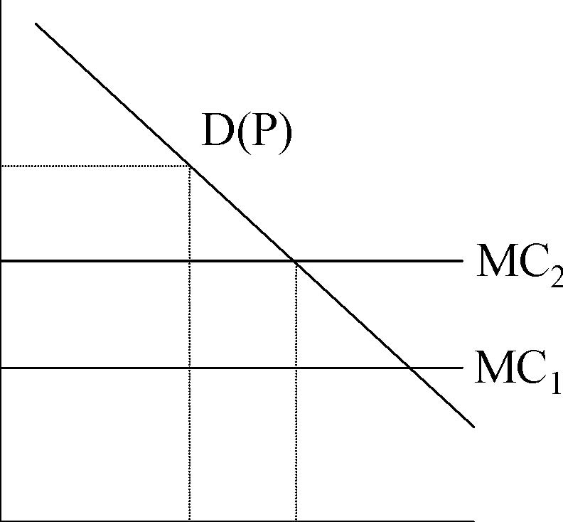

D(P) MC1 

0 Q0Qf Q 

- 	In the presence of substantial fixed costs and significant MES relative to market size it is not clear that entry increases social welfare. 

- 	This is because entry occurs up to the point where it is just unprofitable for the entering firm but this is not the same as the point where social welfare is maximised. 

- 	Society incurs the fixed cost of entry for sure while the entering firm benefits from shifting profits from the other firms to itself. 

- 	This phenomenon can lead to excessive competition in a simple Cournot model (relative to the social optimum). 

-  However the social costs of this can be low relative to a ban

6 

on entry (see book example).

- 	Excessive non-price competition (e.g. airlines: food, safety, legroom) 

- 	Production inefficiencies: high wages, leading to K/L ratio changes, inefficient firms continue to operate. 

- 	Cross-subsidisation: where enforced prevents exit and is welfare reducing. 

-  May also lead to reduced investment, productivity and quality may fall. 

- 	May be more investment under regulation but less incentive to innovate. There does seem to be a slowdown in productivity into 70s in regulated industries. 

7 

# Approaches to measuring effects of regulation

- 	1. Inter-temporal approach. Look at given industry over time with and without regulation and observe differences. 

- 	2. Inter-market comparison. Where 1. is not available can compare regulated and unregulated markets for similar products or different jurisdictions. 

- 	3. Counter-factual approach. Try to use as a benchmark what market would have looked like in 

the absence of regulation. 

- 	Rail and trucking looked at together because they are close substitutes for freight. 

-  1870s: Railroads seek regulation to protect them from price wars. 

- 	1887: ICC established to regulate railroads, rates to be ‘just and reasonable’ and non-discriminatory. 

-  1906: Maximum rates imposed. 

-  1920: Minimum rates and control of entry and exit imposed. 

-  1920-Truck competition begins to undermine profitability of rail. 

- 	1935: Motor Carrier Act: brings trucks under ICC control (prices and entry and exit). 

-  1940s: Railroads want less regulation now trucks are regulated. 

-  1950s: Interstate highways with unregulated/own trucking hit rail. 

-  1958: Some lower rail rates and some passenger exit allowed. 

- 	1976: Railroad Revitalization and Regulatory Reform Act (4R Act) allows zone of reasonable rates and freedom to exit unprofitable routes. 

- 	1980: Staggers Rail Act. Considerable rate setting freedom and freedom of entry and exit. 

-  1980: Motor Carrier Act. Deregulates ICC further. 

-  1980s mostly deregulated. 

-  1995: ICC finally wound up. 

- 	Price instability with railroads: destructive competition, and difficult to enforce collusion. 

- 	Financial markets thought regulation good for profitability (Prager finds stock price rises with passage of ICC -why is this a good measure?). 

-  No natural monopoly in trucking. 

- 	Rationale for regulation simply its complementarity with rail. 

-  In practice the regulation of the two was different. 

-  ICC set minimum and maximum rates. 

- 	Rates based on value of service and equalizing discrimination. 

- 	‘Value of service’ pricing meant higher prices for goods of higher value (not necessarily any more costly to transport). 

- 	‘Equalizing discrimination’ prevented discrimination between different shippers and different sizes of shipments even when the costs were different. This implies cross subsidy. 

-  ICC allowed industry ‘bureaus’ to set prices. 

- 	Rates could not vary across routes of similar distance (even where densities varied). 

- 	Rates could vary by shipping size/characteristics of shipper. 

- 	Thus trucking companies got prices they wanted whereas rail industry did not. 

-  In rail regulation prevented exiting of unprofitable routes. 

-  However in trucking entry restriction kept prices up. 

13 

- 	The inter-temporal approach focuses on the effect on prices before and after regulation. 

- 	Difficult to analyse given changing input costs and nature of traffic. 

- 	However it appears that rail rates fell on most routes after deregulation, though on some they rose. 

-  For trucking there was a fall in prices in 

general after deregulation. 

14 

- 	Railroads faced exit restrictions. After the Staggers Act railroads abandoned unprofitable markets. Conrail abandoned 2600 miles (15% of total track and only 1% of revenue). 

- 	Trucks faced entry restrictions. Number of certified motor carriers doubled between 1978 and 1985. Bankruptcies rose. 

- 	Unit costs have fallen and are more highly concentrated at the low end of costs. 

- 	Union premium over non-union wages fell from 50% to 27% (below the national average). 

-  Investment in track went up as profits improved. 

-  Regulated industry productivity was low compared to 

elsewhere but does appear to have accelerated. 

- 	Deregulation sharply increased profitability of rail. Rate of return doubled in four years. 

-  Why? 

-  Freedom to exit. 

-  Rate flexibility allowed better demand management. 

-  Lower labour costs. 

-  Increased investment leading to increased efficiency and lower costs. 

-  Long term contracting with shippers leading to optimal investment planning. 

16 

- 	1920s: competitive bidding for US mail looking like destructive competition. 

- 	Airlines realised that although contracts were allocated on a least cost basis, after award there was no regulation of price, hence the competition effect. 

- 	1938: Civil Aeronautics Act falls under Federal regulation of Civil Aeronautics Board (CAB). 

- 	1958: Federal Aviation Administration (FAA) takes over regulation of safety from CAB. 

-  CAB regulates max and min rates and number of competitors. 

-  Number of airlines fixed at 1938 level and falls with mergers.

17 

-  1975: Head of CAB eases entry restrictions. 

- 	By 1977: Further entry restriction reductions and control of fares relaxed. 

-  1978: Airline Deregulation Act. 

-  By 1979 free entry was allowed. 

-  By 1980 unlimited downward price flexibility. 

-  By 1983 all controls ended. 

- 	Initially a lot of entry, now consolidation around hub and spoke system. 

18 

-  Prices: 

-  These fall especially on long distance as cross subsidies unwind. 

-  Quality: 

-  Regulation led to high quality-high price product. Deregulation has led to? 

-  Hub and Spoke System: 

-  Unexpected innovation. Saves money for airline by increasing utilisation on flights. Why? However also increases value to passengers due to more frequent departures. 19 

## America West Airlines Routes 2003

# Consumer Welfare Effects of Deregulation of Airlines

Category Annual Gain $bn (1993) Fares 12.4 Travel Restrictions -1.1 Frequency 10.3 Load Factor -0.6 Number of Connections -0.7 Mix of Connections 0.9 Travel Time Total -2.8 18.4 

Source: Morrison and Winston (1995).

- 	Regulation of potentially competitive industries usually leads to higher prices and costs. 

-  Regulation tends to spread to related sectors. 

- 	Deregulation of rail and trucking shows how previous regulation was increasing costs and distorting prices. 

- 	Deregulation of airlines shows a substantial benefit from unanticipated innovations under competition. 

-  Revision for Midterm 

-  Look at Problem Sets and Handouts. 

-  Look at Mock Exam (to be posted). 

-  E-mail me your questions. 

-  Reminder ONLY simple calculatorwill be allowed in Midterm. 

         Acrobat Distiller 5.0.5 (Windows)

         2003-07-28T02:14:19Z

         2003-08-13T14:27:08+05:30

         2003-08-13T14:27:08+05:30

         PScript5.dll Version 5.2

         xml

               bersara

               Microsoft PowerPoint - 14.23 Class12.ppt

# 14.23 Government Regulation of Industry

Class 12: Preparation for Midterm Exam

MIT &amp; University of Cambridge

# How to study for Midterm Exam

- 	Go through all numeric problems that were covered in classes and the problem sets and be sure that you are comfortable with how to solve those models. 

- 	For each of the industries that we have covered ensure that you know: 

-  The basic outline of the industry 

-  Why it was regulated 

-  Why it was deregulated (if that happened to be the case) 

-  How it was regulated (e.g. price controls, entry controls) 

- 	The economic consequences of the regulation (in terms of efficiency, ability to do what it was supposed to do, profits, etc.). 

-  The level of detail required is that discussed in class. 

# How to study for Midterm Exam

- 	You do NOT need to remember all the acronyms for the various government agencies, the names of regulations, the dates of regulation (or similar). 

-  There are 3 sections to the exam: 

-  Part I consists of short questions/answers (3 worth 5 points, each). Each should invite 3 -4 sentence accurate but brief responses. Numeric calculations are short with a few sentences for explanation. 

-  Part II consists of one numeric problem (worth 25 points). This will take the same format as one of the problem set questions. 

-  Part III is an essay question (worth 20 points). 

# Industries Covered 

-  Electricity •Cable 

-  Telephone: Fixed Line 

-  Telephone: Mobile 

- 	Potentially competitive markets: railroads, trucking and airlines 

# Outline of Topics

•1. Review of theory of the firm: monopoly, oligopoly, surplus, government intervention, deadweight loss, strategic competition: limit pricing, dynamic entry deterrence. You should be familiar with these models and be able to solve a simple numeric problem using them. 

•2. Motivations for regulation: economic, public interest, capture theory. You should know what they are and how they differ from one another. The costs and benefits of regulation. 

# Outline of Topics

•3. Public ownership: historical roots of public ownership, theory of when public ownership is a good idea (e.g. situations of uncontractable quality, corruption of local government worries), advantages of private ownership; privatization: its objectives and effects. 

•4. Natural monopoly Regulation: pricing strategies (average cost, marginal cost, fully distributed costs, Ramsey pricing, peak load pricing); consequences of pricing strategy (cross-subsidization – stand alone and incremental cost tests; cream skimming; inefficiencies); rate of return regulation (how does it work; consequences such as Averch-Johnson effect, inefficiencies). 

ELECTRIC POWER EXAMPLE. 

# Outline of Topics

•5. Do we need regulation at all? Example of cable and franchise bidding. What are the consequences of franchise bidding? Do we get marginal cost pricing? Do we need to worry about quality? CABLE TV EXAMPLE. 

•6. Changing markets 1: role of technology and how it can affect the regulation of a natural monopoly (changes in demand, changes in costs – fixed and variable: are you more or less likely to remain a natural monopoly with these changes?). WIRELINE TELECOMMUNICATIONS EXAMPLE. 

# Outline of Topics

•7. Changing markets 2: importance of common standards and economic success, spectrum allocation, auction theory, the determination of prices by the number of companies and the independence of pricing from auction fee, English and Dutch Auctions. EUROPEAN 3G MOBILE PHONE AUCTION EXAMPLES. 

•8. Regulation of potentially competitive markets: price and entry controls and the economic effects of regulation on the market and on the incumbents and potential entrants. SURFACE FREIGHT AND AIRLINES EXAMPLES. 

# Mock Exam 

-  Model Answers to Questions 1-3. 

-  Model Answer to Question 4. 

-  Discussion of answer to Question 5. 

# Mock Exam

- 	Question 1: The development of microwave transmission technology in the 1950s is often given as a reason why the long distance telephone market stopped being a natural monopoly as sending long distance telephone signals over microwave transmission stations require a much lower fixed cost than doing so over wires. Microwave transmission stations, however, have been largely replaced by fiber optic wire in the 1990s, which has meant a return to stringing wires between locations. Why might long distance telephone not be a natural monopoly industry, 

even with this technological change? 

# Mock Exam

- 	Question 2: Demsetz has suggested that one way to avoid natural monopoly regulation is by auctioning off the right to be a monopolist in a particular market through a franchise license. Does franchise bidding necessarily lead to an efficient outcome? Why or why not? 

- 	Question 3: During regulation, airline prices were fixed above cost and airlines could not compete in price. What was the result of this regulatory practice with respect to food quality and safety, and can you justify the airlines’ response in these two areas? 

# Mock Exam

- 	Question 4: The peak and off-peak periods of electricity demand are of equal length. Demand in the peak period is PP=100-QP and in the off-peak period P0=A-Q0. Production is fixed proportions with variable costs of $2 per unit and capital costs per period of β. Capacity costs are sunk and capacity cannot be adjusted between periods. 

(a)Suppose that A=50 and β=4. Find the optimal capacity, peak price, and off-peak price. 

(b)Suppose that A=90 and β=8. Find the optimal capacity, peak price, and off-peak price. 

# Mock Exam

- 	Question 5: In 2000 and 2001 a major round of auctions for licenses to operate third generation (3G) mobile phone networks took place in Europe. The licenses gave the holders the right and responsibility to invest in 3G infrastructure and exclusive use of the auctioned spectrum for a fixed number of years. 

Discuss these auctions in terms of (1) the motivations for allocating radio spectrum via auctions (2) how they were supposed to work (3) the theoretical and practical problems that may arise. Try to use specific examples and evidence from class to support your views. 13 

# Final Reminders 

- 	The exam is closed book -no books or notes -in class. 

-  We will start at 9am sharp. 

-  If you are late you lose out. 

-  I will call time at 10.25am. 

- 	Bring pens and a cheap (non-scientific) calculator. 

# Next 

-  Midterm Exam 9am SHARP Class #13. 

         Acrobat Distiller 5.0.5 (Windows)

         2003-07-28T02:14:37Z

         2003-08-18T12:00:49+05:30

         2003-08-18T12:00:49+05:30

         PScript5.dll Version 5.2

         xml

               bersara

               Microsoft PowerPoint - 14.23 Class15.ppt

# 14.23 Government Regulation of Industry

Class 15: Problems of De-regulation –The Case of UK Railways

## MIT &amp; University of Cambridge

-  History of UK Railways 

-  Privatisation and Restructuring 

-  Regulation 

-  Performance since Privatisation 

-  Recent Failures 

-  Lessons 

-  1820s onwards railway network privately financed. 

- 	1948 industry nationalised then privatised between 1995 and 1997. 

- 	1948-95 secular decline in rail (passenger and freight) due to road competition. 

-  1960s mileage reduced by a third (Beeching cull). 

- 	1968-1985 rising subsidies £1.6bn in 1985/86, up from £600m (in constant prices) in 1968 

-  Low productivity growth and sharp wage increases in 1970s. 

-  Government keen to avoid further line closures. 

- 	1980s significant privatisation of non-core businesses e.g.hotels, sea transport. 

-  1994-97 privatisation of all of industry. 

-  1995-trend decline reversed since privatisation. 

- 	1979-97 Conservative policy: easy privatisations first, then more difficult. 

- 	1992 White Paper and Conservative aim to make rail privatisation irreversible. 

- 	Structure adopted chosen to maximise competition (electricity model). 

-  Main change was separation of track ownership from train operation. 

-  Two regulatory bodies created (OPRAF (now SRA) and ORR). 

-  In all 100 companies created out of BR. 

# Financing and Regulation of Industry

-  Regulation: OPRAF and ORR (Office of the Rail Regulator). 

- 	OPRAF administers subsidies to Train Operating Companies (TOCs). 

- 	TOCs purchase track and station access from Railtrack (the monopoly track infrastructure provider) at regulated tariffs. 

-  Rolling stock leasing companies (ROSCOs) lease trains to TOCs 

-  Passenger Fares regulated 

-  Competition envisaged on existing routes. 

- 	SRA (Strategic Rail Authority) has since taken over role of OPRAF. 

-  Some direct grant to Railtrack now being given 

Britain’s Railways: Sources and Uses of Funds (1997/98) 

Passenger fare revenue Freight user Revenue Other income** Government Subsidy £3,100m £600m £100m £2,400m Sources: £6,200m* Rolling stock lease payments (ROSCOs) Train operating costs (TOCs and freight operators) £2,400m £600m £2,600m Uses: £6,200m* Infrastructure costs (Railtrack) Industry profit £600m * 01 prices ** Railtrack property income 20

Source: Smith (2003) 

-  TOCs have licences and a stream of subsidies and price controls. 

-  TOCs are under threat of franchise loss (e.g.Connex South Central). 

-  The initial price control period ran to 2003 (end of franchises). 

- 	Regulation of many fares plus quality of service through performance penalties. 

- 	RPI-X Regulated fares: saver, weekly season and most commuter fares (40% of revenue). 

-  X=0, 1996-98; X=1 (98-03), in commuter markets -2 to +2 for quality. 

- 	Punctuality incentive scheme, short formations incentive payment, timetable change incentive payment. 

- 	Many TOCs have struggled to break even and there has been a lot of consolodation. 

- 	Between 1995-00 fares rose by 0% while 1990-05 rose by 12% on average (in real terms). 

-  CP1 (control period) track access charges fixed to 2000-01. 

-  CP2 track access charges 2001-06. 

-  Under CP1 Railtrack: RPI-8 in 1995-96, then RPI-2. 

- 	Under CP2 Railtrack: RPI-11.2 in 2001-02, then c. RPI+4.5 on charges, plus direct grant (of £800m p.a.) implies RPI+34.5 in 2001-02, then c.RPI+4.5. 

- 	Track access charges consist of a fixed and a variable element for each TOC (usage charge+traction charge). 

-  Under CP1 the variable element was around 9%. 

-  Under CP2 variable=20% of the amount paid by the TOCs. 

-  Freight only paid for its own specific costs. 

Passenger km (bn) 

Passenger Rail Travel 

45.0 

40.0 

35.0 

30.0 

25.0 

20.0 

15.0 

10.0 

5.0 

0.0 1952 1959 1966 1973 1980 1987 1994 2001 

-  23% growth in passenger miles since privatisation (1993 to 2001). 

9 

## Key Trends (2) -Costs

Sources: BR Annual Reports; Annual Reports for individual companies (post privatisation). Transport Trends, 2001 Edition (DTLR). 

-  Costs are operating costs (excluding depreciation). 

-  Excludes minor freight operators 

-  But also excludes profits of supplier companies 

-  ORR costs charged out to industry; SRA costs included. Dept of Transport costs not included 10 

## Key Trends (3)

Service QualityPercentage of trains arriving on time 

(All operators) 

Pre-privatisation 

Post-privatisation 

Post-Hatfield 95% 

90% 

85% 

80% 

75% 

Charter punctuality measure New public performance measure (PPM) 

70%

Source: Railway Safety (2002), 12 http://www.railwaysafety.org.uk/pdf/railrepo0102/aspr%20200102%20full%20report.pdf 

Methodology 

Calculation 

- 	Social cost-benefit analysis. • Compute difference between costs under public and private ownership. 

- 	Outlined by Jones, Tandon and Vogelsang (1990). ∆W = Cg -Cp -R&amp;P 

- 	Adopted for many other privatised • Main difficulty lies in estimating theindustries in UK and overseas. counterfactual cost profile. 

- 	Assesses total welfare change • Total welfare change then allocateddistribution. between different groups. 

∆W = Vsp -Vsg + (λg -lp) * Z ∆W = ∆Cust + ∆Prod + ∆Gov 

-  Privatisation socially worthwhile if 

∆W&gt;0. 13 

FIGURE 4 

Actual and Counterfactual Total Costs 

5000 

4500 

4000 

3500 

3000 88/89 89/90 90/91 91/92 92/93 93/94 96/97 97/98 98/99 99/00 

Pro-public (2% gain) Pro-priv atis ation (0% gain) Central (1% gain) A c tual c os ts 

£m (1999/00 prices) 

Discount rate 6% 10% To date Fut. To date Fut. Total Pro-privatisation scenario Efficiency gains 1,900 3,300 5,200 2,000 2,800 4,800 Restructuring costs (1,400) -(1,400) (1,700) -(1,700) Net efficiency gain/(loss) 500 -3,800 300 -3,100 Central scenario Efficiency gains 800 1,700 2,500 800 1,400 2,200 Restructuring costs (1,400) -(1,400) (1700) -(1700) Net efficiency gain/(loss) (600) -1,100 (900) -500 Pro-public scenario Efficiency gains (200) 100 (100) (200) 0 (200) Restructuring costs (1,400) -(1,400) (1,700) -(1,700) Net efficiency gain/(loss) (1,600) -(1,900) -(1,900) Total (1,500) 

-  Government receives/producers pay sales proceeds (£7bn). 

-  Government receives taxes on future profits (small effect). 

-  And pays subsidies 

-  Counterfactual: government pays subsidies to cover losses. 

-  Overall, government’s position broadly neutral. 

Rail Privatisation proceeds £bn (current prices) £bn (present value) Railtrack * ROSCOs Freight Infrastructure &amp; Maintenance cos. BR Central Services Total 2.5 1.7 0.3 0.3 0.2 5.0 3.5 2.4 0.4 0.4 0.3 7.0 

- * Includes £596m of debt. 

-  October 1999 Ladbroke Grove (near Paddington) Crash. 

- 	July 2000 Government 10 year transport plan indicates further growth in rail network usage to 2010 of 50%. 

-  October 2000 Hatfield (north of London) Crash. 

-  Hatfield causes severe disruption of network. 

-  April 2001 Regulator agrees that Railtrack may bring forward revenue from future. 

- 	April-May 2001 Railtrack privately seeks more government money to finance operations. 

-  October 2001 Secretary of Transport places Railtrack in special administration 

- 	October 2002 Network Rail, a not for profit company limited by guarantee, takes over network assets. 

- 	Late 2002-03 indications from SRA that future investment plans will have to be cut and government targets for increased rail use will not be met. 

- 	Following Hatfield Crash it became clear that Railtrack needed more finance and that CP2 was too harsh. Hatfield cost £500m of repairs and £500m of TOC compensation. 

- 	In April 2001 government agreed with Railtrack to bring forward £1.5bn from CP3 (beyond 2006-7). 

- 	This money was not forthcoming as the government could not find a way of transferring it without it ending up on the PSBR. 

- 	This contributed to the funding shortfall which led to being brought into administration. 

-  ROSCOs did not invest in new rolling stock as expected. 

- 	TOCs needed extension of franchises in order to get incentives to invest in new rolling stock (e.g. Virgin). 

- 	TOCs also required some infrastructure investment to complement their investment (e.g. Virgin, Heathrow Express). 

- 	Some TOCs had clearly been ambitious on bidding for subsidy reduction and this led to consolidation in industry. 

- 	Other TOCs demonstrated incompetence in running services and lost franchise (however this could be a benefit of competition). 

-  Too many TOCs – some combinations being franchised from 2003. 

- 	However Affuso et al (2002) demonstrate a big improvement in TOC efficiency as a result of privatisation due to lower costs and higher revenue. 

-  Strong TOC incentive to run more trains. 

- 	Extra revenue to Railtrack did not cover marginal costs, hence recent increase. 

-  1% rise in trains leads to 2.5% increase in congestion. 

- 	Negotiations to reallocate access rights to most efficient use and allow Railtrack to take share of benefit have proved costly and slow. 

- 	Maintenance contracts fixed price (set prior to privatisation) leading to focus on cost minimisation. 

-  Performance deteriorated during the growth period of the 1980s. 

-  So likely that performance would have been worse under public ownership. 

Train Performance and Volume: Post-Privatisation

Performance 95/96 96/97 97/98 98/99 99/00 Change 

Punctualitya 89.5% 92.5% 92.5% 91.5% 91.9% + 2.7% Pass. Train miles (m) 231 229 237 249 257 + 11% Pass. Miles (bn) 18.6 19.9 21.6 22.6 23.8 + 28% 

(a) Percentage of trains on time. 

Train Performance and Volume: BR Regime 

Performance 84/85 85/86 86/87 87/88 88/89 Change Punctualitya Pass. Train miles (m) Pass. Miles (bn) 90% 202 18.5 89% 201 18.9 90% 203 19.2 90% 213 20.1 89% 222 21.3 (1%) + 10% + 15% 

(a) Percentage of trains on time. 21 

- 	Evans (2000) and (2002) finds accidents per billion train miles is on a trend decline over the period 1967-2001. 

-  This is the case even including the latest period. 

- 	However some suggestion that the number of fatalities per accident is mildly increasing in speed and over time. 

- 	However it is impossible to say that privatisation led to any increase in fatalities. 

- 	Intermediate indicators of safety such as number of signals passed at danger (the cause of the Ladbroke Grove Crash) and number of broken rails (the cause of the Hatfield Crash) have declined sharply over the privatisation period. 

-  Privatisation good at getting costs down and output up. 

-  Regulation may create perverse incentives. 

-  Fixed contract prices for maintenance 

-  Low marginal prices for Freight and TOCs 

-  In general: keep privatisation and restructuring simple. 

•	Privatisation may reduce willingness to accept risk – this could be expensive. 

- 	Privatisation almost certainly reduces political acceptability of subsidies. 

-  The De-regulation of Californian Electricity 

- 	Read Joskow, P.; "California's Electricity Crisis;" Oxford Review of Economic Policy, Vol.17, No.3; pp. 365-388. 

         Acrobat Distiller 5.0.5 (Windows)

         2003-07-28T02:14:59Z

         2003-11-25T10:40:57-05:00

         2003-11-25T10:40:57-05:00

         PScript5.dll Version 5.2

         xml

               bersara

               Microsoft PowerPoint - 14.23 Class16.ppt

# 14.23 Government Regulation of Industry

The Case ofClass 16: Problems of De-regulation -Californian Electricity

MIT &amp; University of Cambridge

Outline 

-  Markets: by accident or design? 

-  What is the nature of the electricity market? 

-  General principles of market design 

-  The design of the Californian electricity market 

-  The Californian Power Crisis of 2000 

-  Lessons for market design 

A Competitive Electricity Market

Source: Hogan (1998), http://ksghome.harvard.edu/%7E.whogan.cbg.Ksg/empr1298.pdf 3

Elements of an Electricity Market

-  Generators 

-  Transmission Owners 

-  Independent System Operator (ISO) 

-  Power Exchange (energy market) 

-  Balancing Market 

-  Ancilliary Services 

-  Distribution Companies 

-  Power Retailers 

-  Regulators e.g. CPUC and FERC 

Economics of a Competitive Electricity Market (Hogan, 1998)

-  Short-Run market 

-  Transmission congestion 

-  Long-run market contracts 

-  Scheduling and balancing 

-  Long term investment 

-  Access fees to recover embedded costs 

-  Security concerns and capacity reserves 

Supply and Demand for Electricity

Source: Hogan (1998), http://ksghome.harvard.edu/%7E.whogan.cbg.Ksg/empr1298.pdf 6

Transmission Constraint Costs

Blue and Red are bilaterally contracted generation at A 

Source: Hogan (1998), http://ksghome.harvard.edu/%7E.whogan.cbg.Ksg/empr1298.pdf 7

Issues in the design of markets(Chao and Huntington, 1998)

-  Markets are not an accident! 

- 	Primary motivation is to promote long-run efficiency gains through competition that stimulates technical innovation and efficient investment. 

- 	Requires unbundling and new institutions, this will add transaction costs. 

- 	Efficient short run price signals are essential for long run efficiency. 

- 	Market design should exhibit compatibility across regions and consistency across market segments. 

8 

Issues in the design of markets

- 	Policy markers tend to undervalue the importance of customer choice and product diversity in achieving long run welfare maximisation. 

- 	Some long-run decisions will require public intervention because they involve important externalities. 

- 	Informed public policy requires impartial evaluation and frequent monitoring of market performance under different rules and institutions. 

Key things to be decided

-  Which elements of the industry will be vertically unbundled? 

- 	How much horizontal unbundling will be undertaken? (in generation?) 

-  Where will competition be introduced? (in retailing?) 

- 	What trades will be banned or regulated? (e.g. voluntary or compulsory trading in pool) 

- 	What protection will consumers (especially domestic) receive? (e.g. price cap tariff with local distributor) 

-  By what mechanism will market be cleared? (day ahead, real time?) 

-  Who will oversee the operation of the market and who be responsible

for revisions? (governance of ISO or Power Exchange) 

The Californian Electricity Market

-  California -world’s 5th largest economy 

- 	Californian electricity industry $23bn p.a., 45MW peak demand, 44MW available capacity in CA. 

-  US political trend setter. 

-  Leading state for environmental development. 

-  Overly democratic: frequent public ballot initiatives. 

-  Three large utilities: PG&amp;E, SCE, SDG&amp;E; (R=9.6,7.9,2bn) 

-  No new base load capacity between 1987-00. 

-  Capacity additions came from expensive IPPs. 11 

The Background to the Reform

- 	Early 1990s recession in California, GSP declined for three years. 

- 	Power prices 50% higher than neighbours and twice the average for the US. 

- 	In 1993 California Public Utilities Commission (CPUC) proposes reform. 

- 	April 1994 CPUC after hearings and forums with the industry, environmentalists and consumers formally opts to pursue full-scale reform. 12 

The new institutions of the market

-  The Californian Power Exchange (PX) 

-  Conduct day ahead and day of markets wholesale auction for generation and sale of electricity. Prices set hourly, PX price was to be paid to all generators in a given auction. 

-  Independent System Operator (ISO) 

-  Manage the transmission facilities, co-ordinate the flow of PX power as purchased in the day ahead market and the bilateral contract market, charged with maintaining reserves, but PX not allowed to 

provide it with information for economic dispatch. 

The Legislation

-  Assembly Bill (AB) 1890 

-  10% rate reduction and 5 year rate freeze to 2002 (PG+E suggestion). 

-  Subsidies to renewable energy 

-  Stranded costs to be recovered via a competitive transition charge (CTC) if wholesale price below retail price. This implied that there would be no retail competition in the interim. 

- 	Bill passed both houses without a single dissenting voice on Sept 23, 1996. Governor Pete Wilson said ‘we have pulled the plug on another outdated monopoly and replaced it with a new era of competition’. 14 

The CPUC’s final adjustments

- 	Utilities encouraged to divest generation assets in return for higher allowed return on wires businesses. 

- 	Incumbent utilities barred from signing bilateral contracts or hedging contracts to prevent foreclosure. 

- 	Retail rate freeze would end in March 2002 or after the utilities had paid off their stranded assets. 

- 	ISO empowered to run a real-time spot market to secure generation for reliability with no limit on the prices it would pay. This was an additional market which the generators could sell into in competition with the PX. 

Comparing Pre-and Post-restructuring

<Table>
<TR>

<TD>Pre AB 1890 </TD>
<TD>Post AB 1890 </TD>
</TR>
<TR>
<TD>Generation </TD>
<TD>Utility owned plant Utility purchases </TD>
<TD>PG&amp;E, SCE and SDG&amp;E retain nuclear plant and renewable contracts. Duke, AES/Williams, Dynergy, Reliant, Southern buy divested plant. Prices set in PX Large users buy power from generators </TD>
</TR>
<TR>
<TD>Transmission </TD>
<TD>Utility operated system Prices set by FERC </TD>
<TD>ISO controlled system Prices set by FERC </TD>
</TR>
<TR>
<TD>Distribution </TD>
<TD>Utility operated system Prices set by CPUC </TD>
<TD>Utility operated system Prices set by CPUC </TD>
</TR>
</Table>

New market becomes effective on 1 April 1998. 

The Anatomy of a Crisis

-  The new market initially functions well: April 98 -April 00. 

-  Prices in PX low and PG&amp;E and SCE collect $10bn towards stranded costs. However redesign was contemplated. 

- 	In the summer of 2000 a number of shocks occurred accompanied by unusually hot weather and transmission lines overheating: 

-  Hydro-power shortages (8% of statewide demand) 

-  Natural gas shortages (prices rise up to 1600%) 

-  Emission controls (electricity demand drove price of NOx permits) 

-  Demand growth (5%+) 

-  Plant outages (up to 10MW) 

17 

-  Grid problems (old and unreliable) 

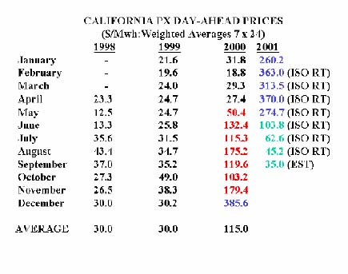

Source: Joskow (2001), http://econ-www.mit.edu/faculty/pjoskow/files/CALELE901.pdf 18 

Stage 1: Operating reserves forecast to be below 7%. Stage 2: Operating reserves forecast to be below 5%. Stage 3: Operating reserves actually below 1.5%. 

Source: Sweeney (2002), http://www.hoover.org/publications/books/fulltext/electricity/145.pdf

35% of total capacity unavailable

Source: Joskow (2001), http://econ-www.mit.edu/faculty/pjoskow/files/CALELE901.pdf 20

The Anatomy of a Crisis

- 	Retail rates were frozen, SDG+E rates did rise but large rises in July 2000 caused re-imposition of rate freeze by Sept 2000. 

- 	There was arbitrage between the PX and ISO markets as generators preferred to go into the ISO emergency market and leave the PX. 

- 	In December 2000 FERC declared that IOUs did not have to buy all their power in the PX, the market declined. FERC imposed soft price caps of $150/MWh. 21 

Some ongoing problems

- 	Rolling blackouts in January 2001 affecting 380,000 customers and costing $2.3bn as storm reduces capacity at a nuclear PG+E plant. 

- 	Paying for new supplies ($12.5bn 2001) -prices raised 1 June 2001, state has been buying power via CDWR. 

-  Deferred costs -PG+E bankrupt March 2001. 

-  Overcharging by generators and MW laundering. 

- 	Decreasing consumption -minus 11% May 2001 compared with May 2000 due to weather/suasion. 

- 	New Supplies -10MW applied for between 1997 and 2000. 32MW expected between 2001-05. 

Lessons

- 	When markets are complex ‘design by committee’ allowed interest group politics, rhetoric to supercede common sense, technical realities and international experience. 

-  Spot markets work badly when supplies are tight. 

- 	Consumers should be allowed to face wholesale prices and/or their suppliers should be able to sign long term contracts or financially hedge. 

- 	Spare capacity is a public good in an interconnected system and it should be adequately remunerated. 

- 	Where markets overlap, rules should be standardised as much as possible across them (e.g. ‘MW laundering’). 

- 	Allowing efficient investment is critical as this is likely to be one of the biggest benefits of reform. 

- 	Mid-course corrections to market design need to be built into the market re-design process to take account of learning. 

Next

-  Introduction to Social Regulation: Externalities. 

-  Read VVH Chap 19. 

         Acrobat Distiller 5.0.5 (Windows)

         2003-07-28T02:15:19Z

         2003-08-11T12:25:55+05:30

         2003-08-11T12:25:55+05:30

         PScript5.dll Version 5.2

         xml

               bersara

               Microsoft PowerPoint - 14.23 Class17.ppt

# 14.23 Government Regulation of Industry

Class 17: Introduction to Social Regulation

MIT &amp; University of Cambridge

Outline 

-  Introduction to Social Regulation 

-  The value of risk 

-  Overview of last section of course 

-  Externalities 

-  Potential Remedies 

-  Coase Theorem 

-  Public Goods 

Background to Social Regulation

-  Motivation for regulation is the correction of market failure. 

- 	When we discuss social regulation, we will mean regulation of health, safety, and the environment and public goods such as intellectual property. 

-  Unlike economic regulation, there has been NO de-regulation. 

- 	Much social regulation that really didn’t exist in the US before the 1970s. 

- 	Social regulation is more difficult than economic regulation in some sense because it’s more difficult to determine the costs and benefits of those regulations. 

-  What is in society’s best interest may be more difficult to measure

(eg. seatbelt laws, disclosure rules, etc.). 

Basic Motivation

- 	Much social regulation is really about reducing accidents that lead to bad outcomes, e.g. this can be requiring seatbelts to reduce fatalities from car accidents, pollution reduction (both for criteria pollutants and toxics), workplace hazards, nutritional labelling. 

- 	NOTE: you cannot actually ELIMINATE risk – many of the risks that exist can be extremely small and extremely costly to eliminate completely. 

- 	NOTE: Concern for social aspects -quality of life -of production increases with income (post-materialism highly income elastic). As we get wealthier, we will demand more safety against risks that lead to reduced health status. 4 

Policy Evaluation

-  Regulatory agency powers are determined by the legislature. 

-  For agencies regulating social outcomes, powers are restricted. 

- 	For example, the Environmental Protection Agency (EPA) and Occupational Health and Safety Administration (OSHA), are EXPLICITLY not allowed to base what they do on a cost-benefit analysis. Why? 

-  However in the US the executive branch does provide oversight: 

_ Ford administration required that the cost and inflationary impact of regulations be assessed. 

_ Carter administration said that cost effectiveness of regulation also required. 

-  OMB requires cost-benefit analysis to be done EVEN if it 

can’t be used to set regulations. 

5 

Cost-Benefit Analysis

- 	Maximisation of net benefits requires MC=MB (marginal benefit), why? 

-  This implies distinguishing average and marginal costs. 

-  Notice range of MC much greater than range of AC: 

Table 1 Values for Arsenic Regulation 

Stringency Standard Level (mg/m3) Average Cost per Life ($ millions) Marginal Cost per Life ($ millions) 

Loose 0.10 1.25 1.25 Medium 0.05 2.92 11.5 Tight 0.004 5.63 68.1 

Source: Viscusi (1983).

Analysis of Risk: Factors to be considered

-  Heterogeneity: 

- 	Consistent implementation of a policy is complicated if costs vary between those who must respond to it, e.g. on the basis of technology or wealth. Examples? 

-  Discounting 

- 	How to you account for costs which will be incurred by future generations? Which discount rate should you use? 

-  Irrationality and biases in perception 

-  Overestimation of small risks 

-  Underestimation of big risks 

-  Framing Effects 

- 	It matters how you frame question: much less willing to pay to 7 avoid risk than to accept compensation for increased risk. 

Analysis of Risk: Factors to be considered

-  Uncertainty 

-  How should we deal with uncertainty about future payoffs? What if we do not know what effects will be. 

-  In such circumstances it can be shown that conservatism is not usually the best strategy. 

-  Ellsberg Paradox: 

-  Two bags of balls: in 1, 50% blue and 50% red; in 2, unknown number of red or blue. You must guess a colour in advance and then draw, get prize if you guess correctly. Which bag would you prefer to draw from? How does this change if the game is repeated? How might this apply to global warming?8 

Analysis of Risk: Factors to be considered

-  Political Factors 

-  Lots of concern about political influence on social regulation in US (why not so much elsewhere?). 

-  Voting for environmental protection: 

-  Income, Frostbelt (+ve); Income growth (-ve). 

-  Voting against strip mining, influence of: 

-  Coal consumption in state, surface coal production (-ve) 

-  Underground coal, environmental groups (+ve) 

-  Offset by variable to control for pro-environmental record (significant). 9 

Still to come in 14.23 

- 1. Externalities and public goods

- 2. Value of Life

- 3. Environmental Regulation and Choice of Instruments

- 4. National Markets for Clean Air

- 5. International Markets for Greenhouse gases

- 6. Workplace safety

- 7. Regulation of Pharmaceuticals

- 8. Internet and copying

Externalities

- 	An externality exists when one or more economic agents undertake an activity that affects the (consumption / production set) welfare of other economic agents in a way that is not captured by the market. The externality does NOT have a market price. 

- 	Result: markets with externalities are no longer efficient EVEN if we have perfect competition in the market. Why? 

- 	Example: An electric utility that produces electricity at a constant MC = $2/kWh. But suppose that the utility also produces pollution (sulfurous oxides through the burning of fossil fuels) which damages the environment (acid rain). MCsoc =MCpriv + marginal damage. 

11 

-  Do we get too much or too little electricity in this case? 

Externalities

$

MSC=MPC+MD

MPC

MPB=MSB

P* P1

Pollution

MPB=marginal private benefit, MSB=marginal social benefit, MPC=marginal private cost, MSC=marginal social cost, MD=marginal damage.

Potential Solutions to Externalities

1.Complete Prohibition (compliance issues?) (e.g. CFCs). 

2.Command and Control (e.g.nuclear radiation). 

3.Taxes and subsidies (e.g.landfill waste) 

4.Create property rights (e.g.SOx markets). 

5.Direct action/government ownership. 

6.Moral suasion. 

Coase Theorem

- 	So long as property rights are well defined, then independent of the initial allocation of those rights, if transaction costs are zero (and there are no wealth effects) and all parties can bargain in their own best interests, the efficient allocation will be found. 

- 	So, according to Coase, under a number of very strict assumptions, there is no need for government intervention in the market because people will be able to bargain to the socially 

efficient outcome. 

Example: Upstream Papermill and Downstream Brewery

$ 

MD of pollution MC of abatement Case 1: Suppose brewery owns river, what happens? Case 2: Suppose papermill owns river, what happens? 

0 Pollution

Coase Theorem in practice

- 	If no income effects it does not matter who gets the property rights from efficiency point of view. 

-  It does from a ‘distribution’ point of view, why? 

-  However we need to realise: 

-  Transaction costs are not zero. 

-  Small victims have free rider problems. 

-  Governments acting on their behalf may not know preferences. 

-  Asymmetric information: polluters know more than victims. 

-  Opportunism exists in seeking compensation from damage. 

-  Coase works well when: 

-  Private information important. 

-  Governments cannot get information easily. 

-  No barriers to voluntary private controls. 

16 

-  Parties involved are easily identifiable. 

A numerical example

-  Paper mill: πm=6m-0.5m2 •Brewery: πb =6b-0.5b2-0.5bm 

-  m=output of mill, b=output of brewery. 

- 	Unregulated equilibrium (solve for πm first): m=6, b=3, πm =18, πb =4.5, πtotal=22.5. 

- 	Social optimum (joint profit maximisation): m=b=4, πm =16, πb =8, πtotal=24. 

Solutions

- 1. Lump sum fine. This won’t affect anything unless it is greater than 18. 

2.Specific damages: if mill is fined 0.5bm what happens? 

3.Suppose fine=damages with lump sum compensation to victim, what happens? 

4.Tax on pollution equal to marginal damage=0.5b per unit of m produced? 

Public Goods

-  A pure public good has two characteristics: 

-  It is non-excludable (MC=0). 

-  It is non-rivalrous (not used up in consumption). 

-  Problem with provision (e.g. of clean air) is free-riding. 

- 	Optimal level of provision: sum up individual demands vertically to determine right level. 

- 	Depending on how payment is made you have an incentive to over or under reveal your willingness to pay. 

Free riding in public goods: fishing in international waters

Fish a little Fish a lot Fish a little Fish a lot 1 2 (10,10) (5,5)(12,2) (2,12) 

(x,y): x=return to Country 1, y=return to Country 2. Higher numbers are better for the Country. 

Solutions to Free Riding

- 	Government provision. However how does the government decide to produce public goods. 

- 	Local government may be better at knowing local preferences for local public goods. 

- 	Median voter theorem: if we have single peaked preferences and uni-dimensional policy choices then preferences of median voter will be represented by majority vote. We still have Pareto-principle (P), independence of irrelevant alternatives (I), no dictatorships (D) (From Arrow’s impossibility theorem). 

- 	This suggests that a simple vote on different expenditure levels will lead to the choice of the median voter being the highest level of expenditure which gains a majority, while still satisfying (P,I

and D). Democracy gives the right answer! 

Conclusions

- 	Social regulation is all about the regulation of externalities and public goods. 

- 	This sort of regulation is plagued by problems of measurement as it often effects risk of death and quality of life, the value of which are difficult to measure. 

- 	Efficient forms of social regulation do exist but these are sophisticated and not common. 

- 	We consider some recent examples and proposals for efficient use of taxes and permits in subsequent classes. 

Next 

-  Value of Life 

-  Read VVH Chapter 20

         Acrobat Distiller 5.0.5 (Windows)

         2003-07-28T02:15:38Z

         2003-08-19T15:48:06+05:30

         2003-08-19T15:48:06+05:30

         PScript5.dll Version 5.2

         xml

               bersara

               Microsoft PowerPoint - 14.23 Class18.ppt

# 14.23 Government Regulation of Industry

Class 18: Valuing non-market goods

MIT &amp; University of Cambridge

-  Non-market goods 

-  Willingness to pay vs alternative measures 

-  Household production analysis -smoke detectors 

-  Wage market analysis 

-  Contingent valuation -LA pollution 

-  Links to regulation 

- 	We need to value non-market goods in cost benefit analyses. Why? 

-  Sources of value: 

-  Accident risk e.g. nuclear facility 

-  Amenity value e.g. public park 

-  Option value e.g. biodiversity 

-  Existence value e.g. Blue Whale 

- 	Agencies should determine what value environmental amenities have. 

- 	These non-market valuations should be incorporated into cost-benefit analyses of policies. 

- 	The problem is how do we value something that does not have a market price. 

- 	Distinguish use value and non-use value (which is which in previous list?). 

- 	EPA and OSHA are explicitly not allowed to do cost benefit analyses. Why? What restrains their activities in the absence of CBA? 

- 	Willingness to pay approach is the one that should be used in valuing non-market goods. Why is this consistent with consumer theory? 

-  Alternative approaches exist: 

-  Human capital approach 

-  Direct cost approach 

- 	What differences in the value of life would we see between using the WTP, Human Capital and Direct Cost approaches? 

# Approaches to Estimation of WTP

-  Revealed Preference approaches: 

-  Household Production Analysis e.g. purchases of equipment such as smoke detectors 

-  Hedonics e.g. effect on house prices, wages 

-  Stated Preferences: 

-  Contingent valuation analysis e.g. via survey of WTP for risk reductions 

-  Experimental analysis 

-  Hybrid of Revealed Preference and Contingent 

valuation e.g. ask WTP for smoke detector

- 	Look at quantity demanded of market goods that are compliments or substitutes to or directly produce the intangible in order to infer the demand for the intangible. 

•Examples: 

-  Hotelling: travel cost models. Cost of travel to a site acts as proxy for its price. 

-  Averting behaviour models: cost of the device shows WTP for intangible. E.g. smoke detector, ? 

7 

-  Assumptions: 

-  Indirect markets exist and are complete (there is some way of producing every level of the intangible good). 

-  Continuous, well identified and known production function (you know the cost of the market good and the rate at which the market good generates the intangible). 

-  Only the user benefits (no non-user benefits, no 

public goods aspects). 

8 

# Travel Cost Methodology (Clawson-Knetsch)

- 1. For a given recreational site, divide the surrounding area into zones, each zone representing a given level of cost to travel to site. 

- 2. Ask visitors to tell you where they came from (which zone). 

- 3. Calculate the number of visits per zone. 

- 4. Find cost/visit by zone, where c=mileage*cost/mile+opportunity cost of time*time it takes to travel to site. 

- 5. Assume that an increase in cost is equivalent to an increase in price (one to one correspondence). 

- 6. Plot cost/visit against visits per population. 

- 7. Plot cost against number of visits. 

-  Suppose over 1 year you get 1000 visits from visitors from 5 zones, A-E. 

-  A=400, B=300, C=200, D=100, E=0. 

- 	Costs of travelling from the center of each zone to the site including opportunity cost of time travelled are: 

-  A=25, B=50, C=75, D=100, E=125. 

-  From this data plot visits per year against costs. 

- 	Treating an increase in cost as an increase in price (over time), this tells us each zone’s demand curve. 

-  Aggregate individual demand curves to get the aggregate willingness to pay function. 

-  WTP equals the area under the Demand Curve. 

- 	We assume that demand is linear, no entrance fee, equal population in each zone, additivity is ok and income effects are small, identical preferences across zones, no multi-site visits, time spent per visit is constant, no congestion etc. 

# Smoke detectors and the value of life (Dardis, 1980)

-  Purchases must be voluntary (why?). 

- 	Start by assuming marginal WTP for a change in risk of death=cost of device that changes risk. 

- 	Cost=change in probability of death X value of life (assuming that injury = $0). 

- 	Cost estimates: Smoke detectors cost $52 in 1974, batteries cost $7 per year, detectors last 10 years, discount rate = 10%: annualised cost = $21.37. 

# Smoke detectors and the value of life (Dardis, 1980)

-  Probability of reducing death if detector works = 0.45. 

-  Probability of detector working = 0.8. 

- 	Together risk decreases by 0.0000315 if you have a smoke detector. 

- 	Value of life=cost/change in probability of death = 21.37/0.0000315 = $676,266 

-  What does this mean for regulation and for revealed 

preference? 

- 	WTP can be detected by examining how the price for a traded good varies with the amount of intangible characteristic it contains. 

-  You can use method if you have differentiated market goods. 

- 	See how the variation of price of the tangible good varies with the intangible characteristic, obtain marginal WTP for intangible, then see who levels of intangible are related to MWTP and income level to get demand for intangible. 

-  It does not capture non-use value. 

- 	You have a potential identification problem if you just observe prices and characteristics -need to identify demand function from this. 13 

Wage 

X Y V V VV=market opportunity locus EU1=utility curve of worker 1. EU2=utility curve of worker 2. EU2 EU1 

0 Risk 14

- 	We can estimate the value of life from wage and job risk data: 

Annual Earnings =α+β1 Annual Death Risk

n 

∑ Personal Characteristic i +ψi 

n 

∑ Job Characteristic i +εi

- +γi 

i =1

i=1

-  β1= Value of Life estimate in this case. Why? 

- 	Estimates vary between $1m and $6m in a range of studies. 

-  What variables would it be important to include in

the regression analysis and why? 

- 	Can find WTP via a survey. Ask people what they would be prepared to pay to avoid given risks. Thus if people say they are willing to pay $500 to reduce death risk by 1% then this is the marginal WTP. 

- 	This requires that hypothetical constructs be taken as real. Why might this be a problem? 

- 	However can use this method to get at non-use valuations e.g. Blue Whales. 

- 	One problem is that the results are subject to calculation errors, inconsistency, framing effects and ‘sounds reasonable’ effects. Example of UK safety survey (Beattie et al., 1998). 16 

- 	1982 in LA. Looked at air quality and tried to determine people’s willingness to pay for better air quality as measured by visibility. 

-  Shown 3 pictures with poor, fair and good air quality. 

-  Asked how much WTP to go from one level to the next. 

- 	Got income data etc and found WTP between $5.55 and $28.18 for improved air quality. 

-  Method used extensively for damages assessment. 

- 	How could you have used another measure of WTP in this particular case (see Brookshire et al, 1982)? 

- 	Do regulatory agencies apply a consistent value of life? 

- 	Should look at life years saved as this may vary with who is likely to be effected and when. 

-  Example of the EPA. Maximum is billions per life... 

-  Why do they not behave consistently? 

- 	Evidence is that values of life too high in many cases. However the analysis may still be useful for deciding cost effectiveness of EPA budget and their budget priorities in any given period. 18 

- 	Risk analysis compares the risk of regulatory inaction to the risk of regulatory action. 

- 	For instance, because regulation involves financial costs and has budget implications as opposed to the hypothetical value of its benefits we need to consider the effect of government expenditure on human life. 

- 	Making society poorer via regulation means that $50m of regulatory expenditure will lead to a statistical loss of life. 

- 	Also cross-effects, regulating one sector may cause migration of demand to more risky sectors. E.g. example 

of reaction to Hatfield rail crash in UK. 

19 

- 	The consistent way to measure the value non-market goods is using a willingness to pay concept. 

-  There are a number of ways to calculate WTP. 

- 	These give rise to inconsistent and often contradictory results which are time and place sensitive. 

-  However they are aids to informed decision making. 

- 	A clear message from each of them is that the better informed individuals are about risks the more likely they are to make consistent choices about their WTP for non-market goods. 

20 

-  Introduction to Environmental Regulation 

-  Read VVH Chapter 21

         Acrobat Distiller 5.0.5 (Windows)

         2003-07-28T02:16:02Z

         2003-08-11T12:43:54+05:30

         2003-08-11T12:43:54+05:30

         PScript5.dll Version 5.2

         xml

               bersara

               Microsoft PowerPoint - 14.23 Class19.ppt

# 14.23 Government Regulation of Industry

Class 19: Environmental Regulation

## MIT &amp; University of Cambridge

# Outline 

-  Basic Regulatory Instruments 

-  Equivalence of instruments 

-  Taxes vs Targets 

-  Taxes vs Subsidies 

-  Multiple source regulation and Permits 

-  EPA and US emissions regulation 

-  The Future of market mechanisms 

# Basic Regulatory Instruments 

-  Basic regulatory instruments 

-  Command and Control 

-  Economic Incentives 

-  Taxes (fees) 

-  Subsidies 

-  Liability 

-  Permits 

-  Complications: 

-  Space and time 

-  Uncertainty 

-  Efficiency vs cost effectiveness 

-  Ambient differentiated vs emission differentiated regulation

3 

# Coase Bargaining Game 

-  Illustrates the role of distribution in getting the efficient outcome: 

-  Basic example: company produces effluent which pollutes river: 

-  Primary treatment of effluent = $100 (to company) 

-  Water purification costs = $300 (to citizens) 

-  Environmental damage = $500 (to citizens) 

- 	Victim assigned rights. Maximum offer by company = $100, this does not compensate victim, therefore he refuses to accept and company installs treatment equipment. 

- 	Polluter assigned rights. Maximum offer by citizens = $300, minimum offer acceptable to company = $100, therefore company gets $100 + $100 under symmetric bargaining. 

-  Outcome the same in both cases but distribution of benefits very 

different. Who prefers what? 

4 

# Command and Control

- 	Regulator specifies steps individual polluters must take. This can involve specifying maximum pollution rate from each Source (e.g. a smoke stack). EPA does this and tells industry what technologies meet standard. 

-  This may be efficient if EPA has good information. 

- 	Often it is combined with significant fines for non-compliance. Why would this have to be the case? 

- 	Pros: certainty of outcome and simple monitoring and enforcement. 

- 	Cons: No incentive to innovate, does not equalise marginal abatement costs (equi-marginal principle), not full internalisation. 5 

# Economic Incentives

- 	Fees or Pigouvian taxes/subsidies (represent a MD cost and can be set equal to marginal abatement cost). 

- 	Permits: buy and sell the right to pollute. Trading induces a price on the permit which then means the firm faces a MD cost). 

- 	Liability: make firm liability for the environmental damage imposed by its actions e.g. in using producing hazardous waste. This gives firm incentive to reduce this. 

# Economic Incentives

- 	Pros: incentives to innovate, polluter pays, equi-marginal principle is satisfied. 

- 	Cons: do not handle time and space variation very well, hard to adjust over time to inflation or new information, leads to large transfers of wealth which creates political problems. 

•Also: 

-  Uncertainty about position of MC and MD functions mean that market solutions mean that outturn level of cost/quantity may be vary variable. Do we care? 

-  Easy to regulate emissions but actually we only care about ambient air quality. The link is site specific. 7 

# Equivalence of different instruments

-  It is possible to achieve the same outcome 

via tax, subsidy, permits, liability or 

## command and control. How? $ 

MD MCAbatement 

0 P* Pollution 8

# Taxes vs Quantity Control

What will the outcome be under tax?

$

MD MC0 MC1 MC2 What is the DWL if MC is actually MC1? What will the outcome be under quantity control (could be permit or C&amp;C)? What is the DWL if MC is actually MC1? T* 

0 P* Pollution

# Taxes vs Subsidies 

-  In the short run these can be equivalent. 

-  Tax: 

-  e=ay (fixed pollution proportion) 

-  TC(y,e) =VC(y,e)+te+FC 

-  TC(y,ay) =VC(y,ay)+tay+FC 

-  MC(y)=MVC(y)+at: tax raises MC. 

-  Subsidy: 

-  TC(y)=VC(y)+FC-s(eu-e): eu=unregulated level of e 

-  TC(y)=VC(y)+say+FC-seu 

-  MC(y)=MVC(y)+sa: so if s=t we get same outcome. 

# Taxes vs Subsidies

- 	In the short run there are no entry effects but in the long run you have altered the total cost of production so there are entry effects. 

-  AVC is effected by subsidy. 

- 	AVC has fallen by seu/y since you only get this if you have y&gt;0. 

- 	This implies that some unprofitable firms continue operating as LRATC has fallen. This means more firms and lower prices than without subsidy. 

# Multiple Pollution Source Regulation

$

MD

MCB

MCA

0 Pollution

S

What is the cost of setting a common standard for A and B relative to either a taxation system or a permit system? 

# Environmental Regulation in the US 

- 	Motivation: Up until 1970, there was no co-ordination or national standards for environmental quality. In 1970, the US EPA was formed to oversee and develop national standards for environmental policy. Since then, the cost of regulation have grown to be approximately 1-2% of GDP. 

-  EPA’s mandate was to: 

- 	a) determine national uniform standards for environmental quality without regard for costs: meant to protect human health as a primary standard 

-  b) determine technology based standards 

- 	c) protect other aspects of human welfare (eg. Buildings, crops, etc.) as a secondary standard AND set strict car emissions standards. 

- 	EPA sets standards. States must come up with SIPS stating how they will meet those standards. Local and regional agencies must report to the states. 

13 

Environmental Regulation in the US

- 	Enforcement: EPA can withhold federal monies targeted for a state if a state does not comply. Can also prevent construction of new major pollution sites or major renovations of existing sources. 

- 	Background: EPA was formed on July 9, 1970 and was formed from various parts of other pre-existing departments: Department of the Interior, Health, Education and Welfare; Agriculture; the Atomic Energy Commission; the Federal Radiation Council, and the Council on Environmental Quality. 

- 	Distinctiveness: EPA’s mandate is to deal with externalities as opposed to regulating a natural monopoly. Also, instead of having authority over a single industry, its authority is over a number of different industries. 

## EPA Concerns

- 1. Status Quo Bias: It is hard to implement policies that move away from the already existing legal or political output. 

- 2. Location Bias: Pollution problems can be very site specific because of geography, population, industries. 

- 3. Localized Enforcement: Taxes and standards aren’t generally less of a problem here because local authorities LIKE collecting money. But variation in enforcement can be a big problem. 

- 4. Uncertainty: costs and benefits can be quite elusive. Optimal control mechanism depends on where uncertainty lies. 

- 5. Inflation: This is particularly problematic for taxes/fees. Fees are hard to change and are NOT indexed. 

- 6. Grandfathering: This protects existing plants. Why? 

- 7. Economic Growth Effects: is growth inhibited by regulation? 15 

## Air Pollution Regulation in the US 

- 	Definition: Stationary Sources: sources of pollution that are NOT mobile. Smoke stacks, chimneys, etc. 

- 	Approximately 27,000 MAJOR stationary sources of air pollution regulated by the EPA in the US (usually denoted by emitting &gt;100 tons of a listed pollutant per year). 

- 	Worried about environmental deterioration of (1) surface air (troposphere) which can be local or regional pollution or (2) upper atmosphere (stratosphere) where we think of global air pollution. 

- 	Pollution emissions can occur on either a continuous or intermittent basis (eg power plants vrs. cars). Should policy be “constant” or intermittent? 

-  Complicated relationship between emissions and air quality. 

-  If we’re dealing with LOCALIZED pollutants, why not just have

it under state/local jurisdiction? 

## 1970 Clean Air Act (CAA) 

-  Distinguished two types of pollutants 

- 	1. Criteria (or conventional) pollutants: relatively common, presumed dangerous only in high concentrations; often have natural sources: SO2, CO, NOx, lead, ozone (NOx + hydrocarbons: low lying is bad and too little up in the upper atmosphere is bad), TSPs. 

- 	2. Hazardous pollutants (will not deal with here...threshold effect problems...) 

- 	For each criteria pollutant, the CAA established AMBIENT air quality standards (NAAQS) which gave the maximum allowable concentration in a local area (averaged over a specified time period: short and long) 

- 	States were supposed to come up with SIPS to give timetable for reaching standards by the mid 1970s, but by 1975, it was clear that many weren’t going to make it so the deadline was extended to 1982 and 1987 for CO and ozone. California’s South Coast Air Basin is still trying... 

## 1977 Revisions to CAA

- 	Urban areas are so much dirtier than rural areas...and rural areas are getting dirtier. Since urban areas dirtier, you get higher levels of regulation which caused plants to move to cleaner, less regulated areas... so: Sierra Club sues that EPA isn’t meeting its mandate of keeping clean areas clean so we get: 

-  PSD regions: to keep clean areas clean and 

- 	Non-attainment regions: regions that fail to meet the standards have federal regs imposed 

- 	PSD: new sources under best available control technology. Existing sources nothing. Maximum area increase limit set. Not allowed to exceed even if cleaner than NAAQS. 

# 1977 Revisions to CAA

- 	Non-attainment: permit program for new construction/major renovations only allowed if won’t slow down the meeting of standard, new sources must put in lowest achievable emissions rate (LAER) technology. Existing sources must install RACT (reasonably available control tech). 

- 	NSPS (new source) is supposed to be based on the best technological system: meant to serve as a FLOOR for LAER and BACT regulations and affects all new sources. 

- 	Congress established a NON-COMPLIANCE penalty: any economic gain received by a source due to its non-compliance along w/ a penalty by the EPA will go to the EPA. (This led to a 30-40% cut in delays for compliance!) 

-  NOTE: existing sources regulated by states. 

## Efficiency Issues 

- 	1. Are standards set at an efficient level? Probably not because of lack of CBA. 

- 	2. Uniformity of standards: doesn’t take into account difference in population density, local meteorological conditions, local costs of compliance. 

- 	3. Timing of emissions flows: primary standards are usually long term annual standards. But it’s really the SHORT TERM flows that determine cost (that’s what’s hard to meet for industry) and are probably more important in terms of health? 

- 	4. Why does the EPA hold stricter standards for new sources? And what are the consequences of doing this? 

# Hahn (1989) on the use of Market Mechanisms

- 	Conclusions from four early experiments with market mechanisms: 

-  Taxes too low to illicit much change in output. 

-  Trading too thin in permit markets. 

-  However some positive experience esp. the US lead trading program 1982-1987. 

- 	Reasons to think that use of these mechanisms might increase: 

-  Marginal costs of abatement will rise over time. 

-  Demonstration effects positive. 

-  Monitoring and enforcement costs likely to fall over time.

21 

# Conclusion

- 	There are a number of economic instruments that economists might recommend to regulate environmental externalities. 

•	Market based mechanisms – taxes and permits – are good for innovation and for equi-marginality. They can be allowing the meeting of environmental targets at least cost. 

- 	As measurement becomes more sophisticated and cheaper more sophisticated market arrangements can be put in place (e.g. time of day trading). 

-  However significant issues of distribution of 

benefits remain. Who pays is an important issue.

# Next

-  Markets for Clean Air 

- 	Read: Joskow, P.L., Schmalensee, R. and Bailey, E.M. (1998), ‘The Market for Sulfur Dioxide Emissions’, American Economic Review, Vol.88 (September), pp.669-85. 

         Acrobat Distiller 5.0.5 (Windows)

         2003-07-28T02:17:03Z

         2003-11-25T10:42:43-05:00

         2003-11-25T10:42:43-05:00

         PScript5.dll Version 5.2

         xml

               bersara

               Microsoft PowerPoint - 14.23 Class20.ppt

# 14.23 Government Regulation of Industry

Class 20: Markets for Clean Air

MIT &amp; University of Cambridge

Outline 

-  Acid Rain and its Environmental Impact 

-  The US Acid Rain Program 

-  Basic Permit Trading Concepts 

-  Experience with the Market 

-  An evaluation of its impact 

-  The RECLAIM NOX Program in CA 

-  RECLAIM and the CA Electricity Crisis 

What are Acid Rain Pollutants?

- 	Primarily caused by SO2 and NOX emissions, significantly from power stations. 

- 	Classic Environmental Externality -why is the problem different in Europe vis US? 

-  Acid Rain affects: 

-  Respiratory Health (mortality and morbidity) 

-  Visibility (recreational and residential) 

-  Fishing (recreational) 3 

-  Also forests (e.g. in Germany) 

Damage Estimates (Burtraw et al., 1998)

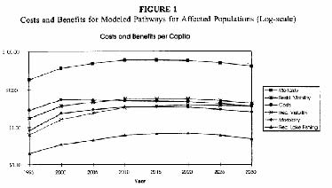

Basic Permit Concepts

-  Cap and Trade 

-  Netting (within plant) 

-  Offsets (build new plant if local reduction) 

-  Bubble (within company) 

-  Banking (past emissions) 

-  Borrowing (against future emissions) 

US Clean Air Act Amendments of 1990 (CAAA)

- 	First Bush Administration implements tradeable permit approach to control emissions of SO2 from coal and oil burned in electric utility boilers (Title IV of CAAA). 

- 	Enacted 1990, covers period from 1995-1999 (Phase 1) and from 2000-(Phase 2). 

-  In Phase 1, largest 263 plants effected. 

- 	In Phase 2, virtually all electric generating units to be included. 

- 	Covered plants must have permits to cover their emissions in any given year or else substantial fines imposed. 

Organisation of Market for Permits

- 	Total no. of permits fixed indefinitely (constant beyond 2000), issued each year for 30 years ahead. Proposals exist for further emissions reduction. 

- 	Each new and existing generator allocated rights according to formula. 

- 	Around 2.8% of allocation held back to be auctioned in an annual revenue neutral auction (proceeds returned to generators) held by EPA. Auctions cover current year and 7 year ahead markets. 

- 	In addition EPA will auction additional privately submitted permits. The auctions are pay as bid. 

8 

-  Most trades are bilateral and outside this market. 

Concerns about the efficiency of the permit market

- 	There is a concern that incumbents may hoard permits and refuse to trade them. Why might they do this? 

- 	There is also concern that the auction may not be efficient. 

- 	Auction theory suggests that pay as bid auctions lead to under-pricing -why? 

-  Joskow et al. (1998) attempt to analyse 

efficiency of market. 

9 

Prices in the Market

Source: Joskow et al., 1998. 

Quantities traded in the market

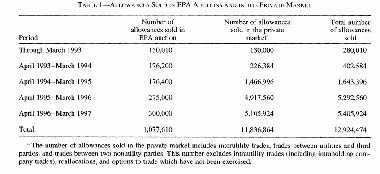

Source: Joskow et al., 1998. 11

Effect of Trading System on Emissions

Source: Ellerman, 2003, http://web.mit.edu/ceepr/www/2003-003.pdf 12

Technological Benefits of the System

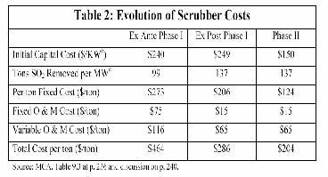

Evaluation of the savings from system over command and control

- 	Utilities are allowed to pass on costs under rate of return regulation, so not clear what incentives to switch to low sulphur use are before full generation market competition. 

- 	Some states allowed costs of cleaning up of dirty power stations with scrubbing equipment to protect local jobs in coal mining. 

- 	In the early years this may have led to higher costs than under command and control. 

- 	However estimation is that Phase 1 savings around $350m p.a. or around half the actual compliance costs.

14 

Why did quantities fall and prices stay low? (Ellerman, 2003)

- 	Emissions standards toughen substantially in 2000, why would companies wish to reduce their emissions below cap before this? 

- 	Fuel substitution at plant (compare with command and control approach to use of low sulfur coal?). 

- 	Scrubber cost effect (why might cost of scrubbers come down relative to command and control approach specifying scrubber technology?). 

-  Overall switching effects (=what?). 

Allocation of permits

- 	Why is it a good idea to allocate permits to incumbents? What are the disadvantages of doing this relative to an auction or tax system? 

- 	Allocation seems to have little effect on the gains from trade in this case. 

- 	How might this learning be relevant to potential carbon dioxide emissions trading arrangements? 16 

Lessons from US SO2 Cap and Trade Program

- 	Banking is a force for good and made use of by companies in a desirable way (good for environment and price spikes). 

- 	Voluntary response to incentives is extremely powerful and effective. 

- 	Property rights for air can be traded effectively with no cost to the environment (relative to command and control). 

-  Once markets are set in place easy to see how they 

can be tightened and extended. 

RECLAIM Program in CA 

- 	Regional Clean Air Incentives Market instituted in 1993 to target SO2 and NOX emission s in the South Coast Air Quality Management District. 

- 	Covers more sectors than national SO2 programme, but no banking allowed. 

- 	Number of NOX permits set from 1994. Until 1998 the number exceeded the demand, but in 1999 there was a significant fall in the allowed permits. 

- 	Price in 1999 was $1500-3000 per tonne of NOX, 2000 permits were $4300. 

Supply and Demand in CA electricity market

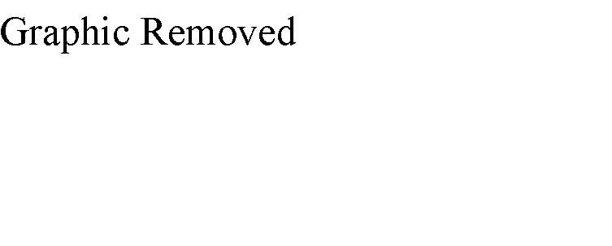

RECLAIM and the CA Electricity Crisis (Sweeney, 2002)

- 	Prices rise to $45000 per tonne NOX in first ten months of 2000. 

- 	For a typical base-gas generation plant, the amount of NOX produced is small (0.1 pounds per MWh). Even the rise to $45,000 increases the price per MWh by $2.25. Recall what was happening to CA prices. 

- 	However for old gas-fired turbines the numbers are 4 pounds NOx per MWh or $90 per MWh. This is significant for the equilibrium price. 

The case of AES

- 	The existence of NOX caps meant that in the absence of retro-fitting generators had effectively caps on their electricity generation. 

- 	Electricity generating company, AES, exceeds its limit by 600 tons in 2000. It is fined $17m or $28,000 a ton in addition to purchasing emissions credits to make up for loss, installing state of the art equipment on three of its units and deducting the amount from future 

allocations. Was it worth it? 

The future of RECLAIM 

- 	The scheme has now been called into question for its roll in driving up prices of electricity and electricity generators have returned to command and control emissions control. 

- 	However was the scheme to blame for the crisis? If not, why not? 

- 	How would you analyse whether it was giving bad incentives or not? 

- 	Note the marginal damage cost of NOX in CA is potentially high due to local condition (order $1000 

per ton elsewhere). 

Conclusions

- 	The Coase Theorem should work for SO2 and NOX once property rights are defined. Large market with multiple buyers and sellers, good monitoring and low transaction costs. 

- 	The experience with emissions trading regimes for SO2 and NOX has been encouraging in terms of efficiency in meeting politically defined quantity targets. 

- 	However they are potentially very costly (especially if we equalise MSC=MSB) and ultimately it will be consumers who pay. 

- 	Next Question: does this experience translate to greenhouse gas emissions reduction regimes? 

Next 

-  Markets for Carbon Dioxide 

- 	Read Chichilinsky, G. and Heal, G. (1993), ‘Global Environmental Risks’, Journal of Economic Perspectives, Vol.7, No.4 (Autumn, 1993), pp.65-86. 

         Acrobat Distiller 5.0.5 (Windows)

         2003-07-28T02:17:20Z

         2003-08-18T12:01:46+05:30

         2003-08-18T12:01:46+05:30

         PScript5.dll Version 5.2

         xml

               bersara

               Microsoft PowerPoint - 14.23 Class21.ppt

# 14.23 Government Regulation of Industry

Class 21: Markets for Greenhouse Gases

MIT &amp; University of Cambridge

Outline 

-  The GHG problem 

-  Some Economics relevant to Climate Change 

-  Marginal damage costs of Climate Change 

-  The Nature of Uncertainty 

-  Economic Policy and Uncertainty 

-  Benefits of International Co-operation 

-  McCain-Lieberman Draft Bill 

Source: Reilly et al., 2003, http://web.mit.edu/globalchange/www/PewCtr_MIT_Report03.pdf, p.5. 3 

Potential damage of rising climate

- 	Sea level rise leading to: dryland loss, wetland loss, coastal protection and migration. 

- 	Agricultural output and distribution of output effects. 

- 	Heat stress, cold stress, malaria, tropical cyclones, extra tropical storms, river floods and unmanaged ecosystems. 

- 	The effect of these would be deaths, migration and increased mitigation expenditures. 

- 	Standard estimate range is that average global temperature will rise by 1.5-4.5C by 2100. 4 

Some difficulties in assessing climate change

- 	We are actually talking about managing risk under uncertainty. There are two ways of dealing with this: insurance and mitigation. 

-  Problems for analysis: 

-  Difficulty in assessing risks. Why? 

-  Risks are endogenous. Why? 

-  Individual risks correlated with each other. So, what? 

-  Irreversibility. How is this significant? 

Is insurance the answer?

- 	If I (or the UK) am worried about climate change, why can’t I (or the UK) just take out an insurance policy? 

-  State of nature contingent markets do exist: 

-  Chicago Catastrophe Futures 

-  Monte dei Paschi di Siena agricultural insurance 

- 	In theory it might be possible for countries to offer insurance on the basis of differences in their perceived risk. 

-  Why will conventional insurance mkts have to deal 

with climate change? 

6 

How insurance might work

- 	Two countries (1&amp;2), two states of the world (a&amp;b), pa=0.1, pb=0.9. 

- 	If country one has w1(a)&gt;w1(b) and country two has w2(b)&gt;w2(a) then there is opportunity to reduce the minimum outcome by trading (i.e. insurance is possible). 

- 	If climate state is a then 1 transfers Da,1,2 to 2 and if it is b 2 transfers D b,2,1 to 1 such that 0.1 Da,1,2 –0. 9D b,2,1 =0. If there is uncertainty about probabilities we need to ensure for all probability distributions. 

- 	Countries that are differently effected by climate change could raise welfare by trading insurance. 7 

Difficulties of making agreements on climate change

- 	Free-rider problem and incentives to enforce schemes internally (why?). 

- 	Usually enforcement of collusive agreement mechanisms do not work (for example?). 

- 	Equalisation of marginal emissions abatement cost is not optimal at national level (why?). 

- 	What implications might this have for a global CO2 tradeable permit system? 

Option values and irreversibility

- 	Option value and non-use value are closely related. Why? 

- 	Value of waiting before taking action is that you may find that cheaper ways to address the problem in the future. 

- 	Cost of waiting to take action is that damage may be irreversible if early action not taken. 

Option Value p 1-p t=0 t=1 Choose conservation level c0; Benefit is b0&lt;0 

State s1: choose conservation level c1 payoff is b1&lt;0 

State s2: choose conservation level c2 Payoff is b2&gt;0 

At t=0 we have one unit of an environmental asset.In s2 payoff increasing in amount of environmental asset.If decision at t=0 is reversible, then c0=0, c1=0, c2=1.If decision at t=0 sets maximum amount of c at t=1, then c0(b0+(1-p)b2), this is the net option value(assuming c1 can be set to 0).

How uncertainty effects allocation of consumption across time

Marginal Utility 

First period marginal utility Second period marginal utility with certainty Second period marginal utility with uncertainty 

c1 c2

Fixed amount of consumption to be allocated between period 1 and period 2. Thereis a possibility that the resource will be valued more highly by a future generation.

11 Uncertainty makes case for conservation only when expected return to postponement is positive. 

1990 Prices, 5% Discount Rate, World GDP = $16500 (1990). Total = 1.3% GDP 

Source: Tol, R.S.J. (1999), ‘The Marginal Cost of Greenhouse Gas Emissions’, Energy Journal, Vol.20, No.1, pp.61-81. 

12 

Source: Tol (1999). 

13 

Equity Issues 

Dworld=ΣregionsDregion(Yworld/Yregion) 

D=damage, Y=income per capita. 

Source: Tol, 1999. 

15 

Source: Tol (1999). 

Source: Tol (1999). 16

Uncertainties in Climate Change

-  Three uncertainties in the MIT-IGSM Climate Model: 

-  Uncertainty about the Atmosphere-Ocean circulation. 

-  Uncertainty about rate of heat uptake by oceans. 

-  Uncertainty about the radiative forcing in response to given aerosol loadings. 

- 	With no policy mean rise in global temperature is 2.4C with a one in twenty chance of being outside the range 1.0 to 4.9C. 

- 	The result of a policy restriction is that mean rise is 1.6C with a one in twenty chance of being outside the range 0.8 to 3.2C. 

-  How would you assess the option value of policy? 17 

MIT-IGSM Policy Scenario

- 	Kyoto implemented by all countries including US in 2010, the cap is then lowered by 5% every 15 years for Kyoto cap countries. For other countries they are capped in 2025 at 5% below their 2010 levels and this is reduced by 5% every 15 years. 

-  Assume only CO2 capped. 

- 	The result of this is CO2 emissions fall but concentration continues to rise. 

-  Why would you want to bring in other GHGs? 

The impact of policy on probability of climate change

95% upper bound 

Source: Webster et al. (2002), http://web.mit.edu/globalchange/www/MITJPSPGC_Rpt95.pdf, p.12-13.

Methane is 20 times more potent than CO2 by weight, N2O is 300 times more potent, other gases can be 1000s of times more potent. 

Source: Reilly et al., 2003, http://web.mit.edu/globalchange/www/PewCtr_MIT_Report03.pdf, p.24. 20 

Benefits of GHG Emissions Trading

Source: Jacoby et al.(1996), http://web.mit.edu/globalchange/www/MITJPSPGC_Rpt9.pdf, p.15. 21

Lieberman/McCain Draft Proposal on Climate Change

- 	Target: 2010 US GHG emissions to be reduced to 2000 level, by 2016 emissions to be reduced to 1990 level. 

-  Allowances to be issued by grand-fathering and auction. 

- 	All entities emitting more than 10K tonnes per year of GHGs will need permits. Residential and agricultural sectors will not be covered but petroleum refiners and importers will need permits for the GHG emissions produced by their products. 

-  Banking and borrowing (at 10% interest) allowed. 

- 	Initially 15% of any entity’s reduction may be from another nation’s market for GHGs. 

-  Credits for manufacturers who improve fuel economy. 

- 	Administered by EPA with auction proceeds reducing energy costs and assisting disproportionately affected workers. 

22 

See http://www.senate.gov/~lieberman/press/03/01/2003108655.html

Conclusions

-  GHGs represent a problem of risk management. 

- 	The costs of GHGs are potentially large but are actually small in NPV terms at the moment. 

- 	Policy intervention reduces the risk of extreme climate change more than it reduces mean climate change. 

- 	Tradable emissions permit systems should include all relevant gases and need to handle problems of different valuations of damage across countries. 

- 	Proposals exist for permit trading systems and their implementation is highly likely. 

23 

Next 

-  The Regulation of Workplace Safety 

-  Read VVH Chapter 23

         Acrobat Distiller 5.0.5 (Windows)

         2003-07-28T02:17:45Z

         2003-08-11T13:56:47+05:30

         2003-08-11T13:56:47+05:30

         PScript5.dll Version 5.2

         xml

               bersara

               Microsoft PowerPoint - 14.23 Class22.ppt

# 14.23 Government Regulation of Industry

Class 22: Regulation of Workplace Safety

MIT &amp; University of Cambridge

Outline 

-  Markets for health and safety 

-  Health and safety and information 

-  OSHA approach 

-  Effects of OSHA policies 

-  Reform of OSHA 

The Market for Health and Safety 

$ Why does the market not deliver S*? 

MC of safety MV of safety 

0 S* Safety Level 

Why does the labour market help enforce health and safety?

- 	$70 bn dollar p.a. premium because of risk at work. 

- 	Premia do reflect risks associated with job (values of life recovered from this type of analysis). 

- 	Workers and consumers well informed about product and hence enforce standards via reputation effects. 

Can we rely on the market to enforce health and safety?

- 	Adam Smith observed that workers demand higher pay for more risky or unpleasant jobs. 

- 	This depends on: awareness of risk and preference for safety/health. 

- 	Evidence is that some people are prepared to take more health and safety risks (and these are positively correlated). 

- 	Hersch and Viscusi (1990) find that smokers and those who don’t wear seatbelts much more willing to take hazardous jobs. 

- 	What does the above mean for incentives facing firms to lower safety risk? health risk? 

Can we rely on the market to enforce health and safety?

- 	Workers must be aware of the risks they face for the differential wage theory to fully reflect true preferences for risk. 

- 	It does appear to be the case that perceptions about safety risk do match actual risks (U of Mich Survey of Working Conditions). 

- 	However the evidence is that workers are not perfectly informed. 

- 	Wage Premia: 3-5% for chemicals and allied products to 12-15% for lumber and wood products. 

6 

Can we rely on the market to enforce health and safety?

- 	If workers can only observe riskiness imperfectly at time of taking a job then they find out more after starting working. They may reassess risk and quit. 

-  1/3 of all manufacturing quits are due to risk. 

- 	Higher job turnover in risky jobs, length of tenure much lower in risky jobs. 

- 	What sort of incentives face firms in this situation: where would they locate, what sort of people might they hire, how much training would they offer workers? 7 

Can we rely on the market to enforce health and safety?

- 	Workers’ compensation claims for damages in the US were $15bn in 1984, $26.2bn in the late 1990s. 

- 	If workers’ know they can get compensation, what effect might this have on their behaviour? 

- 	For fatalities Moore and Viscusi (1990) estimate that fatalities are 1/3 lower because of liability for workers’ compensation. 

- 	Offering compensation may have offsetting benefits in the labour market through lower wages (Viscusi and Moore (1987), why? 

-  Problems may exist in the extent of liability being too great. 

Information Problems

- 	Markets may fail as a result of asymmetric information e.g. about the riskiness of a job or community or about product quality. 

- 	Workers or consumers only know the average risk associated with a job or product. You get market for lemons problem (Akerlof, 1970). What happens? 

<Table>
<TR>
<TD>Fraction </TD>
<TD>Safety </TD>
<TD>Consumer </TD>
<TD>Group-</TD>
<TD>Gain or </TD>
</TR>
<TR>
<TD>of cars </TD>

<TD>value with </TD>
<TD>based </TD>
<TD>loss </TD>
</TR>
<TR>

<TD>perfect </TD>
<TD>valuation </TD>

</TR>
<TR>

<TD>information </TD>

</TR>
<TR>
<TD>0.2 </TD>
<TD>High </TD>
<TD>30000 </TD>
<TD>23500 </TD>
<TD>+6500 </TD>
</TR>
<TR>
<TD>0.3 </TD>
<TD>Medium </TD>
<TD>25000 </TD>
<TD>23500 </TD>
<TD>+1500 </TD>
</TR>
<TR>
<TD>0.5 </TD>
<TD>Low </TD>
<TD>20000 </TD>
<TD>23500 </TD>
<TD>-3500 </TD>
</TR>
</Table>

Information Problems

- 	In the labour market the firm that offers high safety has to offer higher wages than it should have to and this will make it uncompetitive. 

-  Solving the lemons problem: 

-  Self-certification by warrantees or guarantees. 

-  Government determination of safety level. 

-  Voluntary programs (e.g. associations of responsible firms). 10 

Information Regulation

-  Don’t want to ban activity because of uncertainty. 

-  Individuals differ in valuation of risk. 

-  Regulation of use is expensive to enforce. 

-  Information regulation can be very effective: 

-  Drain opener labels: wear rubber gloves, store in child proof location (63% to 82%; 54% to 68%). More do right thing in response to having labels. 

-  Nutritional Labelling and Education Act (NLEA) mandated labelling. Fat level of salad dressing varies even though self-labelled ‘low fat’, after NLEA high fat dressings experienced significant sales decline. 11 

OSHA

- 	Mandate to set health and safety standards for workers from 1970. However Act did not say how to achieve goal. 

- 	2200 staff at Federal level (second to EPA in social regulation), $435m budget, 37493 inspections at Federal level, 26 states run their own programs. 

- 	Traditional approach was adopting a technology based standard whose stringency was limited by their affordability. Fines for violation. What other approaches might exist? 12 

OSHA Analytical Approach 

$ 

MC of safety MB of safety OSHA standard = ‘promote safety as far as possible’ 

0 SOSHA Risk 

OSHA Analytical Approach

- 	Did not use CBA, only had to worry about firm shutting down as a result of standard. 

- 	US Supreme Court 1981 ruled out CBA, cotton dust standard was ok as as long as technically feasible. 

-  CBA is done via OMB rules. 

- 	Standards setting ridiculed: specifying height of handrail, spacing of posts etc., what should the standards specify. 

- 	Change in analytical approach in Carter administration with move to harnessing market forces in chemical 

labelling regulation. 

Worker response to chemical labelling

Change in fraction who consider job average risk (after labelling) Annual wage increase demanded 

Changes in fraction very likely or somewhat likely to quit (if no change in wage rate) Sodium Bicarbonate 

-35% 

$0 -23% 

Chloroaceto TNT Asbestos -phenone 

45% 63% 58% 

$1900 $3000 $5200 13% 52% 63% 

Is OSHA effective?

- 	Inspections around 90,000 a year (including states). Penalties more like $30m per year. This is very small given the number of workplace locations in the US. Mostly focus is on safety not health. 

-  A rational firm will calculate: 

-  Compliance cost &lt; (probability of inspection) x (no of violations per inspection) x (average fine per violation). Why? 

-  Compare this with impact of labelling on wage demands. Which is more effective in forcing change? 

Is OSHA effective?

Riskt =α+β1Riskt −1 +β2Cyclicaleffectst +β

3 IndustryCharacteristicst +β4WorkerCharacteristicst n +β5∑OSHAt −1 +ε

i t = 0 

Example: Ruser and Smith (1988) find that OSHA Inspections in the early 1980s decreased injuries by 5-14%. 

Does this analysis address the issue of optimality? 

17 

Conclusions on OSHA

- 	Should shift to health market as this is where the more severe market failure is (some evidence that OSHA is doing this). 

- 	Concentrate on high impact inspections (site specific targeting plan since 1999). 

-  Shift to performance not technology standard. 

-  Need to reconsider lack of focus on CBA. 

- 	No obvious need for deregulation of health and safety regulation. 

Conclusions 

- 	Zero safety and health effects in the workplace not achievable. 

- 	Regulatory agency is not the dominant effect on safety and health in the workplace. 

-  compensation claims and wages are much more important than OSHA penalties. 

- 	Regulation should make better use of market based incentives (e.g. via labelling to induce a market reaction). 

Next 

-  Regulation of Inventions 

-  Read VVH Chapter 24

         Acrobat Distiller 5.0.5 (Windows)

         2003-07-28T02:18:01Z

         2003-08-11T14:00:14+05:30

         2003-08-11T14:00:14+05:30

         PScript5.dll Version 5.2

         xml

               bersara

               Microsoft PowerPoint - 14.23 Class23.ppt

# 14.23 Government Regulation of Industry

Class 23: Regulation of Patents: The case of Pharmaceuticals

## MIT &amp; University of Cambridge

-  The regulation of innovation •Patents 

-  Incentives to innovate 

-  Welfare analysis of patent protection 

-  Pharmaceuticals and patent protection 

-  1984 Price Competition and Patent Protection Act 

- 	R+D yields information -so regulation of invention is a form of regulation of information. 

- 	Do we get the right amount of R+D? What is the right amount of R+D? 

-  Public goods aspects of R+D expenditure = ? 

- 	However in practice there are limits on the appropriability of others’ R+D. What are these? 

- 	There are also limits on the extent to which there can be legal protection of inventions. (Mansfield). Why? 

## Patents

- 	Allows ownership of monopoly right for 20 years from date of filing. After 20 years the information becomes free to use. 

-  Patent is an exclusive right to one’s invention. 

-  Patents are similar in effect to copyright: 

- 	Patent applies to ‘any new and useful process, machine, manufacture, or composition of matter, or any new and useful improvement thereof’ (US Patent Office). 

- 	Copyright applies to ‘“original works of authorship,” including literary, dramatic, musical, artistic, and certain other intellectual works.’ (US Copyright Office). 

-  Patent Office needs to be satisfied New, Useful and Non-Obvious. 

-  If you have a patent you must enforce it through courts. 

-  Holder of Patent may license others to use invention for royalties 

before patent life has expired. 

4 

- 	Incentives to innovate depend on the amount of profit an innovator expects to receive. 

-  This can be shown to depend on market structure. 

-  We look at 4 cases: 

-  Minor invention in a competitive industry 

-  Minor invention in a monopoly industry 

-  Major invention in a competitive industry 

-  Major invention in a monopoly industry 

-  Minor invention is one where the price does not change. 

Innovation reduces cost from c0 to c1:

P

c0 c1 DMR 1. Verify that this is a ‘minor’ invention. 2. For a competitive industry what is profit gain from innovation. 3. For a monopoly industry what is the profit gain from innovation. 4. For a social planner what is the profit gain from innovation. I II III 

0Q

Innovation reduces cost from c0 to c1:

P

7 c0 1. Verify that this is a ‘major’ invention. 2. For a competitive industry what is profit gain from innovation. 3. For a monopoly industry what is the profit gain from innovation. 4. For a social planner what is the profit gain from innovation. 

c1 Q 

-  Incentives to invent differ under: 

-  Monopoly 

-  Competition 

-  Social Planning 

-  The issue is the ‘replacement’ effect. 

- 	We have analysed a process innovation, which reduces costs. We could analyse a product innovation which enhances product value. 8 

- 	Optimal Patent Life (Nordhaus, 69): single investor in a competitive industry who makes a minor cost reducing invention. 

- 	Inventor needs to decide on how much to spend on R&amp;D to generate cost savings. 

-  Magnitude of cost savings: B=c0-c1 

-  R&amp;D Costs: TC=αB2 where α&gt;0 

-  For minor innovation: B*Q0 

-  T= patent life T 

-  NPV of benefits: NPV= ∫ BQ0e− rtdt = BQ0(1 − e−rt )/ r 

0 

- 	Inventor maximises NPV of benefits -costs for a given T. 9 

## Inventor’s choice of invention varies with T

$ TC PV(T=20) 

PV(T=10) What size of invention occurs when T=10 and T=20? 

0 

Size of invention, B 10 

## Calculating the Optimal Patent Life

- 	It is always privately optimal for inventors to have longer patent lives. Why? 

- 	Is this likely to be true of invention in general? Why or why not? 

- 	However limiting patent life allows prices to fall as generic products come into the market and eliminate the monopoly power of the inventor. 

- 	Thus the trade-off for society in setting T is the extra producer and consumer surplus gained from longer T via enhanced cost reduction and new products with the lower consumer surplus gained from existing 11 

innovations.

## Benefits of Patents before and after patent expires

$ What is benefit before expiry? 

c0 c1 D What is benefit after expiry? 

0 Q12

- 	Now assume that there are multiple inventors chasing the same innovation and that there are no problems with monopoly pricing. 

- 	P(n) is the probability of society discovering innovation first where n=number of inventors. P’(n) &gt;0 but P’’(n)&lt;0. Each inventor must pay R to be in the race. 

-  What is the optimal number of inventors from society’s viewpoint? 

-  What is the number of inventors in free entry equilibrium? 

-  For society: Max P(n)B-nR: P’(n)B=R. 

-  Under free entry: P(n)B/n=R, why? 

-  Thus the number of inventors is not the same and we have a 

common property problem. 

13 

## New product invention when substitutes exist

- 	New invention lowers costs but is a close substitute for existing product. What is the social benefit of the invention? 

- 	The existing product demand falls and the effects of this offset the benefits in the new market. However should not consider the change in CS (as consumers can still buy the old product at the same price) only the change in PS. 

-  This is a ‘business stealing’ effect. 

P

P

D D1 Existing Market 

Dn New 

Pn Market 

cn 0Q 

P0c0

Q

## Pharmaceuticals

-  Research oriented from 1930s. Extensively regulated. 

- 	In US regulation dates from 1906 (Pure Food and Drug Act) aimed at adulteration and mislabelling of food and drugs sold interstate. 

- 	1938 Food, Drug and Cosmetic Act passed following drug disaster which killed 100 children. This requires new drugs to be approved as safe by FDA. 

- 	1962 Amendments require scientific tests to be conducted to prove drug efficacy prior to marketing approval by FDA. 

- 	Now: 3.5 years of discovery in lab, 6 years of clinical testing, 2.5 years for FDA approval. Only 1 in 4 drugs approved. Approximately 20-30 new chemical entities approved each year. 

-  Total R&amp;D average R&amp;D per approved drug increasing in real $. 

## Demand and Supply for Ethical Drugs

- 	Who demands pharmaceuticals? Patients, doctors, HMOs? 

- 	Producers: the market is international and the 4 firm concentration rate is quite low but has been rising recently via merger, however concentration much higher in certain drug categories. 

- 	Generic producers compete with R&amp;D oriented, branded firms. 

-  Now the case that generic products available after 

a few months of end of patent. 

16 

- 	Patents are biggest barrier to entry but you can alter chemical formulation and attempt to get round patent (recall patents are published) e.g. Tagamet and Zantac. 

- 	Brand loyalty may be an issue but increasingly generics are favoured by insurance coverage. 

- 	R&amp;D scale economies very large, in 1980s the NPV of the cost of new drug to day of approval was $194m (1993 study). 2002 cost of average new drug is $802m (including failures). 17 

## 1984 Drug Price Competition and Patent Restoration Act

- 	This law facilitates the entry of generic competitors after patent expiration thereby leading to price competition. 

- 	Restored patent protection lost during the pre-market regulatory process for new pharmaceuticals. 

- 	In 1998 the effects of this law were analysed by the Congressional Budget Office. 

- 	The net effect of the law was found to reduce the NPV of the expect profits from a new drug by $27m (1990 dollars) but that the return to new drugs had increased

18 

since the Act.

19Source: CBO (1998) at http://www.cbo.gov/showdoc.cfm?index=655&amp;sequence=0 

Source: CBO (1998). 

## Other policies affecting R&amp;D incentives

- 	Favourable tax treatment: investments can be expensed rather than depreciated. 

- 	1983 Orphan Drug Act covers drugs which treat diseases which effect small numbers of people (&lt;200,000 in US). It gives 50% tax credit for R&amp;D expenses for clinical trials. It may also be marketed exclusively for a 7 year period beginning on date of approval (runs contemporaneously with patent life). 

- 	Price controls: these exist in some countries, especially via price formula for National Health System purchases (e.g. UK). 

- 	In US the debate continues over drug company profits and extent to which insurance schemes should pay for expensive new drugs. 21 

- 	Invention, where it relies on the expensive creation of new information which cannot be concealed needs to be regulated. 

- 	Patents are a form of legal protection of the returns to invention. 

-  Patents raise PS but may reduce CS. 

- 	Pharmaceuticals crucially rely on patent protection and changes to law and regulation effect incentives to invest substantially. 

-  However other policies to support pharmaceutical 

22 

innovation do exist.

- 	Regulation of Copyright: the case of internet music 

         Acrobat Distiller 5.0.5 (Windows)

         2003-07-28T02:18:30Z

         2003-08-11T14:04:12+05:30

         2003-08-11T14:04:12+05:30

         PScript5.dll Version 5.2

         xml

               bersara

               Microsoft PowerPoint - 14.23 Class24.ppt

# 14.23 Government Regulation of Industry

Class 24: Regulation of Copyright: The case of internet music

## MIT &amp; University of Cambridge

-  What is copyright? 

-  The History of Napster 

-  Economics of Copyright 

-  The recorded music industry 

-  Impact of file transfers on music industry 

-  Should we stop file transfers? 

-  1445 Gutenberg Press -printing invented. 

- 	1547 England’s Edward VI grants monopoly to King’s printer for certain works. 1556 Charter granted the Stationer’s Company monopoly over printing and powers to enforce. 

-  1707 external competition from Scots to break monopoly. 

-  English Copyright -Statute of Anne -1709. 

-  Legal protection for consumers of copyrighted works: 

-  Curtailment of the term of copyright. 

-  Public domain for literature created: 

-  Copyright only for new works. 

- 	Copyright limited to power to print, publish and sell (i.e. no control of resale). 

-  Copyright belonged to author/creator. 

3 

-  Essential Principles of this statute exist today. 

# Extension of US Copyright Law

-  1790 -Books, maps and charts 

-  1802 -Prints 

-  1831 -Music 

-  1865 -Photographs 

-  1870 -Drama, paintings, drawings and sculpture 

-  1912 -Movies 

-  1964, 1976 -Computer Programs 

-  1971 -Records and tapes 

-  1976 -Dance 

-  1990 -Architecture 

-  1998 -Boat Hull designs 

4 

-  What drives copyright scope extension? 

-  Exclusions from infringement rules: 

-  Non-profit musical performances 

-  Radio musical performance in restaurants and small businesses (1976) 

-  Works of utility (a chair) 

-  Expressions of fact (phone book) 

-  Ideas vs. expression of ideas 

-  Fair use 

-  Parody and commentary 

-  Compulsory licenses of music for a pre-

determined fee. Why? 

5 

## Music Copyright Law and Enforcement (Sonny Bono Copyright Extension Act 98)

- 	For works created on or after January 1, 1978: copyright lasts for life of author plus 70 years (previously 50). 

- 	For pre-1978 works still protected by their original or renewed copyright: the total length of their copyright is extended to 95 years (previously 75) from the date the copyright was originally secured. 

- 	For joint works of authorship, the term is measured by the life of the longest-lived author. 

- 	Works for hire (i.e. corporate), anonymous and pseudonymous works: copyright lasts for 95 years (previously 75) from the year of first publication or 120 years from the year of creation, whichever expires first. 

- 	Can sue for infringement of copyright but need to register works at the Copyright Office before you can sue. 

# Fair Use: for and against? (Klein et al, 2002)

- 	Time and space shifting as ‘fair use’ -user benefits exceed loss of income by a lot. 

- 	Economic issue is whether benefit of this is indirectly appropriable via higher prices and hence that it should be permitted by copyright holders? 

- 	Betamax case, Sony sued for allowing copying of TV programs. However it is clear that this increases the value of the TV programs and copyright holders can charge more. 

-  How is this different for copying an MP3 file? 

-  A Northeastern U. undergraduate issues 1st pre-release version 1999 

-  Concept: 

-  MP3 search engine 

-  File sharing protocol 

-  Communication tool within a community 

-  How it worked: 

-  1. Song title query sent to Napster server 

-  2. Receive client list with title hit 

-  3. Select and contact Client 

-  4. Transfer file 

-  Explosive growth of downloads: 

-  1.1 million users Feb 2000 

-  6.7 million users Aug 2000 

-  13.6 million users Feb 2001 

# RIAA (Recording Industry Association of America) reacts

- 	RIAA claimed no right to distribute, playing phonorecords without license, economic harm to artists. 

- 	Napster claims fair use, non-commercial use, allowed to make temporary copies (time and space shifting), lawful sharing: owners owned copies. 

- 	Napster lose because can’t prove that its pay service could prevent all illegal copying in July 2001. 

- 	Acquired by Bertelsmann (May 2002), eventual bankruptcy, sold for $5m in Nov 2002 to a CD-burner company, Roxio. Bertelsmann being sued for $17bn by

9 

artists and music publishers.

- 	Key issue is efficiency of system vs the ‘distributional’ consequences (as with patents). 

- 	This gives rise to the optimal length and optimal scope of copyright protection. 

- 	Length = number of years for which legally enforceable monopoly rights can be enforced. 

- 	Scope = the amount of ‘fair use’ that should be permitted without recourse to copyright owner e.g. private copying of TV programmes for later viewing. 

- 	In general it is accepted that copying for ‘time’ and ‘space’ ‘shifting’ is ‘fair use’. 

10 

- 	The economic rationale for ‘fair use’ is that it increases the welfare of the consumer without seriously reducing the welfare of the producer and it saves on transaction costs of negotiating with copyright holder. 

- 	Legal case for copyright can include moral right to benefit from created work. 

- 	However we should remember that other incentive mechanisms have been devised to incentivise innovation and these may yield higher social welfare. e.g. state funding for innovators, prizes for innovation, in house innovation. 

-  Is copyright necessary? Is music the same as ethical drugs? 

- 	Landes and Posner (1989) argue that the optimal level of copyright protection depends on: 

-  The response of the number of works created to increase in protection (1) 

-  The value of each extra work (2) 

- 	The response of the total cost of creating works with respect to number of works (3) and the degree of copyright protection (4) 

- 	Increases in 1 and 2 raise the optimal level of protection, increases in 3 and 4 reduce it. 

- 	The reason for limiting intellectual property is to reduce monopoly profits and to reducing tracing costs. 

-  Why have increasing copyright length and fixed date after death of author? 

-  Falling cost of copying should raise optimal degree of protection. 

-  All works should come out of copyright at same time to prevent problems of

12 

determination of publication date and competition between old and new eds.

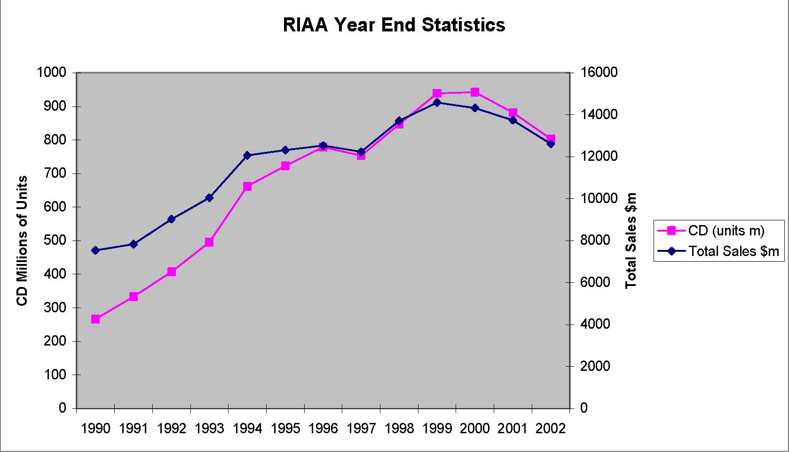

RIAA Year End Statistics 0 100 200 300 400 500 600 700 800 900 1000 1990 1991 1992 1993 1994 1995 1996 1997 1998 1999 2000 2001 2002 CD Millions of Units 0 2000 4000 6000 8000 10000 12000 14000 16000 Total Sales $m CD (units m) Total Sales $m 

Source: Recording Industry Association of America (2000, 2003).

-  $33.4bn (2001) sales world-wide of recorded music. 

- 	5 companies control the market: Sony, Universal, Warner, BMG (Bertelsmann) and EMI. 

- 	Sony had $36bn (FY 2002) sales in electronics and computers. 

-  Universal up for sale. 

-  All losing money in music division. 

-  Sony innovating with music via mobiles. 

-  Apple seeking to market songs across internet. 

14 

# Does the music industry need record companies?

-  Economic characteristics of artists 

-  capital constrained and risk averse 

-  Market for talent very competitive 

-  Recording companies offer 

-  economies of scale in distribution and advertising 

-  deep pockets for advances 

-  ability to spread risk 

-  Recording companies have 

-  monopsony buying power in market for talent – oligopoly in market for distributed music 

-  ability to segment market and price discriminate 15 

# Effect of the internet on music companies

-  Market for recorded music -a vertically related industry 

-  Artist-Music Co-Recording Co-Distribution Channel 

-  The effect of the internet on this market: 

-  Distribution costs drop to virtually zero. 

-  Napster in competitive market for internet service provision. 

-  Drastic innovation with possibly a large effect on recording companies. 

-  However this effect is debatable given willingness to pay for quality. 

# How does illegal copying affect the legitimate music market?

-  Three sources of income in market: 

-  Hard Copies –Broadcasts 

-  Live Performances 

-  Most artists make most of their money from live performances 

-  Profits may fall because: 

-  Losses in distribution channel (competitor network has arisen) 

-  Illegal copies displace legitimate sales 

-  Losses on falling radio audiences due to online listening 

-  Unit of sale has changed reducing demand for pre-bundled

products i.e. move from compilation to single track 

# Lessons from history (Silva and Ramello, 2000)

- 	For three decades the recorded music industry has been subject to illegal copying using tapes but sales have continued to grow. 

- 	Copying only effects the full price segment of the market where established artists make additional money from royalties. 

- 	There are demand network externalities from copies. Sampling does lead to purchases of a full price copy. This is particularly the case in developing countries as income grows. 

-  Demand network externalities increase the demand for 

live performances from the artists. 

18 

- 	Illegal copies have served a useful function for the record companies, in being a credible commitment to not reduce prices in the future. Consumers buy the high price version now knowing that there is little incentive for the record companies to discount it in the future. 

- 	Illegal copies create a new generation of listeners who will purchase full price versions in due course (esp. students). 

- 	Napster may be different to tapes because the quality of the reproduction is identical to the original and hence high willingness to pay individuals have no incentive to pay more for quality. 

- 	2790m tracks downloaded using Napster in Feb. 2001. 

- 	In August 3050m downloaded in August 2001 on successors. 

-  KaZaa software downloaded 130m+ times 

- 	Strong suggestion that file copying must be reducing sales. 

# Economic Analysis of file swapping (f.Romer, 2002)

-  Assume 36bn music downloads per year. 

-  $2 per track (price of CD single $4) 

-  $72bn per year of consumer surplus. 

-  World-wide sales of recorded music = $37bn (2000). 

-  Resource costs of CDs and transportation very significant. 

- 	Compliance and legal costs of enforcing copyright impose additional costs on society. 

- 	How might rest of economy be effected by sharp reduction in file downloads? 

-  New charging strategies: 

-  Apple, Sony initiatives + ? 

-  Increased legal protection: 

-  Suing Napster successors -this is difficult. 

-  Suing ISPs who host downloading individuals. 

-  Suing individuals responsible for file downloads. 

-  Other ways to incentivise creativity: 

-  Taxes and subsidies 

22 

-  Rewards for innovation ? 

- 	Arguments for copyright protection are very similar to those for patents. 

-  Copyright scope extension driven by new technology. 

-  Copyright length extension seems to be driven by market power. 

-  Napster and successors do seem to undermine record companies. 

- 	New ways of enforcing copyright needed to protect electronic material and creative responses by record companies required. 

- 	However also need to recognise that demand for copyrighted material is highly price elastic so it is worthwhile if much material is actually free. 

-  This may mean that finding new ways of paying the fixed costs of 

creativity may be necessary. 

23 

-  Conclusion and Exam Syllabus 

         Acrobat Distiller 5.0.5 (Windows)

         2003-07-28T02:19:12Z

         2003-08-13T14:28:19+05:30

         2003-08-13T14:28:19+05:30

         PScript5.dll Version 5.2

         xml

               bersara

               Microsoft PowerPoint - 14.23 Class25.ppt

# 14.23 Government Regulation of Industry

Class 25: Conclusion and Exam Syllabus

## MIT &amp; University of Cambridge

# General Conclusions

- 	Economic regulation is concerned with control price and quantity sold and using economic instruments (e.g. tradeable permits) to control ‘quality’. 

- 	A lot of good economic analysis of regulation exists which suggests how profit maximising firms can be efficiently incentivised to achieve social goals. 

- 	Actual regulation has often yielded perverse effects and hence moves towards deregulation. 

- 	Social cost benefit analysis of regulation is very important but surprisingly rare in US. 

-  Any other lessons from the course? 

# How to study for Final Exam

- 	Go through all numeric problems that were covered in classes and the problem sets and be sure that you are comfortable with how to solve those models. 

- 	One numeric question will be taken directly from the problem sets. 1/3 of the marks will go to pre-mid term material. 

- 	For each of the industries that we have covered ensure that you know: 

-  The basic outline of the industry 

-  Why it was regulated 

-  Why it was deregulated (if that happened to be the case) 

-  How it was regulated (e.g. price controls, entry controls) 

- 	The economic consequences of the regulation (in terms of efficiency, ability to do what it was supposed to do, profits, etc.). 

-  The level of detail required is that discussed in class. 

# How to study for Final Exam

- 	You do NOT need to remember all the acronyms for the various government agencies, the names of regulations, the dates of regulation (or similar). 

-  There are 3 sections to the exam: 

-  Part I consists of short questions/answers (6 worth 5 points, each). Each should invite 3 -4 sentence accurate but brief responses. Numeric calculations are short with a few sentences for explanation. 

-  Part II consists of two numeric problems (worth 25 points, each). This will take the same format as one of the problem set questions. 

-  Part III is an essay question (worth 40 points). 

# Industries Covered 

-  Electricity •Cable 

-  Telephone: Fixed Line 

-  Telephone: Mobile 

- 	Potentially competitive markets: railroads, trucking and airlines 

-  US air pollution regulation 

-  Pharmaceuticals 

-  Music industry 

Outline of Topics

•1. Review of theory of the firm: monopoly, oligopoly, surplus, government intervention, deadweight loss, strategic competition: limit pricing, dynamic entry deterrence. You should be familiar with these models and be able to solve a simple numeric problem using them. 

•2. Motivations for regulation: economic, public interest, capture theory. You should know what they are and how they differ from one another. The costs and benefits of regulation. 

Outline of Topics

•3. Public ownership: historical roots of public ownership, theory of when public ownership is a good idea (e.g. situations of uncontractable quality, corruption of local government worries), advantages of private ownership; privatization: its objectives and effects. 

•4. Natural monopoly Regulation: pricing strategies (average cost, marginal cost, fully distributed costs, Ramsey pricing, peak load pricing); consequences of pricing strategy (cross-subsidization – stand alone and incremental cost tests; cream skimming; inefficiencies); rate of return regulation (how does it work; consequences such as Averch-Johnson effect, inefficiencies). ELECTRIC POWER EXAMPLE. 

Outline of Topics

•5. Do we need regulation at all? Example of cable and franchise bidding. What are the consequences of franchise bidding? Do we get marginal cost pricing? Do we need to worry about quality? CABLE TV EXAMPLE. 

•6. Changing markets 1: role of technology and how it can affect the regulation of a natural monopoly (changes in demand, changes in costs – fixed and variable: are you more or less likely to remain a natural monopoly with these changes?). WIRELINE TELECOMMUNICATIONS EXAMPLE. 

Outline of Topics

•7. Changing markets 2: importance of common standards and economic success, spectrum allocation, auction theory, the determination of prices by the number of companies and the independence of pricing from auction fee, English and Dutch Auctions. EUROPEAN 3G MOBILE PHONE AUCTION EXAMPLES. 

•8. Regulation of potentially competitive markets: price and entry controls and the economic effects of regulation on the market and on the incumbents and potential entrants. SURFACE FREIGHT AND AIRLINES EXAMPLES. 

Outline of Topics

- 	9. Problems of regulation. How market design effects performance, how regulation can create perverse incentives, social cost benefit analysis of regulatory change. EXAMPLES OF CALIFORNIAN ELECTRICTY CRISIS and UK RAIL DEREGULATION. 

- 	10. Externalities/public goods. Use of Coase Theorem (when it might work, potential reasons it fails), taxes, subsidies, (prices vrs. quantities: what happens with heterogeneous polluters? What happens under uncertainty?), Pigouvian taxes (instrument choice), tradeable permits. Valuing non-market goods such as value of life and safety (hedonics, travel cost method, contingent valuation and how they compare). Option value. Use and non-use of cost benefit analysis. SO2 and CO2 EXAMPLES. 10 

Outline of Topics

- 	11. Patents: why do we need patents? What would motivate a firm to innovate? Does it matter if they are in a competitive or non-competitive market? Optimal patent length. Optimal number of firms entering a patent race. Innovation when there are close substitutes. PHARMACEUTICALS EXAMPLE. 

- 	12. Copyright: technology as driver of copyright protection. Economic harm caused by illegal copying, how the internet effects copying, calculations of the value of copying. MUSIC INDUSTRY EXAMPLE. 

# Next 

-  2002 Final Exam 

         Acrobat Distiller 5.0.5 (Windows)

         2003-07-28T02:19:47Z

         2003-08-11T14:12:35+05:30

         2003-08-11T14:12:35+05:30

         PScript5.dll Version 5.2

         xml

               bersara

               Microsoft PowerPoint - 14.23 Class26.ppt

# 14.23 Government Regulation of Industry

Class 26: Preparation for Final Exam

## MIT &amp; University of Cambridge

# Last Year’s Exam 

-  Model Answers to Questions 1-6. 

-  Model Answers to Question 7-8. 

-  Discussion of answer to Question 9. 

# 2002 Exam 

Question 1: A classic way of introducing pollution regulation into an urban area is the “rollback” method. First, you determine the maximum tolerable level of a particular pollutant, Xs. Next, you find the maximum current concentration of that pollutant in the urban area, Xm. Presumably, it is the case that Xs &lt;Xm (otherwise, there is no problem). Regulations then require all polluters in the city to reduce emissions from their current level of em to es = em (Xs/Xm). Discuss the efficiency of this approach. 

# 2002 Exam 

Question 2: Chris has been hired by the city of Cambridge to design a hazardous waste landfill and she is trying to decide whether it is worth spending $1,000,000 to install a special liner that reduces the probability of a leak from 0.001 to 0.0001. If a leak does occur, the expected number of fatal cancers in Cambridge can be expected to rise by 100. Suppose that Chris recommends the installation of the special liner. What do we know about her valuation of 

a life saved? (I am looking for a numeric response here.)

# 2002 Exam 

Question 3: The development of microwave transmission technology in the 1950s is often given as a reason why the long distance telephone market stopped being a natural monopoly as sending long distance telephone signals over microwave transmission stations require a much lower fixed cost than doing so over wires. Microwave transmission stations, however, have been largely replaced by fiber optic wire in the 1990s, which has meant a return to stringing wires between locations. Why might long distance telephone not be a natural monopoly industry, even with this technological change? 

# 2002 Exam

Question 4: Demsetz has suggested that one way to avoid natural monopoly regulation is by auctioning off the right to be a monopolist in a particular market through a franchise license. Does franchise bidding necessarily lead to an efficient outcome? Why or why not? 

Question 5: During regulation, airline prices were fixed above cost and airlines could not compete in price. What was the result of this regulatory practice with respect to food quality and safety, and can you justify the airlines’ response in these two areas? 

# 2002 Exam 

Question 6: A large petroleum refinery was located directly across the street from an elementary school in a small community outside of the Los Angeles Greater Metropolitan area. The pollution from the refinery posed a potential health threat to the children at the school. But, because the community and the petroleum refinery were on good terms (also, because the petroleum refinery’s owner’s children attended the elementary school), they had negotiated between themselves about how much pollution could be allowed, and in return, the refinery donated money to the school to build a large indoor play-space for the children. The Governor of California has just recently learned about the placement of the school next to the refinery and has decided to place a pollution tax on the refinery for every unit of pollution it emits. Comment on this policy. 7 

# 2002 Exam 

Question 7: There is a company that is the sole producer of zippers. Its cost function is C(q) = 50 + 2q and the market demand is D(P) = 100 -P. There is a large pool of potential entrants, each of which has the same cost function as this company. Assume the Bain-Sylos postulate. Let the incumbent firm’s output be denoted by qI. 

(1) Derive the residual demand function facing a new firm. 

(2) Given that the incumbent firm is currently producing qI, if a potential entrant was to enter, how much would it produce? 

(3) Find the limit price. 

(4)	Suppose instead that we assume active firms expect to achieve a Cournot solutions, instead of the Bain-Sylos postulate. Does entry depend on qI? Will there be entry? (You do not need to try and provide a numeric answer: just an explanation.) 8 

# 2002 Exam 

Question 8: Suppose that there are an unlimited number of firms competing to discover a calorie-less fat substitute (that both tastes good and is good for you --and no, it’s not Olestra!). Each firm can only undertake a single research project for the development of this good. The research project is known to have a constant marginal cost of $1. The probability, P, that one of the n firms will develop this new product is a function of the total number of firms engaged in the research race and is given by P = 1 -e -0.5085n. If this new product is discovered, it will be priced competitively and the present value of total surplus will be $25. Research can only take place this year and if the good is not developed this year, 

it will not be developed in the future. 

9 

# 2002 Exam

(1) From society’s point of view, find the optimal number 

- of research projects (firms engaged in the research race). • (2) Assume now that a competitive R&amp;D industry exists and that n is determined by the zero profit condition (that is, there is free entry into the research race). If the government promises the firm that discovers this new product the entire social benefit of $25, show that 25 firms will enter the patent race assuming that each firm is equally likely to make the discovery. 

- 	(3) Briefly explain why your answer in (i) differs from the number of firms that would enter a competitive patent race from as shown in part (ii). 

# 2002 Exam 

Question 9: The Toxics Release Inventory (TRI) is a regulation that forces manufacturing plants to publicly disclose their toxic releases to a publicly available data base maintained by the US Environmental Protection Agency. Prior to TRI regulations, there was no tracking of toxic releases in this country. There is no other formal regulation concerning toxic releases (although toxic substances are heavily regulated through command and control strategies which dictate how the substances are stored, transported, and disposed). Only toxic releases for 600 listed toxic substances need to be reported --and only if the plant either uses or manufactures more than some threshold level of the substance. Examples of some toxic substances that require reporting under TRI include dioxin (a known carcinogen), ammonia (a common household cleaner), and arsenic (a metal which is fatal when ingested or absorbed). TRI data are self-reported --that is, plants report their own level of toxic releases. Since TRI reporting began in 1987, reported releases (aggregated over all toxics in tons) have declined by over 40 percent nationwide. The EPA claims that TRI regulation has been a huge success. 

## 2002 Exam

Question 9: Discuss this regulation in terms of (1) potential motivations of the EPA for choosing information disclosure over command and control strategies for the toxic releases (including efficiency); (2) how this regulation is supposed to work, theoretically (including the potential effectiveness of this regulation in reducing toxic releases); and (3) any potential weaknesses of using mandatory disclosure rules for toxic releases. Try to use specific examples and evidence from class to support your views. 

# Final Reminders 

- 	The exam is closed book -no books or notes -in class. 

-  We will start at 9am sharp. 

-  If you are late you lose out. 

-  I will stop at 12noon precisely. 

- 	Bring pens and a cheap (non-scientific) calculator. 

# Next 

-  2003 Final Exam 

-  9am SHARP in Class #30. 
