# 14.23政府产业规制

麻省理工学院

剑桥大学

## 大纲 

- 定义 

- 课程大纲 

- 社会成本收益分析介绍 

- 经济规制实践 

- 规制的成本与收益 

- 规制机构的职能 

- 结束语

## 什么是政府产业规制？ 

- 政府产业规制是指地方、联邦或州政府通过制定价格或者控制产品和服务的质量和数量，来控制个人或公司行为。 

- 例如，制定电力价格。 

- 例如，制定汽车安全带的质量标准。

## 经济规制和社会规制 

- 本课程把政府的产业规制分为两类： 

- 经济规制――政府对缺乏竞争力的公司（传统意义上的国家垄断产业）的产业行为进行规制，例如，电力价格。 

- 社会规制－－政府在服务和产品（传统意义上的外部性）的生产与消费涉及环境、健康和安全方面的问题时，对个人或公司的行为进行控制，例如，发电站的排放物。

## 课程大纲和主要安排 

-  	5次家庭作业。 

-  	1次课堂中期考试。 

-  1次期末考试。 

## 主要时间安排和日期 

- 课堂时间为上午 9：00－10：30。 

- 随堂提问时间为上午 10：00。 

- 第 1次作业定于第 7次课上课前提交。 

- 期中考试定于第 13次课上午 9：00。

## 课程大纲 

- 三个主要部分：

-  	I.关于基础产业组织理论的修订－特别是基础产业组织为了实现社会福利，偏离了完全竞争的复杂性。 

-  	II.经济规制－如何降低电力、通信、铁路、公路运输、航空业等行业的垄断程度。 

-  	III.社会规制

- 如何运用经济评估方法评价环境控制，健康和安全规制，以及专利权和著作权问题。

## 产业调查

- 被调查的产业： 	

- 规制手段： 

- 电力 	

- 价格规制

- 有线电视	特许经营权拍卖

- 有线电话 	

- 价格规制/分类计价 

- 无线电话 	

- 频谱拍卖 

- 公路运输 	

- 价格规制

- 铁路 	

- 规制放松

- 航空业 	

- 规制放松 

- 医药品	专利权 

- 网络音乐	著作权

## 一般方法 

- 推荐课本：－Viscusi，K.,Vernon，J. and Harrington，J.,《反垄断和规制经济学》，2000年，麻省理工学院出版社，以下简称为 VVH。 

- 这本书内容较多，主要涉及美国的产业规制。大体上我会按照书上的内容授课。 

- 另外也会分析一些欧洲国家的案例（成功的和不成功的）。 

- 课堂上，我将给出习题集上一些问题的提示，但更偏重于概念与证据。 

- 马可将会提供习题集和计算题的详细解答。

## 政府规制 

- 政府通过制定规制条例来规制私人企业的行为。但一种新规制应当接受一般经济原理的检验。 

- 一项规制提议能否使净收益达到最大化（净收益等于收益减去成本）？ 

- 运用社会成本收益分析来计算净收益。

## 社会成本收益分析

� T Bt -Ctt = 净现值 i=0 (1 + r) 

T＝工程时间 Bt＝t时的工程收益 Ct＝t时的工程成本 r＝社会贴现率

## 社会成本－收益分析 

- 收益包含：价格较低时消费者的储蓄价值，提供额外安全的价值，污染度较低物质的健康收益价值。 

- 成本包含：按照规制条例规制公司的成本，以及执行规制的机构产生的直接成本。 

- 私人和金融净收益可能不等同于社会净收益。 

- 贴现意味着较高的收益更可能产生规制，贴现率的变化也可能导致最初合意的工程变得不合意。

## 社会成本－收益分析 

- 某项规制变化会带来一定的收益和一定的成本。但问题在于，净收益是否为正值，而且规制变化能否带来更大的正效益。 

- 我们应该不断地改变规制手段，直到再也没有新的净收益产生为止。 

- 当然也可能出现规制手段改变，但净收益变化率为零的情形。 

- 规制变化的社会边际成本等于社会边际收益。

边际社会成本和边际社会收益

## 现实复杂性 

- 当然，实施最有益于社会的规制不会像估量实际运行的规制那样容易。 

- 政治选民的产生意味着选民利益和社会利益的分歧。 

- 预算约束是指，如果净社会收益等于净预算成本，那么政府对产业将不会再投资。 

- 规制机构缺发减少规制的激励机制。 

- 如果受规制的企业和规制机构共存时间很长，那么规制机构被它所规制的企业所俘获是可能的。 

- 政府没有能力解决复杂规制问题意味着他们没有能力执行最佳解决方案。

## 规制实践 

- 实行固定方式的规制： 

- 政府指定某个规制机构实现它的特定目标。 

- 在许可的范围内，规制机构可以根据它对产业现状的判断来实施规制。 

- 美国和欧盟的政府规制很复杂，因为政府机构的规制权限互相重叠：地方、州和联邦机构可能对同一类行为实行规制，例如，健康和安全立法。

@@ 美国的规制监督过程 

- 规制机构关于联邦规制的新提议必须得到执行机构－美国白宫管理与预算办公室（OMB）的批准。 

- 在新提议得到批准之前，OMB的下属单位－信息和规章事务办公室（OIRA）对提议进行成本收益分析。 

-  	OIRA会与相关机构商议对提议的修改，或者完全不改变。 

- 这些修改一旦获得批准，将在《联邦纪事》（Federal Register）上正式公布。

## 克林顿和布什政府时期的规制 

- 克林顿政府颁布了一项行政命令，从实质上来降低 OMB对规制机构的干涉程度。 

- 布什政府则通过更严格的成本－收益检验，力求减少规制机构提出的新条例数量。 

-  	2001年，新条例的数量降低了 5％。 

- 但这一年，美国政府的规制成本（非收益的）仍高达 8540亿美元，占 GDP的 8.4％。

## 规制的成本与收益

收益	成本

<Table>
<TR>
<TH>环境规制 </TH>
<TH>97 至 1，610 </TH>
<TH>96 至 170 </TH>
</TR>
<TR>
<TH>运输规制 </TH>
<TD>84 至 110 </TD>
<TD>15 至 18 </TD>
</TR>
<TR>
<TH>劳动力 </TH>
<TD>28 至 30 </TD>
<TD>18 至 19 </TD>
</TR>
<TR>
<TH>其它 </TH>
<TD>45 至 49 </TD>
<TD>17 至 22 </TD>
</TR>
<TR>
<TH>总收益或总成本 </TH>
<TD>254 至 1，799 </TD>
<TD>146 至 229 </TD>
</TR>
<TR>
<TH>净收益范围 </TH>

<TD>25 至 1，653 </TD>
</TR>
</Table>

www.whitehouse.gownmb/inforeg/costbenefitreport.pdf

来源：Crews，2002年

## 规制放松的收益 

- 规制放松通常是指试图减少产业进入壁垒，降低对价格的控制，以刺激强有力的竞争。但是有效的规制放松通常包含着特定的‘再规制’。 

- 规制放松的理想优势： 

- 更低的价格 

- 更低的成本 

- 更多的选择

- 规制者最大化了什么？ 

- 净社会收益总额。 

- 预算大小及其影响。 

- 受规制企业雇员的职业前景。 

- 雇员的福利。 

- 无所作为。

- 结论 

- 政府的产业规制包括对私人和公司行为的经济规制与社会规制。 

- 这两种规制应该以社会成本收益分析为基础，而分析是与规制的边际社会成

- 本等于社会收益相联系的。 

- 在实际生活中，人们似乎认为规制过度，近年来，这种看法导致了具有重要意义的规制放松运动。

- 下一课 

- 复习《市场类型》。 

- 阅读 VVH第四章。

# 14.23 政府的产业规制

### 第二课

麻省理工学院 &amp;剑桥大学提纲 

- 定义 

- 完全竞争和经济剩余 

- 垄断与无谓损失 

- 自然垄断 

-  	X－无效率 

- 对垄断福利损失的估计 

- 技术变迁和竞争 

- 专利权与著作权

效率与技术进步 

- 经济规制能够促进效率与技术的进步。 

- 效率是与现有资源和技术的使用最优化相联系的。 

- 技术进步能促进资源的配置以发展新技术。 

- 效率是静态的，技术进步是动态的。不同的市场结构类型对效率和技术进步的影响是不一样的。

完全竞争假设 

- 消费者拥有完全信息。 

- 生产者获得相似的非递增规模技术报酬。 

- 消费者在给定的预算约束内追求个人偏好最大化。 

- 生产者在给定的生产函数下追求利润最大化。 

- 所有当事人的规模与市场规模相比都很小，因此不存在外部性问题。 

- 实现了竞争均衡。

完全竞争的均衡特征 

- 帕累托效率（Pareto efficiency）－如果没有其它的均衡能不损害至少一个消费者的利益，那么现有的这种均衡就是帕累托有效。 

- 价格＝边际成本 

- 所有企业都是价格接受者。 

- 市场上没有超额利润。 

- 在现实生活中，经济规制一般集中于完全竞争假设不存在的产业。 

- 经济规制的目标通常是刺激市场呈现完全竞争的特征。

图 1－市场供给与需求消费者剩余（CS）（CBD部分）=市场产品对消费者的价值

生产者剩余（PS）（ABD部分）＝市场产品对生产者的价值

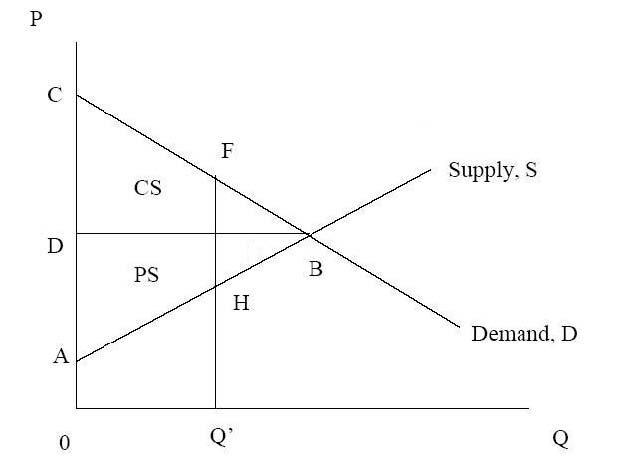

图 2－垄断和无谓损失

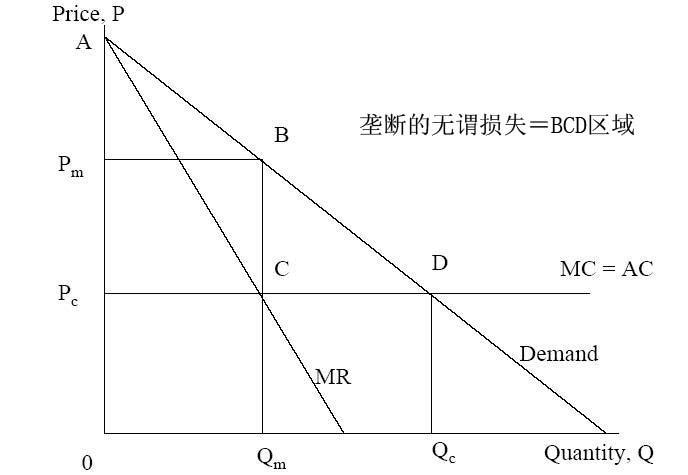

计算垄断和竞争的社会剩余 

- 需求函数，Q＝100－P 

- 边际成本和平均成本，MC=AC=20 

- 垄断均衡：Pm＝60美元，Qm＝40， 

- 竞争均衡：Pc＝20美元，Qc＝80， 

- 垄断条件下：－总剩余：A Pc CB＝2400美元－消费者剩余：A Pm B＝800美元；生产者剩余： PmPcCB＝1600美元 

- 竞争条件下：－总剩余：APcD＝3200美元－消费者剩余:A Pc D＝3200美元；生产者剩余：Pm Pc CB＝0美元

- 社会权重的作用 

- 社会决策通常不以生产者和消费者剩余之和的最大化为依据。 

- 不同的消费者群体和生产者群体（和政府）其社会权重不同。 

- 以对娱乐场所的规制为例，放松对娱乐场所的规制可能影响那些支付不了赌博的人，和那些能影响消费者剩余的富人。但另一方面，也有可能通过增加娱乐场所的收益率来提高生产者剩余。

图 3－自然垄断

自然垄断产业如何改善社会福利 

- 政府公有制，例如，USPS 

- 价格规制，例如，电力事业 

- 特许经营权，例如，有线电视 

- 引进竞争，例如，电话产业

- 其它存在无谓损失的市场结构类型 

- 买方垄断－市场中消费者数量唯一时，它是市场价格和购买数量的唯一决定者。 

- 寡头－是介于完全竞争和垄断之间的一种市场组织，市场中只有少数几个卖者，它们有一定的能力提高价格和降低产量。 

- 买方寡头垄断－市场上只有少数买者，促使降低产品价格和购买数量。 

- 与经济规制机构相比，反托拉斯机构更关注寡头和买方寡头垄断，以及它们对市场的观察与控制程度。

图 4－垄断竞争

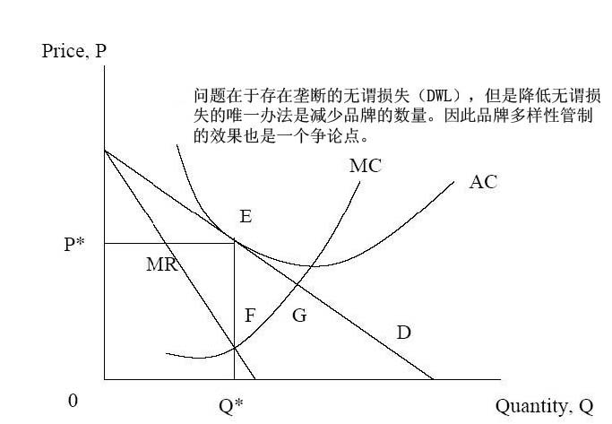

图 5－价格控制和价格支持

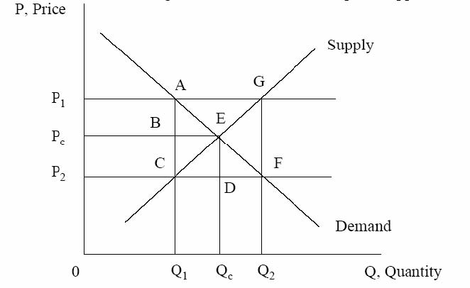

图 6－税收和补助

图 7－进口关税和配额

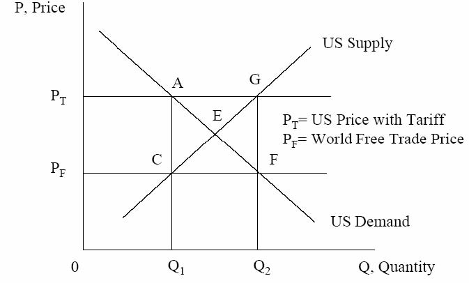

垄断的无谓损失 

1（P*-Pc）（Qc－Q*）＝ 1 ηd2P*Q* 

22 P*=实际价格 Q*＝实际数量 η＝需求的价格弹性 d＝价格和成本的差额 

- l哈伯格（1954年）使用产业收入和利润来估算价格和成本的差额 d 

- l并假设 η＝1 

- l得到 DWL仅占 GNP的 1％。

垄断的无谓损失 

P *1 )

### =η(=

P * -MC d 

将上式用哈伯格公式代替，得到： 

P * -MC

### DWL@ 1 ()P*Q*=1 (P*-MC)Q*=1 Ⅱ* 

2 P *2 2 

-  Cowling 和 Mueller（1978）。 

- l考察 1963－66年 724家美国企业的资料。 

- l估算 DWL占 GDP的 4％。 

- l如果包含“寻租”行为，则所占比例更高。

- X－无效率 

-  	X－无效率（勒伯斯坦 Leibestein，1966年），是指企业的生产成本没有实现最小化，导致企业内部资源配置效率降低，这种状态被称为 X-无效率。 

- 企业内部缺乏竞争和最小成本激励机制，就会导致 X－无效率。 

- 垄断企业更容易产生这种无效率。 

- 这就是为什么规制放松受到支持的原因，因为上升的 X－无效率高于垄断企业的长期静态成本效率。

- 技术进步 

- 熊彼特（Schumpeter）曾提出一个著名论断：垄断有利于创新，因为垄断竞争鼓励创新投资。 

- 研究和发展的支出采取不同的形式，包括不同的阶段：－基础和应用研究－发明－发展－扩散

图 8 技术变迁和竞争

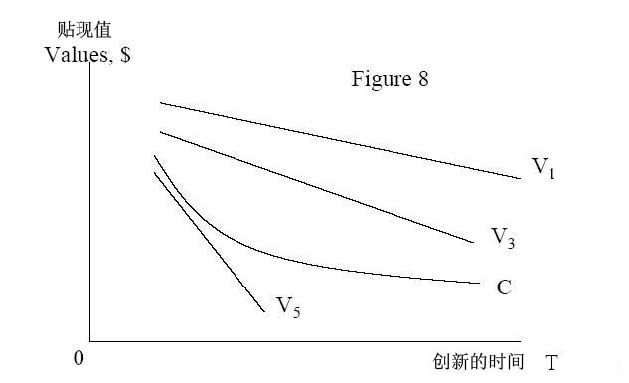

模型分析 

- 早期的高创新成本带来高收益。 

- 私人企业的创新收益与竞争者的数量是负相关的（V1到 V5），因为当市场上

- 的竞争者增多，会加剧对手之间模仿的速度和激烈程度。 

- 这也意味着，过多的竞争通过消除投资动机以完全遏制创新。 

- 因此规制的一个目标就是保持创新激励，和奖励创新者。

- 规制手段的创新 

- 专利权

-   企业（由政府授权）在有限的时期内，拥有某项发明的垄断使用权。短期内能增加生产者剩余。 

- 著作权

-  著作权的所有者在一段时期内，有权从知识产权的再生产中获利。短期内也同样能增加生产者剩余。 

- 短期内这些安排对消费者剩余的影响是不确定的。即使创新成本巨大，消费者也可能很快从更多的创新中获益。

- 结论 

- 无谓损失的存在使短期静态效率与垄断可能负相关。 

- 当垄断与更好的创新投资激励相联系时，技术进步从垄断中获益。 

- 规制需要包括社会对消费者剩余和生产者剩余之间最优权衡的决策，这两者是以明确的或不明确的社会权重为基础。

- 下一课 

- 复习《寡头和合谋》。 

- 阅读 VVH第五章（至 122页）。

# 14.23 政府的产业规制

## 第三课

### 麻省理工学院 &amp;剑桥大学提纲 

- 定义 

- 纳什均衡 

- 垄断和完全竞争 

- 两个卖者的寡头――双头与社会福利 

- 古诺，斯塔克尔伯格和伯川德寡头竞争（ Cournot，Stackelberg，Bertrand Oligopoly） 

- 合谋 

- 寡头是一个问题吗？ 

- 囚徒困境和博弈论

### 纳什均衡

在纳什均衡中，参与者 1和参与者 2分别选择策略 X和 Y。如果参与者 2选择策略 Y既定，那么参与者 1最好的选择是策略 X；如果参与者 1选择策略 X既定，那么参与者 2最好的选择是策略 Y。

### 垄断与完全竞争

考虑以下例子：市场需求函数：P＝25－Q 边际成本＝平均成本＝5 竞争结果： 

### 古诺模型 

- 考虑两家生产同样产品的企业,1和 2。 

- 两家企业同时做出产量决策，假设其它企业的产量不受本企业决策的影响。 

- 因此可推测的变动为零（例如，对企业 1，dq2/dq1＝0）。 

- 在观察其它企业所决定的产量后，每个企业没有改变产量的意愿，此时达到均衡。

### 古诺模型

价格函数，P=25-(q1＋q2); 总成本，C1=5q1；C2=5q2；

。/2）2q－20＝（1q）：reactionfunction数（

利润，Ⅱ1＝（25－q1－q2）q1－5q1区分 q1的利润函数，通过边际收益＝边际成本得到企业 1的反应或最佳反应函

同理，得到企业 2的反应函数：q2＝（20－q1）/2。

### 古诺模型 

-  	q1＝（20－q2）/2，q2＝（20－q1）/2 

-  	q1＝q2＝20/3 

-  	P=35/3 

-  	Ⅱ1=Ⅱ2=400/9;PS=800/9 

-  	CS=800/9 

-  	CS+PS=1600/9=177.78

图 1－古诺均衡

### 斯塔克尔伯格均衡 

- 企业 1是领导者；企业 2是追随者 

- 企业 1知道企业 2的反应函数 q2＝（20－q1）/2，并在此基础上做使自己利润最大化的决策 

- 企业 2是一个古诺参与者 

-  	q1＝10，q2＝5 

-  	p＝10 

-  Ⅱ1=50，Ⅱ2=25；PS＝75 

-  	CS=0.5(15*15)=112.5 

-  	CS+PS=187.5

图 2－斯塔克尔伯格均衡

### 伯川德模型 

- 考虑两家生产同样产品的企业，1和 2。 

- 两个企业同时做出价格决策，假设其它企业价格决定不受本企业产量决策的影响。 

- 因此价格的可推测变动为零（例如，对企业 1，dp2/dp1＝0）。 

- 在观察其它企业所决定的价格后，每个企业没有改变价格的意愿，此时达到均衡。 

- 价格＝边际成本（＝平均成本）。 

- 利润为零。

- 伯川德均衡 

- 企业 1和企业 2生产相似但不同质的产品，并进行价格竞争。 

- 需求函数：q1＝20－p1＋p2，q2＝20－p2＋p1 

- 假设 mc＝0 

- 价格反应函数：p1＝（20＋p2）/2，p2＝（20＋p1）/2 

-  	p1＝p2＝20，Ⅱ1=Ⅱ2=400 

- 如果企业 1是领导者，则 p1＝30，p2＝25 

-  	Ⅱ1=450，Ⅱ2=625 

- 此时，没有企业想成为领导者！

图 3－伯川德均衡

存在 N个企业的古诺模型 

-  	Q＝q1＋q2＋…＋qn 

- 对于企业 i，MR=MC Ⅱi＝P(Q)qi－C（qi） 

-  	F.O.C.: MCi＝P(Q)+ qiDp/d qi 

-  	si= qi/Q, 注意在古诺模型中，dP/dQ=dP/dqi 

- 重新安排后得到：（P-MCi）/P＝si/η 

- 注意这个均衡结果的特征！

- 古诺模型和合谋 

- 合谋包含一个非零可推测变动。 

- 包含企业间的协调，例如 dq2/dq1&gt;0 

- 产量的协调可能是一项协议（合作行为）的结果，或者是有限或无限重复（产量决定），或无理性承诺的结果。 

- 在最初的例子中，合谋的结果是， P=15,q1=q2=5,企业利润是 50。如果存在欺骗行为，将产生古诺竞争，企业利润降至 400/9＝44。如果当 qj=5，qi=20/3时，利润为 55。 

- 如果企业 1考虑单方面欺骗，然后计算是否这段时间的所得大于不合谋时的

实践中的合谋 

- 在实践中，合谋很难维持较长的时间。 

- 这是因为由于一些不确定性造成合谋均衡是不稳定的。这些不确定性包括新的进入，成本差别，多样均衡（multiple equilibria）。 

- 可持续合谋要求企业间的交流，明确的协调，和复杂的单方给付（sidepayments）。 

- 由于熊彼特效应（schumpeterian effect）的存在，我们不清楚默许合谋的大多数类型是否起作用。 

- 案例，1986年英国盐市场（white salt）。

图 4－寡头的标准式博弈

我们再次思考为什么（44，44）是纳什均衡，而（50，50）是合谋均衡？图 5－寡头的扩展式博弈

图 6－囚徒困境

（X,Y）: X＝囚徒 1的利益，Y=囚徒 2的利益。数值越高，对囚徒越有利。

解决囚徒困境

- 如果两个同时决策，则（5，5）是最可能的解决方法。这是理性策略（即纳什均衡）。 

- 但是对两个参与者来说，（10，10）的决策优于（5，5），即帕累托更优（pareto superior）。 

- 许多环境问题同样也面临着囚徒困境。 

- 通过社会惯例，法律和重复来解决这类问题。

- 结束语 

- 不同的市场类型是与不同水平的社会福利和无谓损失联系在一起的。 

- 古诺和伯川德模型优于垄断与合谋。 

- 根据假设其它企业的反应函数，在可控制范围内，寡头企业通过选择变量水平，进行博弈试图使自己的利润最大化。 

- 当垄断存在与可持续合谋可能时，经济规制就非常重要。

- 下一课 

- 复习《主导企业和进入障碍》。 

- 阅读 VVH第六章。

# 14.23政府的产业规制

## 第四课

麻省理工学院 &amp;剑桥大学提纲 

- 定义 

- 市场和市场集中度 

- 进入壁垒 

- 可竞争市场 

- 主导企业理论 

- 战略竞争和限制性定价 

- 进入阻碍 

- 品牌扩张

### 市场的定义 

- 市场的实际表现复杂，但定义简单。 

- 真实市场可以根据以下几点鉴别：－企业产品的物理特征－采用的技术/原材料－不同产品的需求交叉价格弹性－统计定义（SCI数字） 

• 	1999年，NAICS(北美工业分类系统)取代了 SCI（标准工业分类）编码名称 51信息 513广播和电信 5133电信 51332无线电信载体（除卫星） 513321内存分页（paging） 

- 案例，美国 Alcoa铝公司（铝锭）和 DuPont公司（玻璃纸包装）

- 市场集中度的测量 

- 集中率：CRx，或指 X个最大企业的市场份额－易测量 

- 赫芬达尔指数(Herfindahl index):H=Σsi2, si=第 i个企业的市场份额。－理想特征－数量相等特征 

- 赫芬达尔－赫尔希曼指数（Herfindahl Hirschman Index）：HHI＝Σ（100si）2－HHI＝Σ（100si）2＝10000Σ100si－美国司法部反托拉斯司使用 HHI指数来判定企业市场集中度－注意与 N个企业古诺模型的联系－（P-MCi）/P=si/η; Σsi[（P-MCi）/P]=HHI/10000* η－在反托拉斯案例中，HHI指数非常重要。

- 规模经济和进入壁垒 

- 为什么市场会变得集中？－规模经济和进入壁垒 

- 规模经济涉及长期平均成本曲线（LRAC），厂商和多厂商经济－通常会产生管理的不经济最终，并且持续。 

- e

- 在自由进入的条件下，有 N个企业，p（n ）代表每个企业的利润（不包括进入成本），K代表固定进入成本。－准入条件可以表示为： 

p (ne ) －K&gt;0&gt;p(ne +1) －K

r	r 

进入壁垒 

- 很难精确定义进入壁垒，因为它的产生归因于众多无恶意的、规制的、和策略方面的原因。 

- 贝恩（Bain）：根据结果定义进入壁垒－如果企业能获得超额利润，进入壁垒就存在。（和潜在的进入者相比，现有厂商所享有的有利条件，这些条件是通过现有厂商可持久地维持高于竞争水平的价格而没有导致新厂商的进入反映出来的） 

- 斯蒂格勒（Stigler）：进入壁垒是一种生产成本，这种成本是打算进入这一产业的新厂商必须承担而在位厂商无须承担的。 

- 冯威斯塞克/韦尔泽克（Von Weiszacker）：进入壁垒是，为了保护市场上已经存在的资源所有者，而对进入资源的社会性的不合意限制

- 可竞争市场理论（鲍莫尔等， 1982年） 

- 沉没成本是指企业离开市场时已经发生并且无法收回的固定成本。 

- 完全可竞争性（perfect contestability）？

- －假设条件为多产品厂商，最大自由的进入和退出，零沉没成本，数量调整快于价格调整。 

- 将可竞争市场理论称为“市场理论的一次革命”引起了理论界的争议。 

- 其它市场理论关注焦点在于企业的数量，可竞争市场理论关注焦点在于沉没成本的市场竞争。以美国航空业解除规制为例。

图 1－完全可竞争的自然垄断的价格和产量

如果在位厂商的价格高于平均成本 AC,它将被进入者所取代。

主导企业理论 

- 产业中只有一个厂商处于主导地位（例如，AT&amp;T公司）。 

- 具有较高成本的厂商面临从属竞争（competitive fringe）。 

- 主导厂商面临剩余市场需求。 

- 主导厂商的需求函数：Dd(P)=D(P)-S(P), Dd(P)为主导厂商的剩余需求函数， S(P)为从属厂商供给函数，D(P)为市场需求函数。 

- 问题：－从属厂商对主导厂商行为的约束程度有多大？－随着时间发展，主导厂商的优势是如何变化的？

图 2－主导厂商理论

主导厂商理论 

- 随着时间发展，主导企业的优势怎么变化？ 

- 在任何给定的时间： 

- 如果 P(t)&gt;cf，S(P(t))＝X(t)；如果 P(t) &lt;＝cf，则 S(P(t))＝0。 

-  	X(t)表示从属厂商在时间 t内的总生产能力，在时间 t内从属厂商能够生产的最大产量就是 X(t)；cf表示生产一个单位的产出所要求的单位可变成本和一个单位的生产能力，u（t）表示留存比率（retention ratio）。 

- 从属厂商将留存利益用于投资扩张新的生产能力，生产能力被假定为永远存在，每个单位的成本是 Z：

什么是主导厂商的价格策略？ 

- 近视定价（myopic pricing）：

- －选择一个使主导厂商现在利润最大化的价格。设定这样的价格能使企业获得大量的利润，但会迅速减少市场份额。罗纳德（Reynold）国际钢笔公司就是一个典型的例子。 

- 限制性定价（limiting pricing）：

- －为阻止从属厂商生产能力的扩张，主导厂商设定一个价格，在这个价格水平上，从属厂商的投资收益为零，称为限制价格，即 P=rZ＋cf 

- 最优定价（optimal pricing）：

－在近视价格和限制价格之间设定一个价格。在大多数的贴现率条件下，近视定价没有达到利润最大化（没有最大化现值），同样限制性定价也没有达到利润最大化。

限制性、近视和最优定价

战略竞争 

- 战略竞争是指某个厂商为了提高其未来在市场中的地位而采取的行动。 

- 战略竞争的形式－掠夺性定价－规制变化－广告和研发费用－专利 

- 掠夺性定价是指，在位厂商通过制定限制价格以减少进入者的进入后利润。

图 5－限制性定价理论贝恩（1956年），赛娄斯拉比（Sylos-Labini）（1962年） 

Pm＝垄断价格，P1＝进入阻碍限制价格，P2＝进入后价格

图 6－限制性定价是否可置信？进入障碍博弈

进入者先行动，然后在位者做出反应。设博弈收益为（X,Y），在位厂商的收益为 X，进入厂商的收益为 Y。这个博弈的纳什均衡解是进入，在位者面对新的进入者不采取行动，收益为

（1，1）。

可置信影响进入 

- 调整成本是指在位厂商因为进入后的影响而减少的产出，其函数表达式为： C(Qt)＝a＋bQt+0.5(Q-Qt-1)2 

- 学习曲线（learning curve）：表示生产厂商在未来通过大量生产以降低成本是可置信的。（表示一种商品的平均成本与生产者累积总产量之间的关系）。 

- 转换成本在厂商保持低价以吸引顾客时发挥作用。 

- 对额外生产能力的投资能降低产品的边际成本，得到更高的进入后产量。

- 迪克西特（ Dixit）进入阻碍模型 

- 迪克西特模型描述在位厂商如何降低边际成本，得到更多产量，和更多利润。（在生产能力范围内时，mc＝c，当超出生产能力时，mc＝c＋r） 

- 例子：－如果 P=10-(XI-XE);CI=6+rKI+cXI,CE＝6＋（r＋c）XE;K至少与 X相等，I表示在位厂商，E表示进入者，则得到：－在生产能力范围内时，XI＝（10―XE―c）/2（反应曲线 I）－当超出生产能力时，XI＝（10―XE―c－r）（对于进入者，同理）－为了简便，设 r＝1，c＝1，得到：

图 7－进入障碍

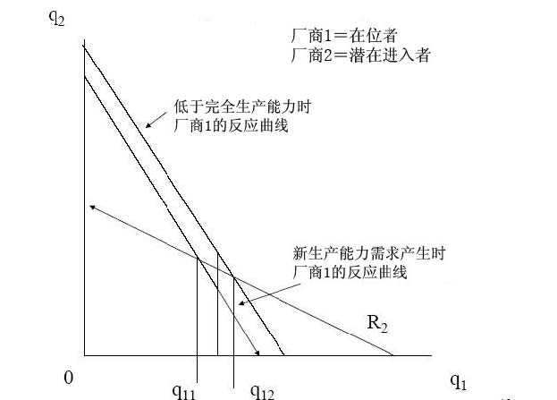

选择 q11和 q12之间的生产能力，可以阻止进入。图 8－战略进入障碍

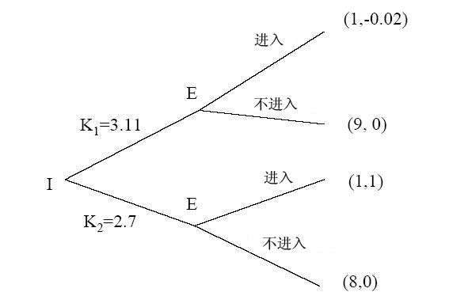

在位者在进入前选择一个生产能力水平，则意味着纳什均衡解为 K1,即不要进入。（VVH描述一个三阶段的博弈，我们这里简化了）

增加竞争对手的成本 

- 一个可行和可信的阻止进入的方法是采取行动来增加竞争对手的成本：－规制－联合－过去得到许可的权利（例如可交易废弃物许可证或飞机场起飞滑道） 

- 这些策略发挥作用，虽然对在位者意味着更高的成本，但是对竞争对手来说是不合比例的更高的成本。

- 优先购买权（ pre-emption）和品牌扩张 

- 如果市场上有两个可能替代的产品（X和 Y），则垄断者仅生产 X，节省固定成本。 

- 但如果顾客对 Y的需求上升，则进入是有利可图的。 

- 因为进入是有利的，在位厂商在进入之前可能会生产 Y，以阻止进入和维持 X的价格。 

- 从社会的角度来看，这种行为可能没有效率，我们也会面对过多的品牌（当然竞争也会造成这种结果）。 

- 案例，谷类早餐和化肥。

- 结束语 

- 进入壁垒会阻止新企业进入市场，尤其是在产业具有高沉没成本的情况下。 

- 主导企业可能受到具有高成本的企业从属竞争的严格约束，因此就可能不会产生规制问题，例如，AT+T案例。 

- 如果在位厂商想战略性的阻止进入，那么他们的行动必须是可置信的。战略进入阻碍的形式有很多种。 

- 这些进入阻碍战略通常不会导致社会有效福利，因为在社会最优水平之上进入者将承担固定成本。 

- 高进入壁垒，竞争的缺乏，不经济的战略行为都为经济规制提供了理论基础。

- 下一课 

- 经济规制的介绍 

- 阅读 VVH第十章。

# 14.23政府的产业规制

### 第五课

### 麻省理工学院 &amp;剑桥大学提纲 

- 规制手段 

- 美国的规制简史 

- 规制过程概述 

- 规制理论 

- 自然垄断理论 

- 垄断定价 

- 结论

### 规制 

- 一种定义： 

- ‘政府对个人或组织行为的强行限制。’ 

- 例如，最低工资标准，污染目标，和信息要求。

### 规制手段 

- 控制价格－目的是为了防止掠夺性定价和高额收费。 

- 控制数量－全体服务职责，最高产量限制 

- 控制进入－例如，长途电信，纽约市出租车 

- 控制质量－例如，关于废弃物，消费者服务水平，安全等等的质量。

### 规制简史 

- 宗教领袖限制信用价格，讨论“公正价格”（例如，阿奎奈） 

- 近代经济规制始于 1870年对水和天然气的费率规制。 

- 在美国的案例中，法律扩大了规制行动的范围。

### 规制简史 

- 马恩对伊利诺伊州诉讼案（1877年）－1871年伊利诺伊州设定粮仓价格的上限－马恩和斯科特宣称，法律没有经过正当的程序剥夺了他们的私人财产。（第

-  	1887年州际商业法案－铁路遭受了周期性的高价格战。－为规制铁路价格，法案批准成立州际商业委员会（ICC）。

### 规制简史 

- 内伯亚对纽约州案（1934年）－纽约市对牛奶价格进行规制－内伯亚因廉价出售牛奶而被起诉。－被告认为：1.牛奶市场是竞争市场， 

2.牛奶业不是公用事业（not a utility）， 

- 马萨诸塞州从 1885年开始对公用事业进行规制，但直到 1930年绝大多数州才成立了公共服务委员会（Public Service Commission）。

### 规制发展 

- 规制立法的三次高峰：1909－1916年，1933－1940年，1973－1980年。 

-  	20世纪 30年代：－ICC的规制范围扩展到卡车，驳船，石油管道和载客公共汽车运输。－1934年成立了联邦通信委员会（FCC）。（规制广播行业）－1935年成立了联邦能源委员会（Federal Power Commission）（州之间的电

- 受到完全规制地行业其生产总值稳定增长，1977年占美国 GNP的 17%。

### 公有制 

- 在许多案例中，采取公有制是为了更好的规制产业。世界范围内许多国家都采取了公有制。 

- 英国大规模的国有化：－电信（1912年）－英格兰银行（1946年）－铁路（1948年）－电力（1948年） 

- 与私人部门相比，公有制能更好的规制价格和服务。

规制放松

- 世界范围的规制放松浪潮开始于 20世纪 70年代末。 

- 美国放松对以下行业的规制：航空业，铁路，公路运输，载客公共汽车，长途电话，能源批发。 

- 在欧洲，铁路，电信，电力，天然气，邮政服务和航空运输这些行业都服从于国家和欧盟广泛的立法变化。 

- 在美国，1988年受到完全规制地行业其生产总值仅占 GNP的 6.6%(1977占 17%)。 

-  	1979年到 1997年，英国 GNP的 10%从公有企业转移到私有企业（通常是指竞争性的行业）。

### 规制过程概述 

- 立法（例如，1935年联邦能源提案）：－明确规制机构－明确规制机构的权力－明确政策目标 

例如，向顾客提供合理和公正的服务。 

- 实施：－联邦规制委员会通常由五个成员组成，他们是专家或者政治盟友。－委员会是独立的，委员可以因为某些原因离职，但不能随意离职。他们举

### 规制过程概述 

- 规制委员会的三种成员：－职业人员（希望机构能够持续存在和发展）－政治家（希望当选或被任命新的职位而离开机构）－专业人士（具有某些特定技能可能会从事其它职业）－以价格立法为例，专业人士希望采用具有明显理论特征的复杂价格体系，

- 职业人员则支持一个简单价格体系以避免问题，而政治家倾向于不激怒利益集团。 

- 其它参与者包括：－消费者集团－希望更低的价格－在位厂商－希望稳定的高额利润－竞争者－希望自由化程度更高的市场

- 规制理论 

- 对实证理论或公共利益理论的规范分析－在某些市场，不受限制的竞争并非就运作良好。例如，自然垄断行业，或

遭遇外部性问题。－在自然垄断行业，只有一家企业，且 p＝mc时，生产效率达到最优，但是

规制理论 

•	俘获理论（斯蒂格勒）－应产业对规制的需求，产生规制供给。－规制机构由被俘获的立法机构创立。－规制机构由受规制的产业所控制。－这就是规制的亲生产者理论，例如亲生产者剩余理论。

似乎大多数规制由以上两种理论结合起来推动。

规制理论 

•	经济规制理论－斯蒂格勒－佩尔斯曼模型预测： 

- 规制立法重新分配财富。 

- 立法者的行为受希望继续留任的动机驱使。 

- 利益集团通过提供政治支持来获取有利的立法倾斜。 

- 以电力费率为例：在居民，商业和产业能源费率当中，产业相对

•	仅关注利益集团的角色，假设他们相互竞争以获得更多影响力。

佩尔斯曼模型

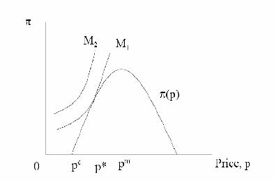

贝克尔模型

规制成本的增加提高集团 2施加的影响力，减少集团 1的。这是因为成本的增加意味着集团 2遭受比集团 1获得任何给定的财富转移更大的损失，因此集团 2愿意施加更多影响力的动机比集团 1强烈。

经济规制理论的结论 

- 规制具有帮助对其有强烈偏好的相对较小利益集团牟利的趋势。 

- 亲生产者趋势受到消费者集团的约束意味着价格低于垄断水平。 

- 规制最有可能发生在竞争或垄断产业，这些行业有强烈的动机去游说实行规制。 

- 市场失灵使得规制更有可能存在，因为一些利益集团遭受巨大的损失。

- 经济规制理论能解释规制放松吗？ 

- 部分原因：－考虑以下因素： 

- 新技术的作用 

- 需求增长 

- l无效率和预算赤字

- 但是公共利益理论的作用也非常重要。撒切尔夫人的行为在经济学上是理性的吗？ 

- 当丢失所有的洞察力时，应慎重运用人类行为的非歪曲经济理论。

- 一个产业是否真正是自然垄断行业？

- l线性定价（linear pricing） 

- l两段式价格（two-part tariff） 

- l列伯和麦加特（Loeb and Magat）建议 

- l特许经营权竞标，以有线电视为例 

- l拉姆齐（Ramsey）定价，以电话服务为例 

- l公有企业，以 MBTA为例

解决自然垄断定价问题 

自然垄断？

自然垄断拥有劣加的成本函数。

线性定价

两段定价和拉姆齐定价 

- 两段定价：固定费用加每单位价格。 

- 单位价格可能等于边际成本。 

- 存在的问题：如果实行两段定价，则一些消费者可能被逐出市场。 

- 解决方案：通过制定不同的固定价格以交叉补贴支付意愿低的消费者。 

- 多产品垄断者通过提高价格来弥补成本，但会产生无谓损失。拉姆齐定价能使无谓损失最小化。其数学表达式为：（P-MC）/P=a /需求的价格弹性，a是常数。

- 下一课 

- 公有企业 

- 阅读 VVH第十四章。

# 14.23政府的产业规制

### 第六课

麻省理工学院 &amp;剑桥大学提纲 

- 公有企业的历史 

- 私有企业和公有企业理论 

- 管理主义：更好或更坏的结果？ 

- 不同所有制下的价格 

- 公有制的生产效率 

- 私有化：理论和证据 

- 结论

- 公有制的历史 

- 罗马人的水和武器这两个产业都采用公有制。 

- 在以下美国产业中公有制所占的行业比例：－电力（20%,2000家企业）和天然气－水（80%）－地方交通：公共汽车，地铁，往返铁路。－铁路－公路－机场 

- 在二战后的欧洲国家，电信、电力和其它产业的企业大多数实行公有制。

- 采用公有制的理由 

- 达到重新分配的目标 

- 确保充足的投资 

- 防止垄断的产生 

- 促进合作 

- 保证安全 

- 降低金融成本（如规制成本） 

- 获得更大的宏观经济稳定

- 采用私有制的理由 

- 市场有利于财产权的分配（财产权理论，阿尔钦和德姆塞茨 [Alchian and Demsetz]，1965年）。 

- 行政机构不利于企业的运行（公共选择理论，尼斯卡兰[Niskanen]，1968年）。 

- 对私有企业的明确规制比监督公有企业更有效率（规制理论，拜伦和梅尔松 [Baron and Myerson]，1982年） 

- 私有制减少影响活动和利益集团的势力（影响成本理论，米尔格罗姆和罗伯茨[Milgrom and Roberts]，1990年）。 

- 私有制增加了扰乱政府干涉的成本（承诺理论[commitment theory]，博克 [Boycko]等，1996年）。

组织选择

（帕克和哈特利 [Parker&amp;Hartley]，1991年） 

- 合作 

- 中央政府所有制（大规模） 

- 市政所有制（小规模） 

- 政府部门 

- 半政府机构（quasi－government） 

- 公共公司 

- 全民所有公共有限公司（plc） 

- 公共有限公司（plc）

- 公有和私有企业的激励机制 

- 是否能激励效用管理者提供社会最优服务? 

- 如果通过签订合约以奖励管理者提供这种服务，答案是能。 

- 在传统的私有企业里，激励机制通过使利润与绩效正相关，管理激励－工作任期，提升和工资－与企业利润相关联，来发挥作用。 

- 在一个垄断公共服务企业里，如果确立明确的合约奖励（惩罚）企业提供社会最优服务，管理者就会使自己的激励机制与此一致。

- 公有和私有企业的激励机制 

- 私人垄断行业的问题在于企业和社会之间的合约签订是困难的。 

- 公共垄断行业的问题在于激励管理者也是困难的。 

- 当不能写入合约的性质很重要时，采用公有制的理由更强烈。（例如，安全，国家安全）（哈特，施莱佛和韦斯尼[Hart，Shleifer and Vishny]，1997年）。 

- 当声誉效应和对管理者的政治监测都很微弱时，采用私有制的理由更强烈。（例如，一个国有电信公司）

- 美国的公有制（格兰泽， 2001年）* 

- 在合约和监测都困难的特殊地方垄断行业中，实行公有制可能更有利。 

- 有利的原因可能是私有企业有少支付输入，多得到输出，滥用外部性的补贴，贿赂政治家的动机。 

- 一个很好的例子就是地方交通。一个私人供给者会通过游说，获得自由路线权，要求高的定价和无利益线路的补贴。 

- 供应品市政化可使腐败程度降低。

http://post.economics.harvard.edu/hier/2001papers/HIER1930.pdf

二战政府采用公有制的理由（格兰泽， 2001年） 

- 政府控制薪水，防止工资的暴涨。－这在政府是最终产品的大购买者时很重要（应用于健康保健和教育行业）。 

- 政府不能将签订合约和所有制分离。－由于缺乏应对战时特殊环境的经历而产生的。 

- 不可预测需求意味着与私有企业重新谈判的成本昂贵。－通常这是一件好事，因为减少了政治干涉。

- 公有制和私有制 

- 很大程度上，这是一个关于情形的经验主义问题。这些情形中，质量很重要，公有企业的监测力度大。 

- 采用公有制重新分配消费者剩余和生产者剩余：－作为福利政策一部分，税收和低利率贷款可能支持低价格（例如，公共运

- 输）。

- 但是问题仍然存在：公用事业能制定更低的价格？以什么成本？

不同所有制形式条件下的电力价格， 2000年

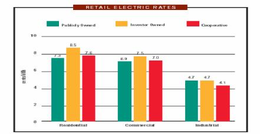

来源：APPA，2002 

价格歧视 

- l佩尔斯曼 Peltzman（1971年）提出私有企业具有更强烈的动机进行价格歧视。 

- l当更低的价格和更低的垄断无谓损失可能互相联系时，更低水平的价格歧视

- 与更高的无谓损失互相联系。 

- 公有企业较少实行价格歧视的原因在于简单费率结构在政治上受欢迎。

- 生产效率 

- 大部分研究关注公有公用事业和私有公用事业的成本：－电力（混合）－水（私有更有效率）－健康保险和医院－垃圾收集（混合）－铁路－航空业（私有更有效率）－银行（私有更有效率） 

- 很难预先比较这两种的区别，因为规制的差别和竞争的缺乏。 

- 规制放松同时改变了所有制、规制和竞争。

- 世界范围的私有化进程 

- 政治基本原理：－减少政府与企业的联系－提高效率－降低公共企业借款的要求－控制贸易联盟势力（trade union power）－创立广泛的股份所有制（share ownership）－获得政治优势

图 1：政府脱离的年私有化收益，1988－2000 

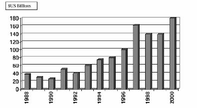

来源：Megginson and Netter，Journal of Economic Literature，2001 

国际私有化的绩效效果

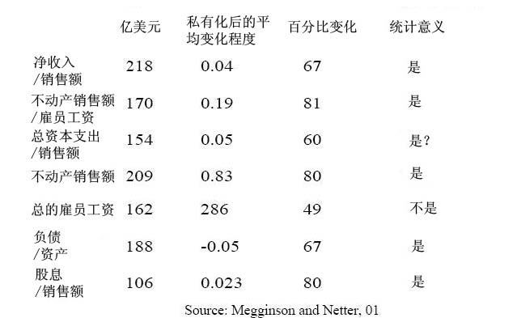

英格兰和威尔士（ E&amp;W）电力产业私有化 

-  	1948年前实行混合所有制，1948年后实行国营

- －由英国中央电力局管理（ GEGB）（发电和输送），12个区域董事会（分配和零售）。 

-  	1990年重组

- －3个发电公司（国家电力国际公司，国家发电公司，和国家核电公司）

-  	RECs于 1990年采用私有制。 

- 化石燃料发电公司（gencos）1991年实行私有化。 

- 新的核电站于 1996年采用私有制。 

- E&amp;W电力产业：规制 

- 这两家主要的发电公司对电力库进行博弈。 

- 市场上 6家主要发电公司和独立发电厂（IPPs）中，解散了两家在位厂商。 

- 配电和输电价格限制受到规制。 

- 市场成功的实现自由化：－1990年，消费大于 1MW的用户可以自由选择发电单位购电－1994年，消费大于 100KW的用户也拥有了选择权

- －1998至 99年，以上限制取消 

- 英国在影响和遵守 1997年欧盟电力指示方面处于领先地位。 

- E&amp;W电力产业：私有化的绩效 

-  	ΔPS：巨大的利润初始增长 

-  	ΔWages：劳动生产力增长超过 100% 

-  	ΔG：政府的税收和资产出售所得 

-  	ΔW：所有因素生产力增长 

- 竞争者进入市场 

- 企业扩张到海外 

- SO2和 CO2的排放大幅度降低 

RECs私有化的利润分配 

Domah and Pollitt（2001）

发展中国家的公有制 

- 公有制对发展中国家可能是个好主意：－如果存在高的期权价值需要私有化（例如，东欧国家的产业）。－如果受规制的产业其生产能力低下。－如果私人资本市场发展不完全。－如果私有化扩大了腐败的范围。 

- 但是迅速的私有化有利于获得国外和国内私有企业所有者的新投资和新技术。

‘最后，重要的是在私有制下所有制和规制的结合如何与公有制下所有制和规制（隐性的或显性的）结合进行竞争。’

维克和雅罗（1991年）

下一课 

- l自然垄断规制 

- l阅读 VVH第 11.12章。

# 14.23政府的产业规制

### 第七课

麻省理工学院 &amp;剑桥大学提纲 

- 多产品垄断厂商 

- 规制实践－电力事业 

- 规制费率水平 

- 费率结构 

- 高峰负荷定价 

- 电力市场放松规制

自然垄断 

- 当 C( l Q)&lt;l C(Q)时，产出的规模经济和范围经济相互作用。 

- 规模经济与范围不经济结合可能使多产品垄断无效率。 

- 同样的，当 C(Q1,Q2) &lt;C(Q1)+C(Q2)时,范围经济伴随规模不经济也可能使多产品垄断无效率。 

- 因此，范围经济的证据表明电力产业输电和发电的整合（传统的电力事业是垄断产业）可能不合理。

规制实践 

- 电力公司改变费率（或受规制的费率结构）要得到规制制定者的批准。 

- 如果电力公司想提高费率（理由是成本的增加，例如，由于通货膨胀），要在州公共事业委员会（PUC）举行费率听证会。 

- 如果回报率过高，则消费者和委员会可能举行听证会来决定降低费率（由于成本的下降，效率提高等）。 

- 联邦能源规制委员会（FERC）参与规制州际输电和制定国家政策。

公正合理的费率 

- 许可的收益（R）＝费用（E）＋公正的回报率。 

- 公正回报=许可的资本成本（S）* 规制的资产基础（或基础费用）（ RB） 

- 两个问题：－费率水平（也就是许可的收益）－费率结构（例如，允许达到费用水平的价格歧视）

费率水平 

-  	R=E+s*RB 

-  	E：公司呈报受规制交易的详细财务报表。

- 有时候，过多的费用不被允许。例如，CA核电站，仅仅 20%的成本是允许的（公司本来可以采用花费较少的其它技术）。 

-  	RB：通常指初始的资本成本。 

-  	S：在费率听证会和先例中确立。（10.5%）

基础费用 

- 运用不同的方法计算基础费用是可能的： 

- 初始成本，因为当前成本不能反映长期边际成本（ LRMC）,在通货膨胀时期评估初始成本存在疑问，这将会激过度消费。 

- 替代成本：当前相等的资产价值。 

- 公正价值成本：以上成本的加权价值。 

- 市场价值：反映了过去的规制决定，和产者希望设定上升的费率。

回报率 

-  	WACC＝加权平均资本成本（普通股+平均债券成本） 

- 我们可以观察到债券的收益率，但是普通股的收益率=? 

- 股票的价格（P）反映了股息流的净现值（NPV），利息（r）是股权资本的成本。 

- 如果在一段时间内股息以某比率增加，得到： 

D(1

1

(+ 1 r +) r 2) ＋… 

D1

P= 

r -g 

r＝ D1 +g 

P 

回报率规制的问题（ RoR） 

- 风险原因不清楚，有过度投资和不追求成本降低的动机。 

- 实践中，如果公司想提高价格，通常会提出费率诉讼，因此产生规制时滞。 

- 无效率存在：－产量无效率－输入选择无效率－输入数量的 X－无效率－公用事业生产力增长的加班费低 

- 但是，赞同更好的激励规制的激励类型是不明确的。

- 阿弗奇－约翰逊（ A-J）效应 

-  	1962年，阿弗奇和约翰逊指出收益率规制（ RoR）刺激厂商投入过多的资本。 

- 厂商选择一定数量的资本，K, Q=f（K） 

-  	R（q）＝R（f(K)） 

- 成本＝rk，其它支出＝0 

- 利润＝R（f（K））－rK 

- 实行收益率规制：II=(s-r)K 

A-J效应 

RoR的选择 

- 浮动回报率方法（sliding scale plan），允许在消费者和所有者之间分担风险和分享报酬。 

-  	r*,目标收益率 

-  	rt，初始价格收益 

-  	ra，实际收益率 

- 当 h在[0，1]取值时，ra＝rt＋（r*－rt） 

-  	h＝1时实行收益率规制，h＝0时实行固定价格规制 

-  	0&lt; h &lt;1时，包含风险分担。

- 标尺规制（yardstick regulation）（施莱佛 Shleifer，1985年）－制定的价格等于同类可比较公用事业的平均成本。－问题在于很难寻找这类公用事业，例如，地方配电公司。 

- 价格上限（price cap）规制－CPI-X公式(CPI消费价格指数，X生产率或效率因子)，企业根据通货膨胀

收益率规制的选择

率减去一定的生产能力调整来提高价格－通常在一段时间内公式是不变的（规制时滞）－设置 X时通常包含一定的评估未来生产力收益范围的成本基准形式。

价格上限和回报率规制的证据 

- 与传统回报率规制方案相比，价格上限似乎能鼓励更快的成本下降速度。 

- 欧洲、南美和澳大利亚的规制者通常选择价格上限规制，使成本急剧下降。 

- 许多美国规制者（包括马萨诸塞州）认可价格上限规制的优越性，鼓励公司采用以费率确定制度为基础的绩效标准或者在费率回顾时采取简单价格上限方法。 

- 但是过去的几年中，由于通货膨胀率低，电力公司很少提出升高费率的费用诉讼。

- 费率结构 

- 在不同阶层的消费者集团和产品中的价格应该怎样变化。 

- 这是一个关于垄断固定成本应该补偿的基本问题。 

- 运用完全的分配成本定价法（FDC）。 

- 例如： 

-  	CX＝700＋20X,CY=600+20Y,CXY=1050+20X+20Y 

- 共同产品更可取。固定成本应如何分配？ 

- 拉姆齐定价是合意的。

- 费率结构 

- 成本分配比例为 75：25，即把成本的 75%分配给产品 x和 25%分配给产品 y。因此，FDC平均成本是： 

ACX= (1050*0.75)＋20； ACY= (1050*0.25)＋20 

x	y 

- 在每个市场，PX=100-x,PY=60-0.5y,P=AC 

-  	PX＝31.5，x＝68.5，PY＝23.6，y＝72.8 

- 但是拉姆齐价格（效益价格）为，x＝y＝70，PX＝30，PY＝25（通过对等产出和打成平手来解决）。 

- 确定每单位价格为 20，确定的固定费用正好补偿固定成本时，两段式定价是

可行的。

费率结构 

- 非法歧视是指一个集团补助另一个集团的行为。 

- 凸显单一平均成本（SAAC）检验：分别计算产品 x或 y的平均成本，每种产品价格应低于平均成本，否则消费者将不会选择这种产品（免补助检验）。 

- 平均增量成本(AIC)检验：产品 x和 y合并生产的成本减去只生产产品 y的成本即 x的增量成本。x的价格必须高于或等于这个成本（与 SAAC一样）。

- 高峰负荷定价 

- 电力储存成本高，需求根据时,日,季节变化。周期之间的成本是相互独立的。 

- 有效的解决方法是实施高峰负荷定价（ 19世纪 40年代，法国国家电力公司（ EdF）首先提出）。 

- 但是仅在 1978年，国会才要求公共事业委员会（PUCs）支持高峰负荷定价。

高峰负荷定价：移动高峰是否实行规制的区别？ 

- 一段时间内很难检验有无规制的区别，但是在 20世纪 20年代证据显示实行规制的美国各州电力费率明显低于没有规制的州。 

-  	20世纪 70年代，证据显示规制费率明显低于垄断水平（低 30%）。 

- 德姆塞茨（1968年）认为规制没有必要，因为电力事业预先进行拍卖形成垄断（例如，类似国防合同）。这使随后的价格规制没有必要。

- 放松电力市场规制 

- 保罗杰斯科（Paul Joskow，1997年）指出美国电力价格最高的那些州放松规制的意愿最强烈（例如加利福利亚州，和马萨诸塞州）。 

- 如果未来利润的净现值（NPV）能被保证，这些公司将同意放松规制。向竞争性发电的过渡揭露了过去的低回报投资（bad investment）和所谓的搁浅成本（stranded costs），如果竞争性发电市场上价格下降以上两项将无法弥补。但可以通过竞争过渡期要价（competitive transition charges）来补偿。 

- 通过一个保证不刺激消费者转向竞争厂商的机制，这些费用在某个时刻从居民那里得到补偿。 

- 在马萨诸塞州，竞争过渡期要价制度持续到 2004年。 

- 从 1998年开始实行竞争过渡期要价后，在马萨诸塞州仅有 3%居民消费者改变了供电商。但在英国可比较的数据是 30%。 

MA电力市场解除规制后居民帐单样本

结论 

- 电力输送和电力分配继续实行经济规制（和电力费用及测量）。 

- 美国许多州都已经放松对发电市场的规制，但是至今并没使居民消费者电费降低。 

- 价格上限规制在理论上和经验上优于传统回报率规制。 

- 固定成本其经济上的有效补偿通常包括不同消费者之间‘不公正’的支付分配。因为这个原因有效定价结构难于执行。

- 下一课 

- 特许经营权竞标 

- 阅读 VVH第十三章。

# 14.23政府的产业规制

### 第八课：特许经营权竞标和有线电视

麻省理工学院 &amp;剑桥大学提纲 

- 为什么规制公用事业？ 

- 特许经营权的优点 

- 契约问题 

- 有线电视 

- 规制，放松规制，重新规制 

- 其它特许经营权案例

- 为什么规制公用事业？ 

- 哈罗德德姆塞茨（Harold Demsetz）1968年提出了这个问题（来自于埃德温·查德威克 Edwin Chadwick1859年提出的一个想法）。 

- 即使某个领域实际上仅有一家企业生产商品或提供服务，为什么这个领域不能有竞争？ 

- 典型案例是国防产业，在这个产业中坦克或飞机的设计仅有一个被采用。这是否意味着国防部将支付垄断价格？ 

- 解决方法是修正的英式拍卖，垄断特许经营权给予在拍卖中提供最低成本的竞标者。

- 线性定价过程 

- 拍卖商最后宣布的标价即提供垄断服务的价格。 

- 确定对这个价格做出反应的积极投标者人数。 

- 如果人数&gt;1，拍卖商宣布一个更低的价格。 

- 继续这个过程直到只剩一个投标者，中标者将以这个价格向公众提供服务。

实际上什么发生了？

下图显示了三个投标者和他们的平均成本曲线。假设他们没有合谋以何种价格提供服务给大众，那么这个竞标价格是否能达到社会最优？

竞标过程的结果 

- 正面结果：－具有最低平均成本的企业胜出。－不存在过度投资的问题。－对规制者没有信息要求。 

- 负面结果：－价格高于最低成本，缺乏竞争。－合同签订后，低价格可能导致低质量。－两段式定价更有效率。

两段式定价

其它因素 

- 质量－如果产品是同质的则不存在质量问题，但实际上却不如此。－如果成本和质量负相关，则存在质量问题。－政府需要明确规定和执行质量标准。 

- 寻租行为－多方面竞标意味着拍卖商很难计算最佳标价（例如，频谱拍卖的价格）。－这种情况下投标者可能选择联合，这将会引起规制者的最大注意，然后使

社会福利达不到最大化－这就是寻租行为。

其它因素 

•	契约安排（威廉姆森 Willianmson，1975年和 1976年）：

－随着时间，当技术或需求发生根本改变时，会发生什么？或者成本出乎意料的上升时（例如，因为安全成本的增加），会发生什么？有限理性限制了签订完全合同的能力。

－周期性合同会逐渐增加能以 P=AVC这个价格竞标的在位厂商的优势，排除更有效率的进入者。如果把在位厂商的资产强制转移给新的厂商，就可以解决这个问题，但是定价仍很困难。而且在位厂商可以过高标价将资产转移给对手，由此产生敲竹杠（hold-up）问题（这体现了进入壁垒）。

－可以使用不完全的长期合同（15－20年）代替周期性合同，但是很难监测特许经营厂商，也会增加厂商的不确定性成本。－在合同签订过程的成本很高，和政府重订合同过程令人为难的情况下，机会主义总是存在。

美国有线电视 

- 特许经营权竞标的典型案例。 

-  	20世纪 40年代：运用电缆来改善地方广播电视服务的信号接收。 

-  	20世纪 50－60年代：运用微波技术引进其它地区的服务来扩大有线电视的服务范围。与地方广播电视进行竞争。 

- 有线电视与以下相近替代品进行竞争：例如，碟形卫星天线（satellite dishes），录像机等。 

-  	1934年：美国通信委员会（FCC）成立，被赋予有线和无线（包括电视）的管辖权。 

-  	FCC基于有线电视只是地方广播电视服务的补充（改善信号的接收）的理由，拒绝规制有线电视。 

-  	20世纪 50年代,因为广播电视产业与有线电视进行竞争，所以希望有线电视象它们一样受到规制。 

-  	1962年：禁止长途广播电视信号通过电缆输入到地方电视台传输相同信号的市场。

- 美国有线电视 

-  	1966年：有线电视受到完全规制：要求有线电视传输所有地方电视台的节目，但是禁止输入排名前 100的电视市场的其它信号。 

-  	1972年：解除对信号输入的冻结，但仍制定一堆规则限制信号输入。 

-  	1975年：Satcom1号卫星的发射为有线电视提供便宜的长距离信号输送，使有线电视服务大幅度增加。20世纪 70年代后期，HBO（华纳旗下的付费电视网）赢得诉讼，允许有线电视系统与地方广播电视进行竞争。 FCC放松了限制。 

- 结果：

－1971年：&lt;33%家庭享受有线电视服务；只有 6%的有线电视系统拥有 12

个以上的频道。－1980年：50%的有线电视系统都拥有了 12个以上的频道。－1992年：96%的家庭享受有线电视服务；90%的有线电视系统拥有了 12

个以上的频道。

有线电视是自然垄断行业？ 

•	必备技术：

－头端（headend）：天线接收来自微波中继站或卫星的信号，然后进行处理。－发送设备（distribution plant）：使用架设在街上的同轴电缆将信号传送给

•	规模经济分成密度经济和距离经济：－密度经济具有重要意义：随着市场渗透（订购家庭数/接入有线电视家庭数）从 40%增加到 80%,平均成本从 14美元下降到 8美元。

－距离经济影响甚微：在市场渗透不变的条件下，有线电视电缆经过的家庭数量增加 10%，单位平均成本下降仅 0.2%。

有线电视是自然垄断行业？ 

- 在地方地理区域内，而不是在宽广区域内，就是自然垄断。 

- 形成地方垄断更有优势，因为不会提供重叠服务。 

- 但是非重叠的多系统成本优势不显著。 

- 多系统的其它可能优势：更多的潜在竞标者，更多的资本市场竞争和改善的实例监测（基准）。

- 地方政府宣布将拍卖特许经营权。－递交提案。－地方政府与潜在经营商谈判（增加成本）。－地方政府通知选定的申请商提交标价。－有线电视公司提交标价。－地方政府将特许经营权授予中标的公司（大约 15年）/重新要求新标价。 

- 竞标过程需要 2－10年（有些高达 20年！）。 

- 问题：－不能选择频道、价格、融资方式，并且免费为学校、地方电台和政府提供频道。－投标的竞争性。每个案例的平均竞标者为 5个，但实际上更少。五家最大

特许经营权竞标程序

的有线电视公司控制了全国 50%的有线电视市场，因此可能产生合谋。－事后通常重新谈判特许经营权合约。－几乎没有特许经营者放开特许权（7/3516）：好或坏？ 

1986年放松规制的试验 

-  	1986年有线通信政策法令。－禁止费率规制－继续实行特许经营权，没有额外的进入许可，重申请更容易。 

-  	1986－1991年费率价格急剧上升－虽然价格上升了，但是频道数目增加了 30%. －DOJ估计价格调整后质量提高了 18－23%。－这样分析的方法正确吗？ 

-  	1992年的有线电视消费者保护法令重新引入规制。－FCC要求费率减少 10－17%。

有线电视价格和规制

现状 

-  	1996年美国电信法案（telecommunications act）保留了对基本有线电视节目和设备的规制，直到有线电视的经营者面对‘有效竞争’。 

- 有效竞争：－如果满足以下条件

- （1）低于 30%家庭订购有线电视服务

- （2）或者有两家有线电视公司提供 50%的服务，或者有更多的家庭订购服务，其中 15%的家庭订购规模较小的有线电视公司的服务

- （3）或者一家地方性公司向至少 50%的家庭提供服务

- （4）或者一家电话公司提供录像节目服务。

- 基本服务规制（收费频道不受规制）基于以下理由：

－通货膨胀，频道数目，节目成本，版权费，特许权成本，非许可证经营必需的升级。

有线电视竞争

竞争部门只有 6%的有线电视用户。有线线路重复建设＝重叠的有线电视网络 DBS＝直接广播卫星网络与有线电视网络重叠 LEC＝电话公司竞争者

其它特许经营权竞标案例 

- 电视许可证（英国独立电视台的十年陆地电视许可证特许经营权）。 

- 铁路（伦敦地铁有限公司？）和频谱特许经营权。 

- 私人金融项目通常包含授予合同(award a contract)这样一个特许经营权步骤，来提供由政府支付的某种产品或服务：－地方政府的垃圾收集。－记录的 IT管理（NIRS－国民保险录音系统）－征收过路过桥费用。－医院。－监狱。

- 案例研究：英国国民保险录音系统 NIRS－2 

- 欧洲最大的政府 IT工程。 

-  	1997年，合同的签订意味着计算机管理的国民录音系统被 NIRS-2取代了。 

- 合同：7年内提供 15笔交易。 

- 如果合同授予给私人公司，将产生自然垄断问题。 

-  	7年后补偿未能签订合同的损失。？ 

- 安达信咨询公司（Andersen Consulting）胜出：出价\$72m美元(对手出价$200m美元)（公有企业 comarator＝$526m） 

- 两年后合同解除。 

- 延期风险虽不会转移，但是非常小！

- 结论 

- 特许经营权竞标在将一定的竞争引进到的垄断服务提供中，是一次成功。 

- 但是很难说明特许经营权竞标降低了规制负担。因为有线电视（ CATV）特许权导致正常的（保证再申请）费率规制和放松规制。 

- 技术（通过竞争网络）降低了自然垄断程度。 

- 竞争保持低价格是有效的。

- 下一课 

- 自然垄断规制的动态问题 

- 阅读 VVH第十五章。

# 14.23政府的产业规制

### 第九课：自然垄断规制的动态问题

麻省理工学院 &amp;剑桥大学提纲 

- l什么时候一个自然垄断行业不再是自然垄断？ 

- l美国的电信规制 

- l技术变迁和规制 

-  AT&amp;T的解体 

- l规制竞争 

- l拆分问题 

- l一条可供选择的发展道路？

需求变化

固定成本的降低可变成本的上升

对市场性质的时间效应的政策反应 

-  	1.继续维持所有市场细分（market segment）的价格规制和进入规制。 

-  	2.全面放松对所有市场的规制。 

-  	3.对一些市场部分放松规制，但仍限制竞争市场里在位垄断厂商的行为。 

- 垂直关系使问题变得复杂，这种关系指处于竞争细分的企业需要垄断者提供部分服务，例如，长途电话供应商要求进入地方电话网络。

- 不对称规制 

- 对市场中的在位厂商和进入者实行不同规制时产生不对称规制。 

- 在位厂商是一个具有大众服务义务的多产品企业。如果它从一个消费者集团那里不成比例的补偿固定成本，则进入者可能进入市场并向这个集团出售更便宜的产品（即使他们的成本更高）。例如，邮政服务。 

- 有新进入者会产生浪费，因为只有一个在位厂商（成本）更便宜。而且这样的交叉补贴不属于拉姆齐定价。

- 电信案例 

- 异地电信市场（ITM）的 3种基本服务：－信息收费服务（MTS）或者长途电话呼叫服务。－广域电话服务（WATs）或者网络间互连服务。－私人线路服务（PLS）是一个把两个或多个地点连接起来的回路，用以满

足特定使用者的需要。

电信业历史 

-  	1897年：亚历山大格拉厄姆·贝尔获得电话的专利权。 

-  	1894年：专利权到期，美国贝尔电话公司的竞争者（ RoR＝46%）进入市场。美国电话电报公司（AT&amp;T）是贝尔电话公司的继任者，包括贝尔电话运营公司、西部电器（设备制造公司）和贝尔实验室（研发组织）。 

- 专利权到期后，贝尔公司通过价格竞争和购买对手公司来保持自己的优势。 

-  	1910年：美国贝尔电话公司的市场份额低于 50%（RoR＝8%）。AT&amp;T同时接受规制并提供大众服务。为获得金融支持贝尔公司接受国家的控制和规制。 

- 现有市场结构稳定，价格结构不受规制，公司之间的联系使得规制变复杂。

- 电信规制历史 

-  	1910年：州际长途电话服务被纳入州际商业委员会的管理权限内。 

-  	1934年：FCC接管对长途电话的管理权。 

- 对新进入没有正式的限制，但也未发生新的进入。 

- 这个产业大部分似乎是自然垄断，但某些部分如设备制造明显不属于，因为所有权和合同限制保护这部分面对较少竞争。

设备市场竞争 

-  	20世纪 40年代：引进 Hush-a-phone，这是一种装在电话机上帮助排除杂音的助讲器，能保护通话隐私。AT&amp;T限制用户使用此设备。FCC支持 AT&amp;T的决定。生产助讲器的小公司向法院提出诉讼并获胜，上诉法院判决只要此设备不是‘对公众不利’就可以了。但 AT&amp;T仍抵制判决的执行。 

-  	20世纪 40年代：卡特风决议（Carterphone）允许了电话网络与移动无线电话的连接。这妨碍了 AT&amp;T的收费，这不是法庭判决的结果。 

-  	1949年：美国司法部（DOJ）对 AT&amp;T提起诉讼，原因是西部电器公司采用非规制价格。 

-  	1956年：AT&amp;T同意仅在规制服务范围内运行。AT&amp;T被禁止进入计算机产业。

- 技术变迁 

-  	1947年：纽约和波士顿建立了首批微波中继站，这代表将降低固定成本。 

- 计算机的使用和工资的上涨使得电话使用的需求曲线向外移。 

- 电视和微波传输技术对 AT&amp;T的长话垄断造成威胁。 

- 因为国防发展需要使用微波技术，所以不存在微波技术专利权。还有其它新

的技术出现，使进入壁垒几乎不存在。

州际竞争 

-  	1948年：FCC裁决应保留对公共运营商（common carriers）的固定频率分配。（AT&amp;T）。 

-  	1949年：FCC命令 AT&amp;T不能与其它公共运营商互相连接，也不能永久进入频谱市场。因此进入被阻止。 

-  	1956年：FCC回顾早期决定。对所有私人使用者开放了频谱市场（超过 890兆周的频率）。FCC分配用于微波使用的大于 890兆的频率。

- 规模经济的变化 

-  	240圈电路属于强规模经济，1000圈属于中期规模经济，大于 1000圈则没有意义。在 20世纪 60年代后期的纽约――费城的线路有 79，000圈的需求。 

- 巨大的固定成本。 

-  	AT&amp;T没有向大客户提供数量打折。 

- 因此这些大客户产生了进入市场的动机。 

- AT&amp;T和 MCI 

-  	1963年：联合微波通信公司（MCI）成立。MCI提出申请，要求以公共运营商的身份进入圣路易斯和芝加哥市场提供私人线路服务（PLS）。 

-  	1969年：MCI的申请获得批准。 

-  	1971年：FCC面对潮水般的申请，因此允许自由进入 PLS市场（专业公共运营商竞争）。 

-  	1974年：MCI因 AT&amp;T不提供本地线路连接，而起诉 AT&amp;T。 

-  	1983年：MCI赢得诉讼。 

-  	1975年：MCI的市场准入扩展到信息收费服务（MTS）领域，但是 FCC没有允许其进入消费者长途电话市场。 

-  	1978年：（哥伦比亚）行政区上诉法院否决 FCC对 MCI的判决，允许 MCI自由进入本地电信市场 ITM。

- 部分规制 

- 从 1969年开始，FCC因为 AT&amp;T的长途电话补贴地方电话服务，对二者费率实行规制，防止掠夺性定价。 

- 对 AT&amp;T的价格实行部分规制导致了撇脂行为（ cream-skimming）。理论预测价格怎么变动？ 

-  	AT&amp;T抱怨撇脂行为。

• 	MCI抱怨线路质量，及市场对更多进入厂商数量的需求。 

AT&amp;T解体 

-  	US VS AT&amp;T:1982年 AT&amp;T的反托拉斯案例得出结论。 

-  	22家电话运营公司重组为 7家控股（holding）公司（地方贝尔运营公司―― RBOCs）。 

- 美国分为 161个本地接入和传输区域（LATAs）。 

-  	RBOC不允许提供长话服务和设备制造，并要求提供所有长话或数据服务的进入。 

- 与 DOJ的更好判决相违，AT&amp;T仍保留实验室和设备制造这两部分。

- 规制竞争 

-  	AT&amp;T拆分后仍受规制。要求为所有消费者服务，提出新服务价格申请和限制价格歧视。 

-  	MCI，Sprint等公司能够选择希望服务的对象。 

-  	AT&amp;T长途电话的市场份额低于 40%。价格下降。 

-  	1998－2001年，地方电话的价格上升（但是服务质量是否提高了？）。

拆分问题 

-  	20世纪 70年代之前：AT&amp;T的地方电话，长途电话和设备制造三个方面分别面临不同类型的规制（受规制的垄断，规制竞争，非规制竞争）。 

- 一个受规制的公司在竞争领域应该受限制吗？ 

- 拆分收益：－防止夺取市场份额的价格歧视。－防止垂直取消赎取权（foreclosure）或质量退化。 

- 拆分成本：－减少范围经济，如果存在。－排除竞争领域的潜在竞争者。

美国电话服务价格

途电话竞争

芬兰有线案例

- 芬兰是欧盟中固定线路呼叫收费最便宜的国家。 

- 芬兰拥有 500，000人口和 46家地方电话公司（1960年有 201家）。 

- 国家电话公司提供长途电话服务，在其它业务上和地区电话公司共存。 

- 芬兰长期拥有一个竞争性设备市场。芬兰也是世界上最大移动电话公司（Nokia）的所在国，Nokia作为一个网络设备供应商进入市场。 

- 对来自 ROCs的竞争威胁和移动电话市场即将解除规制，国家运营商迅速做出提高生产力的反应。

- 结论 

- 在竞争可能的市场，竞争是合意的。 

- 规制趋向限制竞争。 

- 从建立开始 AT&amp;T很明显规模太大：－地方电信市场没有国家自然垄断－设备制造没有自然垄断。 

- 规制一旦实施，就极其缓慢适应技术和需求的变化。

- 下一课 

- 频谱拍卖和电信竞争 

- 阅读： 

Economic Adviser Committee (2000），The economic impact of third-generation wireless technology. Appendix 2: ‘Case study of Finish wireless cluster’ 

http://www.wirleless.co.il/whitePapers/3geconomic.pdf 

Klempere, P.(2002), How (not) to run auctions: The European 3G telecom auctions, European Economic Review, Vol.46, No.4-5, pp.829-845. 

# 14.23政府的产业管制

## 

### 第十课：自然垄断管制的动态问题 2

### 麻省理工学院 &amp;剑桥大学提纲 

- 美国和欧洲移动电话市场的区别。 

- 竞争性市场标准的重要性。 

- 频谱分配和拍卖理论。 

- 英国，荷兰，瑞士和土耳其拍卖。 

- 优秀拍卖设计的经验教训。

- 美国移动电话历史 

- 蜂窝式无线电话取代电线传送无线信号，并且建立了一系列无线中断站（空间点―cell sites）。各个中继站通过微波传输连接。系统容量的提升使电话体积缩小，同一个频率可以被几个无线电话以同样的方式重复使用（1947年提出的理论想法）。 

-  	20世纪 70年代－为了提高防止电话相互干扰的协调能力，开发复杂的发送器、接收器及转换装置。 

-  	1981年－FCC把 20兆赫分配给本地电信公司（LECs），把 20兆赫分配给 McCaw Cellular（现在是 AT&amp;T的无线公司）。 

-  	1994－1995年，FCC把个人通信服务（PCS）包括多种频率的波段（spectrum）的 120兆赫以大约 200亿美元拍卖。 

- 最初，FCC禁止每家公司拥有超过 45兆赫的 PCS、蜂窝无线电和特殊无线电频谱。 

- 目前我们使用 2G技术，3G技术即将面世。

移动电话市场的发展

欧洲	美国 

- 1969年北欧电信会议决定成立北欧  20世纪 60年代，贝尔实验室发明了移动集团。蜂窝技术。 

- 1975年北欧电信会议推荐建立 NMT（北欧  20世纪 70年代早期，AT&amp;T和 Motorola  移动电话） 450兆赫网络。公司发展模拟（analogue）蜂窝技术，并普及。 

- 1981年，第一批模拟－NMT450系统 1968－1983年期间，关于无线许可证的决定，FCC －商业蜂窝（ cellular）服务在瑞典和芬兰还存在管制障碍。启动。 ·1983年，开始蜂窝服务。 

- 20世纪 

- 80年代后期，一个公共欧洲数字标准 自由技术竞争以不同标准为根据。－GSM（全球移动通信系统）获批准。 

- 1992年世界第一批数字蜂窝商业服务在芬兰开始。 

Table: Graphic Removed Source: Funk,J.L.(1998), ‘Competition between regional standards and success and failure of firms in the world-wide mobile communication market.’, Telecommunications Policy, Vol.22(4/5), 

pp.419-441. 

美国移动电话市场的问题 

-  1985年，北欧具有美国同等规模的蜂窝电话市场。 

-  1968－1983年期间，FCC决定获得许可证的公司数量。 

- l美国本地免费电话市场的管制抑制了移动电话服务商的进入。 

- l与旧寻呼机技术进行竞争。 

- l价格管制和支付接受系统允许高价格。 

-  20世纪 90年代，欧盟的一种数字标准（GSM）促进多样标准在美国运行。 

Table：Graphic Removed Source ：CTIA’s Semi-Annual Wireless Industry Survey, 2001; 2002. Telecommunication indicators in the Eurostat area, 2000, ITU; Cellular subscribers ITU, 2002. Telecommunications Statistics 2000, Ministry of Transport and Communications in Finland, Edita, Helsinki 2000. 

Table：Graphic Removed Source: Funk, J.L. (1998), ‘Competition between regional standards and the success and failure of firms in the world-wide mobile communication market.’, Telecommunications Policy, Vol.22(4/5), pp.419-441. 

表 13：移动电话服务价格的国际比较

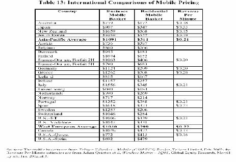

http://hraunfoss.fcc.gov/edocs_public/attachmatch/FCC-02-179A2.pdf,FCC(2002)

. 

表 4：世界上 25家最大的电话运营商的用户数量

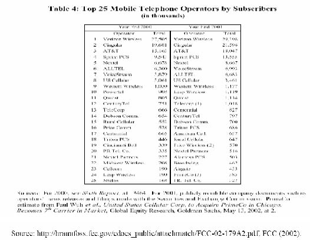

英国移动电话市场的市场份额

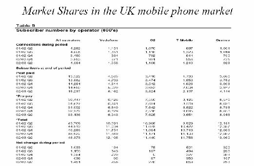

图 A-1.位置竞争优势资源

公司战略和竞争全局

一个地方环境鼓励适当需求条件 要素（输入）

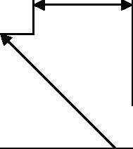

的投资方式和可持续升

条件

级

地方竞争对手间的积极竞争 

要素（输入）数量和成本

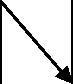

老练和苛刻的地方消费者

相关和支持

-自然资源

产业 期望消费场所的消费者需求 -资本资源

特殊领域不同寻常的地方需 -科学和技术基础设施求全面得到满足 -信息基础设施

有能力的地方供应

 -物质基础设施

者存在 

-行政基础设施 

竞争性的相关产业

- 要素质量 

存在

- 要素专业化 

Reproduced from Porter, “Location, Competition, and Economic Developmentg,” 

Source: Council of Economic Advisors(2002) 

频谱拍卖 

- 无线电频谱是一种极其珍贵的稀缺自然资源。在国家地理区域内属于政府所有，且政府有权利对其进行商业分配。 

- 特殊频率波段（spectrum ranges）所有者在其频谱部分属于政府授权的自然垄断。 

- 但是特殊部分的所有者可能与提供相同服务的供应者进行竞争（例如，无线电话）。 

- 特许经营权拍卖似乎是一项好的方法把频谱分配给最优效率的厂商。 

- 尽管频谱的带宽是固定的，但是政府可以选择拍卖小型存储器（smaller packets，）允许更多公司进入。 

- 为什么拍卖导致最合意的公司运行频谱？ 

- 谁来决定价格与边际成本有多接近？

- 拍卖理论 

-  	1959年，科斯提倡拍卖无线电频谱。 

- 拍卖可以与 ‘选美比赛’相比较（政府官员在各商业计划中做出选择）。 

- 拍卖促使参与公司不停提高报价（put money where mouth is）。很难明确规定和评价选美比赛的标准。拍卖可以筹集金额巨额的资金（英国，拍卖所得是 GDP的 2.5%）。 

- 两种主要形式：上升式（英式拍卖） ;密封报价（最初价格或者荷兰式拍卖）。 

- 英式拍卖能够鼓励合谋，因为对其他参与者来说早先报价是一个信号，使竞争力弱的出价者及早放弃。 

- 荷兰式拍卖不允许竞争力强的出价者了解弱的出价者的估价。但是如果竞争力弱的出价者胜出，其结果是没有效率的。 

- 无论哪种拍卖方式，都是鼓励进入，阻碍合谋。

- 反对拍卖的理由 

- 涉及的风险过大。 

- 投标成本转移给消费者。 

- 如果标价升高，投资会减少。 

- 问题：

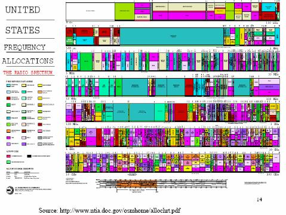

－拍卖费用是否不同于发展成本？－如果拍卖费用上涨，这将如何影响拍卖的市场竞争？－拍卖费用增加可能作用于服务首次展示（和相关的投资）的速度，速度怎么变化？

拍卖设计问题 

- 鉴于 2G在位厂商将在 3G市场获得优势的事实，新的进入者出现并进入 2G市场。 

- 版税或者一次支付？－为什么一次支付更有效率？ 

- 发放多少许可证？－如果我们让市场自己决定，会发生什么？ 

- 适当的法律框架－最低拍卖底价，没有竞标者没有分配，制定符合法规的可靠程序。

欧洲 3G移动电话拍卖收益

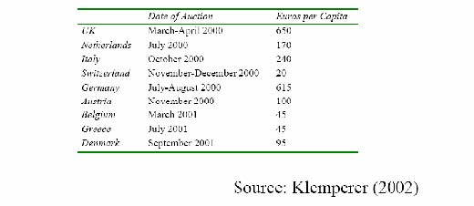

问题：为什么各国的拍卖收益变动如此大？

英国移动电话拍卖 

- 第一代 3G许可证拍卖。拍卖 5个许可证，其中一个留给新进入者，以鼓励新进入者参与投标。许可证 2021年到期，获得许可证的厂商有责任于 2007年在 80%的人口中普及网络。 

- 竞标者积极参与投标，多回合上升式拍卖中目前出价最高的竞标者不能参与下一回合的竞标。 

- 拍卖规定了最小投标增量。 

- 确保预留许可证投标的竞争性，非预留许可证投标也要引进竞争。结果 9个新进入者竞标激烈，收益高达 22.4774bn英镑。

•	当只剩 5个投标者时，拍卖结束。

荷兰和瑞士拍卖 

- 荷兰遵循英国模式。荷兰现已经发放 5张许可证，存在 5个在位厂商。 

- 瑞士也遵循英国模式拍卖 4张许可证，并允许联合竞标协议，所以拍卖前一周竞标者从 9个下降为 4个。政府推迟了拍卖，但却受到合法质疑，因此政府不得不以保留价出卖许可证。如果使用密封投标拍卖可能较好。

- 丹麦和土耳其拍卖 

- 丹麦有 4个在位厂商和 4张许可证。这种形势下密封投标拍卖更合适。结果（在电信股票价格暴跌后）达到事先预测的两倍收益。（结果实际收益是事先预测的两倍） 

-  	2000年土耳其顺序拍卖两张许可证，但是把第二张的保留价设定在第一张的拍卖价的水平上。你认为会发生什么？

- 欧洲移动电话的顺序拍卖方法的结果 

- 学会博弈。唯一成功的拍卖是第一种类型。 

- 了解对手估价。这将影响关于未来竞标或寻找同盟的公司战略和决策。 

- 市场补充意味着稍后的市场拍卖对先前的赢家来说更有价值。 

- 当昂贵的许可证最初成本会提高债务水平时，对某些公司来说预算约束似乎会上升。 

-  	4G拍卖如何避免这些问题？

- 结论 

- 标准在激励创新和竞争方面很重要。 

- 在价格决定方面，企业数量具有重要决定性。 

- 频谱是稀有资源，需要有效分配。 

- 设计出推动厂商进入和减少合谋的有效拍卖方案比较困难：－需要检验关于解决明显问题的规则。－需要提前而不是在拍卖时制定市场结构。－需要对竞标实行正规反托拉斯标准。－一种设计不适合所有市场。

- l《地面运输和航空业解除管制》 

- l阅读：VVH第十六章和十七章

下一课

         xml

               user

               第十一课.doc

         2005-10-13T11:01:47+08:00

         pdfFactory Pro www.fineprint.com.cn

         pdfFactory Pro 2.30 (Windows XP Professional Chinese)

# 14.23政府的产业规制

## 

### 第十一课：地面运输和航空业解除规制

麻省理工学院 &amp;剑桥大学提纲 

- 关于自然竞争产业价格规制和进入规制无效率的理论。 

-  	20世纪 70年代以前，铁路，公路运输，航空业都受到严格规制。 

- 这些行业现在已经基本放松规制。 

- 逐一调查每个行业：规制是如何影响这些行业的？

- 价格规制和进入规制 

- 规制的中心是对进入和价格的控制。 

- 规制价格可能高于或低于成本。 

- 进入规制和退出规制具有相似效应。 

- 进入/退出规制和价格规制都是必要补充。当处于以下几种情况时，会发生什么： 

- （1）什么时候规制价格高于成本，没有进入规制？ 

- （2）什么时候规制价格低于成本，没有进入规制？ 

- （3）什么时候存在进入限制，没有价格规制？

竞争市场规制

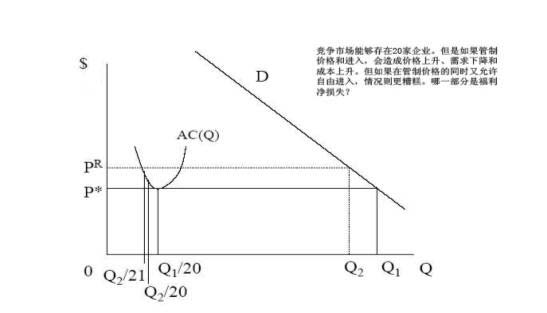

规制的次优效应 

- 假设对第一种供应商规制，那对第二种相关供应商的规制是一件坏事吗？ 

- 设想你拥有一家提供第一种商品的受规制企业，第二种供应商能够提供市场所需商品，但成本更高且质量稍差。 

- 如果规制价格，使 PR&gt;MC2&gt;MC1。企业 2进入但不利于社会福利。 

- 因此解决方法是政府促使两家企业都已不低于 PR定价。

- 如果更低成本的收益超过消费者剩余损失，这样定价就是有利的。 

- 在一个竞争性市场将发生什么？

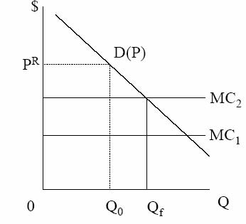

不完全竞争模型 

- 当大量固定成本存在，以及与市场规模相关的具有重要意义的最小经济规模 (MES)存在时，进入是否会增加社会福利并不清楚。 

- 这是因为，在某一点进入发生，进入厂商无利可图，但是这一点也不是社会福利达到最大的点。 

- 无疑社会将承担进入的固定成本，但是进入企业可以得到从其它企业转移来的利润。 

- 这种现象在一个简单古诺模型中可能导致过度竞争（相对于社会最优来说）。 

- 但是相对于禁止进入的成本来说，进入的社会成本可能较低（阅读有关书籍的案例）。

- 间接效应和创新 

- 过度的非价格竞争（例如，航空业：食品，安全，放腿空间）。 

- 生产无效率：高工资，导致资本/劳动力比率改变，无效率企业继续经营。 

- 交叉补贴：强制执行交叉补贴阻止退出，导致社会福利减少。－也可能导致投资减少，生产力和质量下降。 

- 实行规制，投资可能增加，但创新激励减少。20世纪 70年代美国受规制的产业其生产力似乎减缓。

-  	1.跨时期方法（inter-temporal）。把特定的产业的受规制期间和没有受规制期

- 间进行比较，观察区别。 

-  	2.跨市场比较（inter-market）。比较提供相似产品或具有不同权限的两个市场，一个受规制，一个不受规制。 

-  	3.反事实方法。以此为基准来假设市场不受规制时的情况。

- 地面运输的规制 

- 铁路和公路运输被联系在一起，因为它们是运输的相近替代品。 

-  	19世纪 70年代：铁路寻求规制以保护自己远离价格战。 

-  	1887年：州际商业委员会（ICC）成立，规制铁路，要求费率‘公正和合理’，无歧视。 

-  	1906年：ICC制定最大费率。 

-  	1920年：ICC制定最小费率和控制进入退出。 

-  	1920年以后：公路运输开始与铁路竞争，削弱铁路的盈利能力。 

-  	1935年：汽车运输法：将汽车运输置于 ICC控制之下（价格，进入和退出）。

- 地面运输放松规制 

-  	20世纪 40年代：铁路要求减少规制，汽车运输受规制。 

-  	20世纪 50年代：不受规制的州际高速公路/自己驾车运输 own trucking冲击了铁路运输。 

-  	1958年：ICC允许铁路降低了一些费率，退出无利可图的客运市场。 

-  	1976年：铁路复兴和规制改革法（4R法案）允许一个合理费率区域，和退出无利可图路线的自由。 

-  	1980年：斯塔格斯（staggers）铁路法。在费率设置方面给予相当大的自由，允许自由进入和退出市场。 

-  	1980年：汽车运输法。进一步解除 ICC的规制。 

-  	20世纪 80年代,地面运输大幅度解除规制。 

-  	1995年：州际商业委员会结束。

- 为什么存在规制？ 

- 铁路价格不稳定：破坏性竞争，强制执行合谋困难。 

- 金融市场规制有利于铁路盈利能力（普拉格 Prager，发现随着州际商业委员会法案的通过，股票价格上升）－为什么这是一项好的措施？ 

- 公路运输不存在自然垄断。 

- 规制的理论根据是铁路规制的补充 

- 公路和铁路运输的规制实践不一样。

-  	ICC设置最小费率和最大费率。 

- 费率以服务价值原则和均衡差别原则为基础。 

- ‘服务价值’定价指对高价值商品收取高价格（对一些并不贵重的商品运输不必要）。 

- ‘均衡差别’防止对不同托运人和不同货物体积的歧视，即使它们的成本不同。这项原则意味着将产生交叉补贴。

- 公路运输规制 

-  	ICC允许建立产业 ‘机构’来制定价格。 

- 对于相同距离的路线，费率不允许变动（即使这些路线密度不一样）。 

- 费率可以根据装运体积/托运人特征的不同而改变。 

- 因此，公路货运公司能得到他们所希望的价格，而铁路运输则不能。 

- 但是公路运输的进入限制促使价格上升。

- 规制效应 

- 跨时期方法关注实施规制前和后的价格效应。 

- 很难分析特定的输入成本变化和交通性质。 

- 但是规制放松后似乎大多数路线的铁路费率下降，尽管有一些路线的费率上升。 

- 对于公路运输来说，规制放松后价格大体上都下降了。

- 规制效应 

- 铁路面临退出限制。1980年斯塔格斯铁路法允许放弃无利可图的市场。美国联合铁路公司（Conrail）因此放弃了 2600英里长的线路（占总路线的 15%，收益的 1%）。 

- 公路运输面临进入限制。1978年到 1985年，获批准的汽车承运人数量增加了一倍。这一期间，破产数量也上升了。 

- 单位成本下降，且具有最低单位成本的厂商更为集中。 

- 工会工人相对于非工会工人的工资溢价从 50%降至 27%（低于国家平均水平）。 

- 因为利润提高，对道路的投资增加。 

- 与其它国家相比较，美国受规制的产业生产能力低下，但是现在似乎已经提高了。

- 规制放松对利润的影响 

- l放松规制后，铁路生产力急剧增长，四年内回报率增加一倍。

- 为什么？－自由退出。－费率弹性允许更好的需求管理。－下降的劳动力成本。－投资增加导致效率增加和成本降低。－和托运人的长期合同导致最优投资计划。

- 航空业规制 

-  	20世纪 20年代：美国邮政竞争投标看上来就象破坏性竞争。 

- 航空公司认识到，尽管以最低成本为基础来分配合同，分配后没有价格规制，从此竞争起作用。 

-  	1938年：民用航空法颁布，航空业受到民用航空委员会（CAB）的联邦的规制。 

-  	1958年：CAB将安全管理转移给联邦航空管理局（FAA）。 

-  	CAB规制最大费率和最小费率，和竞争者数量。 

- 航空公司数量固定在 1938年的水平，后来因合并而减少。

- 航空业规制放松 

-  	1975年：CAB主席放松进入限制。 

- 到 1977年：进一步减少进入限制和放宽价格控制。 

-  	1978年：航空规制放松法。 

- 到 1979年：允许自由进入。 

- 到 1980年：不受限制的下调价格灵活性。 

- 到 1983年：对费用的控制权终止。 

- 最初存在大量进入，现在是中枢辐射式航线系统的合并（hub and spoke system）。

- 解除规制的效应 

- 价格：－当交叉补贴放松后，价格下降尤其是长途距离价格下降。 

- 质量：－规制导致高质量－高价格产品。而放松规制将会产生什么呢？ 

- 中枢辐射式航线系统：

估算规制效应的方法 铁路规制

－意想不到的创新。航空公司通过增加航班使用省钱。为什么？但是由于更频繁的起飞，也提高对乘客的价值。 

2003年美国西部航空公司线路

http://www.americawest.com/aboutawa/companyprofile/aa_routemap.htm

航空业解除规制对消费者福利的影响

结论 

- 潜在竞争产业的规制通常导致高价格和成本。 

- 在某产业受到规制后，规制可能会扩展至相关部门。 

- 铁路运输和公路货运规制放松表明先前的规制使成本增加和价格扭曲。 

- 航空业放松规制表明竞争条件下不曾预料到的创新将产生大量利润。

- 下一课 

- 复习，准备期中考试－阅读习题集和复印资料。－模拟考试（将公布）。－把你的问题通过电子邮件发给我。 

- 提示：期中考试只允许携带简单计算器。

         xml

               user

               第十二课.doc

         2005-10-13T11:00:32+08:00

         pdfFactory Pro www.fineprint.com.cn

         pdfFactory Pro 2.30 (Windows XP Professional Chinese)

# 14.23政府产业规制

## 

### 第十二课：备战期中考试

### 麻省理工学院 &amp;剑桥大学

如何复习期中考试 

- 仔细复习课堂上、练习集中所涉及的计算题，确定如何解答这些模型。 

- 对于课堂上我们所讲的每个产业，确保你都了解：－每个产业的基本轮廓－为什么受到规制－为什么放松规制（如果这个产业已放松规制）－如何对产业进行规制？（例如，价格控制，进入控制等）－规制的经济结果（关于效率，利润，做应该做的事的能力等）－对每个行业的了解程度与课堂上所讲的相负荷

- 如何复习期中考试 

- 没有必要记住各种政府机构的缩写、规制名称、规制日期（或类似的）。 

- 考试分为 3个部分：－第 1部分，简答题（3道题，每道 5分）。每个问题应该包含 3－4句正确

的简练的回答。数字计算简短且附带简单解释。－第 2部分，1道计算题（25分）。与练习集中的问题采取同样的格式。－第 3部分，1道论述题（20分）。

所调查的产业 

- 电力 

- 有线电视 

- 电话：固定路线 

- 电话：移动 

- 潜在竞争市场：铁路，公路运输和航空业

- 课程概要 

-  	1.复习企业理论：垄断，寡头，剩余，政府干涉，无谓损失，战略竞争：限制性定价，动态进入障碍。你应该熟悉这些模型，并能运用它们解答简单计算题。 

-  	2.规制动机：经济利益，公众利益，俘获理论。你应该了解这些理论及它们的区别。规制的成本和收益。

- 课程概要 

-  	3.公有制：公有制的历史根源，赞成公有制的一些理论（例如，不受合同保护的质量问题，政府担心的腐败问题），私有制的优势; 私有化：目标和效果。

-  	4.自然垄断规制：定价策略（平均成本，边际成本，完全分配成本定价，拉姆齐定价，高峰负荷定价）；定价策略的结果（交叉补贴－凸现单一平均成本和增量成本检测；撇脂行为；无效率）；回报率规制（规制如何起作用；例如阿弗奇－约翰逊效应，无效率）。

电力发电厂案例

课程概要 

-  	5.我们需要规制吗？有线电视和特许经营权竞标案例。特许权竞标的结果是什么?我们使用边际成本定价法吗？我们需要担心质量吗？有线电视案例。 

-  	6. 市场变化：1：技术的作用，它如何影响自然垄断行业（需求改变，固定成本和可变成本的改变：这些变化会或多或少的影响自然垄断行业的维持吗？）。有线电信案例。

- 课程概要 

-  	7.市场变化 2：公共标准和经济成功的重要性，频谱分配，拍卖理论，公司数量和决定定价，拍卖费用与价格的相对独立性，英式拍卖和荷兰式拍卖。欧洲 3G移动电话拍卖案例。 

-  	8.潜在竞争市场的规制：价格和进入控制，对市场、在位者和潜在进入者规制的经济效应。地面运输和航空业案例。

- 模拟考试 

- 问题 1－3的参考答案。 

- 问题 4的参考答案。 

- 问题 5的讨论答案。

- 模拟考试 

- 问题 1：20世纪 50年代微波传输技术的发展被视为长途电话市场不再属于自然垄断的一个理由，因为通过微波传输站输送信号的成本比电线低。但在 20世纪 90年代，光缆大量取代了微波传输站，这意味着又重新在区域间架设电缆。因此伴随技术的变迁，为什么长途电话市场不属于自然垄断行业，？

- 模拟考试 

- 问题 2：德姆塞茨曾建议以特许经营权许可证的方式拍卖掉一个特殊行业的垄断经营权，来避免自然垄断规制。特许经营权竞标必然导致一个有效率的

- 结果吗？理由何在？ 

- 问题 3：规制期间，航空业价格固定在成本之上，航空公司不能进行价格竞争。关于食品质量和安全的规制实践结果是什么，你能证明航空公司在这两个方面的反应是正确的吗？

- 模拟考试 

- 问题 4：电力需求的高峰和非高峰周期相等。高峰期需求函数为 PP=100-QP，非高峰期需求函数为 P0=A-Q0。生产具有固定比例，每单位可变成本为 2美元，每周期资本成本为 β。投资于生产能力的成本是沉没成本，各周期间发电能力不能调整。

- （a）假设 A＝50，β＝4。得出最优发电能力，高峰价格，和非高峰价格。

- （b）假设 A＝90，β＝8。得出最优发电能力，高峰价格，和非高峰价格。

- 模拟考试 

- 问题 5：2000和 2001年，欧洲拍卖经营 3G移动电话网络的许可证。许可证持有者有权利和义务投资 3G的基础设施建设，并在一段固定年限内排他性的使用拍卖的频谱。

从以下角度讨论拍卖：（1）通过拍卖分配无线电频谱的动机（2）这些拍卖应该如何作用（3）可能产生的理论和实践问题。尝试运用课堂上的特殊案例和证据来支持你的观点。

最后提示 

- 闭卷考试－不准携带课本和笔记。 

-  	9点整开始考试。 

- 如果迟到将失去考试资格。 

- 考试于 10：25结束。 

- 携带钢笔和简单计算机（非科学性的）。

- 期中考试定于 13号教室，9点整开始。

下一课 

         xml

               user

               第15课.doc

         2005-10-12T11:22:03+08:00

         pdfFactory Pro www.fineprint.com.cn

         pdfFactory Pro 2.30 (Windows XP Professional Chinese)

# 1 4 .2 3政府产业规制

# 

麻理学大

省工院&amp;剑桥学

- 英国铁路的历史 

- 私有化和重组 

- 规制 

- 私有化后的成效 

- 近期的失败案例 

- 结论

-  	19世纪 20年代前，私人投资于铁路网。 

- 铁路网在 1948年国有化后，在 1995到 1997年间又私有化。 

- 由于公路运输方面的竞争，铁路的客运量和货运量在 1948 ~1995年间持续下滑。 

-  	20世纪 60年代，铁路的里程数减少了 1/3 (Beeching cull)。 

-  	1968~1985年间，财政补贴从 1968年的6亿英磅(按不变价格)增加到1985年或1986

-  	20世纪80年代非核心产业——酒店业和海运业等产业的大规模私有化。 

-  	1994 ~1997年，全行业大范围的私有化。 

-  	1995年后，私有化后的衰退现象得到逆转。

- 私有化 

-  	1979~1997年间保守党的政策：国有企业的私有化改革由易而难。 

-  	1992年保守党通过白皮书—《铁路的新时机》（ New Opportunities for the Railways）使英国铁路私有化改革以法案的形式确定下来。 

- 采用的使竞争最大化的产业结构(电力改革模式)。 

- 主要变化：轨道所有权从列车运营中分离。

- 客运特许经营办公室(OPRAF——现在是英国铁路策略管理局（ SRA））和铁路监管办公室(ORR——Office of the Rail Regulator)是私有化后创建的两大管理机构。 

- 英国铁路公司(BR)被拆分成100家私营企业。

- 融资和工业规制 

- 规制：客运特许经营办公室和铁路监管办公室。 

- 客运特许经营办公室对客运公司（TOCs）进行补贴。 

- 客运公司以规制价格向线路公司(Railtrack)——铁路基础设施的垄断提供者支付轨道和车站使用费。 

- 客运公司从机车车辆公司（ROSCOs）租借列车。 

- 客运费的规制。 

- 现有路线上的竞争。 

- 英国铁路策略管理局开始接管客运特许经营办公室的工作。 

- 直接给予线路公司补贴。

英国铁路：基金的来源和使用（1997 /98）

资料来源：Smith(2003) 

客运公司的规制 

- 客运公司拥有经营许可证，享有一系列的财政补贴以及价格控制权。 

- 客运公司特许经营权的丧失正在威胁着客运公司（比如：Connex South Central公司）的生存和发展。 

- 最初的价格规制持续到2003年客运特许经营权的结束。 

- 通过绩效惩罚制度对票价和服务质量进行规制。 

-  	RPI-X的票价制度（PRI为零售物价指数，X为通货膨胀率）：非高峰时期的优惠票、周期乘坐者以及往返者（占收入的40%）。 

-  	X=0, 1996~1998年； X=1 ，1998~2003年；往返市场的X值，随着服务质量在 -2到+2之间波动。 

- 准时激励机制、短途激励机制、时间表兑换奖励支付机制。

- 当有些客运公司已经合并时，另外一些客运公司却试图进行拆分。 

- 在1995~2000年间，票价保持稳定，但在1990~2005年间成本平均增长率却达到了12％。

- 线路公司的规制 

-  	CP1(第一个控制阶段)：线路使用费固定在2000~2001年的水平上。 

-  	CP2(第二个控制阶段)：2000~2006年的线路使用费。 

- 在第一个控制阶段的线路公司:在1995~1996年间，零售物价指数降低了8个点后又降低了2个点. 

- 在第二个控制阶段的线路公司：在2001~2002年间，零售物价指数降低了11.2，而消费零售物价指数（c.RPI）增加了4.5。在这种情况下，再加上每年8亿英磅的直接补贴表明在2001~2002年间，当c.RPI增加4.5时，RPI增加了34.5。 

- 每个客运公司的线路通行费包括固定成本和变动成本（轨道使用费和电气化牵引费）。 

- 在第一个控制阶段，其可变成本大约为9％。 

- 在第二个控制阶段，可变成本占客运公司所支付款项的20％。 

- 运费是特定成本。

乘客铁路旅行

私有化后，旅客量增加了23% (1993年〜2001年)。

图片不存在

资料来源：英国铁路公司年度报告；私有化后各公司的年度报告。2001年交通运输的趋势报告（运输、地方政府与地区发展部—DTLR) 。 

- 成本：营业成本（不包括折旧）。 

- 不包括小型货运商。 

- 不包括供应商的利润。 

- 工业成本：包括英国铁路策略管理局（SRA）的成本，不包括铁路监管办公室 (ORR)的成本和部门的运输成本。

准点车次所占的百分比 (全部车次)

图片不存在

http://www.railwaysafety.org.uk/pdf/railrepo0102/aspr%20200102%20full%20report.pdf

<Table>
<TR>

<TD>方法论</TD>

<TD>计算 </TD>
</TR>
<TR>
<TH>l</TH>
<TD>社会成本效益分析。 </TD>
<TD>l</TD>
<TD>在公有和私有两种不同产权所有制下成本计算的差别。 </TD>
</TR>
<TR>
<TH>ll</TH>
<TD>由Jones, Tandon 和 Vogelsang略述 (1990)。 英国和海外私有化工业采用。 </TD>
<TD>l</TD>
<TD>∆W = Cg -Cp -R&amp;P 主要的难度在于估计非实际成本。 </TD>
</TR>
<TR>
<TH>l</TH>
<TD>确定总福利变化。 </TD>
<TD>l</TD>
<TD>总福利变化及其分配。 </TD>
</TR>
<TR>

<TD>∆W = Vsp -Vsg + (λg -lp) * Z如果∆W&gt;0，可以私有化 </TD>

<TD>∆W = ∆Cust + ∆Prod + ∆Gov </TD>
</TR>
</Table>

图 4 

实际和非实际总成本

<Table>
<TR>

<TH>贴</TH>
<TH>现率 </TH>

</TR>
<TR>

<TD>6% </TD>

<TD>10% </TD>

</TR>
<TR>
<TH>现值</TH>
<TH>将来的价值合计</TH>
<TD>现值</TD>
<TD>将来的价值</TD>
<TD>合计</TD>
</TR>
<TR>
<TH>私有化前</TH>
<TD>1,900 1,400 500 </TD>
<TD>3,300 5,200 -1,400 -3,800 </TD>
<TD>2,000 1,700) 300 </TD>
<TD>2,800 --</TD>
<TD>4,800 (1,700)3,100 </TD>
</TR>
<TR>
<TH>效率收益 </TH>
</TR>
<TR>
<TH>重组成本 </TH>
</TR>
<TR>
<TH>净效率收益/损失 </TH>
</TR>
<TR>
<TH>中间阶段</TH>

</TR>
<TR>
<TH>效率收益 </TH>
<TD>800 </TD>
<TD>1,700 </TD>
<TD>2,500 </TD>
<TD>800 </TD>
<TD>1,400 </TD>
<TD>2,200 </TD>
</TR>
<TR>
<TH>重组成本 </TH>
<TD>(1,400) </TD>
<TD>-</TD>
<TD>(1400) </TD>
<TD>(1,700) </TD>
<TD>-</TD>
<TD>(1,700)</TD>
</TR>
<TR>
<TH>净效率收益/损失 </TH>
<TD>(600) </TD>
<TD>-</TD>
<TD>1,100 </TD>
<TD>(900) </TD>
<TD>-</TD>
<TD>500 </TD>
</TR>
<TR>
<TH>公有化前</TH>

</TR>
<TR>
<TH>效率收益 </TH>
<TD>(200) </TD>
<TD>100 </TD>
<TD>(100) </TD>
<TD>(200) </TD>
<TD>0 </TD>
<TD>(200) </TD>
</TR>
<TR>
<TH>重组成本 </TH>
<TD>(1,400) </TD>
<TD>-</TD>
<TD>(1,400) </TD>
<TD>(1,700) </TD>
<TD>-</TD>
<TD>(1,700)</TD>
</TR>
<TR>
<TH>净效率收益/损失 </TH>
<TD>(1,600) </TD>
<TD>-</TD>
<TD>(1,500) </TD>
<TD>(1,900) </TD>
<TD>-</TD>
<TD>(1,900) </TD>
</TR>
</Table>

- l政府得到/生产者支付销售收入 (70亿英镑)。 

- l政府对未来的利润征税效用较小。 

- l支付财政补贴 

- l非实际：财政补贴弥补损失。 

- l总的来说，政府是中立的。 

<Table>
<TR>
<TH>铁路私有化过程</TH>
<TH>现价 (10 亿英镑 ) </TH>
<TH>现值 (10 亿英镑 ) </TH>
</TR>
<TR>
<TH>Railtrack* </TH>
<TD>2.5 </TD>
<TD>3.5 </TD>
</TR>
<TR>
<TH>ROSCOs </TH>
<TD>1.7 </TD>
<TD>2.4 </TD>
</TR>
<TR>
<TH>货运 </TH>
<TD>0.3 </TD>
<TD>0.4 </TD>
</TR>
<TR>
<TH>基础设施和维护费用 </TH>
<TD>0.3 </TD>
<TD>0.4 </TD>
</TR>
<TR>
<TH>BR 中心服务 </TH>
<TD>0.2 </TD>
<TD>0.3 </TD>
</TR>
<TR>
<TH>合计 </TH>
<TD>5.0 </TD>
<TD>7.0 </TD>
</TR>
</Table>

*包括5.95亿的债务

-  1999年10月	在帕丁顿（Paddington）附近发生的Ladbroke Grove事故。 

-  	2000年7月英国政府在10年长远铁路运输发展计划中表明到2010年铁路网络将得到进一步的发展，并将运量提高五成。 

-  2000年10月	哈特菲尔德（位于伦敦北部）断轨事故。 

- l哈特菲尔德事故引起了铁路系统的严重混乱。 

-  2001年4月管理者同意线路公司预支未来收益。 

-  2001年4月〜5月间线路公司私下寻找更多的政府投资。

-  	2001年10月交通部对线路公司进行特殊规制。 

-  	2002年10月英国铁路基建企业网络铁道公司(Network Rail公司——一家非盈利有限公司)接管了铁路网络的资产。 

-  	2002年〜2003年后期,种种迹象表明,英语铁路策略管理局（ SRA）将削减未来的投资计划。这样,政府提高铁路使用率的目标将无法实现。

- 线路公司的资金问题 

- 哈特菲尔德事故发生后，线路公司需要资金支持以及在第二个控制阶段的规制过严等问题变得越来越清晰。在哈特菲德事故中，线路公司分别花费了500万镑用于维修和对客运公司的赔偿。 

- 在2001年4月，政府同意线路公司提前预支第三个控制阶段（2006年〜2007年）的15亿英镑资金。 

•	由于政府不能在公共部门借款要求(PSBR)结束前找到一种更好的转移支付方式，所以政府近期不会进行拨款。 

- 资金的短缺引起管理层的关注。

- 客运公司的问题 

- 机车车辆公司并未像预期那样更新列车。 

- 客运公司需要延长特许经营权,以便获得更新列车的激励。 

- 客运公司也要求通过对基础设施的投资来完善其投资 (例如：Virgin和 Heathrow 客运公司)。 

- 一些客运公司强烈希望通过削减投标的财政补贴来加强产业合并趋势。 

- 一些在日常服务中缺乏竞争力的客运公司将丧失特许经营权。这便是竞争带来的益处。 

- 大多数合并的客运公司从2003年开始获取特许经营权。 

-  	Affuso et al（2002年）的情况说明，私有化后的成本下降和收入提高使客运公司的效率大幅提升。

- 激励 

- 客运公司有强烈的动机运营更多的列车。 

- 线路公司的额外收益无法抵补上涨的边际成本。 

- 列车数每增长1%，拥挤度就会增加2.5%。 

- 通过再分配进入权而提高运营效率和线路公司共享利润的商业谈判是低效和高成本的。 

- 维持私有化前约定的固定价格的成本最小化成为关注的焦点。

<Table>
<TR>
<TH>• </TH>
<TD>20世纪80年代期间，发展状况恶化。 </TD>
</TR>
<TR>
<TH>l</TH>
<TD>在公有制下，状况会进一步恶化。</TD>
</TR>
<TR>

<TD>列车性能和运能：私有化后</TD>
</TR>
</Table>
<Table>
<TR>
<TH>参数 </TH>
<TH>95/96 </TH>
<TH>96/97 </TH>
<TH>97/98 </TH>
<TH>98/99 </TH>
<TH>99/00 </TH>
<TH>百分变化率</TH>
</TR>
<TR>
<TH>准点率 a </TH>
<TD>89.5% </TD>
<TD>92.5% </TD>
<TD>92.5% </TD>
<TD>91.5% </TD>
<TD>91.9% </TD>
<TD>+2.7% </TD>
</TR>
<TR>
<TH>列车数 </TH>
<TD>231 </TD>
<TD>229 </TD>
<TD>237 </TD>
<TD>249 </TD>
<TD>257 </TD>
<TD>+11% </TD>
</TR>
<TR>
<TH>里程数 </TH>
<TD>18.6 </TD>
<TD>19.9 </TD>
<TD>21.6 </TD>
<TD>22.6 </TD>
<TD>23.8 </TD>
<TD>+28% </TD>
</TR>
</Table>

- （a）准点百分比

- 列车性能和运能： BR规制下

- （a）准点百分比

<Table>
<TR>
<TH>参数 </TH>
<TH>84/85 </TH>
<TH>85/86 </TH>
<TH>86/87 </TH>
<TH>87/88 </TH>
<TH>88/89 </TH>
<TH>百分变化率</TH>
</TR>
<TR>
<TH>准点率 a </TH>
<TD>90% </TD>
<TD>89% </TD>
<TD>90% </TD>
<TD>90% </TD>
<TD>89% </TD>
<TD>（1%）</TD>
</TR>
</Table>
<Table>
<TR>
<TH>列车数 </TH>
<TH>202 </TH>
<TH>201 </TH>
<TH>203 </TH>
<TH>213 </TH>
<TH>222 </TH>
<TH>+10% </TH>
</TR>
<TR>
<TH>里程数 </TH>
<TD>18.5 </TD>
<TD>18.9 </TD>
<TD>19.2 </TD>
<TD>20.1 </TD>
<TD>21.3 </TD>
<TD>+28% </TD>
</TR>
</Table>

- 埃文斯在2000年和2002年间发现在1967年〜2001年间，每十亿英里的事故率呈下降的趋势。 

- 近期的事故发生率也呈下降趋势。 

- 随着时间的推移，每次事故的死亡率缓慢上升。 

- 但是我们不能得出私有化诱使事故发生率上升的结论。 

- 私有化期间，安全中介指标，如：危险地段信号灯失灵数（ Ladbroke Grove事故的起因）和铁轨破坏数（ Hatfield事故的起因）都急剧减少。

- 结论 

- 私有化有利于降低成本和提高产量。 

- 规制将诱发激励倒错。 ——维持固定的价格 ——CA货运和客运公司较低的边际价格 

- 一般情况下易于私有化和重组。 

- 私有化将降低人们承担风险的意愿，代价昂贵 

- 当然，私有化降低了政府的财政补贴。

- 下一课 

- 放松加州电力市场的规制 

- 相关资料阅读： Joskow，P，“加州的电力危机”；《牛津经济政策评论》（ Oxford Review of Economic Policy）第17卷，第3期，第365〜388页。

         xml

               user

               第16课 .doc

         2005-10-12T11:24:20+08:00

         pdfFactory Pro www.fineprint.com.cn

         pdfFactory Pro 2.30 (Windows XP Professional Chinese)

# 14.23 政府产业规制

第 16课：放松规制——加州电力市场

麻省理工院 &amp;剑桥

学大学

- l市场：自发形成或主观设计 

- l电力市场的性质？ 

- l市场设计的一般原则 

- l加州电力市场的设计 

-  2000年加州的能源危机 

- l市场设计的经验教训

图片不存在

http://ksghome.harvard.edu/%7E.whogan.cbg.Ksg/empr1298.pdf

- l发电商 

- l传输线路拥有者 

- l独立系统运营商(ISO) 

- l电力交易中心(能源市场) 

- l均衡性市场 

- l配套服务 

- l电力输送商 

- l电力零售商 

- l规制机构例如：加州公共设施委员会(CPUC)和联邦能源规制委员会 (FERC) 

(赫根， 1998) 

l短期市场

- 输送线路拥堵 

- 长期市场合同 

- 计划和平衡 

- 长期投资 

- 搁置成本的清偿 

- 安全问题和能源储备

图片不存在

http://ksghome.harvard.edu/%7E.whogan.cbg.Ksg/empr1298.pdf

图片不存在

http://ksghome.harvard.edu/%7E.whogan.cbg.Ksg/empr1298.pdf

（廖和亨廷顿， 1998年） 

- 市场不是自发形成的! 

- 市场设计的主要动机是通过激励技术革新和有效率的投资竞争来提升长期效益。 

- 拆分和增设机构将增加交易成本。 

- 有效的短期价格信号对长期效率是必要的。 

- 跨地区和跨市场的市场设计应体现兼容性和一致性。

- 市场设计 

- 决策者易于低估消费者选择和产品多样性在实现长期福利最大化方面的重要性。

- 因为长期决策具有较强的外部性，所以这样的决策过程需要政府干预。 

- 有效的公共政策需要依据不同的规章和制度对市场运行进行频繁的监控和公正的评估。

- 需要决定的关键事项 

- 哪些领域需要进行垂直拆分？ 

- 水平拆分的程度如何（发电商）？ 

- 哪些领域需要引入竞争 (零售领域) ？ 

- 什么样的交易会被禁止或规制（例如：交易是自愿的还是强制的）？ 

- 消费者（特别是国内消费者）将受到什么保护（例如：对本地经销商实施的税收价格上限）？ 

- 通过什么机制出清市场（提前/实时）？ 

- 谁将监督市场的运作，并对市场进行调整（独立系统运营商或电力交易中心）？

- 加州电力市场 

- 加州——世界第五大经济体 

- 加州电力行业的年产值是 230亿美元。高峰用电需求为 45兆瓦，而其有效容量仅为 44兆瓦。 

- 美国的政策对制定者有利。 

- 环境保护较好的州。 

- 过度民主：频繁的公开投票。 

- 三大公用事业公司：太平洋燃气电力公司(PG&amp;E)、南加州爱迪生电力公司 (SCE)和圣地亚哥燃气电力公司(SDG&amp;E), (R =9.6亿，7.9亿，20亿) 

- 在 1987年〜2000年没有增加新的装机容量。 

- 新增电力产能主要来自独立发电商。

- 改革的背景 

-  	90年代早期，加州的经济处于衰退中，GDP连续三年下降。 

- 加州的电价是邻州电价的1.5倍，是美国各州平均价格的两倍。 

-  	1993年加州公用事业委员会（CPUC）提议对电力系统进行改革。 

-  	1994年4月，在举行听证会和工业论坛后，环境学家、消费者和加州公用事业委员会正式做出进行大规模改革的决定。

- 新的市场机构 

- 加州的电力交易中心(PX) 

- ——	每天电力公司从交易中心通过竞价批发购买用电量（提前一天提出用电量）。价格每小时确定。电力交易中心支付给发电商的电力价格为竞争性报价。 

- 独立系统运营商(ISO) 

——管理电网设施，通过提前购买和双边会晤协调电力交易中心的电能供应，并为能源储备付费。但是电力交易中心不允许对外提供信息。

• 	1890年的重组法案(AB) ——太平洋燃气电力公司提议：削减10%的费率并冻结五年内的费率直到 

2002年才允许抬高价格上限。 ——对可再生能源的补贴——如果批发价低于零售价，竞争性转移费用(competitive transition charge 

)将使搁置成本得到清偿。这些暗示在这期间将没有零售竞争。 

- 议案在1996年9月23日获得了参、众两院的一致通过。皮特威尔逊总督说：“我们已经废弃了一个过时的垄断机制并且用一个新时代的竞争机制来替代它”。

- CPUC的最终调整 

- 允许在输电网上取得高回报的激励机制使公共机构放弃对发电设备的资产所有权。 

- 加州公共设施委员会 (CPUC)禁止在位公用事业单位直接签订双边合约或防止失去抵押资产赎回权的合约。 

- 零售费率将被冻结到 2002年 3月或者直到搁置成本被有效的清偿后为止。 

- 独立系统运营商被授权管理一个没有价格上限的、可靠性有保证的实时现货市场。这是另一个发电厂可以和电力交易中心进行竞价交易的市场。

<Table>
<TR>

<TH>重组法案前</TH>
<TH>重组法案后</TH>
</TR>
<TR>
<TD>发电商</TD>
<TD>公共机构拥有电厂公共机构购买 </TD>
<TD>PG&amp;E,SCE和SDG&amp;E保留了核发电厂并签定了新的合同。DUKE,AES/Williams,Dynergy，Reliant和Southern购买了剥离出来的电厂 PX制定价格大量用户向发电商购买电力</TD>
</TR>
<TR>
<TD>输电商</TD>
<TD>公共机构运转系统 FERC制定价格 </TD>
<TD>ISO管理系统 FERC制定价格</TD>
</TR>
<TR>
<TD>配电商</TD>
<TD>公共机构运转系统 CPUC制定价格</TD>
<TD>公共机构运转系统 CPUC制定价格</TD>
</TR>
</Table>

新市场于 1998年 4月 1日开始运行。

-  	1998年 4月〜2000年 4月：新市场最初运转良好。——电力交易中心的交易价格偏低，电力交易中心和太平洋燃气电力公司 

- (PG&amp;E) 、南加州爱迪生电力公司(SCE)收回了 100亿美元的搁置成本。但是，新计划仍在策划中。 

-  	2000年夏天，酷热天气和输送线路的超负荷运转引起了一系列的混乱。

加州的电力价格

（\$/Mwh:加权平均7x24） 

1998年 1999年 2000年 2001年 1 月 -21.6 31.8 260.2 2 月 -19.6 18.8 363.0（ISO RT） 3 月 -24.0 29.3 313.5（ISO RT） 4 月 23.3 24.7 27.4 370.0（ISO RT） 5 月 12.5 24.7 50.4 274.7（ISO RT） 6 月 13.3 25.8 132.4 103.8（ISO RT） 

7月 35.6 31.5 115.3 62.6（ISO RT） 8 月 43.4 34.7 175.2 45.2（ISO RT） 9 月 37.0 35.2 119.6 35.0（EST） 

http://econ-www.mit.edu/faculty/pjoskow/files/CALELE901.pdf

图4.11电力紧缺和拉闸限电

图不存在

用电缺口（1999年和2000年）

http://econ-www.mit.edu/faculty/pjoskow/files/CALELE901.pdf

- 电力零售价格保持稳定。但是圣地亚哥燃气电力公司的电力零售价格却在 2000年7月开始大幅上涨，引起了在2000年9月对其进行强制性价格规制。 

- 当发电厂离开电力交易中心而到独立系统运营商应急市场交易时，电力交易中心和独立系统运营商间存在套利机会。 

-  	2000年 12月，联邦能源规制委员会宣布 IOUs在市场衰退时不必从电力交易中心购买其所需的全部电力。联邦能源规制委员会设定了 150美元/千瓦时的价格上限。

- 急需解决的问题 

-  	2001年 1月的片区拉闸限电影响了 38万消费者。风暴导致太平洋燃气电力公司核发电厂因发电量减少而损失了 23亿美元。 

-  	2001年新的供电设施费用是 125亿美元。2001年 7月价格开始上涨，州政府只好通过加州水利资源局（CDWR）购买电力。 

- 递延成本：2001年 3月太平洋燃气电力公司破产。 

- 发电厂索价太高和发电量流失。 

- 由于气候影响, 2001年5月的用电量相对于上一年同期减少了11%。 

- 新电力供给：1997年和 2000年间电力供应量新增 10兆瓦，2001年〜2005

年间将再新增电力 32兆瓦。

- 委员会的复杂市场设计使其设计倾向于政治利益集团而忽略了常识、技术现实和国际经验。 

- 供应短缺将导致现货市场发展欠佳。 

- 允许消费者使用批发价购买电力。供应者应该能签署长期合同或者进行套期交易。 

- 在一个互连系统里，公共产品的闲置产能应该获得回报。 

- 当市场重叠时,应尽可能制定跨市场的标准化规则(例如：发电量流失的标准化规则)。 

- 实现高效投资是改革带来的最大收益之一。 

- 市场再设计过程要考虑市场设计的中期修正结果。

- 下一课 

- 社会规制介绍：外部性 

- 相关阅读资料：VVH 第 19章

         xml

               user

               第17课.doc

         2005-10-12T11:25:28+08:00

         pdfFactory Pro www.fineprint.com.cn

         pdfFactory Pro 2.30 (Windows XP Professional Chinese)

# 14.23 政府产业规制

# 

麻省理工学院 &amp;剑桥大学

# 概述 

## 

- 社会规制导论 

- 风险评估 

- 上一章回顾 

- 外部性 

- 潜在补偿 

- 科斯定理(Coase theorem) 

- 公共产品

- 社会规制的背景 

- 社会规制的动机是修正市场失灵。 

- 我们讨论的社会规制涉及健康、安全、环境以及公共产品（知识产权）的规制。 

- 与经济规制不同,社会规制不会得到缓解。 

-  	20世纪 70年代以前，美国不存在如此多的社会规制。 

- 社会规制的成本和效益更加难以确定。在某种意义上，社会规制比经济规制更复杂、难度更高。 

- 如何实现社会利益最大化将更难测定(例如：关于汽车安全带的法律，披露机制等)。

- 基本动机 

- 许多社会规制的确大大降低了重大事故的发生率，例如安全带的佩带降低交通事故发生率，污染减少 (标准污染物和有毒污染物 )，工作场所危险，营养成分的标明。 

- 注意：实际上，风险并不能真正的被消除。因为许多风险极小，并且消除这些风险的代价是高昂的。 

- 注意：对影响生活品质的社会产品的关注随着收入(后物质主义下的高弹性收

入)递增。当我们变得更富有时，我们需要更多安全措施来应对健康水平降低的风险。

- 法律确定规制机构的权限。 

- 规制机构规制权限是有限的。 

- ——例如，明确禁止美国环保署（EPA）和职业健康与安全管理(OSHA)的基于成本收益分析进行分析的规制。为什么？ 

- 美国的执行机构往往忽视这样的禁令：——福特政府要求评价规制的成本和通货膨胀的影响。——卡特政府也要求评价规制的成本效益。——即使成本效益分析法禁止用于规制条例的制定过程，管理与预算办公室 

(OMB)也要求通过这个方法进行分析。

- 当 MC（边际成本）=MB（边际收益）时，实现净收益最大化？为什么？ 

- 这意味着边际成本与平均成本之间存在差异。 

- 注意：边际成本的范围大于平均成本。

规制程度标准水平生命的平均成本生命的边际成本（毫克/立方米）（百万美元）（百万美元）

资料来源：Viscusi（1983）

- 异质性 

- ——成本随着技术或财富的变化而变化，使得政策的一致性实施变得复杂。例子？ 

- 贴现 ——如何解释将来发生的费用？使用哪个贴现率？ 

- 认知的非理性和偏见 ——高估低风险 ——低估高风险 

- 构造效应（Framing Effects） 

——关键因素(心理认知)：相对于通过支付来规避风险，人们更愿意接受对风险的补偿。

•	不确定性 ——怎样处理对未来收益的不确定性？如果不知道这种不确定性，结果

会怎样？ ——在这种情况下，保守主义通常不是最好的策略。 ——艾尔斯伯格悖论(Ellsberg Paradox) 

l两袋球：袋Ⅰ蓝球和红球各占一半；袋Ⅱ红球或蓝球数不确定。你须先猜出颜色，然后再取出来，猜对了有奖。你将先猜哪袋？如果游戏被重复结果怎样？该理论如何应用于全球变暖的分

析？

•	政治因素： 

——美国政治对社会规制的影响。为什么这种影响在别国比较小？ ——对环境保护的表决 

l收入，霜冻地带（+ve—显著正效应）收入增长（-ve—显著负

- l联邦的耗煤量，露天矿的开采(-ve)。 

- l地下煤矿群，环境规划 (+ve)。 

- l通过控制各种环境指标来弥补。

- 外部性和公共产品 

- 生命的价值 

- 环境规制和手段选择 

- 清新空气的国内市场 

- 温室气体的国际市场 

- 工作场所的安全 

- 医药制品的规制 

- 因特网和拷贝

- 当一个人从事一种影响旁观者福利，而对这种影响既不付报酬又得不到报酬的活动时就产生外部性（ externality）。外部性在市场上没有价格。 

- 结论：存在外部性的市场即使完全竞争也不再有效率。为什么？ 

- 例子：一个以固定的边际成本 MC=2美元/ 千瓦小时发电的发电厂。但是假设该发电厂会排放威胁环境的酸雨污染物（矿物燃烧后生成的硫氧

（社会） （私人）

化物）。边际成本=边际成本+ 边际损害 

•	在这种情况下，我们获得的电力是减少了还是增加了。

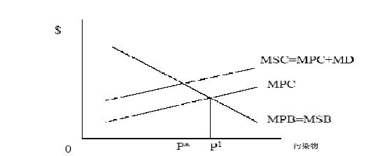

MPB=私人边际收益；MSB=社会边际收益 MPC=私人边际成本；MSC=社会边际收益；MD=边际破坏（marginal damage）

外部性的解决办法 

- 1．完成禁止

- (遵从问题)（例如：氯氟碳类物—CFCs）？ 

- 命令和控制（例如：核辐射） 

- 税收和补贴（例如：垃圾掩埋场） 

- 创造产权（例如：硫化物市场） 

- 5．直接控制

- /国家所有 

- 道义劝告

- 只要明晰界定产权，且独立于产权的最初分配，那么只要交易成本为零（并且没有财富效应）人们就能在自我利益最大化原则下协商而实现最优分配。 

- 在一系列的严格假设条件下，根据科斯定理，政府没必要干预市场，因为人们能通过交换使社会效率最大化。

例子：上游的造纸厂和下游的酿酒厂

科斯定理在实践中的运用 

- 从效率的观点来看，如果没有收入效应谁拥有产权并不重要？ 

- 这是一种关于“分配”的观点？为什么？ 

- 但是我们需要知道： ——交易费用不为零 ——小的受害者有搭便车问题——政府代表自己的利益时可能不知道如何做出决定 ——信息不对称：污染环境者比受害者信息充分 ——在寻求损害赔偿中存在机会主义 

- 运用科斯定理的情况： ——重要的私人信息——政府不易获得信息 ——对自愿的私人控制没有障碍 ——相关主体容易确认

例子 

l

造纸厂：πm=6m－0.5m2 

- 酿酒厂：πb=6b-0.5b2-0.5bm 

-  	m=造纸厂的产量,b=酿酒厂的产量。 

- 无规制下的均衡（首先解决 πm）： 

-  	m=6,b=3, πm=18, πb=4.5, πtotal=22.5。 

- 社会效益最大化（共同利润最大化） 

-  	m=b=4, πm=16, πb=8, πtotal=24。

解决方法 

- 一次性罚款，如果 πm比 18小将不会产生任何影响。 

- 特殊损害：如果纸厂被罚款 0.5bm？结果如何？ 

- 3.	假设罚款

- =损害（对受害者一次性赔偿的），会发生什么？ 

- 污染税等于每百万单位纸张产生的边际损害 0.5b。

公共物品 

- 一个真正的公共品具有两种特性： ——非排它性（MC=0） ——非竞争性的（不运用在消费方面） ——供应方面（例如：清洁的空气）的搭便车问题 

- l供应的最佳水平：个体需求相加得到总需求。 

- l支付方式影响支付意愿的表达方式。

<Table>
<TR>
<TH>Ⅱ Ⅰ</TH>
<TH>垂钓少量</TH>
<TH>垂钓大量</TH>
</TR>
<TR>
<TD>垂钓少量 </TD>
<TD>(10,10) </TD>
<TD>(2,12) </TD>
</TR>
<TR>
<TD>垂钓大量 </TD>
<TD>(12,2) </TD>
<TD>(5,5) </TD>
</TR>
</Table>

（X，Y）：X=国家Ⅰ的收获, Y=国家Ⅱ的收获。数字越高对本国越有利。

- 政府供应。但政府如何决定生产公共物品？ 

- 本地政府能够更好地理解本地公共产品的需求倾向？ 

- 中位选举人定理：假定人们有单峰偏好和一维政策选择，中位选举人的偏好就代表了大多数人的偏好。我们仍有帕累托原理（P）、不相关选择的独立性原理（I）、无专权原理（D），（源于阿罗不可能定理(Arrow's impossibility theorem)。 

- 表明在不同消费层次上的简单投票将导致代表最高支出水平的中位投票者的选择占主导地位，这种情况仍然满足 (P，I 和 D)。民主会给出正确的答案！

- 结论 

- 社会规制是关于外部性和公共物品的规制。 

- 死亡的风险价值和生命价值是难于测量的，正是这些难题困挠着社会规制。 

- 有效的社会规制的确存在，但这是复杂的和少见的。 

- 我们在以后的课程中分析近期运用税收和许可证的例子和建议。

- 下一课 

- l生命的价值 

- l相关阅读资料：VVH第 20章

         xml

               user

               第18课.doc

         2005-10-12T11:26:33+08:00

         pdfFactory Pro www.fineprint.com.cn

         pdfFactory Pro 2.30 (Windows XP Professional Chinese)

# 14.23 政府产业规制

## 

### 第 18课非市场物品的评价

麻省理工学院 &amp;剑桥大学

# 概述 

## 

- 非市场物品 

- 支付意愿和选择手段 

- 家用产品分析——烟雾报警器 

- 工资市场分析 

- 意愿调查价值评估法——洛杉矶（LA）的环境污染 

- 与规制的联系

- 论点 

- 我们需要通过成本收益分析法评价非市场物品吗？为什么？ 

- 价值的来源：

EPA和 OSHA 

- 管理当局应该制定评估环境舒适性的标准。 

- 在政策的成本收益分析中应该包括非市场物品的价值评估吗？ 

- 如何对没有市场价值的物品进行评估？ 

- 使用价值和非使用价值的区别（哪个在以前的目录里出现过?）。 

- 美国环保署（EPA）和职业安全和卫生条例（管理局）（OSHA）被明确禁止进行成本收益分析，为什么？在缺乏成本效益分析（CBA）的情况下，其行为将受到怎样的限制? 

- 支付意愿法应运用于评价非市场物品。这为什么与消费者理论一致？ 

- 其它可选方法 ——人力资本法 ——直接成本法 

- 我们通过支付意愿法、人力资本法或直接成本法评估生命的价值时会有什么不同？

- 评价支付意愿法 

- 揭示偏好法——家用产品分析(烟雾报警器等家用设备的购买) ——内涵价格法（对房价和工资的影响) 

- 说明偏好——支付意愿分析，例子：对抑制风险的支付意愿调查 

- 实验分析 ——揭示偏好法和支付意愿法的结合(对烟雾报警器的支付意愿的分析 ) 

- 研究市场对于无形产品的替代品或互补品的需求量以此推断出市场对无形产品的需求。 

- 例子： ——旅馆：旅行费用模型。旅行费用体现了成本。 ——避开行为模型：设备的成本可反应出对无形产品的支付意愿——烟雾报

警器？

•	假定： 

——存在能生产各档次无形产品的完整的间接市场。 ——准确识别已知的连续生产函数(知道市场产品的成本和由其带来的无形价值率) ——有使用价值。没有非使用价值，不是公共物品。

(克劳森 -尼奇) 

- 把一个给定的休闲娱乐场地的周围地区分成若干个区域，每个区域的游客的旅游费用不同。 

- 调查参观者来自哪个区域。 

- 统计参观者的区域分布。 

- 4.	发现成本

- /按区域访问，成本 =英里数*成本/英里数+时间的机会成本*到旅游目的地的时间。 

- 假设成本随着价格的增长而增长(一一对应关系) 。 

- 6.	旅行费用

- /旅游率。 

- 7.	旅行费用

- /旅行人数

- 假定一年共有 1000个参观者对 A、B、C、D和 E五个不同的地区进行参观。 ——A=400， B=300，C=200，D=100，E=0。 

- 从每个旅游区到目的地的成本包括旅游的时间机会成本： ——A=25,B=50,C=75,D=100,E=125。 ——从数据中可以看出，每年访问量和费用成反比。 

——随着时间变化旅行费用随着价格增长。得到各区域的需求曲线。 ——个体需求曲线相加得到总的支付函数。——支付意愿在需求曲线以下的区域。

•	假设需求是线型的、没有进入费用、各区域人口数相等、收入效应小和对

各区域的偏好相同、无重复参观现象、每次参观的时间一定、没有拥挤等等

烟雾报警器和生命的价值 

(达迪斯，1980年) 

- 一定是自愿购买，为什么？ 

- 假定对死亡风险改变的边际支付意愿等于设备风险的变动成本。 

- 花费=死亡率的变化*生命的价值(假定损害为零)。 

- 成本估计：在 1974年，一个烟雾报警器的价格是 52美元（报警器折旧率为 10%），加上电池的年花费 7美元，得到其的年均成本为 21.37美元。

烟雾报警器和生命的价值 

(达迪斯，1980年) 

- 火灾的死亡率：6492个家庭/74000000个家庭 

- 安装报警器后死亡率将减少 45% 

- 报警器正常工作的概率为 0.8。 

- 安装报警器后总风险将减少 0.0000315。 

- 生命的价值=成本/死亡率的变化 = 21.37/0.0000315=676，266美元 

- 这对规制和揭示偏好法意味着什么呢？

- 研究产品的价值怎样随其无形特征变化而变化，从而估计其支付意愿。 

- 如果你能辨别产品的差异性，你就能使用内涵价格法。 

- 通过研究有形产品价格随无形特征变化的情况，获得对无形价值的边际支付意愿。然后研究无形价值与 MWTP和无形价值与满足无形价值需求的收入水平之间的关系。

- 不包括非使用价值。 

- 如果你只是了解了价格和特性，那么你就面临一个需要这一功能鉴定的潜在的识别问题。

内涵价格法——生命的价值

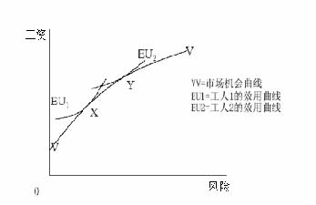

内涵价格法

——生命的价值 

l我们能通过工资和工作风险系数估计生命的价值：

n	n 

年收入 =α+β1年死亡风险 +� γi个人特性 i +� ψi工作特性+εi 

i=1 	i=1 

-  	β1=该情况下生命的价值。为什么？ 

- 在一系列的研究中，价值在一百万美元和六百万美元之间变化。 

- 在回归分析中重要的变量是什么，为什么？

- 意愿调查价值评估法 

- 能通过一次分析调查得到支付意愿（WTP），了解人们规避风险的支付水平。如果人们愿意支付 500美元来减少 1%的死亡风险，那么这就是他们的边际支付意愿。 

- 这要求假设的条件能实现。为什么这将是个问题？ 

- 能通过这种方法得到非使用价值吗(例如蓝鲸)？ 

- 问题是计算误差、不一致性、构造效应和“合理”效应（sounds reasonable effects）要影响结果。例如：英国安全调查的例子。

——洛杉矶的环境污染 

-  	1982年的洛杉矶关注空气的质量并努力通过有形的测定方法测定人们对优质的空气的支付意愿。 

- 图 3显示了低质、中质和高质的空气。 

- 边际支付意愿在不同条件下怎么变化？ 

- 从收入数据中发现人们愿意支付 5.55~28.18美元来改变空气质量。 

- 有多种方法对损害进行鉴定。 

- 在这种特殊情况下怎么运用另一种对支付意愿的测量法？

- 规制 

- 规制机构使用一致的生命价值标准吗？ 

- 生命价值是可以存储的吗？不同的人和不同的生命期间会有不同的生命价值吗？ 

- 美国环保署的例子。单位生命的最大价值是十亿… 

- 为什么未表现出一致性？ 

- 事实上是在许多情况下生命价值太高。但是在任何给定时期内，这种分析仍然可以确定 EPA预算的成本效率及其预算优先权

- 风险-风险分析 

- 风险分析就是对规制的不作为和规制的作为之间的风险进行对比。 

- 因为规制包括经济成本和隐含于抵消规制收益的理论价值中的预算成本，所以需要确定政府支出对人们的影响。 

- 社会规制使社会更加贫穷，五千万美元的支出将导致一个生命的统计损失。 

- 交叉效应（CROSS-EFFECT），规制可能引起需求向更高风险部门转移。例如，英国的哈特菲尔德碰撞事故。

- 结论 

- 计算非市场物品价值时使用了支付意愿法。 

- 有多种方法计算支付意愿。 

- 时间和地点的敏感性导致互相矛盾的结果的增加。 

- 但是他们的目的是做出决策。 

- 事实表明他们对风险了解得越多，他们越可能对非市场产品做出一致的支付意愿。

- 下一课 

- l环境规制导论 

- l相关阅读资料：VVH第 21章

         xml

               user

               第19课.doc

         2005-10-12T11:27:30+08:00

         pdfFactory Pro www.fineprint.com.cn

         pdfFactory Pro 2.30 (Windows XP Professional Chinese)

# 1 4.2 3 政府产业规制

# 

麻省理工学院 &amp;剑桥大学

# 概论 

- 基本的规制手段 

- 等效的规制手段 

- 税收和目标 

- 税收和补贴 

- 复合污染源的规制和许可证 

- 美国环保署（EPA）和美国的污染物规制 

- 市场机制的未来

- 基本规制手段 

- 基本规制手段 

- 税收 

- 补贴 

- 责任 

- 许可证 

•	复杂性 ——空间和时间 ——不确定性 

作为谈判博弈的科斯定理 

- 说明在有效的结论中所担当的角色： 

- 基本的例子：公司排放污水 ——对公司来说，污水处理的主要费用是 100美元 ——对市民来说，水的净化费是 300美元

- ——对市民来说，环境损害的价值是 500 美元 

- 拥有产权的污染受害者。公司的最高出价是 100美元，出价不包括对受害者的补偿，因此受害者拒绝接受，公司只好安装污水处理设备。 

- 拥有产权的污染者。市民的最高出价是 300美元，公司可接受的底价是 100美元，因此，公司在谈判力量均等的情况下得到 100+100美元 

- 两种情况下结果相同，但花费不同。哪种更优？

- 命令和控制政策 

- 管理者规定污染者必须采取措施。这些措施包括制定每个污染源的最大排污率(例如一组烟囱 )。美国环保署（ EPA）制定工业技术标准并监督污染者达到这个标准。 

- 如果美国环保署能获得有效的充分多的信息，将使规制有效率。 

- 对违规行为要进行重罚。为什么？ 

- 正方：结果的确定性和简单的监控和实施。 

- 反方：没有创新激励机制。不等于减少污染的边际成本，这个结果并不令人乐观。

- 经济激励 

- 费用或者庇古税（Pigouvian taxes）/补贴，其代表边际损害成本并且假定其等于减少污染的边际成本。 

- 许可证：买卖排放污染的权利。市场使许可证具有了价格，也使公司面对边际损害成本。 

- 责任：通过采取行动使公司认识到对环境污染负有责任。例如，使用排放的污染废弃物。这给了公司降低污染的激励。

- 经济激励 

- 正方：创新的激励，污染者付费和满足边际相等原则。 

- 反方：不能处理好时间和空间的变化。难于对通货膨胀或者新情况做出及时的调整。大量财富转移引起政治问题。

- l而且 

——边际损害和边际需求函数的不确定性意味着市场的成本和产量是变化的。我们注意到了吗？ ——规制污染物是容易的。但是实际上我们只注重环境空气质量。这个和地理位置有关。

l税收，补贴，许可证，责任或者命令控制可取得相同的效果。为什么？

- 可以评估短期的效果。 

- 税收： 

-  	e=ay（固定的污染比例） 

-  	TC(y,e)=VC(y,e) + te + FC 

-  	TC(y,ay)=VC(y,ay) + tay + FC 

-  	MC(y)=MVC + at：税收增加了 MC。 

- 补贴： 

-  	TC(y)=VC(y) + FC-s(eu-e)：eu= 没有规制下的 e 

-  	TC(y)=VC(y) + say + FC -seu 

-  	MC(y)=MVC(y) + sa：如果 s=t 得到相同结果。

- 税收和补贴 

- 从短期看没有进入效应。但从长期看，生产成本已经发生变化，所以存在进入效应。

- 补贴影响平均可变成本（AVC）。 

- 如果 y&gt;0，平均可变成本（AVC）下降 seu/y。 

- 这表明随着长期平均总成本(LRATC)的下降一些非盈利机构将继续运作。这意味着有补贴时将有更多的公司进行运作，并促使价格降低。

设定一个与 A和 B相关的税收体系和许可证体系的成本是多少？

- l动机：1970年前没有关于环境质量的协调标准或国家标准。1970年美国美

- 国环保署（ EPA）成立，负责制定并且改进关于环境的国家标准。从那以后，规制费用大约占国内生产总值（GDP）的 1~2%。 

- 美国环保署（EPA）的权限： 

- a) 	在不考虑成本的情况下确定关于人类健康的环境质量的国家统一标准： 

- b)确定技术标准 

- c) 	把对人类其它方面的福利（如：建筑物，庄稼……）保护作为次要标准，确定严格的汽车排放标准。 

- l美国环保署确定标准。其确定的标准必须符合州实施计划（SIPS）并说明

他们将怎样达到这些标准。地方和地区机构必须向联邦政府报告实施计划。

- 实施：若联邦政府不遵守相关的规章制度，美国环保署可以不服从联邦政府的经济目标。同时，美国环保署也能禁止较大的新污染场所的建设或者要求对现有的污染源进行整修。 

- 背景：1970年 7月 9日，美国环保署由以下部门合并成立：内务、健康、教育和福利部、农业部、原子能委员会、联邦辐射委员会和环境质量委员会。 

- 区别性：美国环保署的任务是对自然垄断行业进行规制。此外，美国环保署是对整个行业进行规制，而并不是对单个行业进行规制。 

1、社会现状偏见：和现行的法律法规有异的法律和政策的很难被贯彻执行。 2、位置偏见：污染问题因地理、人口和产业的差异性而不同。 3、本地化：由于地方政府非常关注当地经济利益而会在一定程度上抵触，税收

和标准的制定将成为一个难题。但是在实施过程的不确定性也可能是个大的

难题。 4、不确定性：成本和收益的不确定性。最优控制机制取决于对不确认性的全面

认识和了解。 5、通货膨胀：将对税收或成本产生较大的影响。成本是固定的和非指数化的。 6、无偿分配（grandfather）：保护现有厂商吗？为什么？ 7、对经济增长的影响：规制抑制发展吗？

- 定义：稳定的污染源：污染源是固定的。包括：一组烟囱和烟囱等等 

- 在美国,美国环保署管制大约 27，000个主要的稳定空气污染源(通常指污染物&gt;100吨/年)。

- 担心以下领域的环境恶化：1、本地或者地区的污染物可能引起表面空气(对流层)的质量恶化 2、全球范围的环境恶化：上层空气(平流层)的空气污染。 

- 污染物连续排放或者间断性排放 (例如发电厂和小汽车)。那么，政策应该是保持一致性还是怎么？ 

- 污染物和空气质量之间的复杂关系。 

- 如果我们正处理本区域的污染物，那么，我们为什么不只在国家或本地规制制度下处理污染物？

- 空气净化法 (CAA) 

- 区分两类污染物 

- 标准污染物或者传统污染物：假设这些污染物比较普遍，且只在高浓度情况下有危险。普遍存在于自然界中：二氧化硫，一氧化氮，氧化氮，铅，臭氧(氧化氮+ 烃：在下层空气中有害，而在上层空气中即使极少数也会产生危险)，TSPs（技术规格）。 

- 2.	危险污染物

- (不在这里讨论识阈效应) 

- 对于不同的标准污染物，CAA制定了不同的环境空气质量标准(NAAQS)，并限定了当地的污物最大排放量 (超过特定时间段的平均量：短期和长期)。 

-  	20世纪 70年代中期以前，州政府通过 SIPS制定出各排污单位达到排污标准的时间表，但直到 1975年仍有很多厂商没有达到标准，因此期限被延迟至 1982年，而对 CO和臭氧的排放期限则延迟到 1987年。加州南岸地区也正

为使空气质量达到该标准而努力。

- 城市的污染程度比农村严重。但随着时间的推移，农村的污染程度也会越来越严重。政府对污染比较严重的市区实施更加严厉的规制，这将使厂商将生产转移到更清洁，规制相对弱的地方。因此，西拉俱乐部（Sierra club）起诉美国环保署未履行使干净的地方保持干净的职能。

- 所以我们得到： 

- 防止明显恶化地区（prevention of significant deterioration—PSD）：防止空气

- 质量好的地区的空气质量发生恶化。 

- 未达标区：联邦对未能达到标准的地区强制执行规制。 

-  	PSD地区：在最优的可控技术条件下对新污染源进行控制。现有的污染源的污染度不大。在尽可能大的范围内增加限制。防止空气质量高于标准的地区的空气质量发生恶化，以至于逼近甚至超过标准。

- 对 CAA的修正 

- 未达标区：如果不能达到排污标准，那么新建或扩建的污染源需面对新的许可证问题。新的污染源必须达到“可实现的最低排放速率”(Lowest achievable emission rate——LAER)。现有的污染源必须安装合理可得控制技(Reasonable available control technology——RACT)。 

- l新污染源实施标准（New source performance standard—— NSPS）应该基于最好的技术系统。即 NSPS的规制比 LAER和 RACT更严厉，将影响所有的排放物。 

- 国会制定了违规惩罚条例。任何经济体排放的污染物没有遵循美国环保署的 W/A条例将会受到美国环保署的惩罚！任何经济体服从法规将使产量削减 30-40%！ 

- 注意：政府对现有污染源的规制。

- 标准被定在有效的水平上吗？或许不是因为缺乏成本效益分析（CBA）。 

- 标准的一致性：不需考虑人口密度，当地气候条件和实施的当地成本的差别。 

- 排放物的扩散时间：通常主要标准是长期年度标准。实际上，排放物的短期扩散时间决定成本？也许短期排放物对健康的影响更大？工厂排放物难以在短期内扩散。 

- 为什么美国环保署对新污染源采取了更严格的标准？会产生什么样的结果？

（哈恩, 1989年） 

- 从早期的四个关于市场机制运作的实验中得出如下结论 ——过低的税收无法禁止产量的大幅提升。 ——许可证市场的交易冷清。 ——但有一些积极的经验。特别是，美国制定了第 1982-1987贸易计划 

- 市场机制作用增强的原因： ——随着时间的推移，减少污染的边际成本提高（减少排放物的边际成本随

- 经济学家建议运用经济工具对环境的外部性进行规制 

- 基于机制（税收和许可证）的市场有益于创新和均等化边际。可以以最低的成本达到环境目标。 

- 当测量变得更复杂，更经济时，就可以实施更加复杂的市场设计 (例如日间交易) 。 

- 收益的分配问题仍广泛存在。关键是由谁承担相关成本？

- 下一课 

- 清洁空气的市场 

- 相关阅读资料：Joskow, P.L, Schmalensee, R.和 Bailey, E.M. (1998), “二氧化硫市场”, 《美国经济评论》, 第 88卷 (九月),第 669~685页。

         xml

               user

               第20课.doc

         2005-10-12T11:28:17+08:00

         pdfFactory Pro www.fineprint.com.cn

         pdfFactory Pro 2.30 (Windows XP Professional Chinese)

# 1 4 .2 3政府产业规制

## 

第 20课：清新空气市场

麻省理工学院 &amp;剑桥大学

- 酸雨和其对环境的影响 

- 美国的“酸雨计划” 

- 许可证交易的基本理论 

- 市场经验 

- 评价效用 

- 加州地区的区域清新空气的激励市场计划(RECLAIM——Regional Clean Air Incentive Market,1993年)中关于 NOX的计划 

- 区域清新空气的激励市场计划和加州的电力危机

- 酸雨污染物 

- 主要由火电厂的二氧化硫（SO2）和氧化氮（NOX）排放物引起。 

- 典型的环境外部性。欧洲的情况为什么和美国不同? 

- 酸雨的影响： ——呼吸健康(死亡率和发病率) ——能见度(娱乐和居住) ——垂钓(娱乐) ——森林(德国) 

(Burtraw et al, 1998年) 

注：包括 SO2和 NOX 

表 Ⅵ

过去一段时间和 2010年间，美国东部地区 HB和 TAF的死亡率和硫化物收益率的百分比变化。

<Table>
<TR>
<TD>年</TD>

<TD>分 </TD>
<TD>EPA/HB </TD>
<TD>新的传播方式</TD>
<TD>新的排放物</TD>
<TD>新的健康 TAF</TD>
</TR>
<TR>
<TD>排</TD>
<TD>放</TD>
<TD>物 </TD>
<TD>EPA </TD>
<TD>EPA </TD>
<TD>TAF </TD>
<TD>TAF </TD>
</TR>
<TR>
<TD>传播方式 </TD>
<TD>ASTRAP-TAF </TD>
<TD>ASTRAP-TAF </TD>
<TD>ASTRAP-TAF </TD>
<TD>ASTRAP-TAF </TD>
</TR>
<TR>
<TD>健康/评价 </TD>
<TD>H B </TD>
<TD>H B </TD>
<TD>H B </TD>
<TD>H B </TD>
</TR>
<TR>
<TD>平均数收益 (百万\$) </TD>
<TD>30 </TD>
<TD>57 </TD>
<TD>25 </TD>
<TD>15 </TD>
</TR>
<TR>
<TD>百分变化数</TD>

<TD>＋88% </TD>
<TD>-56% </TD>
<TD>-39% </TD>
</TR>
<TR>
<TD>每吨的收益（\$） </TD>
<TD>3,300 </TD>
<TD>6,200 </TD>
<TD>6,300 </TD>
<TD>3,900 </TD>
</TR>
<TR>
<TD>收益(百万\$) </TD>
<TD>19 </TD>
<TD>35 </TD>
<TD>15 </TD>
<TD>13 </TD>
</TR>
<TR>
<TD>百分变化数</TD>

<TD>＋82% </TD>
<TD>-56% </TD>
<TD>-17% </TD>
</TR>
<TR>
<TD>每吨的收益（\$） </TD>
<TD>2,100 </TD>
<TD>3,700 </TD>
<TD>3,800 </TD>
<TD>3,200 </TD>
</TR>
</Table>

资料来源：Burtraw et al.(1998) 

许可证的基本概念 

- l总量控制和交易政策 

- l容量节余政策(厂区内) 

- l补偿政策(若该地区排污量减少，可新建污染源) 

- l气泡政策(工厂间) 

- l银行—储备富余排污权

•	预支未来排污权

美国 1990年的《清洁空气法》修正案（ CAAA） 

- 首先，布什政府实施了大型煤动力及石油动力的电力企业的 SO2(酸雨的主要成分)排污许可证的交易(CAAA第 IV章) 。 

-  	1990年制定的法规涉及第一阶段 (1995年〜1999年)和第二阶段 (2000年至

- 今)。 

- 在第一阶段， 263家大型企业受到影响。 

- 在第二阶段，所有电力企业受到影响。 

- 在任一年度，所有企业都必须获得排污许可证，否则将会受到处罚。

- 许可证市场构成 

- 未来 30年内,每年发行的许可证数量并不确定(一般超过 2000个)。许可证的存在进一步减少污染物的排放。 

- 根据规章，每个新建和已建的电力厂商有权分配排污权。 

- 美国环保署每年大约保留2.8%的排污许可证来进行拍卖，所得收益用来奖励发电商。拍卖的许可证包括本年度和未来7年内的许可证。 

- 美国环保署拍卖的许可证的另一个来源是私人持有者提供的许可证。拍卖是通过竞价拍卖来进行的。 

- 大多数交易是在场外进行的双边交易。

- 许可证市场效率 

- 在位厂商可能储备许可证并拒绝对其进行交易，为什么？ 

- 拍卖可能没有效率。 

- 拍卖理论认为竞价拍卖的价格低于定价，为什么？ 

-  	Joskow et al(1998年)试图分析市场效率。

图 1价格矩阵（1995或者当年）资料来源：Joskow et al，1998年

市场交易量

表 Ⅰ 

EPA拍卖的和私人市场交易的许可证量

<Table>
<TR>
<TH>时</TH>
<TH>期 </TH>
<TH>E P A 拍卖</TH>
<TH>私人交易</TH>
<TH>总</TH>
<TH>数 </TH>
</TR>
<TR>
<TH>1993年 3月间 1993年 4月〜1994年 3月 1994年 4月〜1995年 3月 1995年 4月〜1996年 3月 1996年 4月〜1997年 3月 </TH>
<TD>150,010 176,200 176,400 275,000 300,000 </TD>
<TD>130,000 226,384 1,466,996 4,917,560 5,105,924 </TD>
<TD>280,010 402,584 1,643,396 5,292,560 5,405,924 </TD>
</TR>
<TR>
<TH>总</TH>
<TH>数 </TH>
<TD>1,077,610 </TD>
<TD>11,836,864 </TD>
<TD>12,924,474 </TD>
</TR>
</Table>

私人市场交易的许可证包括电力公司间与电力公司和第三方与非电力公司间的交易。许可的数量不包括公司内部的交易和再分配和未实施的期权交易，但是包括控股公司内部的交易。资料来源：Joskow et al，1998年

图 4a 第一阶段的排放量，价格控制和非实际

http://web.mit.edu/ceeper/www/2003-003.pdf

表Ⅱ涤气器成本的变化

<Table>
<TR>
<TH>第一阶段前</TH>
<TH>第一阶段后</TH>
<TH>第二阶段</TH>
</TR>
<TR>
<TH>最初的资金成本(\$/KWe) </TH>
<TD>\$240 </TD>
<TD>\$249 </TD>
<TD>\$150 </TD>
</TR>
<TR>
<TH>每 KWe排出的 SO2量 </TH>
<TD>\$99 </TD>
<TD>\$137 </TD>
<TD>\$137 </TD>
</TR>
<TR>
<TH>每吨的固定成本(\$/ton) </TH>
<TD>\$273 </TD>
<TD>\$206 </TD>
<TD>\$124 </TD>
</TR>
<TR>
<TH>固定的 O&amp;M成本(\$/ton) </TH>
<TD>\$75 </TD>
<TD>\$15 </TD>
<TD>\$15 </TD>
</TR>
<TR>
<TH>变化的 O&amp;M成本(\$/ton) </TH>
<TD>\$116 </TD>
<TD>\$65 </TD>
<TD>\$65 </TD>
</TR>
<TR>
<TH>每吨的总成本(\$/ton) </TH>
<TD>\$464 </TD>
<TD>\$286 </TD>
<TD>\$204 </TD>
</TR>
</Table>

http://web.mit.edu/ceepr/www/2003-003.pdf

在命令和控制政策下评估收益 

- 允许排污单位根据规制的收益率来转移成本。在完全竞争市场形成前，还不清楚如何通过激励促使厂商降低硫化物的使用率。 

- 为了保证煤矿业的就业率，政府允许污染严重的发电站投资购置用于清洗废

- 气的涤气器。 

- 在早些年,这可能导致比政府规制更高的费用。 

- 但是估计在第一阶段，节约了大约 3.5亿美元的费用，即大约一半的监管成本。

(埃勒曼， 2003) 

- 实质上，排放标准在 2000年前并没有什么改变。在这之前公司为什么希望在最高限价下降低排污量？ 

- 电厂的替代燃料。与行政和命令政策下对低硫煤的使用的比较如何呢？ 

- 涤气器的成本效应。为什么相对于政府规制下指定的涤气设备，现在的成本下降了？ 

- 总的转换效应是什么？

- 许可证的分配 

- 为什么把许可证分配给在位厂商是个好办法？相对于拍卖和税收制度，许可证制的缺点是什么? 

- 在这种情况下，许可证交易制对从交易中获得的利益影响较小。 

- 我们能从二氧化碳排放许可证交易制度中借鉴什么呢？

- 美国 SO2总量控制和交易政策 

- 许可证储备是有益的，并且公司以适当的方式加以利用也是有益的 (适于环境和高峰负荷定价)。 

- 对激励的自发反应是强有力的和有效的。 

- 相对于政府规制而言，空气的产权使其有效的和环境无成本的进行交易。 

- 适当设计的市场容易了解其收缩和扩展过程。

- 在 1993年，区域清新空气的激励市场计划制定了 SO2 和 NOX污染物在南岸

- 空气质量管理区域内排放的规章。 

- 该计划比政府的 SO2计划影响了更多的部门，但是不允许储备。 

- 从 1994年氧化氮的排放许可证开始颁发，到 1998年供大于求，但在 1999年许可证的颁发量有显著的下降。 

- 在 1999年，每公吨氧化氮排放权的价格是 1,500~3,000美元，2000年价格上涨为 4,300美元。

http://www-hoover.Stanford.edu/publications/books/fulltext/electricity/81.pdf,p.118

. 

(Sweeney，2002) 

-  	2000年的前 10个月每公吨氧化氮排放权的价格提高到 45,000美元。 

- 对于用天然气发电的发电厂，氧化氮的排放量较小(每兆瓦时产生 0.1磅)。排放权价格上涨到 45,000美元时，使每兆瓦时的电力价格提高了 2.25美元。回顾加州电力价格的变化？ 

- 但是对于旧的燃气涡轮发电器来说，每产生一兆瓦时电力将产生 4磅氧化氮，他们将接受 90美元的罚款。这对于均衡价格有重要影响。 

- AES的案例 

-  	NOX排放量控制制度意味着对新增发电机组的限制将使发电厂有效控制排污量。 

- 发电公司（AES）在 2000年超量排放了污染物 600吨。一共被罚了三千七百万美元，即为每吨支付了 28,000美元的罚款。或者说，购买排放许可证弥补了损失，三大公共设施安装了技术设备并减少了未来的分配？值得吗？ 

- 计划正在卷入麻烦中，因其抬高了电价和使发电厂重新回到了政府规制下。 

- 计划与危机有关吗？如果回答是否定的，为什么？ 

- 该计划是否会导致负面的激励效应，如何分析？ 

- 注意：地区因素导致氧化氮在加州的高边际破坏成本（其它地方 1000美元每吨）。

- 结论 

- 产权一旦界定，科斯定理适用于 SO2 和 NOX市场。在多个买方与卖方的市场中，监控效果好和交易费用低。 

-  	SO2和 NOX排放许可证的交易制度有效的达到了政府的数量控制目标。 

- 但是，在 MSC = MSB相等的条件下，其隐性成本很高，这些最后将由消费者支付。 

- 下一个问题：减少温室气体排放机制的设计能否借鉴这些经验？

- 下一课 

- 二氧化硫市场 

- 相关阅读资料： Chichilinsky, G.和Heal, G.(1993年), “全球环境危机”,《经济视野》, 第7卷,第4期(1993年秋季), 第65~86页。

         Acrobat Distiller 5.0.5 (Windows)

         2003-07-28T02:17:20Z

         2003-08-18T12:01:46+05:30

         2003-08-18T12:01:46+05:30

         PScript5.dll Version 5.2

         xml

               bersara

               Microsoft PowerPoint - 14.23 Class21.ppt

# 14.23 Government Regulation of Industry

Class 21: Markets for Greenhouse Gases

MIT &amp; University of Cambridge

1

Outline 

-  The GHG problem 

-  Some Economics relevant to Climate Change 

-  Marginal damage costs of Climate Change 

-  The Nature of Uncertainty 

-  Economic Policy and Uncertainty 

-  Benefits of International Co-operation 

-  McCain-Lieberman Draft Bill 

2

Source: Reilly et al., 2003, http://web.mit.edu/globalchange/www/PewCtr_MIT_Report03.pdf, p.5. 3 

Potential damage of rising climate

- Sea level rise leading to: dryland loss, wetland loss, coastal protection and migration. 

- Agricultural output and distribution of output effects. 

- Heat stress, cold stress, malaria, tropical cyclones, extra tropical storms, river floods and unmanaged ecosystems. 

- The effect of these would be deaths, migration and increased mitigation expenditures. 

- Standard estimate range is that average global temperature will rise by 1.5-4.5C by 2100. 4 

Some difficulties in assessing climate change

- We are actually talking about managing risk under uncertainty. There are two ways of dealing with this: insurance and mitigation. 

-  Problems for analysis: 

-  Difficulty in assessing risks. Why? 

-  Risks are endogenous. Why? 

-  Individual risks correlated with each other. So, what? 

-  Irreversibility. How is this significant? 

5

Is insurance the answer?

- If I (or the UK) am worried about climate change, why can’t I (or the UK) just take out an insurance policy? 

-  State of nature contingent markets do exist: 

-  Chicago Catastrophe Futures 

-  Monte dei Paschi di Siena agricultural insurance 

- In theory it might be possible for countries to offer insurance on the basis of differences in their perceived risk. 

-  Why will conventional insurance mkts have to deal 

with climate change? 

6 

How insurance might work

- Two countries (1&amp;2), two states of the world (a&amp;b), pa=0.1, pb=0.9. 

- If country one has w1(a)&gt;w1(b) and country two has w2(b)&gt;w2(a) then there is opportunity to reduce the minimum outcome by trading (i.e. insurance is possible). 

- If climate state is a then 1 transfers Da,1,2 to 2 and if it is b 2 transfers D b,2,1 to 1 such that 0.1 Da,1,2 –0. 9D b,2,1 =0. If there is uncertainty about probabilities we need to ensure for all probability distributions. 

- Countries that are differently effected by climate change could raise welfare by trading insurance. 7 

Difficulties of making agreements on climate change

- Free-rider problem and incentives to enforce schemes internally (why?). 

- Usually enforcement of collusive agreement mechanisms do not work (for example?). 

- Equalisation of marginal emissions abatement cost is not optimal at national level (why?). 

- What implications might this have for a global CO2 tradeable permit system? 

8

Option values and irreversibility

- Option value and non-use value are closely related. Why? 

- Value of waiting before taking action is that you may find that cheaper ways to address the problem in the future. 

- Cost of waiting to take action is that damage may be irreversible if early action not taken. 

9

Option Value p 1-p t=0 t=1 Choose conservation level c0; Benefit is b0&lt;0 

State s1: choose conservation level c1 payoff is b1&lt;0 

State s2: choose conservation level c2 Payoff is b2&gt;0 

At t=0 we have one unit of an environmental asset.In s2 payoff increasing in amount of environmental asset.If decision at t=0 is reversible, then c0=0, c1=0, c2=1.If decision at t=0 sets maximum amount of c at t=1, then c0(b0+(1-p)b2), this is the net option value(assuming c1 can be set to 0).

10

How uncertainty effects allocation of consumption across time

Marginal Utility 

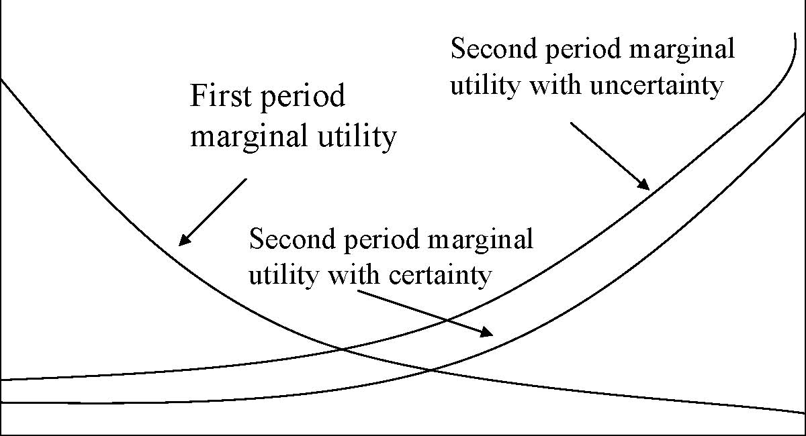

First period marginal utility Second period marginal utility with certainty Second period marginal utility with uncertainty 

c1 c2

Fixed amount of consumption to be allocated between period 1 and period 2. Thereis a possibility that the resource will be valued more highly by a future generation.

11 Uncertainty makes case for conservation only when expected return to postponement is positive. 

1990 Prices, 5% Discount Rate, World GDP = \$16500 (1990). Total = 1.3% GDP 

Source: Tol, R.S.J. (1999), ‘The Marginal Cost of Greenhouse Gas Emissions’, Energy Journal, Vol.20, No.1, pp.61-81. 

12 

Source: Tol (1999). 

13 

Equity Issues 

Dworld=ΣregionsDregion(Yworld/Yregion) 

D=damage, Y=income per capita. 

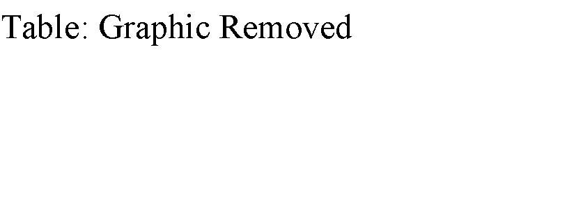

14

Source: Tol, 1999. 

15 

Source: Tol (1999). 

Source: Tol (1999). 16

Uncertainties in Climate Change

-  Three uncertainties in the MIT-IGSM Climate Model: 

-  Uncertainty about the Atmosphere-Ocean circulation. 

-  Uncertainty about rate of heat uptake by oceans. 

-  Uncertainty about the radiative forcing in response to given aerosol loadings. 

- With no policy mean rise in global temperature is 2.4C with a one in twenty chance of being outside the range 1.0 to 4.9C. 

- The result of a policy restriction is that mean rise is 1.6C with a one in twenty chance of being outside the range 0.8 to 3.2C. 

-  How would you assess the option value of policy? 17 

MIT-IGSM Policy Scenario

- Kyoto implemented by all countries including US in 2010, the cap is then lowered by 5% every 15 years for Kyoto cap countries. For other countries they are capped in 2025 at 5% below their 2010 levels and this is reduced by 5% every 15 years. 

-  Assume only CO2 capped. 

- The result of this is CO2 emissions fall but concentration continues to rise. 

-  Why would you want to bring in other GHGs? 

18

The impact of policy on probability of climate change

95% upper bound 

Source: Webster et al. (2002), http://web.mit.edu/globalchange/www/MITJPSPGC_Rpt95.pdf, p.12-13.

19

Methane is 20 times more potent than CO2 by weight, N2O is 300 times more potent, other gases can be 1000s of times more potent. 

Source: Reilly et al., 2003, http://web.mit.edu/globalchange/www/PewCtr_MIT_Report03.pdf, p.24. 20 

Benefits of GHG Emissions Trading

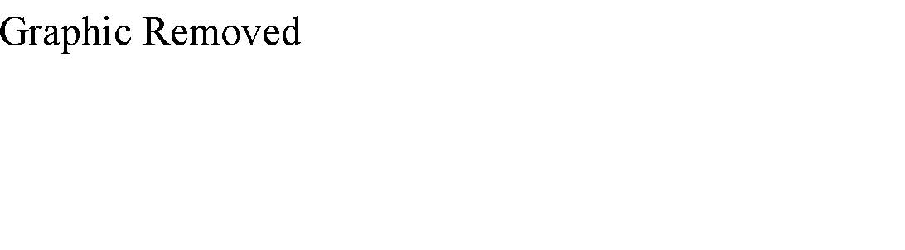

Source: Jacoby et al.(1996), http://web.mit.edu/globalchange/www/MITJPSPGC_Rpt9.pdf, p.15. 21

Lieberman/McCain Draft Proposal on Climate Change

- Target: 2010 US GHG emissions to be reduced to 2000 level, by 2016 emissions to be reduced to 1990 level. 

-  Allowances to be issued by grand-fathering and auction. 

- All entities emitting more than 10K tonnes per year of GHGs will need permits. Residential and agricultural sectors will not be covered but petroleum refiners and importers will need permits for the GHG emissions produced by their products. 

-  Banking and borrowing (at 10% interest) allowed. 

- Initially 15% of any entity’s reduction may be from another nation’s market for GHGs. 

-  Credits for manufacturers who improve fuel economy. 

- Administered by EPA with auction proceeds reducing energy costs and assisting disproportionately affected workers. 

22 

See http://www.senate.gov/~lieberman/press/03/01/2003108655.html

Conclusions

-  GHGs represent a problem of risk management. 

- The costs of GHGs are potentially large but are actually small in NPV terms at the moment. 

- Policy intervention reduces the risk of extreme climate change more than it reduces mean climate change. 

- Tradable emissions permit systems should include all relevant gases and need to handle problems of different valuations of damage across countries. 

- Proposals exist for permit trading systems and their implementation is highly likely. 

23 

Next 

-  The Regulation of Workplace Safety 

-  Read VVH Chapter 23

24

         xml

               user

               第22课.doc

         2005-10-13T11:49:21+08:00

         pdfFactory Pro www.fineprint.com.cn

         pdfFactory Pro 2.30 (Windows XP Professional Chinese)

# 14.23政府的产业规制

## 

第 22课：工作场所的安全规制

### 麻省理工院 &amp;剑桥

学大学

大纲 

- n通过市场促进健康和安全 

- n健康、安全和信息 

- n职业安全与卫生管理局（ OSHA）的规制方法 

- n职业安全与卫生管理局（ OSHA）政策的效果 

- n职业安全与卫生管理局（ OSHA）的机构改革

通过市场促进健康和安全

为什么劳动力市场有助于促进健康和安全？ 

- n由于工作风险，每年要支付 700亿美元的风险补贴。 

- n风险补贴反映了工作的危险程度（这些保险可补偿生命价值） 

- n工人和消费者详细了解了产品，因此可通过其风险度来形成安全

标准。

我们能否依赖市场来促进健康和安全？ 

- 亚当斯密发现工人对于更危险和更不愉快的工作，要求获得更高的报酬。 

- 这是由于：风险意识和对健康安全的偏好。 

- 有些人愿意冒险从事危害健康和安全的工作（正相关）。 

- 赫希和维斯库斯 (1990)发现吸烟者和不系安全带的人更愿意从事危险的工作。 

- 面对提供更低的健康或安全保障的公司时，以上这些对工作动机有何影响？ 

- 由于工资级差理论充分反映了风险偏好，工人必须意识到他们面临的各种风险。 

- 事实说明，工人的安全风险意识与实际风险存在很强的关联性（密歇根大学工作条件调查中心提供的数据）。 

- 但是证据显示工人没有充分掌握信息。 

- 工资补贴：化学及其制品业占 3-5%，伐木及木材制品占 12-15%。 

- 如果工人在对某一工作的潜在风险没有充分理解的情况下开始工作，工作后就会发现这些风险，这时候他们会重估风险或放弃。 

- 因工作风险辞职的员工占机械工业辞职总人数的 1/3。 

- 高风险岗位的流动性更高，工作周期更短。 

- 这种情况下的公司面临的激励机制：他们应把厂址建在何处，雇佣何种员工，为工人提供多少培训？

-  	1984年美国的健康安全诉讼赔偿为 150亿美元， 90年代末达到

- 了 262亿美元。 

- 如果工人知道能够获得补偿金，这种补偿金制度会对他们的行为产生怎样的影响？ 

- 摩尔和维斯库斯 (1990)估计，由于有了补偿金，工人的工难事故下降了 1/3。 

- 维斯库斯和摩尔(1987)认为补偿金制度可以使劳动力市场上的低工资收入者获得补偿收益，为什么？ 

- 补偿范围过宽，可能仍有问题存在。

- 信息问题 

- 由于信息不充分，可能导致市场失灵，例如对工作、公司的危险性或对产品质量缺乏全面认识。 

- 工人和消费者仅知道与工作或产品有关的平均危险程度。面对柠檬市场问题（Akerlof，1970）时，会发生什么呢？

汽车部门安全性获得充分团体价值增益或损失信息的消费者 

- 0.2高 

- 30000 23500 +6500 

- 0.3中等 

- 25000 23500 +1500 

- 0.5低 

- 20000 23500 -3500

信息问题 

•	在劳动力市场，为了提高工人的安全保障，公司不得不支付比他

们本应支付的工资更高的报酬，这使他们失去了竞争力。 

- n解决柠檬问题：——担保人和被担保人签定个人保证书。 ——政府对安全标准的设置。——自愿行为（例如，担负安全责任的公司的联合）

- 信息规制 

- 不要因为信息的不确定性而取缔商业活动。 

- 对风险进行评估具有个体差异。 

- 进行使用规制成本较高。 

- n信息规制非常奏效： ——下水道通剂标签: 使用时请戴橡皮手套 ,置于儿童接触不到之处 (63% 至 82%; 54% 至 68%)。实行标签规制后会做更多正确的事情。 ——《营养标签及教育法》要求给产品贴上标签。即便沙拉酱自诩为 “低脂肪”，其脂肪含量也存在差异。《营养标签及教育法》颁布后，高脂肪食品遭遇销售额大跌重创。

职业安全与卫生管理局（ OSHA） 

• 	OSHA采用的方法受到 1970年的“职业安全和健康法案”的规定来确保工人健康和安全，但 OSHA没在立法中细化应如何达

到这些标准。

<Table>
<TR>
<TH>• </TH>
<TD>OSHA拥有雇员 2200名（在社会规制机构中次于环保署），4.35</TD>
</TR>
<TR>

<TD>亿美元的预算，OSHA进行 37493次调查，26个州进行他们自</TD>
</TR>
<TR>

<TD>己的调查。 </TD>
</TR>
<TR>
<TH>• </TH>
<TD>OSHA的传统规制方法采用技术标准规制，这些标准的严格程度</TD>
</TR>
<TR>

<TD>受到其自身供给的限制。违反标准就会受到罚款。还可能采用其</TD>
</TR>
<TR>

<TD>他什么方法？ </TD>
</TR>
</Table>

OSHA的分析方法 

- 不运用成本效益分析的 OSHA，就必然担心公司因标准问题而倒闭。 

- 美国最高法院在 1981年取消成本效益分析，一旦技术支持，棉尘标准就可行。 

- 白宫预算办公室进行成本效益分析。 

- 标准细化到了可笑的程度：指定栏杆的高度、位置的范围等等。

- 标准应如何细化？

- 分析方法变革始于卡特政府，运用化学标签规制来强调市场监管

力度。

工人对化学标签的反应

小苏打氯苯乙酮三硝基甲苯石棉

认为工作风险高于

一般水平的那部分人

的变化（有标签后） -35% 45% 	63% 58% 

增加年薪水的要求（美元） 0 1900 3000 5200 

资料来源：维斯库斯和 O’Connor (1984) 

OSHA有效吗？ 

;- 每年约进行 9万次调查（包括 26个州的调查）。每年的罚款超过 3千万美元。这于美国的工作场所数目而言当属很少的罚金。大多罚金集中在安全而非健康方面。 

- n一个理性的企业将会计算： 

OSHA有效吗？

n 

风险 t= α + β1风险 t-1 + β2循环影响 t +β3产业特性 t+β4工人特性 t + b�OSHA -1 +εi

5 tt =0 

例：Ruser 和斯密 (1988)发现 20世纪 80年代早期，OSHA检查降低了 5-14%的受伤率。这种分析达到最优了吗？ 

OSHA的结论 

- 应该将重点转移到健康市场，因为健康市场更加失灵（有证据显示 OSHA正在这样执行）。 

- 集中于有重大影响的检查（1999年开始实行有特定的检查计划） 

- 重点转移到行为而非技术标准。 

- 需要提高对成本效益分析的关注程度。 

- 没有解除健康和安全规制的明显必要。

- 结论 

- 在工作场所没有实现对健康和安全的零影响。 

- 规制部门对工作场所的健康和安全不能产生主要影响。 ——赔偿诉讼和风险工资比 OSHA的罚金更重要。 

- 规制应该更好地利用具有激励机制的市场（例如，通过标签激发市场的反作用）

下一课 

•	创新规制

n阅读第 24章

# 14.23政府产业规制

第二十三课：专利规制：药品案例

麻省理工学院 &amp;剑桥大学

提纲 

- l创新规制 

- l专利 

- l创新动机 

- l专利保护的福利分析 

- l医药品与专利保护 

-  	1984年价格竞争与专利保护法案创新 

- l研发受制于信息—发明规制是一种信息规制 

- l我们达到研发的正确的量了吗？研发的正确的量为多少？ 

- l研发花费的公众利益为多少？ 

- l实际上其他的研发占用有限制性。哪些限制性？ 

- 发明的法律保护程序有其限制性（曼斯菲尔德）。为什么？专利 

- l信息自归档之日起赋予 20年专利权。20年后信息可供任意使用。 

- l专利权是发明者的独占权利。 

- 专利权与版权本质相似：—专利权适用于“任何新颖或有用的方法，机器，产品或物质合成，或这些方法、物质的改进设计”（美国专利局） —版权适用于“原创作者的原作，包括文学，戏剧，音乐，艺术和其它某些智力成果。”(美国版权局 ) 

- l专利局青睐于新颖、实用、进步之物品。 

- l专利拥有者应通过法律来执行。 

- l专利持有者在专利失效前可收取其专利使用者的版税。

- 创新动机 

- l创新动机源于发明者的预期所得利润额。 

- l发明动机显示出其市场依赖性。 

- 请看以下四种情形：—竞争行业的普通发明 —垄断行业的普通发明—竞争行业的重大发明 —垄断行业的重大发明 

- l普通发明不会改变价格

普通发明

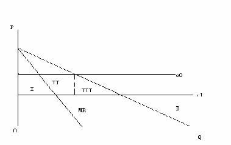

从 C0至 C1，发明使生产成本递减： 

- 1.确认该发明为 

- “普通”发明。 

- 于竞争产业而言，利润源于发明。 

- 于垄断行业而言，利润源于发明。 

- 于政策制定者而言，利润源于发明。

重大发明

从 C0至 C1，发明使成本递减： 

- 1. 确认该发明为 “重大”发明。 

- 2. 于竞争行业而言，利润源于发明。 

- 3. 于垄断行业而言，利润源于发明。 

- 4. 于政策制定者而言，利润源于发明。

### 社会的最优激励 

- l创新动机之不同源于： ——垄断

- ——竞争 ——社会计划 

- 问题在于“替代”效应。 

- 我们分析了可降低成本的流程创新，还可分析能提高产品价值的产品创新。

- 专利的福利分析 

- 最优专利期限(诺德豪斯，Nordhaus, 1969年)：在竞争产业中单个投资者减少创新来降低成本。 

- 发明者需要决定投入多少研发资金以降低成本。 

- 节省的成本数量：B=C0-C1 

- 研发成本：TC=αB2当 α&gt;0 

- 普通发明： B*Q0 

-  	T=专利期限 

T 

•	收益的净现值： 净现值 =�0 BQ0 ertdt =BQ0 (1-ert )/ t 

•	投资者使收益的净现值最大化——T为既定值的成本。 

T的大小使发明家选择不同的发明

测算最优专利期限 

- 于发明者而言，专利使用期越长个人的收益越佳。为什么？ 

- 通常发明也如同上述吗？为什么？ 

- 然而限制专利期限可以使产品进入市场时价格下跌成为普通产品，并消除了发明者的垄断权力。 

- 因而将生产者与消费者从更长期的专利期限中获得的额外盈余比上现有发明使成本降

低的增加额与消费者获得更少的盈余之值，便是社会交易设定的专利期限值。

在专利期满前和期满后专利权的收益

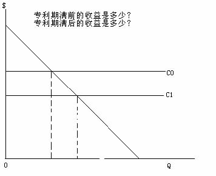

专利竞赛 

- 假定有众多的发明者都在追求同一个发明，那就不会存在垄断价格的问题了。 

-  	P(n)是指社会发现创新的可能性，这里的 n指发明者的数量。 P’(n) &gt;0 而 P’’(n)&lt;0。每位发明者在竞赛中必须承担投资 R。 

- 从社会的立场出发，多少发明者数量才是最优的？ 

- 自由进入均衡时应有多少发明家？ 

- 于社会而言：Max P(n)B-nR: P’(n)B=R. 

- 在自由进入的情况下：P(n)B/n=R，为什么？ 

- 可见发明家的数量并不相同，而我们有共同的财产问题。

- 替代产品存在时新产品的发明 

- 新发明可降低产品成本，但新产品对现有产品具有极强的替代性。发明的社会效益何在？ 

- 现有产品需求下降，并且这一影响与新市场的利益相抵消。然而，在 CS（因为消费者仍可用同样价格买到老产品）中不应考虑这一变化；仅考虑 PS中的变化。 

- 这是“交易偷盗”效应。

- 医药业 

- 研究始于 20世纪 30年代。该行业存在广泛规制。 

- 美国规制起源于 1906年（《纯食品和药品法》），其目标旨在整顿国内食品和药物混杂和乱贴标签的行为。 

-  	1938年《食品、药品和化妆品法》经历了药品的灾难性事故，在这次事故中百名儿童丧生。这就要求新药上市前必须由食品药物管理局证实安全。 

-  	1962年修正案要求新药的效用要经过科学实验证明其安全性后，才能获得食品药物管理局批准上市。 

- 如今：新药在实验室研究 3.5年，6年的临床测试，再过 2.5年食品药物管理局才会做出决定。每四种临床药物，一般只有一种最后被食品药物管理局批准。 

- 批准上市药物的总研发成本和平均研发成本在稳步上涨。

- 处方药的供求 

- 谁需要药品？病人，医生还是卫生维护组织？ 

- 生产商：市场特征是全球化的，四家厂商的集中度非常低，但是经过近来的合并，集中度正在升高，而特定药物的集中度更高。 

- 一般厂商与注重研发的名牌厂商竞争。 

- 案例：一般产品在品牌产品的专利到期几个月之后便复制这些品牌产品。

- 进入壁垒 

- 专利权是进入的最大壁垒，但可改变药品的化学构成并争取获得围绕专利权（正式称呼名为召回专利），例如，Tagamet 和 Zantac。 

- 品牌忠诚度可能是一个问题，但不断增加的无品牌药品受到保险业的青睐。 

- 研发的规模经济非常庞大。20世纪 80年代新药品上市时的成本净现值为 1.94亿美元（1993年研究）。2002年新药品的平均成本是 8.02亿美元（包括研制失败的产品）。 

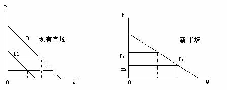

• 

1984年药物价格竞争和专利赔偿法案 

- 该法案促进了在专利期满后一般厂商的进入，从而也导致了价格竞争。 

- 该法案同时也部分补偿了新药的专利期限在上市前的规制过程中所受的损失。 

-  	1998年国会预算办公室评估了该法案效应。 

- 由 0.27亿美元（1990的美元币值）的新药品分析可知，本法案的净效应会降低期望利润的净现值，但自该法案公布后，新药品的利润已经上升。

美国医药品专利保护变化

<Table>
<TR>

<TD>于 1984年药品价格竞争与专利期限赔偿法</TD>
<TD>于药品价格竞争与专利期限赔偿法和 1994年乌拉圭回合协议公约</TD>
</TR>
<TR>
<TH>专利期限</TH>
<TD>专利审批后 17年</TD>
<TD>申请提交后 20年（按最早的提交日期）</TD>
</TR>
<TR>
<TH>专利保护下平均市场期限</TH>
<TD>大约 9年</TD>
<TD>大约 11.5年</TD>
</TR>
<TR>
<TH>专利期限与一般商品进入的间隔时期 </TH>
<TD>3至 4年</TD>
<TD>通常为 1至 3个月</TD>
</TR>
<TR>
<TH>多源的一般药品平均市场份额（百分比） </TH>
<TD>12.7 </TD>
<TD>57.6 </TD>
</TR>
</Table>

http://www.cbo.gov/showdoc.cfm?index=655&amp;sequence=0 

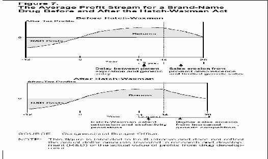

影响研发动机的其他政策 

- 有利的税收政策：货币投资胜于货币贬值。 

-  	1983年孤药法案涵盖了只影响少数人的疾病的药品（在美国小于 20万人口）。它允许临床试验减少一半的研发税收。它亦允许获得食品及药物管理局批准的生产某种孤药的厂商，自批准之日起得到七年时间的市场排他权。 

- 价格控制：在某些国家存在，特别是通过国家保健系统的价格机制来控制（例如英国） 

- 在美国，针对药品业利润及哪种险种应为昂贵的新药提供保障的争论仍在继续。

- 结论 

- 发明有赖于昂贵的且无法隐瞒的新信息，因而要对发明进行规制。 

- 专利是对发明的利润的合法保护。 

- 专利会提高 PS（生产者剩余），但可能降低 CS（消费者剩余）。 

- 医药业主要依赖于专利保护和法律的修订，规制效应激励广泛投资。 

- 但其他支持医药业创新的政策的确存在。

- 版权规制：网络音乐实例

下一课 

# 14.23政府产业规制

第 25课：结论和考试大纲

## 总结 

- l经济规制涉及对产品价格和销售数量的控制，它运用各种经济手段（例如：许可证交易）以达到最佳经济效益。

- 这里存在着许多好的有关规制的经济分析，提出了如何有效激励利润最大化公司完成社会目标？ 

- 实践中，由于规制常常产生负面影响，因此许多国家都倾向于放松规制。 

- 对规制进行社会成本收益分析相当重要，然而令人惊奇的是，这样的分析在美国却相当少。 

- 通过对这一课程的学习，你还获得了哪些启示？

- 复习课堂上提到的所有计算题和问题，确信你能轻松解答这些模拟题。 

- 其中 1道计算题将直接取自以前提到的问题，期中考试占最后成绩的 1/3。 

- 确保你掌握了课堂上所提到的每一个受

# 如何准备期末考试 

# 

规制行业的基本情况： –行业的基本轮廓 –为什么它会受到规制 –为什么要放松规制（如果出现这种情

形） –它受到哪种类型的规制（例如：价格规制、进入规制） –规制的经济影响（从效率、做应做的事的能力、利润等几面来分析）。 –考试难度与课堂上所授内容的难度相当。

- 你不必记住所有政府规制机构名称的缩写、规制名称和规制日期（以及诸如此类的内容）。 

- 试题包括三部份： 

––第一部份：包括 6道简答题，每题 5分，简明扼要地回答每一问题，计算题应有简短的解释。 

––第二部份：包括 2道计算题，每题 25分，计算应给出详细的步骤和简短的解释。 

––第三部份：1道分析题，40分。

- 电力 

- 有线电视 

- 固定电话 

- 移动电话 

- 潜在竞争市场：铁路运输、公路运输和航空运输 

- 美国空气污染规制 

- 医药业 

- 电子音乐产业

- 厂商理论回顾：垄断，寡头，社会剩余，政府干预，无谓损失，策略竞争：限制性定价、动态进入遏制。你不仅要熟悉这些模型，而且还要能运用它们解答简单的计算题。 

- 规制动机：经济、公共利益、俘虏理论。你不仅要了解它们是什么，而且还要能知道如何区别它们。规制的成本与收益。

3、公有制：公有制的历史根源、赞成公有制的一些理由（例如：出现产品质量不能得到保证的情形，地方政府担心的腐败问题），私有制的优势、私有化的目的与影响。 

4、自然垄断规制：定价策略（平均成本定价法、边际成本定价法、分摊成本定价法（FDC）、拉姆齐定价法(Ramsey)、峰谷定价法(Peak-load)），定价策略的结果（交叉补贴、增支成本、吸脂、无效率）；回报率规制（如何实施、结果（例如 A-J效应、无效率））。电力发电厂案例5、我们需要规制吗？有线电视特许经营权拍卖案例。特许经营权拍卖的结果如何？我们按边际成本定价了吗？我们需要担心它的产品质量吗？有线电视案例。 

6、动态市场（1）：技术的作用及其对自然垄断规制的影响（需求量变化、固定成本和变动成本变化，这些变化会或多或少地影响其保持成为自然垄断行业吗？）有线长途通讯案例。

7、动态市场（2）：通用标准和经济发展的重要性，频谱使用权分配，拍卖理论，价格由参与拍卖的公司数量决定，定价不受拍卖费高低影响的独立性，英式拍卖、荷式拍卖，欧洲第 3代移动电话案例。 

8、对潜在竞争市场的规制：价格规制，进入规制，规制对市场、在位企业、潜在进入企业的经济影响。海运和空运案例9、规制困境：市场结构如何影响绩效，规制为什么可能产生负面影响，调整规制的社会成本效益分析。加州电力危机和英国解除对铁路的规制案例。 

10、外部性和公共产品：科斯理论运用（在什么时候有效，失败的潜在可能原因），税收，补贴，（价格与产量的冲突：在不同的污染者之间发生了什么变化？在不确定情况下发生了些什么变化？），庇古税（手段选择），许可证交易。对生命价值和安全等非市场品的定价（内涵资产定价法、旅行费用法、意愿调查价值评估法，并对它们进行比较）。选择权价值。成本效益分析的运用与否。SO2和 CO2案例。

11、专利：我们为什么需要专利？什么可能激励公司进行创新？在一个竞争市场上，专利是否重要？在一个非竞争市场上又如何呢？最优专利期，参与专利竞争的最优公司数目，市场上有完全替代品时的创新。药品案例。 

12、版权：版权保护，非法拷贝的经济危害，网络如何影响拷贝？拷贝价值计算。音乐产业案例。

# 第 26课：期末考试考前复习

麻省理工大学 &amp;剑桥大学

# 去年期末考试试题 

- 摸拟回答 1-6题 

- 摸拟回答 7-8题 

- 论述第 9题

第 1题：在一个城市推行污染规制的典型方法就是“倒推法”（ Rollback Method）。第一步，确定该市对某一特定污染物的最大涵容能力 Xs；第二步，找到该市当前这一污染物的实际排放量 Xm。推测起来目前应是 Xs＜Xm这样一种情形（否则就不会有什么问题），于是，规制要求城里的污染制造者把当前的排染水平 em降低到可涵容水平 es，使得 es=em=(Xs/Xm)＝。试讨论这一方法的可行性。

第 2题：克莉丝（Chris）受雇为剑桥市设计一个处理有害物质的垃圾填埋场。目前她正考虑是否值得花费 100万美元安装一个专用管道。如果安装这一专用管道，发生泄漏的可能性将从 0.001降低到 0.0001。据估计，如果一旦发生泄漏，剑桥市致癌人数将增加 100人。假设克莉丝现建议安装这一专用管道。请问，克莉丝对于一个人的价值的估算至少是多少？（请用数字来说明）

第 3题：由于通过微波传输站比通过电线发送长途电话信号需要更少的固定成本，因此，20世纪 50年代微波传输技术的发展经常被作为是使长途电话市场不再是自然垄断行业的一种解释。然而，到了 90年代，微波传输站在很大程度上却又被光缆所替代，这意味着两地之间长途电话网络通过光缆连接。请问，即使有了这次技术变革，为什么长途电话业仍不是自然垄断行业？

第 4题：德姆塞茨（Demsetz）提出了一种避免自然垄断规制的方法：即通过特许权拍卖，使持有者成为某一特定市场的垄断者。请问，通过特许权拍卖这一方式一定能产生有效的结果吗？并说明理由。

第 5题：在航空业受到规制期间，机票价格被定在成本之上，同时航空公司不能进行价格竞争。请问，实施这种规制对航空公司提供的食品质量和安全保障会产生什么样的影响？你能证明航空公司在这两个方面的应对措施是合理的吗？

第 6题：在洛杉矶大城市群郊外的一个小社区，有一家大的炼油厂建在社区小学街对面。炼油厂排放出的污染物对学校里的学生存在着潜在威胁。但是，由于社区与炼油厂关系相处很好，同时炼油厂业主的孩子也在社区小学就读。为此社区与炼油厂达成协议，规定了污染排放的最高限度。作为回报，炼油厂捐款为学校的孩子们修建了室内运动场。加州州长最近知道了炼油厂与学校比邻而居这一事件，决定对炼油厂排放的每一单位污染物征税。评论加州州长的这一政策决定。 

# 2002年期末考试

7、(25分)市场上仅有一家拉链生产厂家，其成本函数为C(q) = 50 +2q，市场需求函数为D(P) = 100 – P。有大量的潜在新企业想进入这一市场，每一潜在进入企业与在位企业有相同的成本函数。按照贝恩-索罗斯假定（Bain Sylos postulate）求解以下各题，在位企业的产量用qi表示。

- （1）试推导潜在进入企业面临的剩余需求函数？

- （2）假设现有企业的产量为qi，如果一个潜在新企业进入市场，那么潜在进入企业的产量为多少？

- （3）计算限制性定价？

- （4）如果我们假定在位企业预期实现古诺模型中提出的解决方案（Cournot Solutions），而不是按照贝恩 -索罗斯假定求解，那么，潜在进入企业会依赖在位企业的产量qi吗？会有新企业进入吗？（不需要用数字回答，仅给出合理的解释）

第8题：假设市场上有数量不受限制的公司竞相开发一种低热能的脂肪替代品，它不但令你尝起来味道很好，而且对你身体有益（不，它不是Olestra）。每一家公司都只能从事一项这类产品的开发。已知进行这一项目研发有一个不变的边际成本1。每一公司研发成功可能性为P，它是参与竞争的公司数量的函数，即P=1-e-0.5085n。如果新产品研发成功，产品定价将极具竞争性，总剩余现值为 25美元。产品研发只能在今年进行，如果产品不能在今年开发出来，以后将不再开发。

- （1）从社会角度出发，找到参与研发的公司的最优数目？

- （2）假设存在一个具有竞争性的研发产业，参与竞争的公司数目n由“零利润条件”（Zero profit condition）决定。“零利润条件”，是指参与竞争的公司没有进入壁垒，可以自由进入。假设每一个公司研发成功可能性相等。试论证：如果政府承诺给予最先研发出这种药品的公司以全部社会收益25元，那么将有25个公司参与这一研发项目的角逐。

- （3）简要解释为什么第（ 1）问中得出的公司数目与第（2）问中参与专利竞争的公司数目不同？

9、有毒物质排放清单（Toxics Release Inventory （TRI））是美国环境保护署制定的一项规制措施，它强迫制造厂定期在环境保护署负责维护的数据库上公开有毒物质的排放情况和数据。在没有实行这项规制以前，全国没有关于有毒物质的排放记录，尽管有害物质的储藏、运输和处置受到基于命令与控制的行政规制，但除此之外就没有其它的正式规制。制造厂无论使用或生产有毒物质排放清单中列出的600种有毒物质，在超过一定限度时都必须申报。比如二氧 (杂)芑（一种致癌物质）、氨水（一种常见的家用清洁剂）、砷（一种金属，如果误吞或吸收，将致命）等有毒物质的排放就必须申报。有毒物质的排放清单是自我申报系统，即厂商申报自己的有毒物质排放情况与数据。自从1987年开始实施这项规制以来，全国每年申报的有毒物质排放量（以吨计）第9题：已经降了40%以上。环境保护署宣称有毒物质排放清单规制已经取得重大成功。

根据以下问题讨论这一规制：（ 1）环境保护署实施有毒物质排放清单规制，而不再采用基于命令与控制的行政规制的潜在动机是什么 (包括效率)？（2）这项规制在理论上预期发挥什么作用（包括规制对降低有毒物质排放量的潜在效率）？（3）实施强制申报有毒物质排放这一措施的潜在不足？

尽量用课堂上学到的实例和证据来支持你的观点。

- 本次考试为闭卷考试，不得带任何书和笔记。 

- 考试在上午9点整准时开始。 

- 如果迟到将不准参加考试。 

- 考试在中午12点准时结束。 

- 请带上笔和普通计算器（不具有科学计算功能）。

-  2003年期末考试 ––第30课上午9点正
