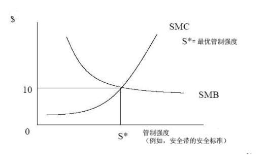

         xml

               user

               第一课.doc

         2005-10-13T10:47:25+08:00

         pdfFactory Pro www.fineprint.com.cn

         pdfFactory Pro 2.30 (Windows XP Professional Chinese)

## 14.23政府产业规制

## 

麻省理工学院

剑桥大学

大纲 

- 	定义 

- 	课程大纲 

- 	社会成本收益分析介绍 

- 	经济规制实践 

- 	规制的成本与收益 

- 	规制机构的职能 

- 	结束语

- 什么是政府产业规制？ 

- 	政府产业规制是指地方、联邦或州政府通过制定价格或者控制产品和服务的质量和数量，来控制个人或公司行为。 

- 	例如，制定电力价格。 

- 	例如，制定汽车安全带的质量标准。

- 经济规制和社会规制 

- 	本课程把政府的产业规制分为两类： 

- 	经济规制――政府对缺乏竞争力的公司（传统意义上的国家垄断产业）的产业行为进行规制，例如，电力价格。 

- 	社会规制－－政府在服务和产品（传统意义上的外部性）的生产与消费涉及环境、健康和安全方面的问题时，对个人或公司的行为进行控制，例如，发电站的排放物。

- 课程大纲和主要安排 

-  	5次家庭作业。 

-  	1次课堂中期考试。 

-  1次期末考试。 l

- 主要时间安排和日期 

- 	课堂时间为上午 9：00－10：30。 

- 	随堂提问时间为上午 10：00。 

- 	第 1次作业定于第 7次课上课前提交。 

- 	期中考试定于第 13次课上午 9：00。

- 	三个主要部分：

-  	I.关于基础产业组织理论的修订－特别是基础产业组织为了实现社会福利，偏离了完全竞争的复杂性。 

-  	II.经济规制－如何降低电力、通信、铁路、公路运输、航空业等行业的垄断程度。 

-  	III.社会规制

课程大纲 

－如何运用经济评估方法评价环境控制，健康和安全规制，以及专利权和著作权问题。

产业调查

- ·被调查的产业： 	

- ·规制手段： 

- ·电力 	

- ·价格规制

- 有线电视	·特许经营权拍卖

- ·有线电话 	

- ·价格规制/分类计价 

- ·无线电话 	

- ·频谱拍卖 

- ·公路运输 	

- ·价格规制

- ·铁路 	

- ·规制放松

- ·航空业 	

- ·规制放松 

- 医药品	·专利权 

- 网络音乐	·著作权

- 一般方法 

- 	推荐课本：－Viscusi，K.,Vernon，J. and Harrington，J.,《反垄断和规制经济学》，2000年，麻省理工学院出版社，以下简称为 VVH。 

- 	这本书内容较多，主要涉及美国的产业规制。大体上我会按照书上的内容授课。 

- 	另外也会分析一些欧洲国家的案例（成功的和不成功的）。 

- 	课堂上，我将给出习题集上一些问题的提示，但更偏重于概念与证据。 

- 	马可将会提供习题集和计算题的详细解答。

- 政府规制 

- 	政府通过制定规制条例来规制私人企业的行为。但一种新规制应当接受一般经济原理的检验。 

- 	一项规制提议能否使净收益达到最大化（净收益等于收益减去成本）？ 

- 	运用社会成本收益分析来计算净收益。

社会成本收益分析

� T Bt -Ctt = 净现值 i=0 (1 + r) 

T＝工程时间 Bt＝t时的工程收益 Ct＝t时的工程成本 r＝社会贴现率

社会成本－收益分析 

- 	收益包含：价格较低时消费者的储蓄价值，提供额外安全的价值，污染度较低物质的健康收益价值。 

- 	成本包含：按照规制条例规制公司的成本，以及执行规制的机构产生的直接成本。 

- 	私人和金融净收益可能不等同于社会净收益。 

- 	贴现意味着较高的收益更可能产生规制，贴现率的变化也可能导致最初合意的工程变得不合意。

- 社会成本－收益分析 

- 	某项规制变化会带来一定的收益和一定的成本。但问题在于，净收益是否为正值，而且规制变化能否带来更大的正效益。 

- 	我们应该不断地改变规制手段，直到再也没有新的净收益产生为止。 

- 	当然也可能出现规制手段改变，但净收益变化率为零的情形。 

- 	规制变化的社会边际成本等于社会边际收益。

边际社会成本和边际社会收益

现实复杂性 

- 	当然，实施最有益于社会的规制不会像估量实际运行的规制那样容易。 

- 	政治选民的产生意味着选民利益和社会利益的分歧。 

- 	预算约束是指，如果净社会收益等于净预算成本，那么政府对产业将不会再投资。 

- 	规制机构缺发减少规制的激励机制。 

- 	如果受规制的企业和规制机构共存时间很长，那么规制机构被它所规制的企业所俘获是可能的。 

- 	政府没有能力解决复杂规制问题意味着他们没有能力执行最佳解决方案。

- 规制实践 

- 	实行固定方式的规制： 

- 	政府指定某个规制机构实现它的特定目标。 

- 	在许可的范围内，规制机构可以根据它对产业现状的判断来实施规制。 

- 	美国和欧盟的政府规制很复杂，因为政府机构的规制权限互相重叠：地方、州和联邦机构可能对同一类行为实行规制，例如，健康和安全立法。

- 美国的规制监督过程 

- 	规制机构关于联邦规制的新提议必须得到执行机构－美国白宫管理与预算办公室（OMB）的批准。 

- 	在新提议得到批准之前，OMB的下属单位－信息和规章事务办公室（OIRA）对提议进行成本收益分析。 

-  	OIRA会与相关机构商议对提议的修改，或者完全不改变。 

- 	这些修改一旦获得批准，将在《联邦纪事》（Federal Register）上正式公布。

- 克林顿和布什政府时期的规制 

- 	克林顿政府颁布了一项行政命令，从实质上来降低 OMB对规制机构的干涉程度。 

- 	布什政府则通过更严格的成本－收益检验，力求减少规制机构提出的新条例数量。 

-  	2001年，新条例的数量降低了 5％。 

- 	但这一年，美国政府的规制成本（非收益的）仍高达 8540亿美元，占 GDP的 8.4％。

规制的成本与收益

收益	成本

<Table>
<TR>
<TH>环境规制 </TH>
<TH>97 至 1，610 </TH>
<TH>96 至 170 </TH>
</TR>
<TR>
<TH>运输规制 </TH>
<TD>84 至 110 </TD>
<TD>15 至 18 </TD>
</TR>
<TR>
<TH>劳动力 </TH>
<TD>28 至 30 </TD>
<TD>18 至 19 </TD>
</TR>
<TR>
<TH>其它 </TH>
<TD>45 至 49 </TD>
<TD>17 至 22 </TD>
</TR>
<TR>
<TH>总收益或总成本 </TH>
<TD>254 至 1，799 </TD>
<TD>146 至 229 </TD>
</TR>
<TR>
<TH>净收益范围 </TH>

<TD>25 至 1，653 </TD>
</TR>
</Table>

www.whitehouse.gownmb/inforeg/costbenefitreport.pdf

. 

来源：Crews，2002年

规制放松的收益 

- 	规制放松通常是指试图减少产业进入壁垒，降低对价格的控制，以刺激强有力的竞争。但是有效的规制放松通常包含着特定的‘再规制’。 

- 	规制放松的理想优势： 

- 	更低的价格 

- 	更低的成本 

- 	更多的选择

- 规制者最大化了什么？ 

- 	净社会收益总额。 

- 	预算大小及其影响。 

- 	受规制企业雇员的职业前景。 

- 	雇员的福利。 

- 	无所作为。

- 结论 

- 	政府的产业规制包括对私人和公司行为的经济规制与社会规制。 

- 	这两种规制应该以社会成本收益分析为基础，而分析是与规制的边际社会成

- 本等于社会收益相联系的。 

- 	在实际生活中，人们似乎认为规制过度，近年来，这种看法导致了具有重要意义的规制放松运动。

- 下一课 

- 	复习《市场类型》。 

- 	阅读 VVH第四章。
