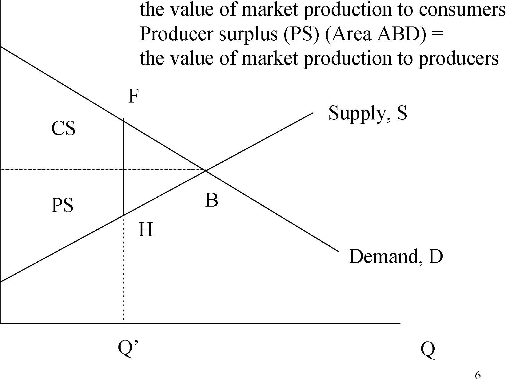

         Acrobat Distiller 5.0.5 (Windows)

         2003-07-28T02:16:16Z

         2003-08-11T13:34:36+05:30

         2003-08-11T13:34:36+05:30

         PScript5.dll Version 5.2

         xml

               bersara

               Microsoft PowerPoint - 14.23 Class2.ppt

# 14.23 Government Regulation of Industry

Class 2

MIT &amp; University of Cambridge

1

Outline 

-  Definitions 

-  Perfect Competition and Economic Surplus 

-  Monopoly and Deadweight Losses 

-  Natural Monopolies 

-  X-inefficiency 

-  Estimates of welfare losses of monopoly 

-  Technological change and Competition 

-  Patents and Copyright 

2

Efficiency and Technical Progress

- 	Economic regulations should promote efficiency and technical progress. 

- 	Efficiency is concerned with optimizing the use of existing resources and technology. 

- 	Technical progress is conditional on the allocation of resources to develop new technologies. 

- 	Efficiency is static, technical progress is dynamic. Different types of market structures may impact efficiency and technical progress differently. 3 

Assumptions of Perfect Competition

-  Consumers perfectly informed. 

- 	Producers have similar non-increasing returns to scale technologies. 

- 	Consumers maximize preferences given budget constraints. 

- 	Producers maximize profits given their production functions. 

- 	All agents are small in relation to size of market and externalities do not exist. 

-  A competitive equilibrium is then determined. 

4

Properties of an equilibrium under perfect competition

- 	Pareto efficiency – exists when it is not possible to improve on the current equilibrium without making at least one consumer worse off. 

-  Price = Marginal Cost 

-  All firms price takers. 

-  There are no super-normal profits. 

- 	However in practice economic regulation is often concentrated on industries where the assumptions of perfect competition do not hold. 

-  The aim of economic regulation is often to simulate

5 

some of the properties of perfect competition.

Figure 1 -Market supply and demandConsumer surplus (CS) (Area CDB) =

P

6 Supply, S Demand, D CS PS the value of market production to consumers Producer surplus (PS) (Area ABD) = the value of market production to producers B F H 

C

D

A

0

Q’

Q

A

Demand MR Price, P Figure 2 – Monopoly and Deadweight Losses C B D DWL of monopoly = Area BCD

Pm 

MC = AC Pc 

0 Qm Qc Quantity, Q 

7 

Calculating Social Surplus under Monopoly and Competition

-  Demand, Q=100 – P 

-  Marginal and average cost, MC = AC = 20 •Pm=$60, Qm=40; at monopoly equilibrium •Pc=$20, Qc=80; at competitive equilibrium 

-  Monopoly: 

-  Total surplus: APcCB=$2400 –CS: APmB=$800; PS: PmPcCB=$1600 

-  Competition: 

-  Total surplus: APcD=$3200 –CS: APcD=$3200; PS: PmPcCB=$0 

8 

Social weightsand why they matter

- 	Society does not usually make decisions based on the maximisation of the sum of producer and consumer surplus. 

- 	It usually attaches different weights to different groups of consumers and producers (and the government). 

- 	Example of regulating casinos. De-regulation of casinos may effect those who cannot afford to gamble and the very rich impacting on consumer surplus. However it may also raise the producer surplus by increasing the profitability of casinos. 9 

Price, P Figure 3 -A natural monopoly DMC AC E F G 

Pc

Pm 

P* 

Qeff

0

Qc

Qm

Quantity, Q

10

How to improve social welfare in Natural Monopoly Industries

-  Government ownership e.g. USPS 

-  Regulation of prices e.g. Electric Utilities 

-  Franchising e.g. Cable TV 

-  Introduction of competition e.g. Telephony 

11

Other types of market structure with deadweight losses

- 	Monopsony – where a single buyer drives down the price it pays and the quantity it buys. 

- 	Oligopoly – the intermediate case between perfect competition and monopoly where a small number of firms operate in a market with some ability to raise prices and reduce industry output. 

- 	Oligopsony – where small groups of buyers drive down price paid and quantity bought. 

- 	Oligopoly and oligopsony and their detection and control are more the concern of anti-trust authorities rather than economic regulatory agencies. 12 

13 Price, P Quantity, Q0 MC AC D MR Q* P* Figure 4 -Monopolistic Competition E F Problem is that we have DWL of monopoly but the only way to reduce this is to reduce the number of brands. Thus the effect of regulation on variety may be an issue. G 

Figure 5 – Price controls and price supportsP, Price 

P1 Pc P2 

Q

1 

Q

c 

Q

2 

Q, Quantity

Figure 6 – Taxes and Subsidies P, Price 

Pt 

P* Ps 

Supply, S Demand, D Q, QuantityQ* S+Tax S-Subsidy A C E FB 

0

Qt Qs

Figure 7 – Import Tariffs and QuotasP, Price 

US Supply 

PT 

PT= US Price with Tariff 

PF= World Free Trade Price 

PF 

Q

1 

Q

2 

Q, Quantity

Deadweight Losses of Monopoly 

1( P * − Pc )( Qc − Q *) = 1 ηd 2 P * Q *22

where :P * = actual priceQ * = actual quantity

η= price elasticity of demandd = price cost margin

-  Harberger (1954) from industry revenue and profits. 

- 	Estimated d as difference between industry and average sample rate of return. 

•Assumed η=1. 

-  Got answer that DWL are only 0.1% of GNP. 17 

Deadweight Losses of Monopoly

*P = η⎜⎛ = 1 ⎞⎟

*P − MC ⎝ d ⎠ substituti ng this inthe Harberger formula we have 

*1 ⎛ P − MC ⎞ **1 * *1*DWL ≅ 2 ⎝⎜⎜ P * ⎠⎟⎟ PQ = 2( P − MC )Q = 2 Π

-  Cowling and Mueller (1978). 

-  Data on 734 US firms in 1963-66. 

-  They estimate DWL of 4% of GCP. 

- 	If you include rent seeking behavior the figure is much higher. 

18 

X-Inefficiency

- 	X-inefficiency (Leibenstein, 1966) occurs when firms do not minimise the costs of producing their output. 

- 	X-inefficiency occurs due to lack of competition or incentive to minimise costs within firms. 

- 	Monopolies may be particularly prone to such inefficiency. 

- 	Thus a reason why de-regulation might be favoured is because the static cost efficiency of monopoly is outweighed in the long run by rising X-inefficiency. 19 

Technical Progress 

- 	Schumpeter famously argued that monopoly was good for innovation because the competition for monopoly encouraged investment in innovation. 

- 	Research and Development expenditure can take a number of different forms and involves different stages: 

-  Basic and applied research 

-  Invention 

-  Development 

-  Diffusion 

20

Technical Change and Competition

Present Discounted 

V5 V3 C Values, $ Figure 8 

0 

Time to innovate, T 

V1

21

Explaining the model

-  Earlier innovation costs more but is more beneficial. 

- 	Benefits of innovation to individual firm are negatively effected by number of competitors (V1to V5). This is because more competitors increases the speed and severity of copying by rivals. 

- 	This implies that there can be excessive competition which stifles innovation completely by eliminating incentives to invest (V5&lt;C). 

- 	Thus one aim of regulation may be to preserve incentives to innovate and to reward innovators. 

22

Regulatory approaches to innovation

•Patents 

-  These give companies a monopoly right to exploit an invention for a limited period. This increases producer surplus in the short run. 

-  Copyright 

-  This gives copyright holders the right to benefit from reproduction of intellectual property for a period. This similarly increases producer surplus in the short run. 

- 	The impact of these arrangements on consumer surplus in the short run is uncertain. There may be more innovations which quickly benefit consumers even though they are expensive. 23 

Conclusions

- 	Short run static efficiency likely to be negatively effected by monopoly via deadweight losses. 

- 	Technical progress may benefit from monopoly as monopoly may be associated with better incentives to invest in innovation. 

- 	Regulation needs to involve society deciding on the optimal trade-offs between consumer and producer surplus based on implicit or explicit social weights. 

24

Next 

-  Revision of Oligopoly and Collusion. 

-  Read VVH Chapter 5 (to page 122). 

25
