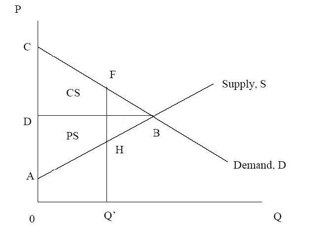
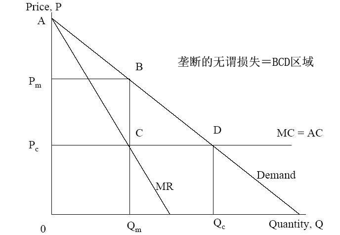
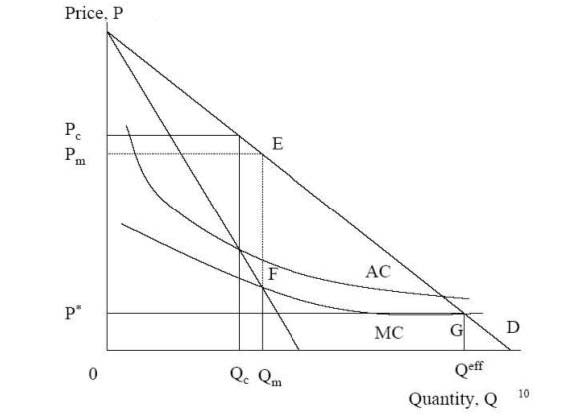
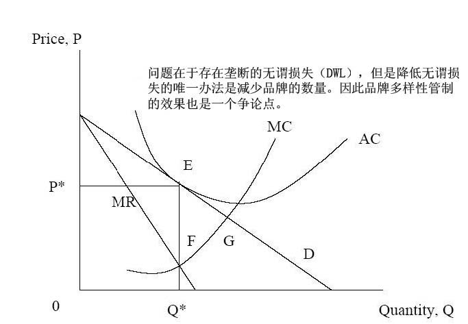
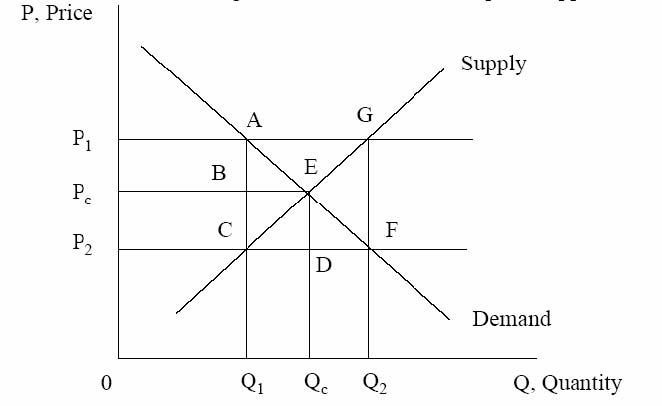
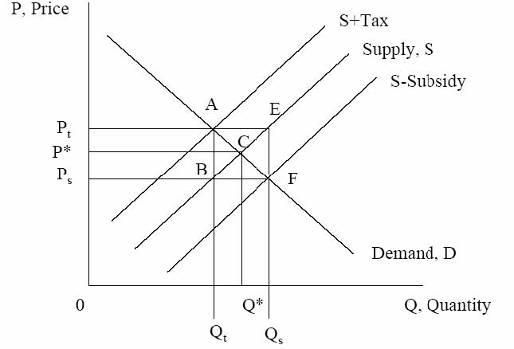
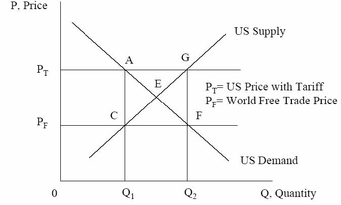

         xml

               user

               第二课.doc

         2005-10-13T10:49:09+08:00

         pdfFactory Pro www.fineprint.com.cn

         pdfFactory Pro 2.30 (Windows XP Professional Chinese)

## 14.23 政府的产业规制

## 

### 第二课

麻省理工学院 &amp;剑桥大学提纲 

- 	定义 

- 	完全竞争和经济剩余 

- 	垄断与无谓损失 

- 	自然垄断 

-  	X－无效率 

- 	对垄断福利损失的估计 

- 	技术变迁和竞争 

- 	专利权与著作权

效率与技术进步 

- 	经济规制能够促进效率与技术的进步。 

- 	效率是与现有资源和技术的使用最优化相联系的。 

- 	技术进步能促进资源的配置以发展新技术。 

- 	效率是静态的，技术进步是动态的。不同的市场结构类型对效率和技术进步的影响是不一样的。

完全竞争假设 

- 	消费者拥有完全信息。 

- 	生产者获得相似的非递增规模技术报酬。 

- 	消费者在给定的预算约束内追求个人偏好最大化。 

- 	生产者在给定的生产函数下追求利润最大化。 

- 	所有当事人的规模与市场规模相比都很小，因此不存在外部性问题。 

- 	实现了竞争均衡。

完全竞争的均衡特征 

- 	帕累托效率（Pareto efficiency）－如果没有其它的均衡能不损害至少一个消费者的利益，那么现有的这种均衡就是帕累托有效。 

- 	价格＝边际成本 

- 	所有企业都是价格接受者。 

- 	市场上没有超额利润。 

- 	在现实生活中，经济规制一般集中于完全竞争假设不存在的产业。 

- 	经济规制的目标通常是刺激市场呈现完全竞争的特征。

图 1－市场供给与需求消费者剩余（CS）（CBD部分）=市场产品对消费者的价值

生产者剩余（PS）（ABD部分）＝市场产品对生产者的价值

图 2－垄断和无谓损失

计算垄断和竞争的社会剩余 

- 	需求函数，Q＝100－P 

- 	边际成本和平均成本，MC=AC=20 

- 	垄断均衡：Pm＝60美元，Qm＝40， 

- 	竞争均衡：Pc＝20美元，Qc＝80， 

- 	垄断条件下：－总剩余：A Pc CB＝2400美元－消费者剩余：A Pm B＝800美元；生产者剩余： PmPcCB＝1600美元 

- 	竞争条件下：－总剩余：APcD＝3200美元－消费者剩余:A Pc D＝3200美元；生产者剩余：Pm Pc CB＝0美元

- 社会权重的作用 

- 	社会决策通常不以生产者和消费者剩余之和的最大化为依据。 

- 	不同的消费者群体和生产者群体（和政府）其社会权重不同。 

- 	以对娱乐场所的规制为例，放松对娱乐场所的规制可能影响那些支付不了赌博的人，和那些能影响消费者剩余的富人。但另一方面，也有可能通过增加娱乐场所的收益率来提高生产者剩余。

图 3－自然垄断

自然垄断产业如何改善社会福利 

- 	政府公有制，例如，USPS 

- 	价格规制，例如，电力事业 

- 	特许经营权，例如，有线电视 

- 	引进竞争，例如，电话产业

- 其它存在无谓损失的市场结构类型 

- 	买方垄断－市场中消费者数量唯一时，它是市场价格和购买数量的唯一决定者。 

- 	寡头－是介于完全竞争和垄断之间的一种市场组织，市场中只有少数几个卖者，它们有一定的能力提高价格和降低产量。 

- 	买方寡头垄断－市场上只有少数买者，促使降低产品价格和购买数量。 

- 	与经济规制机构相比，反托拉斯机构更关注寡头和买方寡头垄断，以及它们对市场的观察与控制程度。

图 4－垄断竞争

图 5－价格控制和价格支持

图 6－税收和补助

图 7－进口关税和配额

垄断的无谓损失 

1（P*-Pc）（Qc－Q*）＝ 1 ηd2P*Q* 

22 P*=实际价格 Q*＝实际数量 η＝需求的价格弹性 d＝价格和成本的差额 

- l哈伯格（1954年）使用产业收入和利润来估算价格和成本的差额 d 

- l并假设 η＝1 

- l得到 DWL仅占 GNP的 1％。

垄断的无谓损失 

P *1 )

### =η(=

P * -MC d 

将上式用哈伯格公式代替，得到： 

P * -MC

### DWL@ 1 ()P*Q*=1 (P*-MC)Q*=1 Ⅱ* 

2 P *2 2 

-  Cowling 和 Mueller（1978）。 

- l考察 1963－66年 724家美国企业的资料。 

- l估算 DWL占 GDP的 4％。 

- l如果包含“寻租”行为，则所占比例更高。

- X－无效率 

-  	X－无效率（勒伯斯坦 Leibestein，1966年），是指企业的生产成本没有实现最小化，导致企业内部资源配置效率降低，这种状态被称为 X-无效率。 

- 	企业内部缺乏竞争和最小成本激励机制，就会导致 X－无效率。 

- 	垄断企业更容易产生这种无效率。 

- 	这就是为什么规制放松受到支持的原因，因为上升的 X－无效率高于垄断企业的长期静态成本效率。

- 技术进步 

- 	熊彼特（Schumpeter）曾提出一个著名论断：垄断有利于创新，因为垄断竞争鼓励创新投资。 

- 	研究和发展的支出采取不同的形式，包括不同的阶段：－基础和应用研究－发明－发展－扩散

图 8 技术变迁和竞争

模型分析 

- 	早期的高创新成本带来高收益。 

- 	私人企业的创新收益与竞争者的数量是负相关的（V1到 V5），因为当市场上

- 的竞争者增多，会加剧对手之间模仿的速度和激烈程度。 

- 	这也意味着，过多的竞争通过消除投资动机以完全遏制创新。 

- 	因此规制的一个目标就是保持创新激励，和奖励创新者。

- 规制手段的创新 

- 	专利权

- －企业（由政府授权）在有限的时期内，拥有某项发明的垄断使用权。短期内能增加生产者剩余。 

- 	著作权

- －著作权的所有者在一段时期内，有权从知识产权的再生产中获利。短期内也同样能增加生产者剩余。 

- 	短期内这些安排对消费者剩余的影响是不确定的。即使创新成本巨大，消费者也可能很快从更多的创新中获益。

- 结论 

- 	无谓损失的存在使短期静态效率与垄断可能负相关。 

- 	当垄断与更好的创新投资激励相联系时，技术进步从垄断中获益。 

- 	规制需要包括社会对消费者剩余和生产者剩余之间最优权衡的决策，这两者是以明确的或不明确的社会权重为基础。

- 下一课 

- 	复习《寡头和合谋》。 

- 	阅读 VVH第五章（至 122页）。
