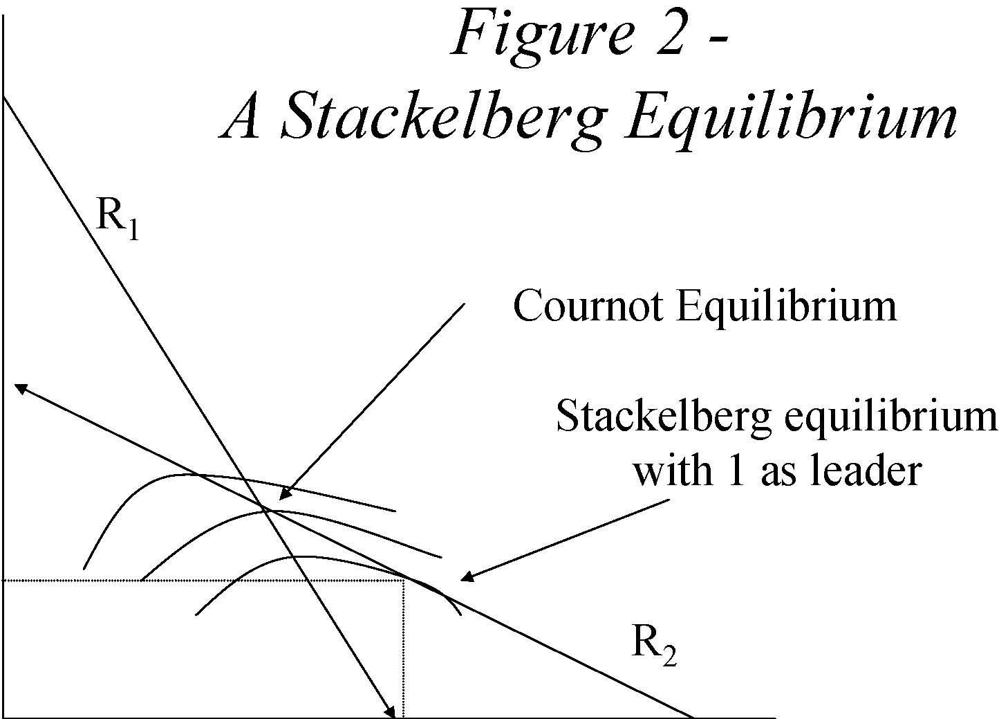

         Acrobat Distiller 5.0.5 (Windows)

         2003-07-28T02:20:08Z

         2003-08-18T12:02:00+05:30

         2003-08-18T12:02:00+05:30

         PScript5.dll Version 5.2

         xml

               bersara

               Microsoft PowerPoint - 14.23 Class3.ppt

# 14.23 Government Regulation of Industry

Class 3

## MIT &amp; University of Cambridge

-  Definitions 

-  Nash Equilibrium 

-  Monopoly and Perfect Competition revisited 

-  Duopoly and social welfare 

-  Cournot, Stackelberg and Bertrand Oligopoly 

-  Collusion 

-  Is oligopoly a problem? 

-  Prisoners’ Dilemma and Game Theory 

## The strategies x and y form a Nash equilibrium for players 1 and 2 respectively if x is the best response for 1 if 2 has chosen y and y is the best response for 2 if 1 has chosen x. 

# Monopoly and Perfect Competition

Consider the following example:Market Demand: P=25-QMarginal Cost = Average Cost = 5Competitive Outcome:MC=MR=P=5, Q=20; CS=200, PS=0Monopoly Outcome:MR=25-2Q=MC=5; Q=10, P=15; CS=50, PS=100, DWL=50

-  Consider two identical firms (1 and 2). 

- 	Both set quantity assuming the other firm’s quantity is independent of their own choice of output. 

- 	Thus the conjectural variation is zero (i.e. firm 1 assumes dq2/dq1=0). 

- 	Equilibrium occurs when each firm does not want to change its output having observed what output the other firm has set. 

Price, P=25-(q1+q2); Total costs, C1=5 q1; C2=5 q2;

Profit, Π1=(25-q1 -q2) q1 -5 q1 

Differentiate the profit function with respect to q1 and set equal to zero to solve for marginal revenue=marginal cost. 

This gives the reaction or best response function for Firm 1: this gives q1 =(20-q2)/2. 

Repeat the procedure for the identical Firm 2: 

this gives q2 =(20-q1)/2 

•q1 =(20-q2)/2 and q2 =(20-q1)/2•q1=q2=20/3•P=35/3

-  Π1 = Π2 = 400/9; PS=800/9 

-  CS=800/9 

-  CS+PS=1600/9=177.78 

q2, Output of firm 2

Π22 Figure 1 -A Cournot equilibrium R2 Π21 Π12 Π11 R1 Cournot Equilibrium 

0 q1, Output of firm 1

8

Π21 &lt; Π22; Π11 &lt; Π12 

-  Firm 1 is leader, Firm 2 is follower 

-  Firm 1 knows q2 =(20-q1)/2 and maximises 

-  Firm 2 is a Cournot player•q1=10, q2=5•p=10

-  Π1= 50, Π2= 25 ; PS=75 

-  CS=0.5(15*15)=112.5 

-  CS+PS=187.5 

q2, Output of firm 2

Figure 2 -A Stackelberg Equilibrium R2 R1 Cournot Equilibrium Stackelberg equilibrium with 1 as leader 

q21 

0 q11 q1, Output of firm 1

10

First mover firm can get higher profits than at the Cournot equilibrium.

-  Consider two identical firms (1 and 2). 

•Both set price assuming the other firm’s price is independent of their own choice of output. 

- 	Thus the conjectural variation in price is zero (i.e. for firm 1 dp2/dp1=0). 

- 	Equilibrium occurs when each firm does not want to change its price having observed what the price the other firm has set. 

-  Price equals marginal cost (=average cost). 

-  There are zero profits. 

- 	Firm 1 and Firm 2 produce similar but not identical products and compete on price. 

-  Demands: q1=20-p1+p2, q2=20-p2+ p1 •Assume mc=0 

- 	Price reaction functions: p1 =(20+ p2)/2 and p2 =(20+ p1)/2 

•p1 = p2 =20, Π1=Π2=400 

-  If Firm 1 is a leader, p1 =30, p2 =25 

-  Π1 =450, Π2 =625 

-  You don’t want to be the leader! 

12 

Figure 3 – The Bertrand Equilibrium p2 p*2 

0 

R1 R2 

p1 p*1 

•Q=q1+q2+…+qn 

- 	MR=MC for each firm i Π i=P(Q).qi-C(qi) 

-  F.O.C.: MCi=P(Q)+ qi dP/dqi •si=qi/Q, note in Cournot: dP/dQ=dP/dqi 

-  Rearranging we get: (P-MCi)/P=si/η 

-  Note the properties of this equilibrium result! 

-  Collusion involves a non-zero conjectural variation. 

-  This involves co-ordination such that dq2/dq1&gt;0 

- 	Co-ordination of output can come about as a result of an agreement (co-operative behaviour) or as a result of infinite or indefinite repetition or irrational commitments. 

- 	In our original example the collusive outcome is P=15 and q1=q2=5 and firm profits are 50. If cheating occurs could switch to Cournot oligopoly, profits would drop to 400/9=44. Can get profits of c.55 if set qi=20/3 when qj=5. 

- 	If firm 1 thinks about cheating calculates whether one period gain is greater than multi-period loss: 

15 

-  Max gain is 5; loss is 6/R, thus only cheat if R&gt;6/5 

- 	Collusion is very difficult to sustain for long periods in practice. 

- 	This is because collusive equilibria are unstable due to uncertainty, new entry, differences in costs, multiple equilibria. 

- 	Sustained collusion requires communication and probably explicit co-ordination and sophisticated side-payments. 

- 	Not clear that most types of tacit collusion are worth acting on due to Schumpeterian effects. 

-  Example of UK White Salt market in 1986. 16 

Figure 4 -Oligopoly as a normal form game

<Table>
<TR>
<TD>1 2 </TD>
<TD>S1=5 </TD>
<TD>S2=20/3 </TD>
<TD>S3=10 </TD>
</TR>
<TR>
<TD>S1=5 </TD>
<TD>(50,50) </TD>
<TD>(42,55) </TD>
<TD>(25,50) </TD>
</TR>
<TR>
<TD>S2=20/3 </TD>
<TD>(55,42) </TD>
<TD>(44,44) </TD>
<TD>(22,33) </TD>
</TR>
<TR>
<TD>S3=10 </TD>
<TD>(50,25) </TD>
<TD>(33,22) </TD>
<TD>(0,0) </TD>
</TR>
</Table>

Let us consider once again why (44, 44) is the Nash equilibrium and (50,50) is the collusive equilibrium.

Figure 5 -Oligopoly as an extensive form game 

(50,50) 

(42,55)(25,50)(55,42)

P1 

S1=5 S1=5 S2=20/3 S3=10 P2 P2 P2 S2=20/3 S3=10 S1=5 S2=20/3 S3=10 S1=5 S2=20/3 S3=10 

(44,44) 

(22,33) 

(50,25) 

(33,22) 

Player 1 moves first, followed by Player 2. 

(0,0) 

18

Let us use Cournot model to demonstrate why (50, 25) is the Nash eqm.

Figure 6 -The Prisoners’ Dilemma

Don’t Confess Confess Don’t Confess Confess 1 2 (10,10) (5,5)(12,2) (2,12) 

(x,y): x=return to Prisoner 1, y=return to Prisoner 2. Higher numbers are better for the Prisoners. 

19

- 	Simultaneous moves (5,5) is the likely solution. This is the rational strategy (Nash Equilibrium). 

- 	However (10,10) is superior to (5,5) for both players (Pareto superior). 

- 	Many environmental problems can be characterised as Prisoners’ Dilemmas. 

- 	These are solved by social convention, law and repetition. 

- 	Different market structures are associated with different levels of social welfare and deadweight loss. 

- 	Cournot and Bertrand oligopoly are better than monopoly and collusive oligopoly. 

- 	Firms within oligopolies can be thought of as playing games where they attempt to maximise profits by choosing levels of variables under there control in the light of assumed reactions of other firms. 

- 	Economic regulation is important where monopoly exists and conditions make sustained collusion likely. 

- 	Revision of Dominant Firms and Entry Deterrence. 

-  Read VVH Chapter 6. 
