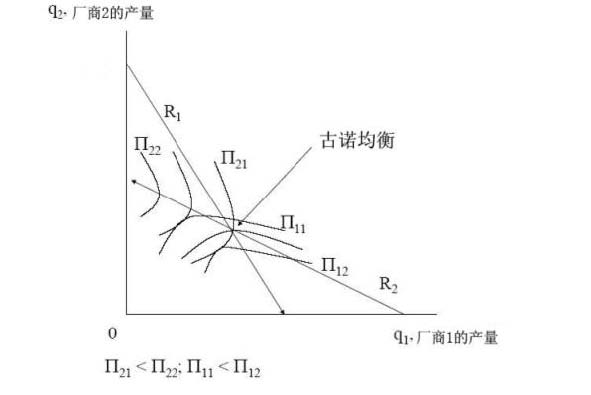
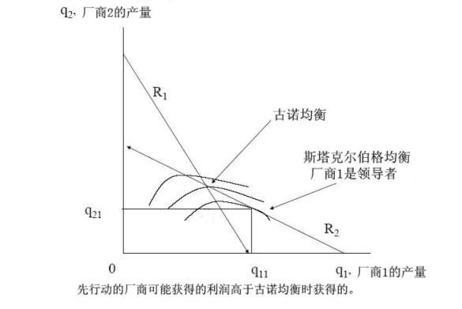
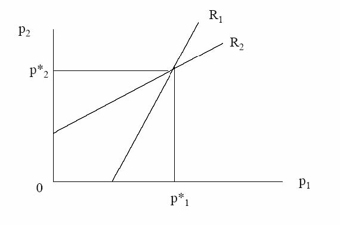
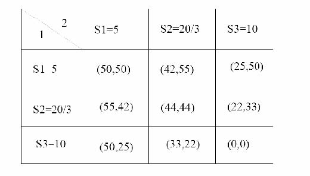
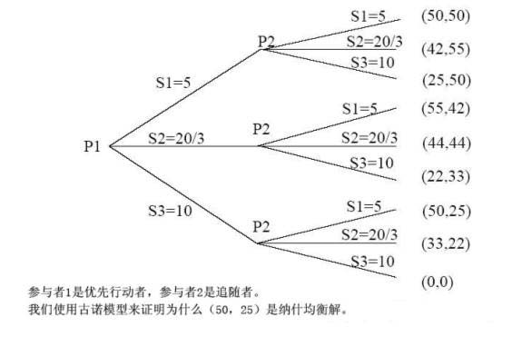
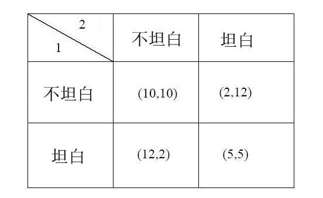

         xml

               user

               第三课.doc

         2005-10-13T10:50:30+08:00

         pdfFactory Pro www.fineprint.com.cn

         pdfFactory Pro 2.30 (Windows XP Professional Chinese)

## 14.23 政府的产业规制

## 

### 第三课

#### 麻省理工学院 &amp;剑桥大学提纲 

- 	定义 

- 	纳什均衡 

- 	垄断和完全竞争 

- 	两个卖者的寡头――双头与社会福利 

- 	古诺，斯塔克尔伯格和伯川德寡头竞争（ Cournot，Stackelberg，Bertrand Oligopoly） 

- 	合谋 

- 	寡头是一个问题吗？ 

- 	囚徒困境和博弈论

#### 纳什均衡

在纳什均衡中，参与者 1和参与者 2分别选择策略 X和 Y。如果参与者 2选择策略 Y既定，那么参与者 1最好的选择是策略 X；如果参与者 1选择策略 X既定，那么参与者 2最好的选择是策略 Y。

#### 垄断与完全竞争

考虑以下例子：市场需求函数：P＝25－Q 边际成本＝平均成本＝5 竞争结果： 

#### 古诺模型 

- 	考虑两家生产同样产品的企业,1和 2。 

- 	两家企业同时做出产量决策，假设其它企业的产量不受本企业决策的影响。 

- 	因此可推测的变动为零（例如，对企业 1，dq2/dq1＝0）。 

- 	在观察其它企业所决定的产量后，每个企业没有改变产量的意愿，此时达到均衡。

#### 古诺模型

价格函数，P=25-(q1＋q2); 总成本，C1=5q1；C2=5q2；

。/2）2q－20＝（1q）：reactionfunction数（

利润，Ⅱ1＝（25－q1－q2）q1－5q1区分 q1的利润函数，通过边际收益＝边际成本得到企业 1的反应或最佳反应函

同理，得到企业 2的反应函数：q2＝（20－q1）/2。

#### 古诺模型 

-  	q1＝（20－q2）/2，q2＝（20－q1）/2 

-  	q1＝q2＝20/3 

-  	P=35/3 

-  	Ⅱ1=Ⅱ2=400/9;PS=800/9 

-  	CS=800/9 

-  	CS+PS=1600/9=177.78

图 1－古诺均衡

#### 斯塔克尔伯格均衡 

- 	企业 1是领导者；企业 2是追随者 

- 	企业 1知道企业 2的反应函数 q2＝（20－q1）/2，并在此基础上做使自己利润最大化的决策 

- 	企业 2是一个古诺参与者 

-  	q1＝10，q2＝5 

-  	p＝10 

-  Ⅱ1=50，Ⅱ2=25；PS＝75 

-  	CS=0.5(15*15)=112.5 

-  	CS+PS=187.5

图 2－斯塔克尔伯格均衡

#### 伯川德模型 

- 	考虑两家生产同样产品的企业，1和 2。 

- 	两个企业同时做出价格决策，假设其它企业价格决定不受本企业产量决策的影响。 

- 	因此价格的可推测变动为零（例如，对企业 1，dp2/dp1＝0）。 

- 	在观察其它企业所决定的价格后，每个企业没有改变价格的意愿，此时达到均衡。 

- 	价格＝边际成本（＝平均成本）。 

- 	利润为零。

- 伯川德均衡 

- 	企业 1和企业 2生产相似但不同质的产品，并进行价格竞争。 

- 	需求函数：q1＝20－p1＋p2，q2＝20－p2＋p1 

- 	假设 mc＝0 

- 	价格反应函数：p1＝（20＋p2）/2，p2＝（20＋p1）/2 

-  	p1＝p2＝20，Ⅱ1=Ⅱ2=400 

- 	如果企业 1是领导者，则 p1＝30，p2＝25 

-  	Ⅱ1=450，Ⅱ2=625 

- 	此时，没有企业想成为领导者！

图 3－伯川德均衡

存在 N个企业的古诺模型 

-  	Q＝q1＋q2＋…＋qn 

- 	对于企业 i，MR=MC Ⅱi＝P(Q)·qi－C（qi） 

-  	F.O.C.: MCi＝P(Q)+ qiDp/d qi 

-  	si= qi/Q, 注意在古诺模型中，dP/dQ=dP/dqi 

- 	重新安排后得到：（P-MCi）/P＝si/η 

- 	注意这个均衡结果的特征！

- 古诺模型和合谋 

- 	合谋包含一个非零可推测变动。 

- 	包含企业间的协调，例如 dq2/dq1&gt;0 

- 	产量的协调可能是一项协议（合作行为）的结果，或者是有限或无限重复（产量决定），或无理性承诺的结果。 

- 	在最初的例子中，合谋的结果是， P=15,q1=q2=5,企业利润是 50。如果存在欺骗行为，将产生古诺竞争，企业利润降至 400/9＝44。如果当 qj=5，qi=20/3时，利润为 55。 

- 	如果企业 1考虑单方面欺骗，然后计算是否这段时间的所得大于不合谋时的

实践中的合谋 

- 	在实践中，合谋很难维持较长的时间。 

- 	这是因为由于一些不确定性造成合谋均衡是不稳定的。这些不确定性包括新的进入，成本差别，多样均衡（multiple equilibria）。 

- 	可持续合谋要求企业间的交流，明确的协调，和复杂的单方给付（sidepayments）。 

- 	由于熊彼特效应（schumpeterian effect）的存在，我们不清楚默许合谋的大多数类型是否起作用。 

- 	案例，1986年英国盐市场（white salt）。

图 4－寡头的标准式博弈

我们再次思考为什么（44，44）是纳什均衡，而（50，50）是合谋均衡？图 5－寡头的扩展式博弈

图 6－囚徒困境

（X,Y）: X＝囚徒 1的利益，Y=囚徒 2的利益。数值越高，对囚徒越有利。

解决囚徒困境

- 	如果两个同时决策，则（5，5）是最可能的解决方法。这是理性策略（即纳什均衡）。 

- 	但是对两个参与者来说，（10，10）的决策优于（5，5），即帕累托更优（pareto superior）。 

- 	许多环境问题同样也面临着囚徒困境。 

- 	通过社会惯例，法律和重复来解决这类问题。

- 结束语 

- 	不同的市场类型是与不同水平的社会福利和无谓损失联系在一起的。 

- 	古诺和伯川德模型优于垄断与合谋。 

- 	根据假设其它企业的反应函数，在可控制范围内，寡头企业通过选择变量水平，进行博弈试图使自己的利润最大化。 

- 	当垄断存在与可持续合谋可能时，经济规制就非常重要。

- 下一课 

- 	复习《主导企业和进入障碍》。 

- 	阅读 VVH第六章。
