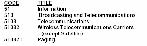
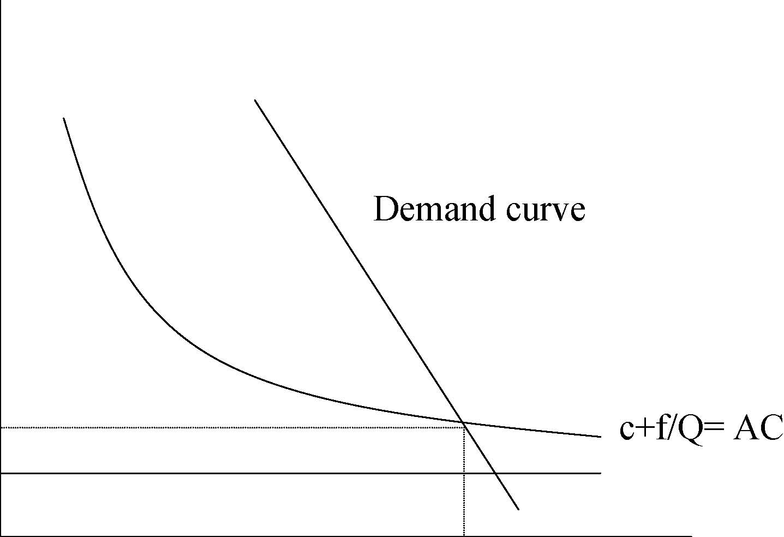
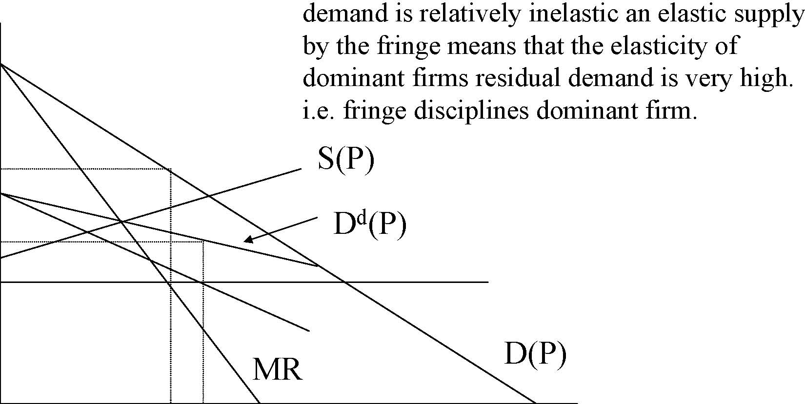
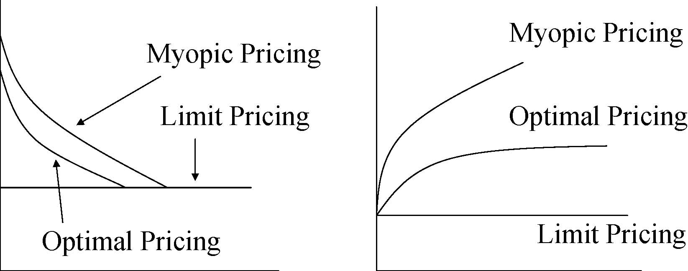
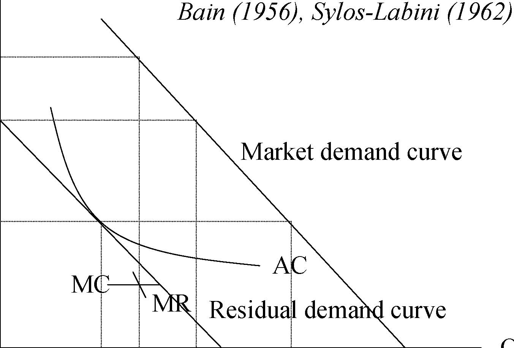
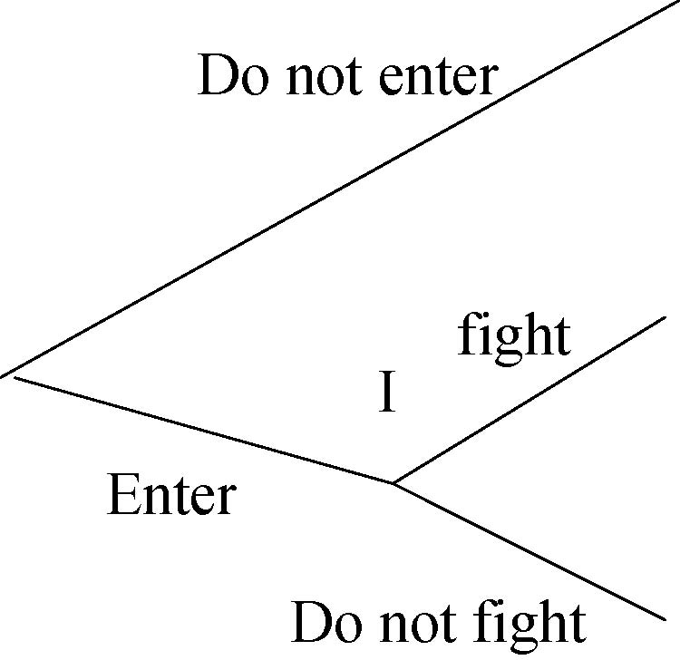
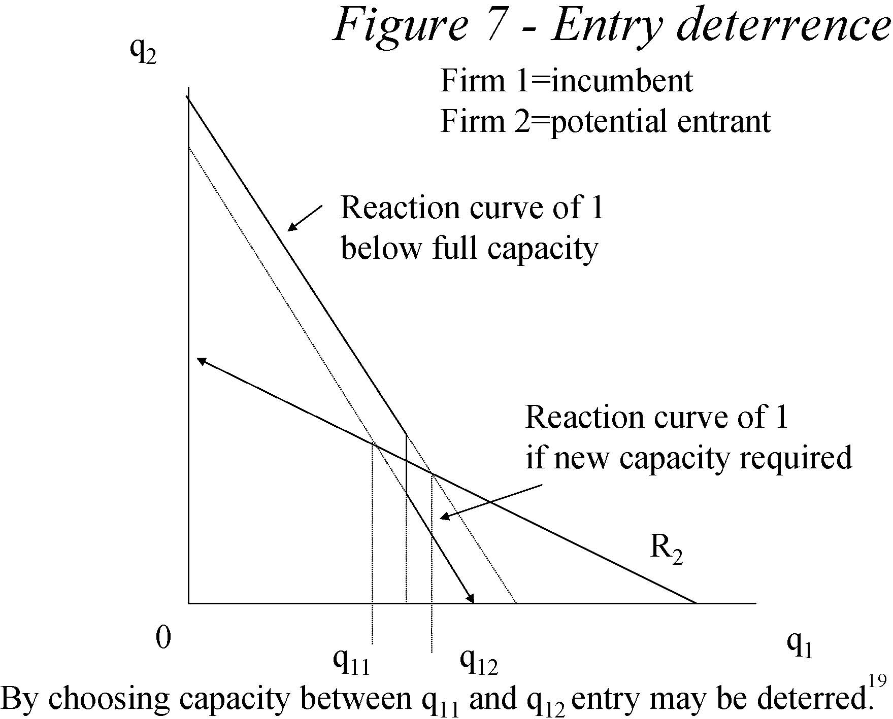
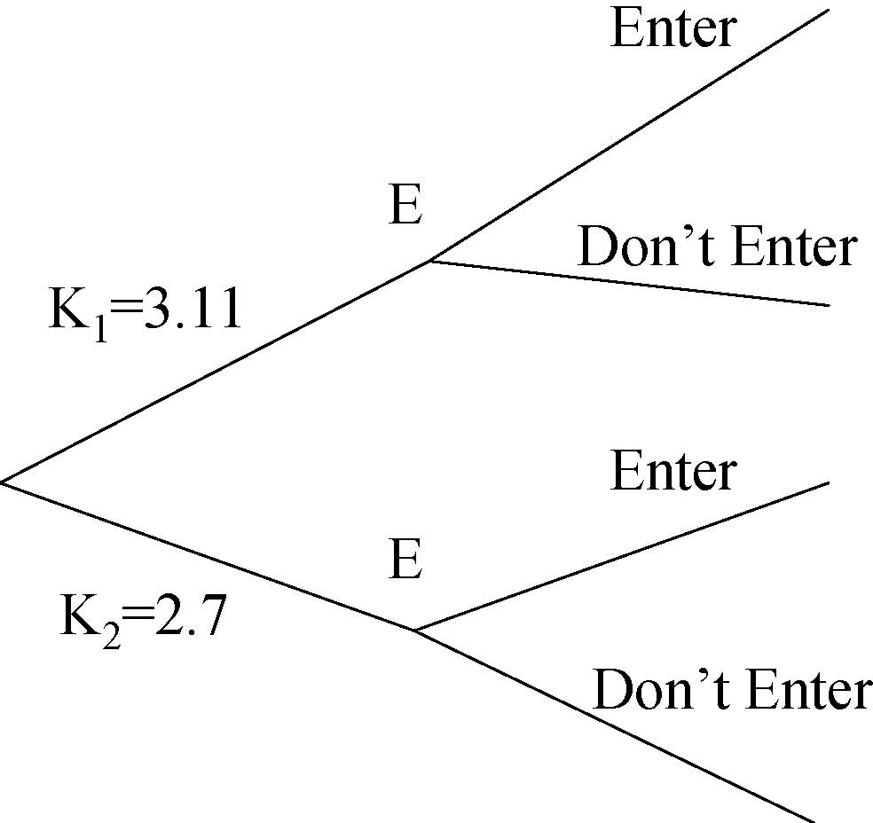

         Acrobat Distiller 5.0.5 (Windows)

         2003-07-28T02:20:23Z

         2003-08-11T14:18:43+05:30

         2003-08-11T14:18:43+05:30

         PScript5.dll Version 5.2

         xml

               bersara

               Microsoft PowerPoint - 14.23 Class4.ppt

# 14.23 Government Regulation of Industry

Class 4

MIT &amp; University of Cambridge

Outline 

-  Definitions 

-  Markets and Concentration 

-  Barriers to Entry 

-  Contestable Markets 

-  Dominant Firm theory 

-  Strategic competition and limit pricing 

-  Entry Deterrence 

-  Brand Proliferation 

Definition of a Market 

-  This is not as easy as it seems. 

-  Identification of real markets can be done by: 

-  physical characteristics of firms’ products 

-  the technology/raw materials employed 

-  the cross price elasticity of demand between products 

-  statistical definition (SIC figures) • 

SIC system changed to NAICS in 1999. 

- 	The example of Alcoa (aluminium ingots) and DuPont (cellophane wrappings) 3 

Measurement of Concentration 

-  Concentration Ratio: CRx, or mkt share of largest x firms. 

-  Easy to measure 

-  Herfindahl index: H=Σsi2, where si=mkt share of ith firm. 

-  Ideal properties 

-  Numbers equivalent property 

- 	Herfindahl Hirschman Index: HHI=Σ(100si)2 –HHI=Σ(100si)2=10000 Σsi2 

-  Used by the Department of Justice Anti-Trust Division 

-  Note connection with N-firm Cournot Model –(P-MCi)/P=si/η; Σ si[(P-MCi)/P]=HHI / 10000*η 

-  HHI is very important in Anti-trust cases. 

Scale Economies

- and Entry Barriers• Why do markets become concentrated? 

-  Scale economies and Entry barriers 

- 	Scale Economies related to LRAC and plant and multiplant economies. 

-  Diseconomies, usually of management, set in eventually. 

- 	Under Free entry, N participants, π(ne) is the profitto each firm if there are N firms (excluding entry costs). K is the fixed cost of entry. 

-  This implies that entry occurs up to the point that: 

π ( ne ) − K &gt; 0 &gt;π ( ne + 1) − K 5

rr 

Barriers to Entry

- 	Difficult to define and can arise for a host of innocent, regulatory and strategic reasons. 

- 	Bain: defines barriers to entry (BTE) in terms of outcome – they exist if firms make super normal profits. 

- 	Stigler: BTE are costs of production incurred by new entrants which are not incurred by incumbents. 

- 	Von Weizsacker: BTE are ‘socially undesirable limitations to entry of resources which are due to the protection of resource owners already in the market.’6 

The theory of contestable markets (Baumol et al, 1982)

- 	A sunk cost is a fixed cost that a firm incurs which cannot be recovered if the firm leaves the market. 

-  Perfect contestability? 

-  It assumes multi-product firms, ultra-free entry and exit, zero sunk costs and quantities adjust faster than prices. 

- 	Why such a fuss about this theory – ‘an uprising in the theory of markets’? 

- 	This shifts the focus of concern about market competitiveness to sunk costs rather than number of firms. Example deregulated US airline industry. 

Figure 1 -Price and output in a natural monopoly which is perfectly contestable

P

Demand curve c+f/Q= AC

PC

MC

QC

Q

If incumbent prices above AC, she will be replaced by entrant.

Dominant Firm Theory 

-  We have a single dominant firm (e.g. AT+T). 

- 	We have a competitive fringe of higher cost suppliers. 

-  Dominant firm is a residual claimant. 

•Dd(P)=D(P)-S(P), where Dd(P)=dominant firm demand, S(P)=fringe demand, D(P)=market demand. 

-  Questions: 

-  To what extent does fringe discipline the behaviour of dominant firm? 

-  How is the dominance of the dominant firm likely to 

evolve over time? 

$

pm 

Figure 2 -Dominant Firm Theory

Solution method for dominant firm is to maximise profits where demand is residual demand. It can be shown that even if market 

p^

p*cd

MR D(P) S(P) Dd(P) demand is relatively inelastic an elastic supply by the fringe means that the elasticity of dominant firms residual demand is very high. i.e. fringe disciplines dominant firm. 

0 qmq* q

Dominant Firm Theory

-  What happens over time to dominance? 

-  At any given time: 

-  S(P(t))=x(t) if P(t)&gt;cf; 0 otherwise. 

- 	Where x(t)=capacity of fringe, cf=unit variable cost and 1 unit of capacity required for each unit of output. Let u(t) be retention ratio. 

- 	To expand fringe invests retained profits in new capacity which costs $z per unit: 

∆ x ( t ) =[P ( t ) − cf ]x ( t ) u ( t )1;if P ( t ) ≥ cf 11z 

What should the strategy of the dominant firm be?

-  Myopic Pricing: 

-  Choose price that maximises current period profits. This will make large profits now but rapidly diminishing market share. E.g. Reynold’s International Pen Corporation. 

-  Limit Pricing: 

-  Set price at level which makes no investment by fringe profitable i.e. P=rZ+cf 

-  Optimal Pricing: 

-  This is somewhere between the two extremes. Under most discount rates myopic pricing is not profit maximising (does not maximise present value), but 12 

neither is limit pricing.

Limit, myopic and optimal pricing

P Size of Fringe Output

Myopic Pricing Optimal Pricing Limit Pricing Myopic Pricing Optimal Pricing Limit Pricing 

PL

0 t0t

Figure 3 Figure 4

Strategic Competition

- 	Strategic competition is any behaviour by a firm to try and improve its future position in the market. 

-  Examples: 

-  Predatory pricing 

-  Regulatory changes 

-  Advertising and R+D expenditures 

-  Patent thickets 

- 	The first way this was studied was looking at limit pricing by the incumbent to reduce post entry profitability of entrant. 

Price 

Figure 5 -The Theory of Limit Pricing 

PM

P1

P2

MC MR AC Market demand curve Residual demand curve Bain (1956), Sylos-Labini (1962) 

0 qE qM qE+qI Output

qI

PM=monopoly price, P1=entry deterring limit price P2=post-entry price 

Figure 6 -Is limit pricing credible? A game of entry deterrence 

E

I Do not enter fight Do not fight Enter 

(5, 0)

(-1,-1)

(1,1)

Entrant moves first, Incumbent responds.For payoffs (x,y), Incumbent gets x, Entrant gets y.Nash Equilibrium is Enter, Do not fight with payoff (1,1).

Credibly affecting entry

- 	Adjustment costs mean that post-entry lowering of output is costly for incumbent: C(Qt)=a+bQt+0.5(Qt-Qt-1)2 

- 	Learning curve: credible to produce a lot to begin with in order to reduce costs in the future. 

- 	Switching costs mean it makes sense to keep price low in order to hook customers. 

- 	Investment in extra capacity in order to lower marginal costs of production, and hence credibly commit to higher post-entry output. 

Dixit Model of Entry Deterrence

- 	This works by lowering the incumbent’s marginal cost and hence making higher output more profitable. (mc=c below initial capacity but, mc=c+r above initial capacity) 

-  An example: 

-  If P=10-(XI-XE); CI=6+rKI+cXI, CE=6+(r+c)XE; K must at least equal X, I=incumbent, E=entrant; then: 

–XI=(10-XE-c)/2 below initial capacity (reaction curve I) 

–XI=(10-XE-c-r)/2 above initial capacity (same as entrant) 

-  Let r=1 and c=1 for simplicity in what follows: 

19 q2 0 R2 q1 Reaction curve of 1 below full capacity Reaction curve of 1 if new capacity required q11 q12 By choosing capacity between q11 and q12 entry may be deterred. Firm 1=incumbent Firm 2=potential entrant Figure 7 -Entry deterrence 

Figure 8 -Strategic Entry deterrence

(1,-0.02) 

E E Enter Don’t Enter Enter Don’t Enter K1=3.11 K2=2.7 

I

(9, 0)(1,1)

(8,0)

Incumbent can choose a capacity level before entry. This implies the Nash equilibrium is K1, Don’t enter. (VVH has three stage game which we have simplified.) 

Raising Rivals Costs

- 	A feasible and credible way to deter entry may be to take actions which raise your rivals’ costs: 

-  Regulation 

-  Unionization 

-  Grand-fathering of rights (like tradeable emissions permits or airline take-off slots) 

- 	These strategies work because although they may mean higher costs for the incumbent, they mean disproportionately higher costs for the rivals. 

Pre-emption and brand proliferation

- 	If there are 2 possible substitute goods (X and Y) then it may pay a monopolist to produce only X and save on fixed costs. 

- 	However if demand for Y picks up such that entry is profitable to produce Y. 

- 	As an incumbent you may want to produce Y ahead of entry being profitable in order to prevent entry and keep price of X up. 

- 	This of course may not be socially efficient and we may get excess brands from a social point of view (of course competition may do this anyway). 

22 

-  E.g. breakfast cereals and fertilizers. 

Conclusions 

- 	Barriers to entry may prevent new firms entering markets especially in conditions of high sunk costs. 

- 	Dominant firms may be severely disciplined by a competitive fringe of higher cost firms, hence may not pose regulatory problems e.g. AT+T. 

- 	Incumbents must act credibly if they are to strategically deter entry. There are many strategies they might adopt to do this. 

- 	Such entry deterring strategies do not usually lead to socially efficient outcomes because fixed costs are incurred above the socially optimal level. 

- 	High barriers to entry, lack of competition, wasteful strategic behaviour all provide rationales for economic regulation. 

Next 

-  Introduction to Economic Regulation 

-  Read VVH Chapter 10. 
