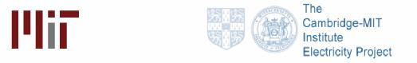
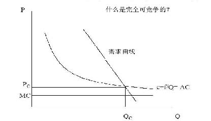
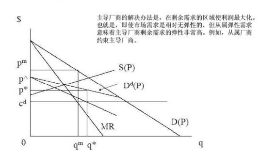
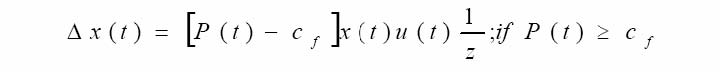
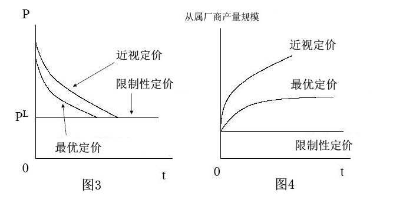
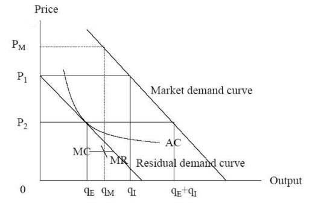
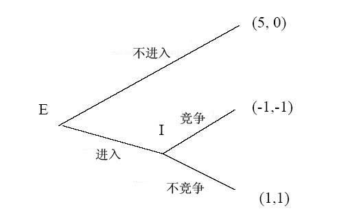
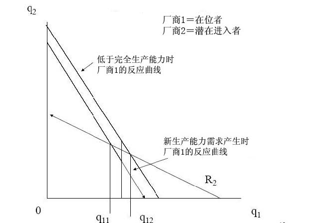
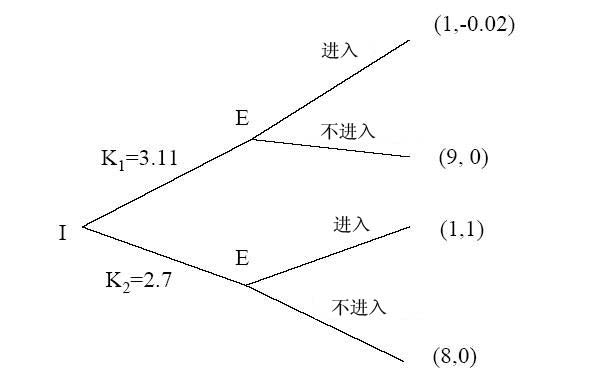

         xml

               user

               第四课.doc

         2005-10-13T10:53:24+08:00

         pdfFactory Pro www.fineprint.com.cn

         pdfFactory Pro 2.30 (Windows XP Professional Chinese)

## 14.23政府的产业规制

## 

### 第四课

麻省理工学院 &amp;剑桥大学提纲 

- 	定义 

- 	市场和市场集中度 

- 	进入壁垒 

- 	可竞争市场 

- 	主导企业理论 

- 	战略竞争和限制性定价 

- 	进入阻碍 

- 	品牌扩张

#### 市场的定义 

- 	市场的实际表现复杂，但定义简单。 

- 	真实市场可以根据以下几点鉴别：－企业产品的物理特征－采用的技术/原材料－不同产品的需求交叉价格弹性－统计定义（SCI数字） 

• 	1999年，NAICS(北美工业分类系统)取代了 SCI（标准工业分类）编码名称 51信息 513广播和电信 5133电信 51332无线电信载体（除卫星） 513321内存分页（paging） 

- 	案例，美国 Alcoa铝公司（铝锭）和 DuPont公司（玻璃纸包装）

- 市场集中度的测量 

- 	集中率：CRx，或指 X个最大企业的市场份额－易测量 

- 	赫芬达尔指数(Herfindahl index):H=Σsi2, si=第 i个企业的市场份额。－理想特征－数量相等特征 

- 	赫芬达尔－赫尔希曼指数（Herfindahl Hirschman Index）：HHI＝Σ（100si）2－HHI＝Σ（100si）2＝10000Σ100si－美国司法部反托拉斯司使用 HHI指数来判定企业市场集中度－注意与 N个企业古诺模型的联系－（P-MCi）/P=si/η; Σsi[（P-MCi）/P]=HHI/10000* η－在反托拉斯案例中，HHI指数非常重要。

- 规模经济和进入壁垒 

- 	为什么市场会变得集中？－规模经济和进入壁垒 

- 	规模经济涉及长期平均成本曲线（LRAC），厂商和多厂商经济－通常会产生管理的不经济最终，并且持续。 

- e

- 	在自由进入的条件下，有 N个企业，p（n ）代表每个企业的利润（不包括进入成本），K代表固定进入成本。－准入条件可以表示为： 

p (ne ) －K&gt;0&gt;p(ne +1) －K

r	r 

进入壁垒 

- 	很难精确定义进入壁垒，因为它的产生归因于众多无恶意的、规制的、和策略方面的原因。 

- 	贝恩（Bain）：根据结果定义进入壁垒－如果企业能获得超额利润，进入壁垒就存在。（和潜在的进入者相比，现有厂商所享有的有利条件，这些条件是通过现有厂商可持久地维持高于竞争水平的价格而没有导致新厂商的进入反映出来的） 

- 	斯蒂格勒（Stigler）：进入壁垒是一种生产成本，这种成本是打算进入这一产业的新厂商必须承担而在位厂商无须承担的。 

- 	冯·威斯塞克/韦尔泽克（Von Weiszacker）：进入壁垒是，为了保护市场上已经存在的资源所有者，而对进入资源的社会性的不合意限制

- 可竞争市场理论（鲍莫尔等， 1982年） 

- 	沉没成本是指企业离开市场时已经发生并且无法收回的固定成本。 

- 	完全可竞争性（perfect contestability）？

- －假设条件为多产品厂商，最大自由的进入和退出，零沉没成本，数量调整快于价格调整。 

- 	将可竞争市场理论称为“市场理论的一次革命”引起了理论界的争议。 

- 	其它市场理论关注焦点在于企业的数量，可竞争市场理论关注焦点在于沉没成本的市场竞争。以美国航空业解除规制为例。

图 1－完全可竞争的自然垄断的价格和产量

如果在位厂商的价格高于平均成本 AC,它将被进入者所取代。

主导企业理论 

- 	产业中只有一个厂商处于主导地位（例如，AT&amp;T公司）。 

- 	具有较高成本的厂商面临从属竞争（competitive fringe）。 

- 	主导厂商面临剩余市场需求。 

- 	主导厂商的需求函数：Dd(P)=D(P)-S(P), Dd(P)为主导厂商的剩余需求函数， S(P)为从属厂商供给函数，D(P)为市场需求函数。 

- 	问题：－从属厂商对主导厂商行为的约束程度有多大？－随着时间发展，主导厂商的优势是如何变化的？

图 2－主导厂商理论

主导厂商理论 

- 	随着时间发展，主导企业的优势怎么变化？ 

- 	在任何给定的时间： 

- 	如果 P(t)&gt;cf，S(P(t))＝X(t)；如果 P(t) &lt;＝cf，则 S(P(t))＝0。 

-  	X(t)表示从属厂商在时间 t内的总生产能力，在时间 t内从属厂商能够生产的最大产量就是 X(t)；cf表示生产一个单位的产出所要求的单位可变成本和一个单位的生产能力，u（t）表示留存比率（retention ratio）。 

- 	从属厂商将留存利益用于投资扩张新的生产能力，生产能力被假定为永远存在，每个单位的成本是 Z：

什么是主导厂商的价格策略？ 

- 	近视定价（myopic pricing）：

- －选择一个使主导厂商现在利润最大化的价格。设定这样的价格能使企业获得大量的利润，但会迅速减少市场份额。罗纳德（Reynold）国际钢笔公司就是一个典型的例子。 

- 	限制性定价（limiting pricing）：

- －为阻止从属厂商生产能力的扩张，主导厂商设定一个价格，在这个价格水平上，从属厂商的投资收益为零，称为限制价格，即 P=rZ＋cf 

- 	最优定价（optimal pricing）：

－在近视价格和限制价格之间设定一个价格。在大多数的贴现率条件下，近视定价没有达到利润最大化（没有最大化现值），同样限制性定价也没有达到利润最大化。

限制性、近视和最优定价

战略竞争 

- 	战略竞争是指某个厂商为了提高其未来在市场中的地位而采取的行动。 

- 	战略竞争的形式－掠夺性定价－规制变化－广告和研发费用－专利 

- 	掠夺性定价是指，在位厂商通过制定限制价格以减少进入者的进入后利润。

图 5－限制性定价理论贝恩（1956年），赛娄斯·拉比（Sylos-Labini）（1962年） 

Pm＝垄断价格，P1＝进入阻碍限制价格，P2＝进入后价格

图 6－限制性定价是否可置信？进入障碍博弈

进入者先行动，然后在位者做出反应。设博弈收益为（X,Y），在位厂商的收益为 X，进入厂商的收益为 Y。这个博弈的纳什均衡解是进入，在位者面对新的进入者不采取行动，收益为

（1，1）。

可置信影响进入 

- 	调整成本是指在位厂商因为进入后的影响而减少的产出，其函数表达式为： C(Qt)＝a＋bQt+0.5(Q-Qt-1)2 

- 	学习曲线（learning curve）：表示生产厂商在未来通过大量生产以降低成本是可置信的。（表示一种商品的平均成本与生产者累积总产量之间的关系）。 

- 	转换成本在厂商保持低价以吸引顾客时发挥作用。 

- 	对额外生产能力的投资能降低产品的边际成本，得到更高的进入后产量。

- 迪克西特（ Dixit）进入阻碍模型 

- 	迪克西特模型描述在位厂商如何降低边际成本，得到更多产量，和更多利润。（在生产能力范围内时，mc＝c，当超出生产能力时，mc＝c＋r） 

- 	例子：－如果 P=10-(XI-XE);CI=6+rKI+cXI,CE＝6＋（r＋c）XE;K至少与 X相等，I表示在位厂商，E表示进入者，则得到：－在生产能力范围内时，XI＝（10―XE―c）/2（反应曲线 I）－当超出生产能力时，XI＝（10―XE―c－r）（对于进入者，同理）－为了简便，设 r＝1，c＝1，得到：

图 7－进入障碍

选择 q11和 q12之间的生产能力，可以阻止进入。图 8－战略进入障碍

在位者在进入前选择一个生产能力水平，则意味着纳什均衡解为 K1,即不要进入。（VVH描述一个三阶段的博弈，我们这里简化了）

增加竞争对手的成本 

- 	一个可行和可信的阻止进入的方法是采取行动来增加竞争对手的成本：－规制－联合－过去得到许可的权利（例如可交易废弃物许可证或飞机场起飞滑道） 

- 	这些策略发挥作用，虽然对在位者意味着更高的成本，但是对竞争对手来说是不合比例的更高的成本。

- 优先购买权（ pre-emption）和品牌扩张 

- 	如果市场上有两个可能替代的产品（X和 Y），则垄断者仅生产 X，节省固定成本。 

- 	但如果顾客对 Y的需求上升，则进入是有利可图的。 

- 	因为进入是有利的，在位厂商在进入之前可能会生产 Y，以阻止进入和维持 X的价格。 

- 	从社会的角度来看，这种行为可能没有效率，我们也会面对过多的品牌（当然竞争也会造成这种结果）。 

- 	案例，谷类早餐和化肥。

- 结束语 

- 	进入壁垒会阻止新企业进入市场，尤其是在产业具有高沉没成本的情况下。 

- 	主导企业可能受到具有高成本的企业从属竞争的严格约束，因此就可能不会产生规制问题，例如，AT+T案例。 

- 	如果在位厂商想战略性的阻止进入，那么他们的行动必须是可置信的。战略进入阻碍的形式有很多种。 

- 	这些进入阻碍战略通常不会导致社会有效福利，因为在社会最优水平之上进入者将承担固定成本。 

- 	高进入壁垒，竞争的缺乏，不经济的战略行为都为经济规制提供了理论基础。

- 下一课 

- 	经济规制的介绍 

- 	阅读 VVH第十章。
