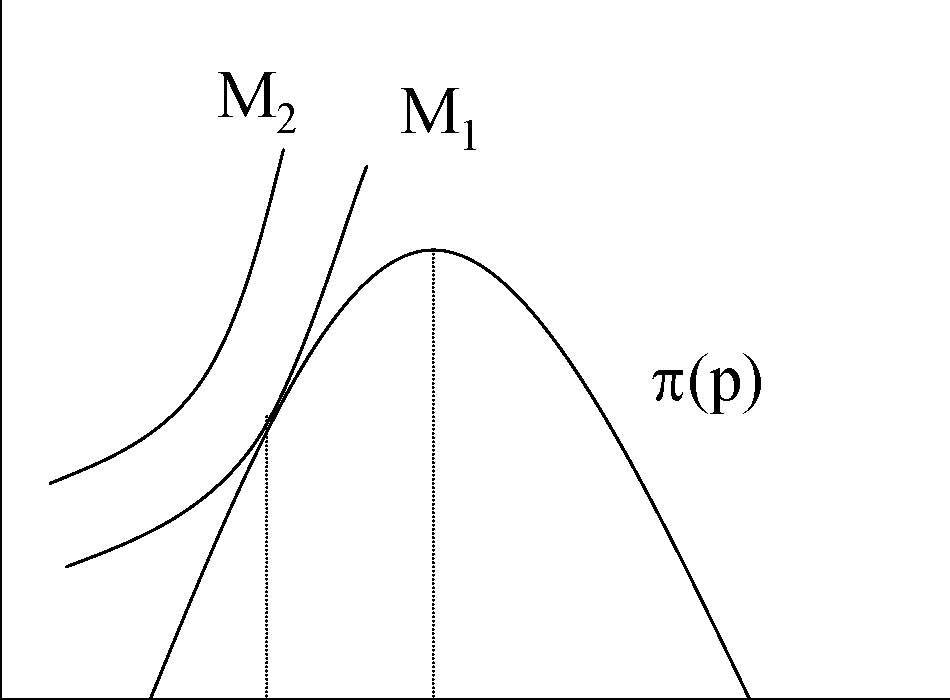
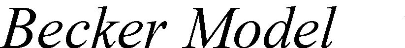
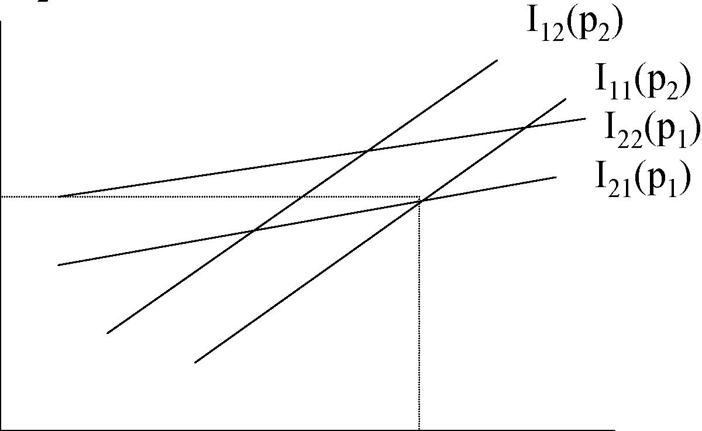
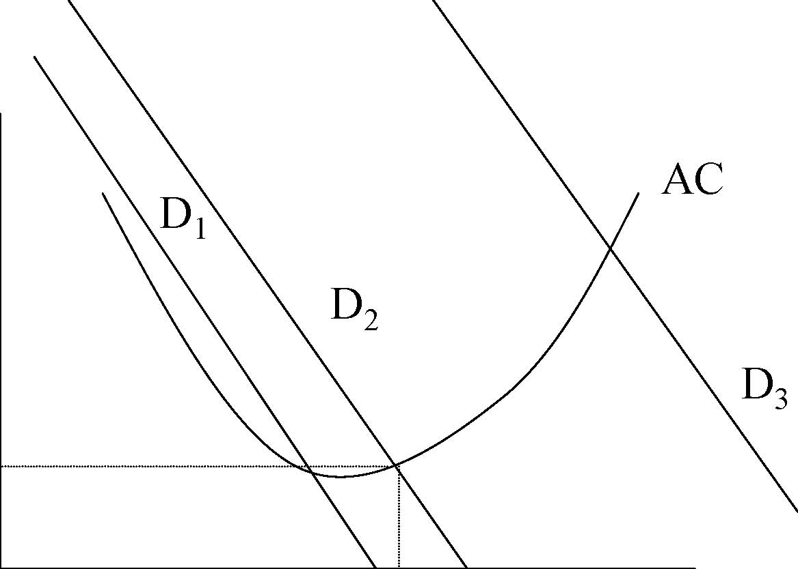
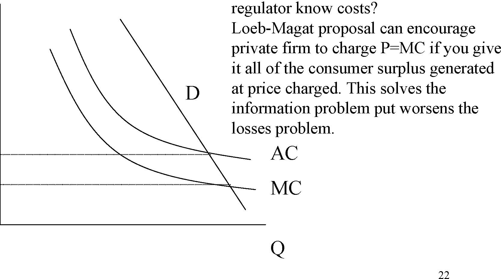

         Acrobat Distiller 5.0.5 (Windows)

         2003-07-28T02:20:45Z

         2003-08-11T14:22:11+05:30

         2003-08-11T14:22:11+05:30

         PScript5.dll Version 5.2

         xml

               bersara

               Microsoft PowerPoint - 14.23 Class5.ppt

# 14.23 Government Regulation of Industry

Class 5

MIT &amp; University of Cambridge

1

-  Instruments of Regulation 

-  History of Regulation in the US 

-  Overview of process of regulation 

-  Theories of Regulation 

-  Theory of Natural Monopoly 

-  Pricing under Monopoly 

-  Conclusions 

2

-  A definition: 

- 	‘A government imposed limitation on the behavior of individuals or organizations.’ 

- 	e.g. minimum wage restrictions, pollution targets and information requirements. 

3

-  Control of price 

-  This aims to prevent both predatory pricing and over charging. 

-  Control of quantity 

-  Universal service obligations, maximum production limits. 

-  Control of entry 

-  e.g. in long distance telecoms and NYC taxicabs 

-  Control of quality 

-  e.g. of emissions, customer service levels, safety etc. 

4

- 	Religious leaders have restricted the price of credit and discussed ‘Just Prices’ (e.g. Aquinas) 

- 	Modern economic regulation begins in 1870s with regulation of water and gas rates. 

- 	In US case law develops scope for regulatory action. 

5

-  Munn v. Illinois (1877) 

-  1871 Illinois sets a ceiling on rates for grain elevators 

-  Munn and Scott claim law deprives them of private property without due process (5th amendment). 

-  Ruling establishes public interest defense for regulation of private property. 

-  Interstate Commerce Act of 1887 

-  Railroads affected by high prices with periodic price wars. 

-  Act establishes Interstate Commerce Commission (ICC) to regulate railroad rates. 

6

-  Nebbia vs New York (1934) 

-  NY regulating price of milk 

-  Nebbia undercuts price of milk and is sued. 

-  Claimed that: 1. Market is competitive, 2. Market is not a utility, 3. Due process violated. 

-  Court ruled: 1.&amp; 2. Yes; 3. No. 

-  This establishes that any industry can be regulated. 

- 	MA was regulating utilities in 1885 and by 1930 most states had Public Service Commissions. 

7

-  3 spurts of regulation: 1909-1916, 1933-40, 1973-

- 80. 

-  1930s: 

-  ICC expanded into trucks, water barges, oil pipelines, passenger buses. 

-  1934 Federal Communications Commission (FCC) 

-  1935 Federal Power Commission (Electricity and Natural Gas) 

-  1934 Securities and Exchange Commission (SEC) 

- 	Steady growth, in 1977 17% of GNP was fully regulated. 

8 

- 	Parallel trends around the world except that in many cases public ownership was adopted in order to better regulate industries. 

-  In United Kingdom large scale nationalizations: 

-  Telecoms (1912) 

-  Bank of England (1946) 

-  Rail (1948) 

-  Electricity (1948) 

- 	This allowed the state to better regulate pricing and service than the private sector was doing at the time. 

9

- 	Worldwide wave of de-regulation begins towards the end of the 1970s. 

- 	In the US: Airlines, railroads, trucking, passenger buses, long distance telephone, wholesale power. 

- 	In Europe: Rail, Telecoms, Electricity, Gas, Postal Services, Air transport all subject to national and European Union wide legislative changes. 

- 	In the US: only 6.6% of GNP fully regulated by 1988 (17% in 1977). 

- 	In the UK: 10% of GNP transferred from state control to private (usually competitive) ownership between 

10

1979 and 1997. 

# Overview of Process of Regulation

-  Legislation (e.g. Federal Power Act, 1935): 

-  Specifies a regulatory agency 

-  Specifies powers of the agency 

-  Specifies policy objectives 

-  E.g. reasonable and just service to all consumers. 

-  Implementation: 

-  Federal regulatory commissions usually have 5 members, can be experts or political friends. 

-  Commissioner may be fired for cause but not at will (independent). They can use case by case hearings or an across the board ruling. 

-  Staff of Commission collect data and advocate against industry. 

11 

# Overview of Process of Regulation

-  3 types of Commission Employee: 

-  Careerist (wants agency to exist and grow) 

-  Politician (will leave agency for other office) 

-  Professional (will move on to other work) 

-  In pricing legislation for instance, professional wants complex regime with nice theoretical properties, careerist wants simple set up to avoid problems and politician wants to please interest groups. 

-  Other players include: 

-  Consumer groups – want lower prices 

-  Incumbent firms – want high stable profits 

-  Competitors – want more liberalised markets 

12 

- 	Normative Analysis as a Positive Theory or Public Interest Theory 

-  In some markets unconstrained competition does not work e.g. under natural monopoly or externalities. 

-  Under natural monopoly productive efficiency suggests we should have one firm and p=mc but this does not happen in an unconstrained market. 

-  Normative analysis suggests that in this circumstance we should have regulation. 

-  Positive analysis says that regulation does occur when we have these sorts of circumstances. 

-  This suggests a pro-social welfare motive for 

13 

regulation.

-  Capture Theory (Stigler) 

-  Regulation is supplied in response to the industry’s demand for regulation. 

-  Regulatory agencies are created by captured legislatures. 

-  Regulatory agencies come to be controlled by industry. 

-  This suggests a pro-producer theory (i.e. pro-producer surplus theory) of regulation. 

Most regulation would seem to be motivated by a combination of the above two theories. 

14

-  Economic Theory of Regulation 

-  Stigler-Peltzman Model predicts that: 

-  Regulatory legislation redistributes wealth. 

-  Behavior of legislators is driven by desire to remain in office. 

- 	Interest groups compete by offering political support in return for favorable legislation. 

- 	Example of electric power rates: residential, commercial and industrial power rates showed lower price-cost ratios for industrial and industrial customers relative to commerical ones, why? 

–Becker Model: 

- 	Focuses just on role of interest groups and assumes that they compete with one another to gain most influence. 

15

π

π(p) M1M2 

0 pc pm Price, p 

16

p*

Increase in costs of regulation increases the 

influence activity of firm, 2 and reduces it 

Becker Model 

for consumer, 1. This is because a given 

wealth transfer to 2 from 1 is more costly to 

firm 2 (increased incentive to pay to avoid it) 

and is more costly to acquire for consumer 1 

Pressure, p

I12(p2) I11(p2) I22(p1) I21(p1) 

2 (less incentive to pay to get it). 

p*2 

0 p*1 Pressure, p1 

17

# Conclusions ofEconomic Theory of Regulation

- 	Tendency for regulation to be designed to benefit relatively small groups with strong preferences relative to big groups with weak preferences. 

- 	Pro-producer tendencies are disciplined by consumer groups meaning that price is less than the monopoly level. 

- 	Regulation most likely in competitive or monopoly industries as there is strong incentive for one group to lobby for regulation. 

- 	In the presence of market failure regulation is likely because of the large losses this inflicts on some interest groups. 

18

# Can Economic Theory of Regulation explain de-regulation?

-  Partly: 

-  Consider: 

-  Role of New Technology 

-  Demand Growth 

-  Inefficiency and budget deficits 

-  How do these affect interest groups around legislation? 

- 	However there was a strong role for public interest theory as well e.g. was Mrs Thatcher economically rational? 

- 	One should be careful in moving towards non-falsifiable economic theories of human behavior 

as all insights may be lost. 

19 

## Solving the Natural Monopoly pricing problem

-  Is it really a natural monopoly? 

-  Linear pricing 

-  Two part tariffs 

-  Loeb-Magat proposal 

-  Franchise Bidding e.g. Cable TV 

-  Ramsey Pricing e.g. telephone service? 

-  Public Enterprise e.g. MBTA 

20

$ 

D3 D2 D1 AC 

P2

0Q

Q2

A natural monopoly has as a sub-additive cost function.

21

# Linear Pricing 

P=AC or P=MC?P=MC may be efficient buthow are losses to be funded?If we have a private firm how does

$

22 D regulator know costs? Loeb-Magat proposal can encourage private firm to charge P=MC if you give it all of the consumer surplus generated at price charged. This solves the information problem put worsens the losses problem. 

PACPMC

0

AC

MC

Q

# Two Part Pricing andRamsey Pricing

-  Two part pricing: fixed fee plus per unit charge. 

-  Unit charge could equal marginal cost. 

- 	Problem fixed charge may discourage some people from taking service at all. 

-  Solution vary fixed charge to cross-subsidise low users. 

- 	Ramsey pricing minimises the deadweight losses incurred in raising prices to cover costs for multi-product monopolists. This happens when (P-MC)/P = α/price elasticity of demand, where α=some constant.

23 

-  Public Enterprise 

-  Read VVH Chapter 14. 

24
