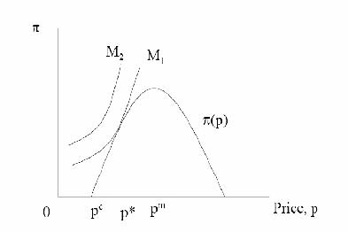
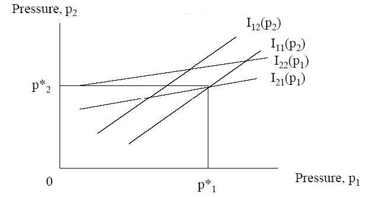
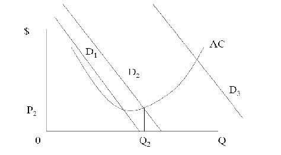
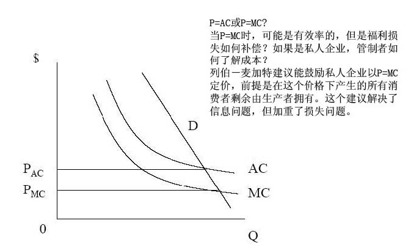

         xml

               user

               第五课.doc

         2005-10-13T10:54:15+08:00

         pdfFactory Pro www.fineprint.com.cn

         pdfFactory Pro 2.30 (Windows XP Professional Chinese)

## 14.23政府的产业规制

## 

### 第五课

#### 麻省理工学院 &amp;剑桥大学提纲 

- 	规制手段 

- 	美国的规制简史 

- 	规制过程概述 

- 	规制理论 

- 	自然垄断理论 

- 	垄断定价 

- 	结论

#### 规制 

- 	一种定义： 

- 	‘政府对个人或组织行为的强行限制。’ 

- 	例如，最低工资标准，污染目标，和信息要求。

#### 规制手段 

- 	控制价格－目的是为了防止掠夺性定价和高额收费。 

- 	控制数量－全体服务职责，最高产量限制 

- 	控制进入－例如，长途电信，纽约市出租车 

- 	控制质量－例如，关于废弃物，消费者服务水平，安全等等的质量。

#### 规制简史 

- 	宗教领袖限制信用价格，讨论“公正价格”（例如，阿奎奈） 

- 	近代经济规制始于 1870年对水和天然气的费率规制。 

- 	在美国的案例中，法律扩大了规制行动的范围。

#### 规制简史 

- 	马恩对伊利诺伊州诉讼案（1877年）－1871年伊利诺伊州设定粮仓价格的上限－马恩和斯科特宣称，法律没有经过正当的程序剥夺了他们的私人财产。（第

-  	1887年州际商业法案－铁路遭受了周期性的高价格战。－为规制铁路价格，法案批准成立州际商业委员会（ICC）。

#### 规制简史 

- 	内伯亚对纽约州案（1934年）－纽约市对牛奶价格进行规制－内伯亚因廉价出售牛奶而被起诉。－被告认为：1.牛奶市场是竞争市场， 

2.牛奶业不是公用事业（not a utility）， 

- 	马萨诸塞州从 1885年开始对公用事业进行规制，但直到 1930年绝大多数州才成立了公共服务委员会（Public Service Commission）。

#### 规制发展 

- 	规制立法的三次高峰：1909－1916年，1933－1940年，1973－1980年。 

-  	20世纪 30年代：－ICC的规制范围扩展到卡车，驳船，石油管道和载客公共汽车运输。－1934年成立了联邦通信委员会（FCC）。（规制广播行业）－1935年成立了联邦能源委员会（Federal Power Commission）（州之间的电

- 	受到完全规制地行业其生产总值稳定增长，1977年占美国 GNP的 17%。

#### 公有制 

- 	在许多案例中，采取公有制是为了更好的规制产业。世界范围内许多国家都采取了公有制。 

- 	英国大规模的国有化：－电信（1912年）－英格兰银行（1946年）－铁路（1948年）－电力（1948年） 

- 	与私人部门相比，公有制能更好的规制价格和服务。

规制放松

- 	世界范围的规制放松浪潮开始于 20世纪 70年代末。 

- 	美国放松对以下行业的规制：航空业，铁路，公路运输，载客公共汽车，长途电话，能源批发。 

- 	在欧洲，铁路，电信，电力，天然气，邮政服务和航空运输这些行业都服从于国家和欧盟广泛的立法变化。 

- 	在美国，1988年受到完全规制地行业其生产总值仅占 GNP的 6.6%(1977占 17%)。 

-  	1979年到 1997年，英国 GNP的 10%从公有企业转移到私有企业（通常是指竞争性的行业）。

#### 规制过程概述 

- 	立法（例如，1935年联邦能源提案）：－明确规制机构－明确规制机构的权力－明确政策目标 

·例如，向顾客提供合理和公正的服务。 

- 	实施：－联邦规制委员会通常由五个成员组成，他们是专家或者政治盟友。－委员会是独立的，委员可以因为某些原因离职，但不能随意离职。他们举

#### 规制过程概述 

- 	规制委员会的三种成员：－职业人员（希望机构能够持续存在和发展）－政治家（希望当选或被任命新的职位而离开机构）－专业人士（具有某些特定技能可能会从事其它职业）－以价格立法为例，专业人士希望采用具有明显理论特征的复杂价格体系，

- 职业人员则支持一个简单价格体系以避免问题，而政治家倾向于不激怒利益集团。 

- 	其它参与者包括：－消费者集团－希望更低的价格－在位厂商－希望稳定的高额利润－竞争者－希望自由化程度更高的市场

- 规制理论 

- 	对实证理论或公共利益理论的规范分析－在某些市场，不受限制的竞争并非就运作良好。例如，自然垄断行业，或

遭遇外部性问题。－在自然垄断行业，只有一家企业，且 p＝mc时，生产效率达到最优，但是

规制理论 

•	俘获理论（斯蒂格勒）－应产业对规制的需求，产生规制供给。－规制机构由被俘获的立法机构创立。－规制机构由受规制的产业所控制。－这就是规制的亲生产者理论，例如亲生产者剩余理论。

似乎大多数规制由以上两种理论结合起来推动。

规制理论 

•	经济规制理论－斯蒂格勒－佩尔斯曼模型预测： 

- 	规制立法重新分配财富。 

- 	立法者的行为受希望继续留任的动机驱使。 

- 	利益集团通过提供政治支持来获取有利的立法倾斜。 

- 	以电力费率为例：在居民，商业和产业能源费率当中，产业相对

•	仅关注利益集团的角色，假设他们相互竞争以获得更多影响力。

佩尔斯曼模型

贝克尔模型

规制成本的增加提高集团 2施加的影响力，减少集团 1的。这是因为成本的增加意味着集团 2遭受比集团 1获得任何给定的财富转移更大的损失，因此集团 2愿意施加更多影响力的动机比集团 1强烈。

经济规制理论的结论 

- 	规制具有帮助对其有强烈偏好的相对较小利益集团牟利的趋势。 

- 	亲生产者趋势受到消费者集团的约束意味着价格低于垄断水平。 

- 	规制最有可能发生在竞争或垄断产业，这些行业有强烈的动机去游说实行规制。 

- 	市场失灵使得规制更有可能存在，因为一些利益集团遭受巨大的损失。

- 经济规制理论能解释规制放松吗？ 

- 	部分原因：－考虑以下因素： 

- 	新技术的作用 

- 	需求增长 

- l无效率和预算赤字

- 	但是公共利益理论的作用也非常重要。撒切尔夫人的行为在经济学上是理性的吗？ 

- 	当丢失所有的洞察力时，应慎重运用人类行为的非歪曲经济理论。

- 	一个产业是否真正是自然垄断行业？

- l线性定价（linear pricing） 

- l两段式价格（two-part tariff） 

- l列伯和麦加特（Loeb and Magat）建议 

- l特许经营权竞标，以有线电视为例 

- l拉姆齐（Ramsey）定价，以电话服务为例 

- l公有企业，以 MBTA为例

解决自然垄断定价问题 

自然垄断？

自然垄断拥有劣加的成本函数。

线性定价

两段定价和拉姆齐定价 

- 	两段定价：固定费用加每单位价格。 

- 	单位价格可能等于边际成本。 

- 	存在的问题：如果实行两段定价，则一些消费者可能被逐出市场。 

- 	解决方案：通过制定不同的固定价格以交叉补贴支付意愿低的消费者。 

- 	多产品垄断者通过提高价格来弥补成本，但会产生无谓损失。拉姆齐定价能使无谓损失最小化。其数学表达式为：（P-MC）/P=a /需求的价格弹性，a是常数。

- 下一课 

- 	公有企业 

- 	阅读 VVH第十四章。
