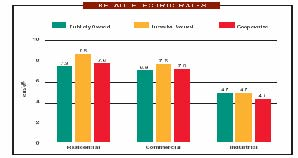
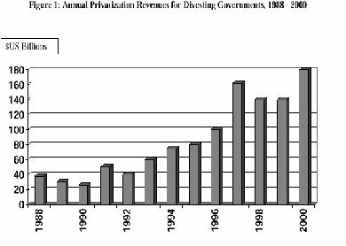
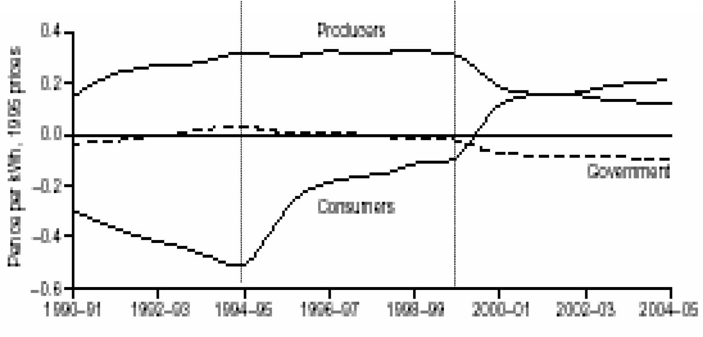

         Acrobat Distiller 5.0.5 (Windows)

         2003-07-28T02:21:01Z

         2003-08-11T14:25:55+05:30

         2003-08-11T14:25:55+05:30

         PScript5.dll Version 5.2

         xml

               bersara

               Microsoft PowerPoint - 14.23 Class6.ppt

# 14.23 Government Regulation of Industry

Class 6

MIT &amp; University of Cambridge

1

Outline 

-  History of public enterprise 

-  Theory of private vs. public enterprise 

-  Managerialism: better or worse? 

-  Prices under different forms of ownership 

-  Productive efficiency under public ownership 

-  Privatization: theory and evidence 

-  Conclusions 

2

A history of Public Ownership

- 	Romans had public ownership of water industry and military arms production. 

-  Public ownership in the US is substantial in: 

-  Electricity (20%, 2000+ firms) and Gas 

-  Water (80%) 

-  Local transport: bus, subway, commuter rail. –Rail 

-  Roads 

-  Airports 

- 	In post-War Europe more public ownership of telecoms, electricity and other commercial firms. 3 

The case for public ownership 

-  To achieve re-distributive goals 

-  To ensure adequate investment 

-  To prevent monopolisation 

-  To facilitate coordination 

-  To ensure safety or security 

-  To reduce financial cost (inc. regulatory cost) 

-  To allow more macroeconomic stabilisation 

4

The case for private ownership

- 	Markets are good at allocating property rights (Property Rights Theory, Alchian and Demsetz, 1965). 

- 	Bureaucracies are bad at running businesses (Public Choice Theory, Niskanen, 1968). 

- 	Explicit regulation of privatised companies can be more effective than oversight of public corporations (Theory of Regulation, Baron and Myerson, 1982). 

- 	Private ownership reduces influence activities and power of interest groups (Influence theory, Milgrom and Roberts,90). 

- 	Private ownership increases cost of disruptive government intervention (Commitment Theory, Boycko et al., 1996).

5 

Organisational Alternatives (Parker and Hartley, 91)

-  Co-operatives 

-  Central government ownership (large scale) 

-  Municipal government ownership (small scale) 

-  Government Department 

-  Quasi-Government Agency 

-  Public Corporation 

-  Wholly-owned public limited company (plc) 

-  Public limited company (plc) 

6

Incentives in the public and private sector

- 	Is it possible to incentivise utility managers to deliver socially optimal service? 

- 	Yes, if contracts can be written which reward managers for this service delivery. 

- 	For a conventional private firm this works through profits being positively related to performance and managerial incentives -job tenure, promotion and pay-being related to profits of the firm. 

- 	For a monopoly public service company explicit contracts need to be written which reward/penalize the firm for delivering the socially optimal service and then with the manager to align her incentives with this. 7 

Incentives in the public and private sector

- 	For the private monopoly the problem is that writing the contract between the firm and society is difficult. 

- 	For the public monopoly the problem is that incentivising the manager may be difficult. 

- 	The case for public ownership is stronger when non-contractible quality is important (e.g.safety, national security) (Hart, Shleifer and Vishny, 97). 

- 	The case for private ownership is stronger where esprit du corps, reputation effects and political monitoring of managers are weak (e.g.for a national telecoms co.). 8 

Public ownership in the US(Glaeser, 2001)*

- 	Public ownership may be particularly advantageous in the presence of idiosyncratic local monopoly where contracting and monitoring are difficult. 

- 	This may be because private firms have incentives to underpay for inputs, get overpaid for outputs and pervert subsidies for externalities and to bribe politicians. 

- 	A good example of this may be local transportation. A private provider will lobby to get the rights of way for free, demand high prices and lobby for subsidies for unprofitable routes. 

-  It may be less corrupting to municipalize provision. 9 

*http://post.economics.harvard.edu/hier/2001papers/HIER1930.pdf 

Stronger case for government ownership in WW2 (Gleaser, 2001)

- 	Government controls salaries and prevents inflation in wages. 

-  This is important where the government is a large purchaser of the ultimate product (applies to healthcare and education). 

- 	Government cant separate ability to write contracts from ownership. 

-  This arises due to the lack of experience of the particular circumstances which arise in a war. 

- 	Unpredictable demands mean that the costs of renegotiation with the private sector are expensive. 

-  Normally this is a good thing because it reduces political interference. 10 

Public vs. Private Ownership

- 	Largely an empirical question for situations where quality is important and monitoring of public enterprises is strong. 

- 	Public ownership can be used to redistribute consumer and producer surplus: 

-  Low prices may be supported by tax dollars and cheap loans as part of a welfare policy (e.g.public transport). 

-  High prices may be enforced as a revenue collection activity (e.g.state liquor stores). 

- 	However the question remains do public utilities deliver lower prices and at what cost? 

11 

US Electricity Prices by ownership form, 2000

Source: APPA, 2002

12

Price Discrimination 

- 	Peltzman (1971) suggests that publicly owned firms have less of an incentive to price discriminate than privately owned firms. 

- 	While lower prices may be associated with lower deadweight losses of monopoly, lower levels of price discrimination are associated with greater deadweight losses. 

- 	The reason why public firms discriminate less would be because it is politically popular to have simple rate structures. 

13

Productive Efficiency 

- 	A large number of studies look at costs in publicly owned and privately owned utilities 

-  Electricity (mixed) 

-  Water (private more efficient) 

-  Health insurance and hospitals 

-  Refuse collection (mixed) 

-  Railroads 

-  Airlines (private more efficient) 

-  Banks (private more efficient) 

- 	Difficult to compare in advance because of differences regulation and lack of competition. 

- 	Deregulation changes ownership, regulation and competition simultaneously. 14 

Worldwide Privatisation Programme

-  Political Rationale: 

-  Reducing government involvement in industry 

-  Increasing efficiency 

-  Reducing public sector borrowing requirements 

-  Curbing Trade Union Power 

-  Creating wider share ownership 

-  Gaining political advantage 

15

Source: Megginson and Netter, Journal of Economic Literature, 2001 16

The Performance effects of International Privatisations

Obs 

(Weighted) 

218 

170 

154 

209 162 

188 

106 

Mean change % 

Statistically significant 

Yes 

Yes 

Yes? 

Yes 

No 

Yes 

Yes 

17 

due to privatisation 0.04 

0.19 

0.05 

0.83 

286 

-0.05 

0.023 

improving 67 

81 

60 

80 49 

67 

80 Net income / sales Real sales / employee Capex / sales Real sales 

Total employees Debt / Assets Dividends / sales 

Source: Megginson and Netter, 01

England and Wales (E&amp;W)Electricity Privatisation

-  Mixed ownership until 1948 nationalisation 

-  Then CEGB (generation and transmission), 12 Area Boards (distribution and retailing). 

-  Restructured in England and Wales 1990 

-  3 power generators 

-  1 national grid (transmission) company 

-  12 regional electricity supply companies (RECs) 

-  Power pool created 

-  Supply for &gt;1MW customers liberalised 

-  RECs privatised 1990 

-  Fossil fuel gencos privatised 1991 

18 

-  Newer nuclear power stations privatised 1996 

E&amp;W Electricity: Regulation

-  Pool exhibited signs of gaming by 2 major gencos 

- 	Now 6+ major gencos and IPPs in market following break up 2 incumbents. 

-  Distribution and transmission price cap regulated 

-  Market successively liberalised: 

-  1990 &gt;1MW 

-  1994 &gt;100kW 

-  1998-99 &lt;100kW 

- 	UK clearly leading the way in shaping and complying with 1997 EU Electricity Directive. 

19

E&amp;W Electricity:Performance since privatisation

-  ∆PS: Large initial increase in profits 

-  ∆Wages: Labour productivity up more than 100% 

-  ∆G: Government has gained tax revenue and asset sales 

-  ∆CS: Domestic prices have fallen 20% 

-  ∆W: Total factor productivity growth up 

-  Competitors have entered the market 

-  Companies have expanded overseas 

-  Emissions of SO2 and CO2 fell substantially 

20

Distribution of Benefits of Privatisation of RECs1st Control Period 2nd Control Period 3rd Control Period

Domah and Pollitt (2001) 21

Government ownership in developing countries

-  This may be a good idea: 

-  If there is a high option value to waiting to privatize (e.g. in Eastern Europe). 

-  If regulatory capacity is weak. 

-  If private capital markets are under-developed. 

-  If privatization increases scope for corruption. 

- 	However rapid privatization may be good for getting in new investment and technology from foreign and domestic private sector owners. 

22

‘In the end what matters is how the combination of ownership and regulation under private ownership compares with ownership and (implicit or explicit) regulation in the public sector.’ 

Vickers and Yarrow (1991) 

23

Next 

-  Natural Monopoly Regulation 

-  Read VVH Chapter 11-12. 

24
