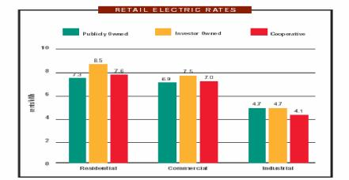
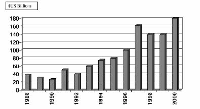
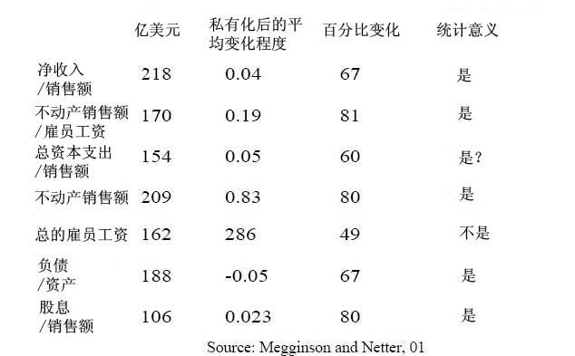
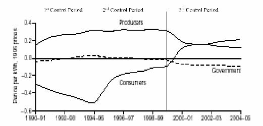

         xml

               user

               第六课.doc

         2005-10-13T10:56:01+08:00

         pdfFactory Pro www.fineprint.com.cn

         pdfFactory Pro 2.30 (Windows XP Professional Chinese)

## 14.23政府的产业规制

## 

### 第六课

麻省理工学院 &amp;剑桥大学提纲 

- 	公有企业的历史 

- 	私有企业和公有企业理论 

- 	管理主义：更好或更坏的结果？ 

- 	不同所有制下的价格 

- 	公有制的生产效率 

- 	私有化：理论和证据 

- 	结论

- 公有制的历史 

- 	罗马人的水和武器这两个产业都采用公有制。 

- 	在以下美国产业中公有制所占的行业比例：－电力（20%,2000家企业）和天然气－水（80%）－地方交通：公共汽车，地铁，往返铁路。－铁路－公路－机场 

- 	在二战后的欧洲国家，电信、电力和其它产业的企业大多数实行公有制。

- 采用公有制的理由 

- 	达到重新分配的目标 

- 	确保充足的投资 

- 	防止垄断的产生 

- 	促进合作 

- 	保证安全 

- 	降低金融成本（如规制成本） 

- 	获得更大的宏观经济稳定

- 采用私有制的理由 

- 	市场有利于财产权的分配（财产权理论，阿尔钦和德姆塞茨 [Alchian and Demsetz]，1965年）。 

- 	行政机构不利于企业的运行（公共选择理论，尼斯卡兰[Niskanen]，1968年）。 

- 	对私有企业的明确规制比监督公有企业更有效率（规制理论，拜伦和梅尔松 [Baron and Myerson]，1982年） 

- 	私有制减少影响活动和利益集团的势力（影响成本理论，米尔格罗姆和罗伯茨[Milgrom and Roberts]，1990年）。 

- 	私有制增加了扰乱政府干涉的成本（承诺理论[commitment theory]，博克

[Boycko]等，1996年）。

组织选择

（帕克和哈特利 [Parker&amp;Hartley]，1991年） 

- 	合作 

- 	中央政府所有制（大规模） 

- 	市政所有制（小规模） 

- 	政府部门 

- 	半政府机构（quasi－government） 

- 	公共公司 

- 	全民所有公共有限公司（plc） 

- 	公共有限公司（plc）

- 公有和私有企业的激励机制 

- 	是否能激励效用管理者提供社会最优服务? 

- 	如果通过签订合约以奖励管理者提供这种服务，答案是能。 

- 	在传统的私有企业里，激励机制通过使利润与绩效正相关，管理激励－工作任期，提升和工资－与企业利润相关联，来发挥作用。 

- 	在一个垄断公共服务企业里，如果确立明确的合约奖励（惩罚）企业提供社会最优服务，管理者就会使自己的激励机制与此一致。

- 公有和私有企业的激励机制 

- 	私人垄断行业的问题在于企业和社会之间的合约签订是困难的。 

- 	公共垄断行业的问题在于激励管理者也是困难的。 

- 	当不能写入合约的性质很重要时，采用公有制的理由更强烈。（例如，安全，国家安全）（哈特，施莱佛和韦斯尼[Hart，Shleifer and Vishny]，1997年）。 

- 	当声誉效应和对管理者的政治监测都很微弱时，采用私有制的理由更强烈。（例如，一个国有电信公司）

- 美国的公有制（格兰泽， 2001年）* 

- 	在合约和监测都困难的特殊地方垄断行业中，实行公有制可能更有利。 

- 	有利的原因可能是私有企业有少支付输入，多得到输出，滥用外部性的补贴，贿赂政治家的动机。 

- 	一个很好的例子就是地方交通。一个私人供给者会通过游说，获得自由路线权，要求高的定价和无利益线路的补贴。 

- 	供应品市政化可使腐败程度降低。

http://post.economics.harvard.edu/hier/2001papers/HIER1930.pdf

二战政府采用公有制的理由（格兰泽， 2001年） 

- 	政府控制薪水，防止工资的暴涨。－这在政府是最终产品的大购买者时很重要（应用于健康保健和教育行业）。 

- 	政府不能将签订合约和所有制分离。－由于缺乏应对战时特殊环境的经历而产生的。 

- 	不可预测需求意味着与私有企业重新谈判的成本昂贵。－通常这是一件好事，因为减少了政治干涉。

- 公有制和私有制 

- 	很大程度上，这是一个关于情形的经验主义问题。这些情形中，质量很重要，公有企业的监测力度大。 

- 	采用公有制重新分配消费者剩余和生产者剩余：－作为福利政策一部分，税收和低利率贷款可能支持低价格（例如，公共运

- 输）。

- 	但是问题仍然存在：公用事业能制定更低的价格？以什么成本？

不同所有制形式条件下的电力价格， 2000年

来源：APPA，2002 

价格歧视 

- l佩尔斯曼 Peltzman（1971年）提出私有企业具有更强烈的动机进行价格歧视。 

- l当更低的价格和更低的垄断无谓损失可能互相联系时，更低水平的价格歧视

- 与更高的无谓损失互相联系。 

- 	公有企业较少实行价格歧视的原因在于简单费率结构在政治上受欢迎。

- 生产效率 

- 	大部分研究关注公有公用事业和私有公用事业的成本：－电力（混合）－水（私有更有效率）－健康保险和医院－垃圾收集（混合）－铁路－航空业（私有更有效率）－银行（私有更有效率） 

- 	很难预先比较这两种的区别，因为规制的差别和竞争的缺乏。 

- 	规制放松同时改变了所有制、规制和竞争。

- 世界范围的私有化进程 

- 	政治基本原理：－减少政府与企业的联系－提高效率－降低公共企业借款的要求－控制贸易联盟势力（trade union power）－创立广泛的股份所有制（share ownership）－获得政治优势

图 1：政府脱离的年私有化收益，1988－2000 

来源：Megginson and Netter，Journal of Economic Literature，2001 

国际私有化的绩效效果

英格兰和威尔士（ E&amp;W）电力产业私有化 

-  	1948年前实行混合所有制，1948年后实行国营

- －由英国中央电力局管理（ GEGB）（发电和输送），12个区域董事会（分配和零售）。 

-  	1990年重组

- －3个发电公司（国家电力国际公司，国家发电公司，和国家核电公司）

-  	RECs于 1990年采用私有制。 

- 	化石燃料发电公司（gencos）1991年实行私有化。 

- 	新的核电站于 1996年采用私有制。 

- E&amp;W电力产业：规制 

- 	这两家主要的发电公司对电力库进行博弈。 

- 	市场上 6家主要发电公司和独立发电厂（IPPs）中，解散了两家在位厂商。 

- 	配电和输电价格限制受到规制。 

- 	市场成功的实现自由化：－1990年，消费大于 1MW的用户可以自由选择发电单位购电－1994年，消费大于 100KW的用户也拥有了选择权

- －1998至 99年，以上限制取消 

- 	英国在影响和遵守 1997年欧盟电力指示方面处于领先地位。 

- E&amp;W电力产业：私有化的绩效 

-  	ΔPS：巨大的利润初始增长 

-  	ΔWages：劳动生产力增长超过 100% 

-  	ΔG：政府的税收和资产出售所得 

-  	ΔW：所有因素生产力增长 

- 	竞争者进入市场 

- 	企业扩张到海外 

-  	SO2和 CO2的排放大幅度降低 

RECs私有化的利润分配 

Domah and Pollitt（2001）

发展中国家的公有制 

- 	公有制对发展中国家可能是个好主意：－如果存在高的期权价值需要私有化（例如，东欧国家的产业）。－如果受规制的产业其生产能力低下。－如果私人资本市场发展不完全。－如果私有化扩大了腐败的范围。 

- 	但是迅速的私有化有利于获得国外和国内私有企业所有者的新投资和新技术。

‘最后，重要的是在私有制下所有制和规制的结合如何与公有制下所有制和规制（隐性的或显性的）结合进行竞争。’

维克和雅罗（1991年）

下一课 

- l自然垄断规制 

- l阅读 VVH第 11.12章。
