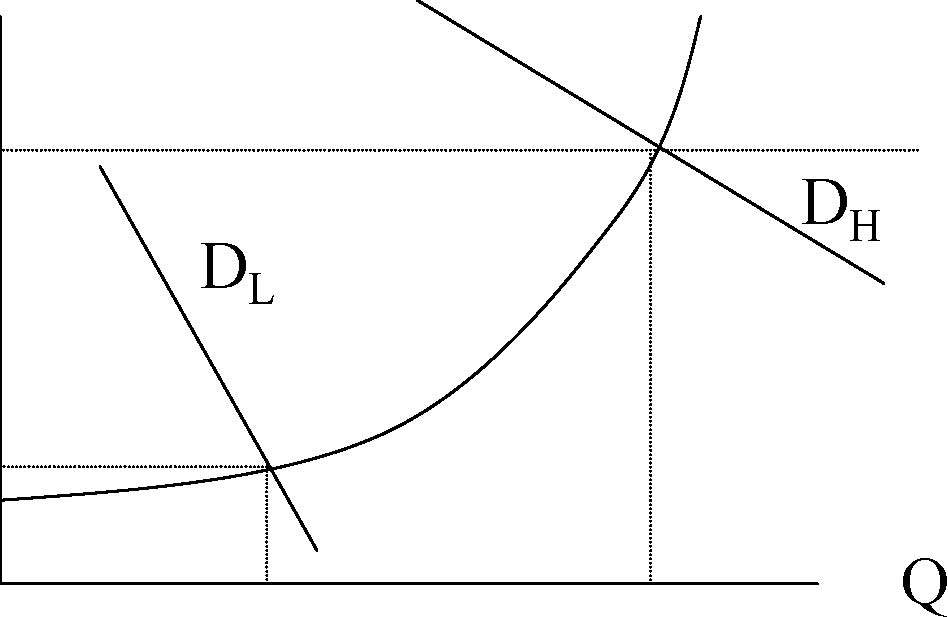
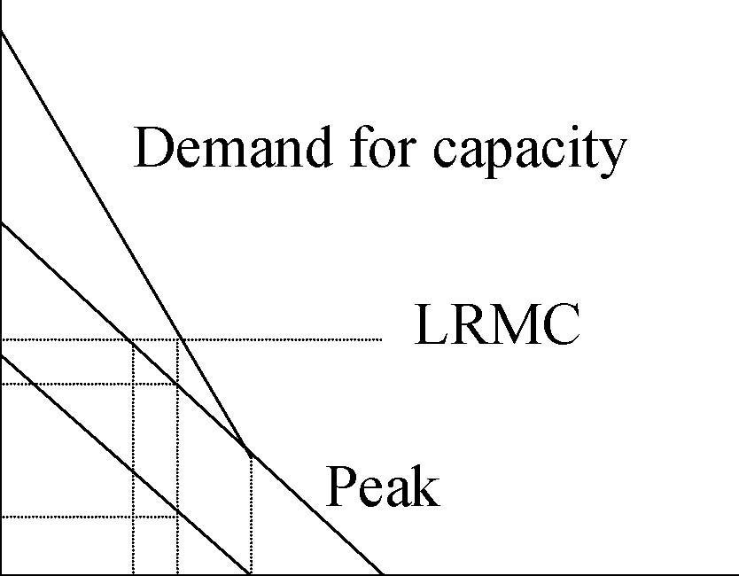
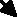

         Acrobat Distiller 5.0.5 (Windows)

         2003-07-28T02:21:29Z

         2003-08-11T14:27:59+05:30

         2003-08-11T14:27:59+05:30

         PScript5.dll Version 5.2

         xml

               bersara

               Microsoft PowerPoint - 14.23 Class7.ppt

# 14.23 Government Regulation€of Industry€

Class 7

MIT &amp; University of Cambridge€

1

-  Multi-product monopolists 

-  Regulation in practice – electric utilities 

-  Regulated Rate levels 

-  Rate structures 

-  Peak load pricing 

-  De-regulation in electricity markets 

2

- 	Economies of scale, C(λQ)&lt;λC(Q), in production andeconomies of scope interact. 

- 	It is possible that economies of scale combine with diseconomies of scope to make multi-product monopoly inefficient. 

- 	Similarly economies of scope, C(Q1,Q2)&lt;C(Q1)+C(Q2), with diseconomies of scale may make multi-product monopoly inefficient. 

- 	Thus integration of electricity transmission and generation (in tradition electric utility monopolies) may not be justified by proof of economies of scope. 3 

- 	Company must get changes in rates (or regulated component of rates) approved by regulator. 

- 	Company will initiate a rate hearing before the state Public Utilities Commission (PUC) if it wants to raise rates (on grounds of cost increases, e.g. due to inflation). 

- 	Consumers and the Commission may initiate rate hearing to reduce rates if rate of return too high (due to cost falls, efficiency gains etc). 

- 	FERC involved in regulation of interstate transmission and in national policy setting. 4 

- 	Allowed Revenue ( R )= Expenses (E)+ Fair rate of return. 

- 	Fair return = allowed cost of capital (s)* regulatory asset base (or rate base) (RB). 

-  Two problems: 

-  Rate level (i.e.the allowed revenue) 

-  Rate structure (i.e. permissible price discrimination which achieves rate level) 

5

-  R=E+s*RB 

- 	E: company submits detailed cost breakdown of regulated company business. 

- 	Occasionally excessive expenses can be disallowed e.g. CA nuclear plant, only 20% of cost allowed (company could have put in cheaper alternative technology) 

-  RB: usually original cost of capital. 

- 	s: established in rate hearings and precedent (c.10.5%). 

6

- 	Different ways of calculating the rate base are possible: 

- 	Original cost, problematic if there is inflation, as current costs do not reflect LRMC, this gives incentives to over-consume. 

-  Replacement cost: modern equivalent asset values. 

-  Fair value cost: weighted value of the above. 

- 	Market value: however this reflects past regulatory decisions and you are wanting to set rates going forward. 

7

- 	WACC = weighted average cost of capital (equity+bond costs averaged). 

-  We observe bond rates, but rate of return on equity=? 

- 	Price of a stock (P) reflects the NPV of the dividend stream associated with that stock and the interest rate ( r ) used to get this is the cost of equity capital. 

-  If dividends grow through time at a rate, g, then: 

P = D 1 + D 1 (1 + g ) + ... (1 + r ) (1 + r )2 

P = D 1 r − g 

r = DP 1 + g 8 

# Problems withRate of Return Regulation (RoR)

- 	Accounting for risk not clear, incentives to over-invest and to not pursue cost reductions. 

- 	In practice firms usually only bring rate cases if prices are to go up, thus there is regulatory lag. 

-  Inefficiency exists: 

-  Output inefficiency 

-  Input choice inefficiency 

-  X inefficiency in input quantities 

-  Over-time rate of productivity growth of utilities low. 

- 	However not clear what the incentives of the companies are to agree to better incentivised regulation. 

9 

- 	1962 A-J showed that RoR regulated firms have an incentive over-capitalise. 

-  Firm chooses, amount of capital, K, Q=f(K) 

-  R(q)=R(f(K) 

-  Costs are rk, Other expenditures = 0 

-  Profits = R(f(K))-rK 

-  Under rate of return regulation: Π=(s-r)K 

10

Π Where s&gt;r, firm increases K.

(s-r)K 

0 K* K** K

11

- 	Sliding scale plan, shares risk and rewards between shareholders and consumers.

-  r*, target rate of return•rt, return at original prices•ra, actual rate of return•ra=rt+h(r*-rt) where h is in interval [0,1]

-  h=1 is RoR, h=0 is fixed price regulation 

-  0&lt;h&lt;1 involves risk sharing. 

12

-  Yardstick regulation (Shleifer, 1985) 

-  Set price equal to average cost of comparable utilities. 

-  Problem hard to find comparable utilities e.g. local electricity distribution companies. 

-  Price Cap regulation 

-  CPI-X formula, rise prices by inflation minus some productivity adjustment formula. 

-  Usually formula fixed for a period (the regulatory lag) 

-  Setting X usually involves some form of benchmarking of costs to assess scope for future productivity gains. 

13

- 	Price caps seem to encourage faster rates of cost reduction than conventional RoR schemes. 

- 	European, South American and Australasian regulators have selected price cap regulation over RoR and seen sharp reductions in costs. 

- 	Many US regulators (including MA) accept the superiority of price cap regulation and encourage companies to adopt performance based rate making regimes or simple price caps at times of rate review. 

- 	However as inflation is low there have effectively been few rate cases over the last few years at which companies have requested rate changes. 

14

- 	How should prices vary across different classes of customer and product.

- 	This is essentially an issue about how the fixed costs of a monopoly should be recovered. 

-  Fully Distributed Cost (FDC) Pricing applied.

-  For example:•Cx=700+20X, Cy=600+20Y, Cxy=1050+20X+20Y

- 	Joint production is preferable. How should the fixed cost be allocated?

-  Ramsey pricing would be desirable.

15 

-  Allocate costs 75:25, x:y 

AC x = (1050 * 0.75) + 20; AC y = (1050 * 0.25) + 20 xy 

•Px=100-x, Py=60-0.5y, P=AC in each market. 

•Px=31.5, x=68.5, Py=23.6, y=72.8 

- 	However Ramsey prices are x=y=70, Px=30, Py=25 (solved by equating outputs and by breaking even). 

- 	Two part pricing would solve the problem with per unit price=20 and fixed charge to cover fixed cost. 

16

- 	Undue discrimination, are we subsiding one group from another. 

- 	Stand alone average cost (SAAC) test: calculate average cost of producing x or y alone, price should be below this for each, otherwise consumers of one good would go it alone (subsidy-free test). 

- 	Average incremental cost (AIC) test: joint cost of producing x and y -cost of producing y alone is the AIC of x. Price of x must be greater or equal to this (same as SAAC). 17 

# Peak Load Pricing

- 	Storage costly, demand changes by hour, day, season. Costs are independent between periods. 

- 	Efficient way to deal with this is through peak load pricing (pioneered by French utility, EdF in 1940s). 

-  However only 1978 did congress require PUCs to encourage this. 

$

α+β

α=marginal running costβ=marginal capacity cost

α

DL DH Q 

LRMC

0

18

Peak Demand for capacity LRMC

Off-Peak Pp 

Po 

RK S 

MC running costs assumed to be zero.The MC of capacity assumed to be LRMC. Thus if off-peak users charged zero, they will necessitate over-expansion of the system related to the combined capacity requirement. Efficient pricing means that off-peak pays some of the LRMC, increasing the demand of the peak consumers. 

19 

# Does regulation make a difference?

- 	Difficult to test this these days but evidence is that electricity rates substantially lower in US states with regulators than without in 1920s. 

- 	Evidence that regulated rates substantially below monopoly levels (by up 30%) in 1970s. 

- 	Demsetz (1968) argued that regulation unnecessary because could have an auction to run monopoly in advance (e.g. like defense contracting). This makes subsequent regulation of prices unnecessary. 20 

# Deregulation in Electricity Markets

- 	Paul Joskow (1997) points out that keenness to deregulate strongest in US states with the highest electricity prices (e.g. CA, MA). 

- 	However companies would only agree to deregulation if they could be guaranteed NPV of future profits. The transition to competitive generation revealed bad past investments and so called stranded costs which would not be recovered if prices fell in a competitive generation market. These costs are being recovered through Competitive Transition Charges (CTCs). 

- 	These charges are being recovered at the moment from residential customers, through a mechanism which ensures little incentive to switch to competitive suppliers. 

-  In MA these will expire in 2004. 

- 	The result of this is that in MA only 3% of residential customers have 21

switched supplier since 1998. In the UK the comparable figure is 30%. 

# Sample residential bill in deregulated MA electricity market

22

- 	Economic regulation continues for transmission and distribution of electricity (and residential billing and metering). 

- 	Generation markets have been deregulated in many US states but this has not resulted in cheaper electricity for many residential customers so far. 

- 	Price cap regulation is theoretically and empirically superior to traditional rate of return regulation. 

- 	Economically efficient recovery of fixed costs often involves unvolves ‘unfair’ distribution of payments between different customers. Efficient pricing structures are therefore difficult to implement for that reason. 23 

-  Franchise Bidding 

-  Read VVH Chapter Chap 13. 

24
