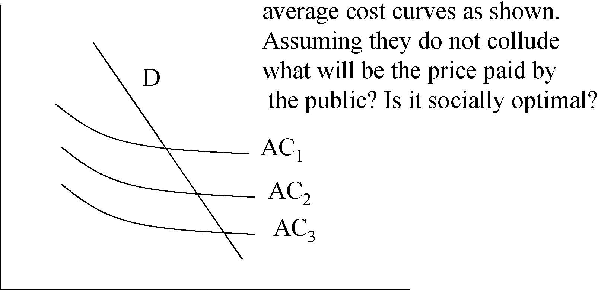
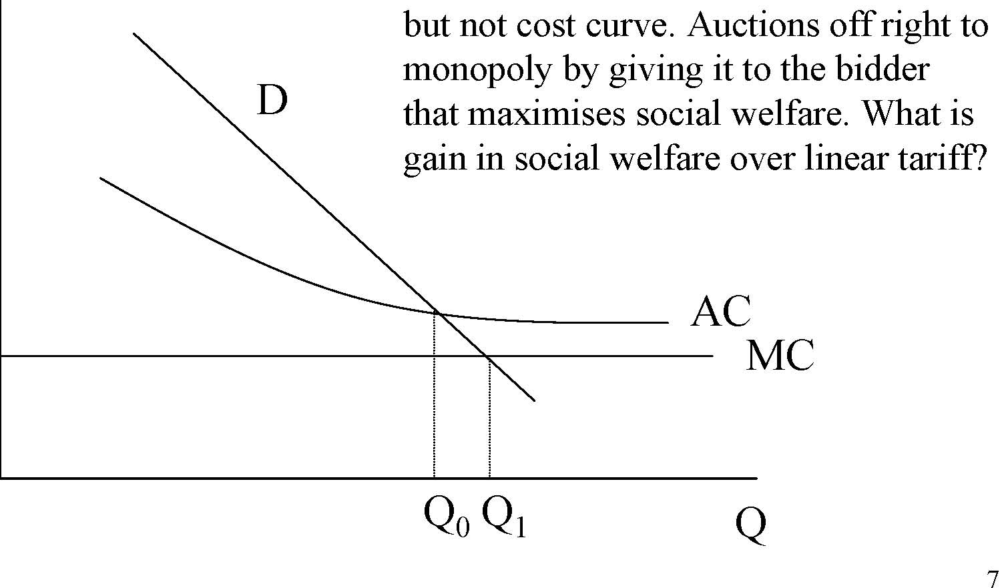
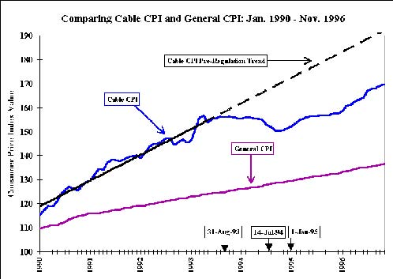

         Acrobat Distiller 5.0.5 (Windows)

         2003-07-28T02:21:50Z

         2003-08-11T14:30:45+05:30

         2003-08-11T14:30:45+05:30

         PScript5.dll Version 5.2

         xml

               bersara

               Microsoft PowerPoint - 14.23 Class8.ppt

# 14.23 Government Regulation of Industry

Class 8: Franchise Bidding and CATV 

MIT &amp; University of Cambridge

1

-  Why regulate utilities? 

-  Franchising benefits 

-  Contractual problems 

-  CATV (community-antenna television) 

-  Regulation, de-regulation, re-regulation 

-  Other examples of franchising 

2

- 	Harold Demsetz asks this question in 1968 (borrowing on ideas from Edwin Chadwick in 1859). 

- 	Why can’t there be competition for the field even though only one firm actually produces the good or service? 

- 	Classic example is in defence industry where only one design of tank or plane is adopted. Does that mean Dept. of Defence pays monopoly prices? 

- 	The solution is to have a modified English Auction where the monopoly franchise is awarded to the lowest cost bidder. 

3

- 	Auctioneer announces price at which monopoly service will be offered. 

- 	Determine how many active bidders are around at that price. 

-  If number is &gt;1, announce a lower price. 

- 	Keep going until only 1 bidder is left and the last price is the price at which the service will be offered to the public. 

4

P There are three bidders with 

AC1 AC2 AC3 average cost curves as shown. Assuming they do not collude what will be the price paid by the public? Is it socially optimal? D 

0Q 

5

-  Positives: 

-  Least cost firm wins. 

-  No problem of over-capitalisation. 

-  No informational requirements on regulator. 

-  Franchise owner has incentive to cost efficient. 

-  Negatives: 

-  Price is above least cost, competition is lacking. 

-  As contract is written on price may skimp on quality. 

-  Two-part tariff is more efficient. 

6 

P 

Government knows demand curve,

7 MC AC D but not cost curve. Auctions off right to monopoly by giving it to the bidder that maximises social welfare. What is gain in social welfare over linear tariff? 

0 Q0Q1 Q

-  Quality 

-  Not a problem if is this is homogeneous, however it rarely is. 

-  This is a problem if cost and quality are negatively related. 

-  Government will need to specify and enforce quality standards. 

-  Rent seeking behaviour 

-  Multi-dimensional bidding means that it is difficult for auctioneer to work out best bid (e.g. with spectrum actions). 

-  In this case bidders may choose combinations which most interest regulators and do not maximise social welfare -this 

is rent seeking. 

8 

-  Contractual Arrangements (Williamson, 1975, 76): 

- 	What happens when technology or demand changes radically over time? Or costs unexpectedly rise (e.g. due to security costs)?Bounded rationality restricts the ability to write complete contracts. 

- 	Recurrent contracts increasingly give advantage to incumbent who can bid P=AVC to exclude more efficient entrants. This problem can be reduced if capital has to be passed to whoever wins contract but this is difficult to price. Thus there is a hold-up problem where incumbent can over-price assets passed to rival (this represents an entry barrier). 

- 	Incomplete longer contracts (15-20 years) can be used but these are hard to monitor and impose costs of uncertainty on the franchisee. 

- 	Opportunism will always be there as contracting process is costly and embarrasing for government to reopen. 

9

-  A good example of franchise bidding. 

-  1940s: cable used to boost reception of local broadcast services. 

- 	1950s-1960s: introduction of microwave technology allows cable to expand its services by bringing in services from other areas. It thus competes with local broadcasts. 

-  Cable competes with close substitutes: e.g. satellite dishes, videos etc. 

- 	1934: FCC formed and has jurisdiction over wire and radio (including TV). 

- 	FCC refuses to regulate cable on grounds that it is a complement to local broadcast services (improves reception). 

- 	1950s TV industry wants cable to be regulated like them as they are now a competitor. 

-  1962: Importation of signals on cable from distant markets which were

10

available on local television banned. 

- 	1966: Full regulation of cable: required to carry all local TV stations but prohibits importation of additional signals in top 100 television markets. 

- 	1972: Importation freeze lifted but rules still make it hard to import signals. 

- 	1975: Cable takes off with introduction of Satcom 1 satellite which provides cheap long distance signals. HBO wins court case in late 1970s allowing cable systems to compete with local broadcast television. FCC loosens restrictions. 

-  Results: 

-  1971: &lt;33% have cable access; 6% of systems have more than 12 channels. 

-  1980: 50% of systems have more than 12 channels. 

-  1992: 96% have cable access; 90% of systems have more than 12 channels. 

11

-  Required technology: 

-  Headend: antenna which receives signals from microwave relay stations or satellite and processes them. 

-  Distribution plant: uses coaxial cables laid in street to distribute the signals to homes. 

-  Subscriber interface: set top box. 

-  If wires are laid marginal costs of connection are low. 

-  Economies of scale split into econs of density and distance: 

-  Economies of density are significant: penetration increasing from 40% to 80% average cost goes from $14 to $8. 

-  Economies of distance are low: 10% increase the number of homes passed at constant penetration reduces AC by only 0.2%. 12 

- 	Yes, within the local geographic area, not over a wide area. 

- 	Better to have local monopolies with no overlapping service. 

- 	However cost disadvantage of multiple non-overlapping systems not great. 

- 	There may be additional advantages to multiple systems: more potential bidders, more capital market competition and improved monitoring by example (benchmarking). 

13

# Franchise bidding process

-  Municipality announces it will award franchise. 

-  Proposals submitted. 

-  Municipality may negotiate (and impose significant costs). 

-  Municipality notifies select group to submit bids. 

-  Cable companies submit bids. 

-  Municipality selects company (for c.15 years) / calls for new bids. 

-  Process takes 2-10 years (up to 20 years!). •Issues: 

-  No of channels, prices, type of financing, free links to schools, local studios and government channels. 

-  Competitiveness of bidding. Average bidders 5 but declining. CR5 nationally reached 50% (1990) thus collusion likely. 

-  Franchise agreements often re-negotiated ex post. 14 

-  Very few franchisees loose franchise (7 / 3516): good or bad? 

-  1986 Cable Communication Policy Act. 

-  Regulation of rates prohibited. 

-  Franchising continues, no additional entry allowed and renewal easier. 

-  1986-91 prices rise sharply 

-  However, number of channels goes up 30%. 

-  DOJ estimates quality adjusted price goes up 18-23%. 

-  Is this the right way to do this analysis? 

- 	1992 regulation re-introduced via Cable Television Consumer Protection Act. 

-  FCC requires 10-17% reduction in rates. 

15 

Source:1996 Report on Cable Industry Prices (FCC 96-499) at 16http://www.fcc.gov/mb/csrptpg.html (FCC, 1997)

- 	1996 Telecommunications Act retains regulation of basic cable programming and equipment until cable operators face ‘effective competition’. 

-  Effective competition: 

-  if (1) &lt;30% of households take cable or (2) two cable companies serve 50% or more of households and 15% of those take service from the smaller company or (3) a municipal company offers service to at least 50% of households or (4) a telco offers a video-programming service. 

- 	Basic service regulation based on (Premium channels not regulated): 

-  Inflation, number of channels, programming cost and 17

copyright fees, franchise costs, non-license required upgrades. 

# Competition in Cable

Comparison between Competitive Strata and the Noncompetitive Group 

Wireline DBS Low Non-Date Overbuild Overbuild LEC Penetration Municipal Competitive 

<Table>
<TR>

<TD>Average Monthly Rate </TD>

</TR>
<TR>
<TD>July 1, 2001 </TD>
<TD>$34.03* </TD>
<TD>$37.13 $35.03* $34.30*</TD>
<TD> $24.35* </TD>
<TD>$37.13 </TD>
</TR>
<TR>
<TD>July 1, 2000 </TD>
<TD>$31.45* </TD>
<TD>$34.25 $32.55* $32.57</TD>
<TD> $23.40*</TD>
<TD> $34.54 </TD>
</TR>
<TR>

<TD>Number of Channels </TD>

</TR>
<TR>
<TD>July 1, 2001 </TD>
<TD>56.0 </TD>
<TD>53.3 65.3* 52.9</TD>
<TD> 51.4 </TD>
<TD>59.3 </TD>
</TR>
<TR>
<TD>July 1, 2000 </TD>
<TD>52.7 </TD>
<TD>46.5 62.4* 49.5</TD>
<TD> 50.8 </TD>
<TD>56.2 </TD>
</TR>
</Table>

Average Rate per Channel (Programming Only) July 1, 2001 $0.587 $0.727 $0.489* $0.663 $0.447* $0.603 July 1, 2000 $0.578 $0.761 $0.483* $0.674 $0.437* $0.594 *An asterisk denotes a statistically significant differential when compared with the noncompetitive group. 

Source: http://hraunfoss.fcc.gov/edocs_public/attachmatch/FCC-02-107A1.doc (FCC, 2002) 

6% of cable households in competitive sector.Wireline overbuild = overlapping cable networks.DBS = direct satellite network overlaps with cable network. 18

LEC = Telco competitor.

# Other examples of franchise bidding

- 	TV licensing (ten year regional ITV franchises for terrestrial television licenses in UK). 

-  Railway (inc London Underground?) and Spectrum franchises. 

- 	Private Finance Projects often involving a franchising process to award a contract to supply a good or service which is wholly paid for by the government: 

-  Refuse collection in local government. 

-  IT management of records (NIRS). 

-  Toll roads and bridges. 

-  Hospitals. –Prisons. 

19

# Case study: UK National Insurance Recording System NIRS-2

-  Largest government IT project in Europe. 

-  Contract replace computerised NI records by 1997. 

-  Contract: 7 year for provision of 15 transactions. 

-  Natural monopoly problem if given to private firm. 

-  Compensation payable for contract loss after 7 years. 

- 	Andersen Consulting win: bid $72m (rival $200m) (Public sector comparator=$526m) 

-  Contract delivered 2 years late 

-  Risk of delay not transferred but very cheap! 

20 

- 	Franchise bidding has been a qualified success in introducing some competition into the provision of monopoly services. 

- 	However difficult to argue that it reduces the regulatory burden. For CATV franchising led to normal rate regulation (with guaranteed renewal) and deregulation. 

- 	Technology (via competing networks) is reducing natural monopoly. 

-  Competition seems effective in keeping prices down. 

21

-  Dynamic Issues in Natural Monopoly Regulation 

-  Read VVH Chapter Chap 15. 

22
