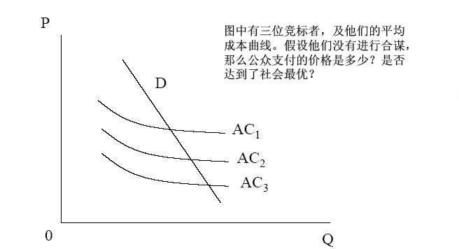
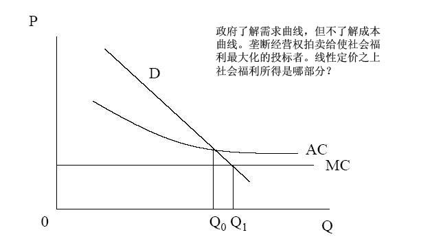
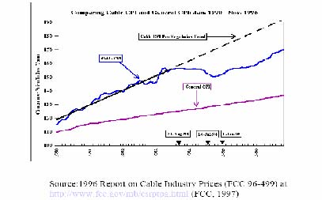
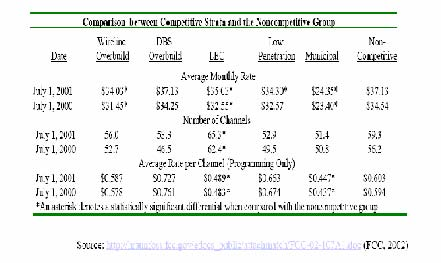

         xml

               user

               第八课.doc

         2005-10-13T10:57:51+08:00

         pdfFactory Pro www.fineprint.com.cn

         pdfFactory Pro 2.30 (Windows XP Professional Chinese)

## 14.23政府的产业规制

## 

### 第八课：特许经营权竞标和有线电视

麻省理工学院 &amp;剑桥大学提纲 

- 	为什么规制公用事业？ 

- 	特许经营权的优点 

- 	契约问题 

- 	有线电视 

- 	规制，放松规制，重新规制 

- 	其它特许经营权案例

- 为什么规制公用事业？ 

- 	哈罗德·德姆塞茨（Harold Demsetz）1968年提出了这个问题（来自于埃德温·查德威克 Edwin Chadwick1859年提出的一个想法）。 

- 	即使某个领域实际上仅有一家企业生产商品或提供服务，为什么这个领域不能有竞争？ 

- 	典型案例是国防产业，在这个产业中坦克或飞机的设计仅有一个被采用。这是否意味着国防部将支付垄断价格？ 

- 	解决方法是修正的英式拍卖，垄断特许经营权给予在拍卖中提供最低成本的竞标者。

- 线性定价过程 

- 	拍卖商最后宣布的标价即提供垄断服务的价格。 

- 	确定对这个价格做出反应的积极投标者人数。 

- 	如果人数&gt;1，拍卖商宣布一个更低的价格。 

- 	继续这个过程直到只剩一个投标者，中标者将以这个价格向公众提供服务。

实际上什么发生了？

下图显示了三个投标者和他们的平均成本曲线。假设他们没有合谋以何种价格提供服务给大众，那么这个竞标价格是否能达到社会最优？

竞标过程的结果 

- 	正面结果：－具有最低平均成本的企业胜出。－不存在过度投资的问题。－对规制者没有信息要求。 

- 	负面结果：－价格高于最低成本，缺乏竞争。－合同签订后，低价格可能导致低质量。－两段式定价更有效率。

两段式定价

其它因素 

- 	质量－如果产品是同质的则不存在质量问题，但实际上却不如此。－如果成本和质量负相关，则存在质量问题。－政府需要明确规定和执行质量标准。 

- 	寻租行为－多方面竞标意味着拍卖商很难计算最佳标价（例如，频谱拍卖的价格）。－这种情况下投标者可能选择联合，这将会引起规制者的最大注意，然后使

社会福利达不到最大化－这就是寻租行为。

其它因素 

•	契约安排（威廉姆森 Willianmson，1975年和 1976年）：

－随着时间，当技术或需求发生根本改变时，会发生什么？或者成本出乎意料的上升时（例如，因为安全成本的增加），会发生什么？有限理性限制了签订完全合同的能力。

－周期性合同会逐渐增加能以 P=AVC这个价格竞标的在位厂商的优势，排除更有效率的进入者。如果把在位厂商的资产强制转移给新的厂商，就可以解决这个问题，但是定价仍很困难。而且在位厂商可以过高标价将资产转移给对手，由此产生敲竹杠（hold-up）问题（这体现了进入壁垒）。

－可以使用不完全的长期合同（15－20年）代替周期性合同，但是很难监测特许经营厂商，也会增加厂商的不确定性成本。－在合同签订过程的成本很高，和政府重订合同过程令人为难的情况下，机会主义总是存在。

美国有线电视 

- 	特许经营权竞标的典型案例。 

-  	20世纪 40年代：运用电缆来改善地方广播电视服务的信号接收。 

-  	20世纪 50－60年代：运用微波技术引进其它地区的服务来扩大有线电视的服务范围。与地方广播电视进行竞争。 

- 	有线电视与以下相近替代品进行竞争：例如，碟形卫星天线（satellite dishes），录像机等。 

-  	1934年：美国通信委员会（FCC）成立，被赋予有线和无线（包括电视）的管辖权。 

-  	FCC基于有线电视只是地方广播电视服务的补充（改善信号的接收）的理由，拒绝规制有线电视。 

-  	20世纪 50年代,因为广播电视产业与有线电视进行竞争，所以希望有线电视象它们一样受到规制。 

-  	1962年：禁止长途广播电视信号通过电缆输入到地方电视台传输相同信号的市场。

- 美国有线电视 

-  	1966年：有线电视受到完全规制：要求有线电视传输所有地方电视台的节目，但是禁止输入排名前 100的电视市场的其它信号。 

-  	1972年：解除对信号输入的冻结，但仍制定一堆规则限制信号输入。 

-  	1975年：Satcom1号卫星的发射为有线电视提供便宜的长距离信号输送，使有线电视服务大幅度增加。20世纪 70年代后期，HBO（华纳旗下的付费电视网）赢得诉讼，允许有线电视系统与地方广播电视进行竞争。 FCC放松了限制。 

- 	结果：

－1971年：&lt;33%家庭享受有线电视服务；只有 6%的有线电视系统拥有 12

个以上的频道。－1980年：50%的有线电视系统都拥有了 12个以上的频道。－1992年：96%的家庭享受有线电视服务；90%的有线电视系统拥有了 12

个以上的频道。

有线电视是自然垄断行业？ 

•	必备技术：

－头端（headend）：天线接收来自微波中继站或卫星的信号，然后进行处理。－发送设备（distribution plant）：使用架设在街上的同轴电缆将信号传送给

•	规模经济分成密度经济和距离经济：－密度经济具有重要意义：随着市场渗透（订购家庭数/接入有线电视家庭数）从 40%增加到 80%,平均成本从 14美元下降到 8美元。

－距离经济影响甚微：在市场渗透不变的条件下，有线电视电缆经过的家庭数量增加 10%，单位平均成本下降仅 0.2%。

有线电视是自然垄断行业？ 

- 	在地方地理区域内，而不是在宽广区域内，就是自然垄断。 

- 	形成地方垄断更有优势，因为不会提供重叠服务。 

- 	但是非重叠的多系统成本优势不显著。 

- 	多系统的其它可能优势：更多的潜在竞标者，更多的资本市场竞争和改善的实例监测（基准）。

- 	地方政府宣布将拍卖特许经营权。－递交提案。－地方政府与潜在经营商谈判（增加成本）。－地方政府通知选定的申请商提交标价。－有线电视公司提交标价。－地方政府将特许经营权授予中标的公司（大约 15年）/重新要求新标价。 

- 	竞标过程需要 2－10年（有些高达 20年！）。 

- 	问题：－不能选择频道、价格、融资方式，并且免费为学校、地方电台和政府提供频道。－投标的竞争性。每个案例的平均竞标者为 5个，但实际上更少。五家最大

特许经营权竞标程序

的有线电视公司控制了全国 50%的有线电视市场，因此可能产生合谋。－事后通常重新谈判特许经营权合约。－几乎没有特许经营者放开特许权（7/3516）：好或坏？ 

1986年放松规制的试验 

-  	1986年有线通信政策法令。－禁止费率规制－继续实行特许经营权，没有额外的进入许可，重申请更容易。 

-  	1986－1991年费率价格急剧上升－虽然价格上升了，但是频道数目增加了 30%. －DOJ估计价格调整后质量提高了 18－23%。－这样分析的方法正确吗？ 

-  	1992年的有线电视消费者保护法令重新引入规制。－FCC要求费率减少 10－17%。

有线电视价格和规制

现状 

-  	1996年美国电信法案（telecommunications act）保留了对基本有线电视节目和设备的规制，直到有线电视的经营者面对‘有效竞争’。 

- 	有效竞争：－如果满足以下条件

- （1）低于 30%家庭订购有线电视服务

- （2）或者有两家有线电视公司提供 50%的服务，或者有更多的家庭订购服务，其中 15%的家庭订购规模较小的有线电视公司的服务

- （3）或者一家地方性公司向至少 50%的家庭提供服务

- （4）或者一家电话公司提供录像节目服务。

- 	基本服务规制（收费频道不受规制）基于以下理由：

－通货膨胀，频道数目，节目成本，版权费，特许权成本，非许可证经营必需的升级。

有线电视竞争

竞争部门只有 6%的有线电视用户。有线线路重复建设＝重叠的有线电视网络 DBS＝直接广播卫星网络与有线电视网络重叠 LEC＝电话公司竞争者

其它特许经营权竞标案例 

- 	电视许可证（英国独立电视台的十年陆地电视许可证特许经营权）。 

- 	铁路（伦敦地铁有限公司？）和频谱特许经营权。 

- 	私人金融项目通常包含授予合同(award a contract)这样一个特许经营权步骤，来提供由政府支付的某种产品或服务：－地方政府的垃圾收集。－记录的 IT管理（NIRS－国民保险录音系统）－征收过路过桥费用。－医院。－监狱。

- 案例研究：英国国民保险录音系统 NIRS－2 

- 	欧洲最大的政府 IT工程。 

-  	1997年，合同的签订意味着计算机管理的国民录音系统被 NIRS-2取代了。 

- 	合同：7年内提供 15笔交易。 

- 	如果合同授予给私人公司，将产生自然垄断问题。 

-  	7年后补偿未能签订合同的损失。？ 

- 	安达信咨询公司（Andersen Consulting）胜出：出价$72m美元(对手出价$200m美元)（公有企业 comarator＝$526m） 

- 	两年后合同解除。 

- 	延期风险虽不会转移，但是非常小！

- 结论 

- 	特许经营权竞标在将一定的竞争引进到的垄断服务提供中，是一次成功。 

- 	但是很难说明特许经营权竞标降低了规制负担。因为有线电视（ CATV）特许权导致正常的（保证再申请）费率规制和放松规制。 

- 	技术（通过竞争网络）降低了自然垄断程度。 

- 	竞争保持低价格是有效的。

- 下一课 

- 	自然垄断规制的动态问题 

- 	阅读 VVH第十五章。
