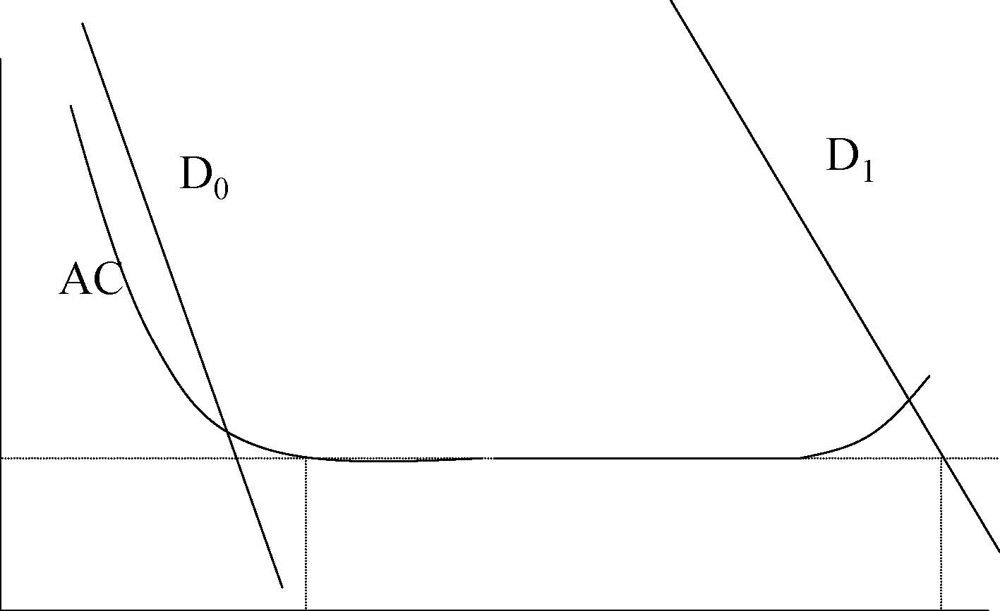
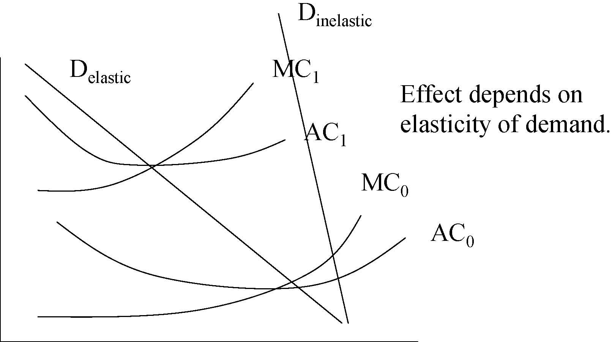

         Acrobat Distiller 5.0.5 (Windows)

         2003-07-28T02:22:05Z

         2003-08-11T14:33:20+05:30

         2003-08-11T14:33:20+05:30

         PScript5.dll Version 5.2

         xml

               bersara

               Microsoft PowerPoint - 14.23 Class9.ppt

# 14.23 Government Regulation of Industry

Class 9: Dynamic Issues inNatural Monopoly Regulation

## MIT &amp; University of Cambridge

- 	When is a natural monopoly no longer a natural monopoly? 

-  Telecom regulation in the US 

-  Technological change and regulation 

-  The break-up of AT&amp;T 

-  Regulated Competition 

-  The Separations issue 

-  An alternative development path? 

P

P**

D0 D1 AC 

0 QMES 3QMES Q 

4 AC1 C(Q)=FC+VC(Q) AC(Q)=FC/Q + AVC(Q) D 

MC

$

AC0

0

Q

P 

MC0 AC1 MC1 Delastic Dinelastic Effect depends on elasticity of demand. 

0Q 

AC0

# Policy Responses to effects of time on nature of market

- 	1. Continue with price and entry regulation of all market segments. 

-  2. Fully deregulate all markets. 

- 	3. Partially deregulate some markets restricting the behaviour of incumbent monopolists in competitive market. 

- 	Issue is complicated by vertical relations where part of the service is provided by a monopolist which is needed by firms in the competitive segments e.g. access to local phone network required by long distance providers. 6 

- 	This occurs when regulation treats incumbent and entrants differently in market. 

- 	Incumbent is multi-product firm with a universal service obligation. If you are recovering fixed costs disproportionately from one customer group. It may be possible for entrant to come in and sell more cheaply to this group (even though their costs are higher). For example Postal Service. 

- 	This is wasteful because, cheaper to have one incumbent. Also such cross subsidy is not Ramsey 

7

pricing. 

- 	3 basic services in the intercity telecommunications market (ITM): 

-  Message Toll Service (MTS) or long-distance phone calls. 

-  Wide-area telephone service (WATs) or interconnection services between networks. 

-  Private line service (PLS) is a circuit that connects two or more points to meet specific user needs. 

-  1876: Alexander Graham Bell patents telephone. 

- 	1894: Patents expire and competitors to American Bell Telephone (RoR=46%) enter. AT&amp;T is successor to this firm which included Bell operating companies, Western Electric (equipment manufacturing company) and Bell Labs (R+D organisation). 

- 	Bell retained dominance after patents due to price competition and purchase of rivals. 

- 	1910: American Bell market share below 50% (RoR= 8%). AT&amp;T embraces regulation and universal service. State control and regulation traded for financial protection. 

- 	Existing market structure stabilised. Price structure unregulated. Complicated to regulate due to related companies. 

- 	1910: Interstate long-distance service placed under jurisdiction of the Interstate Commerce Commission. 

-  1934: FCC takes over this regulation. 

-  No formal restriction on new entry but none occurred. 

- 	A lot of the industry appeared to be a natural monopoly but some parts e.g. equipment manufacturing clearly were not, however this was protected by ownership and contractual limitations. 

# Competition in theEquipment Market

- 	1940s: Hush-a-phone introduced. A device which could be put on phone to protect privacy of conversation. AT&amp;T prohibited attachments to their equipment. FCC supports AT&amp;T. Court of Appeals rules in favor of Hush-a-phone as long as device is not ‘publicly detrimental’ it should be ok. AT&amp;T resist implementation of this ruling. 

- 	1940s: Carterfone connects telephone network and mobile radio telephone. This violates AT&amp;T tariff but not Court ruling. 

- 	1949: DOJ file suit against AT&amp;T on grounds that Western Electric has unregulated prices. 

- 	1956: AT&amp;T agrees to only operate in regulated services. AT&amp;T barred from entering computer industry. 

- 	1947: NY and Boston first microwave relay station, this represents fall in fixed costs. 

- 	Computers and rising income shifts demand outwards for telephone use. 

- 	TV and microwave transmission technology threatened AT&amp;T’s monopoly of long distance. 

- 	Microwave had no patents associated with it because it was developed for national defence. Thus there were few entry barriers due to the new technology. 

- 	1948: FCC rules that permanent frequency assignments should be reserved for common carriers (AT&amp;T). 

- 	1949: FCC AT&amp;T not required to interconnect other common carriers, with permanent access to spectrum. Thus entry barred. 

- 	1956: FCC reviews earlier decision. It opens up spectrum to any private user (ABOVE 890). It allocated frequencies above 890 Mhz for microwave use. 

- 	Strong economies of scale up to 240 circuits, moderate to 1000, insignificant above this. Between NY-Philadelphia the required capacity was 79,000 circuits in late 1960s. 

-  Fixed costs large. 

- 	AT&amp;T offered no volume discounts to large customers. 

-  They had an incentive to enter. 

# AT&amp;T and MCI

- 	1963: Microwave Communications Inc. (MCI) filed for common carrier status to offer service between St Louis and Chicago. This was to be a PLS but wanted common carrier status. 

-  1969: MCI application approved. 

- 	1971: FCC flooded with requests and allows free entry into PLS (specialised common carrier competition). 

- 	1974: MCI sues AT&amp;T. MCI cannot get fair terms for local connection to AT&amp;T. 

-  1983: MCI wins against AT&amp;T. 

- 	1975: Entry extended to business MTS by MCI, FCC does not allow entry into consumer long distance market. 

- 	1978: DC Court of Appeals overrules FCC and MCI allowed in. Free entry throughout ITM. 

- 	From 1969, FCC regulates AT&amp;T long distance and local rates such that long distance subsidises local service. This prevents predatory pricing. 

- 	However this lays it open to cream-skimming. What does theory predict prices should do? 

-  AT&amp;T complains about cream skimming. 

- 	MCI complains about quality of connection and the need for more access numbers. 

-  US vs AT&amp;T: Anti-trust case concludes in 1982. 

- 	22 Telephone operating companies placed into 7 holding companies (Regional Bell operating companies, RBOCs). 

- 	These divided into 161 Local Exchange and Transport Areas (LATAs). 

- 	RBOC not allowed to provide long distance and equipment manufacturing and required to offer access to any long distance or data service. 

-  AT&amp;T keeps labs and manufacturing against 

better judgement of DOJ. 

- 	AT&amp;T still regulated after break-up. Required to serve all customers, file tariffs for new services and limited price discrimination. 

-  MCI, Sprint etc. can serve who they want. 

- 	AT&amp;T market share of long distance less than 40%. Prices have fallen. 

- 	Prices of local calls have increased over 1998-2001 (but quality may be rising?). 

- 	By late 1970s: AT&amp;T in local, long distance and manufacturing and faces different types of regulation in each (regulated monopoly, regulation competition and unregulated.) 

-  Should a regulated company be restricted in competitive segments? 

-  Benefits of separation: 

-  Prevents price discrimination to win market share. 

-  Prevents vertical foreclosure or quality degradation. 

-  Costs of separation: 

-  Reduces economies of scope if these exist. 

-  Eliminates a potential competitor from the competitive segment. 

# Prices of Telephone Services in the US

20

Source: Trends in Telephone Service, www.fcc.gov/wcb/stats, FCC (2002) 

-  Finland has among the cheapest fixed line calls in EU. 

- 	Finland has a population of 5m and 46 local telephone companies (1960=201 companies). 

- 	A national telephone company, providing long distance, existed along side regional companies. 

- 	Finland has long had a competitive equipment market. Finland is home to the world’s largest mobile phone company (Nokia) who entered the market as a supplier of network equipment. 

- 	Productivity improved rapidly state carrier responded to competitive threat of ROCs and mobiles in the run up to de-regulation. 

-  Competition is desirable where it is possible. 

-  Regulation does tend to limit competition. 

- 	AT&amp;T was obviously too large from the beginning: 

-  No national natural monopoly in local telecoms 

-  No natural monopoly in equipment manufacture. 

- 	Regulation extremely slow to adapt to change in technology and demand once put in place. 

-  Spectrum Auctions and Competition in Telecom 

-  Read: 

Council of Economic Advisors (2000), The economic impact ofthird-generation wireless technology. Appendix 2: ‘Case study ofFinnish wireless cluster’ http://www.wireless.co.il/whitePapers/3geconomic.pdf 

Klemperer, P. (2002), How (not) to run auctions: The European 3G telecom auctions, European Economic Review, Vol.46, No.4-5, pp.829-845. 
