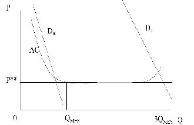
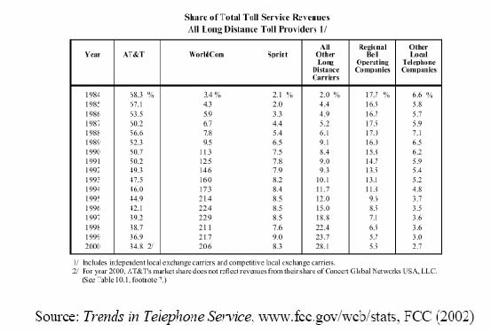

         xml

               user

               第九课.doc

         2005-10-13T10:59:25+08:00

         pdfFactory Pro www.fineprint.com.cn

         pdfFactory Pro 2.30 (Windows XP Professional Chinese)

## 14.23政府的产业规制

## 

### 第九课：自然垄断规制的动态问题

麻省理工学院 &amp;剑桥大学提纲 

- l什么时候一个自然垄断行业不再是自然垄断？ 

- l美国的电信规制 

- l技术变迁和规制 

-  AT&amp;T的解体 

- l规制竞争 

- l拆分问题 

- l一条可供选择的发展道路？

需求变化

固定成本的降低可变成本的上升

对市场性质的时间效应的政策反应 

-  	1.继续维持所有市场细分（market segment）的价格规制和进入规制。 

-  	2.全面放松对所有市场的规制。 

-  	3.对一些市场部分放松规制，但仍限制竞争市场里在位垄断厂商的行为。 

- 	垂直关系使问题变得复杂，这种关系指处于竞争细分的企业需要垄断者提供部分服务，例如，长途电话供应商要求进入地方电话网络。

- 不对称规制 

- 	对市场中的在位厂商和进入者实行不同规制时产生不对称规制。 

- 	在位厂商是一个具有大众服务义务的多产品企业。如果它从一个消费者集团那里不成比例的补偿固定成本，则进入者可能进入市场并向这个集团出售更便宜的产品（即使他们的成本更高）。例如，邮政服务。 

- 	有新进入者会产生浪费，因为只有一个在位厂商（成本）更便宜。而且这样的交叉补贴不属于拉姆齐定价。

- 电信案例 

- 	异地电信市场（ITM）的 3种基本服务：－信息收费服务（MTS）或者长途电话呼叫服务。－广域电话服务（WATs）或者网络间互连服务。－私人线路服务（PLS）是一个把两个或多个地点连接起来的回路，用以满

足特定使用者的需要。

电信业历史 

-  	1897年：亚历山大·格拉厄姆·贝尔获得电话的专利权。 

-  	1894年：专利权到期，美国贝尔电话公司的竞争者（ RoR＝46%）进入市场。美国电话电报公司（AT&amp;T）是贝尔电话公司的继任者，包括贝尔电话运营公司、西部电器（设备制造公司）和贝尔实验室（研发组织）。 

- 	专利权到期后，贝尔公司通过价格竞争和购买对手公司来保持自己的优势。 

-  	1910年：美国贝尔电话公司的市场份额低于 50%（RoR＝8%）。AT&amp;T同时接受规制并提供大众服务。为获得金融支持贝尔公司接受国家的控制和规制。 

- 	现有市场结构稳定，价格结构不受规制，公司之间的联系使得规制变复杂。

- 电信规制历史 

-  	1910年：州际长途电话服务被纳入州际商业委员会的管理权限内。 

-  	1934年：FCC接管对长途电话的管理权。 

- 	对新进入没有正式的限制，但也未发生新的进入。 

- 	这个产业大部分似乎是自然垄断，但某些部分如设备制造明显不属于，因为所有权和合同限制保护这部分面对较少竞争。

设备市场竞争 

-  	20世纪 40年代：引进 Hush-a-phone，这是一种装在电话机上帮助排除杂音的助讲器，能保护通话隐私。AT&amp;T限制用户使用此设备。FCC支持 AT&amp;T的决定。生产助讲器的小公司向法院提出诉讼并获胜，上诉法院判决只要此设备不是‘对公众不利’就可以了。但 AT&amp;T仍抵制判决的执行。 

-  	20世纪 40年代：卡特风决议（Carterphone）允许了电话网络与移动无线电话的连接。这妨碍了 AT&amp;T的收费，这不是法庭判决的结果。 

-  	1949年：美国司法部（DOJ）对 AT&amp;T提起诉讼，原因是西部电器公司采用非规制价格。 

-  	1956年：AT&amp;T同意仅在规制服务范围内运行。AT&amp;T被禁止进入计算机产业。

- 技术变迁 

-  	1947年：纽约和波士顿建立了首批微波中继站，这代表将降低固定成本。 

- 	计算机的使用和工资的上涨使得电话使用的需求曲线向外移。 

- 	电视和微波传输技术对 AT&amp;T的长话垄断造成威胁。 

- 	因为国防发展需要使用微波技术，所以不存在微波技术专利权。还有其它新

的技术出现，使进入壁垒几乎不存在。

州际竞争 

-  	1948年：FCC裁决应保留对公共运营商（common carriers）的固定频率分配。（AT&amp;T）。 

-  	1949年：FCC命令 AT&amp;T不能与其它公共运营商互相连接，也不能永久进入频谱市场。因此进入被阻止。 

-  	1956年：FCC回顾早期决定。对所有私人使用者开放了频谱市场（超过 890兆周的频率）。FCC分配用于微波使用的大于 890兆的频率。

- 规模经济的变化 

-  	240圈电路属于强规模经济，1000圈属于中期规模经济，大于 1000圈则没有意义。在 20世纪 60年代后期的纽约――费城的线路有 79，000圈的需求。 

- 	巨大的固定成本。 

-  	AT&amp;T没有向大客户提供数量打折。 

- 	因此这些大客户产生了进入市场的动机。 

- AT&amp;T和 MCI 

-  	1963年：联合微波通信公司（MCI）成立。MCI提出申请，要求以公共运营商的身份进入圣路易斯和芝加哥市场提供私人线路服务（PLS）。 

-  	1969年：MCI的申请获得批准。 

-  	1971年：FCC面对潮水般的申请，因此允许自由进入 PLS市场（专业公共运营商竞争）。 

-  	1974年：MCI因 AT&amp;T不提供本地线路连接，而起诉 AT&amp;T。 

-  	1983年：MCI赢得诉讼。 

-  	1975年：MCI的市场准入扩展到信息收费服务（MTS）领域，但是 FCC没有允许其进入消费者长途电话市场。 

-  	1978年：（哥伦比亚）行政区上诉法院否决 FCC对 MCI的判决，允许 MCI自由进入本地电信市场 ITM。

- 部分规制 

- 	从 1969年开始，FCC因为 AT&amp;T的长途电话补贴地方电话服务，对二者费率实行规制，防止掠夺性定价。 

- 	对 AT&amp;T的价格实行部分规制导致了撇脂行为（ cream-skimming）。理论预测价格怎么变动？ 

-  	AT&amp;T抱怨撇脂行为。

• 	MCI抱怨线路质量，及市场对更多进入厂商数量的需求。 

AT&amp;T解体 

-  	US VS AT&amp;T:1982年 AT&amp;T的反托拉斯案例得出结论。 

-  	22家电话运营公司重组为 7家控股（holding）公司（地方贝尔运营公司―― RBOCs）。 

- 	美国分为 161个本地接入和传输区域（LATAs）。 

-  	RBOC不允许提供长话服务和设备制造，并要求提供所有长话或数据服务的进入。 

- 	与 DOJ的更好判决相违，AT&amp;T仍保留实验室和设备制造这两部分。

- 规制竞争 

-  	AT&amp;T拆分后仍受规制。要求为所有消费者服务，提出新服务价格申请和限制价格歧视。 

-  	MCI，Sprint等公司能够选择希望服务的对象。 

-  	AT&amp;T长途电话的市场份额低于 40%。价格下降。 

-  	1998－2001年，地方电话的价格上升（但是服务质量是否提高了？）。

拆分问题 

-  	20世纪 70年代之前：AT&amp;T的地方电话，长途电话和设备制造三个方面分别面临不同类型的规制（受规制的垄断，规制竞争，非规制竞争）。 

- 	一个受规制的公司在竞争领域应该受限制吗？ 

- 	拆分收益：－防止夺取市场份额的价格歧视。－防止垂直取消赎取权（foreclosure）或质量退化。 

- 	拆分成本：－减少范围经济，如果存在。－排除竞争领域的潜在竞争者。

美国电话服务价格

途电话竞争

芬兰有线案例

- 	芬兰是欧盟中固定线路呼叫收费最便宜的国家。 

- 	芬兰拥有 500，000人口和 46家地方电话公司（1960年有 201家）。 

- 	国家电话公司提供长途电话服务，在其它业务上和地区电话公司共存。 

- 	芬兰长期拥有一个竞争性设备市场。芬兰也是世界上最大移动电话公司（Nokia）的所在国，Nokia作为一个网络设备供应商进入市场。 

- 	对来自 ROCs的竞争威胁和移动电话市场即将解除规制，国家运营商迅速做出提高生产力的反应。

- 结论 

- 	在竞争可能的市场，竞争是合意的。 

- 	规制趋向限制竞争。 

- 	从建立开始 AT&amp;T很明显规模太大：－地方电信市场没有国家自然垄断－设备制造没有自然垄断。 

- 	规制一旦实施，就极其缓慢适应技术和需求的变化。

- 下一课 

- 	频谱拍卖和电信竞争 

- 	阅读： 

Economic Adviser Committee (2000），The economic impact of third-generation wireless technology. Appendix 2: ‘Case study of Finish wireless cluster’ 

http://www.wirleless.co.il/whitePapers/3geconomic.pdf 

Klempere, P.(2002), How (not) to run auctions: The European 3G telecom auctions, European Economic Review, Vol.46, No.4-5, pp.829-845. 
