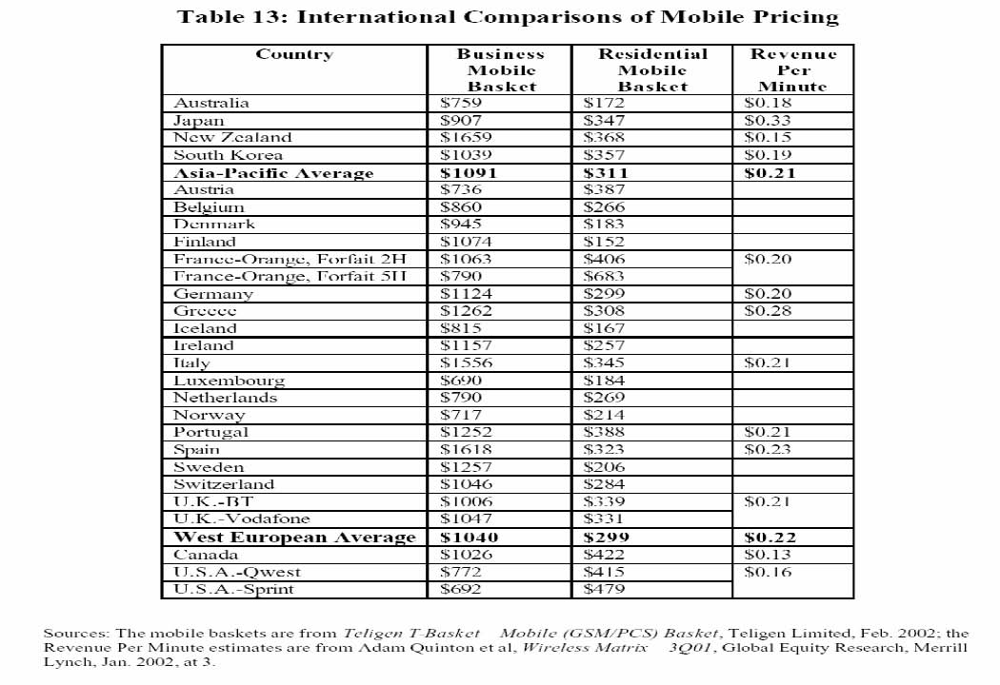
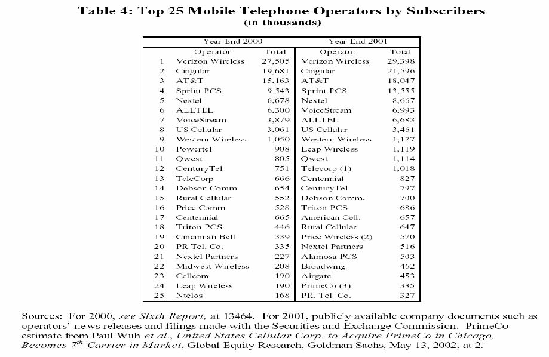

         Acrobat Distiller 5.0.5 (Windows)

         2003-07-28T02:13:22Z

         2003-08-20T15:58:36-03:00

         2003-08-20T15:58:36-03:00

         PScript5.dll Version 5.2

         xml

               bersara

               Microsoft PowerPoint - 14.23 Class10.ppt

# 14.23 Government Regulation of Industry

Class 10: Dynamic Issues inNatural Monopoly Regulation 2

MIT &amp; University of Cambridge

1

Outline

- 	Differences between US and European mobile phone markets. 

- 	The importance of standards in competitive markets. 

-  Spectrum Allocation and Auctions Theory. 

-  UK, Dutch, Swiss, Danish and Turkish auctions. 

-  Lessons on good auction design. 

2

History of Mobile Phones in US

- 	Cellular radio replaces wires with radio signals and has a series of radio relay stations (cell sites). Stations are linked via microwave transmission. Increasing capacity involves shrinking size of cells as same frequency can be used within a cell (theoretical idea in 1947). 

- 	1970s -Development of transmitters and receivers for co-ordination of cells and the development of switching equipment. 

- 	1981 -FCC allocation of 20MHz to LECs and 20MHz to McCaw Cellular (now AT&amp;T Wireless). 

- 	1994-95 FCC auctioned 120MHz of personal communications services (PCS) wideband spectrum raising $20bn or so. 

- 	Initially FCC prohibited one company from owning more than 45Mhz, of PCS, cellular radio and specialised radio spectrum. 

3 

-  Currently we are using 2G technology, 3G coming soon. 

Developments in Mobile Telephone Markets

Europe 

- 	In 1969 the Nordic telecommunications conference established the Nordic Mobile Group. 

- 	In 1975, the Nordic telecommunications conference recommended the NMT 450 MHz network to be built. 

- 	In 1981, the first analogue - NMT 450 system -commercial cellular services started in Sweden and Finland. 

- 	In the late 1980s, a common European digital standard – GSM (Global System for Mobile Communications) was approved. 

- 	In 1992 the first digital cellular Commercial services in the world Started in Finland. 

USA 

- 	In the 1960s, cellular technology was invented at Bell Labs. 

- 	In the early 1970s analogue cellular technology became available, developed by AT&amp;T and Motorola. 

- 	In 1968-1983 there were regulatory hurdles by FCC in making the decision regarding wireless licensees. 

-  In 1983, cellular services started. 

- 	Free competition of technologies based on different standards 

4 Source: Funk, J.L. (1998), ‘Competition between regional standards and the success and failure of firms in the world-wide mobile communication market.’, Telecommunications Policy, Vol.22 (4/5), pp.419-441. 

5

Problems with the US Mobile Telephone Market

-  1985 Nordic Cellular Market same size as that of US. 

- 	1968-83 FCC decides who to give licenses to and how many. 

-  Regulated free local calls in US slows entry of mobiles. 

-  Competition with older pager technology. 

- 	Price regulation and receiver pays system allowed higher prices. 

-  One digital standard in the 1990s (GSM) helped in EU. 

Multiple standards operate in US. 

6 

<Table>
<TR>

<TD></TD>
<TD></TD>
<TD></TD>
<TD></TD>
</TR>
<TR>
<TD></TD>
<TD></TD>
<TD></TD>
<TD></TD>
<TD></TD>
<TD></TD>
</TR>
<TR>

<TD></TD>
<TD></TD>

</TR>
<TR>

<TD></TD>
<TD></TD>

</TR>
</Table>

<Table>
<TR>
<TD></TD>
<TD></TD>
<TD></TD>
<TD></TD>
</TR>
<TR>
<TD></TD>
<TD></TD>
<TD></TD>
<TD></TD>
</TR>
<TR>
<TD></TD>
<TD></TD>
<TD></TD>
<TD></TD>
</TR>
<TR>
<TD></TD>
<TD></TD>
<TD></TD>
<TD></TD>
</TR>
<TR>
<TD></TD>
<TD></TD>
<TD></TD>
<TD></TD>
</TR>
<TR>
<TD></TD>
<TD></TD>
<TD></TD>
<TD></TD>
</TR>
<TR>
<TD></TD>
<TD></TD>
<TD></TD>
<TD></TD>
</TR>
<TR>
<TD></TD>
<TD></TD>
<TD></TD>
<TD></TD>
</TR>
<TR>
<TD></TD>
<TD></TD>
<TD></TD>
<TD></TD>
</TR>
<TR>
<TD></TD>
<TD></TD>
<TD></TD>
<TD></TD>
</TR>
</Table>

Source: CTIA’s Semi-Annual Wireless Industry Survey, 2001; 2002. 

Telecommunication indicators in the Eurostat area, 2000, ITU; Cellular subscribers ITU, 2002. Telecommunications Statististics 2000, Ministry of Transport and Communications in Finland, Edita, Helsinki 2000. 

7

Source: Funk, J.L. (1998), ‘Competition between regional standards and the success and failure of firms 8in the world-wide mobile communication market.’, Telecommunications Policy, Vol.22 (4/5), pp.419-441. 

Source: http://hraunfoss.fcc.gov/edocs_public/attachmatch/FCC-02-179A2.pdf, FCC (2002). 9

Source: http://hraunfoss.fcc.gov/edocs_public/attachmatch/FCC-02-179A2.pdf, FCC (2002). 10 

Market Shares in the UK mobile phone market

Source: http://www.oftel.gov.uk/publications/market_info/2003/mobile/q2mobile0203.pdf 

11

12

Source: Council of Economic Advisors (2000). 

Spectrum Auctions

- 	The radio spectrum is a scarce natural resource which is extremely valuable. It belongs to national governments within their geographic areas who have a right to allocate it commercially. 

- 	Owners of particular frequency ranges have a government granted natural monopoly over the portion of spectrum they own. 

- 	However owners of particular portions may offer compete with one another in offering identical services (e.g.wireless phone). 

- 	A franchise auction would seem to be a good way to allocate spectrum to the most efficient firms. 

- 	Although the spectrum is fixed in bandwidth, the government can choose to auction smaller packets in order to have more firms. 

-  Why do auctions lead to most desirable firms operating spectrum? 

-  What determines how close prices are to marginal cost? 

13 

14 Source: http://www.ntia.doc.gov/osmhome/allochrt.pdf 

Auction Theory

-  Auctioning of radiospectrum advocated by Coase (1959). 

- 	Auctions can be compared to ‘beauty contests’ (where bureaucrats decide between business plans). 

- 	Auctions force companies to put money where mouth is. It is difficult to specify and evaluate criteria for beauty contests. Auctions can raise large sums of money (UK=2.5% of GDP). 

- 	Two main types: ascending (English Auction); sealed bid (First price or Dutch Auction). 

- 	English Auction can encourage collusion because early bids can be used to signal to other players and can encourage weak bidders to drop out early (because of bid transaction costs and low probability of winning). 

- 	Dutch Auction does not allow strong bidders to know what weaker bidders valuation is. However if weaker bidders win then the outcome is not efficient. 

15

-  A good auction in either case encourages entry and discourages collusion. 

Objections to Auctions

-  Risks involved too great. 

-  Bid costs are passed on to consumers. 

-  Investment reduced if bid price goes up. 

-  Questions: 

-  Is an auction fee different from a development cost? 

-  If auction fee goes up how does this effect competition in the market for the service? 

-  How is speed of roll-out of service (and its associated investment) likely to be effected by increase in auction fee? 

16

Issues in Auction Design

- 	Stimulating new entrants in the light of the fact that 2G incumbents had advantage in 3G market. 

-  Royalties or Lump-sum payments? 

-  Why are lump sum payments more efficient? 

-  How many licences to issue? 

-  If we let the market decide what will happen? 

-  Appropriate legal framework 

-  Minimum reserve price, no allocation in the absence of bidders and make sure procedures in line with legislation. 

17

Revenues from European 3G mobile phone auctions

Date of Auction Euros per Capita 

<Table>
<TR>
<TD>UK </TD>
<TD>March-April 2000 </TD>
<TD>650 </TD>
</TR>
<TR>
<TD>Netherlands </TD>
<TD>July 2000 </TD>
<TD>170 </TD>
</TR>
<TR>
<TD>Italy </TD>
<TD>October 2000 </TD>
<TD>240 </TD>
</TR>
<TR>
<TD>Switzerland </TD>
<TD>November-December 2000 </TD>
<TD>20 </TD>
</TR>
<TR>
<TD>Germany </TD>
<TD>July-August 2000 </TD>
<TD>615 </TD>
</TR>
<TR>
<TD>Austria </TD>
<TD>November 2000 </TD>
<TD>100 </TD>
</TR>
<TR>
<TD>Belgium </TD>
<TD>March 2001 </TD>
<TD>45 </TD>
</TR>
<TR>
<TD>Greece </TD>
<TD>July 2001 </TD>
<TD>45 </TD>
</TR>
<TR>
<TD>Denmark </TD>
<TD>September 2001 </TD>
<TD>95 </TD>
</TR>
</Table>

Source: Klemperer (2002) Q: Why did revenues vary so much between auctions? 

18

UK Mobile Phone Auction 

- 	The first 3G license auction. 5 licenses auctioned of which 1 reserved for a new entrant. This encouraged new entrants to bid. License to last from 2021 and obligation to make network available to 80% of population by 2007. 

- 	Bidders had to be active and current top bidders could not bid in the next round of the multiple round ascending price auction. 

-  There were minimum bid increments. 

- 	Competition was assured for the reserved licence and this spilt over into the non-reserved licences. In the event 9 new entrants bid strongly and revenues were £22.4774bn. 

-  The auction concluded when only 5 bidders remained. 19 

Dutch and Swiss Auctions

- 	Netherlands followed British design but they had 5 licenses and 5 incumbents. Result strongest new entrants partnered incumbents and only one weak new entrant bid. Result auction revenue of E3bn rather than predicted E10bn. 

- 	Switzerland followed British design in auction of four licenses but allowed joint bidding agreements so the number of bidders dropped from 9 to four a week before the auction. The government postponed the auction but were legally challenged and had to sell at the reserve price. A sealed bid auction may have been better. 

20

Danish and Turkish Auctions

- 	Denmark had 4 incumbents and 4 licenses. They had however realised that in this position a sealed bid auction is better. The result (after the collapse of telecoms shares) was revenues twice that predicted beforehand. 

- 	Turkey auctioned 2 licenses sequentially in 2000 but set the reserve price of the second at the price of the first. What do you think happened? 

21

How did sequencing matter in European mobile phone auctions?

- 	Learning to play the game. The only successful auctions were the first of their type. 

- 	Learning opponents valuations. This influenced corporate strategy and decision to bid in future or seek alliances. 

- 	Market complementarities meant later market auctions were more valuable to previous winners. 

- 	Budget constraints did seem to arise for some firms as the high initial cost of licenses boosted debt levels. 

-  How can these problems be avoided for 4G? 

22 

Conclusions 

-  Standards important in stimulating innovation and competition. 

-  Number of firms crucial determinant of price. 

-  Spectrum is scarce and needs to allocated efficiently. 

- 	Designing effective auctions which facilitate entry and reduce collusion is difficult. 

-  Need to test rules for obvious problems. 

-  Need to set market structure in advance not in auction. 

-  Need to apply normal anti-trust standards to bidding. 

-  One design not appropriate for all markets. 

23

Next 

-  Deregulation of Surface Transportand Airlines 

-  Read: VVH Chaps 16 and 17

24
