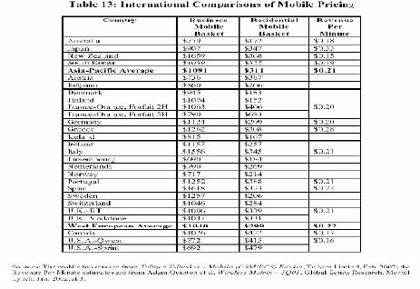
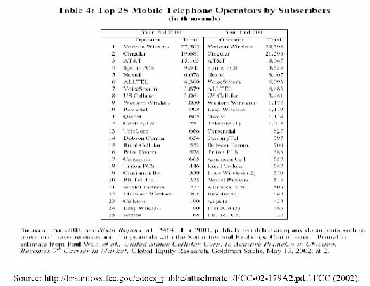
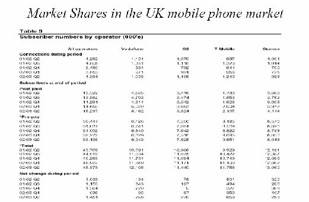
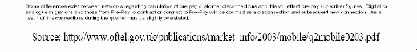
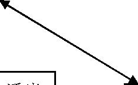
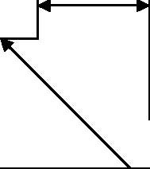
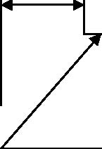
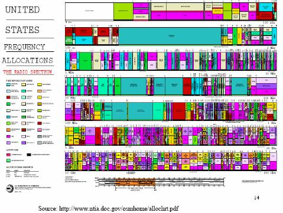
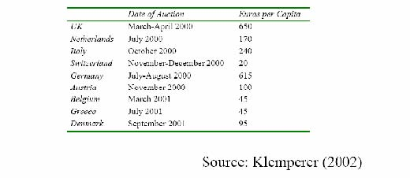

         xml

               user

               第十课.doc

         2005-10-13T11:00:50+08:00

         pdfFactory Pro www.fineprint.com.cn

         pdfFactory Pro 2.30 (Windows XP Professional Chinese)

## 14.23政府的产业管制

## 

### 第十课：自然垄断管制的动态问题 2

#### 麻省理工学院 &amp;剑桥大学提纲 

- 	美国和欧洲移动电话市场的区别。 

- 	竞争性市场标准的重要性。 

- 	频谱分配和拍卖理论。 

- 	英国，荷兰，瑞士和土耳其拍卖。 

- 	优秀拍卖设计的经验教训。

- 美国移动电话历史 

- 	蜂窝式无线电话取代电线传送无线信号，并且建立了一系列无线中断站（空间点―cell sites）。各个中继站通过微波传输连接。系统容量的提升使电话体积缩小，同一个频率可以被几个无线电话以同样的方式重复使用（1947年提出的理论想法）。 

-  	20世纪 70年代－为了提高防止电话相互干扰的协调能力，开发复杂的发送器、接收器及转换装置。 

-  	1981年－FCC把 20兆赫分配给本地电信公司（LECs），把 20兆赫分配给 McCaw Cellular（现在是 AT&amp;T的无线公司）。 

-  	1994－1995年，FCC把个人通信服务（PCS）包括多种频率的波段（spectrum）的 120兆赫以大约 200亿美元拍卖。 

- 	最初，FCC禁止每家公司拥有超过 45兆赫的 PCS、蜂窝无线电和特殊无线电频谱。 

- 	目前我们使用 2G技术，3G技术即将面世。

移动电话市场的发展

欧洲	美国 

- 1969年北欧电信会议决定成立北欧 · 20世纪 60年代，贝尔实验室发明了移动集团。蜂窝技术。 

- 1975年北欧电信会议推荐建立 NMT（北欧 · 20世纪 70年代早期，AT&amp;T和 Motorola  移动电话） 450兆赫网络。公司发展模拟（analogue）蜂窝技术，并普及。 

- 1981年，第一批模拟－NMT450系统 ·1968－1983年期间，关于无线许可证的决定，FCC －商业蜂窝（ cellular）服务在瑞典和芬兰还存在管制障碍。启动。 ·1983年，开始蜂窝服务。 

- ·20世纪 

- 80年代后期，一个公共欧洲数字标准 ·自由技术竞争以不同标准为根据。－GSM（全球移动通信系统）获批准。 

- 1992年世界第一批数字蜂窝商业服务在芬兰开始。 

Table: Graphic Removed Source: Funk,J.L.(1998), ‘Competition between regional standards and success and failure of firms in the world-wide mobile communication market.’, Telecommunications Policy, Vol.22(4/5), 

pp.419-441. 

美国移动电话市场的问题 

-  1985年，北欧具有美国同等规模的蜂窝电话市场。 

-  1968－1983年期间，FCC决定获得许可证的公司数量。 

- l美国本地免费电话市场的管制抑制了移动电话服务商的进入。 

- l与旧寻呼机技术进行竞争。 

- l价格管制和支付接受系统允许高价格。 

-  20世纪 90年代，欧盟的一种数字标准（GSM）促进多样标准在美国运行。 

Table：Graphic Removed Source ：CTIA’s Semi-Annual Wireless Industry Survey, 2001; 2002. Telecommunication indicators in the Eurostat area, 2000, ITU; Cellular subscribers ITU, 2002. Telecommunications Statistics 2000, Ministry of Transport and Communications in Finland, Edita, Helsinki 2000. 

Table：Graphic Removed Source: Funk, J.L. (1998), ‘Competition between regional standards and the success and failure of firms in the world-wide mobile communication market.’, Telecommunications Policy, Vol.22(4/5), pp.419-441. 

表 13：移动电话服务价格的国际比较

http://hraunfoss.fcc.gov/edocs_public/attachmatch/FCC-02-179A2.pdf,FCC(2002)

. 

表 4：世界上 25家最大的电话运营商的用户数量

英国移动电话市场的市场份额

图 A-1.位置竞争优势资源

公司战略和竞争全局

·一个地方环境鼓励适当需求条件 要素（输入）

的投资方式和可持续升

条件

级

·地方竞争对手间的积极竞争 

·要素（输入）数量和成本

·老练和苛刻的地方消费者

相关和支持

-自然资源

产业 ·期望消费场所的消费者需求 -资本资源

·特殊领域不同寻常的地方需 -科学和技术基础设施求全面得到满足 -信息基础设施

·有能力的地方供应

 -物质基础设施

者存在 

-行政基础设施 

·竞争性的相关产业

- 要素质量 

存在

- 要素专业化 

Reproduced from Porter, “Location, Competition, and Economic Developmentg,” 

Source: Council of Economic Advisors(2002) 

频谱拍卖 

- 	无线电频谱是一种极其珍贵的稀缺自然资源。在国家地理区域内属于政府所有，且政府有权利对其进行商业分配。 

- 	特殊频率波段（spectrum ranges）所有者在其频谱部分属于政府授权的自然垄断。 

- 	但是特殊部分的所有者可能与提供相同服务的供应者进行竞争（例如，无线电话）。 

- 	特许经营权拍卖似乎是一项好的方法把频谱分配给最优效率的厂商。 

- 	尽管频谱的带宽是固定的，但是政府可以选择拍卖小型存储器（smaller packets，）允许更多公司进入。 

- 	为什么拍卖导致最合意的公司运行频谱？ 

- 	谁来决定价格与边际成本有多接近？

- 拍卖理论 

-  	1959年，科斯提倡拍卖无线电频谱。 

- 	拍卖可以与 ‘选美比赛’相比较（政府官员在各商业计划中做出选择）。 

- 	拍卖促使参与公司不停提高报价（put money where mouth is）。很难明确规定和评价选美比赛的标准。拍卖可以筹集金额巨额的资金（英国，拍卖所得是 GDP的 2.5%）。 

- 	两种主要形式：上升式（英式拍卖） ;密封报价（最初价格或者荷兰式拍卖）。 

- 	英式拍卖能够鼓励合谋，因为对其他参与者来说早先报价是一个信号，使竞争力弱的出价者及早放弃。 

- 	荷兰式拍卖不允许竞争力强的出价者了解弱的出价者的估价。但是如果竞争力弱的出价者胜出，其结果是没有效率的。 

- 	无论哪种拍卖方式，都是鼓励进入，阻碍合谋。

- 反对拍卖的理由 

- 	涉及的风险过大。 

- 	投标成本转移给消费者。 

- 	如果标价升高，投资会减少。 

- 	问题：

－拍卖费用是否不同于发展成本？－如果拍卖费用上涨，这将如何影响拍卖的市场竞争？－拍卖费用增加可能作用于服务首次展示（和相关的投资）的速度，速度怎么变化？

拍卖设计问题 

- 	鉴于 2G在位厂商将在 3G市场获得优势的事实，新的进入者出现并进入 2G市场。 

- 	版税或者一次支付？－为什么一次支付更有效率？ 

- 	发放多少许可证？－如果我们让市场自己决定，会发生什么？ 

- 	适当的法律框架－最低拍卖底价，没有竞标者没有分配，制定符合法规的可靠程序。

欧洲 3G移动电话拍卖收益

问题：为什么各国的拍卖收益变动如此大？

英国移动电话拍卖 

- 	第一代 3G许可证拍卖。拍卖 5个许可证，其中一个留给新进入者，以鼓励新进入者参与投标。许可证 2021年到期，获得许可证的厂商有责任于 2007年在 80%的人口中普及网络。 

- 	竞标者积极参与投标，多回合上升式拍卖中目前出价最高的竞标者不能参与下一回合的竞标。 

- 	拍卖规定了最小投标增量。 

- 	确保预留许可证投标的竞争性，非预留许可证投标也要引进竞争。结果 9个新进入者竞标激烈，收益高达 22.4774bn英镑。

•	当只剩 5个投标者时，拍卖结束。

荷兰和瑞士拍卖 

- 	荷兰遵循英国模式。荷兰现已经发放 5张许可证，存在 5个在位厂商。 

- 	瑞士也遵循英国模式拍卖 4张许可证，并允许联合竞标协议，所以拍卖前一周竞标者从 9个下降为 4个。政府推迟了拍卖，但却受到合法质疑，因此政府不得不以保留价出卖许可证。如果使用密封投标拍卖可能较好。

- 丹麦和土耳其拍卖 

- 	丹麦有 4个在位厂商和 4张许可证。这种形势下密封投标拍卖更合适。结果（在电信股票价格暴跌后）达到事先预测的两倍收益。（结果实际收益是事先预测的两倍） 

-  	2000年土耳其顺序拍卖两张许可证，但是把第二张的保留价设定在第一张的拍卖价的水平上。你认为会发生什么？

- 欧洲移动电话的顺序拍卖方法的结果 

- 	学会博弈。唯一成功的拍卖是第一种类型。 

- 	了解对手估价。这将影响关于未来竞标或寻找同盟的公司战略和决策。 

- 	市场补充意味着稍后的市场拍卖对先前的赢家来说更有价值。 

- 	当昂贵的许可证最初成本会提高债务水平时，对某些公司来说预算约束似乎会上升。 

-  	4G拍卖如何避免这些问题？

- 结论 

- 	标准在激励创新和竞争方面很重要。 

- 	在价格决定方面，企业数量具有重要决定性。 

- 	频谱是稀有资源，需要有效分配。 

- 	设计出推动厂商进入和减少合谋的有效拍卖方案比较困难：－需要检验关于解决明显问题的规则。－需要提前而不是在拍卖时制定市场结构。－需要对竞标实行正规反托拉斯标准。－一种设计不适合所有市场。

- l《地面运输和航空业解除管制》 

- l阅读：VVH第十六章和十七章

下一课
