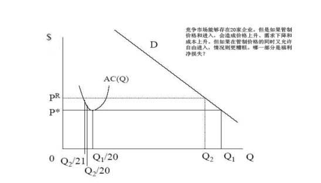
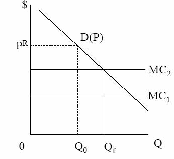
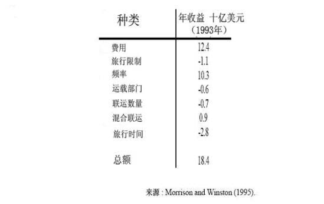

         xml

               user

               第十一课.doc

         2005-10-13T11:01:47+08:00

         pdfFactory Pro www.fineprint.com.cn

         pdfFactory Pro 2.30 (Windows XP Professional Chinese)

## 14.23政府的产业规制

## 

### 第十一课：地面运输和航空业解除规制

麻省理工学院 &amp;剑桥大学提纲 

- 	关于自然竞争产业价格规制和进入规制无效率的理论。 

-  	20世纪 70年代以前，铁路，公路运输，航空业都受到严格规制。 

- 	这些行业现在已经基本放松规制。 

- 	逐一调查每个行业：规制是如何影响这些行业的？

- 价格规制和进入规制 

- 	规制的中心是对进入和价格的控制。 

- 	规制价格可能高于或低于成本。 

- 	进入规制和退出规制具有相似效应。 

- 	进入/退出规制和价格规制都是必要补充。当处于以下几种情况时，会发生什么： 

- 	（1）什么时候规制价格高于成本，没有进入规制？ 

- 	（2）什么时候规制价格低于成本，没有进入规制？ 

- 	（3）什么时候存在进入限制，没有价格规制？

竞争市场规制

规制的次优效应 

- 	假设对第一种供应商规制，那对第二种相关供应商的规制是一件坏事吗？ 

- 	设想你拥有一家提供第一种商品的受规制企业，第二种供应商能够提供市场所需商品，但成本更高且质量稍差。 

- 	如果规制价格，使 PR&gt;MC2&gt;MC1。企业 2进入但不利于社会福利。 

- 	因此解决方法是政府促使两家企业都已不低于 PR定价。

- 	如果更低成本的收益超过消费者剩余损失，这样定价就是有利的。 

- 	在一个竞争性市场将发生什么？

不完全竞争模型 

- 	当大量固定成本存在，以及与市场规模相关的具有重要意义的最小经济规模 (MES)存在时，进入是否会增加社会福利并不清楚。 

- 	这是因为，在某一点进入发生，进入厂商无利可图，但是这一点也不是社会福利达到最大的点。 

- 	无疑社会将承担进入的固定成本，但是进入企业可以得到从其它企业转移来的利润。 

- 	这种现象在一个简单古诺模型中可能导致过度竞争（相对于社会最优来说）。 

- 	但是相对于禁止进入的成本来说，进入的社会成本可能较低（阅读有关书籍的案例）。

- 间接效应和创新 

- 	过度的非价格竞争（例如，航空业：食品，安全，放腿空间）。 

- 	生产无效率：高工资，导致资本/劳动力比率改变，无效率企业继续经营。 

- 	交叉补贴：强制执行交叉补贴阻止退出，导致社会福利减少。－也可能导致投资减少，生产力和质量下降。 

- 	实行规制，投资可能增加，但创新激励减少。20世纪 70年代美国受规制的产业其生产力似乎减缓。

-  	1.跨时期方法（inter-temporal）。把特定的产业的受规制期间和没有受规制期

- 间进行比较，观察区别。 

-  	2.跨市场比较（inter-market）。比较提供相似产品或具有不同权限的两个市场，一个受规制，一个不受规制。 

-  	3.反事实方法。以此为基准来假设市场不受规制时的情况。

- 地面运输的规制 

- 	铁路和公路运输被联系在一起，因为它们是运输的相近替代品。 

-  	19世纪 70年代：铁路寻求规制以保护自己远离价格战。 

-  	1887年：州际商业委员会（ICC）成立，规制铁路，要求费率‘公正和合理’，无歧视。 

-  	1906年：ICC制定最大费率。 

-  	1920年：ICC制定最小费率和控制进入退出。 

-  	1920年以后：公路运输开始与铁路竞争，削弱铁路的盈利能力。 

-  	1935年：汽车运输法：将汽车运输置于 ICC控制之下（价格，进入和退出）。

- 地面运输放松规制 

-  	20世纪 40年代：铁路要求减少规制，汽车运输受规制。 

-  	20世纪 50年代：不受规制的州际高速公路/自己驾车运输 own trucking冲击了铁路运输。 

-  	1958年：ICC允许铁路降低了一些费率，退出无利可图的客运市场。 

-  	1976年：铁路复兴和规制改革法（4R法案）允许一个合理费率区域，和退出无利可图路线的自由。 

-  	1980年：斯塔格斯（staggers）铁路法。在费率设置方面给予相当大的自由，允许自由进入和退出市场。 

-  	1980年：汽车运输法。进一步解除 ICC的规制。 

-  	20世纪 80年代,地面运输大幅度解除规制。 

-  	1995年：州际商业委员会结束。

- 为什么存在规制？ 

- 	铁路价格不稳定：破坏性竞争，强制执行合谋困难。 

- 	金融市场规制有利于铁路盈利能力（普拉格 Prager，发现随着州际商业委员会法案的通过，股票价格上升）－为什么这是一项好的措施？ 

- 	公路运输不存在自然垄断。 

- 	规制的理论根据是铁路规制的补充 

- 	公路和铁路运输的规制实践不一样。

-  	ICC设置最小费率和最大费率。 

- 	费率以服务价值原则和均衡差别原则为基础。 

- 	‘服务价值’定价指对高价值商品收取高价格（对一些并不贵重的商品运输不必要）。 

- 	‘均衡差别’防止对不同托运人和不同货物体积的歧视，即使它们的成本不同。这项原则意味着将产生交叉补贴。

- 公路运输规制 

-  	ICC允许建立产业 ‘机构’来制定价格。 

- 	对于相同距离的路线，费率不允许变动（即使这些路线密度不一样）。 

- 	费率可以根据装运体积/托运人特征的不同而改变。 

- 	因此，公路货运公司能得到他们所希望的价格，而铁路运输则不能。 

- 	但是公路运输的进入限制促使价格上升。

- 规制效应 

- 	跨时期方法关注实施规制前和后的价格效应。 

- 	很难分析特定的输入成本变化和交通性质。 

- 	但是规制放松后似乎大多数路线的铁路费率下降，尽管有一些路线的费率上升。 

- 	对于公路运输来说，规制放松后价格大体上都下降了。

- 规制效应 

- 	铁路面临退出限制。1980年斯塔格斯铁路法允许放弃无利可图的市场。美国联合铁路公司（Conrail）因此放弃了 2600英里长的线路（占总路线的 15%，收益的 1%）。 

- 	公路运输面临进入限制。1978年到 1985年，获批准的汽车承运人数量增加了一倍。这一期间，破产数量也上升了。 

- 	单位成本下降，且具有最低单位成本的厂商更为集中。 

- 	工会工人相对于非工会工人的工资溢价从 50%降至 27%（低于国家平均水平）。 

- 	因为利润提高，对道路的投资增加。 

- 	与其它国家相比较，美国受规制的产业生产能力低下，但是现在似乎已经提高了。

- 规制放松对利润的影响 

- l放松规制后，铁路生产力急剧增长，四年内回报率增加一倍。

- 	为什么？－自由退出。－费率弹性允许更好的需求管理。－下降的劳动力成本。－投资增加导致效率增加和成本降低。－和托运人的长期合同导致最优投资计划。

- 航空业规制 

-  	20世纪 20年代：美国邮政竞争投标看上来就象破坏性竞争。 

- 	航空公司认识到，尽管以最低成本为基础来分配合同，分配后没有价格规制，从此竞争起作用。 

-  	1938年：民用航空法颁布，航空业受到民用航空委员会（CAB）的联邦的规制。 

-  	1958年：CAB将安全管理转移给联邦航空管理局（FAA）。 

-  	CAB规制最大费率和最小费率，和竞争者数量。 

- 	航空公司数量固定在 1938年的水平，后来因合并而减少。

- 航空业规制放松 

-  	1975年：CAB主席放松进入限制。 

- 	到 1977年：进一步减少进入限制和放宽价格控制。 

-  	1978年：航空规制放松法。 

- 	到 1979年：允许自由进入。 

- 	到 1980年：不受限制的下调价格灵活性。 

- 	到 1983年：对费用的控制权终止。 

- 	最初存在大量进入，现在是中枢辐射式航线系统的合并（hub and spoke system）。

- 解除规制的效应 

- 	价格：－当交叉补贴放松后，价格下降尤其是长途距离价格下降。 

- 	质量：－规制导致高质量－高价格产品。而放松规制将会产生什么呢？ 

- 	中枢辐射式航线系统：

估算规制效应的方法 铁路规制

－意想不到的创新。航空公司通过增加航班使用省钱。为什么？但是由于更频繁的起飞，也提高对乘客的价值。 

2003年美国西部航空公司线路

http://www.americawest.com/aboutawa/companyprofile/aa_routemap.htm

航空业解除规制对消费者福利的影响

结论 

- 	潜在竞争产业的规制通常导致高价格和成本。 

- 	在某产业受到规制后，规制可能会扩展至相关部门。 

- 	铁路运输和公路货运规制放松表明先前的规制使成本增加和价格扭曲。 

- 	航空业放松规制表明竞争条件下不曾预料到的创新将产生大量利润。

- 下一课 

- 	复习，准备期中考试－阅读习题集和复印资料。－模拟考试（将公布）。－把你的问题通过电子邮件发给我。 

- 	提示：期中考试只允许携带简单计算器。
