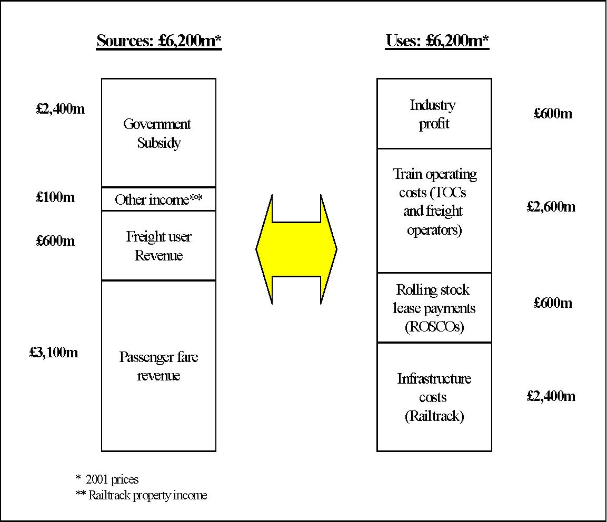
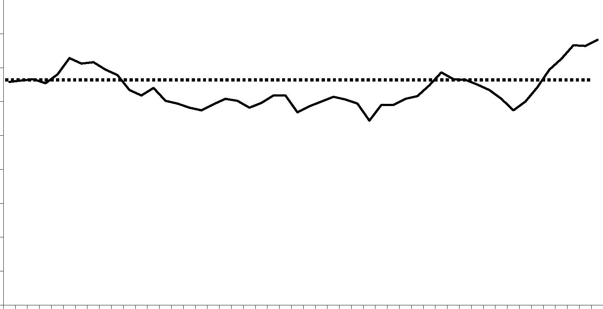
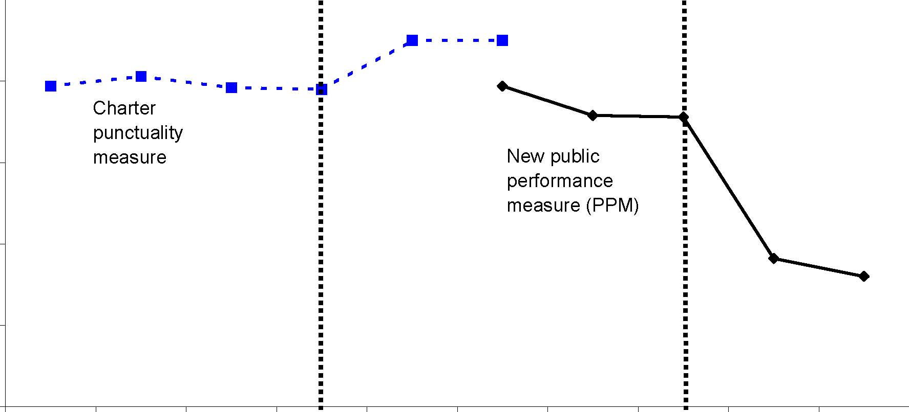
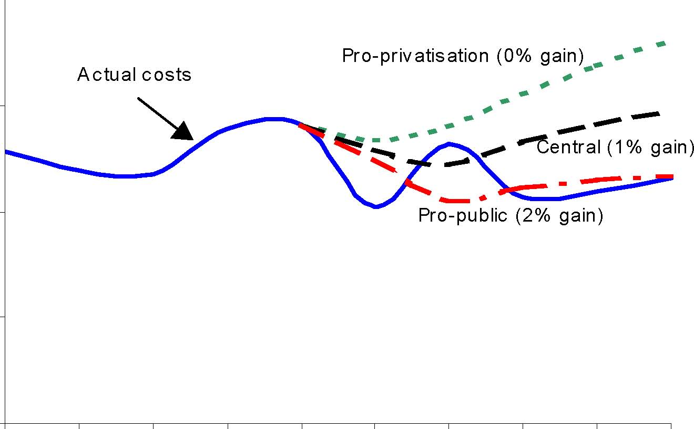
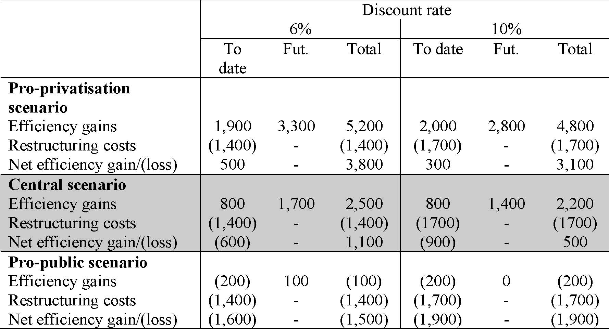
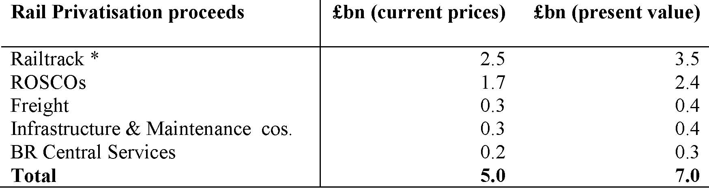
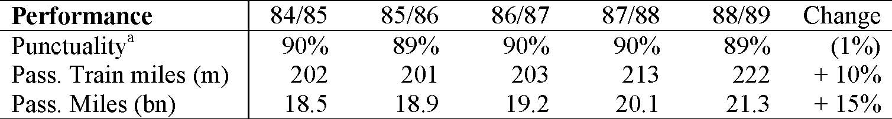

         Acrobat Distiller 5.0.5 (Windows)

         2003-07-28T02:14:37Z

         2003-08-18T12:00:49+05:30

         2003-08-18T12:00:49+05:30

         PScript5.dll Version 5.2

         xml

               bersara

               Microsoft PowerPoint - 14.23 Class15.ppt

# 14.23 Government Regulation of Industry

Class 15: Problems of De-regulation –The Case of UK Railways

## MIT &amp; University of Cambridge

-  History of UK Railways 

-  Privatisation and Restructuring 

-  Regulation 

-  Performance since Privatisation 

-  Recent Failures 

-  Lessons 

-  1820s onwards railway network privately financed. 

- 	1948 industry nationalised then privatised between 1995 and 1997. 

- 	1948-95 secular decline in rail (passenger and freight) due to road competition. 

-  1960s mileage reduced by a third (Beeching cull). 

- 	1968-1985 rising subsidies £1.6bn in 1985/86, up from £600m (in constant prices) in 1968 

-  Low productivity growth and sharp wage increases in 1970s. 

-  Government keen to avoid further line closures. 

- 	1980s significant privatisation of non-core businesses e.g.hotels, sea transport. 

-  1994-97 privatisation of all of industry. 

-  1995-trend decline reversed since privatisation. 

- 	1979-97 Conservative policy: easy privatisations first, then more difficult. 

- 	1992 White Paper and Conservative aim to make rail privatisation irreversible. 

- 	Structure adopted chosen to maximise competition (electricity model). 

-  Main change was separation of track ownership from train operation. 

-  Two regulatory bodies created (OPRAF (now SRA) and ORR). 

-  In all 100 companies created out of BR. 

# Financing and Regulation of Industry

-  Regulation: OPRAF and ORR (Office of the Rail Regulator). 

- 	OPRAF administers subsidies to Train Operating Companies (TOCs). 

- 	TOCs purchase track and station access from Railtrack (the monopoly track infrastructure provider) at regulated tariffs. 

-  Rolling stock leasing companies (ROSCOs) lease trains to TOCs 

-  Passenger Fares regulated 

-  Competition envisaged on existing routes. 

- 	SRA (Strategic Rail Authority) has since taken over role of OPRAF. 

-  Some direct grant to Railtrack now being given 

Britain’s Railways: Sources and Uses of Funds (1997/98) 

Passenger fare revenue Freight user Revenue Other income** Government Subsidy £3,100m £600m £100m £2,400m Sources: £6,200m* Rolling stock lease payments (ROSCOs) Train operating costs (TOCs and freight operators) £2,400m £600m £2,600m Uses: £6,200m* Infrastructure costs (Railtrack) Industry profit £600m * 01 prices ** Railtrack property income 20

Source: Smith (2003) 

-  TOCs have licences and a stream of subsidies and price controls. 

-  TOCs are under threat of franchise loss (e.g.Connex South Central). 

-  The initial price control period ran to 2003 (end of franchises). 

- 	Regulation of many fares plus quality of service through performance penalties. 

- 	RPI-X Regulated fares: saver, weekly season and most commuter fares (40% of revenue). 

-  X=0, 1996-98; X=1 (98-03), in commuter markets -2 to +2 for quality. 

- 	Punctuality incentive scheme, short formations incentive payment, timetable change incentive payment. 

- 	Many TOCs have struggled to break even and there has been a lot of consolodation. 

- 	Between 1995-00 fares rose by 0% while 1990-05 rose by 12% on average (in real terms). 

-  CP1 (control period) track access charges fixed to 2000-01. 

-  CP2 track access charges 2001-06. 

-  Under CP1 Railtrack: RPI-8 in 1995-96, then RPI-2. 

- 	Under CP2 Railtrack: RPI-11.2 in 2001-02, then c. RPI+4.5 on charges, plus direct grant (of £800m p.a.) implies RPI+34.5 in 2001-02, then c.RPI+4.5. 

- 	Track access charges consist of a fixed and a variable element for each TOC (usage charge+traction charge). 

-  Under CP1 the variable element was around 9%. 

-  Under CP2 variable=20% of the amount paid by the TOCs. 

-  Freight only paid for its own specific costs. 

Passenger km (bn) 

Passenger Rail Travel 

45.0 

40.0 

35.0 

30.0 

25.0 

20.0 

15.0 

10.0 

5.0 

0.0 1952 1959 1966 1973 1980 1987 1994 2001 

-  23% growth in passenger miles since privatisation (1993 to 2001). 

9 

## Key Trends (2) -Costs

Sources: BR Annual Reports; Annual Reports for individual companies (post privatisation). Transport Trends, 2001 Edition (DTLR). 

-  Costs are operating costs (excluding depreciation). 

-  Excludes minor freight operators 

-  But also excludes profits of supplier companies 

-  ORR costs charged out to industry; SRA costs included. Dept of Transport costs not included 10 

## Key Trends (3)

Service QualityPercentage of trains arriving on time 

(All operators) 

Pre-privatisation 

Post-privatisation 

Post-Hatfield 95% 

90% 

85% 

80% 

75% 

Charter punctuality measure New public performance measure (PPM) 

70%

Source: Railway Safety (2002), 12 http://www.railwaysafety.org.uk/pdf/railrepo0102/aspr%20200102%20full%20report.pdf 

Methodology 

Calculation 

- 	Social cost-benefit analysis. • Compute difference between costs under public and private ownership. 

- 	Outlined by Jones, Tandon and Vogelsang (1990). ∆W = Cg -Cp -R&amp;P 

- 	Adopted for many other privatised • Main difficulty lies in estimating theindustries in UK and overseas. counterfactual cost profile. 

- 	Assesses total welfare change • Total welfare change then allocateddistribution. between different groups. 

∆W = Vsp -Vsg + (λg -lp) * Z ∆W = ∆Cust + ∆Prod + ∆Gov 

-  Privatisation socially worthwhile if 

∆W&gt;0. 13 

FIGURE 4 

Actual and Counterfactual Total Costs 

5000 

4500 

4000 

3500 

3000 88/89 89/90 90/91 91/92 92/93 93/94 96/97 97/98 98/99 99/00 

Pro-public (2% gain) Pro-priv atis ation (0% gain) Central (1% gain) A c tual c os ts 

£m (1999/00 prices) 

Discount rate 6% 10% To date Fut. To date Fut. Total Pro-privatisation scenario Efficiency gains 1,900 3,300 5,200 2,000 2,800 4,800 Restructuring costs (1,400) -(1,400) (1,700) -(1,700) Net efficiency gain/(loss) 500 -3,800 300 -3,100 Central scenario Efficiency gains 800 1,700 2,500 800 1,400 2,200 Restructuring costs (1,400) -(1,400) (1700) -(1700) Net efficiency gain/(loss) (600) -1,100 (900) -500 Pro-public scenario Efficiency gains (200) 100 (100) (200) 0 (200) Restructuring costs (1,400) -(1,400) (1,700) -(1,700) Net efficiency gain/(loss) (1,600) -(1,900) -(1,900) Total (1,500) 

-  Government receives/producers pay sales proceeds (£7bn). 

-  Government receives taxes on future profits (small effect). 

-  And pays subsidies 

-  Counterfactual: government pays subsidies to cover losses. 

-  Overall, government’s position broadly neutral. 

Rail Privatisation proceeds £bn (current prices) £bn (present value) Railtrack * ROSCOs Freight Infrastructure &amp; Maintenance cos. BR Central Services Total 2.5 1.7 0.3 0.3 0.2 5.0 3.5 2.4 0.4 0.4 0.3 7.0 

- * Includes £596m of debt. 

-  October 1999 Ladbroke Grove (near Paddington) Crash. 

- 	July 2000 Government 10 year transport plan indicates further growth in rail network usage to 2010 of 50%. 

-  October 2000 Hatfield (north of London) Crash. 

-  Hatfield causes severe disruption of network. 

-  April 2001 Regulator agrees that Railtrack may bring forward revenue from future. 

- 	April-May 2001 Railtrack privately seeks more government money to finance operations. 

-  October 2001 Secretary of Transport places Railtrack in special administration 

- 	October 2002 Network Rail, a not for profit company limited by guarantee, takes over network assets. 

- 	Late 2002-03 indications from SRA that future investment plans will have to be cut and government targets for increased rail use will not be met. 

- 	Following Hatfield Crash it became clear that Railtrack needed more finance and that CP2 was too harsh. Hatfield cost £500m of repairs and £500m of TOC compensation. 

- 	In April 2001 government agreed with Railtrack to bring forward £1.5bn from CP3 (beyond 2006-7). 

- 	This money was not forthcoming as the government could not find a way of transferring it without it ending up on the PSBR. 

- 	This contributed to the funding shortfall which led to being brought into administration. 

-  ROSCOs did not invest in new rolling stock as expected. 

- 	TOCs needed extension of franchises in order to get incentives to invest in new rolling stock (e.g. Virgin). 

- 	TOCs also required some infrastructure investment to complement their investment (e.g. Virgin, Heathrow Express). 

- 	Some TOCs had clearly been ambitious on bidding for subsidy reduction and this led to consolidation in industry. 

- 	Other TOCs demonstrated incompetence in running services and lost franchise (however this could be a benefit of competition). 

-  Too many TOCs – some combinations being franchised from 2003. 

- 	However Affuso et al (2002) demonstrate a big improvement in TOC efficiency as a result of privatisation due to lower costs and higher revenue. 

-  Strong TOC incentive to run more trains. 

- 	Extra revenue to Railtrack did not cover marginal costs, hence recent increase. 

-  1% rise in trains leads to 2.5% increase in congestion. 

- 	Negotiations to reallocate access rights to most efficient use and allow Railtrack to take share of benefit have proved costly and slow. 

- 	Maintenance contracts fixed price (set prior to privatisation) leading to focus on cost minimisation. 

-  Performance deteriorated during the growth period of the 1980s. 

-  So likely that performance would have been worse under public ownership. 

Train Performance and Volume: Post-Privatisation

Performance 95/96 96/97 97/98 98/99 99/00 Change 

Punctualitya 89.5% 92.5% 92.5% 91.5% 91.9% + 2.7% Pass. Train miles (m) 231 229 237 249 257 + 11% Pass. Miles (bn) 18.6 19.9 21.6 22.6 23.8 + 28% 

(a) Percentage of trains on time. 

Train Performance and Volume: BR Regime 

Performance 84/85 85/86 86/87 87/88 88/89 Change Punctualitya Pass. Train miles (m) Pass. Miles (bn) 90% 202 18.5 89% 201 18.9 90% 203 19.2 90% 213 20.1 89% 222 21.3 (1%) + 10% + 15% 

(a) Percentage of trains on time. 21 

- 	Evans (2000) and (2002) finds accidents per billion train miles is on a trend decline over the period 1967-2001. 

-  This is the case even including the latest period. 

- 	However some suggestion that the number of fatalities per accident is mildly increasing in speed and over time. 

- 	However it is impossible to say that privatisation led to any increase in fatalities. 

- 	Intermediate indicators of safety such as number of signals passed at danger (the cause of the Ladbroke Grove Crash) and number of broken rails (the cause of the Hatfield Crash) have declined sharply over the privatisation period. 

-  Privatisation good at getting costs down and output up. 

-  Regulation may create perverse incentives. 

-  Fixed contract prices for maintenance 

-  Low marginal prices for Freight and TOCs 

-  In general: keep privatisation and restructuring simple. 

•	Privatisation may reduce willingness to accept risk – this could be expensive. 

- 	Privatisation almost certainly reduces political acceptability of subsidies. 

-  The De-regulation of Californian Electricity 

- 	Read Joskow, P.; "California's Electricity Crisis;" Oxford Review of Economic Policy, Vol.17, No.3; pp. 365-388. 
