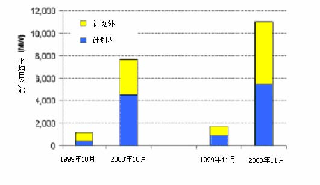

         xml

               user

               第16课 .doc

         2005-10-12T11:24:20+08:00

         pdfFactory Pro www.fineprint.com.cn

         pdfFactory Pro 2.30 (Windows XP Professional Chinese)

# 14.23 政府产业规制

第 16课：放松规制——加州电力市场

麻省理工院 &amp;剑桥

学大学

- l市场：自发形成或主观设计 

- l电力市场的性质？ 

- l市场设计的一般原则 

- l加州电力市场的设计 

-  2000年加州的能源危机 

- l市场设计的经验教训

图片不存在

http://ksghome.harvard.edu/%7E.whogan.cbg.Ksg/empr1298.pdf

- l发电商 

- l传输线路拥有者 

- l独立系统运营商(ISO) 

- l电力交易中心(能源市场) 

- l均衡性市场 

- l配套服务 

- l电力输送商 

- l电力零售商 

- l规制机构例如：加州公共设施委员会(CPUC)和联邦能源规制委员会 (FERC) 

(赫根， 1998) 

l短期市场

- 	输送线路拥堵 

- 	长期市场合同 

- 	计划和平衡 

- 	长期投资 

- 	搁置成本的清偿 

- 	安全问题和能源储备

图片不存在

http://ksghome.harvard.edu/%7E.whogan.cbg.Ksg/empr1298.pdf

图片不存在

http://ksghome.harvard.edu/%7E.whogan.cbg.Ksg/empr1298.pdf

（廖和亨廷顿， 1998年） 

- 	市场不是自发形成的! 

- 	市场设计的主要动机是通过激励技术革新和有效率的投资竞争来提升长期效益。 

- 	拆分和增设机构将增加交易成本。 

- 	有效的短期价格信号对长期效率是必要的。 

- 	跨地区和跨市场的市场设计应体现兼容性和一致性。

- 市场设计 

- 	决策者易于低估消费者选择和产品多样性在实现长期福利最大化方面的重要性。

- 	因为长期决策具有较强的外部性，所以这样的决策过程需要政府干预。 

- 	有效的公共政策需要依据不同的规章和制度对市场运行进行频繁的监控和公正的评估。

- 需要决定的关键事项 

- 	哪些领域需要进行垂直拆分？ 

- 	水平拆分的程度如何（发电商）？ 

- 	哪些领域需要引入竞争 (零售领域) ？ 

- 	什么样的交易会被禁止或规制（例如：交易是自愿的还是强制的）？ 

- 	消费者（特别是国内消费者）将受到什么保护（例如：对本地经销商实施的税收价格上限）？ 

- 	通过什么机制出清市场（提前/实时）？ 

- 	谁将监督市场的运作，并对市场进行调整（独立系统运营商或电力交易中心）？

- 加州电力市场 

- 	加州——世界第五大经济体 

- 	加州电力行业的年产值是 230亿美元。高峰用电需求为 45兆瓦，而其有效容量仅为 44兆瓦。 

- 	美国的政策对制定者有利。 

- 	环境保护较好的州。 

- 	过度民主：频繁的公开投票。 

- 	三大公用事业公司：太平洋燃气电力公司(PG&amp;E)、南加州爱迪生电力公司 (SCE)和圣地亚哥燃气电力公司(SDG&amp;E), (R =9.6亿，7.9亿，20亿) 

- 	在 1987年〜2000年没有增加新的装机容量。 

- 	新增电力产能主要来自独立发电商。

- 改革的背景 

-  	90年代早期，加州的经济处于衰退中，GDP连续三年下降。 

- 	加州的电价是邻州电价的1.5倍，是美国各州平均价格的两倍。 

-  	1993年加州公用事业委员会（CPUC）提议对电力系统进行改革。 

-  	1994年4月，在举行听证会和工业论坛后，环境学家、消费者和加州公用事业委员会正式做出进行大规模改革的决定。

- 新的市场机构 

- 	加州的电力交易中心(PX) 

- ——	每天电力公司从交易中心通过竞价批发购买用电量（提前一天提出用电量）。价格每小时确定。电力交易中心支付给发电商的电力价格为竞争性报价。 

- 	独立系统运营商(ISO) 

——管理电网设施，通过提前购买和双边会晤协调电力交易中心的电能供应，并为能源储备付费。但是电力交易中心不允许对外提供信息。

• 	1890年的重组法案(AB) ——太平洋燃气电力公司提议：削减10%的费率并冻结五年内的费率直到 

2002年才允许抬高价格上限。 ——对可再生能源的补贴——如果批发价低于零售价，竞争性转移费用(competitive transition charge 

)将使搁置成本得到清偿。这些暗示在这期间将没有零售竞争。 

- 	议案在1996年9月23日获得了参、众两院的一致通过。皮特·威尔逊总督说：“我们已经废弃了一个过时的垄断机制并且用一个新时代的竞争机制来替代它”。

- CPUC的最终调整 

- 	允许在输电网上取得高回报的激励机制使公共机构放弃对发电设备的资产所有权。 

- 	加州公共设施委员会 (CPUC)禁止在位公用事业单位直接签订双边合约或防止失去抵押资产赎回权的合约。 

- 	零售费率将被冻结到 2002年 3月或者直到搁置成本被有效的清偿后为止。 

- 	独立系统运营商被授权管理一个没有价格上限的、可靠性有保证的实时现货市场。这是另一个发电厂可以和电力交易中心进行竞价交易的市场。

<Table>
<TR>

<TH>重组法案前</TH>
<TH>重组法案后</TH>
</TR>
<TR>
<TD>发电商</TD>
<TD>公共机构拥有电厂公共机构购买 </TD>
<TD>PG&amp;E,SCE和SDG&amp;E保留了核发电厂并签定了新的合同。DUKE,AES/Williams,Dynergy，Reliant和Southern购买了剥离出来的电厂 PX制定价格大量用户向发电商购买电力</TD>
</TR>
<TR>
<TD>输电商</TD>
<TD>公共机构运转系统 FERC制定价格 </TD>
<TD>ISO管理系统 FERC制定价格</TD>
</TR>
<TR>
<TD>配电商</TD>
<TD>公共机构运转系统 CPUC制定价格</TD>
<TD>公共机构运转系统 CPUC制定价格</TD>
</TR>
</Table>

新市场于 1998年 4月 1日开始运行。

-  	1998年 4月〜2000年 4月：新市场最初运转良好。——电力交易中心的交易价格偏低，电力交易中心和太平洋燃气电力公司 

- (PG&amp;E) 、南加州爱迪生电力公司(SCE)收回了 100亿美元的搁置成本。但是，新计划仍在策划中。 

-  	2000年夏天，酷热天气和输送线路的超负荷运转引起了一系列的混乱。

加州的电力价格

（$/Mwh:加权平均7x24） 

1998年 1999年 2000年 2001年 1 月 -21.6 31.8 260.2 2 月 -19.6 18.8 363.0（ISO RT） 3 月 -24.0 29.3 313.5（ISO RT） 4 月 23.3 24.7 27.4 370.0（ISO RT） 5 月 12.5 24.7 50.4 274.7（ISO RT） 6 月 13.3 25.8 132.4 103.8（ISO RT） 

7月 35.6 31.5 115.3 62.6（ISO RT） 8 月 43.4 34.7 175.2 45.2（ISO RT） 9 月 37.0 35.2 119.6 35.0（EST） 

http://econ-www.mit.edu/faculty/pjoskow/files/CALELE901.pdf

图4.11电力紧缺和拉闸限电

图不存在

用电缺口（1999年和2000年）

http://econ-www.mit.edu/faculty/pjoskow/files/CALELE901.pdf

- 	电力零售价格保持稳定。但是圣地亚哥燃气电力公司的电力零售价格却在 2000年7月开始大幅上涨，引起了在2000年9月对其进行强制性价格规制。 

- 	当发电厂离开电力交易中心而到独立系统运营商应急市场交易时，电力交易中心和独立系统运营商间存在套利机会。 

-  	2000年 12月，联邦能源规制委员会宣布 IOUs在市场衰退时不必从电力交易中心购买其所需的全部电力。联邦能源规制委员会设定了 150美元/千瓦时的价格上限。

- 急需解决的问题 

-  	2001年 1月的片区拉闸限电影响了 38万消费者。风暴导致太平洋燃气电力公司核发电厂因发电量减少而损失了 23亿美元。 

-  	2001年新的供电设施费用是 125亿美元。2001年 7月价格开始上涨，州政府只好通过加州水利资源局（CDWR）购买电力。 

- 	递延成本：2001年 3月太平洋燃气电力公司破产。 

- 	发电厂索价太高和发电量流失。 

- 	由于气候影响, 2001年5月的用电量相对于上一年同期减少了11%。 

- 	新电力供给：1997年和 2000年间电力供应量新增 10兆瓦，2001年〜2005

年间将再新增电力 32兆瓦。

- 	委员会的复杂市场设计使其设计倾向于政治利益集团而忽略了常识、技术现实和国际经验。 

- 	供应短缺将导致现货市场发展欠佳。 

- 	允许消费者使用批发价购买电力。供应者应该能签署长期合同或者进行套期交易。 

- 	在一个互连系统里，公共产品的闲置产能应该获得回报。 

- 	当市场重叠时,应尽可能制定跨市场的标准化规则(例如：发电量流失的标准化规则)。 

- 	实现高效投资是改革带来的最大收益之一。 

- 	市场再设计过程要考虑市场设计的中期修正结果。

- 下一课 

- 	社会规制介绍：外部性 

- 	相关阅读资料：VVH 第 19章
