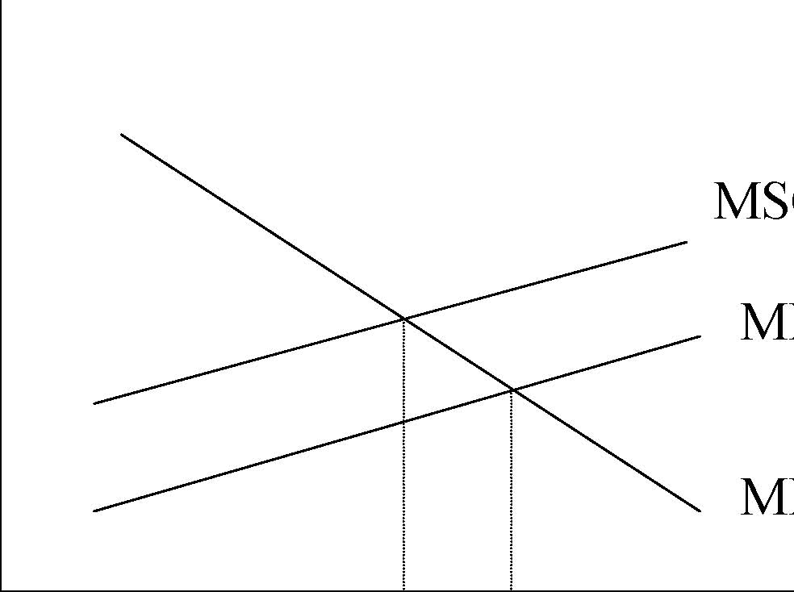
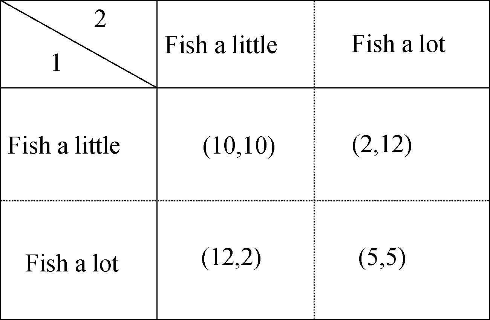

         Acrobat Distiller 5.0.5 (Windows)

         2003-07-28T02:15:19Z

         2003-08-11T12:25:55+05:30

         2003-08-11T12:25:55+05:30

         PScript5.dll Version 5.2

         xml

               bersara

               Microsoft PowerPoint - 14.23 Class17.ppt

# 14.23 Government Regulation of Industry

Class 17: Introduction to Social Regulation

MIT &amp; University of Cambridge

1

Outline 

-  Introduction to Social Regulation 

-  The value of risk 

-  Overview of last section of course 

-  Externalities 

-  Potential Remedies 

-  Coase Theorem 

-  Public Goods 

2

Background to Social Regulation

-  Motivation for regulation is the correction of market failure. 

- 	When we discuss social regulation, we will mean regulation of health, safety, and the environment and public goods such as intellectual property. 

-  Unlike economic regulation, there has been NO de-regulation. 

- 	Much social regulation that really didn’t exist in the US before the 1970s. 

- 	Social regulation is more difficult than economic regulation in some sense because it’s more difficult to determine the costs and benefits of those regulations. 

-  What is in society’s best interest may be more difficult to measure

3

(eg. seatbelt laws, disclosure rules, etc.). 

Basic Motivation

- 	Much social regulation is really about reducing accidents that lead to bad outcomes, e.g. this can be requiring seatbelts to reduce fatalities from car accidents, pollution reduction (both for criteria pollutants and toxics), workplace hazards, nutritional labelling. 

- 	NOTE: you cannot actually ELIMINATE risk – many of the risks that exist can be extremely small and extremely costly to eliminate completely. 

- 	NOTE: Concern for social aspects -quality of life -of production increases with income (post-materialism highly income elastic). As we get wealthier, we will demand more safety against risks that lead to reduced health status. 4 

Policy Evaluation

-  Regulatory agency powers are determined by the legislature. 

-  For agencies regulating social outcomes, powers are restricted. 

- 	For example, the Environmental Protection Agency (EPA) and Occupational Health and Safety Administration (OSHA), are EXPLICITLY not allowed to base what they do on a cost-benefit analysis. Why? 

-  However in the US the executive branch does provide oversight: 

_ Ford administration required that the cost and inflationary impact of regulations be assessed. 

_ Carter administration said that cost effectiveness of regulation also required. 

-  OMB requires cost-benefit analysis to be done EVEN if it 

can’t be used to set regulations. 

5 

Cost-Benefit Analysis

- 	Maximisation of net benefits requires MC=MB (marginal benefit), why? 

-  This implies distinguishing average and marginal costs. 

-  Notice range of MC much greater than range of AC: 

Table 1 Values for Arsenic Regulation 

Stringency Standard Level (mg/m3) Average Cost per Life ($ millions) Marginal Cost per Life ($ millions) 

Loose 0.10 1.25 1.25 Medium 0.05 2.92 11.5 Tight 0.004 5.63 68.1 

Source: Viscusi (1983).

6

Analysis of Risk: Factors to be considered

-  Heterogeneity: 

- 	Consistent implementation of a policy is complicated if costs vary between those who must respond to it, e.g. on the basis of technology or wealth. Examples? 

-  Discounting 

- 	How to you account for costs which will be incurred by future generations? Which discount rate should you use? 

-  Irrationality and biases in perception 

-  Overestimation of small risks 

-  Underestimation of big risks 

-  Framing Effects 

- 	It matters how you frame question: much less willing to pay to 7 avoid risk than to accept compensation for increased risk. 

Analysis of Risk: Factors to be considered

-  Uncertainty 

-  How should we deal with uncertainty about future payoffs? What if we do not know what effects will be. 

-  In such circumstances it can be shown that conservatism is not usually the best strategy. 

-  Ellsberg Paradox: 

-  Two bags of balls: in 1, 50% blue and 50% red; in 2, unknown number of red or blue. You must guess a colour in advance and then draw, get prize if you guess correctly. Which bag would you prefer to draw from? How does this change if the game is repeated? How might this apply to global warming?8 

Analysis of Risk: Factors to be considered

-  Political Factors 

-  Lots of concern about political influence on social regulation in US (why not so much elsewhere?). 

-  Voting for environmental protection: 

-  Income, Frostbelt (+ve); Income growth (-ve). 

-  Voting against strip mining, influence of: 

-  Coal consumption in state, surface coal production (-ve) 

-  Underground coal, environmental groups (+ve) 

-  Offset by variable to control for pro-environmental record (significant). 9 

Still to come in 14.23 

- 1. Externalities and public goods

- 2. Value of Life

- 3. Environmental Regulation and Choice of Instruments

- 4. National Markets for Clean Air

- 5. International Markets for Greenhouse gases

- 6. Workplace safety

- 7. Regulation of Pharmaceuticals

- 8. Internet and copying

10

Externalities

- 	An externality exists when one or more economic agents undertake an activity that affects the (consumption / production set) welfare of other economic agents in a way that is not captured by the market. The externality does NOT have a market price. 

- 	Result: markets with externalities are no longer efficient EVEN if we have perfect competition in the market. Why? 

- 	Example: An electric utility that produces electricity at a constant MC = $2/kWh. But suppose that the utility also produces pollution (sulfurous oxides through the burning of fossil fuels) which damages the environment (acid rain). MCsoc =MCpriv + marginal damage. 

11 

-  Do we get too much or too little electricity in this case? 

Externalities

$

MSC=MPC+MD

MPC

MPB=MSB

P* P1

Pollution

0

MPB=marginal private benefit, MSB=marginal social benefit, MPC=marginal private cost, MSC=marginal social cost, MD=marginal damage.

12

Potential Solutions to Externalities

1.Complete Prohibition (compliance issues?) (e.g. CFCs). 

2.Command and Control (e.g.nuclear radiation). 

3.Taxes and subsidies (e.g.landfill waste) 

4.Create property rights (e.g.SOx markets). 

5.Direct action/government ownership. 

6.Moral suasion. 

13

Coase Theorem

- 	So long as property rights are well defined, then independent of the initial allocation of those rights, if transaction costs are zero (and there are no wealth effects) and all parties can bargain in their own best interests, the efficient allocation will be found. 

- 	So, according to Coase, under a number of very strict assumptions, there is no need for government intervention in the market because people will be able to bargain to the socially 

14

efficient outcome. 

Example: Upstream Papermill and Downstream Brewery

$ 

MD of pollution MC of abatement Case 1: Suppose brewery owns river, what happens? Case 2: Suppose papermill owns river, what happens? 

0 Pollution

15

Coase Theorem in practice

- 	If no income effects it does not matter who gets the property rights from efficiency point of view. 

-  It does from a ‘distribution’ point of view, why? 

-  However we need to realise: 

-  Transaction costs are not zero. 

-  Small victims have free rider problems. 

-  Governments acting on their behalf may not know preferences. 

-  Asymmetric information: polluters know more than victims. 

-  Opportunism exists in seeking compensation from damage. 

-  Coase works well when: 

-  Private information important. 

-  Governments cannot get information easily. 

-  No barriers to voluntary private controls. 

16 

-  Parties involved are easily identifiable. 

A numerical example

-  Paper mill: πm=6m-0.5m2 •Brewery: πb =6b-0.5b2-0.5bm 

-  m=output of mill, b=output of brewery. 

- 	Unregulated equilibrium (solve for πm first): m=6, b=3, πm =18, πb =4.5, πtotal=22.5. 

- 	Social optimum (joint profit maximisation): m=b=4, πm =16, πb =8, πtotal=24. 

17

Solutions

- 1. Lump sum fine. This won’t affect anything unless it is greater than 18. 

2.Specific damages: if mill is fined 0.5bm what happens? 

3.Suppose fine=damages with lump sum compensation to victim, what happens? 

4.Tax on pollution equal to marginal damage=0.5b per unit of m produced? 

18

Public Goods

-  A pure public good has two characteristics: 

-  It is non-excludable (MC=0). 

-  It is non-rivalrous (not used up in consumption). 

-  Problem with provision (e.g. of clean air) is free-riding. 

- 	Optimal level of provision: sum up individual demands vertically to determine right level. 

- 	Depending on how payment is made you have an incentive to over or under reveal your willingness to pay. 

19

Free riding in public goods: fishing in international waters

Fish a little Fish a lot Fish a little Fish a lot 1 2 (10,10) (5,5)(12,2) (2,12) 

(x,y): x=return to Country 1, y=return to Country 2. Higher numbers are better for the Country. 

20

Solutions to Free Riding

- 	Government provision. However how does the government decide to produce public goods. 

- 	Local government may be better at knowing local preferences for local public goods. 

- 	Median voter theorem: if we have single peaked preferences and uni-dimensional policy choices then preferences of median voter will be represented by majority vote. We still have Pareto-principle (P), independence of irrelevant alternatives (I), no dictatorships (D) (From Arrow’s impossibility theorem). 

- 	This suggests that a simple vote on different expenditure levels will lead to the choice of the median voter being the highest level of expenditure which gains a majority, while still satisfying (P,I

21

and D). Democracy gives the right answer! 

Conclusions

- 	Social regulation is all about the regulation of externalities and public goods. 

- 	This sort of regulation is plagued by problems of measurement as it often effects risk of death and quality of life, the value of which are difficult to measure. 

- 	Efficient forms of social regulation do exist but these are sophisticated and not common. 

- 	We consider some recent examples and proposals for efficient use of taxes and permits in subsequent classes. 

22

Next 

-  Value of Life 

-  Read VVH Chapter 20

23
