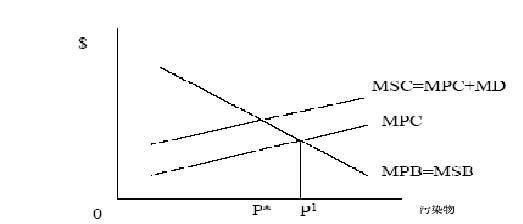
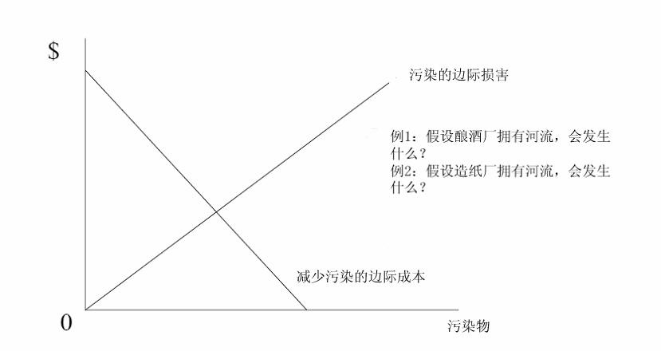

         xml

               user

               第17课.doc

         2005-10-12T11:25:28+08:00

         pdfFactory Pro www.fineprint.com.cn

         pdfFactory Pro 2.30 (Windows XP Professional Chinese)

# 14.23 政府产业规制

# 

麻省理工学院 &amp;剑桥大学

## 概述 

## 

- 	社会规制导论 

- 	风险评估 

- 	上一章回顾 

- 	外部性 

- 	潜在补偿 

- 	科斯定理(Coase theorem) 

- 	公共产品

- 社会规制的背景 

- 	社会规制的动机是修正市场失灵。 

- 	我们讨论的社会规制涉及健康、安全、环境以及公共产品（知识产权）的规制。 

- 	与经济规制不同,社会规制不会得到缓解。 

-  	20世纪 70年代以前，美国不存在如此多的社会规制。 

- 	社会规制的成本和效益更加难以确定。在某种意义上，社会规制比经济规制更复杂、难度更高。 

- 	如何实现社会利益最大化将更难测定(例如：关于汽车安全带的法律，披露机制等)。

- 基本动机 

- 	许多社会规制的确大大降低了重大事故的发生率，例如安全带的佩带降低交通事故发生率，污染减少 (标准污染物和有毒污染物 )，工作场所危险，营养成分的标明。 

- 	注意：实际上，风险并不能真正的被消除。因为许多风险极小，并且消除这些风险的代价是高昂的。 

- 	注意：对影响生活品质的社会产品的关注随着收入(后物质主义下的高弹性收

入)递增。当我们变得更富有时，我们需要更多安全措施来应对健康水平降低的风险。

- 	法律确定规制机构的权限。 

- 	规制机构规制权限是有限的。 

- ——例如，明确禁止美国环保署（EPA）和职业健康与安全管理(OSHA)的基于成本收益分析进行分析的规制。为什么？ 

- 	美国的执行机构往往忽视这样的禁令：——福特政府要求评价规制的成本和通货膨胀的影响。——卡特政府也要求评价规制的成本效益。——即使成本效益分析法禁止用于规制条例的制定过程，管理与预算办公室 

(OMB)也要求通过这个方法进行分析。

- 	当 MC（边际成本）=MB（边际收益）时，实现净收益最大化？为什么？ 

- 	这意味着边际成本与平均成本之间存在差异。 

- 	注意：边际成本的范围大于平均成本。

规制程度标准水平生命的平均成本生命的边际成本（毫克/立方米）（百万美元）（百万美元）

资料来源：Viscusi（1983）

- 	异质性 

- ——成本随着技术或财富的变化而变化，使得政策的一致性实施变得复杂。例子？ 

- 	贴现 ——如何解释将来发生的费用？使用哪个贴现率？ 

- 	认知的非理性和偏见 ——高估低风险 ——低估高风险 

- 	构造效应（Framing Effects） 

——关键因素(心理认知)：相对于通过支付来规避风险，人们更愿意接受对风险的补偿。

•	不确定性 ——怎样处理对未来收益的不确定性？如果不知道这种不确定性，结果

会怎样？ ——在这种情况下，保守主义通常不是最好的策略。 ——艾尔斯伯格悖论(Ellsberg Paradox) 

l两袋球：袋Ⅰ蓝球和红球各占一半；袋Ⅱ红球或蓝球数不确定。你须先猜出颜色，然后再取出来，猜对了有奖。你将先猜哪袋？如果游戏被重复结果怎样？该理论如何应用于全球变暖的分

析？

•	政治因素： 

——美国政治对社会规制的影响。为什么这种影响在别国比较小？ ——对环境保护的表决 

l收入，霜冻地带（+ve—显著正效应）收入增长（-ve—显著负

- l联邦的耗煤量，露天矿的开采(-ve)。 

- l地下煤矿群，环境规划 (+ve)。 

- l通过控制各种环境指标来弥补。

- 外部性和公共产品 

- 生命的价值 

- 环境规制和手段选择 

- 清新空气的国内市场 

- 温室气体的国际市场 

- 工作场所的安全 

- 医药制品的规制 

- 因特网和拷贝

- 	当一个人从事一种影响旁观者福利，而对这种影响既不付报酬又得不到报酬的活动时就产生外部性（ externality）。外部性在市场上没有价格。 

- 	结论：存在外部性的市场即使完全竞争也不再有效率。为什么？ 

- 	例子：一个以固定的边际成本 MC=2美元/ 千瓦小时发电的发电厂。但是假设该发电厂会排放威胁环境的酸雨污染物（矿物燃烧后生成的硫氧

（社会） （私人）

化物）。边际成本=边际成本+ 边际损害 

•	在这种情况下，我们获得的电力是减少了还是增加了。

MPB=私人边际收益；MSB=社会边际收益 MPC=私人边际成本；MSC=社会边际收益；MD=边际破坏（marginal damage）

外部性的解决办法 

- 1．完成禁止

- (遵从问题)（例如：氯氟碳类物—CFCs）？ 

- 命令和控制（例如：核辐射） 

- 税收和补贴（例如：垃圾掩埋场） 

- 创造产权（例如：硫化物市场） 

- 5．直接控制

- /国家所有 

- 道义劝告

- 	只要明晰界定产权，且独立于产权的最初分配，那么只要交易成本为零（并且没有财富效应）人们就能在自我利益最大化原则下协商而实现最优分配。 

- 	在一系列的严格假设条件下，根据科斯定理，政府没必要干预市场，因为人们能通过交换使社会效率最大化。

例子：上游的造纸厂和下游的酿酒厂

科斯定理在实践中的运用 

- 	从效率的观点来看，如果没有收入效应谁拥有产权并不重要？ 

- 	这是一种关于“分配”的观点？为什么？ 

- 	但是我们需要知道： ——交易费用不为零 ——小的受害者有搭便车问题——政府代表自己的利益时可能不知道如何做出决定 ——信息不对称：污染环境者比受害者信息充分 ——在寻求损害赔偿中存在机会主义 

- 	运用科斯定理的情况： ——重要的私人信息——政府不易获得信息 ——对自愿的私人控制没有障碍 ——相关主体容易确认

例子 

l

造纸厂：πm=6m－0.5m2 

- 	酿酒厂：πb=6b-0.5b2-0.5bm 

-  	m=造纸厂的产量,b=酿酒厂的产量。 

- 	无规制下的均衡（首先解决 πm）： 

-  	m=6,b=3, πm=18, πb=4.5, πtotal=22.5。 

- 	社会效益最大化（共同利润最大化） 

-  	m=b=4, πm=16, πb=8, πtotal=24。

解决方法 

- 一次性罚款，如果 πm比 18小将不会产生任何影响。 

- 特殊损害：如果纸厂被罚款 0.5bm？结果如何？ 

- 3.	假设罚款

- =损害（对受害者一次性赔偿的），会发生什么？ 

- 污染税等于每百万单位纸张产生的边际损害 0.5b。

公共物品 

- 	一个真正的公共品具有两种特性： ——非排它性（MC=0） ——非竞争性的（不运用在消费方面） ——供应方面（例如：清洁的空气）的搭便车问题 

- l供应的最佳水平：个体需求相加得到总需求。 

- l支付方式影响支付意愿的表达方式。

<Table>
<TR>
<TH>Ⅱ Ⅰ</TH>
<TH>垂钓少量</TH>
<TH>垂钓大量</TH>
</TR>
<TR>
<TD>垂钓少量 </TD>
<TD>(10,10) </TD>
<TD>(2,12) </TD>
</TR>
<TR>
<TD>垂钓大量 </TD>
<TD>(12,2) </TD>
<TD>(5,5) </TD>
</TR>
</Table>

（X，Y）：X=国家Ⅰ的收获, Y=国家Ⅱ的收获。数字越高对本国越有利。

- 	政府供应。但政府如何决定生产公共物品？ 

- 	本地政府能够更好地理解本地公共产品的需求倾向？ 

- 	中位选举人定理：假定人们有单峰偏好和一维政策选择，中位选举人的偏好就代表了大多数人的偏好。我们仍有帕累托原理（P）、不相关选择的独立性原理（I）、无专权原理（D），（源于阿罗不可能定理(Arrow's impossibility theorem)。 

- 	表明在不同消费层次上的简单投票将导致代表最高支出水平的中位投票者的选择占主导地位，这种情况仍然满足 (P，I 和 D)。民主会给出正确的答案！

- 结论 

- 	社会规制是关于外部性和公共物品的规制。 

- 	死亡的风险价值和生命价值是难于测量的，正是这些难题困挠着社会规制。 

- 	有效的社会规制的确存在，但这是复杂的和少见的。 

- 	我们在以后的课程中分析近期运用税收和许可证的例子和建议。

- 下一课 

- l生命的价值 

- l相关阅读资料：VVH第 20章
