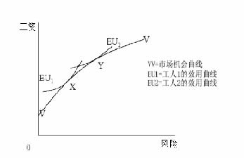

         xml

               user

               第18课.doc

         2005-10-12T11:26:33+08:00

         pdfFactory Pro www.fineprint.com.cn

         pdfFactory Pro 2.30 (Windows XP Professional Chinese)

## 14.23 政府产业规制

## 

### 第 18课非市场物品的评价

麻省理工学院 &amp;剑桥大学

## 概述 

## 

- 	非市场物品 

- 	支付意愿和选择手段 

- 	家用产品分析——烟雾报警器 

- 	工资市场分析 

- 	意愿调查价值评估法——洛杉矶（LA）的环境污染 

- 	与规制的联系

- 论点 

- 	我们需要通过成本收益分析法评价非市场物品吗？为什么？ 

- 	价值的来源：

EPA和 OSHA 

- 	管理当局应该制定评估环境舒适性的标准。 

- 	在政策的成本收益分析中应该包括非市场物品的价值评估吗？ 

- 	如何对没有市场价值的物品进行评估？ 

- 	使用价值和非使用价值的区别（哪个在以前的目录里出现过?）。 

- 	美国环保署（EPA）和职业安全和卫生条例（管理局）（OSHA）被明确禁止进行成本收益分析，为什么？在缺乏成本效益分析（CBA）的情况下，其行为将受到怎样的限制? 

- 	支付意愿法应运用于评价非市场物品。这为什么与消费者理论一致？ 

- 	其它可选方法 ——人力资本法 ——直接成本法 

- 	我们通过支付意愿法、人力资本法或直接成本法评估生命的价值时会有什么不同？

- 评价支付意愿法 

- 	揭示偏好法——家用产品分析(烟雾报警器等家用设备的购买) ——内涵价格法（对房价和工资的影响) 

- 	说明偏好——支付意愿分析，例子：对抑制风险的支付意愿调查 

- 	实验分析 ——揭示偏好法和支付意愿法的结合(对烟雾报警器的支付意愿的分析 ) 

- 	研究市场对于无形产品的替代品或互补品的需求量以此推断出市场对无形产品的需求。 

- 	例子： ——旅馆：旅行费用模型。旅行费用体现了成本。 ——避开行为模型：设备的成本可反应出对无形产品的支付意愿——烟雾报

警器？

•	假定： 

——存在能生产各档次无形产品的完整的间接市场。 ——准确识别已知的连续生产函数(知道市场产品的成本和由其带来的无形价值率) ——有使用价值。没有非使用价值，不是公共物品。

(克劳森 -尼奇) 

- 把一个给定的休闲娱乐场地的周围地区分成若干个区域，每个区域的游客的旅游费用不同。 

- 调查参观者来自哪个区域。 

- 统计参观者的区域分布。 

- 4.	发现成本

- /按区域访问，成本 =英里数*成本/英里数+时间的机会成本*到旅游目的地的时间。 

- 假设成本随着价格的增长而增长(一一对应关系) 。 

- 6.	旅行费用

- /旅游率。 

- 7.	旅行费用

- /旅行人数

- 	假定一年共有 1000个参观者对 A、B、C、D和 E五个不同的地区进行参观。 ——A=400， B=300，C=200，D=100，E=0。 

- 	从每个旅游区到目的地的成本包括旅游的时间机会成本： ——A=25,B=50,C=75,D=100,E=125。 ——从数据中可以看出，每年访问量和费用成反比。 

——随着时间变化旅行费用随着价格增长。得到各区域的需求曲线。 ——个体需求曲线相加得到总的支付函数。——支付意愿在需求曲线以下的区域。

•	假设需求是线型的、没有进入费用、各区域人口数相等、收入效应小和对

各区域的偏好相同、无重复参观现象、每次参观的时间一定、没有拥挤等等

烟雾报警器和生命的价值 

(达迪斯，1980年) 

- 	一定是自愿购买，为什么？ 

- 	假定对死亡风险改变的边际支付意愿等于设备风险的变动成本。 

- 	花费=死亡率的变化*生命的价值(假定损害为零)。 

- 	成本估计：在 1974年，一个烟雾报警器的价格是 52美元（报警器折旧率为 10%），加上电池的年花费 7美元，得到其的年均成本为 21.37美元。

烟雾报警器和生命的价值 

(达迪斯，1980年) 

- 	火灾的死亡率：6492个家庭/74000000个家庭 

- 	安装报警器后死亡率将减少 45% 

- 	报警器正常工作的概率为 0.8。 

- 	安装报警器后总风险将减少 0.0000315。 

- 	生命的价值=成本/死亡率的变化 = 21.37/0.0000315=676，266美元 

- 	这对规制和揭示偏好法意味着什么呢？

- 	研究产品的价值怎样随其无形特征变化而变化，从而估计其支付意愿。 

- 	如果你能辨别产品的差异性，你就能使用内涵价格法。 

- 	通过研究有形产品价格随无形特征变化的情况，获得对无形价值的边际支付意愿。然后研究无形价值与 MWTP和无形价值与满足无形价值需求的收入水平之间的关系。

- 	不包括非使用价值。 

- 	如果你只是了解了价格和特性，那么你就面临一个需要这一功能鉴定的潜在的识别问题。

内涵价格法——生命的价值

内涵价格法

——生命的价值 

l我们能通过工资和工作风险系数估计生命的价值：

n	n 

年收入 =α+β1年死亡风险 +� γi个人特性 i +� ψi工作特性+εi 

i=1 	i=1 

-  	β1=该情况下生命的价值。为什么？ 

- 	在一系列的研究中，价值在一百万美元和六百万美元之间变化。 

- 	在回归分析中重要的变量是什么，为什么？

- 意愿调查价值评估法 

- 	能通过一次分析调查得到支付意愿（WTP），了解人们规避风险的支付水平。如果人们愿意支付 500美元来减少 1%的死亡风险，那么这就是他们的边际支付意愿。 

- 	这要求假设的条件能实现。为什么这将是个问题？ 

- 	能通过这种方法得到非使用价值吗(例如蓝鲸)？ 

- 	问题是计算误差、不一致性、构造效应和“合理”效应（sounds reasonable effects）要影响结果。例如：英国安全调查的例子。

——洛杉矶的环境污染 

-  	1982年的洛杉矶关注空气的质量并努力通过有形的测定方法测定人们对优质的空气的支付意愿。 

- 	图 3显示了低质、中质和高质的空气。 

- 	边际支付意愿在不同条件下怎么变化？ 

- 	从收入数据中发现人们愿意支付 5.55~28.18美元来改变空气质量。 

- 	有多种方法对损害进行鉴定。 

- 	在这种特殊情况下怎么运用另一种对支付意愿的测量法？

- 规制 

- 	规制机构使用一致的生命价值标准吗？ 

- 	生命价值是可以存储的吗？不同的人和不同的生命期间会有不同的生命价值吗？ 

- 	美国环保署的例子。单位生命的最大价值是十亿… 

- 	为什么未表现出一致性？ 

- 	事实上是在许多情况下生命价值太高。但是在任何给定时期内，这种分析仍然可以确定 EPA预算的成本效率及其预算优先权

- 风险-风险分析 

- 	风险分析就是对规制的不作为和规制的作为之间的风险进行对比。 

- 	因为规制包括经济成本和隐含于抵消规制收益的理论价值中的预算成本，所以需要确定政府支出对人们的影响。 

- 	社会规制使社会更加贫穷，五千万美元的支出将导致一个生命的统计损失。 

- 	交叉效应（CROSS-EFFECT），规制可能引起需求向更高风险部门转移。例如，英国的哈特菲尔德碰撞事故。

- 结论 

- 	计算非市场物品价值时使用了支付意愿法。 

- 	有多种方法计算支付意愿。 

- 	时间和地点的敏感性导致互相矛盾的结果的增加。 

- 	但是他们的目的是做出决策。 

- 	事实表明他们对风险了解得越多，他们越可能对非市场产品做出一致的支付意愿。

- 下一课 

- l环境规制导论 

- l相关阅读资料：VVH第 21章
