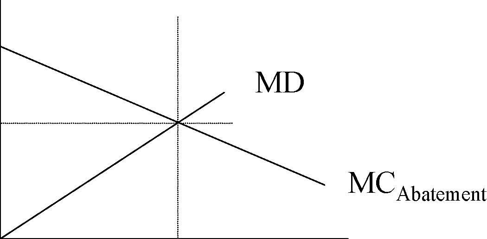
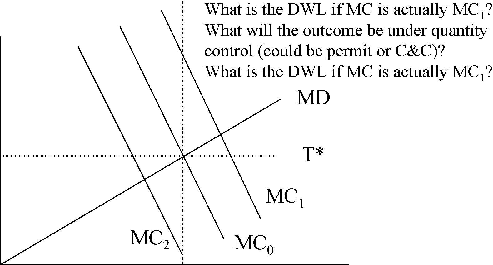
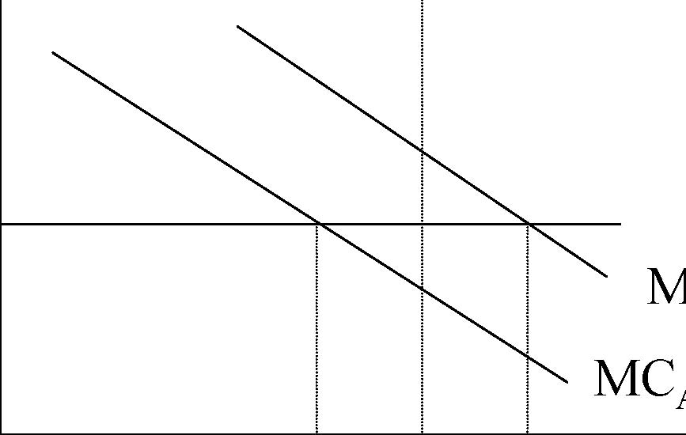

         Acrobat Distiller 5.0.5 (Windows)

         2003-07-28T02:16:02Z

         2003-08-11T12:43:54+05:30

         2003-08-11T12:43:54+05:30

         PScript5.dll Version 5.2

         xml

               bersara

               Microsoft PowerPoint - 14.23 Class19.ppt

# 14.23 Government Regulation of Industry

Class 19: Environmental Regulation

## MIT &amp; University of Cambridge

1

# Outline 

-  Basic Regulatory Instruments 

-  Equivalence of instruments 

-  Taxes vs Targets 

-  Taxes vs Subsidies 

-  Multiple source regulation and Permits 

-  EPA and US emissions regulation 

-  The Future of market mechanisms 

2

# Basic Regulatory Instruments 

-  Basic regulatory instruments 

-  Command and Control 

-  Economic Incentives 

-  Taxes (fees) 

-  Subsidies 

-  Liability 

-  Permits 

-  Complications: 

-  Space and time 

-  Uncertainty 

-  Efficiency vs cost effectiveness 

-  Ambient differentiated vs emission differentiated regulation

3 

# Coase Bargaining Game 

-  Illustrates the role of distribution in getting the efficient outcome: 

-  Basic example: company produces effluent which pollutes river: 

-  Primary treatment of effluent = $100 (to company) 

-  Water purification costs = $300 (to citizens) 

-  Environmental damage = $500 (to citizens) 

- 	Victim assigned rights. Maximum offer by company = $100, this does not compensate victim, therefore he refuses to accept and company installs treatment equipment. 

- 	Polluter assigned rights. Maximum offer by citizens = $300, minimum offer acceptable to company = $100, therefore company gets $100 + $100 under symmetric bargaining. 

-  Outcome the same in both cases but distribution of benefits very 

different. Who prefers what? 

4 

# Command and Control

- 	Regulator specifies steps individual polluters must take. This can involve specifying maximum pollution rate from each Source (e.g. a smoke stack). EPA does this and tells industry what technologies meet standard. 

-  This may be efficient if EPA has good information. 

- 	Often it is combined with significant fines for non-compliance. Why would this have to be the case? 

- 	Pros: certainty of outcome and simple monitoring and enforcement. 

- 	Cons: No incentive to innovate, does not equalise marginal abatement costs (equi-marginal principle), not full internalisation. 5 

# Economic Incentives

- 	Fees or Pigouvian taxes/subsidies (represent a MD cost and can be set equal to marginal abatement cost). 

- 	Permits: buy and sell the right to pollute. Trading induces a price on the permit which then means the firm faces a MD cost). 

- 	Liability: make firm liability for the environmental damage imposed by its actions e.g. in using producing hazardous waste. This gives firm incentive to reduce this. 

6

# Economic Incentives

- 	Pros: incentives to innovate, polluter pays, equi-marginal principle is satisfied. 

- 	Cons: do not handle time and space variation very well, hard to adjust over time to inflation or new information, leads to large transfers of wealth which creates political problems. 

•Also: 

-  Uncertainty about position of MC and MD functions mean that market solutions mean that outturn level of cost/quantity may be vary variable. Do we care? 

-  Easy to regulate emissions but actually we only care about ambient air quality. The link is site specific. 7 

# Equivalence of different instruments

-  It is possible to achieve the same outcome 

via tax, subsidy, permits, liability or 

## command and control. How? $ 

MD MCAbatement 

0 P* Pollution 8

# Taxes vs Quantity Control

What will the outcome be under tax?

$

MD MC0 MC1 MC2 What is the DWL if MC is actually MC1? What will the outcome be under quantity control (could be permit or C&amp;C)? What is the DWL if MC is actually MC1? T* 

0 P* Pollution

9

# Taxes vs Subsidies 

-  In the short run these can be equivalent. 

-  Tax: 

-  e=ay (fixed pollution proportion) 

-  TC(y,e) =VC(y,e)+te+FC 

-  TC(y,ay) =VC(y,ay)+tay+FC 

-  MC(y)=MVC(y)+at: tax raises MC. 

-  Subsidy: 

-  TC(y)=VC(y)+FC-s(eu-e): eu=unregulated level of e 

-  TC(y)=VC(y)+say+FC-seu 

-  MC(y)=MVC(y)+sa: so if s=t we get same outcome. 

10

# Taxes vs Subsidies

- 	In the short run there are no entry effects but in the long run you have altered the total cost of production so there are entry effects. 

-  AVC is effected by subsidy. 

- 	AVC has fallen by seu/y since you only get this if you have y&gt;0. 

- 	This implies that some unprofitable firms continue operating as LRATC has fallen. This means more firms and lower prices than without subsidy. 

11

# Multiple Pollution Source Regulation

$

MD

MCB

MCA

0 Pollution

S

What is the cost of setting a common standard for A and B relative to either a taxation system or a permit system? 

12

# Environmental Regulation in the US 

- 	Motivation: Up until 1970, there was no co-ordination or national standards for environmental quality. In 1970, the US EPA was formed to oversee and develop national standards for environmental policy. Since then, the cost of regulation have grown to be approximately 1-2% of GDP. 

-  EPA’s mandate was to: 

- 	a) determine national uniform standards for environmental quality without regard for costs: meant to protect human health as a primary standard 

-  b) determine technology based standards 

- 	c) protect other aspects of human welfare (eg. Buildings, crops, etc.) as a secondary standard AND set strict car emissions standards. 

- 	EPA sets standards. States must come up with SIPS stating how they will meet those standards. Local and regional agencies must report to the states. 

13 

Environmental Regulation in the US

- 	Enforcement: EPA can withhold federal monies targeted for a state if a state does not comply. Can also prevent construction of new major pollution sites or major renovations of existing sources. 

- 	Background: EPA was formed on July 9, 1970 and was formed from various parts of other pre-existing departments: Department of the Interior, Health, Education and Welfare; Agriculture; the Atomic Energy Commission; the Federal Radiation Council, and the Council on Environmental Quality. 

- 	Distinctiveness: EPA’s mandate is to deal with externalities as opposed to regulating a natural monopoly. Also, instead of having authority over a single industry, its authority is over a number of different industries. 

14

## EPA Concerns

- 1. Status Quo Bias: It is hard to implement policies that move away from the already existing legal or political output. 

- 2. Location Bias: Pollution problems can be very site specific because of geography, population, industries. 

- 3. Localized Enforcement: Taxes and standards aren’t generally less of a problem here because local authorities LIKE collecting money. But variation in enforcement can be a big problem. 

- 4. Uncertainty: costs and benefits can be quite elusive. Optimal control mechanism depends on where uncertainty lies. 

- 5. Inflation: This is particularly problematic for taxes/fees. Fees are hard to change and are NOT indexed. 

- 6. Grandfathering: This protects existing plants. Why? 

- 7. Economic Growth Effects: is growth inhibited by regulation? 15 

## Air Pollution Regulation in the US 

- 	Definition: Stationary Sources: sources of pollution that are NOT mobile. Smoke stacks, chimneys, etc. 

- 	Approximately 27,000 MAJOR stationary sources of air pollution regulated by the EPA in the US (usually denoted by emitting &gt;100 tons of a listed pollutant per year). 

- 	Worried about environmental deterioration of (1) surface air (troposphere) which can be local or regional pollution or (2) upper atmosphere (stratosphere) where we think of global air pollution. 

- 	Pollution emissions can occur on either a continuous or intermittent basis (eg power plants vrs. cars). Should policy be “constant” or intermittent? 

-  Complicated relationship between emissions and air quality. 

-  If we’re dealing with LOCALIZED pollutants, why not just have

16

it under state/local jurisdiction? 

## 1970 Clean Air Act (CAA) 

-  Distinguished two types of pollutants 

- 	1. Criteria (or conventional) pollutants: relatively common, presumed dangerous only in high concentrations; often have natural sources: SO2, CO, NOx, lead, ozone (NOx + hydrocarbons: low lying is bad and too little up in the upper atmosphere is bad), TSPs. 

- 	2. Hazardous pollutants (will not deal with here...threshold effect problems...) 

- 	For each criteria pollutant, the CAA established AMBIENT air quality standards (NAAQS) which gave the maximum allowable concentration in a local area (averaged over a specified time period: short and long) 

- 	States were supposed to come up with SIPS to give timetable for reaching standards by the mid 1970s, but by 1975, it was clear that many weren’t going to make it so the deadline was extended to 1982 and 1987 for CO and ozone. California’s South Coast Air Basin is still trying... 

17

## 1977 Revisions to CAA

- 	Urban areas are so much dirtier than rural areas...and rural areas are getting dirtier. Since urban areas dirtier, you get higher levels of regulation which caused plants to move to cleaner, less regulated areas... so: Sierra Club sues that EPA isn’t meeting its mandate of keeping clean areas clean so we get: 

-  PSD regions: to keep clean areas clean and 

- 	Non-attainment regions: regions that fail to meet the standards have federal regs imposed 

- 	PSD: new sources under best available control technology. Existing sources nothing. Maximum area increase limit set. Not allowed to exceed even if cleaner than NAAQS. 

18

# 1977 Revisions to CAA

- 	Non-attainment: permit program for new construction/major renovations only allowed if won’t slow down the meeting of standard, new sources must put in lowest achievable emissions rate (LAER) technology. Existing sources must install RACT (reasonably available control tech). 

- 	NSPS (new source) is supposed to be based on the best technological system: meant to serve as a FLOOR for LAER and BACT regulations and affects all new sources. 

- 	Congress established a NON-COMPLIANCE penalty: any economic gain received by a source due to its non-compliance along w/ a penalty by the EPA will go to the EPA. (This led to a 30-40% cut in delays for compliance!) 

-  NOTE: existing sources regulated by states. 

19

## Efficiency Issues 

- 	1. Are standards set at an efficient level? Probably not because of lack of CBA. 

- 	2. Uniformity of standards: doesn’t take into account difference in population density, local meteorological conditions, local costs of compliance. 

- 	3. Timing of emissions flows: primary standards are usually long term annual standards. But it’s really the SHORT TERM flows that determine cost (that’s what’s hard to meet for industry) and are probably more important in terms of health? 

- 	4. Why does the EPA hold stricter standards for new sources? And what are the consequences of doing this? 

20

# Hahn (1989) on the use of Market Mechanisms

- 	Conclusions from four early experiments with market mechanisms: 

-  Taxes too low to illicit much change in output. 

-  Trading too thin in permit markets. 

-  However some positive experience esp. the US lead trading program 1982-1987. 

- 	Reasons to think that use of these mechanisms might increase: 

-  Marginal costs of abatement will rise over time. 

-  Demonstration effects positive. 

-  Monitoring and enforcement costs likely to fall over time.

21 

# Conclusion

- 	There are a number of economic instruments that economists might recommend to regulate environmental externalities. 

•	Market based mechanisms – taxes and permits – are good for innovation and for equi-marginality. They can be allowing the meeting of environmental targets at least cost. 

- 	As measurement becomes more sophisticated and cheaper more sophisticated market arrangements can be put in place (e.g. time of day trading). 

-  However significant issues of distribution of 

22

benefits remain. Who pays is an important issue.

# Next

-  Markets for Clean Air 

- 	Read: Joskow, P.L., Schmalensee, R. and Bailey, E.M. (1998), ‘The Market for Sulfur Dioxide Emissions’, American Economic Review, Vol.88 (September), pp.669-85. 

23
