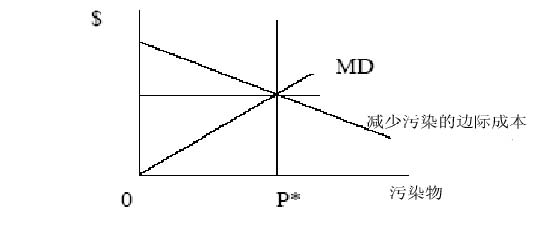
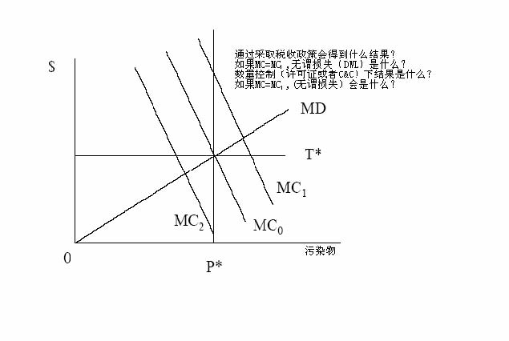
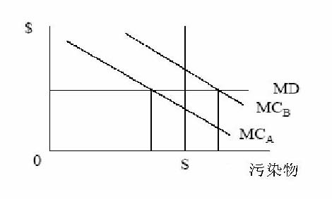

         xml

               user

               第19课.doc

         2005-10-12T11:27:30+08:00

         pdfFactory Pro www.fineprint.com.cn

         pdfFactory Pro 2.30 (Windows XP Professional Chinese)

# 1 4.2 3 政府产业规制

# 

麻省理工学院 &amp;剑桥大学

## 概论 

- 	基本的规制手段 

- 	等效的规制手段 

- 	税收和目标 

- 	税收和补贴 

- 	复合污染源的规制和许可证 

- 	美国环保署（EPA）和美国的污染物规制 

- 	市场机制的未来

- 基本规制手段 

- 	基本规制手段 

- 	税收 

- 	补贴 

- 	责任 

- 	许可证 

•	复杂性 ——空间和时间 ——不确定性 

作为谈判博弈的科斯定理 

- 	说明在有效的结论中所担当的角色： 

- 	基本的例子：公司排放污水 ——对公司来说，污水处理的主要费用是 100美元 ——对市民来说，水的净化费是 300美元

- ——对市民来说，环境损害的价值是 500 美元 

- 	拥有产权的污染受害者。公司的最高出价是 100美元，出价不包括对受害者的补偿，因此受害者拒绝接受，公司只好安装污水处理设备。 

- 	拥有产权的污染者。市民的最高出价是 300美元，公司可接受的底价是 100美元，因此，公司在谈判力量均等的情况下得到 100+100美元 

- 	两种情况下结果相同，但花费不同。哪种更优？

- 命令和控制政策 

- 	管理者规定污染者必须采取措施。这些措施包括制定每个污染源的最大排污率(例如一组烟囱 )。美国环保署（ EPA）制定工业技术标准并监督污染者达到这个标准。 

- 	如果美国环保署能获得有效的充分多的信息，将使规制有效率。 

- 	对违规行为要进行重罚。为什么？ 

- 	正方：结果的确定性和简单的监控和实施。 

- 	反方：没有创新激励机制。不等于减少污染的边际成本，这个结果并不令人乐观。

- 经济激励 

- 	费用或者庇古税（Pigouvian taxes）/补贴，其代表边际损害成本并且假定其等于减少污染的边际成本。 

- 	许可证：买卖排放污染的权利。市场使许可证具有了价格，也使公司面对边际损害成本。 

- 	责任：通过采取行动使公司认识到对环境污染负有责任。例如，使用排放的污染废弃物。这给了公司降低污染的激励。

- 经济激励 

- 	正方：创新的激励，污染者付费和满足边际相等原则。 

- 	反方：不能处理好时间和空间的变化。难于对通货膨胀或者新情况做出及时的调整。大量财富转移引起政治问题。

- l而且 

——边际损害和边际需求函数的不确定性意味着市场的成本和产量是变化的。我们注意到了吗？ ——规制污染物是容易的。但是实际上我们只注重环境空气质量。这个和地理位置有关。

l税收，补贴，许可证，责任或者命令控制可取得相同的效果。为什么？

- 	可以评估短期的效果。 

- 	税收： 

-  	e=ay（固定的污染比例） 

-  	TC(y,e)=VC(y,e) + te + FC 

-  	TC(y,ay)=VC(y,ay) + tay + FC 

-  	MC(y)=MVC + at：税收增加了 MC。 

- 	补贴： 

-  	TC(y)=VC(y) + FC-s(eu-e)：eu= 没有规制下的 e 

-  	TC(y)=VC(y) + say + FC -seu 

-  	MC(y)=MVC(y) + sa：如果 s=t 得到相同结果。

- 税收和补贴 

- 	从短期看没有进入效应。但从长期看，生产成本已经发生变化，所以存在进入效应。

- 	补贴影响平均可变成本（AVC）。 

- 	如果 y&gt;0，平均可变成本（AVC）下降 seu/y。 

- 	这表明随着长期平均总成本(LRATC)的下降一些非盈利机构将继续运作。这意味着有补贴时将有更多的公司进行运作，并促使价格降低。

设定一个与 A和 B相关的税收体系和许可证体系的成本是多少？

- l动机：1970年前没有关于环境质量的协调标准或国家标准。1970年美国美

- 国环保署（ EPA）成立，负责制定并且改进关于环境的国家标准。从那以后，规制费用大约占国内生产总值（GDP）的 1~2%。 

- 	美国环保署（EPA）的权限： 

- a) 	在不考虑成本的情况下确定关于人类健康的环境质量的国家统一标准： 

- b)确定技术标准 

- c) 	把对人类其它方面的福利（如：建筑物，庄稼……）保护作为次要标准，确定严格的汽车排放标准。 

- l美国环保署确定标准。其确定的标准必须符合州实施计划（SIPS）并说明

他们将怎样达到这些标准。地方和地区机构必须向联邦政府报告实施计划。

- 	实施：若联邦政府不遵守相关的规章制度，美国环保署可以不服从联邦政府的经济目标。同时，美国环保署也能禁止较大的新污染场所的建设或者要求对现有的污染源进行整修。 

- 	背景：1970年 7月 9日，美国环保署由以下部门合并成立：内务、健康、教育和福利部、农业部、原子能委员会、联邦辐射委员会和环境质量委员会。 

- 	区别性：美国环保署的任务是对自然垄断行业进行规制。此外，美国环保署是对整个行业进行规制，而并不是对单个行业进行规制。 

1、社会现状偏见：和现行的法律法规有异的法律和政策的很难被贯彻执行。 2、位置偏见：污染问题因地理、人口和产业的差异性而不同。 3、本地化：由于地方政府非常关注当地经济利益而会在一定程度上抵触，税收

和标准的制定将成为一个难题。但是在实施过程的不确定性也可能是个大的

难题。 4、不确定性：成本和收益的不确定性。最优控制机制取决于对不确认性的全面

认识和了解。 5、通货膨胀：将对税收或成本产生较大的影响。成本是固定的和非指数化的。 6、无偿分配（grandfather）：保护现有厂商吗？为什么？ 7、对经济增长的影响：规制抑制发展吗？

- 	定义：稳定的污染源：污染源是固定的。包括：一组烟囱和烟囱等等 

- 	在美国,美国环保署管制大约 27，000个主要的稳定空气污染源(通常指污染物&gt;100吨/年)。

- 	担心以下领域的环境恶化：1、本地或者地区的污染物可能引起表面空气(对流层)的质量恶化 2、全球范围的环境恶化：上层空气(平流层)的空气污染。 

- 	污染物连续排放或者间断性排放 (例如发电厂和小汽车)。那么，政策应该是保持一致性还是怎么？ 

- 	污染物和空气质量之间的复杂关系。 

- 	如果我们正处理本区域的污染物，那么，我们为什么不只在国家或本地规制制度下处理污染物？

- 空气净化法 (CAA) 

- 	区分两类污染物 

- 标准污染物或者传统污染物：假设这些污染物比较普遍，且只在高浓度情况下有危险。普遍存在于自然界中：二氧化硫，一氧化氮，氧化氮，铅，臭氧(氧化氮+ 烃：在下层空气中有害，而在上层空气中即使极少数也会产生危险)，TSPs（技术规格）。 

- 2.	危险污染物

- (不在这里讨论识阈效应) 

- 	对于不同的标准污染物，CAA制定了不同的环境空气质量标准(NAAQS)，并限定了当地的污物最大排放量 (超过特定时间段的平均量：短期和长期)。 

-  	20世纪 70年代中期以前，州政府通过 SIPS制定出各排污单位达到排污标准的时间表，但直到 1975年仍有很多厂商没有达到标准，因此期限被延迟至 1982年，而对 CO和臭氧的排放期限则延迟到 1987年。加州南岸地区也正

为使空气质量达到该标准而努力。

- 	城市的污染程度比农村严重。但随着时间的推移，农村的污染程度也会越来越严重。政府对污染比较严重的市区实施更加严厉的规制，这将使厂商将生产转移到更清洁，规制相对弱的地方。因此，西拉俱乐部（Sierra club）起诉美国环保署未履行使干净的地方保持干净的职能。

- 所以我们得到： 

- 	防止明显恶化地区（prevention of significant deterioration—PSD）：防止空气

- 质量好的地区的空气质量发生恶化。 

- 	未达标区：联邦对未能达到标准的地区强制执行规制。 

-  	PSD地区：在最优的可控技术条件下对新污染源进行控制。现有的污染源的污染度不大。在尽可能大的范围内增加限制。防止空气质量高于标准的地区的空气质量发生恶化，以至于逼近甚至超过标准。

- 对 CAA的修正 

- 	未达标区：如果不能达到排污标准，那么新建或扩建的污染源需面对新的许可证问题。新的污染源必须达到“可实现的最低排放速率”(Lowest achievable emission rate——LAER)。现有的污染源必须安装合理可得控制技(Reasonable available control technology——RACT)。 

- l新污染源实施标准（New source performance standard—— NSPS）应该基于最好的技术系统。即 NSPS的规制比 LAER和 RACT更严厉，将影响所有的排放物。 

- 	国会制定了违规惩罚条例。任何经济体排放的污染物没有遵循美国环保署的 W/A条例将会受到美国环保署的惩罚！任何经济体服从法规将使产量削减 30-40%！ 

- 	注意：政府对现有污染源的规制。

- 标准被定在有效的水平上吗？或许不是因为缺乏成本效益分析（CBA）。 

- 标准的一致性：不需考虑人口密度，当地气候条件和实施的当地成本的差别。 

- 排放物的扩散时间：通常主要标准是长期年度标准。实际上，排放物的短期扩散时间决定成本？也许短期排放物对健康的影响更大？工厂排放物难以在短期内扩散。 

- 为什么美国环保署对新污染源采取了更严格的标准？会产生什么样的结果？

（哈恩, 1989年） 

- 	从早期的四个关于市场机制运作的实验中得出如下结论 ——过低的税收无法禁止产量的大幅提升。 ——许可证市场的交易冷清。 ——但有一些积极的经验。特别是，美国制定了第 1982-1987贸易计划 

- 	市场机制作用增强的原因： ——随着时间的推移，减少污染的边际成本提高（减少排放物的边际成本随

- 	经济学家建议运用经济工具对环境的外部性进行规制 

- 	基于机制（税收和许可证）的市场有益于创新和均等化边际。可以以最低的成本达到环境目标。 

- 	当测量变得更复杂，更经济时，就可以实施更加复杂的市场设计 (例如日间交易) 。 

- 	收益的分配问题仍广泛存在。关键是由谁承担相关成本？

- 下一课 

- 	清洁空气的市场 

- 	相关阅读资料：Joskow, P.L, Schmalensee, R.和 Bailey, E.M. (1998), “二氧化硫市场”, 《美国经济评论》, 第 88卷 (九月),第 669~685页。
