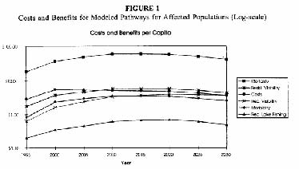
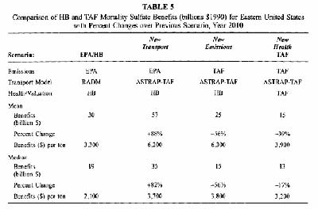
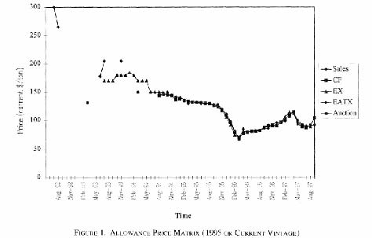
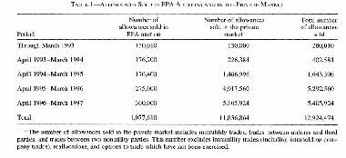
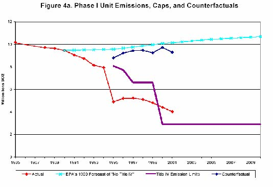
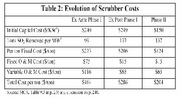
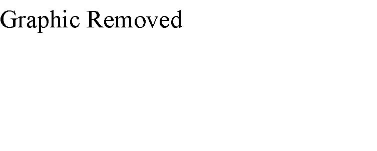

         Acrobat Distiller 5.0.5 (Windows)

         2003-07-28T02:17:03Z

         2003-11-25T10:42:43-05:00

         2003-11-25T10:42:43-05:00

         PScript5.dll Version 5.2

         xml

               bersara

               Microsoft PowerPoint - 14.23 Class20.ppt

# 14.23 Government Regulation of Industry

Class 20: Markets for Clean Air

MIT &amp; University of Cambridge

Outline 

-  Acid Rain and its Environmental Impact 

-  The US Acid Rain Program 

-  Basic Permit Trading Concepts 

-  Experience with the Market 

-  An evaluation of its impact 

-  The RECLAIM NOX Program in CA 

-  RECLAIM and the CA Electricity Crisis 

What are Acid Rain Pollutants?

- 	Primarily caused by SO2 and NOX emissions, significantly from power stations. 

- 	Classic Environmental Externality -why is the problem different in Europe vis US? 

-  Acid Rain affects: 

-  Respiratory Health (mortality and morbidity) 

-  Visibility (recreational and residential) 

-  Fishing (recreational) 3 

-  Also forests (e.g. in Germany) 

Damage Estimates (Burtraw et al., 1998)

Basic Permit Concepts

-  Cap and Trade 

-  Netting (within plant) 

-  Offsets (build new plant if local reduction) 

-  Bubble (within company) 

-  Banking (past emissions) 

-  Borrowing (against future emissions) 

US Clean Air Act Amendments of 1990 (CAAA)

- 	First Bush Administration implements tradeable permit approach to control emissions of SO2 from coal and oil burned in electric utility boilers (Title IV of CAAA). 

- 	Enacted 1990, covers period from 1995-1999 (Phase 1) and from 2000-(Phase 2). 

-  In Phase 1, largest 263 plants effected. 

- 	In Phase 2, virtually all electric generating units to be included. 

- 	Covered plants must have permits to cover their emissions in any given year or else substantial fines imposed. 

Organisation of Market for Permits

- 	Total no. of permits fixed indefinitely (constant beyond 2000), issued each year for 30 years ahead. Proposals exist for further emissions reduction. 

- 	Each new and existing generator allocated rights according to formula. 

- 	Around 2.8% of allocation held back to be auctioned in an annual revenue neutral auction (proceeds returned to generators) held by EPA. Auctions cover current year and 7 year ahead markets. 

- 	In addition EPA will auction additional privately submitted permits. The auctions are pay as bid. 

8 

-  Most trades are bilateral and outside this market. 

Concerns about the efficiency of the permit market

- 	There is a concern that incumbents may hoard permits and refuse to trade them. Why might they do this? 

- 	There is also concern that the auction may not be efficient. 

- 	Auction theory suggests that pay as bid auctions lead to under-pricing -why? 

-  Joskow et al. (1998) attempt to analyse 

efficiency of market. 

9 

Prices in the Market

Source: Joskow et al., 1998. 

Quantities traded in the market

Source: Joskow et al., 1998. 11

Effect of Trading System on Emissions

Source: Ellerman, 2003, http://web.mit.edu/ceepr/www/2003-003.pdf 12

Technological Benefits of the System

Evaluation of the savings from system over command and control

- 	Utilities are allowed to pass on costs under rate of return regulation, so not clear what incentives to switch to low sulphur use are before full generation market competition. 

- 	Some states allowed costs of cleaning up of dirty power stations with scrubbing equipment to protect local jobs in coal mining. 

- 	In the early years this may have led to higher costs than under command and control. 

- 	However estimation is that Phase 1 savings around $350m p.a. or around half the actual compliance costs.

14 

Why did quantities fall and prices stay low? (Ellerman, 2003)

- 	Emissions standards toughen substantially in 2000, why would companies wish to reduce their emissions below cap before this? 

- 	Fuel substitution at plant (compare with command and control approach to use of low sulfur coal?). 

- 	Scrubber cost effect (why might cost of scrubbers come down relative to command and control approach specifying scrubber technology?). 

-  Overall switching effects (=what?). 

Allocation of permits

- 	Why is it a good idea to allocate permits to incumbents? What are the disadvantages of doing this relative to an auction or tax system? 

- 	Allocation seems to have little effect on the gains from trade in this case. 

- 	How might this learning be relevant to potential carbon dioxide emissions trading arrangements? 16 

Lessons from US SO2 Cap and Trade Program

- 	Banking is a force for good and made use of by companies in a desirable way (good for environment and price spikes). 

- 	Voluntary response to incentives is extremely powerful and effective. 

- 	Property rights for air can be traded effectively with no cost to the environment (relative to command and control). 

-  Once markets are set in place easy to see how they 

can be tightened and extended. 

RECLAIM Program in CA 

- 	Regional Clean Air Incentives Market instituted in 1993 to target SO2 and NOX emission s in the South Coast Air Quality Management District. 

- 	Covers more sectors than national SO2 programme, but no banking allowed. 

- 	Number of NOX permits set from 1994. Until 1998 the number exceeded the demand, but in 1999 there was a significant fall in the allowed permits. 

- 	Price in 1999 was $1500-3000 per tonne of NOX, 2000 permits were $4300. 

Supply and Demand in CA electricity market

RECLAIM and the CA Electricity Crisis (Sweeney, 2002)

- 	Prices rise to $45000 per tonne NOX in first ten months of 2000. 

- 	For a typical base-gas generation plant, the amount of NOX produced is small (0.1 pounds per MWh). Even the rise to $45,000 increases the price per MWh by $2.25. Recall what was happening to CA prices. 

- 	However for old gas-fired turbines the numbers are 4 pounds NOx per MWh or $90 per MWh. This is significant for the equilibrium price. 

The case of AES

- 	The existence of NOX caps meant that in the absence of retro-fitting generators had effectively caps on their electricity generation. 

- 	Electricity generating company, AES, exceeds its limit by 600 tons in 2000. It is fined $17m or $28,000 a ton in addition to purchasing emissions credits to make up for loss, installing state of the art equipment on three of its units and deducting the amount from future 

21

allocations. Was it worth it? 

The future of RECLAIM 

- 	The scheme has now been called into question for its roll in driving up prices of electricity and electricity generators have returned to command and control emissions control. 

- 	However was the scheme to blame for the crisis? If not, why not? 

- 	How would you analyse whether it was giving bad incentives or not? 

- 	Note the marginal damage cost of NOX in CA is potentially high due to local condition (order $1000 

per ton elsewhere). 

Conclusions

- 	The Coase Theorem should work for SO2 and NOX once property rights are defined. Large market with multiple buyers and sellers, good monitoring and low transaction costs. 

- 	The experience with emissions trading regimes for SO2 and NOX has been encouraging in terms of efficiency in meeting politically defined quantity targets. 

- 	However they are potentially very costly (especially if we equalise MSC=MSB) and ultimately it will be consumers who pay. 

- 	Next Question: does this experience translate to greenhouse gas emissions reduction regimes? 

Next 

-  Markets for Carbon Dioxide 

- 	Read Chichilinsky, G. and Heal, G. (1993), ‘Global Environmental Risks’, Journal of Economic Perspectives, Vol.7, No.4 (Autumn, 1993), pp.65-86. 
