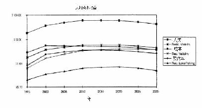
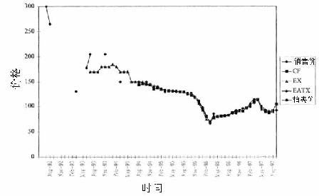

         xml

               user

               第20课.doc

         2005-10-12T11:28:17+08:00

         pdfFactory Pro www.fineprint.com.cn

         pdfFactory Pro 2.30 (Windows XP Professional Chinese)

## 1 4 .2 3政府产业规制

## 

第 20课：清新空气市场

麻省理工学院 &amp;剑桥大学

- 	酸雨和其对环境的影响 

- 	美国的“酸雨计划” 

- 	许可证交易的基本理论 

- 	市场经验 

- 	评价效用 

- 	加州地区的区域清新空气的激励市场计划(RECLAIM——Regional Clean Air Incentive Market,1993年)中关于 NOX的计划 

- 	区域清新空气的激励市场计划和加州的电力危机

- 酸雨污染物 

- 	主要由火电厂的二氧化硫（SO2）和氧化氮（NOX）排放物引起。 

- 	典型的环境外部性。欧洲的情况为什么和美国不同? 

- 	酸雨的影响： ——呼吸健康(死亡率和发病率) ——能见度(娱乐和居住) ——垂钓(娱乐) ——森林(德国) 

(Burtraw et al, 1998年) 

注：包括 SO2和 NOX 

表 Ⅵ

过去一段时间和 2010年间，美国东部地区 HB和 TAF的死亡率和硫化物收益率的百分比变化。

<Table>
<TR>
<TD>年</TD>

<TD>分 </TD>
<TD>EPA/HB </TD>
<TD>新的传播方式</TD>
<TD>新的排放物</TD>
<TD>新的健康 TAF</TD>
</TR>
<TR>
<TD>排</TD>
<TD>放</TD>
<TD>物 </TD>
<TD>EPA </TD>
<TD>EPA </TD>
<TD>TAF </TD>
<TD>TAF </TD>
</TR>
<TR>
<TD>传播方式 </TD>
<TD>ASTRAP-TAF </TD>
<TD>ASTRAP-TAF </TD>
<TD>ASTRAP-TAF </TD>
<TD>ASTRAP-TAF </TD>
</TR>
<TR>
<TD>健康/评价 </TD>
<TD>H B </TD>
<TD>H B </TD>
<TD>H B </TD>
<TD>H B </TD>
</TR>
<TR>
<TD>平均数收益 (百万$) </TD>
<TD>30 </TD>
<TD>57 </TD>
<TD>25 </TD>
<TD>15 </TD>
</TR>
<TR>
<TD>百分变化数</TD>

<TD>＋88% </TD>
<TD>-56% </TD>
<TD>-39% </TD>
</TR>
<TR>
<TD>每吨的收益（$） </TD>
<TD>3,300 </TD>
<TD>6,200 </TD>
<TD>6,300 </TD>
<TD>3,900 </TD>
</TR>
<TR>
<TD>收益(百万$) </TD>
<TD>19 </TD>
<TD>35 </TD>
<TD>15 </TD>
<TD>13 </TD>
</TR>
<TR>
<TD>百分变化数</TD>

<TD>＋82% </TD>
<TD>-56% </TD>
<TD>-17% </TD>
</TR>
<TR>
<TD>每吨的收益（$） </TD>
<TD>2,100 </TD>
<TD>3,700 </TD>
<TD>3,800 </TD>
<TD>3,200 </TD>
</TR>
</Table>

资料来源：Burtraw et al.(1998) 

许可证的基本概念 

- l总量控制和交易政策 

- l容量节余政策(厂区内) 

- l补偿政策(若该地区排污量减少，可新建污染源) 

- l气泡政策(工厂间) 

- l银行—储备富余排污权

•	预支未来排污权

美国 1990年的《清洁空气法》修正案（ CAAA） 

- 	首先，布什政府实施了大型煤动力及石油动力的电力企业的 SO2(酸雨的主要成分)排污许可证的交易(CAAA第 IV章) 。 

-  	1990年制定的法规涉及第一阶段 (1995年〜1999年)和第二阶段 (2000年至

- 今)。 

- 	在第一阶段， 263家大型企业受到影响。 

- 	在第二阶段，所有电力企业受到影响。 

- 	在任一年度，所有企业都必须获得排污许可证，否则将会受到处罚。

- 许可证市场构成 

- 	未来 30年内,每年发行的许可证数量并不确定(一般超过 2000个)。许可证的存在进一步减少污染物的排放。 

- 	根据规章，每个新建和已建的电力厂商有权分配排污权。 

- 	美国环保署每年大约保留2.8%的排污许可证来进行拍卖，所得收益用来奖励发电商。拍卖的许可证包括本年度和未来7年内的许可证。 

- 	美国环保署拍卖的许可证的另一个来源是私人持有者提供的许可证。拍卖是通过竞价拍卖来进行的。 

- 	大多数交易是在场外进行的双边交易。

- 许可证市场效率 

- 	在位厂商可能储备许可证并拒绝对其进行交易，为什么？ 

- 	拍卖可能没有效率。 

- 	拍卖理论认为竞价拍卖的价格低于定价，为什么？ 

-  	Joskow et al(1998年)试图分析市场效率。

图 1价格矩阵（1995或者当年）资料来源：Joskow et al，1998年

市场交易量

表 Ⅰ 

EPA拍卖的和私人市场交易的许可证量

<Table>
<TR>
<TH>时</TH>
<TH>期 </TH>
<TH>E P A 拍卖</TH>
<TH>私人交易</TH>
<TH>总</TH>
<TH>数 </TH>
</TR>
<TR>
<TH>1993年 3月间 1993年 4月〜1994年 3月 1994年 4月〜1995年 3月 1995年 4月〜1996年 3月 1996年 4月〜1997年 3月 </TH>
<TD>150,010 176,200 176,400 275,000 300,000 </TD>
<TD>130,000 226,384 1,466,996 4,917,560 5,105,924 </TD>
<TD>280,010 402,584 1,643,396 5,292,560 5,405,924 </TD>
</TR>
<TR>
<TH>总</TH>
<TH>数 </TH>
<TD>1,077,610 </TD>
<TD>11,836,864 </TD>
<TD>12,924,474 </TD>
</TR>
</Table>

私人市场交易的许可证包括电力公司间与电力公司和第三方与非电力公司间的交易。许可的数量不包括公司内部的交易和再分配和未实施的期权交易，但是包括控股公司内部的交易。资料来源：Joskow et al，1998年

图 4a 第一阶段的排放量，价格控制和非实际

http://web.mit.edu/ceeper/www/2003-003.pdf

表Ⅱ涤气器成本的变化

<Table>
<TR>
<TH>第一阶段前</TH>
<TH>第一阶段后</TH>
<TH>第二阶段</TH>
</TR>
<TR>
<TH>最初的资金成本($/KWe) </TH>
<TD>$240 </TD>
<TD>$249 </TD>
<TD>$150 </TD>
</TR>
<TR>
<TH>每 KWe排出的 SO2量 </TH>
<TD>$99 </TD>
<TD>$137 </TD>
<TD>$137 </TD>
</TR>
<TR>
<TH>每吨的固定成本($/ton) </TH>
<TD>$273 </TD>
<TD>$206 </TD>
<TD>$124 </TD>
</TR>
<TR>
<TH>固定的 O&amp;M成本($/ton) </TH>
<TD>$75 </TD>
<TD>$15 </TD>
<TD>$15 </TD>
</TR>
<TR>
<TH>变化的 O&amp;M成本($/ton) </TH>
<TD>$116 </TD>
<TD>$65 </TD>
<TD>$65 </TD>
</TR>
<TR>
<TH>每吨的总成本($/ton) </TH>
<TD>$464 </TD>
<TD>$286 </TD>
<TD>$204 </TD>
</TR>
</Table>

http://web.mit.edu/ceepr/www/2003-003.pdf

在命令和控制政策下评估收益 

- 	允许排污单位根据规制的收益率来转移成本。在完全竞争市场形成前，还不清楚如何通过激励促使厂商降低硫化物的使用率。 

- 	为了保证煤矿业的就业率，政府允许污染严重的发电站投资购置用于清洗废

- 气的涤气器。 

- 	在早些年,这可能导致比政府规制更高的费用。 

- 	但是估计在第一阶段，节约了大约 3.5亿美元的费用，即大约一半的监管成本。

(埃勒曼， 2003) 

- 	实质上，排放标准在 2000年前并没有什么改变。在这之前公司为什么希望在最高限价下降低排污量？ 

- 	电厂的替代燃料。与行政和命令政策下对低硫煤的使用的比较如何呢？ 

- 	涤气器的成本效应。为什么相对于政府规制下指定的涤气设备，现在的成本下降了？ 

- 	总的转换效应是什么？

- 许可证的分配 

- 	为什么把许可证分配给在位厂商是个好办法？相对于拍卖和税收制度，许可证制的缺点是什么? 

- 	在这种情况下，许可证交易制对从交易中获得的利益影响较小。 

- 	我们能从二氧化碳排放许可证交易制度中借鉴什么呢？

- 美国 SO2总量控制和交易政策 

- 	许可证储备是有益的，并且公司以适当的方式加以利用也是有益的 (适于环境和高峰负荷定价)。 

- 	对激励的自发反应是强有力的和有效的。 

- 	相对于政府规制而言，空气的产权使其有效的和环境无成本的进行交易。 

- 	适当设计的市场容易了解其收缩和扩展过程。

- 	在 1993年，区域清新空气的激励市场计划制定了 SO2 和 NOX污染物在南岸

- 空气质量管理区域内排放的规章。 

- 	该计划比政府的 SO2计划影响了更多的部门，但是不允许储备。 

- 	从 1994年氧化氮的排放许可证开始颁发，到 1998年供大于求，但在 1999年许可证的颁发量有显著的下降。 

- 	在 1999年，每公吨氧化氮排放权的价格是 1,500~3,000美元，2000年价格上涨为 4,300美元。

http://www-hoover.Stanford.edu/publications/books/fulltext/electricity/81.pdf,p.118

. 

(Sweeney，2002) 

-  	2000年的前 10个月每公吨氧化氮排放权的价格提高到 45,000美元。 

- 	对于用天然气发电的发电厂，氧化氮的排放量较小(每兆瓦时产生 0.1磅)。排放权价格上涨到 45,000美元时，使每兆瓦时的电力价格提高了 2.25美元。回顾加州电力价格的变化？ 

- 	但是对于旧的燃气涡轮发电器来说，每产生一兆瓦时电力将产生 4磅氧化氮，他们将接受 90美元的罚款。这对于均衡价格有重要影响。 

- AES的案例 

-  	NOX排放量控制制度意味着对新增发电机组的限制将使发电厂有效控制排污量。 

- 	发电公司（AES）在 2000年超量排放了污染物 600吨。一共被罚了三千七百万美元，即为每吨支付了 28,000美元的罚款。或者说，购买排放许可证弥补了损失，三大公共设施安装了技术设备并减少了未来的分配？值得吗？ 

- 	计划正在卷入麻烦中，因其抬高了电价和使发电厂重新回到了政府规制下。 

- 	计划与危机有关吗？如果回答是否定的，为什么？ 

- 	该计划是否会导致负面的激励效应，如何分析？ 

- 	注意：地区因素导致氧化氮在加州的高边际破坏成本（其它地方 1000美元每吨）。

- 结论 

- 	产权一旦界定，科斯定理适用于 SO2 和 NOX市场。在多个买方与卖方的市场中，监控效果好和交易费用低。 

-  	SO2和 NOX排放许可证的交易制度有效的达到了政府的数量控制目标。 

- 	但是，在 MSC = MSB相等的条件下，其隐性成本很高，这些最后将由消费者支付。 

- 	下一个问题：减少温室气体排放机制的设计能否借鉴这些经验？

- 下一课 

- 	二氧化硫市场 

- 	相关阅读资料： Chichilinsky, G.和Heal, G.(1993年), “全球环境危机”,《经济视野》, 第7卷,第4期(1993年秋季), 第65~86页。
