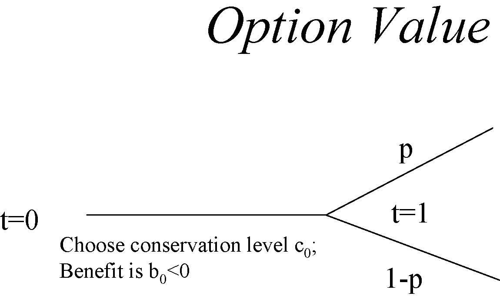
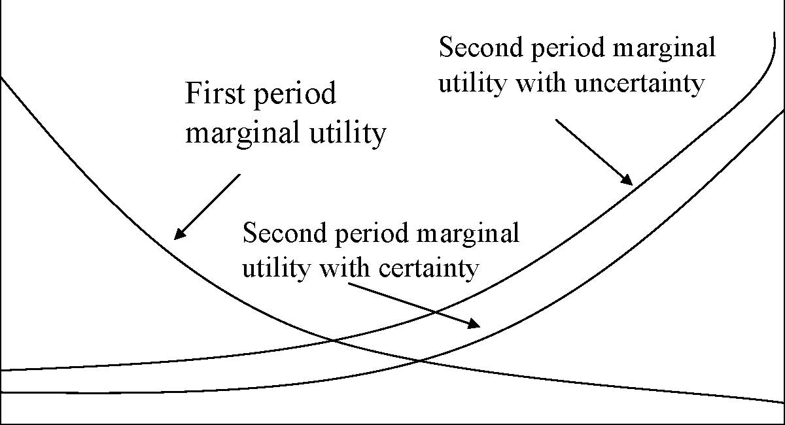
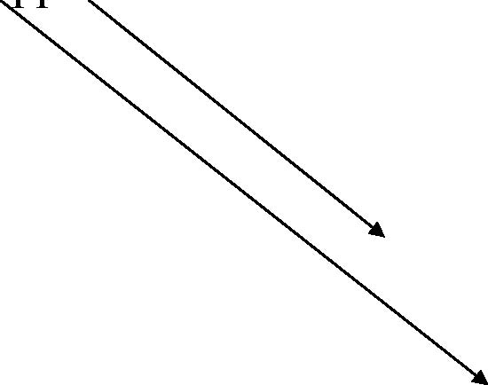

         Acrobat Distiller 5.0.5 (Windows)

         2003-07-28T02:17:20Z

         2003-08-18T12:01:46+05:30

         2003-08-18T12:01:46+05:30

         PScript5.dll Version 5.2

         xml

               bersara

               Microsoft PowerPoint - 14.23 Class21.ppt

# 14.23 Government Regulation of Industry

Class 21: Markets for Greenhouse Gases

MIT &amp; University of Cambridge

1

Outline 

-  The GHG problem 

-  Some Economics relevant to Climate Change 

-  Marginal damage costs of Climate Change 

-  The Nature of Uncertainty 

-  Economic Policy and Uncertainty 

-  Benefits of International Co-operation 

-  McCain-Lieberman Draft Bill 

2

Source: Reilly et al., 2003, http://web.mit.edu/globalchange/www/PewCtr_MIT_Report03.pdf, p.5. 3 

Potential damage of rising climate

- 	Sea level rise leading to: dryland loss, wetland loss, coastal protection and migration. 

- 	Agricultural output and distribution of output effects. 

- 	Heat stress, cold stress, malaria, tropical cyclones, extra tropical storms, river floods and unmanaged ecosystems. 

- 	The effect of these would be deaths, migration and increased mitigation expenditures. 

- 	Standard estimate range is that average global temperature will rise by 1.5-4.5C by 2100. 4 

Some difficulties in assessing climate change

- 	We are actually talking about managing risk under uncertainty. There are two ways of dealing with this: insurance and mitigation. 

-  Problems for analysis: 

-  Difficulty in assessing risks. Why? 

-  Risks are endogenous. Why? 

-  Individual risks correlated with each other. So, what? 

-  Irreversibility. How is this significant? 

5

Is insurance the answer?

- 	If I (or the UK) am worried about climate change, why can’t I (or the UK) just take out an insurance policy? 

-  State of nature contingent markets do exist: 

-  Chicago Catastrophe Futures 

-  Monte dei Paschi di Siena agricultural insurance 

- 	In theory it might be possible for countries to offer insurance on the basis of differences in their perceived risk. 

-  Why will conventional insurance mkts have to deal 

with climate change? 

6 

How insurance might work

- 	Two countries (1&amp;2), two states of the world (a&amp;b), pa=0.1, pb=0.9. 

- 	If country one has w1(a)&gt;w1(b) and country two has w2(b)&gt;w2(a) then there is opportunity to reduce the minimum outcome by trading (i.e. insurance is possible). 

- 	If climate state is a then 1 transfers Da,1,2 to 2 and if it is b 2 transfers D b,2,1 to 1 such that 0.1 Da,1,2 –0. 9D b,2,1 =0. If there is uncertainty about probabilities we need to ensure for all probability distributions. 

- 	Countries that are differently effected by climate change could raise welfare by trading insurance. 7 

Difficulties of making agreements on climate change

- 	Free-rider problem and incentives to enforce schemes internally (why?). 

- 	Usually enforcement of collusive agreement mechanisms do not work (for example?). 

- 	Equalisation of marginal emissions abatement cost is not optimal at national level (why?). 

- 	What implications might this have for a global CO2 tradeable permit system? 

8

Option values and irreversibility

- 	Option value and non-use value are closely related. Why? 

- 	Value of waiting before taking action is that you may find that cheaper ways to address the problem in the future. 

- 	Cost of waiting to take action is that damage may be irreversible if early action not taken. 

9

Option Value p 1-p t=0 t=1 Choose conservation level c0; Benefit is b0&lt;0 

State s1: choose conservation level c1 payoff is b1&lt;0 

State s2: choose conservation level c2 Payoff is b2&gt;0 

At t=0 we have one unit of an environmental asset.In s2 payoff increasing in amount of environmental asset.If decision at t=0 is reversible, then c0=0, c1=0, c2=1.If decision at t=0 sets maximum amount of c at t=1, then c0(b0+(1-p)b2), this is the net option value(assuming c1 can be set to 0).

10

How uncertainty effects allocation of consumption across time

Marginal Utility 

First period marginal utility Second period marginal utility with certainty Second period marginal utility with uncertainty 

c1 c2

Fixed amount of consumption to be allocated between period 1 and period 2. Thereis a possibility that the resource will be valued more highly by a future generation.

11 Uncertainty makes case for conservation only when expected return to postponement is positive. 

1990 Prices, 5% Discount Rate, World GDP = $16500 (1990). Total = 1.3% GDP 

Source: Tol, R.S.J. (1999), ‘The Marginal Cost of Greenhouse Gas Emissions’, Energy Journal, Vol.20, No.1, pp.61-81. 

12 

Source: Tol (1999). 

13 

Equity Issues 

Dworld=ΣregionsDregion(Yworld/Yregion) 

D=damage, Y=income per capita. 

14

Source: Tol, 1999. 

15 

Source: Tol (1999). 

Source: Tol (1999). 16

Uncertainties in Climate Change

-  Three uncertainties in the MIT-IGSM Climate Model: 

-  Uncertainty about the Atmosphere-Ocean circulation. 

-  Uncertainty about rate of heat uptake by oceans. 

-  Uncertainty about the radiative forcing in response to given aerosol loadings. 

- 	With no policy mean rise in global temperature is 2.4C with a one in twenty chance of being outside the range 1.0 to 4.9C. 

- 	The result of a policy restriction is that mean rise is 1.6C with a one in twenty chance of being outside the range 0.8 to 3.2C. 

-  How would you assess the option value of policy? 17 

MIT-IGSM Policy Scenario

- 	Kyoto implemented by all countries including US in 2010, the cap is then lowered by 5% every 15 years for Kyoto cap countries. For other countries they are capped in 2025 at 5% below their 2010 levels and this is reduced by 5% every 15 years. 

-  Assume only CO2 capped. 

- 	The result of this is CO2 emissions fall but concentration continues to rise. 

-  Why would you want to bring in other GHGs? 

18

The impact of policy on probability of climate change

95% upper bound 

Source: Webster et al. (2002), http://web.mit.edu/globalchange/www/MITJPSPGC_Rpt95.pdf, p.12-13.

19

Methane is 20 times more potent than CO2 by weight, N2O is 300 times more potent, other gases can be 1000s of times more potent. 

Source: Reilly et al., 2003, http://web.mit.edu/globalchange/www/PewCtr_MIT_Report03.pdf, p.24. 20 

Benefits of GHG Emissions Trading

Source: Jacoby et al.(1996), http://web.mit.edu/globalchange/www/MITJPSPGC_Rpt9.pdf, p.15. 21

Lieberman/McCain Draft Proposal on Climate Change

- 	Target: 2010 US GHG emissions to be reduced to 2000 level, by 2016 emissions to be reduced to 1990 level. 

-  Allowances to be issued by grand-fathering and auction. 

- 	All entities emitting more than 10K tonnes per year of GHGs will need permits. Residential and agricultural sectors will not be covered but petroleum refiners and importers will need permits for the GHG emissions produced by their products. 

-  Banking and borrowing (at 10% interest) allowed. 

- 	Initially 15% of any entity’s reduction may be from another nation’s market for GHGs. 

-  Credits for manufacturers who improve fuel economy. 

- 	Administered by EPA with auction proceeds reducing energy costs and assisting disproportionately affected workers. 

22 

See http://www.senate.gov/~lieberman/press/03/01/2003108655.html

Conclusions

-  GHGs represent a problem of risk management. 

- 	The costs of GHGs are potentially large but are actually small in NPV terms at the moment. 

- 	Policy intervention reduces the risk of extreme climate change more than it reduces mean climate change. 

- 	Tradable emissions permit systems should include all relevant gases and need to handle problems of different valuations of damage across countries. 

- 	Proposals exist for permit trading systems and their implementation is highly likely. 

23 

Next 

-  The Regulation of Workplace Safety 

-  Read VVH Chapter 23

24
