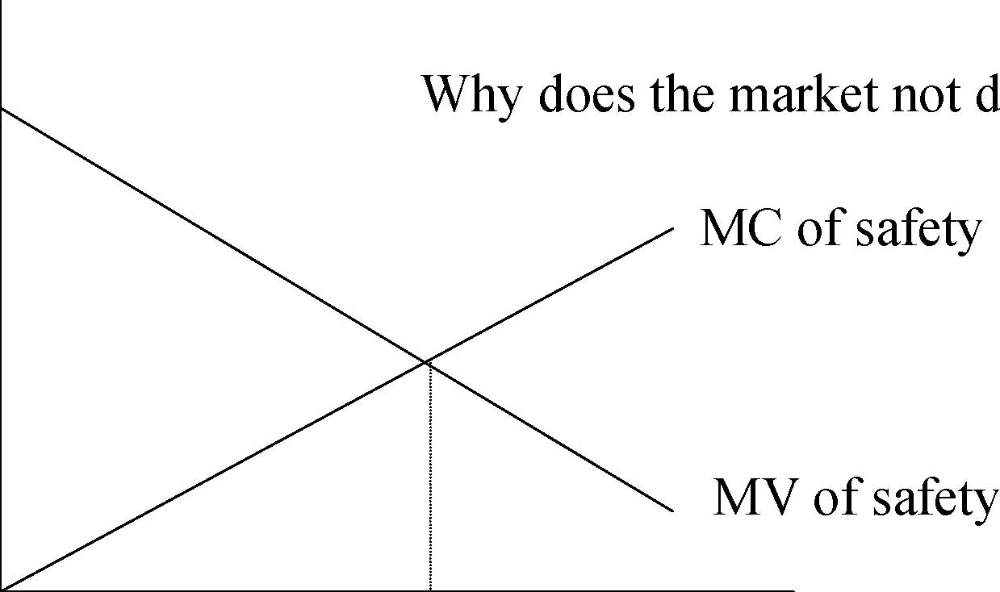
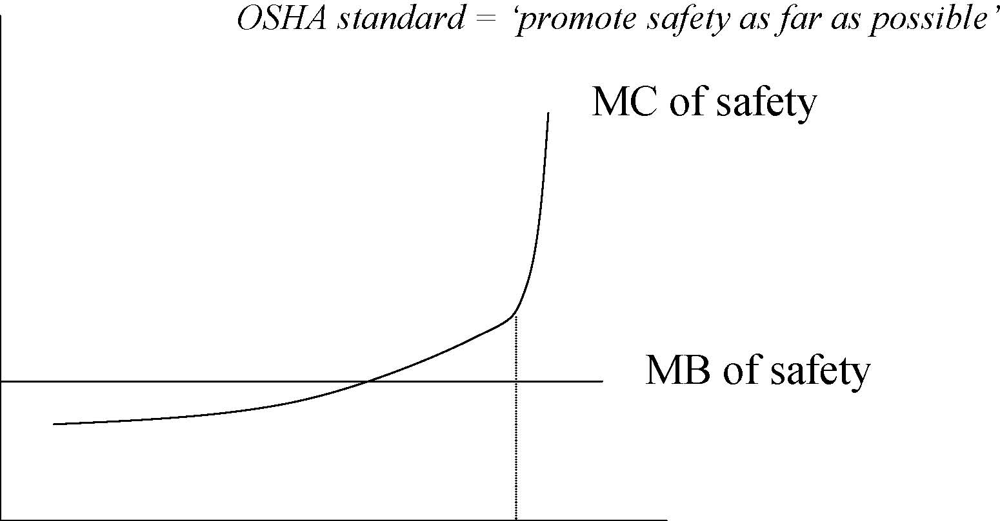

         Acrobat Distiller 5.0.5 (Windows)

         2003-07-28T02:17:45Z

         2003-08-11T13:56:47+05:30

         2003-08-11T13:56:47+05:30

         PScript5.dll Version 5.2

         xml

               bersara

               Microsoft PowerPoint - 14.23 Class22.ppt

# 14.23 Government Regulation of Industry

Class 22: Regulation of Workplace Safety

MIT &amp; University of Cambridge

Outline 

-  Markets for health and safety 

-  Health and safety and information 

-  OSHA approach 

-  Effects of OSHA policies 

-  Reform of OSHA 

The Market for Health and Safety 

$ Why does the market not deliver S*? 

MC of safety MV of safety 

0 S* Safety Level 

Why does the labour market help enforce health and safety?

- 	$70 bn dollar p.a. premium because of risk at work. 

- 	Premia do reflect risks associated with job (values of life recovered from this type of analysis). 

- 	Workers and consumers well informed about product and hence enforce standards via reputation effects. 

Can we rely on the market to enforce health and safety?

- 	Adam Smith observed that workers demand higher pay for more risky or unpleasant jobs. 

- 	This depends on: awareness of risk and preference for safety/health. 

- 	Evidence is that some people are prepared to take more health and safety risks (and these are positively correlated). 

- 	Hersch and Viscusi (1990) find that smokers and those who don’t wear seatbelts much more willing to take hazardous jobs. 

- 	What does the above mean for incentives facing firms to lower safety risk? health risk? 

Can we rely on the market to enforce health and safety?

- 	Workers must be aware of the risks they face for the differential wage theory to fully reflect true preferences for risk. 

- 	It does appear to be the case that perceptions about safety risk do match actual risks (U of Mich Survey of Working Conditions). 

- 	However the evidence is that workers are not perfectly informed. 

- 	Wage Premia: 3-5% for chemicals and allied products to 12-15% for lumber and wood products. 

6 

Can we rely on the market to enforce health and safety?

- 	If workers can only observe riskiness imperfectly at time of taking a job then they find out more after starting working. They may reassess risk and quit. 

-  1/3 of all manufacturing quits are due to risk. 

- 	Higher job turnover in risky jobs, length of tenure much lower in risky jobs. 

- 	What sort of incentives face firms in this situation: where would they locate, what sort of people might they hire, how much training would they offer workers? 7 

Can we rely on the market to enforce health and safety?

- 	Workers’ compensation claims for damages in the US were $15bn in 1984, $26.2bn in the late 1990s. 

- 	If workers’ know they can get compensation, what effect might this have on their behaviour? 

- 	For fatalities Moore and Viscusi (1990) estimate that fatalities are 1/3 lower because of liability for workers’ compensation. 

- 	Offering compensation may have offsetting benefits in the labour market through lower wages (Viscusi and Moore (1987), why? 

-  Problems may exist in the extent of liability being too great. 

Information Problems

- 	Markets may fail as a result of asymmetric information e.g. about the riskiness of a job or community or about product quality. 

- 	Workers or consumers only know the average risk associated with a job or product. You get market for lemons problem (Akerlof, 1970). What happens? 

<Table>
<TR>
<TD>Fraction </TD>
<TD>Safety </TD>
<TD>Consumer </TD>
<TD>Group-</TD>
<TD>Gain or </TD>
</TR>
<TR>
<TD>of cars </TD>

<TD>value with </TD>
<TD>based </TD>
<TD>loss </TD>
</TR>
<TR>

<TD>perfect </TD>
<TD>valuation </TD>

</TR>
<TR>

<TD>information </TD>

</TR>
<TR>
<TD>0.2 </TD>
<TD>High </TD>
<TD>30000 </TD>
<TD>23500 </TD>
<TD>+6500 </TD>
</TR>
<TR>
<TD>0.3 </TD>
<TD>Medium </TD>
<TD>25000 </TD>
<TD>23500 </TD>
<TD>+1500 </TD>
</TR>
<TR>
<TD>0.5 </TD>
<TD>Low </TD>
<TD>20000 </TD>
<TD>23500 </TD>
<TD>-3500 </TD>
</TR>
</Table>

Information Problems

- 	In the labour market the firm that offers high safety has to offer higher wages than it should have to and this will make it uncompetitive. 

-  Solving the lemons problem: 

-  Self-certification by warrantees or guarantees. 

-  Government determination of safety level. 

-  Voluntary programs (e.g. associations of responsible firms). 10 

Information Regulation

-  Don’t want to ban activity because of uncertainty. 

-  Individuals differ in valuation of risk. 

-  Regulation of use is expensive to enforce. 

-  Information regulation can be very effective: 

-  Drain opener labels: wear rubber gloves, store in child proof location (63% to 82%; 54% to 68%). More do right thing in response to having labels. 

-  Nutritional Labelling and Education Act (NLEA) mandated labelling. Fat level of salad dressing varies even though self-labelled ‘low fat’, after NLEA high fat dressings experienced significant sales decline. 11 

OSHA

- 	Mandate to set health and safety standards for workers from 1970. However Act did not say how to achieve goal. 

- 	2200 staff at Federal level (second to EPA in social regulation), $435m budget, 37493 inspections at Federal level, 26 states run their own programs. 

- 	Traditional approach was adopting a technology based standard whose stringency was limited by their affordability. Fines for violation. What other approaches might exist? 12 

OSHA Analytical Approach 

$ 

MC of safety MB of safety OSHA standard = ‘promote safety as far as possible’ 

0 SOSHA Risk 

OSHA Analytical Approach

- 	Did not use CBA, only had to worry about firm shutting down as a result of standard. 

- 	US Supreme Court 1981 ruled out CBA, cotton dust standard was ok as as long as technically feasible. 

-  CBA is done via OMB rules. 

- 	Standards setting ridiculed: specifying height of handrail, spacing of posts etc., what should the standards specify. 

- 	Change in analytical approach in Carter administration with move to harnessing market forces in chemical 

14

labelling regulation. 

Worker response to chemical labelling

Change in fraction who consider job average risk (after labelling) Annual wage increase demanded 

Changes in fraction very likely or somewhat likely to quit (if no change in wage rate) Sodium Bicarbonate 

-35% 

$0 -23% 

Chloroaceto TNT Asbestos -phenone 

45% 63% 58% 

$1900 $3000 $5200 13% 52% 63% 

Is OSHA effective?

- 	Inspections around 90,000 a year (including states). Penalties more like $30m per year. This is very small given the number of workplace locations in the US. Mostly focus is on safety not health. 

-  A rational firm will calculate: 

-  Compliance cost &lt; (probability of inspection) x (no of violations per inspection) x (average fine per violation). Why? 

-  Compare this with impact of labelling on wage demands. Which is more effective in forcing change? 

Is OSHA effective?

Riskt =α+β1Riskt −1 +β2Cyclicaleffectst +β

3 IndustryCharacteristicst +β4WorkerCharacteristicst n +β5∑OSHAt −1 +ε

i t = 0 

Example: Ruser and Smith (1988) find that OSHA Inspections in the early 1980s decreased injuries by 5-14%. 

Does this analysis address the issue of optimality? 

17 

Conclusions on OSHA

- 	Should shift to health market as this is where the more severe market failure is (some evidence that OSHA is doing this). 

- 	Concentrate on high impact inspections (site specific targeting plan since 1999). 

-  Shift to performance not technology standard. 

-  Need to reconsider lack of focus on CBA. 

- 	No obvious need for deregulation of health and safety regulation. 

Conclusions 

- 	Zero safety and health effects in the workplace not achievable. 

- 	Regulatory agency is not the dominant effect on safety and health in the workplace. 

-  compensation claims and wages are much more important than OSHA penalties. 

- 	Regulation should make better use of market based incentives (e.g. via labelling to induce a market reaction). 

Next 

-  Regulation of Inventions 

-  Read VVH Chapter 24
