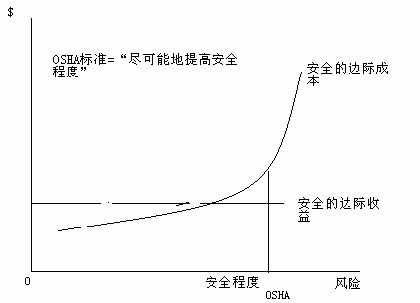

         xml

               user

               第22课.doc

         2005-10-13T11:49:21+08:00

         pdfFactory Pro www.fineprint.com.cn

         pdfFactory Pro 2.30 (Windows XP Professional Chinese)

## 14.23政府的产业规制

## 

第 22课：工作场所的安全规制

### 麻省理工院 &amp;剑桥

学大学

大纲 

- n通过市场促进健康和安全 

- n健康、安全和信息 

- n职业安全与卫生管理局（ OSHA）的规制方法 

- n职业安全与卫生管理局（ OSHA）政策的效果 

- n职业安全与卫生管理局（ OSHA）的机构改革

通过市场促进健康和安全

为什么劳动力市场有助于促进健康和安全？ 

- n由于工作风险，每年要支付 700亿美元的风险补贴。 

- n风险补贴反映了工作的危险程度（这些保险可补偿生命价值） 

- n工人和消费者详细了解了产品，因此可通过其风险度来形成安全

标准。

我们能否依赖市场来促进健康和安全？ 

- 	亚当·斯密发现工人对于更危险和更不愉快的工作，要求获得更高的报酬。 

- 	这是由于：风险意识和对健康安全的偏好。 

- 	有些人愿意冒险从事危害健康和安全的工作（正相关）。 

- 	赫希和维斯库斯 (1990)发现吸烟者和不系安全带的人更愿意从事危险的工作。 

- 	面对提供更低的健康或安全保障的公司时，以上这些对工作动机有何影响？ 

- 	由于工资级差理论充分反映了风险偏好，工人必须意识到他们面临的各种风险。 

- 	事实说明，工人的安全风险意识与实际风险存在很强的关联性（密歇根大学工作条件调查中心提供的数据）。 

- 	但是证据显示工人没有充分掌握信息。 

- 	工资补贴：化学及其制品业占 3-5%，伐木及木材制品占 12-15%。 

- 	如果工人在对某一工作的潜在风险没有充分理解的情况下开始工作，工作后就会发现这些风险，这时候他们会重估风险或放弃。 

- 	因工作风险辞职的员工占机械工业辞职总人数的 1/3。 

- 	高风险岗位的流动性更高，工作周期更短。 

- 	这种情况下的公司面临的激励机制：他们应把厂址建在何处，雇佣何种员工，为工人提供多少培训？

-  	1984年美国的健康安全诉讼赔偿为 150亿美元， 90年代末达到

- 了 262亿美元。 

- 	如果工人知道能够获得补偿金，这种补偿金制度会对他们的行为产生怎样的影响？ 

- 	摩尔和维斯库斯 (1990)估计，由于有了补偿金，工人的工难事故下降了 1/3。 

- 	维斯库斯和摩尔(1987)认为补偿金制度可以使劳动力市场上的低工资收入者获得补偿收益，为什么？ 

- 	补偿范围过宽，可能仍有问题存在。

- 信息问题 

- 	由于信息不充分，可能导致市场失灵，例如对工作、公司的危险性或对产品质量缺乏全面认识。 

- 	工人和消费者仅知道与工作或产品有关的平均危险程度。面对柠檬市场问题（Akerlof，1970）时，会发生什么呢？

汽车部门安全性获得充分团体价值增益或损失信息的消费者 

- 0.2高 

- 30000 23500 +6500 

- 0.3中等 

- 25000 23500 +1500 

- 0.5低 

- 20000 23500 -3500

信息问题 

•	在劳动力市场，为了提高工人的安全保障，公司不得不支付比他

们本应支付的工资更高的报酬，这使他们失去了竞争力。 

- n解决柠檬问题：——担保人和被担保人签定个人保证书。 ——政府对安全标准的设置。——自愿行为（例如，担负安全责任的公司的联合）

- 信息规制 

- 	不要因为信息的不确定性而取缔商业活动。 

- 	对风险进行评估具有个体差异。 

- 	进行使用规制成本较高。 

- n信息规制非常奏效： ——下水道通剂标签: 使用时请戴橡皮手套 ,置于儿童接触不到之处 (63% 至 82%; 54% 至 68%)。实行标签规制后会做更多正确的事情。 ——《营养标签及教育法》要求给产品贴上标签。即便沙拉酱自诩为 “低脂肪”，其脂肪含量也存在差异。《营养标签及教育法》颁布后，高脂肪食品遭遇销售额大跌重创。

职业安全与卫生管理局（ OSHA） 

• 	OSHA采用的方法受到 1970年的“职业安全和健康法案”的规定来确保工人健康和安全，但 OSHA没在立法中细化应如何达

到这些标准。

<Table>
<TR>
<TH>• </TH>
<TD>OSHA拥有雇员 2200名（在社会规制机构中次于环保署），4.35</TD>
</TR>
<TR>

<TD>亿美元的预算，OSHA进行 37493次调查，26个州进行他们自</TD>
</TR>
<TR>

<TD>己的调查。 </TD>
</TR>
<TR>
<TH>• </TH>
<TD>OSHA的传统规制方法采用技术标准规制，这些标准的严格程度</TD>
</TR>
<TR>

<TD>受到其自身供给的限制。违反标准就会受到罚款。还可能采用其</TD>
</TR>
<TR>

<TD>他什么方法？ </TD>
</TR>
</Table>

OSHA的分析方法 

- 	不运用成本效益分析的 OSHA，就必然担心公司因标准问题而倒闭。 

- 	美国最高法院在 1981年取消成本效益分析，一旦技术支持，棉尘标准就可行。 

- 	白宫预算办公室进行成本效益分析。 

- 	标准细化到了可笑的程度：指定栏杆的高度、位置的范围等等。

- 标准应如何细化？

- 	分析方法变革始于卡特政府，运用化学标签规制来强调市场监管

力度。

工人对化学标签的反应

小苏打氯苯乙酮三硝基甲苯石棉

认为工作风险高于

一般水平的那部分人

的变化（有标签后） -35% 45% 	63% 58% 

增加年薪水的要求（美元） 0 1900 3000 5200 

资料来源：维斯库斯和 O’Connor (1984) 

OSHA有效吗？ 

- 	每年约进行 9万次调查（包括 26个州的调查）。每年的罚款超过 3千万美元。这于美国的工作场所数目而言当属很少的罚金。大多罚金集中在安全而非健康方面。 

- n一个理性的企业将会计算： 

OSHA有效吗？

n 

风险 t= α + β1风险 t-1 + β2循环影响 t +β3产业特性 t+β4工人特性 t + b�OSHA -1 +εi

5 tt =0 

例：Ruser 和斯密 (1988)发现 20世纪 80年代早期，OSHA检查降低了 5-14%的受伤率。这种分析达到最优了吗？ 

OSHA的结论 

- 	应该将重点转移到健康市场，因为健康市场更加失灵（有证据显示 OSHA正在这样执行）。 

- 	集中于有重大影响的检查（1999年开始实行有特定的检查计划） 

- 	重点转移到行为而非技术标准。 

- 	需要提高对成本效益分析的关注程度。 

- 	没有解除健康和安全规制的明显必要。

- 结论 

- 	在工作场所没有实现对健康和安全的零影响。 

- 	规制部门对工作场所的健康和安全不能产生主要影响。 ——赔偿诉讼和风险工资比 OSHA的罚金更重要。 

- 	规制应该更好地利用具有激励机制的市场（例如，通过标签激发市场的反作用）

下一课 

•	创新规制

n阅读第 24章
