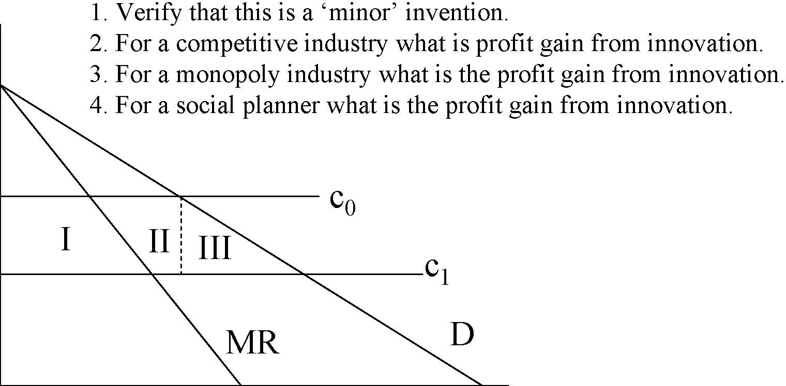
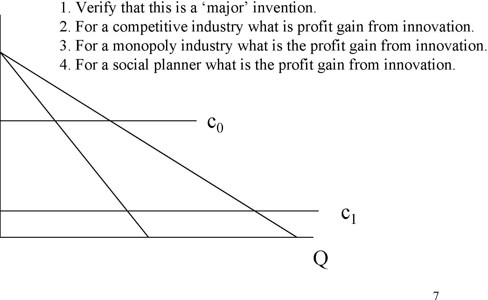
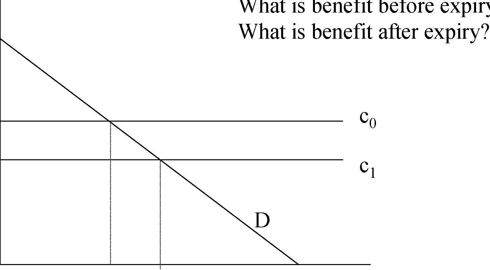
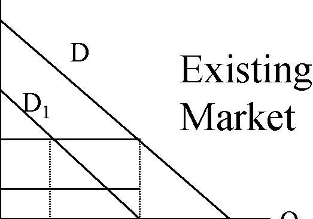
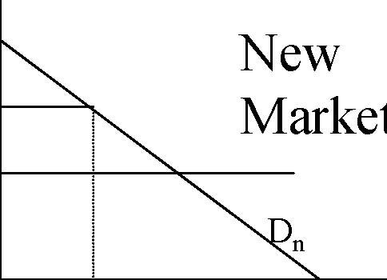

         Acrobat Distiller 5.0.5 (Windows)

         2003-07-28T02:18:01Z

         2003-08-11T14:00:14+05:30

         2003-08-11T14:00:14+05:30

         PScript5.dll Version 5.2

         xml

               bersara

               Microsoft PowerPoint - 14.23 Class23.ppt

# 14.23 Government Regulation of Industry

Class 23: Regulation of Patents: The case of Pharmaceuticals

1

## MIT &amp; University of Cambridge

-  The regulation of innovation •Patents 

-  Incentives to innovate 

-  Welfare analysis of patent protection 

-  Pharmaceuticals and patent protection 

-  1984 Price Competition and Patent Protection Act 

2

- 	R+D yields information -so regulation of invention is a form of regulation of information. 

- 	Do we get the right amount of R+D? What is the right amount of R+D? 

-  Public goods aspects of R+D expenditure = ? 

- 	However in practice there are limits on the appropriability of others’ R+D. What are these? 

- 	There are also limits on the extent to which there can be legal protection of inventions. (Mansfield). Why? 

3

## Patents

- 	Allows ownership of monopoly right for 20 years from date of filing. After 20 years the information becomes free to use. 

-  Patent is an exclusive right to one’s invention. 

-  Patents are similar in effect to copyright: 

- 	Patent applies to ‘any new and useful process, machine, manufacture, or composition of matter, or any new and useful improvement thereof’ (US Patent Office). 

- 	Copyright applies to ‘“original works of authorship,” including literary, dramatic, musical, artistic, and certain other intellectual works.’ (US Copyright Office). 

-  Patent Office needs to be satisfied New, Useful and Non-Obvious. 

-  If you have a patent you must enforce it through courts. 

-  Holder of Patent may license others to use invention for royalties 

before patent life has expired. 

4 

- 	Incentives to innovate depend on the amount of profit an innovator expects to receive. 

-  This can be shown to depend on market structure. 

-  We look at 4 cases: 

-  Minor invention in a competitive industry 

-  Minor invention in a monopoly industry 

-  Major invention in a competitive industry 

-  Major invention in a monopoly industry 

-  Minor invention is one where the price does not change. 

5

Innovation reduces cost from c0 to c1:

P

c0 c1 DMR 1. Verify that this is a ‘minor’ invention. 2. For a competitive industry what is profit gain from innovation. 3. For a monopoly industry what is the profit gain from innovation. 4. For a social planner what is the profit gain from innovation. I II III 

0Q

6

Innovation reduces cost from c0 to c1:

P

0

7 c0 1. Verify that this is a ‘major’ invention. 2. For a competitive industry what is profit gain from innovation. 3. For a monopoly industry what is the profit gain from innovation. 4. For a social planner what is the profit gain from innovation. 

c1 Q 

-  Incentives to invent differ under: 

-  Monopoly 

-  Competition 

-  Social Planning 

-  The issue is the ‘replacement’ effect. 

- 	We have analysed a process innovation, which reduces costs. We could analyse a product innovation which enhances product value. 8 

- 	Optimal Patent Life (Nordhaus, 69): single investor in a competitive industry who makes a minor cost reducing invention. 

- 	Inventor needs to decide on how much to spend on R&amp;D to generate cost savings. 

-  Magnitude of cost savings: B=c0-c1 

-  R&amp;D Costs: TC=αB2 where α&gt;0 

-  For minor innovation: B*Q0 

-  T= patent life T 

-  NPV of benefits: NPV= ∫ BQ0e− rtdt = BQ0(1 − e−rt )/ r 

0 

- 	Inventor maximises NPV of benefits -costs for a given T. 9 

## Inventor’s choice of invention varies with T

$ TC PV(T=20) 

PV(T=10) What size of invention occurs when T=10 and T=20? 

0 

Size of invention, B 10 

## Calculating the Optimal Patent Life

- 	It is always privately optimal for inventors to have longer patent lives. Why? 

- 	Is this likely to be true of invention in general? Why or why not? 

- 	However limiting patent life allows prices to fall as generic products come into the market and eliminate the monopoly power of the inventor. 

- 	Thus the trade-off for society in setting T is the extra producer and consumer surplus gained from longer T via enhanced cost reduction and new products with the lower consumer surplus gained from existing 11 

innovations.

## Benefits of Patents before and after patent expires

$ What is benefit before expiry? 

c0 c1 D What is benefit after expiry? 

0 Q12

- 	Now assume that there are multiple inventors chasing the same innovation and that there are no problems with monopoly pricing. 

- 	P(n) is the probability of society discovering innovation first where n=number of inventors. P’(n) &gt;0 but P’’(n)&lt;0. Each inventor must pay R to be in the race. 

-  What is the optimal number of inventors from society’s viewpoint? 

-  What is the number of inventors in free entry equilibrium? 

-  For society: Max P(n)B-nR: P’(n)B=R. 

-  Under free entry: P(n)B/n=R, why? 

-  Thus the number of inventors is not the same and we have a 

common property problem. 

13 

## New product invention when substitutes exist

- 	New invention lowers costs but is a close substitute for existing product. What is the social benefit of the invention? 

- 	The existing product demand falls and the effects of this offset the benefits in the new market. However should not consider the change in CS (as consumers can still buy the old product at the same price) only the change in PS. 

-  This is a ‘business stealing’ effect. 

P

P

D D1 Existing Market 

Dn New 

Pn Market 

cn 0Q 

P0c0

14

0

Q

## Pharmaceuticals

-  Research oriented from 1930s. Extensively regulated. 

- 	In US regulation dates from 1906 (Pure Food and Drug Act) aimed at adulteration and mislabelling of food and drugs sold interstate. 

- 	1938 Food, Drug and Cosmetic Act passed following drug disaster which killed 100 children. This requires new drugs to be approved as safe by FDA. 

- 	1962 Amendments require scientific tests to be conducted to prove drug efficacy prior to marketing approval by FDA. 

- 	Now: 3.5 years of discovery in lab, 6 years of clinical testing, 2.5 years for FDA approval. Only 1 in 4 drugs approved. Approximately 20-30 new chemical entities approved each year. 

-  Total R&amp;D average R&amp;D per approved drug increasing in real $. 

15

## Demand and Supply for Ethical Drugs

- 	Who demands pharmaceuticals? Patients, doctors, HMOs? 

- 	Producers: the market is international and the 4 firm concentration rate is quite low but has been rising recently via merger, however concentration much higher in certain drug categories. 

- 	Generic producers compete with R&amp;D oriented, branded firms. 

-  Now the case that generic products available after 

a few months of end of patent. 

16 

- 	Patents are biggest barrier to entry but you can alter chemical formulation and attempt to get round patent (recall patents are published) e.g. Tagamet and Zantac. 

- 	Brand loyalty may be an issue but increasingly generics are favoured by insurance coverage. 

- 	R&amp;D scale economies very large, in 1980s the NPV of the cost of new drug to day of approval was $194m (1993 study). 2002 cost of average new drug is $802m (including failures). 17 

## 1984 Drug Price Competition and Patent Restoration Act

- 	This law facilitates the entry of generic competitors after patent expiration thereby leading to price competition. 

- 	Restored patent protection lost during the pre-market regulatory process for new pharmaceuticals. 

- 	In 1998 the effects of this law were analysed by the Congressional Budget Office. 

- 	The net effect of the law was found to reduce the NPV of the expect profits from a new drug by $27m (1990 dollars) but that the return to new drugs had increased

18 

since the Act.

19Source: CBO (1998) at http://www.cbo.gov/showdoc.cfm?index=655&amp;sequence=0 

Source: CBO (1998). 

20

## Other policies affecting R&amp;D incentives

- 	Favourable tax treatment: investments can be expensed rather than depreciated. 

- 	1983 Orphan Drug Act covers drugs which treat diseases which effect small numbers of people (&lt;200,000 in US). It gives 50% tax credit for R&amp;D expenses for clinical trials. It may also be marketed exclusively for a 7 year period beginning on date of approval (runs contemporaneously with patent life). 

- 	Price controls: these exist in some countries, especially via price formula for National Health System purchases (e.g. UK). 

- 	In US the debate continues over drug company profits and extent to which insurance schemes should pay for expensive new drugs. 21 

- 	Invention, where it relies on the expensive creation of new information which cannot be concealed needs to be regulated. 

- 	Patents are a form of legal protection of the returns to invention. 

-  Patents raise PS but may reduce CS. 

- 	Pharmaceuticals crucially rely on patent protection and changes to law and regulation effect incentives to invest substantially. 

-  However other policies to support pharmaceutical 

22 

innovation do exist.

- 	Regulation of Copyright: the case of internet music 

23
