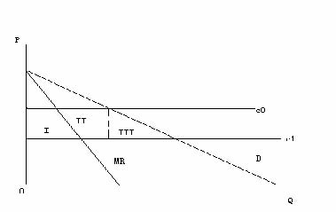
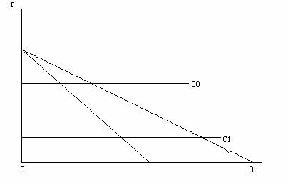
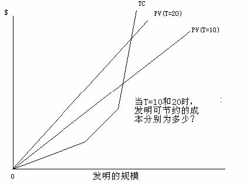
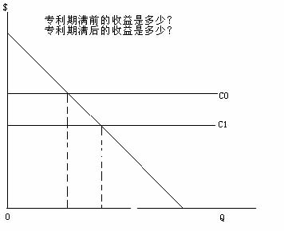
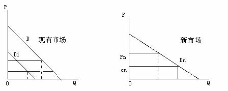
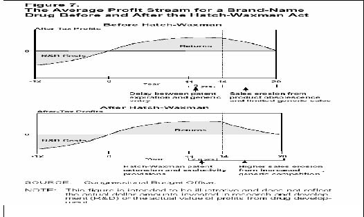

         xml

               user

               第23课.doc

         2005-10-13T11:53:21+08:00

         pdfFactory Pro www.fineprint.com.cn

         pdfFactory Pro 2.30 (Windows XP Professional Chinese)

## 14.23政府产业规制

## 

第二十三课：专利规制：药品案例

麻省理工学院 &amp;剑桥大学

提纲 

- l创新规制 

- l专利 

- l创新动机 

- l专利保护的福利分析 

- l医药品与专利保护 

-  	1984年价格竞争与专利保护法案创新 

- l研发受制于信息—发明规制是一种信息规制 

- l我们达到研发的正确的量了吗？研发的正确的量为多少？ 

- l研发花费的公众利益为多少？ 

- l实际上其他的研发占用有限制性。哪些限制性？ 

- 	发明的法律保护程序有其限制性（曼斯菲尔德）。为什么？专利 

- l信息自归档之日起赋予 20年专利权。20年后信息可供任意使用。 

- l专利权是发明者的独占权利。 

- 	专利权与版权本质相似：—专利权适用于“任何新颖或有用的方法，机器，产品或物质合成，或这些方法、物质的改进设计”（美国专利局） —版权适用于“原创作者的原作，包括文学，戏剧，音乐，艺术和其它某些智力成果。”(美国版权局 ) 

- l专利局青睐于新颖、实用、进步之物品。 

- l专利拥有者应通过法律来执行。 

- l专利持有者在专利失效前可收取其专利使用者的版税。

- 创新动机 

- l创新动机源于发明者的预期所得利润额。 

- l发明动机显示出其市场依赖性。 

- 	请看以下四种情形：—竞争行业的普通发明 —垄断行业的普通发明—竞争行业的重大发明 —垄断行业的重大发明 

- l普通发明不会改变价格

普通发明

从 C0至 C1，发明使生产成本递减： 

- 1.确认该发明为 

- “普通”发明。 

- 于竞争产业而言，利润源于发明。 

- 于垄断行业而言，利润源于发明。 

- 于政策制定者而言，利润源于发明。

重大发明

从 C0至 C1，发明使成本递减： 

- 1. 确认该发明为 “重大”发明。 

- 2. 于竞争行业而言，利润源于发明。 

- 3. 于垄断行业而言，利润源于发明。 

- 4. 于政策制定者而言，利润源于发明。

#### 社会的最优激励 

- l创新动机之不同源于： ——垄断

- ——竞争 ——社会计划 

- 	问题在于“替代”效应。 

- 	我们分析了可降低成本的流程创新，还可分析能提高产品价值的产品创新。

- 专利的福利分析 

- 	最优专利期限(诺德豪斯，Nordhaus, 1969年)：在竞争产业中单个投资者减少创新来降低成本。 

- 	发明者需要决定投入多少研发资金以降低成本。 

- 	节省的成本数量：B=C0-C1 

- 	研发成本：TC=αB2当 α&gt;0 

- 	普通发明： B*Q0 

-  	T=专利期限 

T 

•	收益的净现值： 净现值 =�0 BQ0 ertdt =BQ0 (1-ert )/ t 

•	投资者使收益的净现值最大化——T为既定值的成本。 

T的大小使发明家选择不同的发明

测算最优专利期限 

- 	于发明者而言，专利使用期越长个人的收益越佳。为什么？ 

- 	通常发明也如同上述吗？为什么？ 

- 	然而限制专利期限可以使产品进入市场时价格下跌成为普通产品，并消除了发明者的垄断权力。 

- 	因而将生产者与消费者从更长期的专利期限中获得的额外盈余比上现有发明使成本降

低的增加额与消费者获得更少的盈余之值，便是社会交易设定的专利期限值。

在专利期满前和期满后专利权的收益

专利竞赛 

- 	假定有众多的发明者都在追求同一个发明，那就不会存在垄断价格的问题了。 

-  	P(n)是指社会发现创新的可能性，这里的 n指发明者的数量。 P’(n) &gt;0 而 P’’(n)&lt;0。每位发明者在竞赛中必须承担投资 R。 

- 	从社会的立场出发，多少发明者数量才是最优的？ 

- 	自由进入均衡时应有多少发明家？ 

- 	于社会而言：Max P(n)B-nR: P’(n)B=R. 

- 	在自由进入的情况下：P(n)B/n=R，为什么？ 

- 	可见发明家的数量并不相同，而我们有共同的财产问题。

- 替代产品存在时新产品的发明 

- 	新发明可降低产品成本，但新产品对现有产品具有极强的替代性。发明的社会效益何在？ 

- 	现有产品需求下降，并且这一影响与新市场的利益相抵消。然而，在 CS（因为消费者仍可用同样价格买到老产品）中不应考虑这一变化；仅考虑 PS中的变化。 

- 	这是“交易偷盗”效应。

- 医药业 

- 	研究始于 20世纪 30年代。该行业存在广泛规制。 

- 	美国规制起源于 1906年（《纯食品和药品法》），其目标旨在整顿国内食品和药物混杂和乱贴标签的行为。 

-  	1938年《食品、药品和化妆品法》经历了药品的灾难性事故，在这次事故中百名儿童丧生。这就要求新药上市前必须由食品药物管理局证实安全。 

-  	1962年修正案要求新药的效用要经过科学实验证明其安全性后，才能获得食品药物管理局批准上市。 

- 	如今：新药在实验室研究 3.5年，6年的临床测试，再过 2.5年食品药物管理局才会做出决定。每四种临床药物，一般只有一种最后被食品药物管理局批准。 

- 	批准上市药物的总研发成本和平均研发成本在稳步上涨。

- 处方药的供求 

- 	谁需要药品？病人，医生还是卫生维护组织？ 

- 	生产商：市场特征是全球化的，四家厂商的集中度非常低，但是经过近来的合并，集中度正在升高，而特定药物的集中度更高。 

- 	一般厂商与注重研发的名牌厂商竞争。 

- 	案例：一般产品在品牌产品的专利到期几个月之后便复制这些品牌产品。

- 进入壁垒 

- 	专利权是进入的最大壁垒，但可改变药品的化学构成并争取获得围绕专利权（正式称呼名为召回专利），例如，Tagamet 和 Zantac。 

- 	品牌忠诚度可能是一个问题，但不断增加的无品牌药品受到保险业的青睐。 

- 	研发的规模经济非常庞大。20世纪 80年代新药品上市时的成本净现值为 1.94亿美元（1993年研究）。2002年新药品的平均成本是 8.02亿美元（包括研制失败的产品）。 

• 

1984年药物价格竞争和专利赔偿法案 

- 	该法案促进了在专利期满后一般厂商的进入，从而也导致了价格竞争。 

- 	该法案同时也部分补偿了新药的专利期限在上市前的规制过程中所受的损失。 

-  	1998年国会预算办公室评估了该法案效应。 

- 	由 0.27亿美元（1990的美元币值）的新药品分析可知，本法案的净效应会降低期望利润的净现值，但自该法案公布后，新药品的利润已经上升。

美国医药品专利保护变化

<Table>
<TR>

<TD>于 1984年药品价格竞争与专利期限赔偿法</TD>
<TD>于药品价格竞争与专利期限赔偿法和 1994年乌拉圭回合协议公约</TD>
</TR>
<TR>
<TH>专利期限</TH>
<TD>专利审批后 17年</TD>
<TD>申请提交后 20年（按最早的提交日期）</TD>
</TR>
<TR>
<TH>专利保护下平均市场期限</TH>
<TD>大约 9年</TD>
<TD>大约 11.5年</TD>
</TR>
<TR>
<TH>专利期限与一般商品进入的间隔时期 </TH>
<TD>3至 4年</TD>
<TD>通常为 1至 3个月</TD>
</TR>
<TR>
<TH>多源的一般药品平均市场份额（百分比） </TH>
<TD>12.7 </TD>
<TD>57.6 </TD>
</TR>
</Table>

http://www.cbo.gov/showdoc.cfm?index=655&amp;sequence=0 

影响研发动机的其他政策 

- 	有利的税收政策：货币投资胜于货币贬值。 

-  	1983年孤药法案涵盖了只影响少数人的疾病的药品（在美国小于 20万人口）。它允许临床试验减少一半的研发税收。它亦允许获得食品及药物管理局批准的生产某种孤药的厂商，自批准之日起得到七年时间的市场排他权。 

- 	价格控制：在某些国家存在，特别是通过国家保健系统的价格机制来控制（例如英国） 

- 	在美国，针对药品业利润及哪种险种应为昂贵的新药提供保障的争论仍在继续。

- 结论 

- 	发明有赖于昂贵的且无法隐瞒的新信息，因而要对发明进行规制。 

- 	专利是对发明的利润的合法保护。 

- 	专利会提高 PS（生产者剩余），但可能降低 CS（消费者剩余）。 

- 	医药业主要依赖于专利保护和法律的修订，规制效应激励广泛投资。 

- 	但其他支持医药业创新的政策的确存在。

- 	版权规制：网络音乐实例

下一课 
