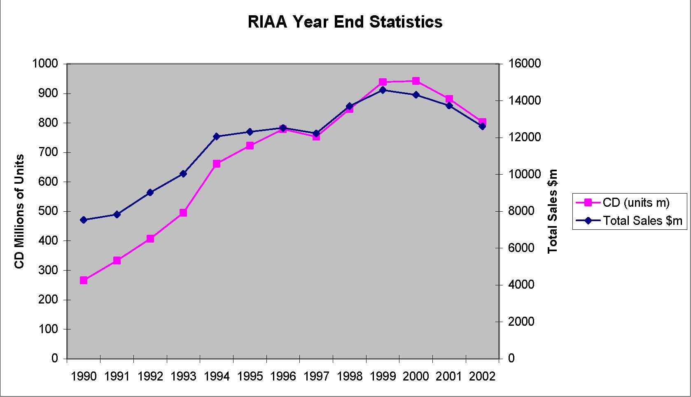

         Acrobat Distiller 5.0.5 (Windows)

         2003-07-28T02:18:30Z

         2003-08-11T14:04:12+05:30

         2003-08-11T14:04:12+05:30

         PScript5.dll Version 5.2

         xml

               bersara

               Microsoft PowerPoint - 14.23 Class24.ppt

# 14.23 Government Regulation of Industry

Class 24: Regulation of Copyright: The case of internet music

## MIT &amp; University of Cambridge

1

-  What is copyright? 

-  The History of Napster 

-  Economics of Copyright 

-  The recorded music industry 

-  Impact of file transfers on music industry 

-  Should we stop file transfers? 

2

-  1445 Gutenberg Press -printing invented. 

- 	1547 England’s Edward VI grants monopoly to King’s printer for certain works. 1556 Charter granted the Stationer’s Company monopoly over printing and powers to enforce. 

-  1707 external competition from Scots to break monopoly. 

-  English Copyright -Statute of Anne -1709. 

-  Legal protection for consumers of copyrighted works: 

-  Curtailment of the term of copyright. 

-  Public domain for literature created: 

-  Copyright only for new works. 

- 	Copyright limited to power to print, publish and sell (i.e. no control of resale). 

-  Copyright belonged to author/creator. 

3 

-  Essential Principles of this statute exist today. 

# Extension of US Copyright Law

-  1790 -Books, maps and charts 

-  1802 -Prints 

-  1831 -Music 

-  1865 -Photographs 

-  1870 -Drama, paintings, drawings and sculpture 

-  1912 -Movies 

-  1964, 1976 -Computer Programs 

-  1971 -Records and tapes 

-  1976 -Dance 

-  1990 -Architecture 

-  1998 -Boat Hull designs 

4 

-  What drives copyright scope extension? 

-  Exclusions from infringement rules: 

-  Non-profit musical performances 

-  Radio musical performance in restaurants and small businesses (1976) 

-  Works of utility (a chair) 

-  Expressions of fact (phone book) 

-  Ideas vs. expression of ideas 

-  Fair use 

-  Parody and commentary 

-  Compulsory licenses of music for a pre-

determined fee. Why? 

5 

## Music Copyright Law and Enforcement (Sonny Bono Copyright Extension Act 98)

- 	For works created on or after January 1, 1978: copyright lasts for life of author plus 70 years (previously 50). 

- 	For pre-1978 works still protected by their original or renewed copyright: the total length of their copyright is extended to 95 years (previously 75) from the date the copyright was originally secured. 

- 	For joint works of authorship, the term is measured by the life of the longest-lived author. 

- 	Works for hire (i.e. corporate), anonymous and pseudonymous works: copyright lasts for 95 years (previously 75) from the year of first publication or 120 years from the year of creation, whichever expires first. 

- 	Can sue for infringement of copyright but need to register works at the Copyright Office before you can sue. 

6

# Fair Use: for and against? (Klein et al, 2002)

- 	Time and space shifting as ‘fair use’ -user benefits exceed loss of income by a lot. 

- 	Economic issue is whether benefit of this is indirectly appropriable via higher prices and hence that it should be permitted by copyright holders? 

- 	Betamax case, Sony sued for allowing copying of TV programs. However it is clear that this increases the value of the TV programs and copyright holders can charge more. 

-  How is this different for copying an MP3 file? 

7

-  A Northeastern U. undergraduate issues 1st pre-release version 1999 

-  Concept: 

-  MP3 search engine 

-  File sharing protocol 

-  Communication tool within a community 

-  How it worked: 

-  1. Song title query sent to Napster server 

-  2. Receive client list with title hit 

-  3. Select and contact Client 

-  4. Transfer file 

-  Explosive growth of downloads: 

-  1.1 million users Feb 2000 

-  6.7 million users Aug 2000 

-  13.6 million users Feb 2001 

8

# RIAA (Recording Industry Association of America) reacts

- 	RIAA claimed no right to distribute, playing phonorecords without license, economic harm to artists. 

- 	Napster claims fair use, non-commercial use, allowed to make temporary copies (time and space shifting), lawful sharing: owners owned copies. 

- 	Napster lose because can’t prove that its pay service could prevent all illegal copying in July 2001. 

- 	Acquired by Bertelsmann (May 2002), eventual bankruptcy, sold for $5m in Nov 2002 to a CD-burner company, Roxio. Bertelsmann being sued for $17bn by

9 

artists and music publishers.

- 	Key issue is efficiency of system vs the ‘distributional’ consequences (as with patents). 

- 	This gives rise to the optimal length and optimal scope of copyright protection. 

- 	Length = number of years for which legally enforceable monopoly rights can be enforced. 

- 	Scope = the amount of ‘fair use’ that should be permitted without recourse to copyright owner e.g. private copying of TV programmes for later viewing. 

- 	In general it is accepted that copying for ‘time’ and ‘space’ ‘shifting’ is ‘fair use’. 

10 

- 	The economic rationale for ‘fair use’ is that it increases the welfare of the consumer without seriously reducing the welfare of the producer and it saves on transaction costs of negotiating with copyright holder. 

- 	Legal case for copyright can include moral right to benefit from created work. 

- 	However we should remember that other incentive mechanisms have been devised to incentivise innovation and these may yield higher social welfare. e.g. state funding for innovators, prizes for innovation, in house innovation. 

11

-  Is copyright necessary? Is music the same as ethical drugs? 

- 	Landes and Posner (1989) argue that the optimal level of copyright protection depends on: 

-  The response of the number of works created to increase in protection (1) 

-  The value of each extra work (2) 

- 	The response of the total cost of creating works with respect to number of works (3) and the degree of copyright protection (4) 

- 	Increases in 1 and 2 raise the optimal level of protection, increases in 3 and 4 reduce it. 

- 	The reason for limiting intellectual property is to reduce monopoly profits and to reducing tracing costs. 

-  Why have increasing copyright length and fixed date after death of author? 

-  Falling cost of copying should raise optimal degree of protection. 

-  All works should come out of copyright at same time to prevent problems of

12 

determination of publication date and competition between old and new eds.

RIAA Year End Statistics 0 100 200 300 400 500 600 700 800 900 1000 1990 1991 1992 1993 1994 1995 1996 1997 1998 1999 2000 2001 2002 CD Millions of Units 0 2000 4000 6000 8000 10000 12000 14000 16000 Total Sales $m CD (units m) Total Sales $m 

Source: Recording Industry Association of America (2000, 2003).

13

-  $33.4bn (2001) sales world-wide of recorded music. 

- 	5 companies control the market: Sony, Universal, Warner, BMG (Bertelsmann) and EMI. 

- 	Sony had $36bn (FY 2002) sales in electronics and computers. 

-  Universal up for sale. 

-  All losing money in music division. 

-  Sony innovating with music via mobiles. 

-  Apple seeking to market songs across internet. 

14 

# Does the music industry need record companies?

-  Economic characteristics of artists 

-  capital constrained and risk averse 

-  Market for talent very competitive 

-  Recording companies offer 

-  economies of scale in distribution and advertising 

-  deep pockets for advances 

-  ability to spread risk 

-  Recording companies have 

-  monopsony buying power in market for talent – oligopoly in market for distributed music 

-  ability to segment market and price discriminate 15 

# Effect of the internet on music companies

-  Market for recorded music -a vertically related industry 

-  Artist-Music Co-Recording Co-Distribution Channel 

-  The effect of the internet on this market: 

-  Distribution costs drop to virtually zero. 

-  Napster in competitive market for internet service provision. 

-  Drastic innovation with possibly a large effect on recording companies. 

-  However this effect is debatable given willingness to pay for quality. 

16

# How does illegal copying affect the legitimate music market?

-  Three sources of income in market: 

-  Hard Copies –Broadcasts 

-  Live Performances 

-  Most artists make most of their money from live performances 

-  Profits may fall because: 

-  Losses in distribution channel (competitor network has arisen) 

-  Illegal copies displace legitimate sales 

-  Losses on falling radio audiences due to online listening 

-  Unit of sale has changed reducing demand for pre-bundled

17

products i.e. move from compilation to single track 

# Lessons from history (Silva and Ramello, 2000)

- 	For three decades the recorded music industry has been subject to illegal copying using tapes but sales have continued to grow. 

- 	Copying only effects the full price segment of the market where established artists make additional money from royalties. 

- 	There are demand network externalities from copies. Sampling does lead to purchases of a full price copy. This is particularly the case in developing countries as income grows. 

-  Demand network externalities increase the demand for 

live performances from the artists. 

18 

- 	Illegal copies have served a useful function for the record companies, in being a credible commitment to not reduce prices in the future. Consumers buy the high price version now knowing that there is little incentive for the record companies to discount it in the future. 

- 	Illegal copies create a new generation of listeners who will purchase full price versions in due course (esp. students). 

- 	Napster may be different to tapes because the quality of the reproduction is identical to the original and hence high willingness to pay individuals have no incentive to pay more for quality. 

19

- 	2790m tracks downloaded using Napster in Feb. 2001. 

- 	In August 3050m downloaded in August 2001 on successors. 

-  KaZaa software downloaded 130m+ times 

- 	Strong suggestion that file copying must be reducing sales. 

20

# Economic Analysis of file swapping (f.Romer, 2002)

-  Assume 36bn music downloads per year. 

-  $2 per track (price of CD single $4) 

-  $72bn per year of consumer surplus. 

-  World-wide sales of recorded music = $37bn (2000). 

-  Resource costs of CDs and transportation very significant. 

- 	Compliance and legal costs of enforcing copyright impose additional costs on society. 

- 	How might rest of economy be effected by sharp reduction in file downloads? 

21

-  New charging strategies: 

-  Apple, Sony initiatives + ? 

-  Increased legal protection: 

-  Suing Napster successors -this is difficult. 

-  Suing ISPs who host downloading individuals. 

-  Suing individuals responsible for file downloads. 

-  Other ways to incentivise creativity: 

-  Taxes and subsidies 

22 

-  Rewards for innovation ? 

- 	Arguments for copyright protection are very similar to those for patents. 

-  Copyright scope extension driven by new technology. 

-  Copyright length extension seems to be driven by market power. 

-  Napster and successors do seem to undermine record companies. 

- 	New ways of enforcing copyright needed to protect electronic material and creative responses by record companies required. 

- 	However also need to recognise that demand for copyrighted material is highly price elastic so it is worthwhile if much material is actually free. 

-  This may mean that finding new ways of paying the fixed costs of 

creativity may be necessary. 

23 

-  Conclusion and Exam Syllabus 

24
