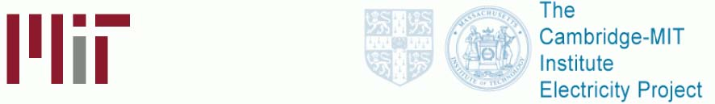

         xml

               user

               1423class25.doc

         2005-10-12T11:09:24+08:00

         pdfFactory Pro www.fineprint.com.cn

         pdfFactory Pro 2.30 (Windows XP Professional Chinese)

# 14.23政府产业规制

# 

第 25课：结论和考试大纲

# 总结 

# 

- l经济规制涉及对产品价格和销售数量的控制，它运用各种经济手段（例如：许可证交易）以达到最佳经济效益。 

- l这里存在着许多好的有关规制的经济分析，提出了如何有效激励利润最大化公司完成社会目标？ 

- l实践中，由于规制常常产生负面影响，因此许多国家都倾向于放松规制。 

- l对规制进行社会成本收益分析相当重要，然而令人惊奇的是，这样的分析在美国却相当少。 

- l通过对这一课程的学习，你还获得了哪些启示？

- l复习课堂上提到的所有计算题和问题，确信你能轻松解答这些模拟题。 

- l其中 1道计算题将直接取自以前提到的问题，期中考试占最后成绩的 1/3。 

- l确保你掌握了课堂上所提到的每一个受

# 如何准备期末考试 

# 

规制行业的基本情况： –行业的基本轮廓 –为什么它会受到规制 –为什么要放松规制（如果出现这种情

形） –它受到哪种类型的规制（例如：价格规制、进入规制） –规制的经济影响（从效率、做应做的事的能力、利润等几面来分析）。 –考试难度与课堂上所授内容的难度相当。

- l你不必记住所有政府规制机构名称的缩写、规制名称和规制日期（以及诸如此类的内容）。 

- l试题包括三部份： 

––第一部份：包括 6道简答题，每题 5分，简明扼要地回答每一问题，计算题应有简短的解释。 

––第二部份：包括 2道计算题，每题 25分，计算应给出详细的步骤和简短的解释。 

––第三部份：1道分析题，40分。

- l电力 

- l有线电视 

- l固定电话 

- l移动电话 

- l潜在竞争市场：铁路运输、公路运输和航空运输 

- l美国空气污染规制 

- l医药业 

- l电子音乐产业

- 厂商理论回顾：垄断，寡头，社会剩余，政府干预，无谓损失，策略竞争：限制性定价、动态进入遏制。你不仅要熟悉这些模型，而且还要能运用它们解答简单的计算题。 

- 规制动机：经济、公共利益、俘虏理论。你不仅要了解它们是什么，而且还要能知道如何区别它们。规制的成本与收益。

3、公有制：公有制的历史根源、赞成公有制的一些理由（例如：出现产品质量不能得到保证的情形，地方政府担心的腐败问题），私有制的优势、私有化的目的与影响。 

4、自然垄断规制：定价策略（平均成本定价法、边际成本定价法、分摊成本定价法（FDC）、拉姆齐定价法(Ramsey)、峰谷定价法(Peak-load)），定价策略的结果（交叉补贴、增支成本、吸脂、无效率）；回报率规制（如何实施、结果（例如 A-J效应、无效率））。电力发电厂案例5、我们需要规制吗？有线电视特许经营权拍卖案例。特许经营权拍卖的结果如何？我们按边际成本定价了吗？我们需要担心它的产品质量吗？有线电视案例。 

6、动态市场（1）：技术的作用及其对自然垄断规制的影响（需求量变化、固定成本和变动成本变化，这些变化会或多或少地影响其保持成为自然垄断行业吗？）有线长途通讯案例。

7、动态市场（2）：通用标准和经济发展的重要性，频谱使用权分配，拍卖理论，价格由参与拍卖的公司数量决定，定价不受拍卖费高低影响的独立性，英式拍卖、荷式拍卖，欧洲第 3代移动电话案例。 

8、对潜在竞争市场的规制：价格规制，进入规制，规制对市场、在位企业、潜在进入企业的经济影响。海运和空运案例9、规制困境：市场结构如何影响绩效，规制为什么可能产生负面影响，调整规制的社会成本效益分析。加州电力危机和英国解除对铁路的规制案例。 

10、外部性和公共产品：科斯理论运用（在什么时候有效，失败的潜在可能原因），税收，补贴，（价格与产量的冲突：在不同的污染者之间发生了什么变化？在不确定情况下发生了些什么变化？），庇古税（手段选择），许可证交易。对生命价值和安全等非市场品的定价（内涵资产定价法、旅行费用法、意愿调查价值评估法，并对它们进行比较）。选择权价值。成本效益分析的运用与否。SO2和 CO2案例。

11、专利：我们为什么需要专利？什么可能激励公司进行创新？在一个竞争市场上，专利是否重要？在一个非竞争市场上又如何呢？最优专利期，参与专利竞争的最优公司数目，市场上有完全替代品时的创新。药品案例。 

12、版权：版权保护，非法拷贝的经济危害，网络如何影响拷贝？拷贝价值计算。音乐产业案例。
