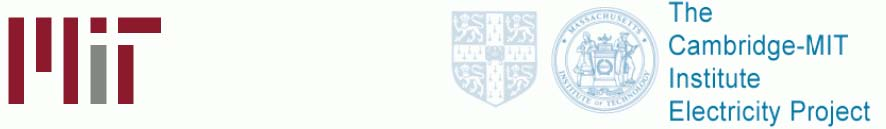

         xml

               user

               1423class26.doc

         2005-10-12T11:12:44+08:00

         pdfFactory Pro www.fineprint.com.cn

         pdfFactory Pro 2.30 (Windows XP Professional Chinese)

第 26课：期末考试考前复习

麻省理工大学 &amp;剑桥大学

# 去年期末考试试题 

- l摸拟回答 1-6题 

- l摸拟回答 7-8题 

- l论述第 9题

第 1题：在一个城市推行污染规制的典型方法就是“倒推法”（ Rollback Method）。第一步，确定该市对某一特定污染物的最大涵容能力 Xs；第二步，找到该市当前这一污染物的实际排放量 Xm。推测起来目前应是 Xs＜Xm这样一种情形（否则就不会有什么问题），于是，规制要求城里的污染制造者把当前的排染水平 em降低到可涵容水平 es，使得 es=em=(Xs/Xm)＝。试讨论这一方法的可行性。

第 2题：克莉丝（Chris）受雇为剑桥市设计一个处理有害物质的垃圾填埋场。目前她正考虑是否值得花费 100万美元安装一个专用管道。如果安装这一专用管道，发生泄漏的可能性将从 0.001降低到 0.0001。据估计，如果一旦发生泄漏，剑桥市致癌人数将增加 100人。假设克莉丝现建议安装这一专用管道。请问，克莉丝对于一个人的价值的估算至少是多少？（请用数字来说明）

第 3题：由于通过微波传输站比通过电线发送长途电话信号需要更少的固定成本，因此，20世纪 50年代微波传输技术的发展经常被作为是使长途电话市场不再是自然垄断行业的一种解释。然而，到了 90年代，微波传输站在很大程度上却又被光缆所替代，这意味着两地之间长途电话网络通过光缆连接。请问，即使有了这次技术变革，为什么长途电话业仍不是自然垄断行业？

第 4题：德姆塞茨（Demsetz）提出了一种避免自然垄断规制的方法：即通过特许权拍卖，使持有者成为某一特定市场的垄断者。请问，通过特许权拍卖这一方式一定能产生有效的结果吗？并说明理由。

第 5题：在航空业受到规制期间，机票价格被定在成本之上，同时航空公司不能进行价格竞争。请问，实施这种规制对航空公司提供的食品质量和安全保障会产生什么样的影响？你能证明航空公司在这两个方面的应对措施是合理的吗？

第 6题：在洛杉矶大城市群郊外的一个小社区，有一家大的炼油厂建在社区小学街对面。炼油厂排放出的污染物对学校里的学生存在着潜在威胁。但是，由于社区与炼油厂关系相处很好，同时炼油厂业主的孩子也在社区小学就读。为此社区与炼油厂达成协议，规定了污染排放的最高限度。作为回报，炼油厂捐款为学校的孩子们修建了室内运动场。加州州长最近知道了炼油厂与学校比邻而居这一事件，决定对炼油厂排放的每一单位污染物征税。评论加州州长的这一政策决定。 

# 2002年期末考试

# 

7、(25分)市场上仅有一家拉链生产厂家，其成本函数为C(q) = 50 +2q，市场需求函数为D(P) = 100 – P。有大量的潜在新企业想进入这一市场，每一潜在进入企业与在位企业有相同的成本函数。按照贝恩-索罗斯假定（Bain Sylos postulate）求解以下各题，在位企业的产量用qi表示。

- （1）试推导潜在进入企业面临的剩余需求函数？

- （2）假设现有企业的产量为qi，如果一个潜在新企业进入市场，那么潜在进入企业的产量为多少？

- （3）计算限制性定价？

- （4）如果我们假定在位企业预期实现古诺模型中提出的解决方案（Cournot Solutions），而不是按照贝恩 -索罗斯假定求解，那么，潜在进入企业会依赖在位企业的产量qi吗？会有新企业进入吗？（不需要用数字回答，仅给出合理的解释）

第8题：假设市场上有数量不受限制的公司竞相开发一种低热能的脂肪替代品，它不但令你尝起来味道很好，而且对你身体有益（不，它不是Olestra）。每一家公司都只能从事一项这类产品的开发。已知进行这一项目研发有一个不变的边际成本1。每一公司研发成功可能性为P，它是参与竞争的公司数量的函数，即P=1-e-0.5085n。如果新产品研发成功，产品定价将极具竞争性，总剩余现值为 25美元。产品研发只能在今年进行，如果产品不能在今年开发出来，以后将不再开发。

- （1）从社会角度出发，找到参与研发的公司的最优数目？

- （2）假设存在一个具有竞争性的研发产业，参与竞争的公司数目n由“零利润条件”（Zero profit condition）决定。“零利润条件”，是指参与竞争的公司没有进入壁垒，可以自由进入。假设每一个公司研发成功可能性相等。试论证：如果政府承诺给予最先研发出这种药品的公司以全部社会收益25元，那么将有25个公司参与这一研发项目的角逐。

- （3）简要解释为什么第（ 1）问中得出的公司数目与第（2）问中参与专利竞争的公司数目不同？

9、有毒物质排放清单（Toxics Release Inventory （TRI））是美国环境保护署制定的一项规制措施，它强迫制造厂定期在环境保护署负责维护的数据库上公开有毒物质的排放情况和数据。在没有实行这项规制以前，全国没有关于有毒物质的排放记录，尽管有害物质的储藏、运输和处置受到基于命令与控制的行政规制，但除此之外就没有其它的正式规制。制造厂无论使用或生产有毒物质排放清单中列出的600种有毒物质，在超过一定限度时都必须申报。比如二氧 (杂)芑（一种致癌物质）、氨水（一种常见的家用清洁剂）、砷（一种金属，如果误吞或吸收，将致命）等有毒物质的排放就必须申报。有毒物质的排放清单是自我申报系统，即厂商申报自己的有毒物质排放情况与数据。自从1987年开始实施这项规制以来，全国每年申报的有毒物质排放量（以吨计）第9题：已经降了40%以上。环境保护署宣称有毒物质排放清单规制已经取得重大成功。

根据以下问题讨论这一规制：（ 1）环境保护署实施有毒物质排放清单规制，而不再采用基于命令与控制的行政规制的潜在动机是什么 (包括效率)？（2）这项规制在理论上预期发挥什么作用（包括规制对降低有毒物质排放量的潜在效率）？（3）实施强制申报有毒物质排放这一措施的潜在不足？

尽量用课堂上学到的实例和证据来支持你的观点。

- l本次考试为闭卷考试，不得带任何书和笔记。 

- l考试在上午9点整准时开始。 

- l如果迟到将不准参加考试。 

- l考试在中午12点准时结束。 

- l请带上笔和普通计算器（不具有科学计算功能）。

-  2003年期末考试 ––第30课上午9点正
