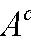
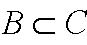
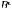

         Acrobat Distiller 7.0 (Windows)

         微软中国

         D:20071118112816

         Acrobat PDFMaker 7.0 for Word

         2007-11-18T19:31:01+08:00

         2007-11-18T19:30:36+08:00

         2007-11-18T19:31:01+08:00

         uuid:4ded98c1-c88a-4ee9-ac1d-a7b98984bbeb

         uuid:502b7094-42e6-45ca-b7e8-fb0aedb13f1f

               45

         xml

               第一讲

               猪猪猫.CN

第1讲* 
集合论与概率论 
麻省理工学院 14.30 2006年春季 
Herman Bennett 

1 集合论 

1.1 基本概念和定理 

- 1. 随机试验：任何结果具有不确定性的行为或过程。 

- 2. 样本空间：随机试验（设为S）的所有可能结果（或元素）的集合。[有限对无限；离散对或连续] 

1

注意：这些讲义不一定是自封的。它们只是对讲座的一种补充而不是替代。 

)A(P)(1和BAP

也分别被叫做后验和先验。 

- 3. 随机事件：包含在样本空间（S）中的元素（子集A，B等）的集合。 

- 4. s∈S：随机实验s的结果属于样本空间S。反之，则用符号∉来定义。 

- 5. 

}{∅=

- ：定义为空集(没有元素的集合)。它也定义为不可能事件的元素集合；例如：掷骰子时出现负点数事件。 

- 6. 事件与事件的并：事件A与B的并是指属于事件A或事件B或同时属于两事件的所有元素的集合，用A∪B表示。[A∪B={x：x∈A 或 x∈B}] 
性质：A∪A=A；  A∪S=S；   A∪∅=A 

- 7. 事件与事件的交：事件A与B的交是指既属于事件A也属于事件B的元素集合，用 A∩B表示。 [A∩B={x： x∈A且x∈B}] 
性质：A∩A=A； A∩S=A； A∩

∅

=

∅

- 8. 对立事件：事件A的对立事件是所有不属于事件A的元素集合，表示为

cA

(等价于。 [

'A

cA

性质：；；；；

AAcc=)(

Sc=θ

θ=cS

SAAc=∪

AAAc=∩

- 9. 事件的包含

：如果事件A的每个元素也包含在事件B中，那么事件A包含于事件B，记作

性质：如果

 且

 ，则

BA=

； 
如果

且 ，则； 

CB⊂

CA⊂

对于任何事件 A，则。 

A∅⊂

- 10. .事件与事件的不相容： 如果事件A 与B 没有共同的元素，那么事件 A 和事件B不相容，或者相互排斥。 [A∩B=∅，则A 和 B为不相容事件] 

- 11. 互为穷举：如果事件A 与 B的并是S，那么事件A与B互为穷举。[A∪B=S，则A 和 B 是互为穷举事件] 

- 12. 最后，附加的结论(作业：思考如何用文氏图来表示） 

–交换律：:A∪B=B∪A；A∩B=B∩A. 
–结合律：A∪(B∪C)=(A∪B)∪C；A∩(B∩C)=(A∩B)∩C. 
–分配律：A∩(B∪C)=(A∩B)∪(A∩C)；A∪(B∩C)=(A∪B)∩(A∪C). 
–摩根定理：； . 

cccBABA∩=∪)(

cccBABA∪=∩)(

2  概率论 

2.1 概率的定义 

事件A发生的可能性有多大？我们用事件A 发生的概率来表示事件将要发生的可能性，记作P(A)，它的取值在0到1之间的任意数。 
概率函数的数学定义是以三个公理为基础的，它是基于概率的直观概念。[P()：{所有可能事件的集合}→[0，1]] 
–公理1：对任一事件A，必有 P(A)≥0(非负数)。 
–公理2：必然事件的概率P(S)=1。 
–公理3：对于任意一组不相容事件A1， A2，...， An，则有

， 
        n是该组不相容事件集的总数量。 
性质(对于事件A和事件B)： 
–； P(A∪B)=P(A)+P(B)—P(A∩B)；P(

)(1)(cAPAP−=

∅

)=0； 
–如果A和B是不相容的，那么P(A∩B)=0； 
–如果

BA⊂

，那么。 

)()(BPAP≤

例2.1. 证明P(A∪B)=P(A)+P(B)—P(A∩B)。 

2.2等概率事件---（即概率相等）时，计算P(A)的方法 

                                （1） 
N为包含于集合S中的结果总数。N(A)为包含于事件 A中的结果总数。 
当样本空间很小，且每个结果等概率（概率相等）时，只要统计发生次数即可。例如，掷一枚骰子：N=6， P(3)=1/6。如果你遇到的问题不是这么简单，可以用下面的方法来计算概率。 

- 1. 一般乘法法则：如果一个过程分为多个阶段（阶段的总数为K），第i个阶段的完成方法有 种，无论前面阶段发生什么结果，这一过程本身有种完成方法。注意每个阶段的选择不一定是相同的。（虽然它们可以相同） 

in

knnn...21

例2.2 假设盒子里包含7种不同颜色的球。如果每个球在取出后立即放回，那么从盒子中取出3个球有多少种方法？ 

- 2. 排列：假设从n个物品中不放回地抽取k个物品，排列的总数（意味着与顺序有关）为n(n-1)...(n-k+1)。推广公式为

)!(!,knnPnk−=

[如例2.2中 为

3,77!765(73)!P==•−

- ] 

例 2.3.  4只不同的狗有多少种排列方法？从10只狗中的选出4只不同的狗，有多少种选法？ 

- 3. 组合：现在假设试验的方法如前面所述，从总数为n的物品中不放回地抽取k个物品。组合的总数（意味着与顺序无关）为

)!(!!,knknCnknk−=⎟⎠⎞⎜⎝⎛=

，读作“从n中选择k”；表示从n个物品集合中抽取k个物品的方法数目。[如例2.2.中为

⎟⎠⎞⎜⎝⎛nk

)!37(!3!77,3−=C

 例 2.4. 从一套5本书中挑选出3本书有多少种可能的组合？从一套5本书中挑选出5本书有多少种可能的组合(注意：不同于排列) 
总结：当简单数数不太现实时，我们用1-3的方法计算样本空间中包含的结果总数N，然后计算事件A 包含的结果总数N(A)，这样，我们就可以计算出P(A)。  
例2.5. 一副52张的纸牌有4张A 。假定你分给4位牌手每人13张牌。每个牌手刚好得到一张A 的概率是多少？ 
例 2.6. 抛一枚均匀硬币7次。出现3次正面的概率是多少？至少出现3次正面的概率是多少？ 

2.3 条件概率 

当不能确定一项试验的精确结果时，我们就使用概率来描述。然而，这并不意味着我们对试验过程一无所知。一个事件的概率P(A)是在已知信息基础上得到的。同时，我们还可以获得一些新的信息修正我们的判断（即概率）。条件概率，即P(A|B)，是指得到新信息后做出的新判断，在这里新信息指的是事件B的发生。

2

定义： 

)()()(BPBAPBAP∩=

， P(B)&gt;0                 （2） 
注意： 

-  如果事件不相容且为互为穷举，那么： 

kAAA,...,21

1)...()(21=++BAPBAP

并且 

)()()(1BPAPABPikii=∑=

（全概率公式） 

贝叶斯定理：把样本空间S分成k个不相容且互为穷举事件，这样P()&gt;0。令事件B满足P(B)&gt;0，那么， 

kAAA,...,21

iA

1()()(()()()()iiiikiiiPBAPAPABPABPBPBAPA=⎛⎞∩==⎜⎟⎝⎠∑条件概率全概率公式

        （3） 
这种更新事件A概率的方法叫做贝叶斯更新法。 
例2.7. 市场上有一种叫MP∞的新的数字播放音乐设备。因为是新产品，所以并不是100%可靠。假定知道该新设备中20%不好用，30%的寿命只能持续使用1年，而其余的可以使用5年。如果你买了一个新的MP∞并且好用，它能使用5年的概率是多少？ 

2.4 独立性 

如果

)()(APBAP=

，那么事件A 和B 就被称为是相互独立的；否则，就是相关的。 

-  例如，抛一枚均匀的硬币2次，第2次抛硬币出现正面H或反面T的概率并不取决于第1次出现H或T。换句话说，第1次抛硬币的结果并没有为第2次抛硬币的结果提供任何附加的信息，即P(A|B)=P(A) 
-  如果事件A和B是相互独立的，那么 P(A∩B)=P(A)P(B)(根据条件概率的定义). 
-  如果事件A和B是相互独立的，那么A和

也是相互独立的，即[。 

)]()()(ccBPAPBAP=∩

-  两个或两个以上事件互为独立的推广定义：对于k≤n事件的所有可能子集，如果

)()...()()...(kjikjiAPAPAPAAAP=∩∩

。那么，事件相互独立。 

nAAA,...,,21

例2.8. 关于掷骰子试验的事件：A={2，4，6}，B={1，2，3，4}，C={1，2，4}。事件A和B是相互独立的吗？事件A和C呢？ 
