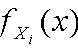

         Acrobat Distiller 7.0 (Windows)

         math

         D:20071118124212

         Acrobat PDFMaker 7.0 for Word

         2007-11-18T20:44:01+08:00

         2007-11-18T20:43:24+08:00

         2007-11-18T20:44:01+08:00

         uuid:29b75712-f03e-4eb1-94e9-778126dfc12b

         uuid:3a34e17a-8f1e-4216-afc7-71072fcedece

               16

         xml

               第七讲

               Administrator

第7讲* 
   随机抽样 
麻省理工学院 14.30 2006年春季 
Herman Bennett 

17 定义 

17.1 随机样本 

    若是相互独立的随机变量，那么，对

nXX,...,1

ij∀  ≠

，有，记作。那么，集合称为总体的一个样本容量为的随机样本。 

)()(xfxfjiXX=

)()(xfxfiX=

nXX,...,1

)(xf

n

例子： 
 ---掷1枚骰子n次。 
 ---挑选10个麻省理工的学生，测量他们的身高。 

-  放回和不放回抽样：从一个大样本总体中抽样（“近似相互独立”）。 

-  另外，这一集合（或抽样）也被称为

nXX,...,1

概率质量/密度函数为的独立同分布随机变量

()fx

-  注意仍然要区别

X

和

x

- （我们继续研究随机变量）。 

注意：这些讲义不一定是自封的。它们只是对讲座的一种补充而不是替代。 

17.2 统计量 

随机变量是来自总体中样本容量为的随机样本。那么，任何实值函数称为一个

nXXX,...,,21

)(xf

n

),...,,(21nXXXrT=

统计量。 

-  记住是随机变量，因此T也是一个随机变量，其概率质量/密度函数，它可以取任何实值t。 

nXXX,...,,21

)(tfT

17.3 样本均值 

样本均值，记为

nX

，定义为一个样本容量为的随机样本的算术平均值统计量。 

n

∑==+++=niinnXnnXXXX121_1...

               (52) 

17.4 样本方差 

样本方差，记为，定义为如下统计量： 

2nS

21_2)(11∑=−−=niinXXnS

              (53) 
样本标准差统计量定义为

2nnSS=。

1

-  记住，统计量的观测值用小写字母来表示。因此，和就是随机变量的观测值。 

,,2sx−

s

S,2和SX−

1 样本方差和样本标准差有时又分别用

^^2σσ和

来表示。 

18 样本均值分布和样本方差分布的重要性质 

18.1 

2SX和

的均值和方差 

    是来自总体的样本容量为n的随机样本，总体均值为

nXX,...,1

)(xf

μ

（有限的），方差为（有限的）。那么， 

2σ

.0)S(Var,)(,)(,)(2n222→===∞→−−且nXVarSEXEσσμ

         (54) 

-  标准差为：

）（−XVar

例18.1. 证明式（54）的前三个命题。 

18.2 正态总体随机样本的特殊情况 

 是一个来自总体的样本容量为n的随机样本。那么， 

nXX,...,1

),(2σμN

- a. 是独立的随机变量。                                    (55) 

2S和−X

- b. 

−X

服从

()2,/Nμσ

- 分布。                                     (56) 
- c. 

22)1(σSn−

服从分布。                                     (57) 

()21nχ−

例 18.2. 证明式(56)。 

18.3 极限结论（） 

∞→n

这些概念被广泛运用于经济学中。 

18.3.1（弱）大数法则 

若为独立同分布（随机抽样）的随机变量，均值

nXX,...,1

μ=)(iXE

（有限），方差为（有限）。定义

2)(σ=iXVar

∑===niinXnX11

。那么，对任意

0&gt;ε

，都有 

.1)(lim=&lt;−−∞→εμnnXP

                     (58) 
这个结论也可表示为， 
                  （以概率收敛于

μpnX→−

−nX

μ

）                (59) 
例 18.3. 利用切比雪夫不等式，证明式（58）。注意可用类似方法加以证明。 

22σpS→

18.3.2 中心极限定理 （CLT） 

   是独立同分布（）的随机变量，均值

nXX,...,1

..iid

μ=)(iXE

（有限），方差为（有限）。设

2)(σ=iXVar

∑===niinXnX11

。那么，对任意

),(+∞−∞∈x

，都有 

)(21))((lim22xexXnpxxnnΦ==&lt;−−∞−−∞→∫πσμ

          (60) 
其中是标准正态分布的累积分布函数。 

()Φ

用文字解释：由式(56)可知，如果服从正态分布，则样本均值统计量也将服从正态分布。式（60）表明：如果

iX

−nX

∞→n

，则无需考虑这些的分布，样本均值统计量的函数

iX

σμ)(−nXn

都将服从正态分布。 
实际应用（１）…如果足够大，即使不知道随机样本的分布情况，也可以推测出的函数，

n

)(xfiX

−nX

σμ)(−−nXn

的分布。［这是一个很强的结果］ 
实际应用（２）…若

σμ)(−=−nxnZ

且足够大，则 

n

))(())((σμσμ−Φ≈−−−nnZxnxnF

          (61) 

⇓

),(~)1,0(~)(2nNXNXnananσμσμ−−−或者

 ()   (62) 

近似地:a

…无需考虑概率质量/密度函数的分布！ 

)(xfiX

-  的取值越大，近似值效果越好。但是，的值多大是“足够大”？对此没有严格的事先限定，它取决于的基本（总体）分布。的钟形分布曲线越窄，说明的值越大。根据过去经验，对于的取值，一些学者遵循经验法则：。 

n

n

)(xfiX

)(xfiX

n

n

30≥n

-   放大镜（详见模拟） 

例18.4. 一个天文学者爱好测量从他的天文台到一颗遥远的星星的距离（单位光年）。由于不断变化的大气状况和测量误差，每一次测量的结果都不能作为准确的距离。所以，该天文学者计划进行多次测量，然后用它们的平均值作为估计的距离。他相信测量值是独立同分布的，均值为（实际距离），方差为4（光年）。那么，需要进行多少次测量才可能保证估计的距离与准确距离之间相差光年？ 

d

5.0±
