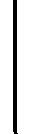

         2006-10-09T22:43:28-05:00

          TeX output 2006.10.09:2243

         2006-10-20T18:30:14-04:00

         2006-10-20T18:30:14-04:00

         dvipdfm 0.13.2c, Copyright © 1998, by Mark A. Wicks

         xml

         uuid:221b40eb-e590-402e-be54-275d01d13e44

         uuid:2ba17ef9-c08f-4a20-8a97-97a7898aa8de

MIT 14.30 Spring 2006Herman Bennett

Given a parameter with unknown value, the goal of point estimation is to use a sample to compute a number that represents in some sense a good guess for the true value of the parameter. 

## 19 Definitions 

### 19.1 Parameter 

A pmf/pdf can be equivalently written as fX (x) or fX (xθ), where θ represents the constants 

|

that fully define the distribution. For example, if X is a normally distributed RV, the constants µ and σ will fully define the distribution. These constants are called parameters and are generally denoted by the Greek letter θ. 1 

Example 19.1. 

- Normal distribution: f(x|θ) ≡ f(x|µ, σ), 2 parameters: θ1 = µ and θ2 = σ; 
- Binomial distribution: f(x|θ) ≡ f(x|n, p), 2 parameters: θ1 = n and θ2 = p; 
- Poisson distribution: f(x|θ) ≡ f(x|λ), 1 parameter: θ = λ; 
- Gamma distribution: f(x|θ) ≡ f(x|α, β), 2 parameters: θ1 = α and θ2 = β. 

### 19.2 (Point) Estimator 

A (point) estimator of θ, denoted by θ, ˆis a statistic (a function of the random sample): 

θˆ= r(X1,X2, ..., Xn). (63) 

∗Caution: These notes are not necessarily self-explanatory notes. They are to be used as a complement to (and not as a substitute for) the lectures. 1Another way of saying this: parameters are constants that index a family of distributions. 

process of each Xi. 

A (point) estimate of θ is a realization of the estimator θˆ(i.e.: a function of the realization of the random sample): 

θˆ= r(x1,x2, ..., xn). (64) 

Example 19.2. Assume we have a random sample X1, ..., X10 from a normal distribution N(µ, σ2) and we want to have an estimate of the parameter µ (which is unknown). There is an infinite number of estimators of µ that we could construct. In fact, any function of the random sample could classify as an estimator of µ, for example: 

θˆ= r(X1,X2, ..., X10)= 

⎧

⎪⎪⎪⎪⎪⎪⎪⎪⎪⎪

⎨

⎪⎪⎪⎪⎪⎪⎪⎪⎪⎪

⎩

X10 

2 

X10+X1 

2 

¯1 �10

X = 10 i=1 Xi 1.5X2 etc. 

Example 19.3. Assume a random sample X1, ..., Xn from a U[0,θ] distribution, where θ is unknown. Propose 3 different estimators. 

Since there are many possible estimators, we need to define some characteristic in order to evaluate and rank them. 

### 20.1 Unbiasedness 

An estimator θˆis said to be an unbiased estimator of the parameter θ, if for every possible value of θ: 

E(θˆ) = θ (65) 

If θˆis not unbiased, it is said to be a biased estimator, where the difference E(θˆ) − θ is called the bias of θˆ. 

• If the random sample X1, ..., Xn is iid with E(Xi)= θ, then the sample mean estimator 

n

θˆ= X¯n =1 Xi (66) 

n 

i=1 

is an unbiased estimator of the population mean: E(X¯n)= θ (see Example 18.1 in Lecture Note 7). 

• If the random sample X1, ..., Xn is iid with E(Xi)= µ and V ar(Xi)= θ, then the sample variance estimator 

θˆ= S2 =1 

n 

n

n − 1 

i=1 

(Xi − ¯

Xn

)2 

(67)

is an unbiased estimator of the population variance: E(S2)= θ (see Example 18.1 in Lec

<Table>
<TR>
<TH>ture Note 7). </TH>
</TR>
<TR>
<TD>Example 20.1. Let Xi estimator of θ as: </TD>
<TD>∼ U [0, </TD>
<TD>θ]. n</TD>
<TD>Assume a random sample of size n and define an </TD>
</TR>
</Table>

θˆ= 2

Xi. 

Is θˆbiased?

n 

i=1 

3 

### 20.2 Efficiency 

Let θˆ1 and θˆ2 be two unbiased estimators of θ. θˆ1 is said to be more efficient than θˆ2, if for a given sample size n, 

V ar(θˆ1) &lt; Var(θˆ2) (68) 

Where V ar(θˆi) is the variance of the estimator. 

Let θˆ1 be an unbiased estimator of θ. θˆ1 is said to be efficient, or minimum variance unbiased estimator, if for any unbiased estimators of θ, θˆk, 

V ar(θˆ1) ≤ V ar(θˆk) (69) Do not confuse the variance of the estimator θˆ, V ar(θˆ), with the sample variance esti

• 

mator S2, which is an unbiased estimator of the population variance σ2(!). 

Example 20.2. How would you compare the efficiency of the estimators in Example 19.2? Which of these estimators is unbiased? 

### 20.3 Mean Squared Error 

Why restrict ourselves to the class of unbiased estimators? The mean square error (MSE ) specifies for each estimator θˆa trade off between bias and efficiency. 

MSE(θˆ) = E[(θˆ− θ)2]= V ar(θˆ) + (bias(θˆ))2 (70) 

θˆis the minimum mean square error estimator of θ if, among all possible estimators of θ, it has the smallest MSE for a given sample size n. 

5−nnn� 

### 20.4 Asymptotic Criteria 

#### 20.4.1 Consistency 

p

Let θˆbe an estimator of θ. θˆis is said to be consistent if θˆ−→ θ (Law of Large Numbers; Lecture Note 7). 

Example 20.4. Assume a random sample of size n from a population f(x), where E(X)= µ (unknown). Which of the following estimators is consistent? 

1

1

1

µˆ1 Xi µˆ2 Xi µˆ3 Xi 

=

=

=

n − 5

i=1 

n − 5

i=1 

n

i=1 

• MSE → 0 as n →∞ = ⇒ consistency. 

#### 20.4.2 Asymptotic Efficiency 

Let θˆ1 be an estimator of θ. θˆ1 is is said to asymptotically efficient if it satisfies the definition of an efficient estimator, equation (69), when n →∞. 

The following are two standard methods used to construct (point) estimators. 

### 21.1 Method of Moments (MM) 

Let X1,X2, ..., Xn be a random sample from a population with pmf/pdf f(xθ1, ..., θk), where

|

θ1, ..., θk are unknown parameters. One way to estimate these parameters is by equating the first k population moments to the corresponding k sample moments. The resulting k estimators are called method of moments (MM) estimators of the parameters θ1, ..., θk. 2 

The procedure is summarized as follows: 

<Table>
<TR>
<TH>⎧<Figure ActualText="⎪ ">

⎪⎪⎪⎪⎪⎪⎪⎪⎪⎪⎪⎪⎪⎪⎪⎪⎪⎪⎪⎪⎪⎪⎪⎪⎪

</TH>

<TH>Population moment </TH>
</TR>
<TR>
<TH>System of equations: </TH>
<TD>Sample moment </TD>

<TD>(theoretical) </TD>
</TR>
<TR>
<TH>k equations and </TH>

</TR>
<TR>
<TH>k unknowns </TH>
<TD>1 n �n i=1 Xi </TD>
<TD>= </TD>
<TD>E(X1 i ) </TD>
<TD>First moment </TD>
</TR>
<TR>
<TH>= ⇒ </TH>
<TD>yields θˆ 1, ..., θˆ k </TD>
<TD>⎨ </TD>
<TD>1 n �n i=1 X2 i </TD>
<TD>= </TD>
<TD>E(X2 i ) </TD>
<TD>Second moment </TD>
</TR>
<TR>
<TH>Note that i) E(Xj i ) = gj (θ1, ..., θk) <Figure ActualText="⎪ ">

⎪⎪⎪⎪⎪⎪⎪⎪⎪⎪⎪⎪⎪⎪⎪⎪⎪⎪⎪⎪⎪⎪⎪⎪⎪

</TH>
<TD>1 n �n i=1 X3 i </TD>
<TD>= </TD>
<TD>E(X3 i ) </TD>
<TD>Third moment </TD>
</TR>
<TR>
<TH>ii) the realization of the sample moment </TH>
<TD>. . . </TD>
<TD>. . . </TD>
<TD>. . . </TD>

</TR>
<TR>
<TH>is a scalar. </TH>

</TR>
<TR>
<TH>⎩ </TH>
<TD>1 n �n i=1 Xk i </TD>
<TD>= </TD>
<TD>E(Xk i ) </TD>
<TD>kth moment </TD>
</TR>
</Table>

2This estimation method was introduced by Karl Pearson in 1894. 

Example 21.2. Assume a random sample of size n from a gamma distribution: f(x)= Γ(α1)βα xα−1e−x/β for 0 &lt;x&lt; ∞. Assume also that the random sample realization is 

1 12

characterized by n �ni=1 xi =7.29 and n �ni=1 xi = 85.59. Find the MM estimators of α and β (parameters). Remember that E(Xi)= αβ and Var(Xi)= αβ2 . 

### 21.2 Maximum Likelihood Estimation (MLE) 

Let X1,X2, ..., Xn be a random sample from a population with pmf/pdf f(xθ1, ..., θk),

|

where θ1, ..., θk are unknown parameters. Another way to estimate these parameters is 

finding the values of θˆ 1, ..., θˆ k that maximize the likelihood that the observed sample is 

generated by f(xθˆ 1, ..., θˆ k).

|

The joint pmf/pdf of the random sample, f(x1,x2, ..., xnθ1, ..., θk), is called the likelihood

|

function, and it is denoted by L(θx).

|

L(θx)= L(θ1, ..., θkx1, ..., xn)=

||

⎧

⎪⎪

⎨ 

⎪⎪

⎩

f(x1, ..., xnθ1, ..., θk) generally

|

f(xiθ1, ..., θk) random sample (iid)

�ni=1 |

Where θ and x are vectors such that θ =(θ1, ..., θk) and x =(x1, ..., xn). 

For a given sample vector x, denote θˆMLE (x) the parameter value of θ at which L(θx)

|

attains its maximum. Then, θˆMLE (x) is the maximum likelihood estimator (MLE) of the (unknown) parameters θ1, ..., θk. 3 

Intuition: Discrete case. 

• 

3This estimation method was introduced by R.A. Fisher in the 1912. 

• Does a global maximum exist? Can we find it? Unique?...Back to Calculus 101: 

∂L(θx)

foc : ∂θi |=0,i =1, ..k (for a well behaved function.) 

You also need to check that it is really a maximum and not a minimum (2nd derivative). 

• Many times it is easier to look for the maximum of LnL(θ|x) (same maximum since is a monotonic transformation...back to Calculus 101). 

Invariance property of MLE: ˆτMLE (θ)= τ(θˆMLE ).

• 

• For large samples MLE yields an excellent estimator of θ (consistent and asymptotically efficient). No wonder it is widely used. 

But... 

• 

i) Numerical sensitivity (robustness).ii) Not necessary unbiased.iii) Might be hard to compute.

Example 21.4. Assume a random sample from a U(0,θ) population, where θ is unknown. Find θˆMLE . 
