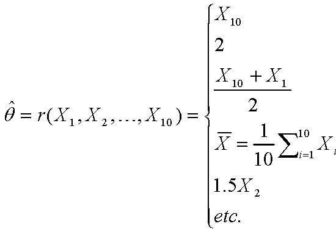
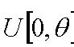
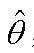
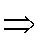
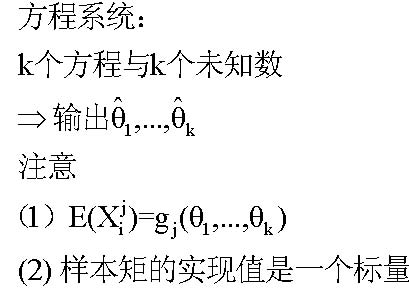
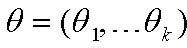
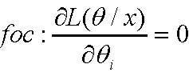

         Acrobat Distiller 7.0 (Windows)

         D:20071118125538

         Acrobat PDFMaker 7.0 for Word

         2007-11-18T20:57:08+08:00

         2007-11-18T20:56:20+08:00

         2007-11-18T20:57:08+08:00

         uuid:e8c55d53-5637-4916-a861-2d7dc837c581

         uuid:eb4ea988-7427-48c7-8dbe-87f719a2a65b

               38

         xml

               第八讲 点估计量与点估计方法 

第8讲* 
   点估计量和点估计方法 
麻省理工学院 14.30 2006年春季 
Herman Bennett 
假定某一参数值未知的情况下，点估计的目标就是用一个样本计算出一个数值，该数值在某种意义上代表对该参数真实值的优良估计。 

19 定义 

19．1 参数 

概率质量/密度函数可以记作或

)(xfX

)/(θxfX

1

例19.1： 
—正态分布: 

)/(θxfX

=

),/(σμxf

，两个参数：

σθμθ==21,

； 

—二项分布：

)/(θxfX

=，两个参数：

),/(pnxf

pn==21,θθ

 ； 

—泊松分布：

)/(θxfX

=

)/(λxf

，一个参数：

λθ=

； 

—伽玛分布：

)/(θxfX

=

),/(βαxf

,两个参数:

βθαθ==21,

。 

19.2（点）估计量 

θ的点估计量，记作

θ∧

,它是一个统计量（是随机样本的一个函数）： 

),,,(ˆ,21nXXXr…=θ

                         （63） 

注意：这些讲义不一定是自封的。它们只是对讲座的一种补充而不是替代。 

1对此也可以这样解释：参数是一个在同一个分布族中都适用的常数。 

2此估计方法是由卡尔.皮尔逊于1894年提出的。 

3 该估计方法是由R.A.费舍于1912年提出的。 

-  注意的值并不是直接取决于θ，而仅仅是间接取决于每一个的随机过程。 

θˆ

iX

-  的点估计

θ

是一种估计量的实现值（即随机样本实现值的一个函数）： 

θˆ

             。                          （64） 

),,,(ˆ21nxxxr…=θ

例19.2 设样本服从正态分布N，我们想估计参数μ（未知）。我们可以构造出无数个μ的估计量。实际上，任何一个随机样本的函数都可以看作是μ的一个估计量，例如： 

101,,XX…

),(2σμ

⎪⎪⎪⎪⎪⎩⎪⎪⎪⎪⎪⎨⎧=+==∑=.5.110122),,,(ˆ2101110101021etcXXXXXXXXXrii…θ

例19.3 设随机样本服从均匀分布

nXX,,1…

),0(θU

，其中

θ

未知。计算出它的3个不同的估计量。 

20 （点）估计量的评价 

由于有许多可能的估计量，我们需要定义一些性质对它们进行评价和排序。 

20.1  无偏性 

如果对于

θ

的每一个可能值，都有： 

                                                        （65） 

θθ=)ˆ(E

则称估计量是

θˆ

参数的无偏估计量

θ

。 

如果不是无偏的，则称它是一个

θˆ

有偏估计量，其中差值称作的偏差。 

θθ−)ˆ(E

θˆ

-  如果随机样本独立同分布，且

nXX,,1…

θ=)(iXE

- ，则样本均值的估计量 

∑===niinXnX11ˆθ

                                 （66） 

是总体均值的无偏估计量：

θ=)(nXE

（见第7讲中的例18.1） 

-  如果随机样本独立同分布,且

nXX,,1…

μ=)(iXE

,

θ=)(iXVar

- ，则样本方差的估计量 

212)(11ˆnininXXnS−−==∑=θ

                     (67) 

是总体方差的无偏估计量：（见第7讲中的例18.1） 

θ=)(2SE

例20.1 设服从

iX

[θ,0U

。随机样本容量为n，定义

θ

的一个估计量如下： 

∑==niiXn12ˆθ

。 

ˆθ

是有偏的吗？ 

20.2 有效性 

设与是

1ˆθ

2ˆθ

θ

的无偏估计量。如果对于给定容量为n的样本， 

                                                   (68) 

)ˆ()ˆ(21θθVarVar&lt;

则称比

1ˆθ

2ˆθ

更有效，其中是估计量的方差。 

)ˆ(iVarθ

设是

1ˆθ

θ

的一个无偏估计量。如果对于

θ

的任何无偏估计量,， 

kθˆ

)ˆ()ˆ(1kVarVarθθ≤

，                       (69) 

则称是

1ˆθ

有效的,或者是方差最小的无偏估计量。 

-  不要将估计量的方差-,与样本方差估计量相混淆，是总体方差(!)的无偏估计量。 

θˆ

)ˆ(θVar

2S

2S

2σ

例20.2 如何比较例19.2中估计量的有效性?这些估计量中哪些是无偏的? 

20.3均方误差 

为什么强调无偏估计量呢？均方误差（MSE）用于对每一个估计量在偏差和有效性之间进行权衡。 

θˆ

                          (70) 

22))ˆ(()ˆ(])ˆ[()ˆ(θθθθθbiasVarEMSE+=−=

在

θ

的所有可能估计量中，对于给定容量为n的样本，如果有最小的均方误差，则称为

θˆ

θˆ

θ

的最小均方误差估计量。 

例20.3 画图描绘两个估计量的概率密度函数，使第一个估计量的偏差小于其无效性（另一个估计量反之）。 

20.4渐近准则 

20.4.1一致性 

设是

θˆ

θ

的一个估计量。如果，则具有

θθ⎯→⎯pˆ

θˆ

一致性（大数定律：讲义第7讲）。 
例20.4 设来自总体容量为n的随机样本，其中

)(xf

μ=)(XE

（未知）。下列估计量中哪个具有一致性？ 

∑==niiXn111ˆμ

∑=−=niiXn1251ˆμ

∑−=−=51351ˆniiXnμ

-  当时，MSE→0 一致性 

∞→n

⇒

20.4.2渐近有效性 

设是

1ˆθ

θ

的一个估计量。当

∞→n

时，如果满足有效估计量定义，则称它

1ˆθ

渐近有效。 

21 点估计方法 

下面介绍两种用于构造(点)估计量的标准方法。 

21.1矩法估计（MM） 

设是来自总体概率质量/密度函数为

nXXX,,,21…

),,/(1kxfθθ…

的随机样本，其中

kθθ,,1…

是未知参数。一种估计这些参数的方法就是使前k个总体矩与对应的k个样本矩相等。合成k估计量被称作参数

kθθ,,1…

2

计算过程概括如下： 

1kjij1kkkˆˆθ,...,θ1E(X)=g(θ,...,θ)(2) ⇒方程系统：个方程与个未知数输出注意（）样本矩的实现值是一个标量

112213311()1()1()1()1()niiiniiiniiinkkiiiXEXnXEXnXEXnXEXkn====⎧⎪⎪⎪=⎪⎪⎪⎪=⎨⎪⎪=⎪⎪⎪⎪=⎪⎩∑∑∑∑  总体矩样本矩  理论上一阶矩二阶矩三阶矩阶矩

    例21.1 设容量为的随机样本服从总体，其中为未知参数。计算两个参数的矩法估计值。 

n

),(2σμN

2,σμ

例21.2 设容量为的随机样本服从伽玛分布：

n

()()1/1xfxxeαβααβ−−=Γ

，对于。假定随机样本的实现值为

0x&lt;&lt;∞

∑==niixn129.71

，

∑==niixn1259.851

，计算参数

α

和

β

的矩法估计值。记住

αβ=)(iXE

 和。 

2)(αβ=iXVar

21.2 极大似然估计（MLE） 

设是来自总体概率质量/密度函数为

nXXX,,,21…

),,/(1kxfθθ…

的随机样本，其中

kθθ,,1…

是未知参数。估计这些参数的另一种方法就是找到由产生的样本观测值出现的概率为最大的的值。 

)ˆ,,ˆ/(1kxfθθ…

kθθˆ,ˆ1…

随机样本的联合概率密度函数，

),,/,,,(121knxxxfθθ……

,称作似然函数,记作

)/(xLθ

。 

)/(xLθ

=

),,/,,(11nkxxL……θθ

= 

1111(,,/,)(/,,)()nknikifxxfxθθθθ=⎧⎪⎨⎪⎩∏………一般情况随机样本独立同分布

其中

θ

和

x

都是向量,

),(1kθθθ…=

,

),,(1kxxx…=

. 

对于一个给定的样本向量X,当

)/(xLθ

达到最大值时,

θ

的参数值记作。那么称作未知参数

)(ˆxMLEθ

)(ˆxMLEθ

kθθ,,1…

3

-  直观认识:离散型分布的情形 

-  存在总体最大值吗?能找到吗?唯一吗?......参考微积分101: 

0)/(:=∂∂ixLfocθθ

,          

ki…,1=

  (对于一个良态函数来说) 

你需要检验它是否真的是最大值而并非最小值.  (求二阶导数验证) 

-  多数情况下，较容易找到

)/(xLnLθ

- 的最大值 (既然是一个单调变换最大值唯一……参考微积分101)。 

-  MLE的不变性: 。 

)ˆ()(ˆMLEMLEθτθτ=

-  对于大样本来说,MLE可以得到θ的一个非常优良的估计量(满足一致性和渐进有效)。毫无疑问，此种方法被广泛运用。 

-  但是… 

- （1） 数值灵敏度(稳健性) 
- （2） 不一定是无偏的 
- （3） 可能难以计算 

例21.3 设一个随机样本来自服从正态分布的总体,其中参数未知。计算参数的极大似然估计值。 

),(2σμN

2,σμ

例21.4 设随机样本来自服从

),0(θU

分布的总体,

θ

未知。计算。 

MLEθˆ
