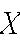
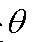

         Acrobat Distiller 7.0 (Windows)

         math

         D:20071117104449

         Acrobat PDFMaker 7.0 for Word

         2007-11-18T21:08:03+08:00

         2007-11-18T21:07:38+08:00

         2007-11-18T21:08:03+08:00

         uuid:148e910e-ec54-49ab-8a87-08fd1a53e98d

         uuid:497bf4d9-6d83-43da-9c15-96a50e49427c

               36

         xml

               第9讲

               Administrator

第9讲* 
   区间估计和置信区间 
麻省理工学院 14.30 2006年春季 
Herman Bennett 

22 区间估计 

区间估计是估计参数

θ

的另外一种方法。区间估计是指根据给定概率 

)1(α−

，构造包含参数

θ

真值的一个随机区间。这个区间就被称作置信区间，而概率

)1(α−

则被称为置信水平。 

αθ−=≤≤1)),...,(),...,((11nnXXBXXAP

            (71) 
例22.1. 假设一个来自正态分布总体的随机样本，但两个参数均未知。计算的置信水平为90%（对称的）的置信区间。 

),(2σμN

2σ

注意：这些讲义不一定是自封的。它们只是对讲座的一种补充而不是替代。 

例22.2.假设一个随机样本，来自服从正态分布的总体，参数

),(2σμN

μ

未知，

σ

=2。计算

μ

的置信水平为95%（对称）的置信区间。如果

σ

未知，结果会有怎样的改变？ 

-  随机区间

)96.1,96.1(nXnXσσ+−−−

包含参数

θ

真值的概率为95%。但这并不表明

θ

有95%的概率落在这个区间内，因为

θ

- 不是一个随机变量！ 

23 有用的结论 

  23.1 分布 

t

若一个随机变量

X

服从分布

t

，其中参数

ν

&gt;0(自由度)。

X

的概率密度函数为： 

)5.02))((1(11)2()21()(:)(~2++Γ+Γ=νννπννννxxftX

           (72) 
其中

∞&lt;&lt;∞−x

且

ν

是正整数。 
设和是相互独立的随机变量。那么，随机变量服从自由度为的分布。 

)1,0(~NX

2~nXZ

H

n

t

)(~/ntnZXH=

                       (73) 

-   关于0点呈对称分布，可得

nanatt,2/1,2/−−=

- 。 

-   当。（见附图和附表） 

,()(0,1)ntnN→∞   →

例23.1.重要结论：若一个随机样本服从正态分布，那么，

)1(~)(−−−ntSXnμ

。证明这个结论。 

23.2 F分布 

随机变量

X

服从

F

分布，其中，参数

0&gt;ν

且

0&gt;ν

，X的概率密度函数为： 

11121212(/21)(/2)1(,)12(/2/2)12122()2~:(,)()()()(1())22vvvvvvvxXFfxvvvvvvxvνν−++Γ=ΓΓ+

，     (74) 
其中，

∞&lt;&lt;x0

且是正整数。 

iv

设是两个独立的随机变量，其中，

Z和X

2~nXχ

，

2~mZχ

。那么，随机变量G服从自由度为和的

n

m

F

分布。 

(,)/~/nmXnG

F

                   (75) 

24 构造

θ

的置信区间 

下面分析参数θ在给定有限信息的五种情形。针对每一种情形，研究如何构造置信区间。 

24.1 情形1：已知 

)(Var))(,(~^^^θθθθ且VarN

我们刚讲解的例22.2就是这种情形的一个例子。注意：在例子中，并且因为

^^,X==θμθ

σ

已知，也已知。 

)(Var^θ

24.2 情形2：未知 

)(Var))(,(~^^^θθθθ且VarN

例24.1. 假定如例22.2一样中的一个正态随机样本，但现在

2σμ和

都未知。构造

μ

的置信水平为95%的置信区间。 

24.3 情形3：不服从正态分布，但概率密度函数已知 

^θ

我们刚讲解的例22.1就是这种情形的一个例子。注意：在例子中， 的概率密度函数已知（密度函数为的函数），且仅取决于一个参数，。 

2^2,S==θσθ

^θ

^θ

2σ

24.4  情形4：不服从正态分布，概率质量/密度函数未知，且&gt;30 

^θ

n

例24.2. 设一个容量为n的随机样本来自一个总体，且未知。构造

)(xf

)(xf

)(iXE=μ

置信水平为99%的一个置信区间。 

24.5情形5：不服从正态分布，概率质量/密度函数未知，且&lt;30 

^θ

n
